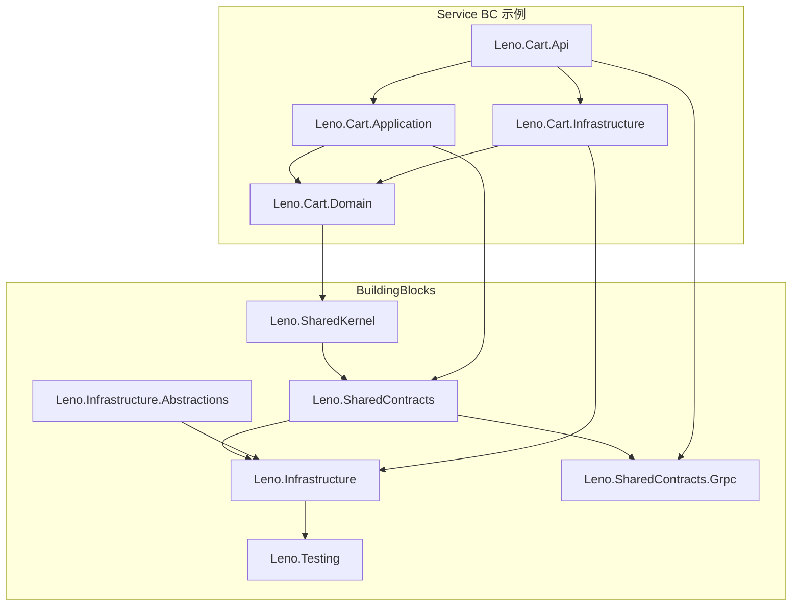

# 第 1 章 项目概览

## 学习目标

读完本章你将：

- 理解 Leno 电商平台的业务定位与 4 类角色
- 掌握技术栈全景与各组件用途
- 熟悉仓库目录结构与解决方案组织
- 了解开发模式与提交规范

## 适用读者

全角色（开发/运维/产品）

## 术语速查

本章将遇到的术语：

| 术语 | 简释 |
|---|---|
| DDD | 领域驱动设计，将业务逻辑内聚于领域层、通过限界上下文划分系统边界的方法论 |
| BC | 限界上下文，领域模型的显式边界 |
| 微服务 | 将单体拆分为多个独立部署的小服务 |
| BFF | 为前端定制的后端聚合层 |
| SAGA | 跨服务最终一致的长事务模式 |
| RESTful | 基于 HTTP 语义的资源接口风格 |
| SPA | 单页应用，单页面渲染的前端应用 |

---

## 1.1 业务定位

Leno 是一个面向 C 端消费者的 **B2C 电商平台**，业务体量与功能完整度对标淘宝、京东等主流电商系统。平台采用 **微服务**（Microservices，将单体拆分为多个独立部署的小服务，每个服务围绕业务能力构建、独立演进）架构风格，将复杂的电商场景拆分为 11 个限界上下文（BC，Bounded Context，领域模型的显式边界，每个上下文内部拥有独立的聚合、统一语言与持久化模型），并通过 **DDD**（领域驱动设计，将业务逻辑内聚于领域层、通过限界上下文划分系统边界的方法论）方法对业务进行建模。

### 1.1.1 平台角色

Leno 平台共服务 4 类核心角色：

| 角色 | 英文 | 主要场景 |
|---|---|---|
| 买家 | B2C Consumer | 浏览商品、下单、支付、收货、评价、售后 |
| 卖家 | Seller | 商品上下架、订单履约、店铺运营、促销参与 |
| 运营 | Operation | 商品审核、营销活动、优惠券发放、数据看板 |
| 系统管理员 | Admin | 用户/权限管理、系统配置、监控告警、运维操作 |

不同角色通过 **BFF**（Backend for Frontend，为前端定制的后端聚合层，避免前端直接对接多个微服务）层接入。BFF 位于 API Gateway 内部，针对不同端的查询需求做聚合裁剪，避免前端 SPA（Single Page Application，单页应用，单页面渲染的前端应用，通过 JS 动态切换视图）发起 N+1 次请求。

### 1.1.2 核心业务目标

平台围绕 8 项核心业务目标构建：

1. **商品管理**：支持 SPU/SKU 多级建模、类目树、属性模板、上下架。
2. **订单交易**：覆盖购物车 → 下单 → 履约 → 关单全生命周期，订单状态机驱动。
3. **支付结算**：对接第三方支付，维护支付单与对账记录，保证最终一致。
4. **营销促销**：优惠券、满减、限时活动、促销规则引擎。
5. **用户中心**：账户、地址、OAuth2 第三方登录、个人资料。
6. **积分会员**：消费产生积分、积分账户、会员等级权益。
7. **评价售后**：商品评价、退换货售后单、SAGA（跨服务最终一致的长事务模式，将长事务拆为一串本地事务+补偿动作）编排跨 BC 流程。
8. **店铺运营**：卖家开店、店铺资质、店铺商品关联、店铺评分。

### 1.1.3 业务术语表

| 术语 | 全称 | 简释 |
|---|---|---|
| SPU | Standard Product Unit | 标准化产品单元，商品的最小可售单位集合，例如"iPhone 16" |
| SKU | Stock Keeping Unit | 库存计量单位，商品的最小可售单位，例如"iPhone 16 256GB 黑色" |
| 订单状态机 | Order State Machine | 订单从创建到完成的流转状态，例如 Created → Paid → Shipped → Completed |
| 支付单 | Payment | 支付流水，对应一次支付请求，与订单为 1:N 关系（允许多次支付尝试） |
| 积分 | Points | 用户消费获得的奖励点数，可用于抵扣或兑换 |
| 优惠券 | Coupon | 促销凭证，满足条件后抵扣订单金额 |
| 会员等级 | Membership Level | 基于积分或消费额的用户分级，对应不同权益 |
| 售后单 | AfterSales | 退换货请求，关联原订单与商品 |
| 评价 | Review | 商品评价，含评分、文字、图片 |
| 店铺 | Shop | 卖家经营主体，关联商品与卖家 |

### 1.1.4 接口风格

对外 HTTP 接口遵循 **RESTful**（基于 HTTP 语义的资源接口风格，使用 HTTP 动词表达操作、URL 表达资源）风格，例如：

- `GET /api/products/{id}` 查询商品详情
- `POST /api/orders` 创建订单
- `PUT /api/carts/items/{itemId}` 更新购物车项
- `DELETE /api/users/addresses/{addressId}` 删除地址

服务间内部通信同时提供 HTTP 与 gRPC 双轨通道，详见第 5 章。

---

## 1.2 技术栈全景图

Leno 技术栈围绕 .NET 生态构建，配套主流中间件与可观测性组件。下表为 9 类技术栈全景：

| 类别 | 技术 | 用途 |
|---|---|---|
| 后端 | .NET 10 / C# 13 | 主业务服务运行时与编程语言 |
| 数据 | SQL Server / EF Core | 持久化存储与 ORM |
| 缓存 | Redis | 性能优化（缓存、布隆过滤器、分布式锁、限流计数） |
| 消息 | RabbitMQ / MassTransit | 异步解耦（事件总线、Outbox 投递、读模型同步） |
| 搜索 | Elasticsearch | 商品/订单检索、读模型投影 |
| 网关 | YARP | 反向代理 + JWT 验签 + BFF 聚合 |
| 服务发现 | Consul | 服务注册 + 配置中心（Consul KV） |
| 可观测性 | OpenTelemetry + Serilog + Jaeger + Prometheus + Grafana | 三支柱（日志/追踪/指标） |
| 部署 | Docker / Helm / K8s | 容器化编排与发布 |

### 1.2.1 后端运行时

- **.NET 10**：开源跨平台运行时，提供 AOT 编译改进、新 BCL 类型、JIT 性能优化。Leno 选用 `net10.0` 作为统一 `TargetFramework`（见 `Directory.Build.props`）。
- **C# 13**：伴随 .NET 10 发布的语言版本，启用 `latest` LangVersion，支持 `params` 集合增强、`field` 上下文关键字等新特性。

### 1.2.2 数据访问

- **SQL Server**：主存储关系数据库，每个 BC 独立数据库，避免跨 BC 共享表。
- **EF Core**（Entity Framework Core）：.NET 官方 ORM（对象关系映射框架，将数据库表映射为 .NET 对象），采用 Code First（代码先行）模式 + Fluent API 配置实体映射，迁移脚本位于 `scripts/migrations/`。

### 1.2.3 缓存与高性能

- **Redis**：基于内存的高性能键值存储，支持字符串、哈希、列表、集合、有序集合、流、布隆过滤器（RedisBloom 模块）等数据结构。Leno 用 Redis 实现：
  - 热点数据缓存（商品详情、用户信息）
  - 布隆过滤器防止缓存穿透
  - 分布式锁防止缓存击穿与并发冲突
  - 限流计数器（API Gateway 速率限制）
  - JWT 黑名单（用户登出后令牌即时失效）

### 1.2.4 消息中间件

- **RabbitMQ**：AMQP 协议消息中间件，提供 Topic Exchange 路由、死信队列、消息 TTL、镜像队列等特性。
- **MassTransit**：.NET 消息总线抽象库，封装 RabbitMQ 客户端，提供消费者注册、重试、Outbox 模式集成。

### 1.2.5 搜索与读模型

- **Elasticsearch**：基于 Lucene 的分布式全文检索引擎，用于商品搜索、订单查询、读模型投影。读模型同步通过集成事件消费实现（详见第 6 章）。

### 1.2.6 API 网关

- **YARP**（Yet Another Reverse Proxy）：微软开源的 .NET 反向代理库，Leno 用其实现：
  - 基于 Consul 的服务发现动态路由
  - JWT 验签与黑名单校验
  - 限流、超时、重试、熔断
  - BFF 聚合转发（多个内部服务响应合并）
  - 协议转换（HTTP ↔ gRPC）

### 1.2.7 服务发现与配置

- **Consul**：HashiCorp 出品的服务发现与配置中心工具。Leno 用其实现：
  - 服务注册：每个微服务启动时向 Consul 注册自己的地址与端口
  - 服务发现：YARP 与内部客户端通过 Consul 查询目标服务实例
  - 配置中心：Consul KV 存储运行时配置（如 `UseGrpc` 开关、限流阈值、熔断阈值）

### 1.2.8 可观测性

可观测性三支柱（日志、追踪、指标）全部覆盖：

- **Serilog**：.NET 流行结构化日志库，输出 JSON 格式日志，附带 TraceId/SpanId 上下文。
- **OpenTelemetry**：CNCF 主推的可观测性标准，提供统一 API 采集 traces/metrics/logs。
- **Jaeger**：开源分布式追踪后端，存储与查询 Trace 数据。
- **Prometheus**：时间序列指标数据库，pull 模式采集服务指标。
- **Grafana**：开源指标可视化平台，配置见 `grafana/` 目录。
- **Alertmanager**：Prometheus 告警管理组件，配置见 `alertmanager/alertmanager.yml`。

### 1.2.9 容器化与部署

- **Docker**：容器运行时，每个微服务有独立 `Dockerfile`（如 `src/Services/Cart/Leno.Cart.Api/Dockerfile`）。
- **docker compose**：多容器编排工具，`docker-compose.yml`（项目根目录）一键启动本地全栈依赖与所有服务。
- **Helm**：Kubernetes 包管理工具，部署清单位于 `deploy/helm/leno/`，含 `Chart.yaml` 与 `values-{dev,staging,prod}.yaml` 多环境配置。
- **K8s**（Kubernetes）：容器编排平台，生产环境部署目标，含 Deployment/Service/Ingress/HPA 等资源。

---

## 1.3 仓库目录结构详解

### 1.3.1 顶层目录树

仓库顶层目录组织如下：

```
Leno/
├── src/                    # 源代码
│   ├── BuildingBlocks/     # 共享代码块（共享内核 + 共享契约 + 基础设施）
│   ├── Services/           # 11 个限界上下文的服务实现
│   └── Leno.slnx           # .NET 10 解决方案文件
├── docs/                   # 文档（spec/handbook/runbooks/conventions/contracts/architecture/decisions）
├── deploy/                 # 部署清单（helm / consul-kv-seed）
├── docker-compose.yml      # 一键启动编排（项目根目录）
├── grafana/                # Grafana 仪表盘与数据源配置
├── alertmanager/           # Alertmanager 告警配置
├── scripts/                # 工具脚本（init-consul-kv / migrations / check-placeholders）
├── .github/workflows/      # CI/CD
├── Directory.Build.props   # 全局构建属性
├── Directory.Packages.props # 中央包管理（CPM）
├── mise.toml               # 工具链版本管理
└── USAGE.md                # 快速上手
```

### 1.3.2 `src/BuildingBlocks/` 详解

BuildingBlocks 是跨 BC 共享的代码块，按职责分为 5 个项目：

| 项目 | 职责 | 关键类型 |
|---|---|---|
| `Leno.SharedKernel/` | 领域无关基础类 | `Entity`、`AggregateRoot`、`Money`、`IDomainEvent`、`IUnitOfWork`、`IRepository` |
| `Leno.SharedContracts/` | 跨 BC 共享契约 | `Events/`（集成事件）、`Protos/`（.proto 契约）、`Responses/`（`ApiResponse`、`PageResult`） |
| `Leno.Infrastructure/` | 技术基础设施 | `EF Core`（`BaseDbContext`、`EfCoreUnitOfWork`）、`Redis`（`CacheService`、`RedisBloomFilter`）、`Consul`、`RabbitMQ`（`RabbitMqEventBus`）、`Outbox`（`OutboxMessage`、`OutboxPublisher`）、`AntiCorruption`（`CircuitState`） |
| `Leno.Infrastructure.Abstractions/` | 基础设施抽象接口 | `IBloomFilter`、`ICacheService`、`IEventBus` |
| `Leno.Testing/` | 测试基础设施 | `ContainerFixture`（Testcontainers 启动依赖）、`CrossBcIntegrationTestBase`（跨 BC 集成测试基类）、`DatabaseMigrationTestBase`、`TestDataBuilder` |

实际目录结构（节选）：

```
src/BuildingBlocks/
├── Leno.SharedKernel/
│   ├── Abstractions/
│   │   ├── AggregateRoot.cs
│   │   ├── Entity.cs
│   │   ├── IDomainEvent.cs
│   │   ├── IHasDomainEvents.cs
│   │   ├── IRepository.cs
│   │   └── IUnitOfWork.cs
│   ├── Exceptions/
│   │   └── DomainException.cs
│   ├── ValueObjects/
│   │   ├── Money.cs
│   │   ├── MoneyJsonConverter.cs
│   │   ├── PageRequest.cs
│   │   └── SpecAttribute.cs
│   └── Leno.SharedKernel.csproj
├── Leno.SharedContracts/
│   ├── Events/
│   │   ├── IIntegrationEvent.cs
│   │   ├── IntegrationEventBase.cs
│   │   ├── CartEvents.cs
│   │   ├── OrderEvents.cs
│   │   ├── PaymentEvents.cs
│   │   ├── ProductEvents.cs
│   │   └── ... (12 个 BC 事件)
│   ├── Protos/
│   │   ├── cart.proto
│   │   ├── order.proto
│   │   ├── payment.proto
│   │   ├── product.proto
│   │   └── ... (11 个 .proto 契约)
│   ├── Responses/
│   │   ├── ApiResponse.cs
│   │   └── PageResult.cs
│   ├── buf.yaml
│   ├── buf.gen.yaml
│   └── Leno.SharedContracts.csproj
├── Leno.Infrastructure/
│   ├── AntiCorruption/
│   │   └── CircuitState.cs
│   ├── Auth/
│   │   ├── CurrentUserContext.cs
│   │   ├── GatewayAuthHandler.cs
│   │   ├── InternalApiKeyExtensions.cs
│   │   └── JwtTokenGenerator.cs
│   ├── Caching/
│   │   ├── CacheService.cs
│   │   └── RedisBloomFilter.cs
│   ├── EventBus/
│   │   └── RabbitMqEventBus.cs
│   ├── Outbox/
│   │   ├── OutboxMessage.cs
│   │   ├── OutboxMetrics.cs
│   │   └── OutboxPublisher.cs
│   ├── Persistence/
│   │   ├── BaseDbContext.cs
│   │   └── EfCoreUnitOfWork.cs
│   └── Leno.Infrastructure.csproj
├── Leno.Infrastructure.Abstractions/
│   ├── IBloomFilter.cs
│   ├── ICacheService.cs
│   ├── IEventBus.cs
│   └── Leno.Infrastructure.Abstractions.csproj
├── Leno.SharedContracts.Grpc/
│   └── Generated/  # buf 自动生成的 gRPC 客户端代码
├── Leno.Infrastructure.Tests/
│   ├── GlobalUsings.cs
│   └── StorageTests.cs
└── Leno.Testing/
    ├── Builders/
    │   └── TestDataBuilder.cs
    ├── Fixtures/
    │   ├── ContainerCollection.cs
    │   ├── ContainerFixture.cs
    │   ├── CrossBcIntegrationTestBase.cs
    │   ├── DatabaseMigrationTestBase.cs
    │   └── IntegrationTestBase.cs
    └── Leno.Testing.csproj
```

### 1.3.3 `src/Services/` 详解

`src/Services/` 下按 BC 划分 11 个子目录，每个 BC 子目录的命名规则为 `Leno.{BC}.{层}`，包含 4 个生产层 + 3 个测试项目：

| 层 | 项目后缀 | 职责 |
|---|---|---|
| 领域层 | `Leno.{BC}.Domain` | 聚合根、实体、值对象、领域事件、领域服务、仓储接口 |
| 应用层 | `Leno.{BC}.Application` | 应用服务、命令/查询处理、DTO、FluentValidation 验证器、集成事件消费者 |
| 基础设施层 | `Leno.{BC}.Infrastructure` | 仓储实现、EF Core 配置、DbContext、外部客户端、防腐层实现 |
| 表示层 | `Leno.{BC}.Api` | HTTP Controller、gRPC 端点、Program.cs 组装、Dockerfile |
| 测试-领域 | `Leno.{BC}.Domain.Tests` | 领域层单元测试（聚合根行为、状态机、值对象） |
| 测试-基础设施 | `Leno.{BC}.Infrastructure.Tests` | 基础设施层测试（含集成测试，使用 Testcontainers） |
| 测试-API | `Leno.{BC}.Api.Tests` | API 层测试（Controller、端到端 HTTP 测试） |

11 个 BC 一览（与 README 速查表一致）：

| # | 子目录名 | BC | 端口 |
|---|---|---|---|
| 1 | `Product/` | 商品 | 5101 |
| 2 | `Promotion/` | 促销 | 5102 |
| 3 | `Cart/` | 购物车 | 5103 |
| 4 | `PointsMembership/` | 积分会员 | 5104 |
| 5 | `UserAuth/` | 用户认证 | 5105 |
| 6 | `Order/` | 订单 | 5106 |
| 7 | `Payment/` | 支付 | 5107 |
| 8 | `SellerShop/` | 店铺 | 5108 |
| 9 | `ReviewAfterSales/` | 评价售后 | 5109 |
| 10 | `Notification/` | 通知 | 5110 |
| 11 | `SystemAdmin/` | 系统管理 | (按需) |

> 注：API Gateway（BFF）位于 `src/ApiGateway/Leno.ApiGateway/`，端口 8080，不算入 11 个业务 BC，但作为对外入口独立存在。

### 1.3.4 Cart BC 完整结构示例

以 Cart BC 为例展示一个 BC 的完整目录结构：

```
src/Services/Cart/
├── Leno.Cart.Domain/              # 领域层
│   ├── (聚合根 Cart / 值对象 CartItem / 领域事件)
│   └── Leno.Cart.Domain.csproj
├── Leno.Cart.Application/         # 应用层
│   ├── (Commands / Queries / DTOs / Validators / 消费者)
│   └── Leno.Cart.Application.csproj
├── Leno.Cart.Infrastructure/      # 基础设施层
│   ├── (CartDbContext / Repository / EF Core 配置)
│   └── Leno.Cart.Infrastructure.csproj
├── Leno.Cart.Api/                 # 表示层（HTTP + gRPC 端点）
│   ├── Controllers/
│   │   ├── AnonymousCartsController.cs
│   │   ├── CartControllerBase.cs
│   │   └── CartsController.cs
│   ├── GrpcServices/
│   │   └── CartGrpcService.cs
│   ├── Properties/
│   │   └── launchSettings.json
│   ├── Dockerfile
│   ├── Program.cs
│   ├── appsettings.json
│   └── Leno.Cart.Api.csproj
├── Leno.Cart.Domain.Tests/        # 领域层单元测试
│   └── Leno.Cart.Domain.Tests.csproj
├── Leno.Cart.Infrastructure.Tests/ # 基础设施层测试（含集成测试）
│   └── Leno.Cart.Infrastructure.Tests.csproj
└── Leno.Cart.Api.Tests/           # API 层测试
    ├── CartApiTests.cs
    ├── GlobalUsings.cs
    └── Leno.Cart.Api.Tests.csproj
```

每个 BC 结构一致，差异仅在领域内部模型与对外接口。新人接手新 BC 时，可对照 Cart BC 模板快速定位文件位置。

---

## 1.4 解决方案组织

### 1.4.1 `Leno.slnx` 文件

`Leno.slnx` 是 **.NET 10 引入的新版解决方案文件格式**，XML 简化版，替代传统 `.sln` 文件。相比 `.sln` 的优势：

- **更易读**：纯 XML 结构，无 GUID 噪音（传统 `.sln` 用 GUID 标识项目类型）
- **更易合并**：简洁的 `<Project Path="..." />` 元素，多分支并行开发时合并冲突大幅减少
- **工具兼容**：Visual Studio 2026、`dotnet sln`、JetBrains Rider、VS Code 全部支持

文件顶层为 `<Solution>` 根元素，内部分为多个 `<Folder>` 表示逻辑分组，每个 Folder 下挂 `<Project>` 或子 `<File>`：

```xml
<Solution>
  <Folder Name="/src/BuildingBlocks/">
    <Project Path="src/BuildingBlocks/Leno.SharedKernel/Leno.SharedKernel.csproj" />
    <Project Path="src/BuildingBlocks/Leno.SharedContracts/Leno.SharedContracts.csproj" />
    <Project Path="src/BuildingBlocks/Leno.Infrastructure/Leno.Infrastructure.csproj" />
    <Project Path="src/BuildingBlocks/Leno.Testing/Leno.Testing.csproj" />
    <!-- ... 其他 BuildingBlocks 项目 -->
  </Folder>
  <Folder Name="/src/Services/Cart/">
    <Project Path="src/Services/Cart/Leno.Cart.Domain/Leno.Cart.Domain.csproj" />
    <Project Path="src/Services/Cart/Leno.Cart.Api/Leno.Cart.Api.csproj" />
    <!-- ... 其他 Cart 项目 -->
  </Folder>
  <!-- ... 其他 BC -->
</Solution>
```

### 1.4.2 `Directory.Build.props` 全局构建属性

`Directory.Build.props` 是 MSBuild 约定的全局属性文件，位于仓库根目录，对所有项目生效。Leno 的核心配置：

```xml
<Project>
  <PropertyGroup>
    <TargetFramework>net10.0</TargetFramework>
    <LangVersion>latest</LangVersion>
    <Nullable>enable</Nullable>
    <ImplicitUsings>enable</ImplicitUsings>
    <TreatWarningsAsErrors>false</TreatWarningsAsErrors>
    <AnalysisLevel>latest</AnalysisLevel>
    <AnalysisMode>Recommended</AnalysisMode>
    <EnforceCodeStyleInBuild>true</EnforceCodeStyleInBuild>
    <CoverletOutputFormat>cobertura</CoverletOutputFormat>
    <CoverletOutput>./TestResults/</CoverletOutput>
  </PropertyGroup>

  <!-- 测试包版本变量 -->
  <PropertyGroup>
    <XUnitVersion>2.9.0</XUnitVersion>
    <XUnitRunnerVersion>2.8.2</XUnitRunnerVersion>
    <MoqVersion>4.20.72</MoqVersion>
    <FluentAssertionsVersion>7.0.0</FluentAssertionsVersion>
    <TestContainersVersion>4.0.0</TestContainersVersion>
    <CoverletVersion>6.0.2</CoverletVersion>
    <ReportGeneratorVersion>5.3.8</ReportGeneratorVersion>
    <MassTransitVersion>8.3.6</MassTransitVersion>
    <EntityFrameworkCoreVersion>10.0.0</EntityFrameworkCoreVersion>
  </PropertyGroup>
</Project>
```

关键属性说明：

- `TargetFramework=net10.0`：统一目标框架，所有项目不得单独覆盖
- `Nullable=enable`：开启可空引用类型检查，编译期消除 NullReferenceException
- `ImplicitUsings=enable`：隐式全局 using，常用命名空间（`System`、`System.Collections.Generic`、`System.Linq` 等）自动引入
- `EnforceCodeStyleInBuild=true`：构建期强制代码风格规则
- 测试包版本变量：在 `.csproj` 中通过 `Version="$(XUnitVersion)"` 引用，集中升级

### 1.4.3 `Directory.Packages.props` 中央包管理（CPM）

`Directory.Packages.props` 是 **CPM（Central Package Management，中央包管理）** 机制的约定文件。CPM 是 .NET SDK 内置的包版本集中管理方案，相比传统分散式版本管理（每个 `.csproj` 各自声明版本）的优势：

- **统一版本避免碎片化**：所有项目使用同一个 NuGet 包版本，杜绝"项目 A 用 8.0.0、项目 B 用 8.0.4"的不一致
- **升级一处生效**：升级版本只需修改 `Directory.Packages.props` 一处，所有项目自动应用
- **安全补丁统一推进**：CVE 漏洞修复时，改一处即可全局生效
- **依赖冲突可检测**：SDK 在还原时检测版本冲突并报错

CPM 文件结构示例：

```xml
<Project>
  <PropertyGroup>
    <ManagePackageVersionsCentrally>true</ManagePackageVersionsCentrally>
    <CentralPackageTransitivePinningEnabled>true</CentralPackageTransitivePinningEnabled>
  </PropertyGroup>
  <ItemGroup>
    <PackageVersion Include="MassTransit" Version="8.3.6" />
    <PackageVersion Include="Microsoft.EntityFrameworkCore" Version="10.0.0" />
    <PackageVersion Include="StackExchange.Redis" Version="2.8.16" />
    <!-- ... -->
  </ItemGroup>
</Project>
```

各 `.csproj` 引用包时不再指定版本：

```xml
<ItemGroup>
  <PackageReference Include="MassTransit" />
  <PackageReference Include="Microsoft.EntityFrameworkCore" />
</ItemGroup>
```

> 注：当前 Leno 项目测试包版本变量定义在 `Directory.Build.props`，正式依赖包版本统一由 `Directory.Packages.props`（CPM）管理。两者配合使用：CPM 管第三方包，Build.props 管 MSBuild 属性与版本变量。

### 1.4.4 项目引用规则

项目引用关系遵循"共享内核 → 共享契约 → 基础设施 → 测试"的依赖链，业务 BC 通过引用 BuildingBlocks 复用基础设施。下图展示完整引用关系：



关键依赖规则：

1. **BuildingBlocks 内部链**：`SharedKernel ← SharedContracts ← Infrastructure ← Testing`，依赖单向流动
2. **BuildingBlocks → Services**：业务项目通过 ProjectReference 引用 BuildingBlocks
3. **BC 内四层引用**：
   - `Api → Application → Domain`（表示层依赖应用层，应用层依赖领域层）
   - `Infrastructure → Domain`（依赖倒置：基础设施层依赖领域层的仓储接口，领域层不依赖基础设施层）
4. **Domain 层洁癖**：Domain 层只能引用 `Leno.SharedKernel`，不得引用 `Leno.SharedContracts` 或跨 BC 的 Domain 项目（硬约束 #4，详见 1.5 节）

---

## 1.5 开发模式概览

### 1.5.1 Subagent-Driven 协作开发

Leno 采用 **Subagent-Driven**（主 agent + subagent 协作）开发模式，源自 Trae IDE 的 agentic workflow：

- **主 agent（Main Agent）职责**：
  - 拆分 Task：根据 spec 或 plan，将工作拆为粒度合适的 Task（每个 Task 对应一个 subagent 调用）
  - 派发 Task：将 Task 描述、相关上下文、验收标准传递给 subagent
  - Review：subagent 完成后主 agent review 代码、运行测试、决定是否合并或返工
  - 上下文管理：避免主 agent 上下文膨胀，将实现细节交给 subagent 独立处理

- **Subagent 职责**：
  - 在独立上下文中实现单个 Task
  - 遵循项目约定（命名、分层、测试规范）
  - 完成后向主 agent 报告变更摘要、关键文件、测试结果

优势：主 agent 上下文保持轻量，能持续跟踪多个 Task；subagent 隔离实现细节，避免相互干扰。

### 1.5.2 Conventional Commits 提交规范

Leno 强制遵循 **Conventional Commits**（约定式提交）规范，格式为：

```
type(scope): subject
```

**type 字段**（必填，小写）：

| type | 含义 | 示例 |
|---|---|---|
| `feat` | 新功能 | `feat(cart): 添加购物车项备注字段` |
| `fix` | Bug 修复 | `fix(order): 修复订单状态机死锁` |
| `docs` | 文档变更 | `docs(handbook): 新增第 1 章项目概览` |
| `refactor` | 重构（不改变外部行为） | `refactor(payment): 抽取支付渠道策略` |
| `test` | 测试相关 | `test(product): 补充 SKU 仓储集成测试` |
| `chore` | 杂项（构建、依赖、配置） | `chore(deps): 升级 EF Core 至 10.0.0` |

**scope 字段**（必填）：影响范围，通常是 BC 名称（`cart`/`order`/`product`/`payment`/`promotion`/`points`/`user`/`seller`/`review`/`notification`/`system`/`gateway`/`handbook` 等）。

**subject 字段**（必填）：简明描述，中文，祈使语气，结尾不加句号，长度建议 ≤ 50 字符。

### 1.5.3 PR 模板与 review 流程

PR 模板位于 `.github/pull_request_template.md`，提交 PR 时需描述以下内容：

- **背景**：为什么做这个变更，关联 issue 或 spec
- **变更**：做了什么，列出关键文件与改动点
- **测试**：跑了哪些测试，结果如何，是否新增测试
- **回滚**：如出问题如何回滚（revert 即可？需要数据迁移？）
- **影响**：是否影响其他 BC、对外接口、性能、安全

Review 流程：

1. 提交 PR 自动触发 CI（`.github/workflows/ci.yml`），包含构建、单元测试、集成测试、占位符检查、覆盖率阈值
2. CI 全绿后请求 reviewer review
3. 至少 1 人 review 通过方可合并（关键 BC 建议 2 人）
4. 合并方式推荐 Squash Merge，保留单条 Conventional Commit 消息

### 1.5.4 `scripts/check-placeholders.sh` 占位符检查

`scripts/check-placeholders.sh` 是 CI 必跑脚本，扫描代码与文档中的占位符标记，发现则 CI 失败。检查的占位符包括：

- `TBD`（To Be Determined，待定）
- `TODO`（待办）
- `FIXME`（待修复）
- `XXX`（待优化标记）
- `placeholder`（占位实现）
- `NotImplementedException`（.NET 未实现异常）

设计意图：禁止"先占位后补"的开发习惯污染代码库，所有合并的代码必须是可用实现。

### 1.5.5 11 条硬约束概览

Leno 项目约定 11 条硬性约束，违反则 CI 失败或 review 拒绝：

1. **项目实施遵循依赖链**：`F1 → F2 → F3 → F4 → M1 → M2 → M3 → M4 → M5 → M6`。F1-F4 为 Fast Track（快速通道），M1-M6 为 Slow Track（深度优化），后者依赖前者完成。

2. **所有中间件必须使用 async/await**：禁止 callback 风格（如 `.ContinueWith`、`.Result`、`.Wait()`），统一 `async/await` 异步编程模型，避免 sync-over-async 死锁。

3. **敏感配置必须使用环境变量**：`Jwt:SecretKey`、`InternalAuth:ApiKey`、`ConnectionStrings` 中的密码等敏感配置禁止硬编码或写入 `appsettings.json`，必须通过环境变量注入（容器编排层提供）。

4. **Domain 层不得引用 SharedContracts 或跨 BC Domain 项目**：保证领域层纯洁性，领域层只能引用 `Leno.SharedKernel`，集成事件契约属于应用层关注点。

5. **集成事件不得实现 IDomainEvent；领域事件不得实现 IIntegrationEvent**：两类事件物理隔离，避免领域事件被误发布到消息总线，或集成事件被误聚合到本地事务。

6. **gRPC 与 HTTP 双轨通信**：所有跨 BC 调用同时支持 gRPC 与 HTTP，通过 `UseGrpc` 配置开关切换，gRPC 不可用时自动降级到 HTTP（详见第 5 章与 ADR 0001）。

7. **.proto 扩展只能新增字段**：不得修改或删除已有字段，禁止修改字段编号与类型，由 `buf breaking` 校验。保证向后兼容（详见 ADR 0005）。

8. **熔断器状态必须为 Singleton**：按服务名隔离，DI 生命周期必须为 `Singleton`，避免每个请求独立状态导致熔断失效（详见 ADR 0002）。

9. **gRPC 降级仅触发于基础设施不可用状态码**：仅 `Unavailable`、`DeadlineExceeded`、`Internal`、`ResourceExhausted` 四个状态码触发降级，业务错误（如 `NotFound`、`InvalidArgument`）不降级。

10. **业务层不得感知底层通信路径**：业务层（Application/Domain）不应知道当前是 gRPC 还是 HTTP，通过 `IXxxAntiCorruptionService` 接口隔离，由 Infrastructure 层实现具体通信（详见 ADR 0003）。

11. **所有 Guid 字段在 .proto 中以 string 类型传输**：Protobuf 无原生 Guid 类型，统一使用 `string` 表示，由两端做 `Guid.Parse` / `.ToString()` 转换（详见 ADR 0007）。

> 注：ADR（Architecture Decision Record，架构决策记录）位于 `docs/decisions/`，每条硬约束对应一个 ADR 文档，详细记录决策背景、备选方案、取舍理由。

---

## 要点回顾

- Leno 是 B2C 电商平台，4 类角色（买家/卖家/运营/系统管理员），8 项核心业务目标
- 技术栈：.NET 10 + SQL Server + Redis + RabbitMQ + Elasticsearch + YARP + Consul + OpenTelemetry + Helm
- 仓库分 src/BuildingBlocks（共享代码）+ src/Services（11 BC）+ docs + deploy + grafana + scripts
- 解决方案用 .NET 10 新版 .slnx 格式 + Directory.Build.props 统一属性 + CPM 中央包管理
- 开发模式：Subagent-Driven + Conventional Commits + PR 模板 + check-placeholders.sh + 11 条硬约束

## 常见问题

**Q1：为什么选择 .NET 10 而不是 .NET 8 LTS？**
A：Leno 拥抱最新技术栈，.NET 10 提供了 AOT 改进、新 BCL 类型、性能优化等。生产环境可等 .NET 10 LTS 发布后升级。

**Q2：为什么用 .slnx 而不是 .sln？**
A：.slnx 是 .NET 10 引入的新版解决方案文件格式，XML 简化版，更易读易合并，避免 .sln 的 GUID 噪音。

**Q3：11 个 BC 是否太多？**
A：每个 BC 对应一个独立的业务能力，独立部署独立扩缩容。BC 数量与团队规模和业务复杂度匹配。

**Q4：CPM 中央包管理有什么好处？**
A：统一版本避免碎片化，升级只需改一处，便于安全补丁统一推进。

**Q5：Subagent-Driven 模式如何运作？**
A：主 agent 拆分 Task 并派发给 subagent，subagent 完成后主 agent review，通过后合并。每个 subagent 独立上下文，避免主 agent 上下文膨胀。

## 下一章衔接

第 2 章将介绍本地环境搭建，包括 .NET 10 SDK 安装、docker compose 一键启动、数据库迁移与 Consul KV 初始化。
