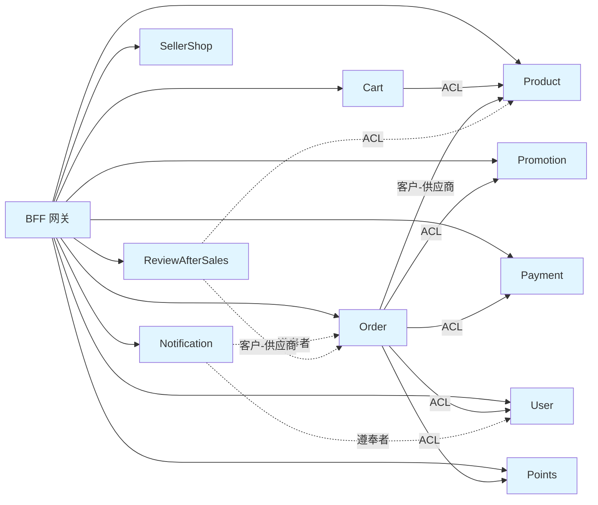
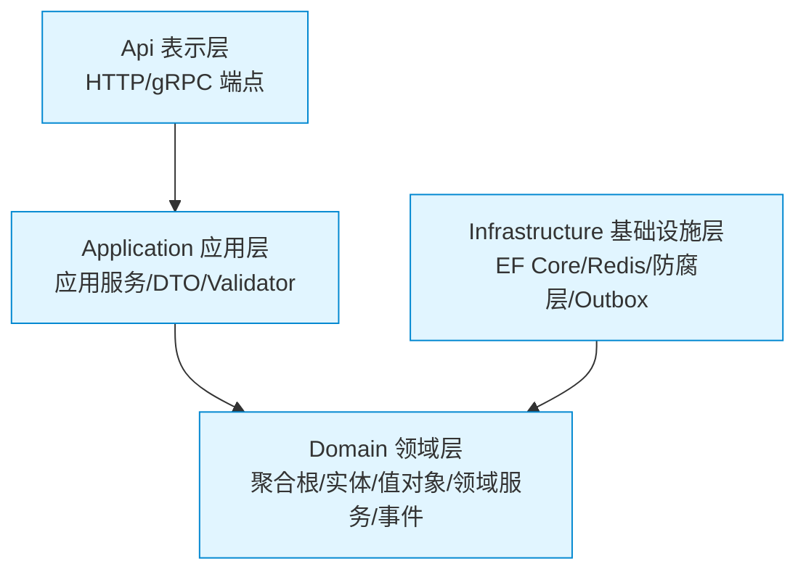
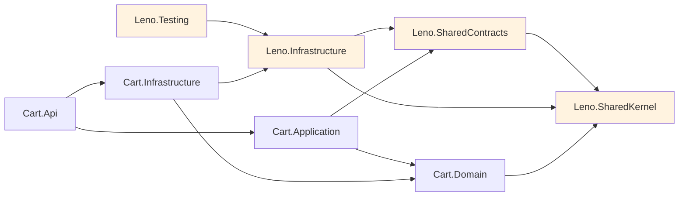
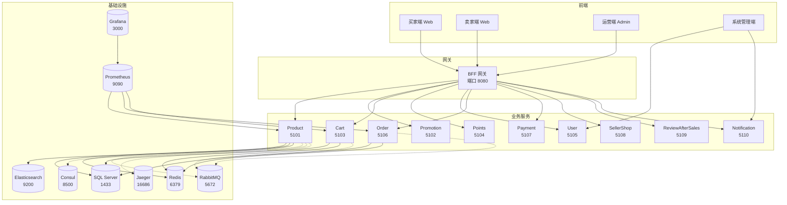

# 第 3 章 架构总览

## 学习目标

读完本章你将：

- 理解 DDD 战略设计：限界上下文与上下文映射
- 掌握 DDD 战术设计 7 个概念与代码映射
- 熟悉 Leno 的 11 个 BC 划分与共享内核
- 理解分层架构、CQRS 读写分离与微服务部署架构

## 适用读者

全角色（开发/运维/产品）

## 术语速查

本章将遇到的术语：

| 术语 | 简释 |
|---|---|
| 限界上下文 | Bounded Context，领域模型的显式边界 |
| 上下文映射 | Context Map，描述 BC 之间关系的图 |
| 共享内核 | Shared Kernel，多 BC 共享的代码与模型 |
| 聚合根 | Aggregate Root，聚合对外唯一入口 |
| 实体 | Entity，有唯一标识的领域对象 |
| 值对象 | Value Object，无标识、不可变、可比较 |
| 领域服务 | Domain Service，跨实体的业务逻辑 |
| 领域事件 | Domain Event，聚合内发生的事实 |
| 集成事件 | Integration Event，跨 BC 传播的事实 |
| 仓储 | Repository，聚合持久化的抽象 |
| 工厂 | Factory，创建复杂聚合 |
| CQRS | 读写职责分离，将写与读分离到不同模型 |
| 防腐层 | ACL，隔离外部模型变化的翻译层 |
| 客户-供应商 | Customer-Supplier，下游依赖上游的关系 |
| 遵奉者 | Conformist，下游完全遵从上游模型的关系 |

## 3.1 DDD 战略设计

### DDD 起源与核心思想

DDD（领域驱动设计，一种将业务逻辑内聚于领域层、通过限界上下文划分系统边界的方法论）由 Eric Evans 在 2003 年提出。核心思想：

- 以业务领域为中心，而非技术
- 通过统一语言（Ubiquitous Language）沟通业务与代码
- 通过限界上下文划分系统边界
- 通过上下文映射描述 BC 间关系

传统分层架构往往以技术分层（UI/BLL/DAL）为核心，业务逻辑散落各层，导致"贫血模型"与"事务脚本"。DDD 反其道而行，把业务概念与规则内聚到领域层，让代码与业务语言一一对应，使系统在面对业务演进时具有更高的可维护性。

### 限界上下文概念

限界上下文（BC，Bounded Context，领域模型的显式边界，每个上下文内部拥有独立的聚合、统一语言与持久化模型）。一个 BC 内的领域模型是自治的，不与其他 BC 共享聚合根。

限界上下文的核心特征：

1. **模型自治**：BC 内的模型（实体、值对象、聚合根）只在本 BC 内有意义，跨 BC 不共享。
2. **统一语言**：BC 内的术语在代码、文档、沟通中保持一致，例如 Order BC 中的"Order"与 Cart BC 中的"Order"可以是不同的概念。
3. **持久化独立**：每个 BC 拥有独立的数据库或表空间，避免跨 BC 的数据库耦合。
4. **边界清晰**：BC 之间通过明确的接口（API/事件）通信，不直接访问对方的内部模型。

划分 BC 的常用方法：按业务子域划分、按语言边界划分、按团队职责划分。Leno 采用按业务子域划分，每个子域对应一个 BC。

### Leno 的 11 个 BC 划分表

| # | 中文 | 英文 | 职责 | 主要聚合根 | 服务端口 |
|---|---|---|---|---|---|
| 1 | 商品 | Product | SPU/SKU 管理、上下架 | Product/Sku | 5101 |
| 2 | 促销 | Promotion | 优惠券/活动 | Promotion/Coupon | 5102 |
| 3 | 购物车 | Cart | 购物车 | Cart | 5103 |
| 4 | 积分 | Points | 积分账户/会员等级 | PointsAccount | 5104 |
| 5 | 用户 | User | 账户/地址/OAuth2 | User | 5105 |
| 6 | 订单 | Order | 订单交易 | Order | 5106 |
| 7 | 支付 | Payment | 支付单/对账 | Payment | 5107 |
| 8 | 店铺 | SellerShop | 卖家店铺 | Shop | 5108 |
| 9 | 评价售后 | ReviewAfterSales | 评价/售后单 | Review/AfterSales | 5109 |
| 10 | 通知 | Notification | 消息推送 | Notification | 5110 |
| 11 | 网关 | BFF | 聚合 + JWT 验签 | （无聚合） | 8080 |

11 个 BC 的划分遵循"高内聚低耦合"原则，每个 BC 对应一个明确的业务子域。其中 BFF（Backend For Frontend）网关不算严格意义上的 BC，它没有独立业务领域，仅做请求聚合与 JWT 验签。

### 上下文映射概念

上下文映射（Context Map，DDD 中描述 BC 之间关系的图）。

上下文映射的作用：

1. **显式化关系**：把 BC 之间隐式依赖显式化为图，便于团队沟通与评审
2. **明确翻译策略**：定义 BC 间通信时是否做模型翻译（防腐层 vs 直接消费）
3. **指导集成实现**：选择 REST/gRPC/事件驱动等集成方式
4. **识别风险**：发现过度耦合或循环依赖

### Leno 的 6 类上下文映射关系详解

1. **共享内核（Shared Kernel）**：多 BC 共享的代码与模型，变更需所有 BC 同意。Leno 实例：`Leno.SharedKernel` 项目（Entity/AggregateRoot/Money/IUnitOfWork 等基础类）。

2. **客户-供应商（Customer-Supplier）**：下游（客户）依赖上游（供应商）的服务，双方协商接口。Leno 实例：Order（客户）依赖 Product（供应商）的 internal API 查询 SKU 信息。

3. **遵奉者（Conformist）**：下游完全遵从上游模型，无协商能力。Leno 实例：Notification 完全遵奉 User/Order 的事件 schema，不做转换。

4. **防腐层（ACL，Anti-Corruption Layer）**：下游通过翻译层隔离上游模型变化。Leno 实例：Cart 通过 `ProductSnapshotAntiCorruptionService` 隔离 Product 的模型变化。

5. **开放主机服务（OHS）+ 发布语言（PL）**：上游对外提供标准化接口与契约。Leno 实例：11 个 BC 的 Internal API（REST + .proto）。

6. **各行其道（Separate Ways）**：BC 之间无关系。Leno 实例：暂无（所有 BC 都有联系）。

### 上下文映射图



图中实线表示同步调用（REST/gRPC），虚线表示异步事件订阅。BFF 作为统一入口向所有 BC 发起请求；Cart/Order 通过 ACL 或客户-供应商关系访问 Product；Notification 通过事件订阅遵奉 Order/User 的事件 schema；ReviewAfterSales 与 Order 是客户-供应商关系，与 Product 通过 ACL 隔离。

## 3.2 DDD 战术设计

### 7 个战术概念 + 代码映射表

| 概念 | 定义 | Leno 中的代码示例 |
|---|---|---|
| 实体（Entity） | 有唯一标识的领域对象，标识不变 | `Cart.Item` |
| 值对象（Value Object） | 无标识、不可变、可比较 | `Money`、`Address` |
| 聚合根（Aggregate Root） | 聚合对外唯一入口 | `Cart : AggregateRoot` |
| 领域服务（Domain Service） | 跨实体的业务逻辑 | `ICartPriceService` |
| 领域事件（Domain Event） | 领域内发生的事实 | `SkuAddedToCartEvent` |
| 仓储（Repository） | 聚合的持久化抽象 | `ICartRepository` |
| 工厂（Factory） | 创建复杂聚合 | `Cart.Create()` 静态工厂 |

战术设计是 DDD 在代码层面的具体实现，7 个概念对应 7 类代码结构。掌握这些概念的映射关系，就能在 Leno 代码库中快速定位业务逻辑。

### Leno 的聚合根示例代码

来自 [Cart.cs#L31-L91](file:///c:/Users/Junjie/.trae-cn/worktrees/Leno/feat-project-optimization-plan-O7ECNx/src/Services/Cart/Leno.Cart.Domain/Aggregates/Cart.cs)：

```csharp
public sealed class Cart : AggregateRoot
{
    private readonly List<CartItem> _items = new();

    public Guid UserId { get; private set; }

    public IReadOnlyCollection<CartItem> Items => _items.AsReadOnly();

    private Cart(Guid id) : base(id) { }

    // 工厂方法：确保不变量
    public static Cart Create(Guid cartId, Guid userId)
    {
        if (userId == Guid.Empty)
            throw new ArgumentException("UserId 不可为空", nameof(userId));
        return new Cart(cartId == Guid.Empty ? Guid.NewGuid() : cartId)
        {
            UserId = userId
        };
    }

    // 行为方法：封装状态变更
    public void AddItem(Guid skuId, int quantity, Guid sellerId)
    {
        if (quantity <= 0 || quantity > 99)
            throw new CartDomainException("购买数量须在 1-99 之间", "CART_QUANTITY_INVALID");

        var existing = _items.FirstOrDefault(i => i.SkuId == skuId);
        if (existing is not null)
        {
            var merged = existing.Quantity + quantity;
            if (merged > 99)
                throw new CartDomainException("购买数量超出上限", "CART_QUANTITY_LIMIT");
            existing.SetQuantity(merged);
            return;
        }

        var item = new CartItem(Id, skuId, quantity, sellerId);
        _items.Add(item);
        AddDomainEvent(new SkuAddedToCartEvent(Id, skuId));
    }
}
```

这段代码体现了 DDD 战术设计的多个要点：

- **聚合根**：`Cart` 继承 `AggregateRoot`，对外提供唯一入口
- **工厂方法**：`Create` 静态工厂确保 `UserId` 不为空，保证不变量
- **行为方法**：`AddItem` 封装状态变更，校验数量范围（1-99）并合并重复 SKU
- **领域事件**：添加新 SKU 时发布 `SkuAddedToCartEvent`，通知其他 BC
- **领域异常**：校验失败抛出 `CartDomainException`，携带错误码 `CART_QUANTITY_INVALID`
- **私有构造**：构造函数私有，强制通过工厂方法创建，避免外部直接 new

### 4 条聚合设计原则详解

1. **一致性边界**：聚合内强一致，聚合间最终一致。Cart 聚合内的 Items 与 Cart 同事务，但 Cart 与 Product 跨聚合只能通过事件最终一致。

2. **引用其他聚合用 ID，不用对象引用**：CartItem 引用 Product 的 SkuId（Guid），不持有 Product 对象引用。

3. **跨聚合操作用领域事件，不用直接调用**：Cart 添加商品后发布 `SkuAddedToCartEvent`，其他 BC 监听该事件做后续处理，Cart 不直接调用 Product BC。

4. **单次事务只修改一个聚合**：一次请求中只持久化一个聚合根，避免跨聚合事务。

### 反例对比

- 错误：聚合过大（如把 Order + OrderItem + Product + User 都放在一个聚合）→ 一致性边界模糊，性能差
- 正确：Order 聚合只含 OrderItem，引用 ProductId/UserId

- 错误：跨聚合事务（一个事务修改 Order 和 Inventory）→ 锁竞争，可用性差
- 正确：Order 修改后发布事件，Inventory 监听事件扣减

聚合设计是 DDD 战术设计中最容易出错的部分。新手常犯的错误是"聚合过大"（把所有相关对象都塞进一个聚合）和"跨聚合事务"（在一个事务中修改多个聚合）。遵循上述 4 条原则可以避免大部分问题。

## 3.3 共享内核

### 共享内核概念

共享内核（Shared Kernel，多个 BC 共享的代码与模型，变更需所有 BC 同意）。共享内核是一把双刃剑：减少重复代码，但增加耦合。

共享内核的适用场景：

- 多个 BC 都需要的基础抽象类（如 Entity/AggregateRoot）
- 跨 BC 通用值对象（如 Money/Address）
- 通用工具类（如时间提供器、ID 生成器）

不适用场景：

- 业务模型（Order/Cart/Product 等聚合根绝不放共享内核）
- BC 特有的领域服务
- 业务相关的 DTO

### `Leno.SharedKernel` 项目结构

```
src/BuildingBlocks/Leno.SharedKernel/
├── Abstractions/
│   ├── Entity.cs                    # 实体基类（Id + equality）
│   ├── AggregateRoot.cs             # 聚合根基类（含 DomainEvents）
│   ├── IRepository.cs               # 仓储根接口
│   ├── IUnitOfWork.cs               # 工作单元接口
│   ├── IDomainEvent.cs              # 领域事件标记接口
│   └── IIntegrationEvent.cs         # 集成事件标记接口
├── ValueObjects/
│   ├── Money.cs                     # 金额值对象（Amount + Currency）
│   ├── Address.cs                   # 地址值对象
│   └── Email.cs                     # 邮箱值对象
└── Exceptions/
    └── DomainException.cs           # 领域异常基类（含 ErrorCode）
```

AggregateRoot 基类代码示例（来自 [AggregateRoot.cs](file:///c:/Users/Junjie/.trae-cn/worktrees/Leno/feat-project-optimization-plan-O7ECNx/src/BuildingBlocks/Leno.SharedKernel/Abstractions/AggregateRoot.cs)）：

```csharp
public abstract class AggregateRoot : Entity, IHasDomainEvents
{
    private readonly List<IDomainEvent> _domainEvents = new();

    public IReadOnlyCollection<DomainEvent> DomainEvents => _domainEvents.AsReadOnly();

    public void ClearDomainEvents() => _domainEvents.Clear();

    protected void AddDomainEvent(IDomainEvent domainEvent)
    {
        _domainEvents.Add(domainEvent);
    }
}
```

AggregateRoot 基类提供三个核心能力：

1. **领域事件收集**：通过 `AddDomainEvent` 在聚合方法中累积事件
2. **事件清空**：`ClearDomainEvents` 在持久化成功后清空，避免重复发布
3. **事件只读暴露**：`DomainEvents` 只读集合，外部只能读取不能修改

### 共享内核使用规则

- 只放真正跨 BC 共享的代码（如基础抽象类、值对象）
- 业务模型绝不放共享内核（如 Order/Cart/Product）
- 变更需所有 BC 同意，避免单方面修改导致其他 BC 编译失败

变更共享内核的流程：

1. 提议：在团队评审会议上提出变更需求与影响范围
2. 评审：所有 BC 负责人评审变更，确认无破坏性
3. 实施：在 `Leno.SharedKernel` 项目中修改，运行所有 BC 的单元测试
4. 发布：通过 CI/CD 构建新版本 NuGet 包，所有 BC 升级引用

### 共享契约 vs 共享内核的区别

| 项 | 共享内核（SharedKernel） | 共享契约（SharedContracts） |
|---|---|---|
| 内容 | 代码（实现） | DTO/Event schema（无实现） |
| 用途 | 基础类复用 | 跨 BC 数据契约 |
| 变更频率 | 低 | 中（随业务演进） |
| Leno 实现 | `Leno.SharedKernel` | `Leno.SharedContracts` |

`Leno.SharedContracts` 结构：

```
src/BuildingBlocks/Leno.SharedContracts/
├── Events/           # 集成事件契约（如 OrderCreatedEvent）
├── Grpc/             # gRPC 生成代码（11 个 BC 的 .proto 生成）
├── Dtos/             # 跨 BC 共享 DTO
└── Responses/        # ApiResponse<T> 等通用响应
```

两者区别的本质：共享内核是"代码共享"（实现共享），共享契约是"契约共享"（schema 共享）。共享契约只定义数据结构（DTO/Event），不含业务逻辑，BC 间通过共享契约通信但不共享实现。

## 3.4 分层架构

### 分层架构概念

分层架构（Layered Architecture，将系统按职责分为多个层，每层只与直接下层交互）。Leno 采用 4 层架构。

分层架构的核心原则：

- **每层职责单一**：每层只负责一类职责，避免职责混杂
- **向下依赖**：上层依赖下层，下层不依赖上层
- **依赖倒置**：基础设施层依赖领域层的抽象（而非反过来）
- **跨层禁止**：不允许跨层调用（如 Api 直接调用 Infrastructure）

### Leno 四层架构图



### 每层职责详解

- **Api（表示层）**：HTTP/gRPC 端点、DTO、Controller、Validator、Program.cs。负责协议适配，不含业务逻辑。
- **Application（应用层）**：应用服务、DTO、接口、编排领域对象。负责用例编排，不含业务规则。
- **Domain（领域层）**：聚合根、实体、值对象、领域服务、领域事件、仓储接口。负责业务规则，最核心。
- **Infrastructure（基础设施层）**：EF Core 实现、Redis、防腐层、消息消费者、Outbox。负责技术实现，依赖 Domain 抽象。

每层目录结构示例（以 Cart BC 为例）：

```
src/Services/Cart/
├── Leno.Cart.Api/              # 表示层
│   ├── Controllers/            # HTTP 端点
│   ├── Protos/                 # gRPC .proto
│   └── Program.cs              # 入口
├── Leno.Cart.Application/      # 应用层
│   ├── Abstractions/           # ICartAppService 接口
│   ├── Dtos/                   # CartDto 等
│   └── Validators/             # FluentValidation 校验
├── Leno.Cart.Domain/           # 领域层
│   ├── Aggregates/             # Cart 聚合根
│   ├── Entities/               # CartItem 实体
│   ├── ValueObjects/           # 购物车相关值对象
│   ├── Services/               # ICartPriceService 领域服务
│   ├── Events/                 # SkuAddedToCartEvent
│   └── Repositories/           # ICartRepository 接口
└── Leno.Cart.Infrastructure/   # 基础设施层
    ├── Repositories/           # EfCoreCartRepository
    ├── EntityConfigurations/   # EF Core 映射
    ├── AntiCorruption/         # ProductSnapshotAntiCorruptionService
    └── Consumers/              # 集成事件消费者
```

### 依赖方向规则

- Api → Application → Domain（向下依赖）
- Infrastructure → Domain（依赖倒置，实现 Domain 定义的接口）

### 依赖倒置原则（DIP）

依赖倒置原则（DIP，Dependency Inversion Principle，高层模块不依赖低层模块，二者都依赖抽象；抽象不依赖细节，细节依赖抽象）。

Leno 实例：Domain 层定义 `ICartRepository` 接口，Infrastructure 层实现 `EfCoreCartRepository`。Domain 不依赖 EF Core，依赖自己定义的抽象。

依赖倒置的好处：

1. **可测试**：Domain 层不依赖具体技术，可 Mock Repository 做单元测试
2. **可替换**：EF Core 可替换为 Dapper 或其他 ORM，Domain 不变
3. **解耦**：Domain 不被技术细节污染，专注业务规则

### 项目引用关系图



图中橙色节点为 BuildingBlocks（跨 BC 共享的基础项目），白色节点为 Cart BC 的 4 层项目。引用关系严格遵循依赖方向规则与依赖倒置原则。

## 3.5 CQRS 读写分离

### CQRS 概念

CQRS（Command Query Responsibility Segregation，命令查询职责分离，将写操作与读操作分离到不同模型）。传统架构读写共用一个模型，CQRS 拆分为 Command 侧（写）与 Query 侧（读）。

CQRS 的核心动机：

- **写模型**：关注业务规则与一致性，使用聚合根 + 仓储 + 关系型 DB
- **读模型**：关注查询性能与展示，使用扁平 DTO + 搜索引擎/缓存
- **分离收益**：写侧优化一致性，读侧优化性能，互不影响

### Leno 的 CQRS 实现

- **Command 侧**：聚合根 + AppService + Repository（基于 EF Core），负责业务写入
- **Query 侧**：`IQueryHandler<,>` + ReadModelAccessor（基于 Elasticsearch），负责查询读取

### `IQueryHandler<TQuery, TResult>` 接口示例

来自 [IQueryHandler.cs](file:///c:/Users/Junjie/.trae-cn/worktrees/Leno/feat-project-optimization-plan-O7ECNx/src/BuildingBlocks/Leno.Infrastructure.Abstractions/Cqrs/IQueryHandler.cs)：

```csharp
public interface IQueryHandler<in TQuery, TResult> where TQuery : class
{
    Task<TResult> HandleAsync(TQuery query, CancellationToken ct = default);
}
```

接口设计要点：

- **泛型约束**：`in TQuery` 逆变（输入），`TResult` 协变（输出）
- **异步**：`Task<TResult>` + `CancellationToken` 支持取消
- **零依赖**：不依赖 MediatR 或其他 Mediator 库，纯接口

### DI 反射注册

来自 [QueryHandlerExtensions.cs](file:///c:/Users/Junjie/.trae-cn/worktrees/Leno/feat-project-optimization-plan-O7ECNx/src/BuildingBlocks/Leno.Infrastructure/Cqrs/QueryHandlerExtensions.cs)：

```csharp
public static IServiceCollection AddQueryHandlers(
    this IServiceCollection services, Assembly assembly,
    ServiceLifetime lifetime = ServiceLifetime.Scoped)
{
    var handlerType = typeof(IQueryHandler<,>);
    var handlers = assembly.GetTypes()
        .Where(t => t.IsClass && !t.IsAbstract)
        .Select(t => new
        {
            Implementation = t,
            Contracts = t.GetInterfaces()
                .Where(i => i.IsGenericType && i.GetGenericTypeDefinition() == handlerType)
        })
        .Where(x => x.Contracts.Any());

    foreach (var handler in handlers)
        foreach (var contract in handler.Contracts)
            services.Add(new ServiceDescriptor(contract, handler.Implementation, lifetime));

    return services;
}
```

注册机制：

- **反射扫描**：通过 `Assembly.GetTypes()` 扫描所有实现 `IQueryHandler<,>` 的类
- **多契约支持**：一个 Handler 可能实现多个 `IQueryHandler<,>` 契约，全部注册
- **默认 Scoped**：每个请求创建一个实例，与 EF Core DbContext 生命周期一致
- **零配置**：无需手动注册，新增 Handler 自动发现

### 无 MediatR 说明

Leno 不使用 MediatR（重量级 Mediator 模式库），而是用 DI 反射注册 IQueryHandler，更轻量更直观。

不使用 MediatR 的原因：

1. **依赖更少**：减少一个第三方库，降低供应链风险
2. **更直观**：直接通过 DI 解析 Handler，调用链清晰
3. **性能更好**：无 Mediator 中间层，直接调用
4. **可控性更强**：自定义注册逻辑，灵活调整生命周期

### ReadModel 同步机制

`ReadModelSyncConsumerBase<TEvent, TReadModel>`（双泛型）抽象基类（来自 [ReadModelSyncConsumerBase.cs](file:///c:/Users/Junjie/.trae-cn/worktrees/Leno/feat-project-optimization-plan-O7ECNx/src/BuildingBlocks/Leno.Infrastructure/ReadModel/ReadModelSyncConsumerBase.cs)）：监听集成事件 → 更新 ES 索引。

```csharp
public abstract class ReadModelSyncConsumerBase<TEvent, TReadModel> : IConsumer<TEvent>
    where TEvent : class, IIntegrationEvent
    where TReadModel : class
{
    public async Task Consume(ConsumeContext<TEvent> context)
    {
        var evt = context.Message;
        var (id, indexName, readModel) = await BuildReadModelAsync(evt, context.CancellationToken);
        var success = await Repository.IndexAsync(readModel, id, indexName, context.CancellationToken);
        // ...
    }

    protected abstract Task<(string Id, string IndexName, TReadModel? ReadModel)> BuildReadModelAsync(
        TEvent integrationEvent, CancellationToken ct);
    protected virtual Task<(string Id, string IndexName)?> BuildDeleteActionAsync(...) => ...;
}
```

同步流程：

1. **订阅事件**：Consumer 监听 RabbitMQ 上的集成事件
2. **构建 ReadModel**：子类实现 `BuildReadModelAsync`，从事件中构建 ES 文档
3. **写入 ES**：调用 `Repository.IndexAsync` 写入 Elasticsearch 索引
4. **删除支持**：`BuildDeleteActionAsync` 支持删除场景（如商品下架）

### 既有 Query 方法 `[Obsolete]` 迁移策略

既有 BC 的 AppService 中可能有 Query 方法，迁移到 CQRS 期间标记 `[Obsolete("请使用 IQueryHandler 替代，将在 2026-08-01 移除")]`，过渡期至 2026-08-01。

迁移步骤：

1. **新增 IQueryHandler**：在 `Application/Queries/` 下新建 Handler
2. **标记旧方法**：在 AppService 的 Query 方法上加 `[Obsolete]`
3. **切换调用点**：逐步将 Controller 中的 AppService 调用改为 IQueryHandler
4. **移除旧方法**：2026-08-01 后移除 AppService 中的 Query 方法

## 3.6 微服务部署架构

### 微服务概念

微服务（Microservices，将单体应用拆分为多个独立部署的小服务，每个服务围绕业务能力构建）。

### Leno 11 个微服务独立性

- 独立进程：每个 BC 是独立的 .NET 进程
- 独立数据库：11 个数据库（详见第 6 章 6.1 节）
- 独立部署：各自 Dockerfile + Helm Chart
- 独立扩缩容：HPA 按 CPU/内存自动扩缩

独立性带来四大收益：

1. **技术异构**：每个 BC 可选用最适合的技术栈（虽然 Leno 统一用 .NET）
2. **独立演进**：BC 间无强耦合，可独立迭代发布
3. **故障隔离**：单个 BC 宕机不影响其他 BC
4. **弹性伸缩**：高负载 BC 可独立扩容，避免资源浪费

### 4 类角色端

- **买家端（B2C Web）**：通过 BFF 访问 Product/Cart/Order/Payment/Promotion/Points/ReviewAfterSales/User
- **卖家端（Seller Web）**：通过 BFF 访问 SellerShop/Product/Order
- **运营端（Admin）**：通过 BFF 访问所有 BC
- **系统管理端**：直接访问 User/Notification

4 类角色端对应 4 类用户群体，BFF 根据角色端裁剪接口与数据可见性，避免越权访问。

### 故障隔离原则

单个 BC 宕机不影响其他 BC，通过熔断器（Circuit Breaker）+ 降级实现。例如 Product BC 宕机时，Cart 通过熔断器降级，返回缓存数据或友好错误，不会级联失败。

故障隔离的实现层次：

1. **超时控制**：跨 BC 调用设置超时（默认 3 秒），避免长时间阻塞
2. **熔断器**：失败率达到阈值时熔断，快速返回错误
3. **降级策略**：返回缓存数据/默认值/友好错误，保证核心功能可用
4. **舱壁隔离**：线程池/连接池隔离，避免资源耗尽
5. **重试与退避**：临时故障自动重试，指数退避避免雪崩

## 3.7 模块化部署拓扑图

### 4 类角色端 + 11 个 BC + 8 个基础设施组件全景图



### 部署单元划分

按角色端拆 Helm Chart：

- `buyer-web`：买家端前端 + BFF 配置
- `seller-web`：卖家端前端 + BFF 配置
- `admin-web`：运营端前端 + BFF 配置
- `leno`：11 个 BC + 1 网关（umbrella chart）

umbrella chart 是 Helm 的多 chart 编排能力，`leno` chart 通过 `Chart.yaml` 的 `dependencies` 引用 11 个 BC 的子 chart，实现一键部署整个后端。

### 端口规划表

| 类别 | 端口范围 | 示例 |
|---|---|---|
| 业务 BC | 5101-5110 | Product=5101, Cart=5103 |
| 网关 | 8080 | BFF |
| 数据库 | 1433 | SQL Server |
| 缓存 | 6379 | Redis |
| 消息 | 5672/15672 | RabbitMQ |
| 搜索 | 9200 | Elasticsearch |
| 服务发现 | 8500 | Consul |
| 可观测性 | 16686/9090/3000 | Jaeger/Prometheus/Grafana |

端口规划遵循"业务 BC 占 5101-5110 段，基础设施占独立端口"原则，便于运维识别与防火墙配置。

## 要点回顾

- DDD 战略设计：11 个 BC 划分 + 6 类上下文映射关系（共享内核/客户-供应商/遵奉者/防腐层/OHS+PL/各行其道）
- DDD 战术设计：7 个概念（实体/值对象/聚合根/领域服务/领域事件/仓储/工厂）+ 4 条聚合设计原则
- 共享内核：Leno.SharedKernel（基础抽象类+值对象），与 SharedContracts（DTO/Event schema）区分
- 分层架构：Api → Application → Domain ← Infrastructure，依赖倒置原则
- CQRS：Command 侧（EF Core）+ Query 侧（Elasticsearch），无 MediatR 用 DI 反射注册
- 微服务：11 个独立进程/数据库/部署/扩缩容，4 类角色端，故障隔离

## 常见问题

**Q1：为什么不用 MediatR？**
A：MediatR 是重量级 Mediator 模式库，Leno 用 DI 反射注册 IQueryHandler 更轻量更直观，减少依赖。

**Q2：聚合根为什么不能直接引用其他聚合？**
A：避免对象图过大、锁竞争、跨聚合事务。引用 ID 保持聚合边界清晰，跨聚合用事件最终一致。

**Q3：CQRS 读写分离后数据如何同步？**
A：写侧 DB → Outbox → 集成事件 → ReadModelSyncConsumer → ES 索引。最终一致，延迟通常 < 1 秒。

**Q4：为什么 BFF 不算 BC？**
A：BFF 是聚合层无独立业务领域，不含聚合根，仅做请求聚合与 JWT 验签。

**Q5：共享内核与共享契约何时使用？**
A：共享内核放真正跨 BC 共享的基础代码（Entity/Money），共享契约放跨 BC 数据契约（Event schema/DTO）。业务模型绝不放共享内核。

## 下一章衔接

第 4 章将介绍代码组织与开发模式，包括 BC 内四层项目结构、命名规范、聚合根/AppService/Controller/Repository/测试开发模板。
