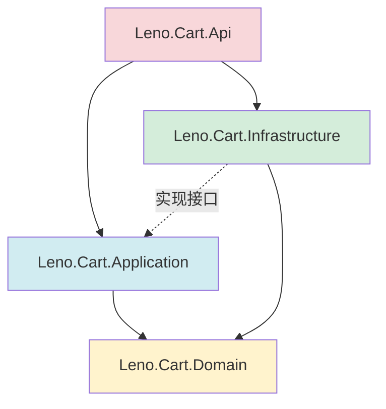
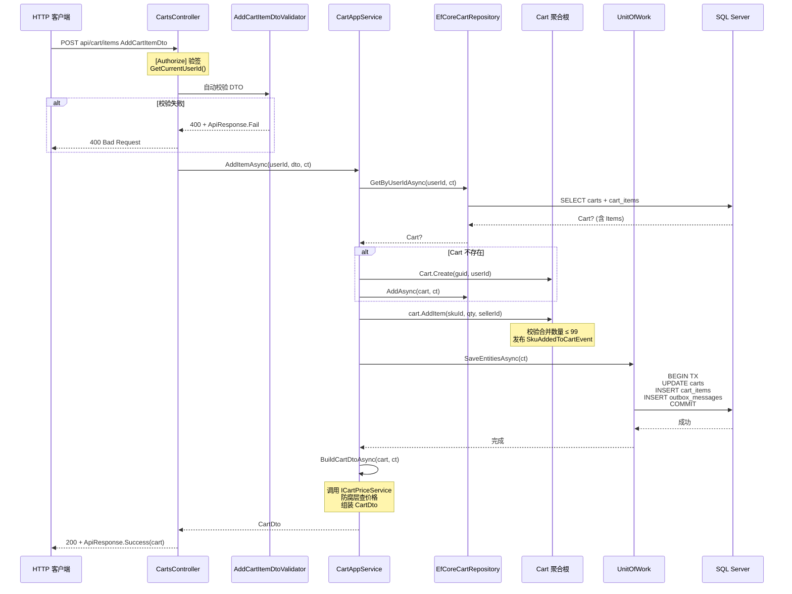
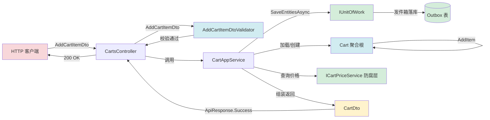
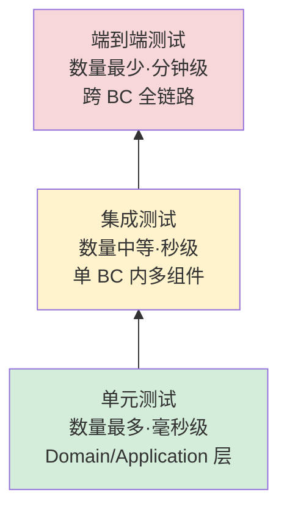

# 第 4 章 代码组织与开发模式

## 学习目标

读完本章你将：

- 掌握 Leno 单个 BC 内 Api/Application/Domain/Infrastructure 四层项目结构与文件归属规则
- 熟练运用命名规范编写接口、类、DTO、异常、错误码、防腐层客户端与 gRPC 服务
- 能够基于聚合根、应用服务、Controller、仓储四类开发模板独立完成一个业务用例的代码
- 熟练使用 xUnit + FluentAssertions + Moq + Testcontainers 编写单元测试与集成测试，并按 Conventional Commits 提交 PR

## 适用读者

开发（需要承担 BC 业务开发任务的 .NET 工程师）

## 术语速查

本章将遇到的术语：

| 术语 | 简释 |
|---|---|
| 分层架构 | Layered Architecture，按职责分层，每层只与直接下层交互 |
| 依赖倒置 | DIP，Dependency Inversion Principle，高层不依赖低层，二者都依赖抽象 |
| DTO | Data Transfer Object，跨层数据传输对象，无业务行为 |
| Validator | 校验器，对 DTO 字段做格式与范围校验的组件 |
| FluentValidation | .NET 强类型验证库，用 LINQ 风格编写校验规则 |
| 单元测试 | Unit Test，对单一类/方法在隔离环境下验证行为 |
| 集成测试 | Integration Test，跨多层与真实依赖验证组件协作 |
| Testcontainers | 用 Docker 容器提供真实依赖（SQL/Redis/RabbitMQ）的测试库 |
| Mock | 用桩对象替换真实依赖，控制返回值验证调用 |
| AAA 模式 | Arrange-Act-Assert，单元测试三段式结构 |

---

## 4.1 BC 内四层项目结构

第 3 章介绍了 Leno 的 11 个 BC（限界上下文，领域模型的显式边界）划分。本章把镜头拉近到单个 BC 内部，看一个 BC 由哪些 .NET 项目组成、每个项目承担什么职责、文件应该放哪里。理解了 Cart BC 的结构，照搬到其他 BC 即可。

### Cart BC 完整目录树

Cart BC 是 Leno 11 个 BC 中结构最完整、最具代表性的一个。以下是它的完整目录结构，所有 BC 都应按这个布局组织：

```
src/Services/Cart/
├── Leno.Cart.Api/                          ← 表现层（HTTP/gRPC 入口）
│   ├── Controllers/
│   │   ├── AnonymousCartsController.cs     匿名购物车端点
│   │   ├── CartControllerBase.cs           需鉴权控制器基类
│   │   └── CartsController.cs              已登录买家购物车端点
│   ├── GrpcServices/
│   │   └── CartGrpcService.cs              对外 gRPC 服务
│   ├── Properties/
│   │   └── launchSettings.json             本地启动配置
│   ├── Dockerfile                          容器构建脚本
│   ├── Leno.Cart.Api.csproj                项目文件
│   ├── Program.cs                          应用入口（DI 注册、中间件管线）
│   ├── appsettings.Development.json        开发环境配置
│   └── appsettings.json                    基础配置
│
├── Leno.Cart.Api.Tests/                    ← Api 层测试
│   ├── CartApiTests.cs
│   ├── GlobalUsings.cs                     全局 using
│   └── Leno.Cart.Api.Tests.csproj
│
├── Leno.Cart.Application/                  ← 应用层（用例编排）
│   ├── Abstractions/
│   │   └── IProductSnapshotAntiCorruption.cs   防腐层抽象
│   ├── DTOs/
│   │   ├── AnonymousCartResponseDto.cs
│   │   ├── CartDto.cs
│   │   ├── CartItemDtos.cs
│   │   ├── CheckoutPreviewDto.cs
│   │   ├── MergeCartRequestDto.cs
│   │   └── SkuSnapshotDto.cs
│   ├── InternalQueryServices/
│   │   └── CartInternalQueryService.cs     供其他 BC 调用的内部查询
│   ├── Services/
│   │   ├── AnonymousCartAppService.cs
│   │   └── CartAppService.cs               用例编排核心
│   ├── Validators/
│   │   └── CartValidators.cs               FluentValidation 校验器
│   ├── IAnonymousCartAppService.cs         应用服务接口
│   ├── ICartAppService.cs
│   ├── ICartInternalQueryService.cs
│   └── Leno.Cart.Application.csproj
│
├── Leno.Cart.Application.Tests/            ← Application 层测试
│   ├── CartAppServiceTests.cs
│   ├── GlobalUsings.cs
│   └── Leno.Cart.Application.Tests.csproj
│
├── Leno.Cart.Domain/                       ← 领域层（业务核心）
│   ├── Aggregates/
│   │   ├── Cart.cs                         聚合根
│   │   └── CartItem.cs                     聚合内实体
│   ├── Events/
│   │   ├── CartMergedDomainEvent.cs
│   │   └── SkuAddedToCartEvent.cs          领域事件
│   ├── Exceptions/
│   │   └── CartDomainException.cs          领域异常
│   ├── Repositories/
│   │   ├── IAnonymousCartRepository.cs
│   │   └── ICartRepository.cs              仓储接口
│   ├── Services/
│   │   ├── ICartPriceService.cs            领域服务接口
│   │   └── ICartSkuIndexService.cs
│   └── Leno.Cart.Domain.csproj
│
├── Leno.Cart.Domain.Tests/                 ← Domain 层测试
│   ├── AnonymousCartTests.cs
│   ├── CartTests.cs                        聚合根单元测试
│   ├── GlobalUsings.cs
│   └── Leno.Cart.Domain.Tests.csproj
│
├── Leno.Cart.Infrastructure/               ← 基础设施层（技术实现）
│   ├── Caching/
│   │   └── RedisCartCache.cs               Redis 缓存实现
│   ├── Configurations/
│   │   └── CartConfiguration.cs            EF Core 映射配置
│   ├── Consumers/
│   │   ├── OrderCreatedEventConsumer.cs    集成事件消费者
│   │   └── ProductEventConsumer.cs
│   ├── Dependencies/
│   │   └── ServiceCollectionExtensions.cs  DI 注册扩展
│   ├── EventBus/
│   │   └── CartIntegrationEventMapper.cs   领域事件→集成事件映射
│   ├── Migrations/
│   │   ├── 20260717174927_InitialCreate.Designer.cs
│   │   ├── 20260717174927_InitialCreate.cs
│   │   └── CartDbContextModelSnapshot.cs
│   ├── Repositories/
│   │   ├── EfCoreCartRepository.cs         仓储 EF Core 实现
│   │   └── RedisAnonymousCartRepository.cs
│   ├── Services/
│   │   ├── Grpc/
│   │   │   ├── CartPriceDispatcherAdapter.cs
│   │   │   ├── GrpcCartPriceService.cs
│   │   │   ├── GrpcProductSnapshotAntiCorruptionClient.cs
│   │   │   └── ProductSnapshotDispatcherAdapter.cs
│   │   ├── CartPriceService.cs             领域服务实现
│   │   ├── CartSkuIndexService.cs
│   │   └── ProductSnapshotAntiCorruptionService.cs   防腐层实现
│   ├── CartDbContext.cs                    EF Core DbContext
│   ├── CartDbContextDesignTimeFactory.cs   迁移设计时工厂
│   └── Leno.Cart.Infrastructure.csproj
│
└── Leno.Cart.Infrastructure.Tests/          ← Infrastructure 层测试
    ├── Grpc/
    │   ├── CartGrpcServiceTests.cs
    │   ├── GrpcCartPriceServiceTests.cs
    │   ├── GrpcProductSnapshotAntiCorruptionClientTests.cs
    │   └── TestServerCallContext.cs
    ├── Integration/
    │   └── CartProductSyncIntegrationTests.cs   跨 BC 集成测试
    ├── CartPriceServiceTests.cs
    ├── CartProductEventConsumerTests.cs
    ├── GlobalUsings.cs
    ├── Leno.Cart.Infrastructure.Tests.csproj
    ├── OrderCreatedEventConsumerTests.cs
    └── ProductEventConsumerTests.cs
```

### 每层职责与文件归属规则

四层项目的职责与文件归属规则如下：

| 层 | 项目名后缀 | 职责 | 允许的文件类型 | 禁止的文件类型 |
|---|---|---|---|---|
| 表现层 | `.Api` | HTTP/gRPC 入口、路由、授权、ApiResponse 包装 | Controller、GrpcService、Program、Dockerfile | 聚合根、仓储实现、Validator |
| 应用层 | `.Application` | 用例编排、DTO、Validator、防腐层抽象 | AppService、DTO、Validator、接口 | Controller、DbContext、EF Core 配置 |
| 领域层 | `.Domain` | 业务核心、聚合根、领域事件、领域异常 | Aggregate、Entity、ValueObject、DomainEvent、DomainService 接口、Repository 接口 | DbContext、HttpClient、第三方库 |
| 基础设施层 | `.Infrastructure` | 技术实现：EF Core、Redis、gRPC、消息队列 | DbContext、Configuration、Repository 实现、Consumer、防腐层实现 | Controller、聚合根 |

四层之间的依赖关系遵循依赖倒置（DIP，Dependency Inversion Principle，高层不依赖低层，二者都依赖抽象）：



依赖方向的关键约定：

1. **Domain 不依赖任何层**：Domain 项目不引用 Application、Infrastructure、Api 任何一个，保证业务核心零技术污染。
2. **Application 依赖 Domain**：通过 Domain 的接口（Repository、DomainService）调用业务能力，自己声明防腐层抽象供 Infrastructure 实现。
3. **Infrastructure 依赖 Domain 与 Application**：实现 Domain 的仓储接口与 Application 的防腐层抽象，技术细节封装于此。
4. **Api 依赖 Application 与 Infrastructure**：调用 Application 的 AppService 完成用例，同时引用 Infrastructure 用于 DI 注册（`ServiceCollectionExtensions`）。
5. **测试项目按层一一对应**：每个生产层项目有对应的 `.Tests` 项目，测试代码不混入生产项目。

### 测试项目命名约定

测试项目严格按"被测项目名 + `.Tests` 后缀"命名，与被测项目同目录平级：

| 被测项目 | 测试项目 | 测试类型 |
|---|---|---|
| `Leno.Cart.Domain` | `Leno.Cart.Domain.Tests` | 单元测试（聚合根行为） |
| `Leno.Cart.Application` | `Leno.Cart.Application.Tests` | 单元测试（AppService 编排，Mock 仓储） |
| `Leno.Cart.Infrastructure` | `Leno.Cart.Infrastructure.Tests` | 单元测试 + 集成测试（含 Grpc/Integration 子目录） |
| `Leno.Cart.Api` | `Leno.Cart.Api.Tests` | 集成测试（端到端 HTTP） |

集成测试与单元测试可在同一 `.Tests` 项目内通过命名空间与 `[Trait("Category", "Integration")]` 区分。跨 BC 集成测试统一放在被驱动的 BC 的 `Infrastructure.Tests/Integration/` 子目录。

### csproj 引用关系

四层项目的 csproj 引用关系必须严格遵循依赖方向，不允许反向引用或跨层引用。以 Cart BC 为例：

| 项目 | 引用 | 被引用 |
|---|---|---|
| `Leno.Cart.Domain` | 仅 `Leno.SharedKernel`、`Leno.SharedContracts`（仅 abstractions） | 无（任何项目都不引用 Domain 之外的 BC） |
| `Leno.Cart.Application` | `Leno.Cart.Domain` + `Leno.SharedKernel` + `Leno.SharedContracts` + `FluentValidation` | Domain |
| `Leno.Cart.Infrastructure` | `Leno.Cart.Application` + `Leno.Cart.Domain` + `Leno.Infrastructure`（共享内核基础设施） + `EF Core` + `MassTransit` + `StackExchange.Redis` | Application、Domain |
| `Leno.Cart.Api` | `Leno.Cart.Application` + `Leno.Cart.Infrastructure` + `Leno.Infrastructure`（中间件/认证） | Application、Infrastructure |

特别注意 3 点：

1. **Domain 不引用任何 Infrastructure 包**：Domain 的 csproj 里不应出现 `Microsoft.EntityFrameworkCore`、`StackExchange.Redis`、`MassTransit` 等技术包，确保业务核心零技术污染。
2. **Application 不引用 Infrastructure 包**：Application 只引用 `FluentValidation` 等纯应用层库，EF Core、Redis 等技术包只在 Infrastructure csproj 中。
3. **跨 BC 不直接引用**：Cart BC 的项目不引用 Order BC 的项目，跨 BC 通过 `Leno.SharedContracts`（事件 schema、DTO）与 `Leno.SharedKernel`（基础抽象）共享契约。

### 一次 HTTP 请求的完整调用链

理解了项目结构后，再看一次 HTTP 请求如何穿越四层。以 `POST api/cart/items`（添加购物车项）为例，调用链如下：



从图中可清晰看出四层职责：Controller 负责鉴权与 DTO 校验入口、AppService 负责加载-调用-保存-组装的编排、Repository 负责持久化、聚合根封装业务规则。每一层都不越界：Controller 不直接访问 Repository，AppService 不写 SQL，聚合根不感知 EF Core。

> 小提示：在 IDE 中可通过解决方案文件夹把 4 个生产项目与 4 个测试项目分组，结构清晰一目了然。

---

## 4.2 命名规范

命名一致性是大型协作项目可维护性的基石。Leno 在 .NET 官方约定之上做了若干细化，所有 BC 必须遵守。

### 接口与类命名

| 类型 | 命名规则 | 示例 |
|---|---|---|
| 接口 | `I` 前缀 + PascalCase | `ICartRepository`、`ICartAppService`、`ICartPriceService` |
| 聚合根 | 单数 PascalCase，继承 `AggregateRoot` | `Cart`、`Order`、`Product` |
| 聚合内实体 | 单数 PascalCase，继承 `Entity` | `CartItem`、`OrderLine` |
| 值对象 | PascalCase，继承 `ValueObject` | `Money`、`Address` |
| 应用服务 | `<聚合根>AppService` 后缀，实现对应 `I<聚合根>AppService` | `CartAppService` 实现 `ICartAppService` |
| 仓储接口 | `I<聚合根>Repository` | `ICartRepository` |
| 仓储实现 | `<技术><聚合根>Repository` | `EfCoreCartRepository`、`RedisAnonymousCartRepository` |
| 防腐层接口 | `I<上游概念>AntiCorruption` | `IProductSnapshotAntiCorruption` |
| 防腐层实现 | `<上游概念>AntiCorruptionService` | `ProductSnapshotAntiCorruptionService` |
| 控制器 | 复数 PascalCase + `Controller` 后缀，继承 `ControllerBase` 或自定义基类 | `CartsController`、`AnonymousCartsController` |
| 控制器基类 | `<聚合根>ControllerBase` 抽象类 | `CartControllerBase` |
| 领域事件 | `<动作>DomainEvent` 或 `<动作>Event` 后缀 | `SkuAddedToCartEvent`、`CartMergedDomainEvent` |
| 集成事件 | 不带 `Domain` 后缀，跨 BC 共享 | `CartMergedEvent`、`OrderCreatedEvent` |
| 消费者 | `<事件名>Consumer` 后缀 | `OrderCreatedEventConsumer`、`ProductEventConsumer` |
| 集成事件映射器 | `<BC>IntegrationEventMapper` | `CartIntegrationEventMapper` |

### 私有字段命名

私有字段以下划线 + camelCase 命名，避免与参数冲突：

```csharp
private readonly ICartRepository _cartRepository;
private readonly ICartPriceService _priceService;
private readonly IUnitOfWork _unitOfWork;
private readonly ILogger<CartAppService> _logger;
private readonly List<CartItem> _items = new();
```

构造函数参数与字段同名时，参数使用 camelCase，赋值时通过 `ArgumentNullException.ThrowIfNull` 守卫：

```csharp
public CartAppService(
    ICartRepository cartRepository,
    ICartPriceService priceService,
    IUnitOfWork unitOfWork,
    IAnonymousCartRepository anonymousCartRepository,
    ILogger<CartAppService> logger)
{
    ArgumentNullException.ThrowIfNull(cartRepository);
    _cartRepository = cartRepository;
    // ... 省略其他赋值
}
```

### DTO 后缀

所有数据传输对象以 `Dto` 后缀结尾，按用途分组放入 `DTOs/` 目录：

| DTO 类型 | 命名模式 | 示例 |
|---|---|---|
| 响应 DTO | `<聚合根>Dto` | `CartDto`、`CartItemDto` |
| 请求 DTO | `<动作><聚合根>Dto` | `AddCartItemDto`、`UpdateCartItemQuantityDto` |
| 内部查询响应 | `<聚合根>ResponseDto` | `AnonymousCartResponseDto` |
| 快照 DTO | `<概念>SnapshotDto` | `SkuSnapshotDto` |
| 预览/聚合 | `<场景>Dto` | `CheckoutPreviewDto`、`CheckoutGroupDto` |
| 合并请求 | `<动作><聚合根>RequestDto` | `MergeCartRequestDto` |

### 异常后缀与错误码格式

领域异常以 `Exception` 后缀命名，放入 Domain 的 `Exceptions/` 目录：

- `CartDomainException`：购物车领域异常
- `OrderDomainException`：订单领域异常
- `PaymentDomainException`：支付领域异常

错误码（ErrorCode）采用全大写 + 下划线分隔，遵循 `<BC>_<概念>_<状态>` 模式，状态后缀与 HTTP 状态码有约定映射（详见 4.5）：

| 错误码 | 含义 | 后缀约定映射的 HTTP |
|---|---|---|
| `CART_NOT_FOUND` | 购物车不存在 | 404 |
| `CART_ITEM_NOT_FOUND` | 购物车项不存在 | 404 |
| `CART_QTY_OVERFLOW` | 数量超上限 | 400（默认） |
| `CART_VARIETY_LIMIT` | 品类数超上限 | 400（默认） |
| `CART_USER_REQUIRED` | 需要登录 | 401（`_REQUIRED`） |
| `CART_ANONYMOUS_ID_REQUIRED` | 匿名 ID 缺失 | 401 |
| `CART_PRICE_UNAVAILABLE` | 价格服务不可用 | 503 |

抛出领域异常的标准写法：

```csharp
throw new CartDomainException($"购物车中不存在 SKU {skuId}", "CART_ITEM_NOT_FOUND");
```

### 防腐层客户端命名

防腐层（ACL，Anti-Corruption Layer，隔离外部模型变化的翻译层）在 Leno 中按"接口在 Application、实现在 Infrastructure"的依赖倒置模式组织：

- **接口**（在 `Leno.Cart.Application/Abstractions/`）：`IProductSnapshotAntiCorruption`
- **实现**（在 `Leno.Cart.Infrastructure/Services/`）：`ProductSnapshotAntiCorruptionService`
- **gRPC 客户端适配器**（在 `Leno.Cart.Infrastructure/Services/Grpc/`）：`GrpcProductSnapshotAntiCorruptionClient`

这种"接口在前、实现在后、gRPC 适配器单列子目录"的命名让防腐层边界一眼可辨。

### gRPC 服务命名

gRPC 服务（基于 HTTP/2 + Protobuf 的高性能 RPC，详见第 5 章）的命名规则：

| 角色 | 命名规则 | 示例 |
|---|---|---|
| 服务实现类 | `<聚合根>GrpcService` | `CartGrpcService` |
| 服务基类 | 由 .proto 生成的 `<ServiceName>.ServiceBase` | `CartService.CartServiceBase` |
| gRPC 客户端适配器 | `Grpc<概念>Client` 或 `<概念>DispatcherAdapter` | `GrpcProductSnapshotAntiCorruptionClient`、`CartPriceDispatcherAdapter` |
| .proto 文件 | `<bc>.proto` 放在 `SharedContracts/Protos/` | `cart.proto` |

> 小提示：当防腐层有多个 gRPC 上游时，把 gRPC 客户端单独放在 `Services/Grpc/` 子目录，避免污染主 Services 目录。

---

## 4.3 聚合根开发模板

聚合根（Aggregate Root，聚合对外唯一入口，封装内部实体与不变量）是 DDD 战术设计的核心。在 Leno 中，聚合根代码放在 Domain 层的 `Aggregates/` 目录，继承 `AggregateRoot` 基类，对外只暴露行为方法不暴露内部集合的可写入口。

### 聚合根代码模板（来自 Cart.cs）

以下代码取自 [Cart.cs#L31-L91](file:///c:/Users/Junjie/.trae-cn/worktrees/Leno/feat-project-optimization-plan-O7ECNx/src/Services/Cart/Leno.Cart.Domain/Aggregates/Cart.cs#L31-L91)，展示了 `Create` 工厂方法、`AddItem` 行为方法、`AddDomainEvent` 调用三个关键模式：

```csharp
using Leno.Cart.Domain.Events;
using Leno.Cart.Domain.Exceptions;
using Leno.SharedKernel.Abstractions;

namespace Leno.Cart.Domain.Aggregates;

/// <summary>
/// 购物车聚合根，管理买家选购商品行项集合，封装合并/数量/选中/清空等不变量。
/// 一个买家对应一辆购物车（UserId 唯一键）。
/// </summary>
public sealed class Cart : AggregateRoot
{
    private readonly List<CartItem> _items = new();

    /// <summary>所属买家账号标识（用户域 UserId）。</summary>
    public Guid UserId { get; private set; }

    /// <summary>购物车项集合，聚合内实体，仅经聚合根访问。</summary>
    public IReadOnlyCollection<CartItem> Items => _items.AsReadOnly();

    /// <summary>EF Core 无参构造。</summary>
    private Cart() { }

    private Cart(Guid id) : base(id) { }

    /// <summary>
    /// 工厂方法，为买家初始化空购物车。
    /// </summary>
    /// <param name="cartId">购物车标识，由应用层生成。</param>
    /// <param name="userId">买家账号标识。</param>
    public static Cart Create(Guid cartId, Guid userId)
    {
        if (userId == Guid.Empty)
        {
            throw new ArgumentException("UserId 不可为空", nameof(userId));
        }

        var cart = new Cart(cartId == Guid.Empty ? Guid.NewGuid() : cartId)
        {
            UserId = userId
        };

        return cart;
    }

    /// <summary>
    /// 添加购物车项，同 SKU 合并数量（校验上限 99），不同 SKU 新增。
    /// 新增 SKU 时发布 <see cref="SkuAddedToCartEvent"/> 供基础设施层维护反向索引。
    /// </summary>
    /// <param name="skuId">商品 SKU 标识。</param>
    /// <param name="quantity">购买数量。</param>
    /// <param name="sellerId">所属卖家标识。</param>
    public void AddItem(Guid skuId, int quantity, Guid sellerId)
    {
        if (skuId == Guid.Empty)
        {
            throw new ArgumentException("SkuId 不可为空", nameof(skuId));
        }

        var existing = _items.FirstOrDefault(i => i.SkuId == skuId);
        if (existing is not null)
        {
            // 合并数量，校验上限
            var merged = existing.Quantity + quantity;
            if (merged > 99)
            {
                throw new CartDomainException($"SKU {skuId} 合并后数量 {merged} 超过上限 99", "CART_QTY_OVERFLOW");
            }

            existing.SetQuantity(merged);
            return;
        }

        var item = new CartItem(Guid.NewGuid(), Id, skuId, sellerId, quantity);
        _items.Add(item);
        AddDomainEvent(new SkuAddedToCartEvent(Id, skuId));
    }
}
```

模板要点解读：

1. **`sealed` 修饰**：聚合根禁止被继承，避免子类绕过不变量。聚合内实体同理。
2. **私有集合 + 只读视图**：`_items` 是 `private readonly List<CartItem>`，对外只暴露 `IReadOnlyCollection<CartItem>`，禁止外部 `Add/Remove`。
3. **私有构造 + 工厂方法**：构造函数私有，强制通过 `Create` 工厂方法创建，工厂方法负责校验不变量（`UserId != Guid.Empty`）。
4. **行为方法封装状态变更**：`AddItem` 方法封装"同 SKU 合并数量、不同 SKU 新增、超上限抛异常"的全部业务规则，调用方无需关心内部逻辑。
5. **领域事件**：新增 SKU 时调用 `AddDomainEvent(new SkuAddedToCartEvent(...))`，事件由 `AggregateRoot` 基类收集，UnitOfWork 保存时统一发布。
6. **领域异常携带错误码**：超上限抛 `CartDomainException`，第二个参数 `"CART_QTY_OVERFLOW"` 是错误码，由全局异常中间件映射到 HTTP 状态码（详见 4.5）。
7. **EF Core 无参私有构造**：`private Cart() { }` 仅供 EF Core 反射实例化，业务代码不可调用。
8. **XML 注释完整**：每个公共成员都有 `<summary>` 注释，复杂方法加 `<param>` 与 `<see>`。

### 4 条聚合设计原则

1. **一致性边界**：聚合内强一致、聚合间最终一致。Cart 聚合内的 `Items` 与 `Cart` 同事务保存，但 Cart 与 Product 跨聚合只能通过事件最终一致，不能直接调用 Product BC。

2. **引用其他聚合用 ID 不用对象引用**：`CartItem` 引用 Product 的 `SkuId`（`Guid`），不持有 `Product` 对象引用。这样聚合边界清晰，加载时不至于把整个对象图拖入内存。

3. **跨聚合操作用领域事件，不用直接调用**：Cart 添加新 SKU 后发布 `SkuAddedToCartEvent`，由 Infrastructure 层的 Consumer 监听后维护反向索引；Cart 不直接调用 `ICartSkuIndexService`。

4. **聚合根是唯一入口**：外部代码只能通过 `Cart.AddItem`/`Cart.RemoveItem` 操作购物车项，不能绕过聚合根直接 `cart.Items.Add(...)`（编译就报错，因为 `Items` 是 `IReadOnlyCollection`）。

### 反例对比

下面是一段"贫血模型 + 事务脚本"风格的反例代码，体现了所有 Leno 聚合根代码必须避免的坏味道：

```csharp
// ❌ 反例：贫血模型，所有业务规则散落在 AppService
public class Cart  // 不是 sealed，可被继承
{
    public Guid Id { get; set; }            // 公共 set，外部可随意改
    public Guid UserId { get; set; }
    public List<CartItem> Items { get; set; } = new();  // 公共可写 List
}

// AppService 里的"事务脚本"
public async Task AddItemAsync(...)
{
    var cart = await _repo.GetByUserIdAsync(userId);
    var existing = cart.Items.FirstOrDefault(i => i.SkuId == dto.SkuId);
    if (existing is not null)
    {
        existing.Quantity += dto.Quantity;          // ❌ 越过聚合根直接改实体
        if (existing.Quantity > 99)
            throw new Exception("数量超限");         // ❌ 用基 Exception，无错误码
    }
    else
    {
        cart.Items.Add(new CartItem { ... });       // ❌ 直接操作内部集合
    }
    await _repo.SaveChangesAsync();
    // ❌ 没有领域事件，跨聚合同步无机制
}
```

反例的问题清单：聚合根不 `sealed`、字段公共可写、内部 `List` 暴露、业务规则散落到 AppService、异常用基类无错误码、无领域事件。把上面 6 个问题反过来就是 Leno 聚合根的合规要求。

### 其他聚合根行为方法示例

除了 `Create` 与 `AddItem`，Cart 聚合根还有几个典型的行为方法，体现"幂等"、"自动副作用"、"领域事件"3 种模式。以下片段取自 [Cart.cs#L125-L219](file:///c:/Users/Junjie/.trae-cn/worktrees/Leno/feat-project-optimization-plan-O7ECNx/src/Services/Cart/Leno.Cart.Domain/Aggregates/Cart.cs#L125-L219)：

```csharp
/// <summary>
/// 移除指定 SKU 的购物车项。SKU 不存在抛出异常。
/// 移除后发布 <see cref="SkuRemovedFromCartEvent"/> 供基础设施层维护反向索引。
/// </summary>
public void RemoveItem(Guid skuId)
{
    var item = FindItem(skuId)
               ?? throw new CartDomainException($"购物车中不存在 SKU {skuId}", "CART_ITEM_NOT_FOUND");

    _items.Remove(item);
    AddDomainEvent(new SkuRemovedFromCartEvent(Id, skuId));
}

/// <summary>
/// 标记指定 SKU 的购物车项为无效（商品下架时调用），同时自动取消选中。
/// 幂等：已标记无效的项重复标记无副作用。
/// </summary>
/// <param name="skuId">商品 SKU 标识。</param>
/// <param name="reason">失效原因。</param>
public void MarkInvalid(Guid skuId, string reason)
{
    var item = FindItem(skuId);
    if (item is null) return;

    item.MarkInvalid(reason);
    item.Deselect(); // 自动取消选中
}

/// <summary>
/// 合并匿名购物车：遍历匿名购物车项，逐项调用 AddItem 合并数量或新增。
/// 合并后校验：单 SKU 数量上限 99，品类上限 50。
/// 选中状态：若任一来源选中则选中。
/// 返回合并项数量。
/// </summary>
public int MergeFrom(Cart anonymousCart)
{
    ArgumentNullException.ThrowIfNull(anonymousCart);
    const int maxVariety = 50;

    var mergedCount = 0;
    foreach (var item in anonymousCart.Items)
    {
        var existing = FindItem(item.SkuId);
        if (existing is null && _items.Count >= maxVariety)
        {
            throw new CartDomainException($"购物车品类数量已达上限 {maxVariety}", "CART_VARIETY_LIMIT");
        }

        AddItem(item.SkuId, item.Quantity, item.SellerId);

        if (item.IsSelected)
        {
            var merged = FindItem(item.SkuId);
            merged?.Select();
        }

        mergedCount++;
    }

    return mergedCount;
}
```

3 种典型模式：

1. **幂等模式**：`MarkInvalid` 在 SKU 不存在时直接 `return` 不抛异常，已失效的项重复调用也无副作用。幂等设计让 Consumer 在消息重投时不会出错，提升系统鲁棒性。
2. **自动副作用模式**：`MarkInvalid` 在标记失效后自动调用 `item.Deselect()`，避免"失效项仍被选中"的脏状态。把相关状态变更封装在同一行为方法内，保证不变量。
3. **聚合间协作模式**：`MergeFrom` 接受另一个 `Cart` 实例参数（同聚合类型），逐项调用 `AddItem` 复用业务规则，避免重复编写合并逻辑。

### 领域事件的发布与传播

聚合根通过 `AddDomainEvent` 收集事件，由 `AggregateRoot` 基类暂存，UnitOfWork 保存时统一落库到发件箱表（Outbox 表），后台 worker 异步发布为集成事件。完整流程：

```mermaid
graph LR
    Cart[Cart 聚合根] -->|AddItem 调用| AddEvent[AddDomainEvent]
    AddEvent -->|收集到| Internal[List<IDomainEvent>]
    Internal -->|SaveEntitiesAsync| UoW[UnitOfWork]
    UoW -->|同事务写入| Outbox[(Outbox 表)]
    Outbox -->|后台 worker 轮询| Dispatcher[OutboxDispatcher]
    Dispatcher -->|IIntegrationEventMapper 翻译| Bus[MassTransit Bus]
    Bus -->|发布到| RabbitMQ[(RabbitMQ)]
    RabbitMQ -->|订阅| Consumers[各 BC Consumer]

    classDef aggregate fill:#d1ecf1
    classDef infra fill:#d4edda
    classDef external fill:#f8d7da
    class Cart,AddEvent,Internal aggregate
    class UoW,Outbox,Dispatcher,Bus infra
    class RabbitMQ,Consumers external
```



聚合根代码只关心"何时发布什么事件"（如 `AddItem` 新增 SKU 时发布 `SkuAddedToCartEvent`），不关心事件如何传播、如何被消费。这种解耦让聚合根可以独立测试，且事件传播路径可独立调整。

> 小提示：写聚合根代码前先问自己 3 个问题——"业务规则在哪里？" "外部能不能绕过我改状态？" "跨聚合怎么同步？"——能答出"在聚合根行为方法里"、"不能"、"通过领域事件"，就基本合规了。

---

## 4.4 应用服务开发模板

应用服务（Application Service，用例编排者，负责加载聚合根→调用行为方法→保存事务→组装 DTO）是连接领域层与表现层的桥梁。在 Leno 中，应用服务放在 `Leno.Cart.Application/Services/` 目录，实现 `I<聚合根>AppService` 接口，通过依赖注入获取仓储、领域服务、防腐层、UnitOfWork 等抽象。

### 应用服务代码模板（来自 CartAppService.cs）

以下代码取自 [CartAppService.cs#L24-L50](file:///c:/Users/Junjie/.trae-cn/worktrees/Leno/feat-project-optimization-plan-O7ECNx/src/Services/Cart/Leno.Cart.Application/Services/CartAppService.cs#L24-L50)，展示了构造函数注入、async/await + CancellationToken、SaveEntitiesAsync 三个关键模式：

```csharp
using Leno.Cart.Application.DTOs;
using Leno.Cart.Domain.Aggregates;
using Leno.Cart.Domain.Exceptions;
using Leno.Cart.Domain.Repositories;
using Leno.Cart.Domain.Services;
using Leno.SharedKernel.Abstractions;
using Microsoft.Extensions.Logging;
using CartAggregate = Leno.Cart.Domain.Aggregates.Cart;

namespace Leno.Cart.Application.Services;

/// <summary>
/// 购物车管理应用服务实现。
/// 通过 <see cref="ICartRepository"/> 持久化、<see cref="ICartPriceService"/> 防腐层查询实时价格。
/// </summary>
public sealed class CartAppService : ICartAppService
{
    private readonly ICartRepository _cartRepository;
    private readonly ICartPriceService _priceService;
    private readonly IUnitOfWork _unitOfWork;
    private readonly IAnonymousCartRepository _anonymousCartRepository;
    private readonly ILogger<CartAppService> _logger;

    public CartAppService(
        ICartRepository cartRepository,
        ICartPriceService priceService,
        IUnitOfWork unitOfWork,
        IAnonymousCartRepository anonymousCartRepository,
        ILogger<CartAppService> logger)
    {
        ArgumentNullException.ThrowIfNull(cartRepository);
        ArgumentNullException.ThrowIfNull(priceService);
        ArgumentNullException.ThrowIfNull(unitOfWork);
        ArgumentNullException.ThrowIfNull(anonymousCartRepository);
        ArgumentNullException.ThrowIfNull(logger);
        _cartRepository = cartRepository;
        _priceService = priceService;
        _unitOfWork = unitOfWork;
        _anonymousCartRepository = anonymousCartRepository;
        _logger = logger;
    }

    /// <inheritdoc />
    public async Task<CartDto> AddItemAsync(Guid userId, AddCartItemDto dto, CancellationToken ct = default)
    {
        var cart = await GetOrCreateCartAsync(userId, ct);
        cart.AddItem(dto.SkuId, dto.Quantity, dto.SellerId);
        await _unitOfWork.SaveEntitiesAsync(ct);
        return await BuildCartDtoAsync(cart, ct);
    }

    // ... 省略其他用例方法（UpdateQuantityAsync/RemoveItemAsync/SelectItemsAsync 等）

    private async Task<CartAggregate> GetOrCreateCartAsync(Guid userId, CancellationToken ct)
    {
        if (userId == Guid.Empty)
        {
            throw new CartDomainException("UserId 不可为空", "CART_USER_REQUIRED");
        }

        var cart = await _cartRepository.GetByUserIdAsync(userId, ct);
        if (cart is null)
        {
            cart = CartAggregate.Create(Guid.NewGuid(), userId);
            await _cartRepository.AddAsync(cart, ct);
        }

        return cart;
    }
}
```

模板要点解读：

1. **构造函数注入**：所有依赖通过构造函数注入，每个参数 `ArgumentNullException.ThrowIfNull` 守卫，赋值给 `private readonly` 字段。
2. **`sealed` 修饰**：与聚合根一样禁止继承。
3. **`async/await` + `CancellationToken`**：所有 IO 操作都是 `async`，方法签名末尾 `CancellationToken ct = default`，传给仓储与防腐层。
4. **用例编排三段式**：`GetOrCreateCartAsync`（加载/创建聚合根）→ `cart.AddItem`（调用聚合根行为方法）→ `SaveEntitiesAsync`（UnitOfWork 保存事务并发件箱消息）→ `BuildCartDtoAsync`（组装 DTO 返回）。
5. **`SaveEntitiesAsync` 而非 `SaveChangesAsync`**：UnitOfWork 的 `SaveEntitiesAsync` 在保存业务数据的同时把 `AggregateRoot.AddDomainEvent` 收集的领域事件落库到发件箱表，由后台 worker 异步发布，保证"业务事务 + 消息发送"原子性（详见第 5 章 Outbox 模式）。
6. **聚合根别名**：`using CartAggregate = Leno.Cart.Domain.Aggregates.Cart;` 解决"Cart BC 名与 Cart 聚合根名冲突"问题，应用层代码用 `CartAggregate` 引用领域类，避免与 `Leno.Cart` 命名空间混淆。
7. **业务异常不 catch**：`CartDomainException` 等业务异常不在 AppService 内 catch，让其冒泡到全局异常中间件统一转换为 ApiResponse。
8. **降级日志在 catch 内打**：基础设施故障（如价格服务不可用）在 AppService 内 try-catch 降级处理，并用 `ILogger.LogWarning` 记录，例如 `BuildCartDtoAsync` 中对价格服务故障的降级。

### FluentValidation 与 Validator 模板

FluentValidation（.NET 强类型验证库，用 LINQ 风格编写校验规则）在 Leno 中用于对入参 DTO 做格式与范围校验。Validator 放在 `Leno.Cart.Application/Validators/` 目录，命名规则 `<DTO 名>Validator`。

以下代码取自 [CartValidators.cs](file:///c:/Users/Junjie/.trae-cn/worktrees/Leno/feat-project-optimization-plan-O7ECNx/src/Services/Cart/Leno.Cart.Application/Validators/CartValidators.cs)，展示了 3 个典型 Validator：

```csharp
using FluentValidation;
using Leno.Cart.Application.DTOs;

namespace Leno.Cart.Application.Validators;

/// <summary>
/// 添加购物车项 DTO 校验。
/// </summary>
public sealed class AddCartItemDtoValidator : AbstractValidator<AddCartItemDto>
{
    public AddCartItemDtoValidator()
    {
        RuleFor(x => x.SkuId).NotEqual(Guid.Empty).WithMessage("SkuId 不可为空");
        RuleFor(x => x.SellerId).NotEqual(Guid.Empty).WithMessage("SellerId 不可为空");
        RuleFor(x => x.Quantity).InclusiveBetween(1, 99).WithMessage("购买数量须在 1-99 之间");
    }
}

/// <summary>
/// 更新购物车项数量 DTO 校验。
/// </summary>
public sealed class UpdateCartItemQuantityDtoValidator : AbstractValidator<UpdateCartItemQuantityDto>
{
    public UpdateCartItemQuantityDtoValidator()
    {
        RuleFor(x => x.Quantity).InclusiveBetween(1, 99).WithMessage("购买数量须在 1-99 之间");
    }
}

/// <summary>
/// 批量选中购物车项 DTO 校验。
/// </summary>
public sealed class SelectCartItemsDtoValidator : AbstractValidator<SelectCartItemsDto>
{
    public SelectCartItemsDtoValidator()
    {
        RuleFor(x => x.SkuIds).NotEmpty().WithMessage("SkuIds 不可为空");
    }
}
```

Validator 使用要点：

1. **类名严格按 `<DTO 名>Validator`**：如 `AddCartItemDtoValidator`，注意是 `DtoValidator` 不是 `RequestValidator`。
2. **继承 `AbstractValidator<T>`**：泛型参数为被校验的 DTO 类型。
3. **`RuleFor` 链式调用**：用 `RuleFor(x => x.Field)` 选取字段，链式调用 `NotEqual`/`InclusiveBetween`/`NotEmpty` 等校验方法。
4. **`WithMessage` 中文提示**：每条规则用 `WithMessage` 指定中文错误提示，最终作为 ApiResponse 的 Message 返回前端。
5. **DTO 与聚合根校验职责分离**：Validator 只校验"格式与范围"（如 Quantity 在 1-99 之间），聚合根行为方法校验"业务规则"（如合并后不超 99）。前者是数据合法性，后者是业务一致性。
6. **自动触发**：Leno 在 Api 层通过 `[ApiController]` + 自动校验管线让 Validator 在进入 Controller action 前自动执行，校验失败返回 400 + ApiResponse.Fail(400, message)。

### 应用服务与 DTO 关系图



图中可清晰看出应用服务的"编排者"角色：它不持有业务规则（业务规则在 Cart 聚合根），只负责把 DTO、聚合根、防腐层、UnitOfWork 串起来。

### DTO 设计原则

DTO（Data Transfer Object，跨层数据传输对象，无业务行为）的设计有 4 条原则：

1. **DTO 不可变**：DTO 字段用 `init` 或 `{ get; set; }` 但不暴露行为方法。`init` 是 C# 9 的只读初始化器，对象初始化后字段不可改。
2. **请求 DTO 与响应 DTO 分离**：`AddCartItemDto`（请求）与 `CartDto`（响应）是不同的类，不共用一个 DTO 双向传输，避免前端误传多余字段。
3. **响应 DTO 扁平化**：`CartDto` 直接包含 `Items` 列表，不嵌套 `CartDto.CartItemDto`，便于前端 JSON 反序列化。
4. **DTO 不持有领域概念**：DTO 字段用基础类型（`Guid`/`int`/`string`/`decimal`），不直接暴露 `Money` 值对象或 `Cart` 聚合根。

以 `CartDto` 为例，所有字段都是基础类型：

```csharp
public class CartDto
{
    public Guid Id { get; init; }
    public Guid UserId { get; init; }
    public IReadOnlyList<CartItemDto> Items { get; init; } = new List<CartItemDto>();
    public decimal SelectedTotalAmount { get; init; }
    public string Currency { get; init; } = "CNY";
    public int TotalCount { get; init; }
}

public class CartItemDto
{
    public Guid Id { get; init; }
    public Guid SkuId { get; init; }
    public Guid SellerId { get; init; }
    public int Quantity { get; init; }
    public bool IsSelected { get; init; }
    public Guid? SourceCartItemId { get; init; }
    public decimal UnitPrice { get; init; }
    public string Currency { get; init; } = "CNY";
    public string Title { get; init; } = string.Empty;
    public string MainImageUrl { get; init; } = string.Empty;
    public bool Available { get; init; }
    public bool PriceUnavailable { get; init; }
}
```

注意 `PriceUnavailable` 字段：当价格服务不可用时，DTO 仍要返回购物车数据但标记价格为不可用，让前端禁止结算。这是"降级 DTO"模式，比直接 500 错误更友好。

### 应用服务的降级与异常处理

应用服务处理异常的 2 个原则：

1. **业务异常冒泡**：`CartDomainException` 等业务异常不 catch，让全局异常中间件统一转换为 `ApiResponse.Fail`。
2. **基础设施故障降级**：依赖故障（如价格服务不可用）在 AppService 内 try-catch 降级，记录日志后返回降级 DTO，不阻断主流程。

降级示例（来自 `BuildCartDtoAsync`）：

```csharp
private async Task<CartDto> BuildCartDtoAsync(CartAggregate cart, CancellationToken ct)
{
    var skuIds = cart.Items.Select(i => i.SkuId).Distinct().ToList();
    Dictionary<Guid, SkuPriceSnapshot> priceMap = new();
    var priceServiceUnavailable = false;

    if (skuIds.Count > 0)
    {
        try
        {
            var priceSnapshots = await _priceService.GetSkuPricesAsync(skuIds, ct);
            priceMap = priceSnapshots.ToDictionary(p => p.SkuId);
        }
        catch (CartDomainException ex)
        {
            // 购物车"查看"场景不因价格服务故障整体崩溃，降级展示并标记 PriceUnavailable
            _logger.LogWarning(ex, "购物车价格服务不可用，降级展示 UserId={UserId} ItemCount={ItemCount}",
                cart.UserId, skuIds.Count);
            priceServiceUnavailable = true;
        }
    }

    // ... 省略组装 DTO 代码
}
```

注意"查看"场景降级、"结算"场景不降级的差异：`GetCartAsync` 价格服务故障时降级展示，但 `PreviewCheckoutAsync` 价格服务故障时直接抛 `CartDomainException("CART_PRICE_UNAVAILABLE")` 阻止结算。这是业务规则的差异化处理——查看可以容忍 0 元显示，结算绝不能容忍 0 元下单。

> 小提示：写应用服务时如果发现某个方法超过 50 行，多半是把业务规则写到 AppService 里了，应该把规则下沉到聚合根或领域服务。

---

## 4.5 Controller 开发模板

Controller（控制器，HTTP 请求入口）在 Leno 中放在 `Leno.Cart.Api/Controllers/` 目录，继承 `ControllerBase` 或自定义基类（如 `CartControllerBase`），通过 `[ApiController]` 特性启用自动模型绑定与校验，通过 `[Authorize]` 强制 JWT 鉴权。

### 路由约定

Leno 的 RESTful 路由约定如下：

| HTTP 方法 | 路由模板 | 用途 | 示例 |
|---|---|---|---|
| GET | `api/<resource>` | 列表/单资源查询 | `GET api/cart` |
| POST | `api/<resource>` | 创建 | `POST api/cart/items` |
| PUT | `api/<resource>/{id}` | 整体更新 | `PUT api/cart/items/{skuId}` |
| PATCH | `api/<resource>/{id}` | 部分更新 | `PATCH api/cart/selection` |
| DELETE | `api/<resource>/{id}` | 删除 | `DELETE api/cart/items/{skuId}` |

注意：

- 路由前缀统一 `api/`，资源名用单数（`api/cart` 而非 `api/carts`），因为每个买家只有一辆购物车。
- 资源 ID 用 `{id:guid}` 路由约束，避免无效 GUID 进入 action。
- Controller 类名用复数（`CartsController`），路由用单数（`api/cart`），这是 Leno 的特殊约定：复数类名表达"处理多辆购物车的集合"，单数路由表达"当前买家的那一辆"。

### JWT 授权

通过 `[Authorize(Roles = "Buyer")]` 强制要求买家角色，未带 JWT 或角色不匹配返回 401/403。Controller 基类 `CartControllerBase` 提供 `GetCurrentUserId()` 辅助方法解析 JWT 中的买家标识，代码取自 [CartControllerBase.cs](file:///c:/Users/Junjie/.trae-cn/worktrees/Leno/feat-project-optimization-plan-O7ECNx/src/Services/Cart/Leno.Cart.Api/Controllers/CartControllerBase.cs)：

```csharp
using Leno.Infrastructure.Auth;
using Microsoft.AspNetCore.Mvc;

namespace Leno.Cart.Api.Controllers;

/// <summary>
/// 需鉴权控制器的基类，提供当前用户标识解析。
/// 派生控制器通过 <see cref="GetCurrentUserId"/> 获取 JWT 声明中的买家标识。
/// </summary>
[ApiController]
public abstract class CartControllerBase : ControllerBase
{
    protected ICurrentUserContext CurrentUser { get; }

    protected CartControllerBase(ICurrentUserContext currentUser)
    {
        ArgumentNullException.ThrowIfNull(currentUser);
        CurrentUser = currentUser;
    }

    /// <summary>解析当前已认证买家标识，未认证时抛出 <see cref="UnauthorizedAccessException"/>（映射 401）。</summary>
    protected Guid GetCurrentUserId()
    {
        if (!CurrentUser.IsAuthenticated || !CurrentUser.UserId.HasValue)
        {
            throw new UnauthorizedAccessException("未认证");
        }

        return CurrentUser.UserId.Value;
    }
}
```

`ICurrentUserContext` 由 Infrastructure 层的 JWT 中间件填充，封装从 `HttpContext.User.Claims` 提取的 `UserId`、`Roles`、`IsAuthenticated` 等信息。

### ApiResponse 统一包装

所有 Controller 返回值统一用 `ApiResponse<T>` 包装，提供 `Code`/`Message`/`Data`/`TraceId` 四个字段。代码取自 [ApiResponse.cs](file:///c:/Users/Junjie/.trae-cn/worktrees/Leno/feat-project-optimization-plan-O7ECNx/src/BuildingBlocks/Leno.SharedContracts/Responses/ApiResponse.cs)：

```csharp
namespace Leno.SharedContracts.Responses;

public class ApiResponse<T>
{
    public int Code { get; set; }
    public string Message { get; set; } = string.Empty;
    public T? Data { get; set; }
    public string? TraceId { get; set; }
}

public class ApiResponse
{
    public int Code { get; set; }
    public string Message { get; set; } = string.Empty;
    public string? TraceId { get; set; }

    public static ApiResponse Success(string message = "success")
        => new() { Code = 200, Message = message };

    public static ApiResponse Fail(int code, string message)
        => new() { Code = code, Message = message };

    public static ApiResponse<T> Success<T>(T data, string message = "success")
        => new() { Code = 200, Message = message, Data = data };

    public static ApiResponse<T> Fail<T>(int code, string message, T? data = default)
        => new() { Code = code, Message = message, Data = data };
}
```

字段含义：

| 字段 | 类型 | 说明 |
|---|---|---|
| `Code` | `int` | 业务状态码，200=成功，4xx/5xx=失败，与 HTTP 状态码语义对齐但不完全等同 |
| `Message` | `string` | 中文提示信息，成功为 "success"，失败为错误描述 |
| `Data` | `T?` | 业务数据载荷，无数据时为 null |
| `TraceId` | `string?` | 链路追踪 ID，由中间件自动填充，用于关联日志与 Jaeger trace |

工厂方法：`ApiResponse.Success(data)` / `ApiResponse.Fail(code, message)` 集中在非泛型 `ApiResponse` 类上，避免在泛型类型上声明静态成员（CA1000 规则）。

### 错误码到 HTTP 状态码映射

ErrorCode 的后缀与 HTTP 状态码有约定映射，由全局异常中间件 `ErrorCodeMapping` 实现。代码取自 [ErrorCodeMapping.cs](file:///c:/Users/Junjie/.trae-cn/worktrees/Leno/feat-project-optimization-plan-O7ECNx/src/BuildingBlocks/Leno.Infrastructure/Middleware/ErrorCodeMapping.cs)：

```csharp
public static class ErrorCodeMapping
{
    private static readonly (string Suffix, int StatusCode)[] _suffixRules =
    [
        ("_NOT_FOUND", 404),
        ("_ALREADY_", 409),
        ("_EXISTS", 409),
        ("_CONFLICT", 409),
        ("_FORBIDDEN", 403),
        ("_UNAVAILABLE", 503),
        ("_FAILED", 502),
        ("_MISSING", 500),
        ("_EXPIRED", 401),
        ("_REQUIRED", 401),
    ];

    public static int GetStatusCode(string? errorCode)
    {
        if (string.IsNullOrWhiteSpace(errorCode))
        {
            return 400;
        }

        foreach (var (suffix, statusCode) in _suffixRules)
        {
            if (errorCode.Contains(suffix, StringComparison.Ordinal))
            {
                return statusCode;
            }
        }

        return 400;  // 默认 400
    }
}
```

完整映射表：

| ErrorCode 后缀 | HTTP 状态码 | 语义 | 示例 |
|---|---|---|---|
| `_NOT_FOUND` | 404 | 资源不存在 | `CART_NOT_FOUND`、`CART_ITEM_NOT_FOUND` |
| `_ALREADY_` | 409 | 状态冲突（已存在/已发生） | `ORDER_ALREADY_PAID` |
| `_EXISTS` | 409 | 资源已存在 | `SKU_EXISTS` |
| `_CONFLICT` | 409 | 业务冲突 | `STOCK_CONFLICT` |
| `_FORBIDDEN` | 403 | 权限不足 | `ORDER_FORBIDDEN` |
| `_UNAVAILABLE` | 503 | 服务不可用 | `CART_PRICE_UNAVAILABLE` |
| `_FAILED` | 502 | 上游失败 | `PAYMENT_GATEWAY_FAILED` |
| `_MISSING` | 500 | 内部数据缺失 | `CONFIG_MISSING` |
| `_EXPIRED` | 401 | 凭证过期 | `TOKEN_EXPIRED` |
| `_REQUIRED` | 401 | 需要认证 | `CART_USER_REQUIRED` |
| （其他/无后缀） | 400 | 默认客户端错误 | `CART_QTY_OVERFLOW` |

不遵循后缀约定的特殊 ErrorCode 可在 BC 启动时通过 `ErrorCodeMapping.Register("XXX", 422)` 显式注册。

### Controller 完整代码示例

以下代码取自 [CartsController.cs](file:///c:/Users/Junjie/.trae-cn/worktrees/Leno/feat-project-optimization-plan-O7ECNx/src/Services/Cart/Leno.Cart.Api/Controllers/CartsController.cs)，展示了完整 8 个端点：

```csharp
using Leno.Cart.Application;
using Leno.Cart.Application.DTOs;
using Leno.Infrastructure.Auth;
using Leno.SharedContracts.Responses;
using Microsoft.AspNetCore.Authorization;
using Microsoft.AspNetCore.Mvc;

namespace Leno.Cart.Api.Controllers;

/// <summary>
/// 购物车控制器，提供购物车查询、添加/修改/删除项、选中、结算预览与合并端点。
/// 全部端点需买家角色认证，仅可操作自身购物车。
/// </summary>
[Authorize(Roles = "Buyer")]
[ApiController]
[Route("api/cart")]
public sealed class CartsController : CartControllerBase
{
    private readonly ICartAppService _cartAppService;

    public CartsController(ICurrentUserContext currentUser, ICartAppService cartAppService)
        : base(currentUser)
    {
        ArgumentNullException.ThrowIfNull(cartAppService);
        _cartAppService = cartAppService;
    }

    /// <summary>获取当前买家购物车（含实时价格与可售状态）。</summary>
    [HttpGet]
    [ProducesResponseType(typeof(ApiResponse<CartDto>), StatusCodes.Status200OK)]
    public async Task<IActionResult> GetCartAsync(CancellationToken ct)
    {
        var cart = await _cartAppService.GetCartAsync(GetCurrentUserId(), ct);
        return Ok(ApiResponse.Success(cart));
    }

    /// <summary>添加购物车项。</summary>
    [HttpPost("items")]
    [ProducesResponseType(typeof(ApiResponse<CartDto>), StatusCodes.Status200OK)]
    public async Task<IActionResult> AddItemAsync([FromBody] AddCartItemDto dto, CancellationToken ct)
    {
        var cart = await _cartAppService.AddItemAsync(GetCurrentUserId(), dto, ct);
        return Ok(ApiResponse.Success(cart));
    }

    /// <summary>更新购物车项数量。</summary>
    [HttpPut("items/{skuId:guid}")]
    [ProducesResponseType(typeof(ApiResponse<CartDto>), StatusCodes.Status200OK)]
    public async Task<IActionResult> UpdateQuantityAsync(Guid skuId, [FromBody] UpdateCartItemQuantityDto dto, CancellationToken ct)
    {
        var cart = await _cartAppService.UpdateQuantityAsync(GetCurrentUserId(), skuId, dto, ct);
        return Ok(ApiResponse.Success(cart));
    }

    /// <summary>移除购物车项。</summary>
    [HttpDelete("items/{skuId:guid}")]
    [ProducesResponseType(typeof(ApiResponse<CartDto>), StatusCodes.Status200OK)]
    public async Task<IActionResult> RemoveItemAsync(Guid skuId, CancellationToken ct)
    {
        var cart = await _cartAppService.RemoveItemAsync(GetCurrentUserId(), skuId, ct);
        return Ok(ApiResponse.Success(cart));
    }

    /// <summary>批量选中/取消选中购物车项。</summary>
    [HttpPost("items/select")]
    [ProducesResponseType(typeof(ApiResponse<CartDto>), StatusCodes.Status200OK)]
    public async Task<IActionResult> SelectItemsAsync([FromBody] SelectCartItemsDto dto, CancellationToken ct)
    {
        var cart = await _cartAppService.SelectItemsAsync(GetCurrentUserId(), dto, ct);
        return Ok(ApiResponse.Success(cart));
    }

    /// <summary>全选/取消全选所有有效购物车项。无效项不受影响。</summary>
    [HttpPatch("selection")]
    [ProducesResponseType(typeof(ApiResponse<CartDto>), StatusCodes.Status200OK)]
    public async Task<IActionResult> ToggleAllSelectionAsync([FromBody] ToggleAllSelectionDto dto, CancellationToken ct)
    {
        var cart = await _cartAppService.ToggleAllSelectionAsync(GetCurrentUserId(), dto.IsSelected, ct);
        return Ok(ApiResponse.Success(cart));
    }

    /// <summary>结算预览（按卖家分组返回选中项，含价格试算）。</summary>
    [HttpPost("preview")]
    [ProducesResponseType(typeof(ApiResponse<CheckoutPreviewDto>), StatusCodes.Status200OK)]
    public async Task<IActionResult> PreviewCheckoutAsync(CancellationToken ct)
    {
        var preview = await _cartAppService.PreviewCheckoutAsync(GetCurrentUserId(), ct);
        return Ok(ApiResponse.Success(preview));
    }

    /// <summary>登录时合并匿名购物车。</summary>
    [HttpPost("merge")]
    [ProducesResponseType(typeof(ApiResponse<CartDto>), StatusCodes.Status200OK)]
    public async Task<IActionResult> MergeAsync([FromBody] MergeCartRequestDto dto, CancellationToken ct)
    {
        var cart = await _cartAppService.MergeAnonymousCartAsync(GetCurrentUserId(), dto.AnonymousId, ct);
        return Ok(ApiResponse.Success(cart));
    }
}
```

模板要点：

1. **类级别 `[Authorize(Roles = "Buyer")]`**：所有端点强制买家角色，匿名访问返回 401。
2. **类级别 `[ApiController]` + `[Route("api/cart")]`**：启用自动模型绑定、自动 400 响应、统一路由前缀。
3. **继承 `CartControllerBase`**：复用 `GetCurrentUserId()`，不重复写 JWT 解析。
4. **`CancellationToken ct` 透传**：每个 action 都接受 `CancellationToken`，传给 AppService，支持客户端取消请求时中止下游 IO。
5. **`[ProducesResponseType]` 标注响应类型**：为 OpenAPI/Swagger 文档生成提供元数据。
6. **统一 `ApiResponse.Success(data)` 包装**：所有成功响应通过工厂方法包装，业务异常由全局中间件统一转 `ApiResponse.Fail`。
7. **Controller 极薄**：每个 action 只做"解析用户 → 调 AppService → 包装返回"3 步，无业务逻辑。

> 小提示：Controller 里出现 `if`/`for` 业务判断通常意味着业务规则泄露到表现层，应该下沉到 AppService 或聚合根。

---

## 4.6 仓储开发模板

仓储（Repository，聚合持久化的抽象）在 Leno 中采用依赖倒置模式：接口定义在 Domain 层（不依赖任何持久化技术），实现在 Infrastructure 层（用 EF Core）。这样 Domain 层保持纯净，可被任何持久化技术替换。

### 仓储接口（来自 ICartRepository.cs）

接口放在 `Leno.Cart.Domain/Repositories/`，继承 `IRepository<T>` 泛型基类接口，代码取自 [ICartRepository.cs](file:///c:/Users/Junjie/.trae-cn/worktrees/Leno/feat-project-optimization-plan-O7ECNx/src/Services/Cart/Leno.Cart.Domain/Repositories/ICartRepository.cs)：

```csharp
using Leno.Cart.Domain.Aggregates;
using Leno.SharedKernel.Abstractions;
using CartAggregate = Leno.Cart.Domain.Aggregates.Cart;

namespace Leno.Cart.Domain.Repositories;

/// <summary>
/// 购物车仓储接口，以 UserId 为唯一键管理购物车聚合。
/// </summary>
public interface ICartRepository : IRepository<CartAggregate>
{
    /// <summary>按买家标识加载购物车（含全部购物车项）。</summary>
    Task<CartAggregate?> GetByUserIdAsync(Guid userId, CancellationToken ct = default);
}
```

`IRepository<T>` 是 `Leno.SharedKernel.Abstractions` 提供的泛型基类接口，约定 `GetByIdAsync`/`AddAsync`/`UpdateAsync`/`RemoveAsync` 四个标准方法。`ICartRepository` 仅在标准方法之外扩展 `GetByUserIdAsync`，因为 Cart BC 的常用查询入口是 UserId 而非主键 Id。

### 仓储实现（来自 EfCoreCartRepository.cs）

实现放在 `Leno.Cart.Infrastructure/Repositories/`，命名规则 `<技术><聚合根>Repository`，代码取自 [EfCoreCartRepository.cs](file:///c:/Users/Junjie/.trae-cn/worktrees/Leno/feat-project-optimization-plan-O7ECNx/src/Services/Cart/Leno.Cart.Infrastructure/Repositories/EfCoreCartRepository.cs)：

```csharp
using Leno.Cart.Domain.Aggregates;
using Leno.Cart.Domain.Repositories;
using Microsoft.EntityFrameworkCore;
using CartAggregate = Leno.Cart.Domain.Aggregates.Cart;

namespace Leno.Cart.Infrastructure.Repositories;

/// <summary>
/// 购物车 EF Core 仓储实现，以 UserId 为唯一键管理购物车聚合。
/// </summary>
public sealed class EfCoreCartRepository : ICartRepository
{
    private readonly CartDbContext _context;

    public EfCoreCartRepository(CartDbContext context)
    {
        ArgumentNullException.ThrowIfNull(context);
        _context = context;
    }

    /// <inheritdoc />
    public async Task<CartAggregate?> GetByIdAsync(Guid id, CancellationToken ct = default)
        => await _context.Carts
            .Include(c => c.Items)
            .FirstOrDefaultAsync(c => c.Id == id, ct);

    /// <inheritdoc />
    public async Task<CartAggregate?> GetByUserIdAsync(Guid userId, CancellationToken ct = default)
        => await _context.Carts
            .Include(c => c.Items)
            .FirstOrDefaultAsync(c => c.UserId == userId, ct);

    /// <inheritdoc />
    public async Task AddAsync(CartAggregate aggregate, CancellationToken ct = default)
        => await _context.Carts.AddAsync(aggregate, ct);

    /// <inheritdoc />
    public Task UpdateAsync(CartAggregate aggregate, CancellationToken ct = default)
    {
        _context.Carts.Update(aggregate);
        return Task.CompletedTask;
    }

    /// <inheritdoc />
    public Task RemoveAsync(CartAggregate aggregate, CancellationToken ct = default)
    {
        _context.Carts.Remove(aggregate);
        return Task.CompletedTask;
    }
}
```

实现要点：

1. **`sealed` 修饰**：与聚合根、AppService 一致禁止继承。
2. **构造函数注入 `CartDbContext`**：仓储不直接 new DbContext，由 DI 注入。
3. **`Include` 加载聚合内实体**：查询 Cart 时 `Include(c => c.Items)` 一次性加载购物车项，避免 N+1 查询。
4. **`CancellationToken` 透传**：所有方法接受 `ct` 传给 EF Core 异步方法。
5. **`AddAsync` vs `Update/Remove`**：`AddAsync` 是异步（需要数据库分配临时 ID），`Update/Remove` 是同步（仅修改 ChangeTracker 状态），后者用 `Task.CompletedTask` 包装为 `Task` 返回。
6. **不调用 `SaveChangesAsync`**：仓储只负责状态变更，事务保存由 `IUnitOfWork.SaveEntitiesAsync` 统一负责，保证多仓储操作同事务。

### BaseDbContext 公共特性

所有 BC 的 DbContext 继承 `Leno.Infrastructure.Persistence.BaseDbContext`，统一获得 4 项公共能力。代码取自 [BaseDbContext.cs](file:///c:/Users/Junjie/.trae-cn/worktrees/Leno/feat-project-optimization-plan-O7ECNx/src/BuildingBlocks/Leno.Infrastructure/Persistence/BaseDbContext.cs)：

```csharp
public abstract class BaseDbContext : DbContext
{
    /// <summary>发件箱消息集合，由基类统一暴露，各 BC 无需重复声明。</summary>
    public DbSet<OutboxMessage> OutboxMessages => Set<OutboxMessage>();

    protected BaseDbContext(DbContextOptions options) : base(options) { }

    protected BaseDbContext() { }

    protected override void OnModelCreating(ModelBuilder modelBuilder)
    {
        ArgumentNullException.ThrowIfNull(modelBuilder);

        // 基类统一应用 OutboxMessage 配置
        modelBuilder.ApplyConfiguration(new OutboxMessageConfiguration());

        // 自动应用本程序集内所有 IEntityTypeConfiguration
        modelBuilder.ApplyConfigurationsFromAssembly(GetType().Assembly);

        // 统一配置乐观锁 shadow property（避免领域层 Entity 携带持久化细节）
        // 所有继承 Entity 的实体自动获得名为 "Version" 的 rowversion shadow property
        foreach (var entityType in modelBuilder.Model.GetEntityTypes())
        {
            if (typeof(Entity).IsAssignableFrom(entityType.ClrType) && !entityType.IsOwned())
            {
                modelBuilder.Entity(entityType.ClrType)
                    .Property<byte[]>("Version")
                    .HasColumnName("version")
                    .IsRowVersion();
            }
        }

        ApplySoftDeleteQueryFilters(modelBuilder);

        base.OnModelCreating(modelBuilder);
    }

    /// <summary>保存变更前统一填充审计字段（CreatedAt/UpdatedAt）。</summary>
    public override Task<int> SaveChangesAsync(CancellationToken cancellationToken = default)
    {
        FillAuditableFields();
        return base.SaveChangesAsync(cancellationToken);
    }

    private void FillAuditableFields()
    {
        var now = DateTime.UtcNow;
        foreach (var entry in ChangeTracker.Entries<IAuditable>())
        {
            switch (entry.State)
            {
                case EntityState.Added:
                    entry.Entity.CreatedAt = now;
                    entry.Entity.UpdatedAt = now;
                    break;
                case EntityState.Modified:
                    entry.Entity.UpdatedAt = now;
                    break;
            }
        }
    }
}
```

BaseDbContext 的 4 项公共能力：

1. **统一发件箱表 `OutboxMessages`**：所有 BC 共用同一张发件箱表结构，子类无需重复声明 `DbSet<OutboxMessage>`。
2. **自动应用 `IEntityTypeConfiguration`**：子类只需把配置类放入 `Configurations/` 目录，基类通过 `ApplyConfigurationsFromAssembly` 自动加载。
3. **乐观锁 `Version` shadow property**：所有继承 `Entity` 的实体自动获得 `byte[]` 类型的 `Version` 字段，列名 `version`，标记为 `IsRowVersion()`（数据库层乐观锁）。领域层 Entity 不需感知此字段。
4. **软删除全局过滤器**：实现 `ISoftDeletable` 的实体自动应用 `IsDeleted == false` 全局查询过滤器，软删除记录对业务代码透明。
5. **审计字段自动填充**：实现 `IAuditable` 的实体在 `SaveChangesAsync` 时自动填充 `CreatedAt`/`UpdatedAt`，子类无需手动赋值。

### EF Core 配置类示例

配置类放在 `Leno.Cart.Infrastructure/Configurations/`，命名规则 `<聚合根>Configuration`，实现 `IEntityTypeConfiguration<T>`。代码取自 [CartConfiguration.cs](file:///c:/Users/Junjie/.trae-cn/worktrees/Leno/feat-project-optimization-plan-O7ECNx/src/Services/Cart/Leno.Cart.Infrastructure/Configurations/CartConfiguration.cs)：

```csharp
using Leno.Cart.Domain.Aggregates;
using Microsoft.EntityFrameworkCore;
using Microsoft.EntityFrameworkCore.Metadata.Builders;
using CartAggregate = Leno.Cart.Domain.Aggregates.Cart;

namespace Leno.Cart.Infrastructure.Configurations;

/// <summary>
/// Cart 聚合根的 EF Core 映射配置（snake_case）。
/// CartItem 经 HasMany 一对多映射（独立表 cart_items，FK cart_id，级联删除）。
/// </summary>
public sealed class CartConfiguration : IEntityTypeConfiguration<CartAggregate>
{
    public void Configure(EntityTypeBuilder<CartAggregate> builder)
    {
        builder.ToTable("carts");
        builder.HasKey(c => c.Id);

        builder.Property(c => c.Id).HasColumnName("id");
        builder.Property(c => c.UserId).HasColumnName("user_id");

        builder.Property(c => c.CreatedAt).HasColumnName("created_at");
        builder.Property(c => c.UpdatedAt).HasColumnName("updated_at");
        builder.Property(c => c.CreatedBy).HasColumnName("created_by").HasMaxLength(64);
        builder.Property(c => c.UpdatedBy).HasColumnName("updated_by").HasMaxLength(64);

        // CartItem 一对多，独立表，级联删除
        builder.HasMany(c => c.Items)
            .WithOne()
            .HasForeignKey(i => i.CartId)
            .OnDelete(DeleteBehavior.Cascade);

        builder.HasIndex(c => c.UserId).IsUnique().HasDatabaseName("ix_carts_user_id");
    }
}

/// <summary>
/// CartItem 实体的 EF Core 映射配置（snake_case）。
/// </summary>
public sealed class CartItemConfiguration : IEntityTypeConfiguration<CartItem>
{
    public void Configure(EntityTypeBuilder<CartItem> builder)
    {
        builder.ToTable("cart_items");
        builder.HasKey(i => i.Id);

        builder.Property(i => i.Id).HasColumnName("id");
        builder.Property(i => i.CartId).HasColumnName("cart_id");
        builder.Property(i => i.SkuId).HasColumnName("sku_id");
        builder.Property(i => i.SellerId).HasColumnName("seller_id");
        builder.Property(i => i.Quantity).HasColumnName("quantity");
        builder.Property(i => i.IsSelected).HasColumnName("is_selected");
        builder.Property(i => i.SourceCartItemId).HasColumnName("source_cart_item_id");

        builder.HasIndex(i => i.SkuId).HasDatabaseName("ix_cart_items_sku_id");
        builder.HasIndex(i => i.SellerId).HasDatabaseName("ix_cart_items_seller_id");
    }
}
```

配置类要点：

1. **`snake_case` 列名**：表名与列名统一小写下划线分隔（`carts`/`user_id`/`created_at`），与 PostgreSQL/SQL Server 跨库一致。
2. **`ToTable("carts")` 显式表名**：不依赖 EF Core 默认复数化规则（默认会生成 `Carts`），统一显式声明。
3. **索引命名 `ix_<表名>_<列名>`**：如 `ix_carts_user_id`、`ix_cart_items_sku_id`，便于 DBA 识别。
4. **唯一索引 `IsUnique()`**：`UserId` 是 Cart 的业务唯一键，建唯一索引防止脏数据。
5. **一对多用 `HasMany.WithOne.ForeignKey.OnDelete(Cascade)`**：聚合根与聚合内实体的级联删除由 EF Core 自动处理。
6. **`HasMaxLength(64)` 字段长度约束**：字符串字段显式声明长度，避免 EF Core 默认 `nvarchar(max)` 影响索引性能。
7. **聚合根与聚合内实体分别配置**：`CartConfiguration` 与 `CartItemConfiguration` 是两个独立的配置类，符合"聚合内实体也有独立表"原则。

> 小提示：修改配置类后必须 `dotnet ef migrations add <Name>` 生成迁移，迁移文件放入 `Migrations/` 目录，由部署时 `MigrateWithLockAsync` 自动执行。

---

## 4.7 单元测试模板

单元测试（Unit Test，对单一类/方法在隔离环境下验证行为）是 Leno 测试金字塔的底座，目标是快速（毫秒级）、独立（无外部依赖）、覆盖率高。Domain 层与 Application 层的测试以单元测试为主。

### 技术栈

| 库 | 用途 | NuGet 包 |
|---|---|---|
| xUnit | 测试框架，提供 `[Fact]`/`[Theory]`/`Assert` | `xunit` |
| FluentAssertions | 流式断言库，提供 `Should().Be()` 等可读性高的断言 | `FluentAssertions` |
| Moq | Mock 框架，用 `Mock<T>` 桩对象替换真实依赖 | `Moq` |

### AAA 模式

AAA（Arrange-Act-Assert，单元测试三段式结构）是 Leno 单元测试的标准结构：

- **Arrange**：准备测试前置条件（创建对象、Mock 依赖、设定返回值）
- **Act**：调用被测方法
- **Assert**：验证返回值/状态/调用次数

### 测试命名约定

Leno 采用"`<方法>_<场景>_<期望>`"三段式命名：

| 命名段 | 含义 | 示例 |
|---|---|---|
| `<方法>` | 被测方法名（不含 Async 后缀） | `AddItem`、`Create`、`MergeFrom` |
| `<场景>` | 测试条件（前置状态/输入特征） | `NewSku`、`ExistingSku`、`EmptyUserId`、`MergeExceedsLimit` |
| `<期望>` | 期望结果（应发生什么） | `ShouldAddToCart`、`ShouldMergeQuantity`、`ShouldThrowException` |

完整示例：`AddItem_NewSku_ShouldAddToCart`、`AddItem_EmptySkuId_ShouldThrowException`、`MergeFrom_VarietyExceedsLimit_ShouldThrowException`。

### 完整单元测试示例（来自 CartTests.cs）

以下代码取自 [CartTests.cs#L29-L40](file:///c:/Users/Junjie/.trae-cn/worktrees/Leno/feat-project-optimization-plan-O7ECNx/src/Services/Cart/Leno.Cart.Domain.Tests/CartTests.cs#L29-L40)，展示了一个标准的 AAA 模式单元测试：

```csharp
using Leno.Cart.Domain.Aggregates;
using Leno.Cart.Domain.Exceptions;
using CartAggregate = Leno.Cart.Domain.Aggregates.Cart;

namespace Leno.Cart.Domain.Tests;

public class CartTests
{
    private static readonly Guid UserId = Guid.NewGuid();

    [Fact]
    public void AddItem_NewSku_ShouldAddToCart()
    {
        // Arrange
        var cart = CreateCart();
        var skuId = Guid.NewGuid();
        var sellerId = Guid.NewGuid();

        // Act
        cart.AddItem(skuId, 3, sellerId);

        // Assert
        cart.Items.Should().HaveCount(1);
        cart.Items.First().SkuId.Should().Be(skuId);
        cart.Items.First().Quantity.Should().Be(3);
    }

    // ... 省略其他测试方法

    private static CartAggregate CreateCart()
    {
        return CartAggregate.Create(Guid.NewGuid(), UserId);
    }
}
```

测试要点解读：

1. **`[Fact]` 特性**：标记无参数测试方法。需要参数化时用 `[Theory]` + `[InlineData]`。
2. **AAA 三段注释**：`// Arrange` / `// Act` / `// Assert` 三段式注释让结构一目了然。
3. **`CreateCart()` 辅助方法**：把"创建购物车"这个重复前置步骤封装为私有静态方法，所有测试方法复用，减少重复代码。
4. **`UserId` 静态字段**：测试类级别共享一个 `UserId`，避免每个测试方法重复 `Guid.NewGuid()`。
5. **FluentAssertions 流式断言**：`cart.Items.Should().HaveCount(1)` 比 `Assert.Equal(1, cart.Items.Count)` 可读性更高。
6. **断言精准**：不只断言"添加成功"，而是断言"数量为 1、SkuId 匹配、Quantity 匹配"3 个具体字段，确保业务正确性。

### 异常场景测试

异常场景用 `FluentAssertions` 的 `Throw<T>` 断言，配合 lambda 表达式：

```csharp
[Fact]
public void AddItem_EmptySkuId_ShouldThrowException()
{
    // Arrange
    var cart = CreateCart();

    // Act
    var act = () => cart.AddItem(Guid.Empty, 1, Guid.NewGuid());

    // Assert
    act.Should().Throw<ArgumentException>().WithMessage("*SkuId*");
}

[Fact]
public void AddItem_MergeExceedsLimit_ShouldThrowException()
{
    // Arrange
    var cart = CreateCart();
    var skuId = Guid.NewGuid();
    var sellerId = Guid.NewGuid();
    cart.AddItem(skuId, 50, sellerId);

    // Act
    var act = () => cart.AddItem(skuId, 50, sellerId);

    // Assert
    act.Should().Throw<CartDomainException>().WithMessage("*上限*");
}
```

`WithMessage("*上限*")` 用通配符匹配异常消息的关键字，避免消息文案变更导致测试脆弱。

### Application 层单元测试（用 Moq）

Application 层测试 `CartAppService` 时，仓储、防腐层等依赖用 Moq 桩对象替换：

```csharp
public class CartAppServiceTests
{
    private readonly Mock<ICartRepository> _cartRepoMock = new();
    private readonly Mock<ICartPriceService> _priceServiceMock = new();
    private readonly Mock<IUnitOfWork> _uowMock = new();
    private readonly Mock<IAnonymousCartRepository> _anonymousRepoMock = new();
    private readonly Mock<ILogger<CartAppService>> _loggerMock = new();

    private CartAppService CreateService()
        => new(_cartRepoMock.Object, _priceServiceMock.Object, _uowMock.Object,
               _anonymousRepoMock.Object, _loggerMock.Object);

    [Fact]
    public async Task AddItemAsync_NewCart_ShouldCreateCartAndAddItem()
    {
        // Arrange
        var userId = Guid.NewGuid();
        var dto = new AddCartItemDto { SkuId = Guid.NewGuid(), SellerId = Guid.NewGuid(), Quantity = 3 };
        _cartRepoMock.Setup(r => r.GetByUserIdAsync(userId, It.IsAny<CancellationToken>()))
                     .ReturnsAsync((Cart?)null);

        var service = CreateService();

        // Act
        var result = await service.AddItemAsync(userId, dto);

        // Assert
        _cartRepoMock.Verify(r => r.AddAsync(It.IsAny<Cart>(), It.IsAny<CancellationToken>()), Times.Once);
        _uowMock.Verify(u => u.SaveEntitiesAsync(It.IsAny<CancellationToken>()), Times.Once);
        result.Should().NotBeNull();
    }
}
```

Moq 用法要点：

1. **`Mock<T>` 创建桩对象**：`new Mock<ICartRepository>()` 创建接口的桩实现。
2. **`Setup` 设定返回值**：`Setup(r => r.GetByUserIdAsync(...)).ReturnsAsync(null)` 设定调用时返回 null。
3. **`It.IsAny<T>()` 通配参数**：不关心具体参数值时用通配。
4. **`Verify` 断言调用次数**：`Verify(r => r.AddAsync(...), Times.Once)` 断言方法被调用了一次。
5. **`Object` 获取桩实例**：`_cartRepoMock.Object` 是实现接口的实例，传给被测类的构造函数。

### FluentAssertions 常用断言速查

FluentAssertions 提供 100+ 个断言方法，Leno 单元测试常用以下 10 个：

| 断言 | 用途 | 示例 |
|---|---|---|
| `.Should().Be(expected)` | 值相等 | `cart.UserId.Should().Be(userId)` |
| `.Should().NotBe(unexpected)` | 值不等 | `cart.Id.Should().NotBe(Guid.Empty)` |
| `.Should().HaveCount(n)` | 集合大小 | `cart.Items.Should().HaveCount(1)` |
| `.Should().BeEmpty()` | 集合为空 | `cart.Items.Should().BeEmpty()` |
| `.Should().NotBeEmpty()` | 集合非空 | `cart.Items.Should().NotBeEmpty()` |
| `.Should().Contain(x => ...)` | 集合包含匹配元素 | `cart.Items.Should().Contain(i => i.SkuId == skuId)` |
| `.Should().AllSatisfy(x => ...)` | 集合所有元素满足条件 | `cart.Items.Should().AllSatisfy(i => i.IsSelected.Should().BeTrue())` |
| `.Should().BeTrue()` | 布尔为真 | `item.IsSelected.Should().BeTrue()` |
| `.Should().BeFalse()` | 布尔为假 | `item.IsValid.Should().BeFalse()` |
| `.Should().BeNull()` | 引用为空 | `cart.Items.FirstOrDefault(x => x.SkuId == missing).Should().BeNull()` |
| `.Should().Throw<T>()` | 抛指定异常 | `act.Should().Throw<CartDomainException>()` |
| `.Should().Throw<T>().WithMessage("*关键字*")` | 抛异常且消息匹配 | `act.Should().Throw<CartDomainException>().WithMessage("*上限*")` |
| `.Should().NotThrow()` | 不抛异常 | `act.Should().NotThrow()` |
| `.Should().BeEquivalentTo(expected)` | 深度相等（按属性逐个比较） | `dto.Should().BeEquivalentTo(expectedDto)` |

### 参数化测试（Theory + InlineData）

当测试逻辑相同、仅输入输出不同时，用 `[Theory]` + `[InlineData]` 参数化，避免重复代码：

```csharp
[Theory]
[InlineData(1, true)]      // 最小值：1 合法
[InlineData(99, true)]     // 最大值：99 合法
[InlineData(0, false)]     // 0 非法
[InlineData(100, false)]   // 100 非法
[InlineData(-1, false)]    // 负数非法
public void AddItem_VariousQuantity_ShouldValidateCorrectly(int quantity, bool shouldSucceed)
{
    // Arrange
    var cart = CreateCart();
    var skuId = Guid.NewGuid();

    // Act
    var act = () => cart.AddItem(skuId, quantity, Guid.NewGuid());

    // Assert
    if (shouldSucceed)
    {
        act.Should().NotThrow();
        cart.Items.First().Quantity.Should().Be(quantity);
    }
    else
    {
        act.Should().Throw<CartDomainException>();
    }
}
```

`[Theory]` 标记参数化测试方法，`[InlineData]` 提供参数组合，每个组合生成一次测试运行。CI 报告会显示 5 次测试（5 组 InlineData），便于定位哪组输入失败。

### 测试组织与可读性

测试类内的组织建议：

1. **一个被测类一个测试类**：`CartTests` 测 `Cart`，`CartAppServiceTests` 测 `CartAppService`，不混在一个类。
2. **`#region` 按方法分组**：测试方法多了用 `#region MergeFrom`、`#region MarkInvalid` 等分组，便于折叠浏览。
3. **辅助方法复用前置步骤**：`CreateCart()`/`CreateService()` 等私有静态方法封装重复前置代码。
4. **静态 `UserId` 共享**：测试类级别的 `private static readonly Guid UserId = Guid.NewGuid();` 让所有测试方法共享同一用户 ID，避免重复生成。
5. **`GlobalUsings.cs` 集中 using**：测试项目的 `GlobalUsings.cs` 集中声明 `global using FluentAssertions;`、`global using Moq;` 等，测试文件不再重复 using。

### 覆盖率要求

Leno 对测试覆盖率的要求：

| 层 | 行覆盖率要求 | 关键场景必覆盖 |
|---|---|---|
| Domain | ≥ 90% | 所有行为方法的成功/失败/边界场景 |
| Application | ≥ 80% | 所有用例方法的正常/异常/降级路径 |
| Infrastructure | ≥ 60% | 仓储查询/保存、防腐层调用、Consumer 处理 |
| Api | ≥ 50% | Controller 端点集成测试覆盖 |

关键场景必覆盖清单：

- 聚合根所有公共行为方法的成功路径
- 聚合根所有公共行为方法的失败路径（异常抛出）
- 聚合根所有公共行为方法的边界场景（空集合、上限、下限）
- AppService 每个用例方法的"聚合根不存在→创建"、"聚合根存在→更新"两条路径
- 防腐层降级路径（依赖不可用时的兜底逻辑）

> 小提示：用 `dotnet test --collect:"XPlat Code Coverage"` 生成覆盖率报告，配合 `reportgenerator` 工具查看 HTML 报告。

---

## 4.8 集成测试模板

集成测试（Integration Test，跨多层与真实依赖验证组件协作）是测试金字塔的中段，目标是验证"组装后的真实行为"。Leno 的集成测试主要覆盖三类场景：跨层（Api→Application→Domain→Infrastructure）调用链、跨 BC（事件订阅 + 防腐层调用）事件流转、与真实基础设施（SQL/Redis/RabbitMQ）交互。

### 技术栈

| 库 | 用途 | NuGet 包 |
|---|---|---|
| Testcontainers | 用 Docker 容器提供真实依赖（SQL/Redis/RabbitMQ/ES） | `Testcontainers.MsSql`、`Testcontainers.Redis`、`Testcontainers.RabbitMq`、`Testcontainers.Elasticsearch` |
| MassTransit TestHarness | MassTransit 测试套件，验证消息发布/订阅 | `MassTransit.Testing`（随 MassTransit 一起分发） |
| xUnit `[Collection]` | 共享 ContainerFixture，避免每个测试重复启动容器 | `xunit` |

### ContainerFixture 示例

`ContainerFixture` 是 Leno 的测试容器启动器，统一启动 SQL Server、Redis、RabbitMQ、Elasticsearch 四个真实依赖。代码取自 [ContainerFixture.cs](file:///c:/Users/Junjie/.trae-cn/worktrees/Leno/feat-project-optimization-plan-O7ECNx/src/BuildingBlocks/Leno.Testing/Fixtures/ContainerFixture.cs)：

```csharp
using DotNet.Testcontainers.Builders;
using DotNet.Testcontainers.Configurations;
using DotNet.Testcontainers.Containers;
using Testcontainers.Elasticsearch;
using Testcontainers.MsSql;
using Testcontainers.RabbitMq;
using Testcontainers.Redis;

namespace Leno.Testing.Fixtures;

public sealed class ContainerFixture : IAsyncLifetime
{
    private const string SqlPassword = "Leno@Test123!";
    private const int SqlPort = 1433;
    private const int RedisPort = 6379;
    private const int RabbitMqPort = 5672;
    private const int RabbitMqManagementPort = 15672;
    private const int ElasticsearchPort = 9200;

    public MsSqlContainer SqlServer { get; private set; } = null!;
    public RedisContainer Redis { get; private set; } = null!;
    public RabbitMqContainer RabbitMq { get; private set; } = null!;
    public ElasticsearchContainer Elasticsearch { get; private set; } = null!;

    public string SqlConnectionString => SqlServer.GetConnectionString();
    public string RedisConnectionString => Redis.GetConnectionString();
    public string RabbitMqConnectionString => $"amqp://guest:guest@{RabbitMq.Hostname}:{RabbitMq.GetMappedPublicPort(RabbitMqPort)}";
    public string ElasticsearchUrl => $"http://{Elasticsearch.Hostname}:{Elasticsearch.GetMappedPublicPort(ElasticsearchPort)}";

    public async Task InitializeAsync()
    {
        SqlServer = new MsSqlBuilder()
            .WithPassword(SqlPassword)
            .WithPortBinding(SqlPort, true)
            .WithWaitStrategy(Wait.ForWindowsContainer()
                .UntilCommandIsCompleted("/opt/mssql-tools18/bin/sqlcmd", "-S", "localhost", "-U", "sa", "-P", SqlPassword, "-Q", "SELECT 1", "-C"))
            .Build();

        Redis = new RedisBuilder()
            .WithPortBinding(RedisPort, true)
            .WithWaitStrategy(Wait.ForUnixContainer().UntilCommandIsCompleted("redis-cli", "ping"))
            .Build();

        RabbitMq = new RabbitMqBuilder()
            .WithPortBinding(RabbitMqPort, true)
            .WithPortBinding(RabbitMqManagementPort, true)
            .WithWaitStrategy(Wait.ForUnixContainer().UntilPortIsAvailable(RabbitMqPort))
            .Build();

        Elasticsearch = new ElasticsearchBuilder()
            .WithPortBinding(ElasticsearchPort, true)
            .WithWaitStrategy(Wait.ForUnixContainer().UntilHttpRequestIsSucceeded(r => r.ForPort(ElasticsearchPort)))
            .Build();

        await Task.WhenAll(
            SqlServer.StartAsync(),
            Redis.StartAsync(),
            RabbitMq.StartAsync(),
            Elasticsearch.StartAsync()
        );
    }

    public async Task DisposeAsync()
    {
        var tasks = new List<Task>();
        if (SqlServer is not null) tasks.Add(SqlServer.DisposeAsync().AsTask());
        if (Redis is not null) tasks.Add(Redis.DisposeAsync().AsTask());
        if (RabbitMq is not null) tasks.Add(RabbitMq.DisposeAsync().AsTask());
        if (Elasticsearch is not null) tasks.Add(Elasticsearch.DisposeAsync().AsTask());
        await Task.WhenAll(tasks);
    }
}
```

ContainerFixture 要点：

1. **`IAsyncLifetime`**：xUnit 接口，`InitializeAsync` 在测试集合首次使用前启动容器，`DisposeAsync` 在测试集合结束时销毁容器。
2. **4 个真实容器**：SQL Server（业务数据）、Redis（缓存/分布式锁/幂等键）、RabbitMQ（事件总线）、Elasticsearch（搜索读模型）。
3. **`WithWaitStrategy`**：每个容器声明就绪探针（如 `redis-cli ping`、`sqlcmd SELECT 1`），探针通过后才认为容器可用。
4. **`WithPortBinding(port, true)`**：第二参数 `true` 表示随机映射宿主机端口，避免本地端口冲突。
5. **`Task.WhenAll` 并行启动**：4 个容器并行启动，缩短测试启动时间。
6. **连接字符串属性**：`SqlConnectionString`/`RedisConnectionString` 等属性暴露给测试代码使用，每次启动端口随机但 fixture 内一致。

### CrossBcIntegrationTestBase 基类

跨 BC 集成测试基类封装"容器启动 + DI 注册 + MassTransit Test Harness + 迁移"的标准流程。代码取自 [CrossBcIntegrationTestBase.cs](file:///c:/Users/Junjie/.trae-cn/worktrees/Leno/feat-project-optimization-plan-O7ECNx/src/BuildingBlocks/Leno.Testing/Fixtures/CrossBcIntegrationTestBase.cs)：

```csharp
using Leno.Infrastructure.Abstractions;
using Leno.Infrastructure.EventBus;
using Leno.Infrastructure.Persistence;
using MassTransit;
using MassTransit.Testing;
using Medallion.Threading;
using Medallion.Logging.Redis;
using Microsoft.EntityFrameworkCore;
using Microsoft.Extensions.DependencyInjection;
using Microsoft.Extensions.Logging;
using StackExchange.Redis;
using Xunit;

namespace Leno.Testing.Fixtures;

/// <summary>
/// 跨 BC 集成测试基类：基于 ContainerFixture 启动真实 Testcontainers（MsSql + Redis + RabbitMq），
/// 提供 MassTransit InMemoryTestHarness 或 RabbitMqTestHarness 选项，
/// 子类注册具体 DbContext 与消费者，验证跨 BC 事件流转。
/// 所有测试方法自动标记 [Trait("Category", "Integration")]。
/// </summary>
[Collection(ContainerCollection.Name)]
[Trait("Category", "Integration")]
public abstract class CrossBcIntegrationTestBase<TDbContext> : IAsyncLifetime
    where TDbContext : DbContext
{
    protected readonly ContainerFixture Fixture;
    protected IServiceProvider ServiceProvider { get; private set; } = null!;
    protected ITestHarness TestHarness { get; private set; } = null!;

    protected CrossBcIntegrationTestBase(ContainerFixture fixture)
    {
        Fixture = fixture;
    }

    public async Task InitializeAsync()
    {
        var multiplexer = await ConnectionMultiplexer.ConnectAsync(Fixture.RedisConnectionString);
        var services = new ServiceCollection();
        services.AddLogging(b => b.SetMinimumLevel(LogLevel.Debug).AddDebug());

        // 注册 Redis 与分布式锁
        services.AddSingleton<IConnectionMultiplexer>(_ => multiplexer);
        services.AddSingleton<IDistributedLockProvider>(_ => new RedisDistributedSynchronizationProvider(multiplexer.GetDatabase()));
        services.AddSingleton<IIdempotencyStore, RedisIdempotencyStore>();

        // MassTransit Test Harness（连接到 Testcontainers RabbitMq）
        services.AddMassTransitTestHarness(cfg =>
        {
            ConfigureConsumers(cfg);
        });

        // 子类注册 DbContext 与其他服务
        ConfigureServices(services, Fixture.SqlConnectionString, Fixture.RabbitMqConnectionString);

        ServiceProvider = services.BuildServiceProvider();

        // 执行迁移
        await ServiceProvider.MigrateWithLockAsync<TDbContext>();

        // 启动 MassTransit Test Harness
        TestHarness = ServiceProvider.GetRequiredService<ITestHarness>();
        await TestHarness.Start();
    }

    public async Task DisposeAsync()
    {
        if (TestHarness is not null)
        {
            await TestHarness.Stop();
        }
        if (ServiceProvider is IDisposable disposable)
        {
            disposable.Dispose();
        }
        await Task.CompletedTask;
    }

    protected abstract void ConfigureServices(IServiceCollection services, string sqlConnectionString, string rabbitMqConnectionString);

    protected abstract void ConfigureConsumers(IBusRegistrationConfigurator configurator);
}
```

基类要点：

1. **`[Collection(ContainerCollection.Name)]`**：所有派生测试类共享同一个 `ContainerFixture`，避免每个测试类重启容器。
2. **`[Trait("Category", "Integration")]`**：自动标记集成测试，便于 `dotnet test --filter Category!=Integration` 在 CI 快速阶段跳过。
3. **泛型 `TDbContext`**：子类指定自己的 DbContext 类型，基类用 `MigrateWithLockAsync<TDbContext>` 执行带分布式锁的迁移。
4. **两个抽象方法**：`ConfigureServices`（注册 DbContext、仓储、防腐层 Mock）与 `ConfigureConsumers`（注册 MassTransit 消费者）由子类实现。
5. **`ITestHarness`**：MassTransit 测试套件，提供 `Published`/`Consumed` 等断言 API 验证消息流转。
6. **Redis 一次性注册**：分布式锁、幂等键存储、缓存都基于同一个 Redis 实例。

### 完整集成测试示例

以下示例取自 [CartProductSyncIntegrationTests.cs](file:///c:/Users/Junjie/.trae-cn/worktrees/Leno/feat-project-optimization-plan-O7ECNx/src/Services/Cart/Leno.Cart.Infrastructure.Tests/Integration/CartProductSyncIntegrationTests.cs)，验证 Product BC 发布的 `ProductTakenDownEvent` 经 RabbitMQ 流转到 Cart BC 后，购物车项被正确标记为失效：

```csharp
using Leno.Cart.Application.Abstractions;
using Leno.Cart.Application.DTOs;
using Leno.Cart.Domain.Aggregates;
using Leno.Cart.Domain.Repositories;
using Leno.Cart.Domain.Services;
using Leno.Cart.Infrastructure;
using Leno.Cart.Infrastructure.Consumers;
using Leno.Cart.Infrastructure.Repositories;
using Leno.Cart.Infrastructure.Services;
using Leno.SharedContracts.Events;
using Leno.SharedKernel.Abstractions;
using Leno.Infrastructure.Abstractions;
using Leno.Infrastructure.Persistence;
using Leno.Testing.Fixtures;
using MassTransit;
using Microsoft.EntityFrameworkCore;
using Microsoft.Extensions.DependencyInjection;
using Microsoft.Extensions.Logging;
using Moq;
using CartAggregate = Leno.Cart.Domain.Aggregates.Cart;

namespace Leno.Cart.Infrastructure.Tests.Integration;

/// <summary>
/// 购物车商品同步集成测试：覆盖商品域事件经 MassTransit 流转到购物车 BC，
/// 触发 ProductTakenDownEventConsumer 同步购物车状态。
/// </summary>
public class CartProductSyncIntegrationTests : CrossBcIntegrationTestBase<CartDbContext>
{
    public CartProductSyncIntegrationTests(ContainerFixture fixture) : base(fixture)
    {
    }

    protected override void ConfigureServices(IServiceCollection services, string sqlConnectionString, string rabbitMqConnectionString)
    {
        services.AddDbContext<CartDbContext>(options => options.UseSqlServer(sqlConnectionString));
        services.AddScoped<IUnitOfWork, EfCoreUnitOfWork<CartDbContext>>();
        services.AddScoped<ICartRepository, EfCoreCartRepository>();

        // 反向索引：使用真实 Redis 实现
        services.AddScoped<ICartSkuIndexService, CartSkuIndexService>();
        services.AddSingleton<ILogger<CartSkuIndexService>>(LoggerFactory.Create(b => b.AddDebug()).CreateLogger<CartSkuIndexService>());

        // 商品快照防腐层 Mock：避免依赖 Product BC 真实服务
        var snapshotAcMock = new Mock<IProductSnapshotAntiCorruption>();
        snapshotAcMock.Setup(x => x.GetSkuSnapshotAsync(It.IsAny<Guid>(), It.IsAny<CancellationToken>()))
            .ReturnsAsync((Guid skuId, CancellationToken _) => new SkuSnapshotDto
            {
                SkuId = skuId,
                Title = "更新后的标题",
                MainImageUrl = "https://cdn.example.com/updated.png",
                UnitPrice = 88.8m,
                IsOnSale = true
            });
        services.AddScoped(_ => snapshotAcMock.Object);
    }

    protected override void ConfigureConsumers(IBusRegistrationConfigurator configurator)
    {
        configurator.AddConsumer<ProductTakenDownEventConsumer>();
        configurator.AddConsumer<ProductPublishedEventConsumer>();
        configurator.AddConsumer<ProductUpdatedEventConsumer>();
    }

    [Fact]
    public async Task ProductTakenDownEvent_Published_ShouldMarkCartItemInvalid()
    {
        // Arrange：创建购物车并加入 SKU，写入 DB 与反向索引
        var cartId = Guid.NewGuid();
        var userId = Guid.NewGuid();
        var skuId = Guid.NewGuid();
        var sellerId = Guid.NewGuid();

        await using (var seedScope = ServiceProvider.CreateAsyncScope())
        {
            var repo = seedScope.ServiceProvider.GetRequiredService<ICartRepository>();
            var cart = CartAggregate.Create(cartId, userId);
            cart.AddItem(skuId, 3, sellerId);
            await repo.AddAsync(cart);
            await seedScope.ServiceProvider.GetRequiredService<IUnitOfWork>().SaveEntitiesAsync();
        }

        // Act：发布 ProductTakenDownEvent 集成事件
        var publishEndpoint = ServiceProvider.GetRequiredService<ITestHarness>().Bus;
        await publishEndpoint.Publish(new ProductTakenDownEvent
        {
            SkuIds = new List<Guid> { skuId },
            Reason = "商品已下架"
        });

        // Assert：等待 Consumer 处理完成并验证购物车项被标记为失效
        // （省略具体的等待与查询断言细节，实际代码用 TestHarness.Consumed 断言消费发生）
    }
}
```

集成测试要点：

1. **继承 `CrossBcIntegrationTestBase<CartDbContext>`**：泛型参数指定本 BC 的 DbContext。
2. **构造函数只传 `ContainerFixture`**：基类完成所有容器启动与 DI 注册。
3. **`ConfigureServices` 注册真实实现**：DbContext 用 `UseSqlServer(sqlConnectionString)` 连真实 SQL，仓储用 `EfCoreCartRepository` 真实实现，反向索引用 `CartSkuIndexService` 连真实 Redis。
4. **防腐层用 Mock**：上游 BC（如 Product BC）的防腐层客户端用 `Mock<IProductSnapshotAntiCorruption>` 桩替换，避免依赖上游 BC 真实进程。
5. **`ConfigureConsumers` 注册消费者**：把本 BC 的所有 Consumer 注册到 MassTransit Test Harness。
6. **`ITestHarness.Bus.Publish` 发布事件**：通过 Test Harness 的 Bus 发布集成事件，由 Consumer 异步处理。
7. **`TestHarness.Consumed` 断言消费**：用 `TestHarness.Consumed.Any<ProductTakenDownEvent>()` 断言事件被消费，或直接查 DB 验证副作用。

### MassTransit TestHarness 断言模式

`ITestHarness` 提供丰富的断言 API 验证消息流转：

| 断言 API | 用途 | 示例 |
|---|---|---|
| `TestHarness.Published.Any<T>()` | 断言某事件被发布到总线 | `TestHarness.Published.Any<ProductTakenDownEvent>()` |
| `TestHarness.Consumed.Any<T>()` | 断言某事件被消费 | `TestHarness.Consumed.Any<ProductTakenDownEvent>()` |
| `TestHarness.Sent.Any<T>()` | 断言某消息被发送到指定队列 | `TestHarness.Sent.Any<CartSkuIndexCommand>()` |
| `TestHarness.Consumed.SelectAsync<T>().FirstOrDefault()` | 获取首个消费的某事件实例 | 用于验证事件字段 |
| `TestHarness.Published.SelectAsync<T>().FirstOrDefault()` | 获取首个发布的某事件实例 | 用于验证事件字段 |

完整断言示例：

```csharp
[Fact]
public async Task ProductTakenDownEvent_Published_ShouldMarkCartItemInvalid()
{
    // Arrange & Act（省略发布事件代码）

    // Assert: 等待 Consumer 消费事件
    var consumed = await TestHarness.Consumed
        .SelectAsync<ProductTakenDownEvent>()
        .FirstOrDefault();
    consumed.Should().NotBeNull();

    // Assert: 验证购物车项被标记为失效
    await using var verifyScope = ServiceProvider.CreateAsyncScope();
    var repo = verifyScope.ServiceProvider.GetRequiredService<ICartRepository>();
    var cart = await repo.GetByUserIdAsync(userId);
    var item = cart!.Items.First(i => i.SkuId == skuId);
    item.IsValid.Should().BeFalse();
    item.InvalidReason.Should().Be("商品已下架");
    item.IsSelected.Should().BeFalse(); // 自动取消选中
}
```

### 集成测试调试技巧

集成测试比单元测试难调试，常见技巧：

1. **`--logger "console;verbosity=detailed"`**：`dotnet test` 加详细日志参数，查看容器启动与 DI 注册过程。
2. **`LogLevel.Debug`**：基类已配置 `services.AddLogging(b => b.SetMinimumLevel(LogLevel.Debug).AddDebug())`，日志会输出到 Visual Studio 调试窗口。
3. **容器端口保留**：`ContainerFixture` 启动的容器在测试结束后销毁，调试时可在 `DisposeAsync` 前加断点保留容器状态，用 SSMS/redis-cli/rabbitmq-admin 连接排查。
4. **`[Trait("Category", "Integration")]` 过滤**：`dotnet test --filter Category=Integration` 只跑集成测试，便于定位集成测试问题。
5. **容器复用**：同一测试类的多个测试方法共享 `ContainerFixture`，但每个测试方法应清理自己写入的数据（用独立的 `userId`/`skuId` 避免冲突），不依赖测试执行顺序。
6. **Docker 资源**：Testcontainers 启动的容器在 Docker Desktop 中可见，通过 `docker ps` 与 `docker logs <id>` 排查容器内行为。

### 测试金字塔

Leno 遵循经典测试金字塔：



| 层 | 占比 | 单次运行时间 | 依赖 | 覆盖范围 |
|---|---|---|---|---|
| 单元测试 | 70% | < 100ms | 无外部依赖 | 单一类/方法 |
| 集成测试 | 25% | 1-10s | Testcontainers | 单 BC 内多组件协作 |
| 端到端测试 | 5% | 30s+ | 完整 K8s 集群 | 跨 BC 全链路 |

CI 流水线分层执行：

1. **PR 阶段**：单元测试（必跑）+ 集成测试（必跑）
2. **合并阶段**：单元测试 + 集成测试 + 端到端测试
3. **发布前**：完整回归（含性能测试）

> 小提示：本地开发用 `dotnet test --filter Category!=Integration` 跳过集成测试快速验证，提交前再用 `dotnet test` 全量运行。

---

## 4.9 一个完整 PR 示例

把前 8 节的模板串起来，演示一个完整 PR 的全流程。

### 场景

为 `CartItem` 添加 `Remark`（备注）字段，让买家在购物车项上记录自定义备注，最长 200 字符。

### 6 步骤清单

1. **Domain 层**：
   - 修改 `Leno.Cart.Domain/Aggregates/CartItem.cs`，添加 `Remark` 属性（`public string? Remark { get; private set; }`）。
   - 在 `Leno.Cart.Domain/Aggregates/Cart.cs` 的 `AddItem` 方法签名扩展 `string? remark = null` 参数，调用 `CartItem` 的 `SetRemark` 行为方法。
   - 新增 `SetRemark(string remark)` 行为方法，校验长度 ≤ 200，超长抛 `CartDomainException("CART_REMARK_TOO_LONG")`。
   - 单元测试：在 `Leno.Cart.Domain.Tests/CartTests.cs` 添加 `AddItem_WithRemark_ShouldSetRemark` 与 `SetRemark_TooLong_ShouldThrowException` 两个测试方法。

2. **Application 层**：
   - 修改 `Leno.Cart.Application/DTOs/CartItemDtos.cs`，在 `AddCartItemDto` 与 `CartItemDto` 添加 `Remark` 字段。
   - 修改 `Leno.Cart.Application/Validators/CartValidators.cs` 的 `AddCartItemDtoValidator`，添加 `RuleFor(x => x.Remark).MaximumLength(200).WithMessage("备注最长 200 字符")`。
   - 修改 `Leno.Cart.Application/Services/CartAppService.cs` 的 `AddItemAsync`，把 `dto.Remark` 透传给 `cart.AddItem`。
   - 单元测试：在 `Leno.Cart.Application.Tests/CartAppServiceTests.cs` 添加 `AddItemAsync_WithRemark_ShouldPassRemarkToCart` 测试。

3. **Infrastructure 层**：
   - 修改 `Leno.Cart.Infrastructure/Configurations/CartConfiguration.cs` 的 `CartItemConfiguration`，添加 `builder.Property(i => i.Remark).HasColumnName("remark").HasMaxLength(200)`。
   - 生成迁移：`dotnet ef migrations add AddCartItemRemark --project src/Services/Cart/Leno.Cart.Infrastructure --startup-project src/Services/Cart/Leno.Cart.Api`。
   - 检查生成的迁移文件 `*_AddCartItemRemark.cs` 的 `Up` 与 `Down` 方法是否正确添加/删除 `remark` 列。

4. **Api 层**：
   - 无需修改 `CartsController`，因为 `AddCartItemDto` 已自动绑定新字段。
   - 更新 `appsettings.json` 中如果有 Swagger 描述的，确认 OpenAPI 文档自动反映新字段。

5. **集成测试**：
   - 在 `Leno.Cart.Infrastructure.Tests/Integration/CartProductSyncIntegrationTests.cs` 或新建测试类添加 `AddItem_WithRemark_ShouldPersistToDb` 集成测试，验证 `remark` 列正确持久化。

6. **PR 提交**：
   - 本地运行 `dotnet test`，确保所有测试通过。
   - 本地运行 `dotnet build`，确保无警告。
   - 按下面的 Conventional Commits 规范提交多个 commit，最后推送分支并发起 PR。

### Conventional Commits 示例

按 6 步骤拆分为 6 个 commit，遵循 Conventional Commits（type(scope): subject 规范）：

```bash
# 1. Domain 层：聚合根 + 单元测试
git add src/Services/Cart/Leno.Cart.Domain/Aggregates/CartItem.cs \
        src/Services/Cart/Leno.Cart.Domain/Aggregates/Cart.cs \
        src/Services/Cart/Leno.Cart.Domain.Tests/CartTests.cs
git commit -m "feat(cart): 购物车项支持 Remark 字段

- CartItem 添加 Remark 属性与 SetRemark 行为方法
- Cart.AddItem 扩展 remark 参数
- 单元测试覆盖正常与超长场景"

# 2. Application 层：DTO + Validator + AppService
git add src/Services/Cart/Leno.Cart.Application/DTOs/CartItemDtos.cs \
        src/Services/Cart/Leno.Cart.Application/Validators/CartValidators.cs \
        src/Services/Cart/Leno.Cart.Application/Services/CartAppService.cs \
        src/Services/Cart/Leno.Cart.Application.Tests/CartAppServiceTests.cs
git commit -m "feat(cart): AppService 透传 Remark 字段

- AddCartItemDto/CartItemDto 添加 Remark
- AddCartItemDtoValidator 校验长度 ≤ 200
- CartAppService.AddItemAsync 透传 Remark"

# 3. Infrastructure 层：EF Core 配置 + 迁移
git add src/Services/Cart/Leno.Cart.Infrastructure/Configurations/CartConfiguration.cs \
        src/Services/Cart/Leno.Cart.Infrastructure/Migrations/*_AddCartItemRemark.cs
git commit -m "feat(cart): EF Core 映射 Remark 列并生成迁移

- CartItemConfiguration 添加 remark 列（snake_case）
- 迁移 AddCartItemRemark 添加列与回滚"

# 4. 集成测试
git add src/Services/Cart/Leno.Cart.Infrastructure.Tests/Integration/CartProductSyncIntegrationTests.cs
git commit -m "test(cart): 集成测试验证 Remark 持久化"

# 5. 推送并发起 PR
git push -u origin feat/cart-item-remark
# 在 GitHub 上创建 PR，标题：feat(cart): 购物车项支持 Remark 字段
```

PR 描述模板：

```markdown
## 变更说明
为购物车项添加 Remark（备注）字段，支持买家记录自定义备注，最长 200 字符。

## 变更范围
- [x] Domain：CartItem 添加 Remark 属性与 SetRemark 行为方法
- [x] Application：DTO/Validator/AppService 透传 Remark
- [x] Infrastructure：EF Core 配置 + 迁移
- [x] 测试：单元测试 + 集成测试

## 检查清单
- [x] 单元测试通过
- [x] 集成测试通过
- [x] dotnet build 无警告
- [x] 迁移可正向与回滚
- [x] PR 标题符合 Conventional Commits
```

> 小提示：一个 PR 只做一件事，跨 BC 的改动拆成多个 PR 顺序合并；提交前用 `git log --oneline -5` 检查 commit message 是否符合规范。

---

## 要点回顾

- **四层项目结构**：Api/Application/Domain/Infrastructure 严格分层，依赖方向 Api → Application → Domain ← Infrastructure，Domain 零技术污染。测试项目按"被测项目名 + `.Tests`"一一对应。
- **命名规范**：接口 `I` 前缀、应用服务 `<聚合根>AppService`、仓储 `I<聚合根>Repository` + `<技术><聚合根>Repository`、控制器复数 `CartsController`、DTO `Dto` 后缀、错误码 `<BC>_<概念>_<状态>` 全大写下划线。
- **聚合根模板**：`sealed` 修饰、私有集合 + 只读视图、私有构造 + `Create` 工厂方法、行为方法封装状态变更、`AddDomainEvent` 发布事件、领域异常携带错误码。4 条设计原则：一致性边界、引用 ID、事件驱动、聚合根唯一入口。
- **应用服务模板**：构造函数注入 + `ArgumentNullException.ThrowIfNull` 守卫、`async/await` + `CancellationToken`、用例三段式（加载聚合根→调用行为方法→`SaveEntitiesAsync` 保存）、FluentValidation Validator 类名 `<DTO 名>Validator`。
- **Controller 模板**：`[Authorize]` + `[ApiController]` + `[Route("api/<resource>")]`、继承 `CartControllerBase` 复用 `GetCurrentUserId()`、`ApiResponse.Success(data)` 统一包装、`CancellationToken` 透传。错误码后缀约定映射 HTTP 状态码（`_NOT_FOUND`=404、`_ALREADY_`/`_EXISTS`/`_CONFLICT`=409、`_FORBIDDEN`=403、`_UNAVAILABLE`=503、`_FAILED`=502）。
- **仓储模板**：接口在 Domain 继承 `IRepository<T>`、实现在 Infrastructure 用 `Include` 加载聚合内实体、不调用 `SaveChanges`（由 `IUnitOfWork` 统一）。`BaseDbContext` 提供发件箱表、自动 `IEntityTypeConfiguration`、乐观锁 `Version` shadow property、软删除全局过滤器、审计字段自动填充 5 项公共能力。EF Core 配置类用 `snake_case` 列名与 `ix_<表>_<列>` 索引命名。
- **单元测试模板**：xUnit + FluentAssertions + Moq 技术栈、AAA 三段式结构、`<方法>_<场景>_<期望>` 命名、`CreateCart()` 辅助方法复用前置步骤。Domain 覆盖率 ≥ 90%、Application ≥ 80%。
- **集成测试模板**：Testcontainers（MsSql/Redis/RabbitMq/ES）+ MassTransit TestHarness、`ContainerFixture` 共享容器、`CrossBcIntegrationTestBase<TDbContext>` 基类封装容器启动 + DI 注册 + 迁移 + Harness 启动、子类实现 `ConfigureServices` 与 `ConfigureConsumers` 两个抽象方法。测试金字塔 70% 单元 + 25% 集成 + 5% E2E。
- **完整 PR 示例**：6 步骤清单（Domain → Application → Infrastructure → Api → 集成测试 → PR 提交）+ Conventional Commits 多 commit 拆分。

## 常见问题

**Q1：为什么 Domain 项目不能引用 Infrastructure？**
A：Domain 是业务核心，必须保持零技术污染。如果 Domain 引用 Infrastructure，业务规则就会与 EF Core、Redis 等技术细节耦合，无法独立测试与演进。依赖倒置原则要求 Infrastructure 实现 Domain 的接口，依赖方向单向。

**Q2：应用服务方法太长怎么办？**
A：超过 50 行的应用服务方法通常意味着业务规则泄露到应用层。把规则下沉到聚合根行为方法或领域服务（Domain Service，跨实体的业务逻辑）。应用服务只负责"加载→调用→保存→组装 DTO"4 步编排，不写业务判断。

**Q3：为什么用 `SaveEntitiesAsync` 而不是 `SaveChangesAsync`？**
A：`SaveEntitiesAsync` 是 Leno 的 `IUnitOfWork` 实现，在保存业务数据的同时把 `AggregateRoot.AddDomainEvent` 收集的领域事件落库到发件箱表（Outbox 表），由后台 worker 异步发布为集成事件。这保证"业务事务 + 消息发送"原子性，避免业务成功但消息丢失。

**Q4：错误码后缀约定有哪些坑？**
A：注意 3 点——(1) 后缀匹配是 `Contains` 不是 `EndsWith`，`CART_ITEM_NOT_FOUND` 与 `ORDER_ALREADY_PAID_NOT_FOUND` 都会匹配 `_NOT_FOUND`；(2) 不遵循约定的特殊错误码必须在 BC 启动时 `ErrorCodeMapping.Register` 显式注册；(3) 新增错误码时先查后缀表，避免误用导致 HTTP 状态码错位。

**Q5：集成测试为什么要用 Testcontainers 而不是 SQLite in-memory？**
A：SQLite in-memory 与 SQL Server 的 SQL 方言、索引行为、事务语义都有差异，用 SQLite 测通过的代码可能上线后崩。Testcontainers 用真实 SQL Server 容器，行为与生产一致，唯一代价是启动慢（秒级），通过 `ContainerFixture` 共享容器缓解。

**Q6：PR 拆分成多个 commit 还是单个 commit？**
A：Leno 推荐多 commit 拆分，按层（Domain → Application → Infrastructure → 测试）分。多 commit 让 reviewer 按层审查更清晰，且任一层 commit 失败时定位更快。但单 PR 不要跨 BC，跨 BC 改动拆成多个 PR 顺序合并。

**Q7：单元测试覆盖率 90% 是否过严？**
A：Domain 层是业务核心，一行未覆盖的代码可能导致生产事故。90% 是底线不是天花板，关键聚合根的公共行为方法应做到 100% 覆盖（含成功/失败/边界 3 类场景）。Application 层 80% 是因为部分降级路径难复现，可用集成测试补充。

## 下一章衔接

第 4 章介绍了 BC 内的代码组织与开发模板，所有代码示例都集中在单个 BC 内部。但 Leno 是 11 个 BC 协作的微服务架构，跨 BC 通信（事件发布/订阅、防腐层调用、gRPC 内部 API）才是分布式系统的核心难点。第 5 章将介绍跨 BC 通信，包括 Outbox 模式、RabbitMQ 事件总线、MassTransit 集成、gRPC 内部 API、Polly 弹性策略、Consul 服务发现等主题。
