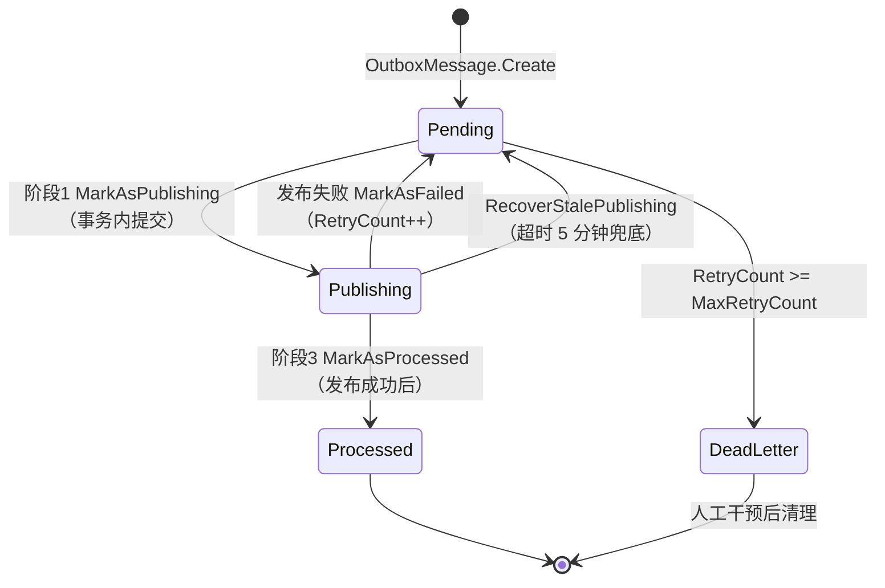
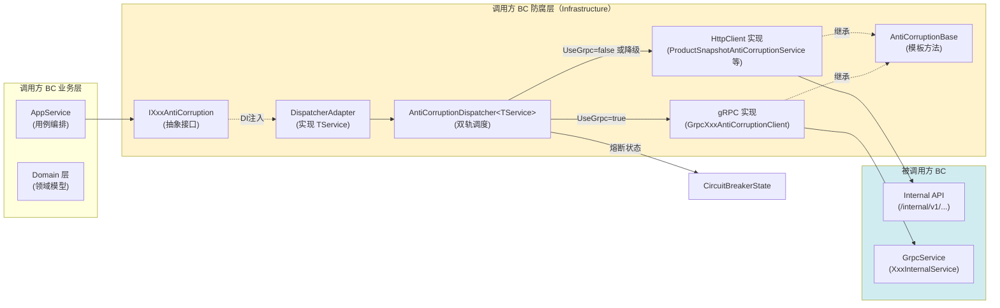
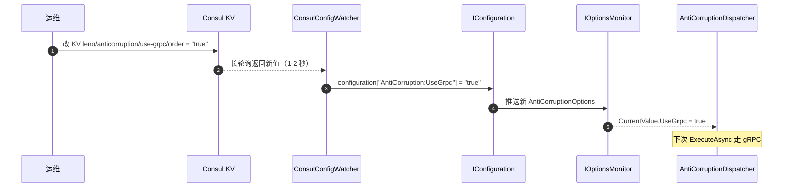
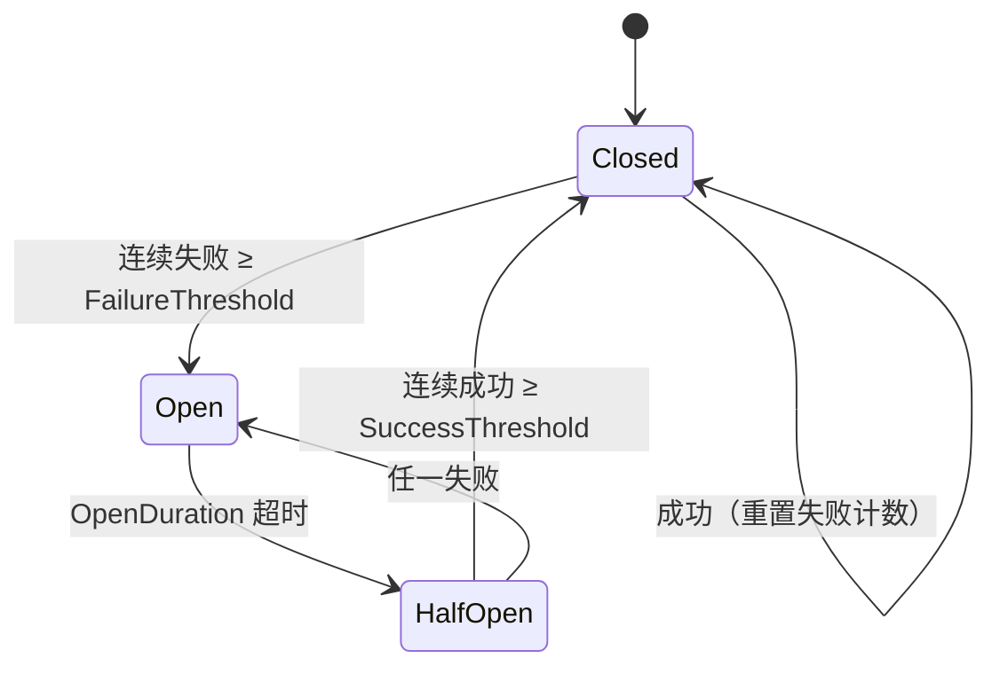
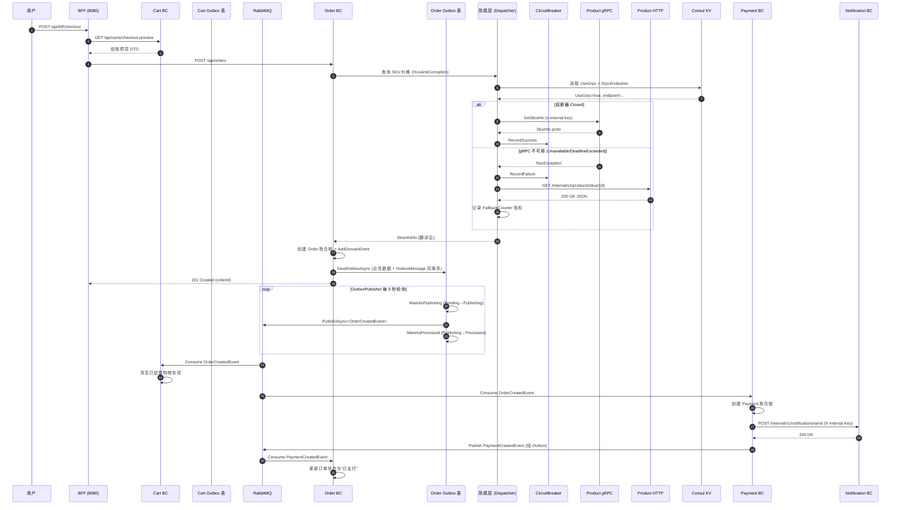

# 第 5 章 跨 BC 通信

## 学习目标

读完本章你将：

- 理解 Leno 11 个 BC（限界上下文，业务模型的显式边界）之间同步与异步两类通信方式，能根据场景选择正确的通信手段
- 掌握领域事件与集成事件的区别，能正确编写 Outbox 消息并通过 `IUnitOfWork.SaveEntitiesAsync` 保证业务事务与消息发送的原子性
- 熟练运用防腐层（Anti-Corruption Layer，把外部模型隔离在自身 BC 之外、避免污染本域模型的翻译层）模式封装跨 BC 同步调用，理解 `AntiCorruptionBase` 模板方法与 `AntiCorruptionDispatcher` 双轨调度
- 掌握 gRPC（Google RPC，基于 HTTP/2 与 Protobuf 的高性能远程调用协议）双轨方案与熔断器三状态机，能在 gRPC 不可用时自动降级到 HttpClient
- 能够独立完成 Internal API 端点、gRPC 服务端、防腐层客户端的开发与测试，并按规范接入 `X-Internal-Key` 鉴权与 Consul KV 配置热更新

## 适用读者

开发（需要承担 BC 业务开发任务、跨 BC 集成或弹性策略调优的 .NET 工程师）

## 术语速查

本章将遇到的术语：

| 术语 | 简释 |
|---|---|
| Outbox 模式 | 发件箱模式，把业务数据变更与待发消息在同一数据库事务写入，后台进程异步发布消息，保证"业务事务+消息发送"原子性 |
| 事件总线 | EventBus，发布/订阅消息的抽象通道，Leno 用 RabbitMQ + MassTransit 实现 |
| RabbitMQ | AMQP 协议开源消息代理，Leno 用作集成事件的传输层 |
| MassTransit | .NET 总线抽象库，统一封装 RabbitMQ 的发布订阅、重试、死信、Topic Exchange 路由 |
| Topic Exchange | RabbitMQ 的一种交换机类型，按路由键模式匹配把消息投递到队列，集成事件按事件类型路由 |
| 死信队列 | Dead Letter Queue，DLQ，存放无法正常消费或重试次数耗尽的消息的队列，用于人工干预 |
| Polly | .NET 弹性库，提供重试、熔断、超时、舱壁等策略链 |
| gRPC | Google RPC，基于 HTTP/2 + Protobuf 的高性能二进制 RPC 协议 |
| Protobuf | Protocol Buffers，Google 的语言中立、平台中立可扩展结构化数据序列化格式，gRPC 默认负载格式 |
| .proto | Protobuf 接口描述语言文件，定义服务、消息与方法签名，gRPC 通过 .proto 生成客户端与服务端代码 |
| 熔断器 | Circuit Breaker，一种弹性模式，连续失败达到阈值后短路后续调用，避免雪崩 |
| 降级 | Fallback，主通道不可用时切换到备用通道（如 gRPC 降级到 HttpClient）或返回兜底结果 |
| 服务发现 | Service Discovery，服务实例注册与查询机制，Leno 用 Consul 提供 |
| Consul KV | HashiCorp Consul 的键值存储功能，Leno 用作配置中心实现 AntiCorruption 配置热更新 |
| Internal API | BC 间同步通信的内部 HTTP 端点，前缀 `/internal/v1/`，由 `X-Internal-Key` 头鉴权 |
| X-Internal-Key | Internal API 鉴权请求头，携带目标 BC 的 InternalApiKey |

---

## 5.1 通信方式总览

第 4 章我们把镜头放在了单个 BC 内部，介绍了 Api/Application/Domain/Infrastructure 四层项目结构与开发模板。但 Leno 是 11 个 BC 协作的微服务架构（Microservice，一种把系统拆分为一组小而自治服务的架构风格），跨 BC 通信才是分布式系统的核心难点。本章把镜头拉远，看 BC 之间如何协作。

### 同步 vs 异步

分布式系统通信按"是否需要立即拿到响应"分为两类：

- **同步通信**（Synchronous）：调用方发起请求后阻塞等待响应，典型协议是 HTTP（REST）与 gRPC。优点是实时反馈、错误可立即处理；缺点是调用方与被调用方在时间上耦合，被调用方不可用会直接影响调用方。
- **异步通信**（Asynchronous）：调用方把消息丢到队列后立即返回，不等待处理结果，典型协议是 AMQP（RabbitMQ）。优点是解耦时间维度、削峰填谷、被调用方故障不影响调用方业务事务；缺点是无法立即知道处理结果，需配合幂等、重试、对账等机制。

Leno 11 个 BC 之间既有同步调用（如购物车结算时实时调用商品域查价格、调用促销域算优惠），也有异步事件（如订单创建后发集成事件通知库存、积分、通知域）。两类通信并非二选一，而是按场景互补：需要实时结果用同步，需要解耦与广播用异步。

### Leno 两类通信

Leno 把跨 BC 通信规范为两类，不允许开发者自由发挥：

1. **集成事件 + Outbox 模式**（异步）：BC 完成业务事务后，把领域事件翻译成集成事件，通过 Outbox 表持久化，后台 `OutboxPublisher` 轮询发布到 RabbitMQ，消费方按需订阅。典型场景：订单创建、订单状态变更、支付完成、库存扣减等"已发生事实"的广播。
2. **防腐层 + Internal API/gRPC**（同步）：BC 之间需要实时查询对方数据或触发对方操作时，通过防腐层封装调用，底层默认走 HTTP（REST Internal API），高频路径可灰度切换 gRPC。典型场景：购物车查 SKU 价格、订单算优惠、订单查支付信息。

### 11 BC 通信关系矩阵

下表把 11 个 BC 两两之间的主要通信关系梳理出来，行是调用方/发布方，列是被调用方/订阅方。"事"代表通过集成事件异步通知，"同"代表通过 Internal API/gRPC 同步调用。空单元格表示无直接通信。

| 调用/发布方 ↓ \ 被调用/订阅方 → | UserAuth | Product | Cart | Order | Promotion | ReviewAfterSales | PointsMembership | Payment | Notification | SellerShop | SystemAdmin |
|---|---|---|---|---|---|---|---|---|---|---|---|
| UserAuth | - | | | 同 | | | | | 同 | | |
| Product | | - | | 事 | | | | | | 同 | |
| Cart | | 同 | - | 事 | 同 | | | | | | |
| Order | | 同 | | - | 同 | 事 | 同 | 同 | 同 | 同 | |
| Promotion | | | | 事 | - | | | | | | |
| ReviewAfterSales | | | | 同 | | - | | 同 | | | |
| PointsMembership | | | | 事 | | | - | | | | |
| Payment | | | | 事 | | | | - | 同 | | |
| Notification | | | | | | | | | - | | |
| SellerShop | | | | | | | | | | - | |
| SystemAdmin | | | | | | | | | | | - |

矩阵表读法示例：

- **Order 行 → Product 列 = 同**：Order BC 下单时同步调用 Product BC 的 `internal/v1/products/skus/{skuId}` 端点查 SKU 详情，由 `ProductAntiCorruptionService` 发起。
- **Order 行 → Promotion 列 = 同**：Order 下单时同步调用 Promotion 的 `calculate` 算优惠、`lock-coupon` 锁优惠券，由 `PromotionAntiCorruptionService` 发起。
- **Order 行 → Promotion 列 = 同 + Promotion 行 → Order 列 = 事**：Order → Promotion 是同步调用，Promotion → Order 是异步事件（如优惠券被使用后发事件让 Order 更新订单视图），方向不可搞反。
- **Product 行 → Order 列 = 事**：Product 不直接调用 Order，而是通过集成事件（如 `SkuPriceChangedIntegrationEvent`）让 Order 订阅更新订单视图。
- **Payment 行 → Order 列 = 事**：支付完成后 Payment 发 `PaymentSucceededIntegrationEvent`，Order 订阅后把订单状态从"待支付"推进到"待发货"。
- **Notification 行 → UserAuth 列 = 同**：Notification 发通知前同步调 UserAuth 的 `internal/v1/users/{userId}/contacts` 拿到用户联系方式。

注意矩阵中的"同"都是单向的（调用方 → 被调用方），如果反方向需要通信，必须单独发起，不能复用同一通道。**严禁**让两个 BC 互相直接调用对方 Internal API 形成循环依赖，遇到环依赖必须通过集成事件解耦。

---

## 5.2 集成事件 vs 领域事件

DDD（Domain-Driven Design，领域驱动设计）里"事件"是个高频词，新手最容易把领域事件与集成事件混为一谈。Leno 严格区分二者，违反规则会导致事件丢失、重复消费或跨 BC 模型污染。

### 概念区分

- **领域事件**（Domain Event）：BC 内部表达"领域里发生了某事"的语义对象，由聚合根在状态变更时通过 `AddDomainEvent` 收集，保存在内存中。它描述的是领域专家关心的业务事实（如"购物车合并了""SKU 加入购物车了"），消费方是同一 BC 内的其他组件（如同一事务内的读模型更新、本域内业务联动）。领域事件**不直接跨 BC**。
- **集成事件**（Integration Event）：跨 BC 通信的契约对象，描述"已经发生的、可被其他 BC 订阅的业务事实"，序列化为 JSON 通过 RabbitMQ 发布。它属于 SharedContracts（共享契约层），是 BC 之间唯一的异步通信载体。

### 4 条规则

Leno 用 4 条规则约束两类事件的使用：

1. **领域事件不跨 BC**：领域事件只在 BC 内部消费，跨 BC 通信必须翻译成集成事件。规则强制 BC 内部模型与跨 BC 契约解耦，领域事件可以随业务重构自由演进，集成事件则必须保证向后兼容。
2. **集成事件由 `IIntegrationEventMapper` 翻译**：BC 在保存聚合根时，由 `IIntegrationEventMapper` 把聚合根收集的领域事件翻译成集成事件。翻译器在 Infrastructure 层，Domain 层只关心领域事件本身。
3. **集成事件必须版本化**：所有集成事件继承 `IntegrationEventBase`，携带 `SchemaVersion` 字段，消费方按版本号路由不同的 handler，保证事件 schema 演进时向后兼容。
4. **集成事件发布必须经 Outbox**：集成事件不能直接调 `_eventBus.PublishAsync`，必须先持久化到 Outbox 表，由 `OutboxPublisher` 后台进程异步发布。直接发布会丢消息（业务事务提交了但消息没发出去）或重复消息（业务事务回滚了但消息已发）。

### 代码示例对比

下面是 Cart BC 的两类事件示例，注意命名空间与字段差异：

**领域事件**（`CartMergedDomainEvent`，Cart BC 内部使用，不序列化不跨 BC）：

```csharp
// src/Services/Cart/Leno.Cart.Domain/Events/CartMergedDomainEvent.cs
namespace Leno.Cart.Domain.Events;

/// <summary>
/// 领域事件：匿名购物车已合并到已登录购物车。
/// 仅在 Cart BC 内部消费（如更新本域内读模型），不跨 BC。
/// </summary>
public sealed class CartMergedDomainEvent
{
    public Guid UserId { get; init; }
    public Guid AnonymousCartId { get; init; }
    public Guid MergedCartId { get; init; }
    public int MergedItemCount { get; init; }
    public DateTime OccurredAt { get; init; } = DateTime.UtcNow;
}
```

**集成事件**（`CartMergedIntegrationEvent`，跨 BC 通信，序列化为 JSON 发布到 RabbitMQ）：

```csharp
// src/BuildingBlocks/Leno.SharedContracts/Events/CartMergedIntegrationEvent.cs
namespace Leno.SharedContracts.Events;

/// <summary>
/// 集成事件：购物车已合并。
/// 跨 BC 发布，订阅方（如 Promotion BC 拉取购物车快照）按此契约处理。
/// </summary>
public sealed class CartMergedIntegrationEvent : IntegrationEventBase
{
    public Guid UserId { get; init; }
    public Guid MergedCartId { get; init; }

    // SchemaVersion 从 IntegrationEventBase 继承，默认 1
    // 字段演进时新增 optional 字段并递增 SchemaVersion，禁止删除字段
}
```

对比两个事件：领域事件命名空间在 `Leno.Cart.Domain`（BC 内部），集成事件在 `Leno.SharedContracts`（跨 BC 共享）；领域事件可以包含 BC 内部概念（如 `AnonymousCartId` 这种实现细节），集成事件只暴露对外有意义的字段；集成事件继承 `IntegrationEventBase` 携带 `SchemaVersion`，领域事件不需要版本化。

### 事件流转链路图

下面的 mermaid 图展示领域事件从产生到集成事件被消费方的完整链路：

```mermaid
flowchart LR
    A["AppService<br/>调用聚合根行为方法"] --> B["AggregateRoot<br/>AddDomainEvent 收集领域事件"]
    B --> C["IUnitOfWork.SaveEntitiesAsync"]
    C --> D["IIntegrationEventMapper<br/>翻译领域事件→集成事件"]
    D --> E["同一事务内<br/>业务数据 + Outbox 消息落库"]
    E --> F["事务提交"]
    F --> G["OutboxPublisher<br/>后台轮询"]
    G --> H["IEventBus.PublishAsync<br/>发布到 RabbitMQ"]
    H --> I["MassTransit Consumer<br/>目标 BC 订阅"]
    I --> J["消费方 handler<br/>按 SchemaVersion 路由"]

    style E fill:#fff3cd
    style G fill:#d1ecf1
    style J fill:#d4edda
```



关键节点说明：

- **E**（黄色）：业务数据与 Outbox 消息在同一数据库事务内写入，要么同时成功要么同时失败，保证原子性。这是 Outbox 模式的核心。
- **G**（蓝色）：OutboxPublisher 是独立的后台进程（`BackgroundService`），与业务事务解耦，独立重试不阻塞业务请求。
- **J**（绿色）：消费方按 `schema-version` 消息头路由到不同 handler，保证事件 schema 演进时向后兼容。

---

## 5.3 Outbox 模式详解

### 概念与必要性

**Outbox 模式**（发件箱模式）：把"业务数据变更"与"待发送的消息"在同一数据库事务里写入同一数据库的两张表（业务表 + Outbox 表），事务提交后两者要么同时持久化要么同时回滚；后台进程独立轮询 Outbox 表，把消息发布到消息队列。这一模式把"业务事务"与"消息发送"从"原子难"问题转化为"单库事务"问题，绕开分布式事务。

为什么要用 Outbox 模式？这是分布式系统最经典的"双写一致性"问题。考虑订单创建后通知库存域扣减库存的两种朴素做法：

1. **先保存订单，再发消息**：保存订单成功但发消息前进程崩溃 → 消息丢失，库存不扣，超卖。
2. **先发消息，再保存订单**：发消息成功但保存订单失败 → 业务回滚但消息已发，下游误扣库存。

两种顺序都有问题，根因是"数据库事务"与"消息队列"是两个独立资源，无法用单一事务保证原子性。引入分布式事务（2PC，Two-Phase Commit）代价高、性能差、不可扩展，工业界几乎不用。

Outbox 模式把问题降维：把消息也写进业务库的 Outbox 表，与业务数据共用同一数据库事务，事务提交就保证两者一致；后台进程异步把 Outbox 表的消息搬运到 RabbitMQ。这种"先入库再异步入队"的解法在工程上几乎零成本，是当前主流方案。

### OutboxMessage 表结构

Outbox 表对应实体 `OutboxMessage`，定义在 `src/BuildingBlocks/Leno.Infrastructure/Outbox/OutboxMessage.cs`：

```csharp
// [OutboxMessage.cs](file:///c:/Users/Junjie/.trae-cn/worktrees/Leno/feat-project-optimization-plan-O7ECNx/src/BuildingBlocks/Leno.Infrastructure/Outbox/OutboxMessage.cs)

namespace Leno.Infrastructure.Outbox;

/// <summary>
/// 发件箱消息状态。
/// </summary>
public enum OutboxMessageStatus
{
    Pending,
    /// <summary>两阶段标记中间态：事务已提交置此状态，正在发布到 MQ，未确认完成。</summary>
    Publishing,
    Processed,
    DeadLetter
}

/// <summary>
/// 发件箱消息实体，聚合保存与事件记录在同一事务写入，保证原子性。
/// 后台进程 <see cref="OutboxPublisher{TDbContext}"/> 轮询发布。
/// </summary>
public class OutboxMessage
{
    public Guid Id { get; private set; }

    public string Type { get; private set; } = default!;

    public string Payload { get; private set; } = default!;

    public DateTime OccurredAt { get; private set; }

    public DateTime? ProcessedAt { get; private set; }

    /// <summary>进入 <see cref="OutboxMessageStatus.Publishing"/> 状态的时刻，用于扫描超时消息。</summary>
    public DateTime? PublishingStartedAt { get; private set; }

    public int RetryCount { get; private set; }

    public string? Error { get; private set; }

    public OutboxMessageStatus Status { get; private set; }

    /// <summary>事件模式版本号（M4.2），从 IntegrationEventBase.SchemaVersion 复制；非 IntegrationEventBase 派生事件默认 1。</summary>
    public int SchemaVersion { get; private set; }

    private OutboxMessage() { }

    public static OutboxMessage Create(IIntegrationEvent integrationEvent)
    {
        ArgumentNullException.ThrowIfNull(integrationEvent);
        var eventType = integrationEvent.GetType();
        // 优先存储 FullName（跨版本更稳定），resolver 兼容历史 AssemblyQualifiedName 数据
        return new OutboxMessage
        {
            Id = Guid.NewGuid(),
            Type = eventType.FullName ?? eventType.AssemblyQualifiedName ?? eventType.Name,
            Payload = JsonSerializer.Serialize(integrationEvent, eventType),
            OccurredAt = integrationEvent.OccurredAt == default ? DateTime.UtcNow : integrationEvent.OccurredAt,
            Status = OutboxMessageStatus.Pending,
            SchemaVersion = integrationEvent is IntegrationEventBase baseEvt ? baseEvt.SchemaVersion : 1
        };
    }

    public void MarkAsProcessed() { /* 略 */ }

    public void MarkAsFailed(string error, int maxRetryCount)
    {
        RetryCount++;
        Error = string.IsNullOrEmpty(error) ? "未知错误" : error;
        Status = RetryCount >= maxRetryCount ? OutboxMessageStatus.DeadLetter : OutboxMessageStatus.Pending;
        PublishingStartedAt = null;
    }

    /// <summary>
    /// 两阶段标记第一阶段：进入 <see cref="OutboxMessageStatus.Publishing"/> 中间态，并记录起始时间。
    /// 该状态在事务内提交，确保后续发布动作可被恢复扫描识别。
    /// </summary>
    public void MarkAsPublishing()
    {
        Status = OutboxMessageStatus.Publishing;
        PublishingStartedAt = DateTime.UtcNow;
    }

    /// <summary>
    /// 重启扫描超时 <see cref="OutboxMessageStatus.Publishing"/> 消息时调用：
    /// 将消息回退至 <see cref="OutboxMessageStatus.Pending"/> 以便下次轮询重试，
    /// 由下游消费者幂等性保证不重复执行业务。
    /// </summary>
    public void ResetStalePublishing()
    {
        Status = OutboxMessageStatus.Pending;
        PublishingStartedAt = null;
    }
}
```

字段含义速查：

| 字段 | 类型 | 含义 |
|---|---|---|
| `Id` | `Guid` | 消息主键，全局唯一，作为 RabbitMQ 消息 ID 供消费方幂等 |
| `Type` | `string` | 事件类型 FullName（如 `Leno.SharedContracts.Events.CartMergedIntegrationEvent`），优先存 FullName 因跨版本更稳定 |
| `Payload` | `string` | 事件 JSON 序列化结果，发布时反序列化为 `IIntegrationEvent` |
| `OccurredAt` | `DateTime` | 事件发生时间（业务语义时间），由 `IIntegrationEvent.OccurredAt` 复制 |
| `ProcessedAt` | `DateTime?` | 发布成功时间，仅 `Processed` 状态有值 |
| `PublishingStartedAt` | `DateTime?` | 进入 `Publishing` 中间态的时刻，用于扫描超时未完成的消息 |
| `RetryCount` | `int` | 失败重试次数，达到 `MaxRetryCount` 转入 `DeadLetter` |
| `Error` | `string?` | 最近一次失败原因，便于排障 |
| `Status` | `OutboxMessageStatus` | 消息状态机：Pending / Publishing / Processed / DeadLetter |
| `SchemaVersion` | `int` | 事件 schema 版本号，从 `IntegrationEventBase.SchemaVersion` 复制，默认 1 |

`OutboxMessageStatus` 四个状态的语义：

| 状态 | 含义 |
|---|---|
| `Pending` | 待发布，等待下一轮轮询拉取 |
| `Publishing` | 两阶段标记中间态，事务已提交置此状态，正在发布到 MQ，未确认完成 |
| `Processed` | 发布成功，最终态 |
| `DeadLetter` | 重试次数耗尽进入死信，需人工干预 |

### IUnitOfWork.SaveEntitiesAsync 流程

业务层不直接接触 `OutboxMessage`，而是通过 `IUnitOfWork.SaveEntitiesAsync` 间接落库。`SaveEntitiesAsync` 是 Leno 工作单元的核心方法，签名约定为"保存聚合根变更 + 落库领域事件对应的 Outbox 消息"。实现位于 `src/BuildingBlocks/Leno.Infrastructure/Persistence/EfCoreUnitOfWork.cs`：

```csharp
// [EfCoreUnitOfWork.cs](file:///c:/Users/Junjie/.trae-cn/worktrees/Leno/feat-project-optimization-plan-O7ECNx/src/BuildingBlocks/Leno.Infrastructure/Persistence/EfCoreUnitOfWork.cs)

namespace Leno.Infrastructure.Persistence;

/// <summary>
/// 泛型 EF Core 工作单元实现，包装业务上下文 <typeparamref name="TDbContext"/>。
/// </summary>
/// <remarks>
/// <para>
/// 抽取自各 BC（Order/Cart/Payment 等）100% 同构的 <c>UnitOfWork</c> 副本，消除约 680 行重复代码。
/// 业务上下文只需提供 <c>DbContext</c> 与 <see cref="IIntegrationEventMapper"/> 两项依赖即可复用本类。
/// </para>
/// <para>
/// <see cref="SaveEntitiesAsync"/> 经 <see cref="OutboxDbContextExtensions.SaveChangesWithOutboxAsync"/>
/// 在同一事务内保存聚合变更与集成事件，保证原子性；事务提交后清除领域事件。
/// </para>
/// <para>
/// 各 BC DI 注册示例（在 <c>AddXxxInfrastructure</c> 中）：
/// <code>
/// services.AddScoped&lt;IUnitOfWork, EfCoreUnitOfWork&lt;OrderDbContext&gt;&gt;();
/// </code>
/// 业务上下文 <c>DbContext</c> 与 <see cref="IIntegrationEventMapper"/> 须先于本类注册。
/// </para>
/// </remarks>
/// <typeparam name="TDbContext">业务上下文 DbContext 类型，约束为 <see cref="DbContext"/>。</typeparam>
public sealed class EfCoreUnitOfWork<TDbContext> : IUnitOfWork
    where TDbContext : DbContext
{
    private readonly TDbContext _context;
    private readonly IIntegrationEventMapper _mapper;

    public EfCoreUnitOfWork(TDbContext context, IIntegrationEventMapper mapper)
    {
        ArgumentNullException.ThrowIfNull(context);
        ArgumentNullException.ThrowIfNull(mapper);
        _context = context;
        _mapper = mapper;
    }

    /// <inheritdoc />
    public Task<int> SaveChangesAsync(CancellationToken ct = default)
        => _context.SaveChangesAsync(ct);

    /// <inheritdoc />
    public async Task<bool> SaveEntitiesAsync(CancellationToken ct = default)
    {
        await _context.SaveChangesWithOutboxAsync(_mapper, ct);
        return true;
    }

    /// <inheritdoc />
    public async Task<IUnitOfWorkTransaction> BeginTransactionAsync(CancellationToken ct = default)
    {
        var transaction = await _context.Database.BeginTransactionAsync(ct);
        return new EfCoreUnitOfWorkTransaction(transaction);
    }

    /// <inheritdoc />
    public void Dispose()
    {
        _context.Dispose();
    }

    private sealed class EfCoreUnitOfWorkTransaction : IUnitOfWorkTransaction
    {
        // CommitAsync / RollbackAsync / Dispose 包装 EF Core 事务句柄
        // 略...
    }
}
```

`SaveEntitiesAsync` 内部委托给扩展方法 `OutboxDbContextExtensions.SaveChangesWithOutboxAsync`，后者执行如下 4 步：

1. 遍历 `ChangeTracker` 中所有聚合根，收集 `AddDomainEvent` 注册的领域事件；
2. 通过 `IIntegrationEventMapper` 把领域事件翻译成集成事件；
3. 把集成事件包成 `OutboxMessage.Create(...)` 加入 `DbContext.Set<OutboxMessage>()`；
4. 调用 `SaveChangesAsync` 把业务数据与 Outbox 消息在同一事务写入数据库；事务提交后清除聚合根的领域事件（避免下次 Save 再次发布）。

业务代码只需在 AppService 里调一次 `await _uow.SaveEntitiesAsync(ct)`，无需关心 Outbox 落库细节。这也是 Leno 强制要求"业务保存必须走 `SaveEntitiesAsync` 而不是 `SaveChangesAsync`"的原因——后者不会落 Outbox 消息，事件会丢。

### OutboxPublisher 代码示例

`OutboxPublisher<TDbContext>` 是后台进程（`BackgroundService`），独立轮询 Outbox 表把消息发布到 RabbitMQ。它采用两阶段标记防重复发布，并支持并行处理与积压告警。源码位于 `src/BuildingBlocks/Leno.Infrastructure/Outbox/OutboxPublisher.cs`：

```csharp
// [OutboxPublisher.cs](file:///c:/Users/Junjie/.trae-cn/worktrees/Leno/feat-project-optimization-plan-O7ECNx/src/BuildingBlocks/Leno.Infrastructure/Outbox/OutboxPublisher.cs)

namespace Leno.Infrastructure.Outbox;

/// <summary>
/// 发件箱后台发布器，轮询发件箱表，将待发布消息发布到事件总线。
/// 采用两阶段标记防重复发布：
/// 1) 事务内置 <see cref="OutboxMessageStatus.Publishing"/> 中间态并提交；
/// 2) 发布到 MQ；
/// 3) 置 <see cref="OutboxMessageStatus.Processed"/> 并提交。
/// 若发布失败，回退为 <see cref="OutboxMessageStatus.Pending"/> 等待下次重试；
/// 若发布成功但 Processed 标记失败，由 <see cref="RecoverStalePublishingAsync"/> 在下次轮询扫描超时后回退 Pending，
/// 依赖下游消费者幂等性保证不重复执行业务。
/// <para>
/// T22 增强：
/// <list type="bullet">
/// <item>并行处理：使用 <see cref="Parallel.ForEachAsync"/> 并行发布批次内消息（默认 DOP=4），每条消息独立事务保持两阶段语义</item>
/// <item>积压告警：每次轮询后统计 pending 数量，超阈值（默认 100）记录结构化告警日志</item>
/// <item>类型解析：通过 <see cref="IOutboxEventTypeResolver"/> 按 FullName 解析事件类型，兼容 BC 版本升级</item>
/// </list>
/// </para>
/// </summary>
/// <typeparam name="TDbContext">承载发件箱表的 DbContext 类型。</typeparam>
public class OutboxPublisher<TDbContext> : BackgroundService
    where TDbContext : DbContext
{
    private readonly IServiceProvider _serviceProvider;
    private readonly IEventBus _eventBus;
    private readonly ILogger<OutboxPublisher<TDbContext>> _logger;
    private readonly IOutboxEventTypeResolver _typeResolver;

    private const int BatchSize = 50;
    private const int MaxRetryCount = 5;
    private static readonly TimeSpan PollingInterval = TimeSpan.FromSeconds(5);
    /// <summary>Publishing 状态超时阈值，超过此时间认为发布中断（应用重启/标记失败），回退 Pending。</summary>
    private static readonly TimeSpan PublishingStaleTimeout = TimeSpan.FromMinutes(5);
    private static readonly JsonSerializerOptions SerializerOptions = new(JsonSerializerDefaults.Web);

    /// <summary>并行发布默认并行度。可通过 <c>Outbox:MaxDegreeOfParallelism</c> 配置覆盖。</summary>
    private const int DefaultMaxDegreeOfParallelism = 4;

    /// <summary>pending 积压告警阈值。可通过 <c>Outbox:PendingAlertThreshold</c> 配置覆盖。</summary>
    private const int DefaultPendingAlertThreshold = 100;

    internal int MaxDegreeOfParallelism { get; set; } = DefaultMaxDegreeOfParallelism;
    internal int PendingAlertThreshold { get; set; } = DefaultPendingAlertThreshold;

    public OutboxPublisher(
        IServiceProvider serviceProvider,
        IEventBus eventBus,
        ILogger<OutboxPublisher<TDbContext>> logger,
        IOutboxEventTypeResolver? typeResolver = null)
    {
        _serviceProvider = serviceProvider;
        _eventBus = eventBus;
        _logger = logger;
        _typeResolver = typeResolver ?? DefaultOutboxEventTypeResolver.Instance;
    }

    protected override async Task ExecuteAsync(CancellationToken stoppingToken)
    {
        while (!stoppingToken.IsCancellationRequested)
        {
            try
            {
                // 每次轮询首先扫描重启或上次中断遗留的 Publishing 超时消息
                await RecoverStalePublishingAsync(stoppingToken);
                await ProcessBatchAsync(stoppingToken);
                // 每次轮询后统计 pending 积压并告警
                await AlertIfPendingBacklogAsync(stoppingToken);
            }
            catch (Exception ex)
            {
                _logger.LogError(ex, "发件箱轮询异常");
            }

            try
            {
                await Task.Delay(PollingInterval, stoppingToken);
            }
            catch (OperationCanceledException)
            {
                break;
            }
        }
    }

    /// <summary>
    /// 单条消息的两阶段发布：
    /// 1) 事务内置 Publishing 提交；
    /// 2) 发布 MQ；
    /// 3) 置 Processed 提交（失败则由 RecoverStalePublishingAsync 兜底）。
    /// 发布失败时回退 Pending 等待下次重试，重试次数超阈值进入 DeadLetter。
    /// </summary>
    private async Task PublishSingleAsync(TDbContext context, OutboxMessage message, CancellationToken stoppingToken)
    {
        Type? eventType;
        IIntegrationEvent? integrationEvent;

        try
        {
            // T22.3：使用 IOutboxEventTypeResolver 按 FullName 解析，兼容 BC 版本升级
            eventType = _typeResolver.Resolve(message.Type);
            if (eventType is null)
            {
                _logger.LogError("无法解析发件箱事件类型 Type={Type}", message.Type);
                message.MarkAsFailed("事件类型无法解析", MaxRetryCount);
                await context.SaveChangesAsync(stoppingToken);
                return;
            }

            integrationEvent = JsonSerializer.Deserialize(message.Payload, eventType, SerializerOptions) as IIntegrationEvent;
            if (integrationEvent is null)
            {
                message.MarkAsFailed("事件反序列化为 null", MaxRetryCount);
                await context.SaveChangesAsync(stoppingToken);
                return;
            }
        }
        catch (Exception ex)
        {
            _logger.LogError(ex, "发件箱消息预处理失败 Id={MessageId}", message.Id);
            message.MarkAsFailed(ex.Message, MaxRetryCount);
            await context.SaveChangesAsync(stoppingToken);
            return;
        }

        // 阶段 1：事务内置 Publishing 中间态并提交
        message.MarkAsPublishing();
        try
        {
            await context.SaveChangesAsync(stoppingToken);
        }
        catch (Exception ex)
        {
            _logger.LogError(ex, "发件箱消息置 Publishing 失败 Id={MessageId}", message.Id);
            message.ResetStalePublishing();
            throw;
        }

        // 阶段 2：发布到 MQ（M4.2 起 Outbox 在消息头携带 schema-version，供消费方按版本路由 handler）
        try
        {
            var headers = new Dictionary<string, string?>
            {
                ["schema-version"] = message.SchemaVersion.ToString()
            };
            await _eventBus.PublishAsync(integrationEvent, headers, stoppingToken);
        }
        catch (Exception ex)
        {
            _logger.LogError(ex, "发件箱消息发布失败 Id={MessageId}", message.Id);
            message.MarkAsFailed(ex.Message, MaxRetryCount);
            try
            {
                await context.SaveChangesAsync(stoppingToken);
            }
            catch (Exception commitEx)
            {
                _logger.LogError(commitEx, "发件箱发布失败回退提交失败 Id={MessageId}", message.Id);
            }
            return;
        }

        // 阶段 3：置 Processed 并提交
        message.MarkAsProcessed();
        try
        {
            await context.SaveChangesAsync(stoppingToken);
            OutboxMetrics.RecordPublished(typeof(TDbContext).Name);
            _logger.LogInformation("发件箱消息已发布 Id={MessageId} Type={Type}", message.Id, eventType.Name);
        }
        catch (Exception ex)
        {
            // 发布成功但标记 Processed 失败：依赖下游幂等性，由 RecoverStalePublishingAsync 兜底
            _logger.LogWarning(ex,
                "发件箱消息发布成功但 Processed 标记失败 Id={MessageId}，将由 Publishing 超时扫描回退 Pending，依赖下游幂等兜底",
                message.Id);
        }
    }

    /// <summary>
    /// 统计当前 pending 消息数量，超阈值记录结构化告警日志。
    /// 阈值默认 100，可由业务上下文覆盖。
    /// 同时更新 Prometheus gauge <c>outbox_pending_count</c>。
    /// </summary>
    internal async Task AlertIfPendingBacklogAsync(CancellationToken stoppingToken)
    {
        using var scope = _serviceProvider.CreateScope();
        var context = scope.ServiceProvider.GetRequiredService<TDbContext>();

        var pendingCount = await context.Set<OutboxMessage>()
            .CountAsync(m => m.Status == OutboxMessageStatus.Pending, stoppingToken);

        OutboxMetrics.SetPendingCount(pendingCount);

        if (pendingCount > PendingAlertThreshold)
        {
            _logger.LogWarning(
                "发件箱积压告警：pending 消息数 {PendingCount} 超过阈值 {Threshold}，请检查下游消费速度或发布器健康状态",
                pendingCount, PendingAlertThreshold);
        }
    }
}
```

### 关键参数

`OutboxPublisher` 用 6 个常量控制行为，命名必须严格对齐：

| 参数 | 值 | 含义 |
|---|---|---|
| `BatchSize` | `50` | 每轮拉取的待发布消息数上限 |
| `MaxRetryCount` | `5` | 单条消息最大重试次数，超过进 DeadLetter |
| `PollingInterval` | `5 秒` | 轮询间隔 |
| `PublishingStaleTimeout` | `5 分钟` | `Publishing` 中间态超时阈值，超过回退 `Pending` |
| `DefaultMaxDegreeOfParallelism` | `4` | 并行发布并行度（DOP=4），每条消息独立作用域+独立事务 |
| `DefaultPendingAlertThreshold` | `100` | pending 积压告警阈值，超过记录结构化告警日志 |

### 两阶段标记机制

`OutboxPublisher` 用 `Pending → Publishing → Processed` 三态两阶段标记防止重复发布：

1. **阶段 1（事务内）**：拉取 `Pending` 消息后，在同一事务里把它置为 `Publishing`，并设置 `PublishingStartedAt = DateTime.UtcNow`，然后 `SaveChangesAsync` 提交事务。事务提交后状态变为 `Publishing`，下次轮询不会重复拉取。
2. **阶段 2（事务外）**：调 `_eventBus.PublishAsync` 发布到 RabbitMQ。这一步发生在数据库事务之外，可能因为网络故障失败。
3. **阶段 3（事务内）**：发布成功后置 `Processed` 并提交；失败则置 `Pending`（`MarkAsFailed` 递增 `RetryCount`），等待下次轮询重试。

两阶段标记的精髓是"事务内打标 + 事务外发布"。即使第 2 步发布成功但第 3 步置 `Processed` 失败（进程崩溃等），消息会停留在 `Publishing` 状态，由 `RecoverStalePublishingAsync` 在下次轮询时扫描超过 `PublishingStaleTimeout`（5 分钟）的 `Publishing` 消息回退 `Pending`，依赖下游消费者幂等性保证不重复执行业务。

### 并行发布 DOP=4

T22 增强引入 `Parallel.ForEachAsync` 并行处理同一批次内的消息。每条消息独立 `IServiceScope` + 独立 `DbContext` + 独立事务，保持两阶段标记语义不被破坏。默认 `DOP=4`，可通过 `Outbox:MaxDegreeOfParallelism` 配置覆盖。单条消息处理异常不会中断整个并行批次，只记录错误日志。

### 积压告警阈值 100

每轮轮询后调 `AlertIfPendingBacklogAsync` 统计 `Pending` 消息数量，超过 100 记录 `LogWarning` 结构化告警日志：

```text
发件箱积压告警：pending 消息数 137 超过阈值 100，请检查下游消费速度或发布器健康状态
```

同时更新 Prometheus gauge `outbox_pending_count` 供监控抓取。运维通过 Grafana 报警规则可及时发现下游消费滞后。

### 类型解析与版本兼容

`IOutboxEventTypeResolver` 按 `Type` 字段（事件 FullName）解析为 .NET `Type`。默认实现 `DefaultOutboxEventTypeResolver` 用 `Type.GetType(name)` 反射解析，支持自定义实现覆盖以兼容以下场景：

- **程序集版本变更**：BC 升级后程序集强名称变化，`AssemblyQualifiedName` 解析失败，自定义 resolver 重定向到新程序集；
- **命名空间迁移**：重构后事件命名空间变更，自定义 resolver 做老→新映射；
- **跨 BC 共享契约**：所有 BC 引用 `Leno.SharedContracts` 程序集，事件类型解析无歧义。

### 消息头携带 schema-version

M4.2 起 Outbox 发布消息时在消息头携带 `schema-version`：

```csharp
var headers = new Dictionary<string, string?>
{
    ["schema-version"] = message.SchemaVersion.ToString()
};
await _eventBus.PublishAsync(integrationEvent, headers, stoppingToken);
```

消费方 MassTransit Consumer 在 handler 中按 `schema-version` 路由到不同版本的 handler，保证事件 schema 演进时向后兼容。例如 `CartMergedIntegrationEvent` 从 v1 升到 v2 时新增 `MergeStrategy` 字段，v1 handler 忽略该字段，v2 handler 处理新逻辑，两个 handler 同时存在直到所有消费方升级。

### OutboxMessage 状态机流转图

下图展示 `OutboxMessage` 从创建到最终态的完整状态机流转：



注意 `Publishing` 状态有两个出口：发布成功走 `Processed`，发布失败走 `Pending`。`RecoverStalePublishing` 是兜底机制，处理"发布成功但标记 Processed 失败"的边缘场景，依赖下游消费者幂等性保证不重复执行业务。

---

## 5.4 防腐层概念与 AntiCorruptionBase 基类

### 概念

**防腐层**（Anti-Corruption Layer，ACL）：在两个不同模型之间放置一层翻译器，把外部模型转换为本地 BC 的模型，避免外部模型的概念污染本域。防腐层是 DDD 战略设计中"上下文映射"的一种关系，常用于"客户-供应商"或"遵奉者"关系里保护下游 BC 的领域模型。

举例说明：Cart BC 需要查 Product BC 的 SKU 价格，Product 返回的 DTO 字段是 `PriceCents`、`Salable`、`Title`、`MainImage`，而 Cart BC 的领域模型用 `SkuPriceSnapshot` 值对象表达，字段是 `Price`、`Available`、`Title`、`MainImageUrl`。如果 Cart 直接消费 Product 的 DTO，Product 的命名习惯（用 `Salable` 而非 `Available`、`PriceCents` 而非 `Price`）会渗透进 Cart 的领域模型，导致 Cart 的领域概念被外部 BC 牵着走。防腐层在中间做翻译：把 `ProductApiDto.Salable` 映射成 `SkuPriceSnapshot.Available`，把 `PriceCents` 除以 100 转换成 `Price`（decimal 元）。Cart 领域层只看到自己的 `SkuPriceSnapshot`，对 Product 的存在无感。

### Leno 防腐层架构图

下图展示 Leno 防腐层的整体架构，左侧业务层只依赖本地抽象接口，右侧防腐层实现负责调用外部 BC 并做模型翻译：



防腐层架构的关键设计：

- **业务层只依赖抽象**：`AppService` 依赖 `IXxxAntiCorruption` 接口，对底层是 HttpClient 还是 gRPC、对端是哪个 BC 完全无感。
- **Dispatcher 双轨调度**：`AntiCorruptionDispatcher<TService>` 在运行时根据 `UseGrpc` 开关与熔断状态选择 HttpClient 或 gRPC 实现。
- **Adapter 桥接**：因为 `AntiCorruptionDispatcher<TService>` 不实现 `TService` 接口（只提供 `ExecuteAsync` 模板方法），必须为每个防腐层接口创建 `{Service}DispatcherAdapter` 适配器作为 DI 容器中 `TService` 的具体实现。
- **鉴权统一**：HttpClient 模式注入 `X-Internal-Key` 请求头，gRPC 模式注入 `x-internal-key` metadata，语义一致。

### AntiCorruptionBase 代码示例

`AntiCorruptionBase` 是防腐层的模板方法基类，统一异常捕获、指标埋点、HTTP 状态码映射。所有 HttpClient 防腐层实现都继承它。源码位于 `src/BuildingBlocks/Leno.Infrastructure/AntiCorruption/AntiCorruptionBase.cs`：

```csharp
// [AntiCorruptionBase.cs](file:///c:/Users/Junjie/.trae-cn/worktrees/Leno/feat-project-optimization-plan-O7ECNx/src/BuildingBlocks/Leno.Infrastructure/AntiCorruption/AntiCorruptionBase.cs)

namespace Leno.Infrastructure.AntiCorruption;

/// <summary>
/// 防腐层抽象基类（M4.1）。
/// 统一 <see cref="ExecuteAsync"/> 模板方法：异常捕获、指标埋点、HTTP 状态码映射。
/// 写操作与读操作均 <c>throwOnFailure=true</c>，不再返回 null（spec M4.1）。
/// 网络故障统一映射 HTTP 503 + ErrorCode <c>{SERVICE}_UNAVAILABLE</c>。
/// </summary>
public abstract class AntiCorruptionBase
{
    /// <summary>防腐层服务标识（如 <c>product</c>、<c>promotion</c>、<c>points</c>），用于指标埋点。</summary>
    protected abstract string ServiceName { get; }

    protected async Task<T> ExecuteAsync<T>(
        string operation,
        Func<CancellationToken, Task<T>> execute,
        CancellationToken ct = default)
    {
        try
        {
            return await execute(ct).ConfigureAwait(false);
        }
        catch (OperationCanceledException) when (ct.IsCancellationRequested)
        {
            // 用户主动取消，直接传播不埋点
            throw;
        }
        catch (OperationCanceledException ex) when (!ct.IsCancellationRequested)
        {
            AntiCorruptionMetrics.RecordFailure(ServiceName, operation);
            throw new AntiCorruptionException(
                $"防腐层调用 {ServiceName}/{operation} 超时：{ex.Message}",
                $"{ServiceName.ToUpperInvariant()}_UNAVAILABLE");
        }
        catch (HttpRequestException ex)
        {
            AntiCorruptionMetrics.RecordFailure(ServiceName, operation);
            throw new AntiCorruptionException(
                $"防腐层调用 {ServiceName}/{operation} 网络故障：{ex.Message}",
                $"{ServiceName.ToUpperInvariant()}_UNAVAILABLE");
        }
        catch (DomainException)
        {
            // 业务异常透传，不重复埋点
            throw;
        }
        catch (Exception ex)
        {
            AntiCorruptionMetrics.RecordFailure(ServiceName, operation);
            throw new AntiCorruptionException(
                $"防腐层调用 {ServiceName}/{operation} 失败：{ex.Message}",
                $"{ServiceName.ToUpperInvariant()}_REMOTE_FAILED");
        }
    }

    protected async Task ExecuteAsync(
        string operation,
        Func<CancellationToken, Task> execute,
        CancellationToken ct = default)
    {
        await ExecuteAsync<object?>(operation, async token =>
        {
            await execute(token).ConfigureAwait(false);
            return null;
        }, ct).ConfigureAwait(false);
    }

    protected void EnsureSuccessStatusCode(HttpResponseMessage response, string operation)
    {
        if (!response.IsSuccessStatusCode)
        {
            AntiCorruptionMetrics.RecordFailure(ServiceName, operation);
            throw new AntiCorruptionException(
                $"防腐层调用 {ServiceName}/{operation} 返回非成功状态码 {(int)response.StatusCode} ({response.StatusCode})",
                $"{ServiceName.ToUpperInvariant()}_REMOTE_FAILED");
        }
    }
}
```

模板方法 `ExecuteAsync<T>(string operation, Func<CancellationToken, Task<T>> execute, CancellationToken ct = default)` 的执行流：

1. 子类用 `protected override string ServiceName => "product";` 暴露服务标识（用于指标埋点）。
2. 子类的防腐层方法（如 `GetSkuSnapshotAsync`）把核心调用包成 lambda 传给 `ExecuteAsync`。
3. `ExecuteAsync` 用 `try-catch` 包裹 lambda，按异常类型分类处理：
   - 用户取消（`ct.IsCancellationRequested`）：直接传播不埋点；
   - 超时（`OperationCanceledException` 但非用户取消）：记 `RecordFailure` + 抛 `AntiCorruptionException` 错误码 `{SERVICE}_UNAVAILABLE`；
   - 网络异常（`HttpRequestException`）：记 `RecordFailure` + 抛 `AntiCorruptionException` 错误码 `{SERVICE}_UNAVAILABLE`；
   - 业务异常（`DomainException`）：透传不重复埋点（业务异常由对端 BC 抛出，调用方应感知业务语义）；
   - 其他异常：记 `RecordFailure` + 抛 `AntiCorruptionException` 错误码 `{SERVICE}_REMOTE_FAILED`。
4. `EnsureSuccessStatusCode` 是辅助方法，检查 HTTP 响应状态码非 2xx 时抛 `AntiCorruptionException`。

### AntiCorruptionMetrics 三个核心指标

防腐层指标定义在 `src/BuildingBlocks/Leno.Infrastructure/AntiCorruption/AntiCorruptionMetrics.cs`，对外暴露 6 个指标，其中最核心的是前 3 个：

```csharp
// [AntiCorruptionMetrics.cs](file:///c:/Users/Junjie/.trae-cn/worktrees/Leno/feat-project-optimization-plan-O7ECNx/src/BuildingBlocks/Leno.Infrastructure/AntiCorruption/AntiCorruptionMetrics.cs)

public static class AntiCorruptionMetrics
{
    public const string FailureCounterName = "anticorruption_failure_total";
    public const string FallbackCounterName = "anticorruption_fallback_total";
    public const string CircuitOpenGaugeName = "anticorruption_circuit_open";
    // 还有 GrpcRequestCounterName、GrpcDurationHistogramName 等

    private static readonly Meter _meter = new("Leno.AntiCorruption", "1.0.0");

    public static Counter<int> FailureCounter { get; } =
        _meter.CreateCounter<int>(
            FailureCounterName,
            unit: "times",
            description: "防腐层远程调用失败次数（按 service/operation/path 维度统计）");

    public static Counter<int> FallbackCounter { get; } =
        _meter.CreateCounter<int>(
            FallbackCounterName,
            unit: "times",
            description: "gRPC 降级到 HttpClient 的次数（按 service/reason 维度统计）");

    public static ObservableGauge<int> CircuitOpenGauge { get; private set; } = null!;

    public static void RecordFailure(string service, string operation, string path = "http")
    {
        if (string.IsNullOrEmpty(service) || string.IsNullOrEmpty(operation)) return;
        FailureCounter.Add(1,
            new KeyValuePair<string, object?>(ServiceLabel, service),
            new KeyValuePair<string, object?>(OperationLabel, operation),
            new KeyValuePair<string, object?>(PathLabel, path));
    }

    /// <summary>记录一次 gRPC 降级到 HttpClient 的事件。</summary>
    /// <param name="service">防腐层服务标识。</param>
    /// <param name="reason">降级原因：circuit_open / grpc_Unavailable / grpc_DeadlineExceeded / grpc_Internal / grpc_ResourceExhausted / grpc_unknown。</param>
    public static void RecordFallback(string service, string reason) { /* 略 */ }

    public static void UpdateCircuitOpenState(string service, bool isOpen)
    {
        _circuitOpenStates[service] = isOpen ? 1 : 0;
    }
}
```

三个核心指标含义：

| 指标 | 类型 | 标签 | 含义 |
|---|---|---|---|
| `anticorruption_failure_total` | Counter | `service`/`operation`/`path` | 防腐层调用失败次数，每次 `RecordFailure` 递增 1。path 区分 http/grpc 通道 |
| `anticorruption_fallback_total` | Counter | `service`/`reason` | gRPC 降级到 HttpClient 次数，reason 区分 `circuit_open`/`grpc_Unavailable`/`grpc_DeadlineExceeded` 等 |
| `anticorruption_circuit_open` | Gauge | `service` | 熔断器是否打开（1=Open，0=Closed/HalfOpen），由 `CircuitBreakerState` 实时更新 |

另外 3 个指标服务于 gRPC 通道可观测性：`anticorruption_grpc_request_total`（gRPC 调用计数）、`anticorruption_grpc_duration_seconds`（gRPC 延迟分布直方图）、Meter 名 `Leno.AntiCorruption`。各 BC 启动时通过 `AddLenoOpenTelemetry` 回调 `.AddMeter("Leno.AntiCorruption")` 订阅。

### AntiCorruptionException 错误码规范

`AntiCorruptionException` 是防腐层统一异常类型，错误码格式严格遵循：

- **`{SERVICE.ToUpperInvariant()}_UNAVAILABLE`**：网络故障、超时、对端 503。调用方应做降级或重试。
- **`{SERVICE.ToUpperInvariant()}_REMOTE_FAILED`**：非 2xx 状态码、未分类异常。调用方应感知为业务失败。

其中 `{SERVICE}` 是子类暴露的 `ServiceName` 属性（如 `product`/`promotion`/`points`/`order`/`payment`/`user-auth`），`ToUpperInvariant()` 把它转大写。例如 `product` → `PRODUCT_UNAVAILABLE`、`promotion` → `PROMOTION_REMOTE_FAILED`、`user-auth` → `USER-AUTH_UNAVAILABLE`。

错误码后缀约定映射 HTTP 状态码（详见第 4 章错误码后缀表）：

- `_UNAVAILABLE` → HTTP 503
- `_REMOTE_FAILED` → HTTP 502

业务异常（`DomainException`）由对端 BC 抛出，透传到调用方业务层处理，**不**经过 `AntiCorruptionException` 包装。这保证业务语义（如 `COUPON_NOT_FOUND`、`SKU_NOT_SALABLE`）不被防腐层吞掉。

---

## 5.5 HttpClient 防腐层实现模板

理解了 `AntiCorruptionBase` 后，看一个完整的 HttpClient 防腐层实现。Cart BC 的 `ProductSnapshotAntiCorruptionService` 是典型范例，封装"查询单个 SKU 快照"调用。源码位于 `src/Services/Cart/Leno.Cart.Infrastructure/Services/ProductSnapshotAntiCorruptionService.cs`：

```csharp
// [ProductSnapshotAntiCorruptionService.cs](file:///c:/Users/Junjie/.trae-cn/worktrees/Leno/feat-project-optimization-plan-O7ECNx/src/Services/Cart/Leno.Cart.Infrastructure/Services/ProductSnapshotAntiCorruptionService.cs)

using System.Net.Http.Json;
using Leno.Cart.Application.Abstractions;
using Leno.Cart.Application.DTOs;
using Leno.Infrastructure.AntiCorruption;
using Leno.SharedContracts.Responses;
using Microsoft.Extensions.Logging;
using Microsoft.Extensions.Options;

namespace Leno.Cart.Infrastructure.Services;

/// <summary>
/// 商品域快照防腐层 HttpClient 实现。
/// 继承 <see cref="AntiCorruptionBase"/>，调用失败统一抛 <see cref="AntiCorruptionException"/>。
/// M5.2：通过 <see cref="AntiCorruptionOptions.TargetInternalApiKeys"/> 读取目标 BC（Product）的 InternalApiKey。
/// </summary>
public sealed class ProductSnapshotAntiCorruptionService : AntiCorruptionBase, IProductSnapshotAntiCorruption
{
    private const string InternalKeyHeader = "X-Internal-Key";
    private const string SkuEndpointPrefix = "internal/v1/products/skus/";
    private const string TargetBc = "Product";

    private readonly HttpClient _httpClient;
    private readonly ILogger<ProductSnapshotAntiCorruptionService> _logger;
    private readonly string _targetInternalKey;

    protected override string ServiceName => "product";

    public ProductSnapshotAntiCorruptionService(
        HttpClient httpClient,
        IOptions<AntiCorruptionOptions> options,
        ILogger<ProductSnapshotAntiCorruptionService> logger)
    {
        ArgumentNullException.ThrowIfNull(httpClient);
        ArgumentNullException.ThrowIfNull(options);
        ArgumentNullException.ThrowIfNull(logger);
        _httpClient = httpClient;
        _targetInternalKey = ResolveTargetInternalKey(options);
        _logger = logger;
    }

    /// <inheritdoc />
    public Task<SkuSnapshotDto> GetSkuSnapshotAsync(Guid skuId, CancellationToken ct = default)
        => ExecuteAsync("get_sku_snapshot", async token =>
    {
        using var request = new HttpRequestMessage(HttpMethod.Get, SkuEndpointPrefix + skuId.ToString());
        request.Headers.TryAddWithoutValidation(InternalKeyHeader, _targetInternalKey);

        using var response = await _httpClient.SendAsync(request, token);
        if (response.StatusCode == System.Net.HttpStatusCode.NotFound)
        {
            throw new AntiCorruptionException(
                $"SKU {skuId} 不存在", "PRODUCT_REMOTE_FAILED");
        }
        EnsureSuccessStatusCode(response, "get_sku_snapshot");

        var apiResponse = await response.Content
            .ReadFromJsonAsync<ApiResponse<SkuSnapshotDto>>(token);
        if (apiResponse?.Data is null)
        {
            throw new AntiCorruptionException(
                $"商品域返回空数据 SkuId={skuId}", "PRODUCT_REMOTE_FAILED");
        }
        return apiResponse.Data;
    }, ct);

    private static string ResolveTargetInternalKey(IOptions<AntiCorruptionOptions> options)
    {
        ArgumentNullException.ThrowIfNull(options);
        if (!options.Value.TargetInternalApiKeys.TryGetValue(TargetBc, out var key) || string.IsNullOrWhiteSpace(key))
        {
            throw new InvalidOperationException(
                $"AntiCorruption:TargetInternalApiKeys:{TargetBc} 配置缺失，请通过 Consul KV 配置 leno/security/internal-key/{TargetBc}");
        }
        return key;
    }
}
```

实现要点逐条拆解：

- **常量声明**：`InternalKeyHeader = "X-Internal-Key"`（鉴权请求头名）、`SkuEndpointPrefix = "internal/v1/products/skus/"`（目标 BC 端点，对应 5.8 节清单中 `/internal/v1/products/skus/{skuId}` 路由）、`TargetBc = "Product"`（目标 BC 名，用于查 `TargetInternalApiKeys` 字典）。常量化避免魔法字符串散落。
- **`ServiceName` 重写**：`protected override string ServiceName => "product";`，用于 `AntiCorruptionBase.ExecuteAsync` 异常埋点与错误码生成（`PRODUCT_UNAVAILABLE`）。
- **构造函数注入**：`HttpClient`（由 `AddHttpClient<T>` 工厂创建）、`IOptions<AntiCorruptionOptions>`（读 `TargetInternalApiKeys` 配置）、`ILogger<T>`（日志）。`_targetInternalKey` 在构造时一次性解析，避免每次调用都查字典。
- **防腐层方法**：`GetSkuSnapshotAsync` 把核心调用包成 lambda 传给 `ExecuteAsync`，operation 名 `"get_sku_snapshot"` 用于指标埋点。
- **请求构造**：`new HttpRequestMessage(HttpMethod.Get, SkuEndpointPrefix + skuId)`，注意 `SkuEndpointPrefix` 不以 `/` 开头，因为 `HttpClient.BaseAddress` 已含末尾 `/`。
- **鉴权头注入**：`request.Headers.TryAddWithoutValidation(InternalKeyHeader, _targetInternalKey)`，用 `TryAddWithoutValidation` 因为 `X-Internal-Key` 不是标准 HTTP 头，严格校验会抛异常。
- **响应处理**：404 单独处理为 `AntiCorruptionException` 错误码 `PRODUCT_REMOTE_FAILED`（业务语义"SKU 不存在"）；其他非 2xx 走 `EnsureSuccessStatusCode`；2xx 用 `ReadFromJsonAsync<ApiResponse<SkuSnapshotDto>>` 反序列化。`ApiResponse<T>` 是 Leno 统一响应包装（`code`/`message`/`data`）。
- **null 守卫**：`apiResponse?.Data is null` 时抛异常，**禁止返回 null**（spec M4.1：读操作也抛异常避免上层空引用）。

### DI 注册示例

防腐层 HttpClient 通过 `AddHttpClient<T>` 注册，注入 Polly 弹性策略链。Cart BC 的注册位于 `src/Services/Cart/Leno.Cart.Infrastructure/Dependencies/ServiceCollectionExtensions.cs`：

```csharp
// src/Services/Cart/Leno.Cart.Infrastructure/Dependencies/ServiceCollectionExtensions.cs
public static IServiceCollection AddCartInfrastructure(
    this IServiceCollection services,
    IConfiguration configuration)
{
    var productApiUrl = configuration["ServiceUrls:Product"]
        ?? throw new InvalidOperationException("ServiceUrls:Product 配置缺失");

    // 1. HttpClient 实现（始终注册，作为降级备份与 UseGrpc=false 时的主通道）
    services.AddHttpClient<ProductSnapshotAntiCorruptionService>(c =>
    {
        c.BaseAddress = new Uri(productApiUrl);
        c.Timeout = TimeSpan.FromSeconds(10);
    }).AddAntiCorruptionPolicies();  // Polly 策略链：重试 3 次 + 熔断 + 超时

    // 2. 业务层依赖抽象，DI 注入 HttpClient 实现（UseGrpc=false 时）
    services.AddScoped<IProductSnapshotAntiCorruption>(sp =>
        sp.GetRequiredService<ProductSnapshotAntiCorruptionService>());

    // 3. UseGrpc=true 时再注册 gRPC 链路与 Dispatcher，详见 5.6 节
    // ...

    return services;
}
```

`AddAntiCorruptionPolicies()` 是 Leno 封装的扩展方法，注入以下 Polly 策略链（详见 `AntiCorruptionOptions.Polly`）：

- **重试**：3 次，指数退避 1s/2s/4s，仅对网络故障与 5xx 重试；
- **熔断**：连续失败 50% 触发熔断 30 秒；
- **超时**：单次调用 10 秒超时；
- **舱壁**：限制并发调用数避免线程池耗尽。

DI 注册的精髓是"业务层依赖抽象 `IProductSnapshotAntiCorruption`，DI 注入具体实现"。切换 gRPC/HttpClient 时业务层代码零改动。

### 模型翻译的关键性

注意 `ProductSnapshotAntiCorruptionService` 返回的是 `SkuSnapshotDto`（Cart BC 的 DTO），不是 Product BC 的原始响应类型。这一步翻译是防腐层的核心职责：

- Product BC 返回的字段名是 `PriceCents`、`Salable`、`Title`、`MainImage`；
- Cart BC 期望的字段名是 `Price`（decimal 元）、`Available`、`Title`、`MainImageUrl`；
- 防腐层在 `ReadFromJsonAsync<ApiResponse<SkuSnapshotDto>>` 时通过 DTO 字段映射完成翻译（如果两边字段名差异大，需要先反序列化为 Product 的 DTO 再手动映射到 Cart 的 DTO）。

如果跳过翻译直接让业务层消费 Product 的 DTO，Cart 的领域模型就会被 Product 的命名习惯污染。这是新手最容易犯的错误——"直接复用对端 DTO 省事"，短期看省代码，长期看 BC 边界模糊，重构时牵一发动全身。

---

## 5.6 gRPC 双轨方案

### gRPC 与 Protobuf

**gRPC**（Google RPC）：Google 开源的高性能远程调用框架，基于 HTTP/2 多路复用、Protobuf 二进制序列化、强类型契约（.proto）与代码生成。相比 REST/JSON，gRPC 在高并发低延迟场景下性能高出 5-10 倍，是微服务间高频同步调用的首选。

**Protobuf**（Protocol Buffers）：Google 的语言中立、平台中立、可扩展的结构化数据序列化格式。用 `.proto` 文件定义消息结构与服务接口，由 protoc 编译器生成各语言客户端/服务端代码。相比 JSON，Protobuf 二进制体积小 3-10 倍、解析快 20-100 倍，但不可读。

**.proto 文件**：Protobuf 接口描述语言文件，定义服务（service）、消息（message）、方法（method）与字段（field）。Leno 在 `src/BuildingBlocks/Leno.SharedContracts/Protos/` 维护 11 个 .proto 文件，按 BC 命名（如 `cart.proto`、`product.proto`、`order.proto`）。

### .proto 文件示例

以 Cart BC 的 `cart.proto` 为例：

```protobuf
// [cart.proto](file:///c:/Users/Junjie/.trae-cn/worktrees/Leno/feat-project-optimization-plan-O7ECNx/src/BuildingBlocks/Leno.SharedContracts/Protos/cart.proto)

syntax = "proto3";
package leno.cart.v1;
option csharp_namespace = "Leno.SharedContracts.Grpc.Cart.V1";

service CartInternalService {
  rpc GetCartSnapshot(GetCartSnapshotRequest) returns (CartSnapshot);
  rpc GetCheckoutPreview(GetCheckoutPreviewRequest) returns (CheckoutPreview);
}

message GetCartSnapshotRequest { string user_id = 1; }
message CartSnapshot {
  string cart_id = 1;
  repeated CartItem items = 2;
  int64 total_cents = 3;
}
message CartItem {
  int64 sku_id = 1 [deprecated = true];
  int32 quantity = 2;
  int64 unit_price_cents = 3;
  // Guid→string 迁移新增 string ID 字段
  string sku_id_str = 4;
}
message GetCheckoutPreviewRequest {
  string user_id = 1;
  repeated CartItem items = 2;
}
message CheckoutPreview {
  int64 subtotal_cents = 1;
  int64 discount_cents = 2;
  int64 shipping_cents = 3;
  int64 total_cents = 4;
}
```

.proto 文件约定：

- **`syntax = "proto3"`**：使用 Protobuf v3 语法；
- **`package`**：`leno.{bc}.v1`（如 `leno.cart.v1`），按 BC + 版本命名；
- **`option csharp_namespace`**：生成 C# 代码的命名空间 `Leno.SharedContracts.Grpc.{BC}.V1`；
- **service 命名**：`{BC}InternalService`（如 `CartInternalService`），自动生成的 C# base 类是 `CartInternalService.CartInternalServiceBase`；
- **字段命名**：`snake_case`，C# 自动生成 `PascalCase` 属性；
- **字段扩展**：只能新增 `optional` 字段或新字段号，禁止修改或删除（保证 wire 兼容，buf breaking 校验）；
- **Guid 迁移**：POC 阶段用 `int64` 简化（通过 `GetHashCode()` 映射），生产化阶段需迁移为 `string`，迁移时通过新增 `string` 字段保持向后兼容（如 `sku_id` int64 [deprecated] + `sku_id_str` string 双写）。

### 为何需要 gRPC

Leno 的 Internal API 默认走 REST/JSON，满足绝大多数跨 BC 调用。但部分高频路径对延迟敏感：

- **Cart 算价格**：购物车每次加入 SKU 都要批量查商品域价格，QPS 高、延迟敏感；
- **Order 下单**：单次下单要串行调 Product/Promotion/Points 三个 BC，每个调用都耗时几十毫秒，累加后用户感知明显；
- **ReviewAfterSales 查订单状态**：评价页面要查 Order 与 Payment 两个 BC，串行调用延迟叠加。

REST/JSON 在这些场景的瓶颈：

1. **JSON 序列化/反序列化开销大**：每次调用都要解析 JSON 字符串，CPU 与延迟都有损耗；
2. **HTTP/1.1 连接复用差**：每次调用建新连接或走连接池，握手开销不可忽略；
3. **字段命名 snake_case ↔ camelCase 转换**：跨语言/跨团队契约容易踩坑。

gRPC 的优势：

1. **Protobuf 二进制**：编码/解码快 20-100 倍，体积小；
2. **HTTP/2 多路复用**：单一 TCP 连接承载多个并发请求，连接开销摊薄；
3. **强类型契约**：.proto 文件生成强类型客户端/服务端代码，编译期发现字段错误；
4. **双向流**：支持 streaming RPC，未来扩展批量查询场景。

### 双轨方案设计动机

直接把所有 Internal API 切换到 gRPC 不可行：

- **风险大**：gRPC 链路新，未经验证，全量切换一旦出问题影响所有跨 BC 调用；
- **调试难**：Protobuf 二进制不可读，问题排查比 JSON 困难；
- **基础设施未就绪**：负载均衡、监控、链路追踪对 gRPC 的支持需要补充。

Leno 选择"双轨方案"：

- **HttpClient 实现始终注册**，作为兜底与降级通道；
- **gRPC 实现按 UseGrpc 开关灰度启用**，默认 `false`，按 BC 分批切换；
- **熔断器隔离 gRPC 故障**：gRPC 不可用时自动降级到 HttpClient，业务无感；
- **Consul KV 热更新开关**：运行时切换无需重启服务。

双轨方案的好处是可灰度、可回滚、可降级。每个 BC 独立切换，未启用的 BC 走 HttpClient，启用的 BC 走 gRPC + 自动降级。生产事故时可通过 Consul KV 一键回滚到 HttpClient 模式。

### UseGrpc 开关机制

`AntiCorruptionOptions.UseGrpc` 是灰度总开关，默认 `false`：

```csharp
// [AntiCorruptionOptions.cs](file:///c:/Users/Junjie/.trae-cn/worktrees/Leno/feat-project-optimization-plan-O7ECNx/src/BuildingBlocks/Leno.Infrastructure/AntiCorruption/AntiCorruptionOptions.cs)

public sealed class AntiCorruptionOptions
{
    /// <summary>是否启用 gRPC 模式（默认 false，灰度切换）。</summary>
    public bool UseGrpc { get; init; } = false;

    /// <summary>gRPC 服务端点地址映射（按 BC 名），如 <c>Order</c> -> <c>https://leno-order-api:5254</c>。</summary>
    public Dictionary<string, string> GrpcEndpoints { get; init; } = new();

    /// <summary>Polly 策略配置（M4.1）。</summary>
    public PollyOptions Polly { get; init; } = new();

    /// <summary>调用方配置目标 BC 的 InternalApiKey（M5.2）。</summary>
    public Dictionary<string, string> TargetInternalApiKeys { get; init; } = new();

    /// <summary>熔断器配置（M4 双轨方案）。null 时使用默认值 3/2/30s。</summary>
    public CircuitBreakerOptions? CircuitBreaker { get; init; }

    /// <summary>当前 BC 服务名（如 <c>order</c>），供 GrpcInternalKeyInterceptor 校验 internal key 时使用。</summary>
    public string? ServiceName { get; init; }

    /// <summary>当前 BC 接收 gRPC 调用时校验的 InternalApiKey（被调用方视角）。</summary>
    public string? InternalApiKey { get; init; }
}
```

开关粒度按 BC 独立，每个 BC 在 Consul KV 维护自己的开关：

- **KV 路径**：`leno/anticorruption/use-grpc/{bc-name}`，如 `leno/anticorruption/use-grpc/order`；
- **值**：`true` 或 `false`（字符串）；
- **生效时长**：1-2 秒（ConsulConfigWatcher 长轮询）；
- **回滚**：改 KV 值即可，无需重启服务。

### AntiCorruptionDispatcher 调度器代码示例

`AntiCorruptionDispatcher<TService>` 是双轨方案的灵魂，运行时按开关与熔断状态选择实现。源码位于 `src/BuildingBlocks/Leno.Infrastructure/AntiCorruption/AntiCorruptionDispatcher.cs`：

```csharp
// [AntiCorruptionDispatcher.cs](file:///c:/Users/Junjie/.trae-cn/worktrees/Leno/feat-project-optimization-plan-O7ECNx/src/BuildingBlocks/Leno.Infrastructure/AntiCorruption/AntiCorruptionDispatcher.cs)

namespace Leno.Infrastructure.AntiCorruption;

/// <summary>
/// 双轨调度器（M4 双轨方案）。
/// 接收同一接口 <typeparamref name="TService"/> 的 HttpClient 实现（必填）与 gRPC 实现（可选），
/// 每次 <see cref="ExecuteAsync{TResult}"/> 根据 <c>UseGrpc</c> 开关与熔断状态选择实现。
/// 设计要点：
/// 1. 通过 <see cref="IOptionsMonitor{AntiCorruptionOptions}"/> 每次请求读取最新配置，支持 ConsulConfigWatcher 热更新
/// 2. 熔断器为 Keyed Singleton（每个防腐层一个实例），跨请求累积失败计数
/// 3. 仅 gRPC 不可用异常（Unavailable/DeadlineExceeded/Internal/ResourceExhausted）触发降级，业务异常直接抛
/// 4. 熔断 Open 期间所有 gRPC 调用直接降级到 HttpClient，不调 gRPC
/// </summary>
public sealed class AntiCorruptionDispatcher<TService> : IDisposable
    where TService : class
{
    private readonly TService _httpImplementation;
    private readonly TService? _grpcImplementation;
    private readonly IOptionsMonitor<AntiCorruptionOptions> _optionsMonitor;
    private readonly ILogger<AntiCorruptionDispatcher<TService>> _logger;
    private readonly CircuitBreakerState _circuitBreaker;
    private readonly string _serviceName;

    public AntiCorruptionDispatcher(
        TService httpImplementation,
        TService? grpcImplementation,
        IOptionsMonitor<AntiCorruptionOptions> optionsMonitor,
        ILogger<AntiCorruptionDispatcher<TService>> logger,
        string serviceName,
        CircuitBreakerState circuitBreaker)
    {
        ArgumentNullException.ThrowIfNull(httpImplementation);
        ArgumentNullException.ThrowIfNull(optionsMonitor);
        ArgumentNullException.ThrowIfNull(logger);
        ArgumentNullException.ThrowIfNull(circuitBreaker);
        ArgumentException.ThrowIfNullOrWhiteSpace(serviceName);

        _httpImplementation = httpImplementation;
        _grpcImplementation = grpcImplementation;
        _optionsMonitor = optionsMonitor;
        _logger = logger;
        _serviceName = serviceName;
        _circuitBreaker = circuitBreaker;
    }

    public async Task<TResult> ExecuteAsync<TResult>(
        Func<TService, Task<TResult>> operation,
        CancellationToken ct = default)
    {
        ArgumentNullException.ThrowIfNull(operation);

        // 每次请求读取最新配置（支持 ConsulConfigWatcher 热更新）
        var currentOptions = _optionsMonitor.CurrentValue;

        if (!currentOptions.UseGrpc || _grpcImplementation is null)
        {
            return await operation(_httpImplementation).ConfigureAwait(false);
        }

        var state = _circuitBreaker.GetState();
        if (state == CircuitState.Open)
        {
            _logger.LogWarning("AntiCorruption {Service} gRPC circuit open, falling back to HTTP", _serviceName);
            AntiCorruptionMetrics.RecordFallback(_serviceName, "circuit_open");
            return await operation(_httpImplementation).ConfigureAwait(false);
        }

        try
        {
            var result = await operation(_grpcImplementation).ConfigureAwait(false);
            _circuitBreaker.RecordSuccess();
            return result;
        }
        catch (AntiCorruptionException ex) when (IsGrpcUnavailable(ex))
        {
            _circuitBreaker.RecordFailure();
            _logger.LogWarning(ex, "AntiCorruption {Service} gRPC unavailable, falling back to HTTP", _serviceName);
            AntiCorruptionMetrics.RecordFallback(_serviceName, ExtractReason(ex));

            // 熔断因本次失败触发 → 本次直接抛（下次走 HTTP）
            if (_circuitBreaker.GetState() == CircuitState.Open)
            {
                throw;
            }

            // 熔断未触发 → 本次降级到 HttpClient
            return await operation(_httpImplementation).ConfigureAwait(false);
        }
    }

    /// <summary>判断 AntiCorruptionException 是否由 gRPC 不可用引起（用于决定是否降级）。</summary>
    private static bool IsGrpcUnavailable(AntiCorruptionException ex)
    {
        if (ex.InnerException is not RpcException rpc) return false;
        return rpc.StatusCode is StatusCode.Unavailable or StatusCode.DeadlineExceeded
            or StatusCode.Internal or StatusCode.ResourceExhausted;
    }

    private static string ExtractReason(AntiCorruptionException ex)
        => ex.InnerException is RpcException rpc ? $"grpc_{rpc.StatusCode}" : "grpc_unknown";

    public void Dispose() => _circuitBreaker?.Dispose();
}
```

`ExecuteAsync` 的执行流是双轨方案的核心，4 个判断分支：

1. **检查 UseGrpc 开关**：`!currentOptions.UseGrpc || _grpcImplementation is null` → 直接走 HttpClient。覆盖两种场景：开关未开（默认）、开关开了但本 BC 没注册 gRPC 实现（如尚未实现）。
2. **检查熔断器状态**：`state == CircuitState.Open` → 直接降级到 HttpClient，**不调 gRPC**。记录 `circuit_open` 降级原因，避免给已熔断的 gRPC 链路继续施压。
3. **调 gRPC**：`state` 为 `Closed` 或 `HalfOpen` 时调 gRPC 实现，成功则 `RecordSuccess`（HalfOpen 累计成功到阈值切回 Closed）。
4. **gRPC 失败时降级**：捕获 `AntiCorruptionException`，用 `IsGrpcUnavailable` 判断是否基础设施不可用（`Unavailable`/`DeadlineExceeded`/`Internal`/`ResourceExhausted`）。若是则 `RecordFailure`：
   - 若本次失败导致熔断触发（状态变 Open）→ 本次直接抛（让调用方感知，下次走 HTTP）；
   - 若熔断未触发（失败次数未到阈值）→ 本次降级到 HttpClient 完成（调用方无感）。

注意业务异常（如 `Unauthenticated`、`NotFound`、`InvalidArgument`）**不触发降级**，直接抛给上层。这是因为业务异常是调用方应该感知的语义（如鉴权失败、资源不存在），降级到 HttpClient 也是同样结果，反而增加延迟。

### 适配器模式

**适配器模式**（Adapter Pattern）：把一个类的接口转换成客户期望的另一个接口，让原本接口不兼容的类可以协作。在 Leno 双轨方案里，`AntiCorruptionDispatcher<TService>` 提供的是 `ExecuteAsync<TResult>(Func<TService, Task<TResult>>)` 模板方法，但业务层依赖的是 `TService` 接口（如 `IProductSnapshotAntiCorruption.GetSkuSnapshotAsync`）。两者接口不兼容，必须用适配器桥接。

每个防腐层接口都要创建 `{Service}DispatcherAdapter`，伪代码如下：

```csharp
// src/Services/Cart/Leno.Cart.Infrastructure/Services/CartPriceDispatcherAdapter.cs
public sealed class CartPriceDispatcherAdapter : ICartPriceService
{
    private readonly AntiCorruptionDispatcher<ICartPriceService> _dispatcher;

    public CartPriceDispatcherAdapter(AntiCorruptionDispatcher<ICartPriceService> dispatcher)
    {
        _dispatcher = dispatcher;
    }

    public Task<IReadOnlyList<SkuPriceSnapshot>> GetSkuPricesAsync(
        IEnumerable<Guid> skuIds, CancellationToken ct = default)
        => _dispatcher.ExecuteAsync(impl => impl.GetSkuPricesAsync(skuIds, ct), ct);
}
```

适配器把每次接口调用转发到 `_dispatcher.ExecuteAsync`，lambda 参数 `impl` 由 Dispatcher 在运行时决定是 HttpClient 还是 gRPC 实现。

DI 注册模式：

```csharp
// src/Services/Cart/Leno.Cart.Infrastructure/Dependencies/ServiceCollectionExtensions.cs
services.AddHttpClient<CartPriceService>(c => c.BaseAddress = new Uri(productApiUrl))
    .AddAntiCorruptionPolicies();

if (antiCorruptionOptions.UseGrpc)
{
    // 1. gRPC 客户端工厂
    services.AddGrpcClient<ProductInternalService.ProductInternalServiceClient>(options =>
    {
        options.Address = new Uri(productGrpcEndpoint);
    });
    services.AddScoped<GrpcCartPriceService>();

    // 2. 熔断器 Keyed Singleton（serviceName 与 Metrics 标签一致）
    services.AddKeyedSingleton<CircuitBreakerState>("product", (sp, _) =>
    {
        var opts = sp.GetRequiredService<IOptionsMonitor<AntiCorruptionOptions>>().CurrentValue;
        var cbOpts = opts.CircuitBreaker ?? new CircuitBreakerOptions();
        return new CircuitBreakerState(
            "product",
            cbOpts.FailureThreshold,
            cbOpts.SuccessThreshold,
            TimeSpan.FromSeconds(cbOpts.OpenDurationSeconds));
    });

    // 3. Dispatcher（Scoped，组合 HttpClient + gRPC + 熔断器 + IOptionsMonitor）
    services.AddScoped<AntiCorruptionDispatcher<ICartPriceService>>(sp =>
    {
        var http = sp.GetRequiredService<CartPriceService>();
        var grpc = sp.GetRequiredService<GrpcCartPriceService>();
        var opts = sp.GetRequiredService<IOptionsMonitor<AntiCorruptionOptions>>();
        var logger = sp.GetRequiredService<ILogger<AntiCorruptionDispatcher<ICartPriceService>>>();
        var cb = sp.GetRequiredKeyedService<CircuitBreakerState>("product");
        return new AntiCorruptionDispatcher<ICartPriceService>(http, grpc, opts, logger, "product", cb);
    });

    // 4. 适配器作为 TService 的具体实现
    services.AddScoped<CartPriceDispatcherAdapter>();
    services.AddScoped<ICartPriceService>(sp =>
        sp.GetRequiredService<CartPriceDispatcherAdapter>());
}
else
{
    // UseGrpc=false：直接注册 HttpClient 实现（兼容期）
    services.AddScoped<ICartPriceService>(sp =>
        sp.GetRequiredService<CartPriceService>());
}
```

设计要点：业务层仅依赖 `IXxxAntiCorruptionService` 接口，对底层是 HttpClient 还是 gRPC 完全无感。切换由 `UseGrpc` 配置 + `AntiCorruptionDispatcher` 运行时决策。

### GrpcCartPriceService 代码示例

Cart BC 的 gRPC 防腐层实现 `GrpcCartPriceService`，与 `CartPriceService`（HttpClient 实现）双轨。源码位于 `src/Services/Cart/Leno.Cart.Infrastructure/Services/Grpc/GrpcCartPriceService.cs`：

```csharp
// [GrpcCartPriceService.cs](file:///c:/Users/Junjie/.trae-cn/worktrees/Leno/feat-project-optimization-plan-O7ECNx/src/Services/Cart/Leno.Cart.Infrastructure/Services/Grpc/GrpcCartPriceService.cs)

using Grpc.Core;
using Leno.Cart.Domain.Services;
using Leno.Infrastructure.AntiCorruption;
using Leno.SharedContracts.Grpc.Product.V1;
using Microsoft.Extensions.Logging;
using Microsoft.Extensions.Options;
using SkuPriceSnapshotDomain = Leno.Cart.Domain.Services.SkuPriceSnapshot;
using SkuInfoProto = Leno.SharedContracts.Grpc.Product.V1.SkuInfo;

namespace Leno.Cart.Infrastructure.Services.Grpc;

/// <summary>
/// 购物车价格 gRPC 防腐层客户端（M4 双轨方案）。
/// 实现 <see cref="ICartPriceService"/>，与 <see cref="CartPriceService"/>（HttpClient）双轨。
/// 由 <see cref="AntiCorruptionDispatcher{ICartPriceService}"/> 在运行时按 <c>UseGrpc</c> 开关与熔断状态选择使用本类或 HttpClient 实现。
/// 调用 Product BC <c>ProductInternalService.BatchGetSkuInfo</c> RPC 批量查询 SKU 价格与可售状态。
/// </summary>
public sealed class GrpcCartPriceService
    : GrpcAntiCorruptionClientBase, ICartPriceService
{
    private const string TargetBc = "Product";
    private const string InternalKeyHeader = "x-internal-key";

    private readonly ProductInternalService.ProductInternalServiceClient _client;
    private readonly IOptionsMonitor<AntiCorruptionOptions> _options;

    protected override string ServiceName => "product";

    public GrpcCartPriceService(
        ProductInternalService.ProductInternalServiceClient client,
        IOptionsMonitor<AntiCorruptionOptions> options,
        ILogger<GrpcCartPriceService> logger)
        : base()
    {
        _client = client ?? throw new ArgumentNullException(nameof(client));
        _options = options ?? throw new ArgumentNullException(nameof(options));
        _ = logger; // 保留参数供未来扩展，当前基类不使用 logger
    }

    /// <inheritdoc />
    public Task<IReadOnlyList<SkuPriceSnapshotDomain>> GetSkuPricesAsync(IEnumerable<Guid> skuIds, CancellationToken ct = default)
        => ExecuteAsync("get_sku_prices", async token =>
        {
            ArgumentNullException.ThrowIfNull(skuIds);
            var ids = skuIds.ToList();
            if (ids.Count == 0)
            {
                return (IReadOnlyList<SkuPriceSnapshotDomain>)Array.Empty<SkuPriceSnapshotDomain>();
            }

            // M4 Guid→string 迁移：请求同时填充 int64（向后兼容）+ string
            var request = new BatchGetSkuInfoRequest();
            request.SkuIds.AddRange(ids.Select(id => (long)id.GetHashCode()));
            request.SkuIdsStr.AddRange(ids.Select(id => id.ToString()));

            var metadata = BuildMetadata();
            var response = await _client.BatchGetSkuInfoAsync(request, metadata, cancellationToken: token)
                .ConfigureAwait(false);

            // 响应映射：优先用 SkuIdStr 建立 Guid 映射，回退到 int64 GetHashCode 映射（向后兼容旧服务端）
            var skuMapByStr = ids.ToDictionary(id => id.ToString(), id => id);
            var skuMapByHash = ids.ToDictionary(id => (long)id.GetHashCode(), id => id);
            var result = new List<SkuPriceSnapshotDomain>(response.Skus.Count);
            foreach (var proto in response.Skus)
            {
                Guid guid;
                if (!string.IsNullOrEmpty(proto.SkuIdStr))
                {
                    if (!skuMapByStr.TryGetValue(proto.SkuIdStr, out guid))
                    {
                        continue;
                    }
                }
                else if (!skuMapByHash.TryGetValue(proto.SkuId, out guid))
                {
                    continue;
                }
                result.Add(MapToSnapshot(proto, guid));
            }
            return (IReadOnlyList<SkuPriceSnapshotDomain>)result;
        }, ct);

    private Metadata BuildMetadata()
    {
        var metadata = new Metadata();
        var currentOptions = _options.CurrentValue;
        if (currentOptions.TargetInternalApiKeys.TryGetValue(TargetBc, out var key) && !string.IsNullOrEmpty(key))
        {
            metadata.Add(InternalKeyHeader, key);
        }
        return metadata;
    }

    private static SkuPriceSnapshotDomain MapToSnapshot(SkuInfoProto proto, Guid guid) => new()
    {
        SkuId = guid,
        Price = proto.PriceCents / 100m,
        Currency = string.IsNullOrEmpty(proto.Currency) ? "CNY" : proto.Currency,
        Available = proto.Salable,
        Title = proto.Title ?? string.Empty,
        MainImageUrl = proto.MainImage ?? string.Empty,
        // 修复：优先读 string 字段，回退到 Guid.Empty（POC 阶段 int64→Guid 不可逆）
        SellerId = !string.IsNullOrEmpty(proto.SellerIdStr) ? Guid.Parse(proto.SellerIdStr) : Guid.Empty
    };
}
```

实现要点：

- **继承 `GrpcAntiCorruptionClientBase`**：与 HttpClient 实现继承 `AntiCorruptionBase` 对应，统一 gRPC 异常捕获与指标埋点（不在本章展开）。
- **gRPC 客户端注入**：`ProductInternalService.ProductInternalServiceClient` 由 `AddGrpcClient<T>` 工厂创建，依赖 .proto 生成的代码。
- **`ServiceName` 重写**：与 HttpClient 实现一致，都是 `"product"`，保证熔断器与指标标签对齐。
- **metadata 注入**：`BuildMetadata()` 把 `TargetInternalApiKeys["Product"]` 加到 `x-internal-key` metadata（注意 gRPC metadata 全小写，与 HTTP 头 `X-Internal-Key` 大小写不同但语义一致）。
- **Guid→string 迁移**：Protobuf POC 阶段用 `int64`（`id.GetHashCode()`）映射 Guid 不可逆，生产化迁移时新增 `string` 字段双写，客户端优先读 string 字段，回退到 int64 hash 兼容旧服务端。
- **响应映射**：`MapToSnapshot` 把 Protobuf 消息 `SkuInfo` 翻译为 Cart 域的 `SkuPriceSnapshot` 值对象，这是防腐层"翻译"职责的体现——`PriceCents` (int64 分) → `Price` (decimal 元)、`Salable` → `Available`、`MainImage` → `MainImageUrl`，避免 Product 的字段命名渗透进 Cart 域。

### ConsulConfigWatcher 热更新

`UseGrpc` 开关不是重启才能改的静态配置，而是通过 Consul KV 热更新。`ConsulConfigWatcher` 是后台服务，长轮询 Consul KV，1-2 秒内生效。源码位于 `src/BuildingBlocks/Leno.Infrastructure/Configuration/ConsulConfigWatcher.cs`：

```csharp
// [ConsulConfigWatcher.cs](file:///c:/Users/Junjie/.trae-cn/worktrees/Leno/feat-project-optimization-plan-O7ECNx/src/BuildingBlocks/Leno.Infrastructure/Configuration/ConsulConfigWatcher.cs)

namespace Leno.Infrastructure.Configuration;

/// <summary>
/// Consul KV 配置热更新后台服务（M4 双轨方案）。
/// 长轮询 <c>leno/anticorruption/use-grpc/{bc}</c> KV，1-2 秒内生效。
/// 5 分钟超时阻塞（Consul 长轮询机制），异常重试 10 秒间隔。
/// 配合 <see cref="Microsoft.Extensions.Options.IOptionsMonitor{TOptions}"/> 实现配置热更新到 AntiCorruptionDispatcher。
/// </summary>
public sealed class ConsulConfigWatcher : BackgroundService
{
    private const string UseGrpcKeyPrefix = "leno/anticorruption/use-grpc/";
    private static readonly TimeSpan WaitTime = TimeSpan.FromMinutes(5);
    private static readonly TimeSpan RetryDelay = TimeSpan.FromSeconds(10);

    private readonly IConsulClient _consul;
    private readonly IConfiguration _configuration;
    private readonly ILogger<ConsulConfigWatcher> _logger;
    private readonly string _bcName;
    private readonly string _useGrpcKey;

    public ConsulConfigWatcher(
        IConsulClient consul,
        IConfiguration configuration,
        ILogger<ConsulConfigWatcher> logger)
    {
        _consul = consul;
        _configuration = configuration;
        _logger = logger;
        _bcName = configuration["Service:Name"] ?? string.Empty;
        _useGrpcKey = UseGrpcKeyPrefix + _bcName;
    }

    protected override async Task ExecuteAsync(CancellationToken ct)
    {
        if (string.IsNullOrEmpty(_bcName))
        {
            _logger.LogWarning("Service:Name 未配置，ConsulConfigWatcher 退出");
            return;
        }

        _logger.LogInformation("ConsulConfigWatcher 启动，监听 KV: {Key}", _useGrpcKey);

        ulong? waitIndex = null;
        while (!ct.IsCancellationRequested)
        {
            try
            {
                var queryResult = await _consul.KV.Get(_useGrpcKey, new QueryOptions
                {
                    WaitIndex = waitIndex ?? 0,
                    WaitTime = WaitTime
                }, ct).ConfigureAwait(false);

                if (queryResult.Response is not null && queryResult.LastIndex != waitIndex)
                {
                    waitIndex = queryResult.LastIndex;
                    var newValue = Encoding.UTF8.GetString(queryResult.Response.Value);
                    _configuration["AntiCorruption:UseGrpc"] = newValue;
                    _logger.LogInformation("UseGrpc 配置热更新为 {Value}（BC={BC}）", newValue, _bcName);
                }
            }
            catch (OperationCanceledException) when (ct.IsCancellationRequested)
            {
                break;
            }
            catch (Exception ex) when (!ct.IsCancellationRequested)
            {
                _logger.LogWarning(ex, "Consul KV watch 失败，{Seconds} 秒后重试", RetryDelay.TotalSeconds);
                await Task.Delay(RetryDelay, ct).ConfigureAwait(false);
            }
        }

        _logger.LogInformation("ConsulConfigWatcher 退出");
    }
}
```

工作原理：

- **长轮询机制**：Consul `KV.Get` 配合 `WaitIndex` + `WaitTime=5min`，服务器端阻塞直到 KV 变化或超时；变化时立即返回，未变化则 5 分钟超时返回。这样 1-2 秒内能感知 KV 变化。
- **配置注入**：监听到变化后调 `_configuration["AntiCorruption:UseGrpc"] = newValue`，触发 `IOptionsMonitor<AntiCorruptionOptions>` 推送新值到 `AntiCorruptionDispatcher`。
- **重试容错**：Consul 不可达时 10 秒后重试，不阻塞业务（业务继续用旧配置）。
- **BC 隔离**：每个 BC 监听自己的 KV 路径 `leno/anticorruption/use-grpc/{bc-name}`，互不影响。

热更新链路：



---

## 5.7 熔断器三状态机

### 熔断器概念

**熔断器**（Circuit Breaker）：一种弹性模式，连续失败达到阈值后短路后续调用一段时间，避免故障雪崩。熔断器让"故障服务"暂时"休息"，给下游恢复机会，也避免调用方线程被慢响应耗尽。

雪崩场景：Service A 调 Service B，B 故障导致 A 的调用线程阻塞，A 的线程池耗尽，A 也变得不可用，依赖 A 的服务也跟着不可用，故障像多米诺骨牌一样传播。熔断器在 B 故障时让 A 直接快速失败（不再调 B），A 的线程不被阻塞，A 自己继续可用。

### 三状态机详解

`CircuitBreakerState` 是一个三状态有限状态机：



三状态语义：

| 状态 | 行为 | 转移条件 |
|---|---|---|
| **Closed**（关闭） | 正常调用 gRPC。`RecordSuccess` 重置失败计数；`RecordFailure` 累计失败次数 | 连续失败 ≥ `FailureThreshold` → 转 `Open` |
| **Open**（打开） | 拒绝调用 gRPC，直接降级到 HttpClient（不调 gRPC），避免给故障链路施压 | `OpenDuration`（默认 30s）超时 → 转 `HalfOpen` |
| **HalfOpen**（半开放） | 探测性调用 gRPC，少量请求试水 | 探测成功累计 ≥ `SuccessThreshold` → 转 `Closed`；任一失败 → 转 `Open` |

默认参数（来自 `CircuitBreakerOptions`）：

- `FailureThreshold = 3`：连续失败 3 次熔断
- `SuccessThreshold = 2`：HalfOpen 探测成功 2 次恢复
- `OpenDurationSeconds = 30`：Open 状态持续 30 秒

### CircuitBreakerState 代码示例

`CircuitBreakerState` 是 Keyed Singleton（每个防腐层一个实例），跨请求累积失败计数。源码位于 `src/BuildingBlocks/Leno.Infrastructure/AntiCorruption/CircuitBreakerState.cs`：

```csharp
// [CircuitBreakerState.cs](file:///c:/Users/Junjie/.trae-cn/worktrees/Leno/feat-project-optimization-plan-O7ECNx/src/BuildingBlocks/Leno.Infrastructure/AntiCorruption/CircuitBreakerState.cs)

namespace Leno.Infrastructure.AntiCorruption;

/// <summary>
/// 熔断器状态机（M4 双轨方案）。
/// 三状态：Closed（正常）→ Open（熔断）→ HalfOpen（半开放探测）→ Closed 或 Open。
/// 每个 AntiCorruptionDispatcher 持有一个独立实例（Keyed Singleton），跨请求累积失败计数。
/// </summary>
public sealed class CircuitBreakerState : IDisposable
{
    private readonly int _failureThreshold;
    private readonly int _successThreshold;
    private readonly TimeSpan _openDuration;
    private readonly string _serviceName;
    private int _consecutiveFailures;
    private int _halfOpenSuccesses;
    private DateTime _openedAt = DateTime.MinValue;
    private readonly object _lock = new();

    public CircuitBreakerState(string serviceName, int failureThreshold, int successThreshold, TimeSpan openDuration)
    {
        if (string.IsNullOrWhiteSpace(serviceName))
            throw new ArgumentException("serviceName 不能为空", nameof(serviceName));
        if (failureThreshold <= 0)
            throw new ArgumentOutOfRangeException(nameof(failureThreshold), "必须 > 0");
        if (successThreshold <= 0)
            throw new ArgumentOutOfRangeException(nameof(successThreshold), "必须 > 0");

        _serviceName = serviceName;
        _failureThreshold = failureThreshold;
        _successThreshold = successThreshold;
        _openDuration = openDuration;
    }

    /// <summary>获取当前熔断状态（线程安全）。</summary>
    public CircuitState GetState()
    {
        lock (_lock)
        {
            if (_consecutiveFailures < _failureThreshold)
                return CircuitState.Closed;

            if (DateTime.UtcNow - _openedAt < _openDuration)
                return CircuitState.Open;

            return CircuitState.HalfOpen;
        }
    }

    /// <summary>记录一次 gRPC 调用成功。HalfOpen 状态下累计 SuccessThreshold 次切 Closed。</summary>
    public void RecordSuccess()
    {
        lock (_lock)
        {
            var state = GetState();
            if (state == CircuitState.HalfOpen)
            {
                _halfOpenSuccesses++;
                if (_halfOpenSuccesses >= _successThreshold)
                {
                    ResetToClosed();
                }
            }
            else
            {
                // Closed 状态：重置失败计数
                _consecutiveFailures = 0;
            }

            UpdateMetrics();
        }
    }

    /// <summary>记录一次 gRPC 调用失败。Closed 状态累计 FailureThreshold 次切 Open；HalfOpen 任一失败切 Open。</summary>
    public void RecordFailure()
    {
        lock (_lock)
        {
            _consecutiveFailures++;
            _halfOpenSuccesses = 0;
            if (_consecutiveFailures >= _failureThreshold)
            {
                _openedAt = DateTime.UtcNow;
            }

            UpdateMetrics();
        }
    }

    private void ResetToClosed()
    {
        _consecutiveFailures = 0;
        _halfOpenSuccesses = 0;
        _openedAt = DateTime.MinValue;
    }

    private void UpdateMetrics()
    {
        var state = GetState();
        AntiCorruptionMetrics.UpdateCircuitOpenState(_serviceName, state == CircuitState.Open);
    }

    public void Dispose()
    {
        // 清理指标回调
        AntiCorruptionMetrics.UpdateCircuitOpenState(_serviceName, false);
    }
}
```

关键设计：

- **三个公开方法**：`GetState()` / `RecordSuccess()` / `RecordFailure()`，命名严格对齐，是熔断器的全部对外接口。
- **线程安全**：所有方法用 `lock(_lock)` 保护，多线程并发调用安全。
- **Keyed Singleton**：每个防腐层一个实例（如 `product`/`promotion`/`points` 各一个），跨请求累积失败计数，不互相干扰。DI 注册示例：

  ```csharp
  services.AddKeyedSingleton<CircuitBreakerState>("product", (sp, _) =>
  {
      var opts = sp.GetRequiredService<IOptionsMonitor<AntiCorruptionOptions>>().CurrentValue;
      var cbOpts = opts.CircuitBreaker ?? new CircuitBreakerOptions();
      return new CircuitBreakerState(
          "product",
          cbOpts.FailureThreshold,
          cbOpts.SuccessThreshold,
          TimeSpan.FromSeconds(cbOpts.OpenDurationSeconds));
  });
  ```

- **指标实时更新**：每次状态变化调 `UpdateMetrics` 同步 Prometheus gauge `anticorruption_circuit_open`，运维实时可见。
- **Dispose 清理**：BC 关闭时把指标回调清零，避免内存泄漏。

### gRPC 降级触发条件

`AntiCorruptionDispatcher.IsGrpcUnavailable` 严格限定"基础设施不可用"才触发降级：

```csharp
private static bool IsGrpcUnavailable(AntiCorruptionException ex)
{
    if (ex.InnerException is not RpcException rpc) return false;
    return rpc.StatusCode is StatusCode.Unavailable
        or StatusCode.DeadlineExceeded
        or StatusCode.Internal
        or StatusCode.ResourceExhausted;
}
```

四个触发降级的 gRPC 状态码：

| StatusCode | 含义 | 触发降级原因 |
|---|---|---|
| `Unavailable` | 服务端不可达（网络故障/服务未启动） | 基础设施问题，HttpClient 大概率也不可达但可重试 |
| `DeadlineExceeded` | 调用超时 | gRPC 链路慢，HttpClient 走不同网络栈或许可成功 |
| `Internal` | gRPC 内部错误 | 协议层问题，HttpClient 走 REST 不受影响 |
| `ResourceExhausted` | 服务端资源耗尽（限流/过载） | 给 gRPC 喘息机会，HttpClient 走 REST 端口或许未限流 |

业务异常不触发降级：

| StatusCode | 含义 | 不降级原因 |
|---|---|---|
| `Unauthenticated` | `x-internal-key` 鉴权失败 | 配置问题，HttpClient 同样会失败 |
| `NotFound` | 资源不存在 | 业务语义，调用方应感知 |
| `InvalidArgument` | 参数错误 | 业务语义，调用方应修正参数 |
| `PermissionDenied` | 权限不足 | 业务语义，调用方应感知 |
| `AlreadyExists` | 资源已存在 | 业务语义 |

降级触发条件的精髓是"基础设施故障降级，业务故障不降级"。前者降级有意义（HttpClient 或许可用），后者降级无意义（HttpClient 必然同样结果）。

### 状态机运转示例

下面用一段时序展示熔断器在故障场景下的状态流转：

```text
T0  gRPC 调用失败（Unavailable）  → RecordFailure()  _consecutiveFailures=1  状态 Closed（未触发熔断）→ 本次降级
T1  gRPC 调用失败（Unavailable）  → RecordFailure()  _consecutiveFailures=2  状态 Closed（未触发熔断）→ 本次降级
T2  gRPC 调用失败（Unavailable）  → RecordFailure()  _consecutiveFailures=3  状态转 Open（_openedAt=T2）→ 本次直接抛
T3~T32  所有 gRPC 调用直接降级（不调 gRPC，记录 circuit_open）
T33 距离 T2 已过 30s，GetState() 返回 HalfOpen
T34 gRPC 探测调用失败            → RecordFailure()  _halfOpenSuccesses=0  _openedAt=T34 状态转 Open
T35~T64 所有调用降级
T65 距离 T34 已过 30s，状态转 HalfOpen
T66 gRPC 探测调用成功            → RecordSuccess()  _halfOpenSuccesses=1  状态 HalfOpen
T67 gRPC 探测调用成功            → RecordSuccess()  _halfOpenSuccesses=2  状态转 Closed
T68+ gRPC 通道恢复正常，所有调用走 gRPC
```

这种三状态机让 gRPC 链路在故障时自动隔离，恢复时自动探测，业务无感知。

---

## 5.8 Internal API 契约

Internal API 是 Leno BC 之间同步通信的 REST 端点契约，统一以 `/internal/v1/` 路由前缀暴露，由 `X-Internal-Key` 请求头鉴权。本节列出全部 12 条 Internal API 清单与鉴权机制。

### 12 条 Internal API 路由清单表

按 BC 分组（与 `docs/contracts/internal-api-contracts.md` 第 2 节一致）：

#### Product BC

| 路由 | HTTP 方法 | 用途 |
|---|---|---|
| `/internal/v1/products/skus/{skuId}` | GET | 查询 SKU 详情 |
| `/internal/v1/products/skus/batch` | POST | 批量查询 SKU |

#### Promotion BC

| 路由 | HTTP 方法 | 用途 |
|---|---|---|
| `/internal/v1/promotions/calculate` | POST | 计算订单优惠 |
| `/internal/v1/promotions/lock-coupon` | POST | 锁定优惠券 |
| `/internal/v1/promotions/release-coupons` | POST | 释放优惠券（M6.5 修复契约不一致） |

#### PointsMembership BC

| 路由 | HTTP 方法 | 用途 |
|---|---|---|
| `/internal/v1/points/trial-offset` | POST | 试算积分抵扣 |
| `/internal/v1/points/freeze` | POST | 冻结积分 |
| `/internal/v1/points/release` | POST | 释放积分 |

#### UserAuth BC

| 路由 | HTTP 方法 | 用途 |
|---|---|---|
| `/internal/v1/users/{userId}/contacts` | GET | 查询用户联系方式 |

#### Order BC

| 路由 | HTTP 方法 | 用途 |
|---|---|---|
| `/internal/v1/orders/{orderId}/status` | GET | 查询订单状态 |

#### Payment BC

| 路由 | HTTP 方法 | 用途 |
|---|---|---|
| `/internal/v1/payments/{orderId}/info` | GET | 查询支付信息 |

#### Notification BC

| 路由 | HTTP 方法 | 用途 |
|---|---|---|
| `/internal/v1/notifications/send` | POST | 发送通知 |

#### 汇总统计

| 项 | 数量 |
|---|---|
| 暴露 internal 端点的 BC | 7（Product、Promotion、PointsMembership、UserAuth、Order、Payment、Notification） |
| 未暴露 internal 端点的 BC | 4（Cart、ReviewAfterSales、SellerShop、SystemAdmin，仅作为调用方消费） |
| internal 端点总数 | 12（M4.2 基线 11 条 + M6.5 修复 1 条 `release-coupons`） |

> 未暴露端点的 4 个 BC 仍在 `Program.cs` 注册 `InternalApiKeyMiddleware`，预留未来扩展能力。

### 端点契约详情

每个端点的契约详情（调用方 BC、入参、返回、错误码、源文件）见 `docs/contracts/internal-api-contracts.md` 第 2 节。这里以 Product BC 两个端点为例展示典型契约：

**GET `/internal/v1/products/skus/{skuId}`**

- **调用方 BC**：Order（`ProductAntiCorruptionService`）、Cart（`ProductSnapshotAntiCorruptionService`）
- **入参**：skuId (Guid, path)
- **返回**：`ApiResponse<SkuInfoResultDto>`
- **错误码**：404 SKU 不存在
- **契约版本**：v1
- **源文件**：`src/Services/Product/Leno.Product.Api/Controllers/InternalProductsController.cs`

**POST `/internal/v1/products/skus/batch`**

- **调用方 BC**：Cart（`CartPriceService`，常量 `BatchEndpoint = "internal/v1/products/skus/batch"`）
- **入参**：`List<Guid>` skuIds (body)
- **返回**：`ApiResponse<List<SkuInfoResultDto>>`（跳过不存在的 SKU）
- **错误码**：无（成功返回 200）
- **契约版本**：v1
- **源文件**：`src/Services/Product/Leno.Product.Api/Controllers/InternalProductsController.cs`

### X-Internal-Key 头鉴权机制

所有 internal 端点请求必须携带 `X-Internal-Key` 请求头，值是**目标 BC** 的 InternalApiKey（不是调用方自己的 key）。示例：

```http
GET /internal/v1/products/skus/123e4567-e89b-12d3-a456-426614174000 HTTP/1.1
Host: product.internal:5152
X-Internal-Key: {Product BC 的 InternalApiKey}
Content-Type: application/json
```

Leno M5.2 落地 11 BC 独立 InternalApiKey，每个 BC 在 Consul KV 维护自己的 key：

| BC | Consul KV 路径 |
|---|---|
| UserAuth | `leno/security/internal-key/user-auth` |
| Product | `leno/security/internal-key/product` |
| Cart | `leno/security/internal-key/cart` |
| Order | `leno/security/internal-key/order` |
| Promotion | `leno/security/internal-key/promotion` |
| ReviewAfterSales | `leno/security/internal-key/review-aftersales` |
| PointsMembership | `leno/security/internal-key/points-membership` |
| Payment | `leno/security/internal-key/payment` |
| Notification | `leno/security/internal-key/notification` |
| SellerShop | `leno/security/internal-key/seller-shop` |
| SystemAdmin | `leno/security/internal-key/system-admin` |

调用方在 `appsettings.json` 或 Consul KV 中配置 `AntiCorruption:TargetInternalApiKeys` 字典，按 BC 名映射目标 BC 的 InternalApiKey：

```json
{
  "AntiCorruption": {
    "TargetInternalApiKeys": {
      "Product": "{Product BC 的 InternalApiKey}",
      "Promotion": "{Promotion BC 的 InternalApiKey}",
      "PointsMembership": "{PointsMembership BC 的 InternalApiKey}",
      "UserAuth": "{UserAuth BC 的 InternalApiKey}",
      "Order": "{Order BC 的 InternalApiKey}",
      "Payment": "{Payment BC 的 InternalApiKey}",
      "Notification": "{Notification BC 的 InternalApiKey}"
    }
  }
}
```

废除共用 key 后，任一 BC 密钥泄露不影响其余 BC，攻击面最小化。

### /v1/ 版本治理

Internal API 统一以 `/internal/v1/` 路由前缀暴露，当前版本 v1。版本治理策略：

- **URI 版本策略**：版本号体现在 URI 路径中，不使用 Header 或 Query 参数版本，便于网关路由与监控统计；
- **双路由期**：M4.2 引入 `/v1/` 前缀时双路由并行 1 周（旧 `/internal/...` + 新 `/internal/v1/...`），调用方逐步切换；
- **向后兼容**：v2 上线后 v1 必须保持向后兼容，禁止删除字段或修改字段类型；
- **删除字段流程**：先在 v1 标记 `deprecated` → v2 移除；
- **SchemaVersion 独立**：事件 schema 版本与 Internal API 路由版本独立治理，互不耦合（事件走 Outbox 表的 `schema_version` 列，Internal API 走 URI 前缀）。

### InternalApiKeyMiddleware 代码示例

`InternalApiKeyMiddleware` 是 internal 端点的主鉴权中间件，校验 `/internal/` 前缀路由的 `X-Internal-Key` 请求头。源码位于 `src/BuildingBlocks/Leno.Infrastructure/Middleware/InternalApiKeyMiddleware.cs`：

```csharp
// [InternalApiKeyMiddleware.cs](file:///c:/Users/Junjie/.trae-cn/worktrees/Leno/feat-project-optimization-plan-O7ECNx/src/BuildingBlocks/Leno.Infrastructure/Middleware/InternalApiKeyMiddleware.cs)

using System.Security.Cryptography;
using System.Text;
using System.Text.Json;
using Leno.Infrastructure.Auth;
using Leno.SharedContracts.Responses;
using Microsoft.AspNetCore.Http;
using Microsoft.Extensions.Hosting;
using Microsoft.Extensions.Logging;
using Microsoft.Extensions.Options;

namespace Leno.Infrastructure.Middleware;

/// <summary>
/// 内部服务间鉴权中间件，校验 internal/ 前缀路由的 X-Internal-Key 请求头。
/// </summary>
/// <remarks>
/// 安全策略：
/// <list type="bullet">
/// <item>路由边界精确匹配：<c>/internal</c> 或 <c>/internal/...</c> 才视为内部路由，避免 <c>/internalinfo</c> 误判。</item>
/// <item>ApiKey 比较使用 <see cref="CryptographicOperations.FixedTimeEquals"/>，防止计时侧信道。</item>
/// <item>ApiKey 未配置时 fail-closed：生产/Staging 等环境返回 500 拒绝请求；Development 放行便于本地开发。</item>
/// </list>
/// 运行时兜底之外，仍建议在各 BC 的 Program.cs 启动时调用 <c>app.EnsureInternalApiKeyConfigured()</c> 做启动校验。
/// </remarks>
public sealed class InternalApiKeyMiddleware
{
    private readonly RequestDelegate _next;
    private readonly ILogger<InternalApiKeyMiddleware> _logger;
    private readonly InternalApiKeyOptions _options;
    private static readonly JsonSerializerOptions JsonOptions = new(JsonSerializerDefaults.Web);

    public InternalApiKeyMiddleware(
        RequestDelegate next,
        ILogger<InternalApiKeyMiddleware> logger,
        IOptions<InternalApiKeyOptions> options)
    {
        _next = next;
        _logger = logger;
        _options = options.Value;
    }

    public async Task InvokeAsync(HttpContext context, IHostEnvironment hostEnvironment)
    {
        var path = context.Request.Path.Value ?? string.Empty;
        var prefix = NormalizePrefix(_options.RoutePrefix);

        if (!IsInternalPath(path, prefix))
        {
            await _next(context);
            return;
        }

        if (string.IsNullOrEmpty(_options.ApiKey))
        {
            if (hostEnvironment.IsDevelopment())
            {
                _logger.LogWarning("内部鉴权密钥未配置，开发环境跳过校验 Path={Path}", path);
                await _next(context);
                return;
            }

            _logger.LogCritical("生产环境未配置 InternalAuth:ApiKey，拒绝请求 Path={Path}", path);
            await WriteJsonAsync(context.Response, StatusCodes.Status500InternalServerError, "内部服务鉴权未配置");
            return;
        }

        if (!context.Request.Headers.TryGetValue("X-Internal-Key", out var providedKey) ||
            !FixedTimeEqualsKey(providedKey, _options.ApiKey))
        {
            _logger.LogWarning("内部鉴权失败 Path={Path}", path);
            await WriteJsonAsync(context.Response, StatusCodes.Status401Unauthorized, "内部服务鉴权失败");
            return;
        }

        await _next(context);
    }

    private static string NormalizePrefix(string routePrefix)
    {
        var trimmed = (routePrefix ?? string.Empty).Trim('/');
        return trimmed.Length == 0 ? string.Empty : "/" + trimmed;
    }

    private static bool IsInternalPath(string path, string prefix)
    {
        if (prefix.Length == 0)
        {
            return false;
        }

        return path.Equals(prefix, StringComparison.OrdinalIgnoreCase) ||
               path.StartsWith(prefix + "/", StringComparison.OrdinalIgnoreCase);
    }

    private static bool FixedTimeEqualsKey(string? provided, string expected)
    {
        if (string.IsNullOrEmpty(provided))
        {
            return false;
        }

        var providedBytes = Encoding.UTF8.GetBytes(provided);
        var expectedBytes = Encoding.UTF8.GetBytes(expected);
        return CryptographicOperations.FixedTimeEquals(providedBytes, expectedBytes);
    }

    private static async Task WriteJsonAsync(HttpResponse response, int statusCode, string message)
    {
        response.Clear();
        response.StatusCode = statusCode;
        response.ContentType = "application/json; charset=utf-8";
        var apiResponse = ApiResponse.Fail(statusCode, message);
        var json = JsonSerializer.Serialize(apiResponse, apiResponse.GetType(), JsonOptions);
        await response.WriteAsync(json);
    }
}
```

中间件执行流：

1. **检查路径前缀**：`IsInternalPath(path, prefix)` 判断请求路径是否以 `/internal` 或 `/internal/` 开头（前缀来自 `InternalApiKeyOptions.RoutePrefix`，默认 `"internal/"`，归一化为 `/internal`）。`/internalinfo` 这种带前缀但不是 internal 路由的路径不会误判，因为匹配要求 `path.Equals("/internal")` 或 `path.StartsWith("/internal/")`。
2. **非 internal 路由放行**：直接 `_next(context)` 让后续中间件处理。
3. **检查 ApiKey 配置**：
   - 已配置 → 进入下一步校验；
   - 未配置 + Development 环境 → 警告日志 + 放行（方便本地开发）；
   - 未配置 + 生产环境 → **fail-closed**：返回 500 拒绝请求，防止未鉴权暴露内部端点。
4. **校验 X-Internal-Key 头**：
   - 头缺失 → 401；
   - 头值与配置 key 不匹配 → 401；
   - 匹配 → 调 `_next(context)` 放行。
5. **FixedTimeEquals 防计时侧信道**：`CryptographicOperations.FixedTimeEquals` 做常量时间比较，避免攻击者通过响应时间差异逐字节猜测 key（计时攻击 timing attack）。

中间件在各 BC 的 `Program.cs` 注册：

```csharp
// src/Services/Cart/Leno.Cart.Api/Program.cs
app.UseMiddleware<InternalApiKeyMiddleware>();
builder.Services.AddInternalApiKeyAuth(builder.Configuration);
// 启动时校验配置（M5.2 fail-closed）
app.EnsureInternalApiKeyConfigured();
```

### GrpcInternalKeyInterceptor

gRPC 通道有对应的鉴权拦截器 `GrpcInternalKeyInterceptor`，校验 metadata `x-internal-key`（小写）。源码位于 `src/BuildingBlocks/Leno.Infrastructure/AntiCorruption/GrpcInternalKeyInterceptor.cs`：

```csharp
// [GrpcInternalKeyInterceptor.cs](file:///c:/Users/Junjie/.trae-cn/worktrees/Leno/feat-project-optimization-plan-O7ECNx/src/BuildingBlocks/Leno.Infrastructure/AntiCorruption/GrpcInternalKeyInterceptor.cs)

namespace Leno.Infrastructure.AntiCorruption;

/// <summary>
/// gRPC 服务端鉴权拦截器（M4 双轨方案）。
/// 校验 metadata header <c>x-internal-key</c>，与 HttpClient 模式 <c>X-Internal-Key</c> 语义一致。
/// 校验失败抛 <see cref="StatusCode.Unauthenticated"/>，调用方收到后由 Dispatcher 判定为业务异常不降级。
/// </summary>
public sealed class GrpcInternalKeyInterceptor : Interceptor
{
    private const string HeaderName = "x-internal-key";
    private readonly IOptionsMonitor<AntiCorruptionOptions> _options;
    private readonly ILogger<GrpcInternalKeyInterceptor> _logger;

    public GrpcInternalKeyInterceptor(
        IOptionsMonitor<AntiCorruptionOptions> options,
        ILogger<GrpcInternalKeyInterceptor> logger)
    {
        _options = options;
        _logger = logger;
    }

    public override async Task<TResponse> UnaryServerHandler<TRequest, TResponse>(
        TRequest request,
        ServerCallContext context,
        UnaryServerMethod<TRequest, TResponse> continuation)
    {
        var expectedKey = _options.CurrentValue.InternalApiKey;
        if (string.IsNullOrEmpty(expectedKey))
        {
            _logger.LogError("AntiCorruption:InternalApiKey 配置缺失，拒绝所有 gRPC 调用");
            throw new RpcException(new Status(StatusCode.Unauthenticated,
                "Internal API key not configured on server"));
        }

        var providedKey = context.RequestHeaders
            .FirstOrDefault(h => h.Key.Equals(HeaderName, StringComparison.OrdinalIgnoreCase))
            ?.Value;

        if (string.IsNullOrEmpty(providedKey) || providedKey != expectedKey)
        {
            _logger.LogWarning("gRPC call rejected: invalid or missing x-internal-key header");
            throw new RpcException(new Status(StatusCode.Unauthenticated,
                "Invalid or missing x-internal-key"));
        }

        return await continuation(request, context).ConfigureAwait(false);
    }
}
```

执行逻辑：

- **检查 `x-internal-key` metadata**：从 `ServerCallContext.RequestHeaders` 读取（大小写不敏感，HTTP/2 headers 全小写）；
- **配置缺失 fail-closed**：`InternalApiKey` 未配置时拒绝所有 gRPC 调用，抛 `RpcException(Unauthenticated, "Internal API key not configured on server")`；
- **不匹配抛 Unauthenticated**：`x-internal-key` 缺失或与配置 key 不匹配时抛 `RpcException(Unauthenticated, "Invalid or missing x-internal-key")`；
- **校验通过放行**：调 `continuation(request, context)` 进入业务 handler。

`Unauthenticated` 是业务异常（不是基础设施不可用），`AntiCorruptionDispatcher.IsGrpcUnavailable` 不会触发降级，调用方直接收到鉴权失败异常。这避免鉴权配置错误时被降级掩盖。

### 错误响应规范

Internal API 错误响应统一遵循 `ApiResponse<T>` 结构（`code` + `message` + `data` 三段），HTTP 状态码与业务错误码协同表达错误语义：

| HTTP 状态码 | 错误码示例 | 触发场景 |
|---|---|---|
| 401 Unauthorized | `INTERNAL_API_KEY_INVALID` | `X-Internal-Key` 头部缺失或无效（InternalApiKey 校验失败） |
| 404 Not Found | `PRODUCT_SKU_NOT_FOUND`、`ORDER_NOT_FOUND`、`PAYMENT_NOT_FOUND` | 资源不存在（SKU/订单/支付单等） |
| 409 Conflict | `USER_COUPON_LOCK_INVALID`、`COUPON_ALREADY_LOCKED` | 状态冲突（如优惠券已被并发订单锁定） |
| 503 Service Unavailable | `PROMOTION_UNAVAILABLE`、`POINTS_UNAVAILABLE` | 下游服务不可达（防腐层调用失败映射） |

错误响应体示例：

```json
{
  "code": "USER_COUPON_LOCK_INVALID",
  "message": "优惠券已被并发订单占用，当前状态非 Unused",
  "data": null
}
```

错误码命名约定详见第 4 章错误码后缀表，防腐层错误码格式见 5.4 节。

---

## 5.9 gRPC 服务端开发模板

每个 BC 的 `Program.cs` 在 `UseGrpc=true` 时映射 gRPC 服务端，复用 Application 层的 `IXxxInternalQueryService` 业务逻辑。Cart BC 的 `CartGrpcService` 是典型范例。

### CartGrpcService 完整代码示例

源码位于 `src/Services/Cart/Leno.Cart.Api/GrpcServices/CartGrpcService.cs`：

```csharp
// [CartGrpcService.cs](file:///c:/Users/Junjie/.trae-cn/worktrees/Leno/feat-project-optimization-plan-O7ECNx/src/Services/Cart/Leno.Cart.Api/GrpcServices/CartGrpcService.cs)

using Grpc.Core;
using Leno.Cart.Application;
using Leno.SharedContracts.Grpc.Cart.V1;
using Microsoft.AspNetCore.Authorization;

namespace Leno.Cart.Api.GrpcServices;

/// <summary>
/// 购物车域 gRPC 服务端（M4 双轨方案）。
/// 复用 <see cref="ICartInternalQueryService"/> 业务逻辑，与 InternalCartsController HTTP 路径双轨。
/// 鉴权由 GrpcInternalKeyInterceptor 拦截器统一处理（metadata x-internal-key）。
/// </summary>
[Authorize]
public sealed class CartGrpcService : CartInternalService.CartInternalServiceBase
{
    private readonly ICartInternalQueryService _queryService;
    private readonly ILogger<CartGrpcService> _logger;

    public CartGrpcService(
        ICartInternalQueryService queryService,
        ILogger<CartGrpcService> logger)
    {
        _queryService = queryService ?? throw new ArgumentNullException(nameof(queryService));
        _logger = logger ?? throw new ArgumentNullException(nameof(logger));
    }

    public override async Task<CartSnapshot> GetCartSnapshot(
        GetCartSnapshotRequest request, ServerCallContext context)
    {
        if (!Guid.TryParse(request.UserId, out var userId))
        {
            throw new RpcException(new Status(StatusCode.InvalidArgument, $"UserId 格式无效：{request.UserId}"));
        }

        var dto = await _queryService.GetCartSnapshotAsync(userId, context.CancellationToken)
            .ConfigureAwait(false);

        if (dto is null)
        {
            throw new RpcException(new Status(StatusCode.NotFound, $"Cart for user {request.UserId} not found"));
        }

        return MapToProto(dto);
    }

    public override async Task<CheckoutPreview> GetCheckoutPreview(
        GetCheckoutPreviewRequest request, ServerCallContext context)
    {
        if (!Guid.TryParse(request.UserId, out var userId))
        {
            throw new RpcException(new Status(StatusCode.InvalidArgument, $"UserId 格式无效：{request.UserId}"));
        }

        var dto = await _queryService.GetCheckoutPreviewAsync(userId, context.CancellationToken)
            .ConfigureAwait(false);

        if (dto is null)
        {
            throw new RpcException(new Status(StatusCode.NotFound, $"Checkout preview for user {request.UserId} not found"));
        }

        return MapToProto(dto);
    }

    private static CartSnapshot MapToProto(CartSnapshotDto dto)
    {
        var proto = new CartSnapshot
        {
            CartId = dto.CartId.ToString(),
            TotalCents = dto.TotalCents
        };
        foreach (var item in dto.Items)
        {
            // 双写：既有 int64 字段（GetHashCode，向后兼容）+ 新增 string 字段（Guid.ToString()）
            proto.Items.Add(new CartItem
            {
                SkuId = (long)item.SkuId.GetHashCode(),
                SkuIdStr = item.SkuId.ToString(),
                Quantity = item.Quantity,
                UnitPriceCents = item.UnitPriceCents
            });
        }
        return proto;
    }

    private static CheckoutPreview MapToProto(CheckoutPreviewSnapshotDto dto) => new()
    {
        SubtotalCents = dto.SubtotalCents,
        DiscountCents = dto.DiscountCents,
        ShippingCents = dto.ShippingCents,
        TotalCents = dto.TotalCents
    };
}
```

实现要点：

- **继承 `CartInternalService.CartInternalServiceBase`**：gRPC 自动生成的抽象基类，由 .proto 编译生成。
- **`[Authorize]` 特性**：与 HTTP 路径 `InternalApiKeyMiddleware` 形成双轨鉴权。注意实际鉴权由 `GrpcInternalKeyInterceptor` 拦截器统一处理，`[Authorize]` 是 ASP.NET Core 授权框架要求。
- **构造函数注入 `ICartInternalQueryService`**：复用 Application 层业务逻辑，**禁止**在 GrpcService 中直接访问仓储或重复业务规则。这是双轨方案的核心约束——HTTP 路径与 gRPC 路径走同一份业务逻辑，避免逻辑分叉。
- **错误码映射约定**：
  - `Guid.TryParse` 失败 → `StatusCode.InvalidArgument`；
  - 资源不存在（`dto is null`）→ `StatusCode.NotFound`；
  - 权限缺失 → `StatusCode.Unauthenticated`（由 `GrpcInternalKeyInterceptor` 抛出，不在 GrpcService 中处理）；
  - 服务端内部异常 → `StatusCode.Internal`（由 gRPC 框架自动捕获并转换）。
- **MapToProto 翻译**：把 Application 层 DTO `CartSnapshotDto` 翻译为 Protobuf 消息 `CartSnapshot`。注意 Guid→string 迁移的双写策略（`SkuId` int64 + `SkuIdStr` string）。

### IInternalQueryService 抽象说明

Leno **没有**共享的 `IInternalQueryService` 抽象基类或接口。每个 BC 各自定义独立的 `IXxxInternalQueryService`，方法签名按本 BC 暴露的查询能力定制：

| BC | 接口 | 源文件 |
|---|---|---|
| Cart | `ICartInternalQueryService` | `src/Services/Cart/Leno.Cart.Application/ICartInternalQueryService.cs` |
| Product | `IProductInternalQueryService` | `src/Services/Product/Leno.Product.Application/IProductInternalQueryService.cs` |
| Order | `IOrderInternalQueryService` | `src/Services/Order/Leno.Order.Application/IOrderInternalQueryService.cs` |
| Payment | `IPaymentInternalQueryService` | `src/Services/Payment/Leno.Payment.Application/IPaymentInternalQueryService.cs` |
| UserAuth | `IUserInternalQueryService` | `src/Services/UserAuth/Leno.UserAuth.Application/IUserInternalQueryService.cs` |
| ReviewAfterSales | `IReviewInternalQueryService` | `src/Services/ReviewAfterSales/Leno.ReviewAfterSales.Application/IReviewInternalQueryService.cs` |
| SellerShop | `ISellerInternalQueryService` | `src/Services/SellerShop/Leno.SellerShop.Application/ISellerInternalQueryService.cs` |

Cart BC 的 `ICartInternalQueryService` 示例（`src/Services/Cart/Leno.Cart.Application/ICartInternalQueryService.cs`）：

```csharp
// [ICartInternalQueryService.cs](file:///c:/Users/Junjie/.trae-cn/worktrees/Leno/feat-project-optimization-plan-O7ECNx/src/Services/Cart/Leno.Cart.Application/ICartInternalQueryService.cs)

namespace Leno.Cart.Application;

/// <summary>
/// 购物车域跨 BC 内部查询服务（M4 双轨方案）。
/// 仅暴露跨 BC 查询所需的方法子集（只读），供 CartGrpcService 复用。
/// </summary>
public interface ICartInternalQueryService
{
    /// <summary>
    /// 查询用户购物车快照（含购物车项）。
    /// </summary>
    /// <param name="userId">用户标识。</param>
    /// <param name="ct">取消令牌。</param>
    /// <returns>购物车快照；购物车不存在返回 null。</returns>
    Task<CartSnapshotDto?> GetCartSnapshotAsync(Guid userId, CancellationToken ct = default);

    /// <summary>
    /// 查询用户结账预览（含金额汇总）。
    /// </summary>
    /// <param name="userId">用户标识。</param>
    /// <param name="ct">取消令牌。</param>
    /// <returns>结账预览；购物车不存在返回 null。</returns>
    Task<CheckoutPreviewSnapshotDto?> GetCheckoutPreviewAsync(Guid userId, CancellationToken ct = default);
}

/// <summary>购物车快照 DTO（跨 BC 查询用）。</summary>
public sealed class CartSnapshotDto
{
    public Guid CartId { get; init; }
    public IReadOnlyList<CartItemSnapshotDto> Items { get; init; } = Array.Empty<CartItemSnapshotDto>();
    public long TotalCents { get; init; }
}

public sealed class CartItemSnapshotDto
{
    public Guid SkuId { get; init; }
    public int Quantity { get; init; }
    public long UnitPriceCents { get; init; }
}

public sealed class CheckoutPreviewSnapshotDto
{
    public long SubtotalCents { get; init; }
    public long DiscountCents { get; init; }
    public long ShippingCents { get; init; }
    public long TotalCents { get; init; }
}
```

设计要点：

- **接口在 Application 层**：与 `ICartAppService` 同层，但仅暴露跨 BC 查询所需的方法子集（只读，无副作用）。
- **DTO 与公开 API DTO 分离**：`CartSnapshotDto` 是跨 BC 查询专用 DTO，不与对外 API 的 `CartResponseDto` 共享，避免 gRPC 服务端与公开 API 耦合演进。
- **返回 null 表示"不存在"**：方法签名返回 nullable（`CartSnapshotDto?`），由 gRPC 服务端负责映射为 `StatusCode.NotFound`。Application 层不抛 gRPC 专有异常，保持技术中立。
- **`CancellationToken` 透传**：每个方法都接收 `ct` 参数，由 gRPC `ServerCallContext.CancellationToken` 传入，客户端断连时自动取消。

### Program.cs 条件映射 gRPC 服务

每个 BC 的 `Program.cs` 在 `UseGrpc=true` 时调用 `app.MapGrpcService<T>()` 映射 gRPC 服务端。Cart BC 的 `Program.cs` 示例（`src/Services/Cart/Leno.Cart.Api/Program.cs`）：

```csharp
// [Program.cs](file:///c:/Users/Junjie/.trae-cn/worktrees/Leno/feat-project-optimization-plan-O7ECNx/src/Services/Cart/Leno.Cart.Api/Program.cs)

var builder = WebApplication.CreateBuilder(args);

// Serilog 结构化日志 + OpenTelemetry 分布式追踪 + Consul 服务自注册
builder.Host.UseLenoSerilog(builder.Configuration, "leno-cart-api");
builder.AddLenoOpenTelemetry();
builder.AddConsulServiceRegistration("leno-cart-api");

// 一站式注册：共享内核基础设施 + 鉴权 + 健康检查 + Controllers + OpenAPI + 购物车域消费者 + 购物车域基础设施
builder.Services.AddLenoApi<CartDbContext>(
    builder.Configuration,
    "leno-cart-api",
    cfg => cfg.AddCartConsumers(),
    s => s.AddCartInfrastructure(builder.Configuration));

// 启用 Consul KV 配置中心
builder.AddLenoConsulConfig();

var app = builder.Build();

// 启动前校验敏感配置
if (!app.Configuration.ValidateSensitiveConfig())
{
    var missing = app.Configuration.GetMissingSensitiveConfigKeys();
    var logger = app.Services.GetRequiredService<ILogger<Program>>();
    logger.LogWarning("敏感配置缺失：{MissingKeys}", string.Join(", ", missing));
    if (!app.Environment.IsDevelopment())
    {
        throw new InvalidOperationException($"敏感配置缺失：{string.Join(", ", missing)}");
    }
}

// 一站式中间件管线：OpenAPI + 全局异常 + 内部 API Key + 鉴权 + 健康检查端点 + Controllers
app.UseLenoPipeline();

// M4 双轨方案：启用 gRPC 服务端（仅当 AntiCorruption:UseGrpc=true 时映射）
if (builder.Configuration.GetValue<bool>("AntiCorruption:UseGrpc"))
{
    app.MapGrpcService<CartGrpcService>();
}

// 启动时执行 EF Core 迁移（带 Redis 分布式锁，避免多实例并发冲突）
await app.Services.MigrateWithLockAsync<CartDbContext>();
app.Run();
```

关键约定：

- **条件映射**：`MapGrpcService<CartGrpcService>()` 只在 `AntiCorruption:UseGrpc=true` 时调用。`UseGrpc=false` 时 gRPC 端点不映射，仅 HTTP 路径可用，保证向后兼容。
- **Kestrel 端口复用**：HTTP/1.1 与 HTTP/2 共用同一端口（默认 5103），由 Kestrel `Http1AndHttp2` 协议自动协商，**无需**为 gRPC 单独映射端口。
- **`UseLenoPipeline()` 顺序**：`InternalApiKeyMiddleware` 必须在 `MapGrpcService` 之前注册，但 gRPC 鉴权实际由 `GrpcInternalKeyInterceptor` 拦截器处理（HTTP 中间件无法拦截 gRPC 请求）。
- **`MigrateWithLockAsync` 在 `MapGrpcService` 之后**：迁移完成后再启动服务（含 gRPC 端点），避免迁移未完成时 gRPC 客户端连接失败。

### gRPC 服务端单元测试模板

gRPC 服务端单元测试用 xUnit + FluentAssertions + Moq，通过 `TestServerCallContext` 模拟 `ServerCallContext`。Cart BC 的测试位于 `src/Services/Cart/Leno.Cart.Infrastructure.Tests/Grpc/CartGrpcServiceTests.cs`：

```csharp
// [CartGrpcServiceTests.cs](file:///c:/Users/Junjie/.trae-cn/worktrees/Leno/feat-project-optimization-plan-O7ECNx/src/Services/Cart/Leno.Cart.Infrastructure.Tests/Grpc/CartGrpcServiceTests.cs)

using FluentAssertions;
using Grpc.Core;
using Leno.Cart.Api.GrpcServices;
using Leno.Cart.Application;
using Leno.SharedContracts.Grpc.Cart.V1;
using Microsoft.Extensions.Logging.Abstractions;
using Moq;
using Xunit;

namespace Leno.Cart.Infrastructure.Tests.Grpc;

public class CartGrpcServiceTests
{
    [Fact]
    public async Task GetCartSnapshot_Success_ReturnsMappedSnapshot()
    {
        var queryMock = new Mock<ICartInternalQueryService>();
        var userId = Guid.NewGuid();
        var cartId = Guid.NewGuid();
        var skuId = Guid.NewGuid();
        queryMock.Setup(q => q.GetCartSnapshotAsync(userId, It.IsAny<CancellationToken>()))
            .ReturnsAsync(new CartSnapshotDto
            {
                CartId = cartId,
                Items = new List<CartItemSnapshotDto>
                {
                    new() { SkuId = skuId, Quantity = 2, UnitPriceCents = 9999 }
                },
                TotalCents = 19998
            });

        var svc = new CartGrpcService(queryMock.Object, NullLogger<CartGrpcService>.Instance);

        var result = await svc.GetCartSnapshot(
            new GetCartSnapshotRequest { UserId = userId.ToString() },
            new TestServerCallContext());

        result.CartId.Should().Be(cartId.ToString());
        result.TotalCents.Should().Be(19998);
        result.Items.Should().HaveCount(1);
        result.Items[0].Quantity.Should().Be(2);
        result.Items[0].UnitPriceCents.Should().Be(9999);
        // 验证 Guid→string 迁移双写字段（新客户端优先读 string）
        result.Items[0].SkuIdStr.Should().Be(skuId.ToString());
    }

    [Fact]
    public async Task GetCartSnapshot_NotFound_ThrowsRpcException()
    {
        var queryMock = new Mock<ICartInternalQueryService>();
        queryMock.Setup(q => q.GetCartSnapshotAsync(It.IsAny<Guid>(), It.IsAny<CancellationToken>()))
            .ReturnsAsync((CartSnapshotDto?)null);

        var svc = new CartGrpcService(queryMock.Object, NullLogger<CartGrpcService>.Instance);

        var act = async () => await svc.GetCartSnapshot(
            new GetCartSnapshotRequest { UserId = Guid.NewGuid().ToString() },
            new TestServerCallContext());

        (await act.Should().ThrowAsync<RpcException>()).Which.Status.StatusCode.Should().Be(StatusCode.NotFound);
    }

    [Fact]
    public async Task GetCartSnapshot_InvalidArgument_ThrowsRpcException()
    {
        var queryMock = new Mock<ICartInternalQueryService>(MockBehavior.Strict);
        var svc = new CartGrpcService(queryMock.Object, NullLogger<CartGrpcService>.Instance);

        var act = async () => await svc.GetCartSnapshot(
            new GetCartSnapshotRequest { UserId = "not-a-guid" },
            new TestServerCallContext());

        (await act.Should().ThrowAsync<RpcException>()).Which.Status.StatusCode.Should().Be(StatusCode.InvalidArgument);
    }
}
```

测试模板要点：

- **`TestServerCallContext`**：自定义实现 `ServerCallContext` 抽象类，提供空的 `Deadline`、`CancellationToken`、`RequestHeaders` 等属性，避免启动真实 gRPC 服务器。Cart/ReviewAfterSales/SellerShop BC 的测试项目均含此辅助类。
- **`MockBehavior.Strict`**：`InvalidArgument` 场景使用 `Strict` 模式，确保 `Guid.TryParse` 失败时**不**调用 `ICartInternalQueryService`（参数校验在前，业务逻辑在后）。
- **三类必测场景**：(1) 成功返回映射后的 Protobuf 消息；(2) 资源不存在 → `StatusCode.NotFound`；(3) 入参格式无效 → `StatusCode.InvalidArgument`。每个 RPC 方法至少覆盖这 3 类。
- **Guid→string 迁移验证**：成功路径的断言必须同时验证 `SkuIdStr`（新字段），确保双写策略生效，新客户端读 `string` 字段能拿到正确值。

---

## 5.10 跨 BC 通信调用链路图

把前 9 节的内容串成一条端到端调用链，看一次"用户下单"如何穿越 11 个 BC。这条链路同时覆盖了同步通信（gRPC + HttpClient 双轨）、异步通信（Outbox + RabbitMQ）、防腐层、熔断器、Consul 配置中心 5 大组件。

### 端到端调用链路 mermaid 时序图



### 链路关键节点解读

| # | 节点 | 通信类型 | 关键组件 | 异常处理 |
|---|---|---|---|---|
| 1 | BFF → Cart | 同步 HTTP | `Parallel.ForEachAsync` + 双 3 秒超时 | partial:true 聚合错误 |
| 2 | BFF → Order | 同步 HTTP | 标准 `ApiResponse<T>` 包装 | 422 业务校验失败 |
| 3 | Order → ACL | 进程内调用 | `IXxxAntiCorruption` 接口 | 业务无感 |
| 4 | ACL → Consul | 同步 HTTP 长轮询 | `ConsulConfigWatcher` 5min WaitTime | 10 秒重试 |
| 5 | ACL → gRPC | 同步 gRPC | `GrpcChannel` + `x-internal-key` metadata | `IsGrpcUnavailable` 判定 |
| 6 | ACL → HttpClient | 同步 HTTP（降级） | Polly 重试 3 次 + 熔断 | `AntiCorruptionException` |
| 7 | Order → Outbox 表 | 同进程数据库写入 | `SaveEntitiesAsync` 原子事务 | 失败回滚业务 |
| 8 | OutboxPublisher → MQ | 异步发布 | `BatchSize=50`, `DOP=4` | `MaxRetryCount=5` 后入 DLQ |
| 9 | MQ → Cart/Payment | 异步消费 | MassTransit `IConsumer<T>` | `IIdempotencyStore` 去重 |
| 10 | Payment → Notification | 同步 HTTP | `X-Internal-Key` 鉴权 | 503 重试或降级 |

### 同步与异步的边界

- **同步路径**（BFF → Cart/Order/Product/Payment/Notification）：用户请求链路上，必须立即拿到响应才能继续。失败要立即反馈给用户（如 SKU 不存在、库存不足、支付失败）。
- **异步路径**（Order → Outbox → MQ → Cart/Payment）：订单创建后，购物车清空、积分冻结、通知发送等下游动作通过事件异步触发。即使用户已收到订单创建响应，这些下游动作仍在秒级延迟内完成。
- **边界判定原则**：用户能否容忍失败？如果失败必须立即反馈（如查不到 SKU 价格无法创建订单），走同步；如果失败可重试可补偿（如发邮件通知），走异步。Leno 的实践是：核心交易链路同步，副作用动作异步。

### 弹性策略组合

一次跨 BC 调用叠加了多层弹性策略，由内到外：

1. **Polly 重试**（HttpClient 层）：3 次指数退避 1s/2s/4s，应对网络抖动。
2. **Polly 熔断**（HttpClient 层）：10 次连续失败开 30 秒，避免下游故障打爆自己。
3. **Polly 超时**（HttpClient 层）：10 秒硬超时，避免线程长时间阻塞。
4. **gRPC 熔断器**（Dispatcher 层）：3 次失败开 30 秒，HalfOpen 放 1 次探测，2 次成功关闭。
5. **gRPC → HttpClient 降级**（Dispatcher 层）：gRPC `Unavailable/DeadlineExceeded/Internal/ResourceExhausted` 立即切换 HttpClient。
6. **Outbox 重试**（消息层）：发布失败重试 5 次，超时 5 分钟标记 stale 重新发布。
7. **MassTransit 重试**（消费层）：消费失败按策略重试，超限进 DLQ。

这 7 层弹性策略层层兜底，任何一层失败都有下一层接住，保证跨 BC 通信在分布式环境下最终成功。

---

## 要点回顾

- **两类通信**：同步（HTTP/gRPC，立即响应）与异步（事件总线，最终一致）。Leno 11 BC 通过 Outbox + MassTransit + RabbitMQ 实现异步，通过 Internal API + gRPC 双轨实现同步。
- **领域事件 vs 集成事件 4 条铁律**：(1) 领域事件在 Domain 层，集成事件在 SharedContracts；(2) 领域事件实现 `IDomainEvent`，集成事件实现 `IIntegrationEvent`，互不交叉实现；(3) 领域事件经 `IIntegrationEventMapper` 翻译为集成事件；(4) Domain 层不引用 SharedContracts。
- **Outbox 模式**：`OutboxMessage` 表与业务数据同库事务写入，`OutboxPublisher` 后台 5 秒轮询批量发布。两阶段标记（Pending→Publishing→Processed）+ 5 分钟 stale 恢复 + 100 条积压告警。`SaveEntitiesAsync` 保证原子性，`IIntegrationEventMapper` 负责翻译，`SchemaVersion` 字段支持版本演进。
- **防腐层模板**：`AntiCorruptionBase` 抽象类提供 `ExecuteAsync<T>` 模板方法，统一处理超时、`HttpRequestException`、`DomainException`、通用异常 5 类分支。`AntiCorruptionException` 错误码 `{SERVICE}_UNAVAILABLE`(503) 与 `{SERVICE}_REMOTE_FAILED`(502)。`AntiCorruptionMetrics` 5 个指标（Failure/Fallback/CircuitOpen/GrpcRequest/GrpcDuration）+ Polly 3 策略（重试 3 次 1/2/4 秒、熔断 10/30 秒、超时 10 秒）。
- **gRPC 双轨方案**：`AntiCorruptionDispatcher<TService>` 注入 HttpClient + gRPC 两套实现，按 `UseGrpc` 配置与熔断器状态选择。`Adapter` 模式（`DispatcherAdapter`）让业务层无感。`ConsulConfigWatcher` 5 分钟长轮询热更新 `UseGrpc` 配置，1-2 秒生效。
- **熔断器三状态机**：`Closed`（正常）→ 3 次失败 → `Open`（30 秒拒绝）→ `HalfOpen`（放 1 次探测）→ 2 次成功 → `Closed`。`KeyedSingleton` 按 service name 隔离，避免跨服务影响。`IsGrpcUnavailable` 仅对 4 个基础设施状态码触发降级，业务错误不降级。
- **Internal API 12 条端点**：7 个 BC 暴露 12 条 `/internal/v1/*` 路由，`X-Internal-Key` 头鉴权（目标 BC 的 key，不是调用方的）。`InternalApiKeyMiddleware` 用 `FixedTimeEquals` 防时序攻击，生产环境 fail-closed。gRPC 路径由 `GrpcInternalKeyInterceptor` 拦截器统一鉴权。
- **gRPC 服务端模板**：继承 `.proto` 生成的 `XxxInternalServiceBase`，`[Authorize]` 特性 + 构造函数注入 `IXxxInternalQueryService` 复用业务逻辑。`Program.cs` 在 `UseGrpc=true` 时 `MapGrpcService<T>()`，Kestrel 端口复用 HTTP/1.1+HTTP/2。单元测试用 `TestServerCallContext` + Moq，覆盖成功/NotFound/InvalidArgument 三类场景。
- **Guid→string 迁移**：`.proto` 旧 `int64` 字段标 `[deprecated = true]`，新增 `xxx_str` string 字段双写。服务端同时填充两个字段，新客户端读 string 字段，旧客户端继续读 int64，保证向后兼容。

## 常见问题

**Q1：为什么领域事件不能直接发布到 RabbitMQ，非要走 Outbox？**
A：直接发布有两个失败窗口：(1) 业务事务提交成功但 `PublishAsync` 失败 → 消息丢失；(2) `PublishAsync` 成功但业务事务回滚 → 消息错发。Outbox 把消息与业务数据写在同一数据库事务里，要么一起成功要么一起失败，从根源消除这两个窗口。代价是多一张 `outbox_messages` 表和一个后台 worker，但这是分布式系统消息可靠性的标准代价。

**Q2：`UseGrpc` 配置改了之后多久生效？需要重启服务吗？**
A：不需要重启。`ConsulConfigWatcher` 用 5 分钟长轮询（`WaitTime=5min`）监听 `leno/anticorruption/use-grpc/{bc}` 键变化，Consul KV 变更后 1-2 秒内 watcher 收到通知，写入 `IConfiguration["AntiCorruption:UseGrpc"]`。`AntiCorruptionDispatcher` 通过 `IOptionsMonitor<AntiCorruptionOptions>` 读取最新值，下一次请求即生效。注意：gRPC 服务端映射（`MapGrpcService`）在启动时决定，运行时无法切换，只能切换客户端调用路径。

**Q3：熔断器 Open 状态下，用户请求会怎样？**
A：`CircuitBreakerState.GetState()` 返回 `Open` 时，`AntiCorruptionDispatcher` 跳过 gRPC 直接走 HttpClient（**不**抛异常）。只有 HttpClient 也失败时才抛 `AntiCorruptionException` 错误码 `{SERVICE}_UNAVAILABLE`（503）。30 秒后熔断器进入 `HalfOpen`，放 1 次 gRPC 探测：成功则计数 +1，再成功 1 次后 `Closed`；失败则回到 `Open` 再等 30 秒。用户感知是"gRPC 短暂降级，业务不中断"。

**Q4：gRPC 降级为什么只对 4 个状态码触发，业务错误不降级？**
A：`Unavailable`（服务端不可用）、`DeadlineExceeded`（超时）、`Internal`（服务端内部错误）、`ResourceExhausted`（限流）这 4 个状态码表示"基础设施层面 gRPC 不可用"，切换 HttpClient 有意义。而 `NotFound`、`InvalidArgument`、`PermissionDenied` 等是业务错误，切换到 HttpClient 也会得到相同结果（同样的业务逻辑），降级只是浪费资源。`IsGrpcUnavailable` 严格判定这 4 个状态码，其他状态码直接抛 `RpcException` 给 Dispatcher 包装为 `AntiCorruptionException`。

**Q5：`X-Internal-Key` 为什么用目标 BC 的 key 而不是调用方的 key？**
A：Leno M5.2 落地 11 BC 独立 InternalApiKey，每个 BC 在 Consul KV 维护自己的 key（如 `leno/security/internal-key/product`）。调用方在 `AntiCorruptionOptions.TargetInternalApiKeys` 字典里配置所有目标 BC 的 key（如 `{"Product": "xxx", "Order": "yyy"}`）。用目标 BC 的 key 是因为"谁开放端点谁鉴权"——Product BC 的 InternalApiKeyMiddleware 只认识 Product 的 key，Cart 调 Product 时必须带 Product 的 key。这避免了"一个 key 通行所有 BC"的横向权限放大风险。

**Q6：`OutboxPublisher` 的 `BatchSize=50` 和 `MaxDegreeOfParallelism=4` 怎么调优？**
A：`BatchSize` 是单次轮询拉取的消息数，`DOP` 是并行发布数。默认 50×4 适合中等流量 BC（如 Order/Payment）。高流量 BC（如 Product 上下架）可调到 100×8，但要注意 RabbitMQ 与数据库的连接池上限（默认连接池 100）。低流量 BC（如 SellerShop）保持默认即可。`PendingAlertThreshold=100` 是积压告警阈值，超过则触发 `outbox_pending_count` 指标告警，运维据此扩容 worker 或排查下游消费阻塞。

**Q7：`.proto` 文件为什么用 `int64` + `string` 双写字段，不直接改成 `string`？**
A：Protobuf 字段编号一旦发布就不能改（wire compatibility）。旧客户端按字段编号 1 读 `int64 sku_id`，如果直接改成 `string`，旧客户端反序列化会失败（类型不匹配）。新增字段编号 13（`string sku_id_str`）后，旧客户端读字段 1 忽略字段 13，新客户端优先读字段 13。旧字段标 `[deprecated = true]` 只是编译器警告，wire 上仍保留。这是 Protobuf 向后兼容的标准做法，配合 `buf breaking` 校验确保不破坏旧契约。

## 下一章衔接

第 5 章覆盖了跨 BC 通信的全景：从异步的 Outbox + MassTransit + RabbitMQ，到同步的 Internal API + gRPC 双轨 + 熔断器三状态机，再到 Consul KV 配置热更新。所有跨 BC 调用最终都落在"数据持久化"这一底层需求上——Outbox 消息要写库、聚合根状态要持久化、缓存要落盘、读模型要物化。第 6 章"数据存储与缓存"将介绍 Leno 的持久化层设计：EF Core Code First 迁移、`BaseDbContext` 公共能力、SQL Server 索引规范、Redis 缓存三剑客（穿透/击穿/雪崩防御）、Elasticsearch 读模型、CQRS 读写分离实现。读完第 6 章你将能独立完成一个 BC 的存储层设计与调优。