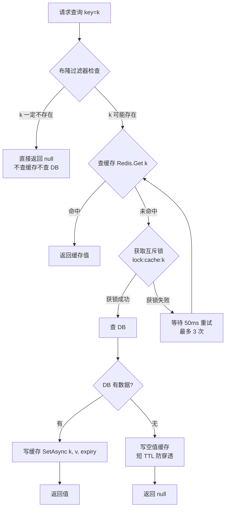
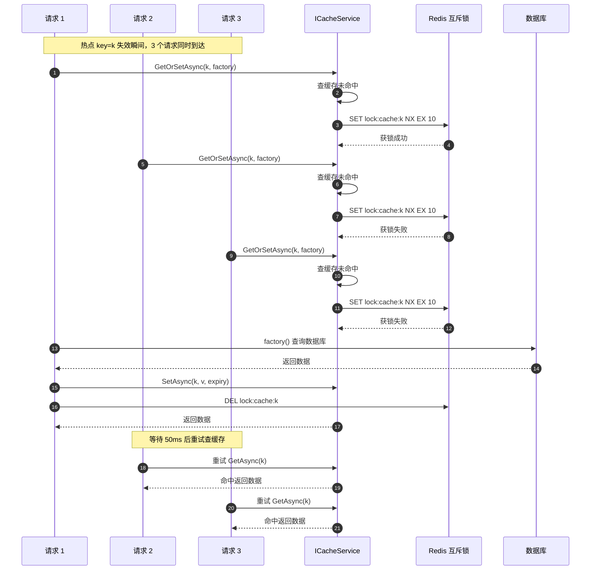
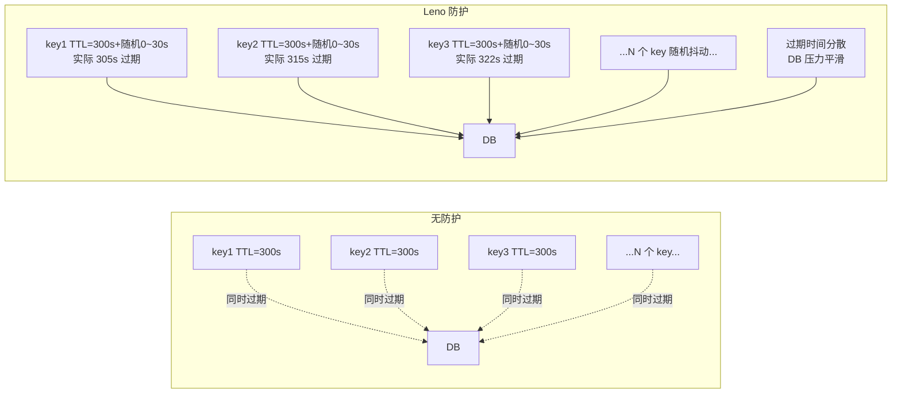
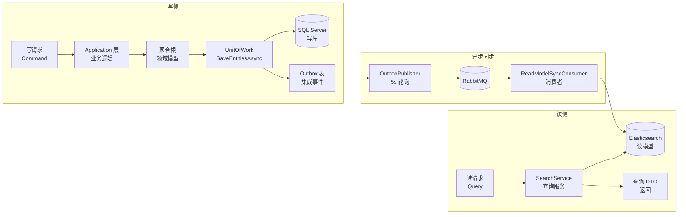

# 第 6 章 数据存储与缓存

## 学习目标

读完本章你将：

- 理解 Leno 11 个 BC（限界上下文，业务模型的显式边界）采用"一 BC 一库"分库策略的动机与收益，掌握 `BaseDbContext` 公共特性（OutboxMessages DbSet、乐观锁 shadow property `Version`、软删除全局查询过滤器、自动 `ApplyConfigurationsFromAssembly`）的统一约定
- 熟练运用 EF Core（Entity Framework Core，微软官方 ORM 框架）的 Fluent API（链式配置 API）编写实体映射配置类，掌握 snake_case 列命名、值对象映射（OwnsOne/OwnsMany）、枚举映射（HasConversion）、`IDesignTimeDbContextFactory` 设计期工厂等规范
- 掌握 Code First（先写代码再生成数据库 schema）迁移工作流，能按"仅追加"原则提交迁移文件，并运用"破坏性变更分版本灰度"3 阶段策略（AddItemRemarkNew → BackfillRemarkNew → RemoveRemarkOld）规避停机风险
- 熟练使用 `ICacheService` 抽象的 7 个方法应对缓存三防（穿透/击穿/雪崩），掌握双删一致性策略与 `leno:{bc}:{role}:{shopId}:{resource}:{id}` 缓存键规范
- 理解 CQRS（Command Query Responsibility Segregation，读写职责分离）读写分离架构与 Elasticsearch 读模型同步机制，能基于 `ReadModelSyncConsumerBase<TEvent, TReadModel>` 抽象基类编写消费者把领域事件投影为读模型文档

## 适用读者

开发（需要承担 BC 持久化层开发、缓存策略调优、读模型设计或库存预占 Lua 脚本维护的 .NET 工程师）

## 术语速查

本章将遇到的术语：

| 术语 | 简释 |
|---|---|
| EF Core | Entity Framework Core，微软官方轻量级、可扩展、跨平台 ORM 框架，支持 Code First 模型驱动开发 |
| Code First | 先写 C# 实体类与配置，再通过迁移命令生成数据库 schema 的开发模式（与 Database First 相对） |
| Fluent API | EF Core 链式配置 API（如 `builder.Property(x => x.Id).HasColumnName("id")`），比 Data Annotation 更灵活 |
| 迁移 | Migration，EF Core 把模型变更增量转化为 SQL 脚本的机制，每个迁移文件对应一次 schema 变更 |
| 乐观锁 | Optimistic Lock，假定并发冲突少见，更新时检查版本号，冲突时抛 `DbUpdateConcurrencyException` |
| 软删除 | Soft Delete，不物理删除记录而是标记 `IsDeleted=true`，通过全局查询过滤器自动隐藏 |
| Redis | Remote Dictionary Server，内存键值数据库，Leno 用作分布式缓存、分布式锁、库存预占原子操作后端 |
| 布隆过滤器 | Bloom Filter，概率型数据结构，"一定不存在"或"可能存在"，用于缓存穿透防护 |
| 缓存穿透 | 大量请求查询 DB 与缓存都不存在的 key，绕过缓存直击数据库 |
| 缓存击穿 | 单个热点 key 失效瞬间，大量请求同时回源 DB |
| 缓存雪崩 | 大量 key 同一时间集中过期，DB 瞬时压力暴增 |
| 双删一致性 | 缓存与 DB 一致性策略：先删缓存→写 DB→延迟再删缓存，缩小脏读窗口 |
| Elasticsearch | 分布式全文搜索引擎，Leno 用作 CQRS 读库，承载商品搜索、订单查询等读模型 |
| 读模型 | Read Model，CQRS 中专为查询场景物化的数据视图，与写库（领域聚合）分离 |
| Lua 脚本 | Redis 内嵌脚本语言，多命令原子执行，Leno 用于库存预占/确认/释放 |

---

## 6.1 数据库分库策略

第 5 章我们看了 11 个 BC 之间如何通信，但所有跨 BC 调用最终都落在"数据如何持久化"这一底层需求上。本章把镜头放在数据层，看 Leno 如何组织 11 个 BC 的存储。

### 分库的动机

分库（Database-per-Service，每个微服务独占一个数据库）是微服务架构的核心约束之一。Leno 11 个 BC 各自拥有独立 SQL Server 数据库，**禁止**跨 BC 直接访问对方数据库表。这个约束带来三个好处：

1. **数据所有权清晰**：每个 BC 的数据只有本 BC 能读写，其他 BC 想要数据必须通过集成事件或 Internal API（详见第 5 章），避免数据库层面的隐式耦合。
2. **独立演进**：每个 BC 的 schema 可以独立变更、独立迁移、独立扩容，不需要协调其他 BC 排期。Product BC 加字段不会锁住 Order BC 的迁移。
3. **故障隔离**：单个 BC 数据库故障不会拖垮其他 BC。例如 Payment 数据库慢查询不会阻塞 Cart 业务。

### 11 独立数据库清单

下表列出 Leno 11 个 BC 的数据库与对应的 DbContext：

| BC | DbContext | 数据库 | Migrations 目录 |
|---|---|---|---|
| UserAuth | `UserAuthDbContext` | LenoUserAuth | `src/Services/UserAuth/Leno.UserAuth.Infrastructure/Migrations/` |
| Cart | `CartDbContext` | LenoCart | `src/Services/Cart/Leno.Cart.Infrastructure/Migrations/` |
| Product | `ProductDbContext` | LenoProduct | `src/Services/Product/Leno.Product.Infrastructure/Migrations/` |
| Order | `OrderDbContext` | LenoOrder | `src/Services/Order/Leno.Order.Infrastructure/Migrations/` |
| Promotion | `PromotionDbContext` | LenoPromotion | `src/Services/Promotion/Leno.Promotion.Infrastructure/Migrations/` |
| Payment | `PaymentDbContext` | LenoPayment | `src/Services/Payment/Leno.Payment.Infrastructure/Migrations/` |
| PointsMembership | `PointsMembershipDbContext` | LenoPointsMembership | `src/Services/PointsMembership/Leno.PointsMembership.Infrastructure/Migrations/` |
| ReviewAfterSales | `ReviewAfterSalesDbContext` | LenoReviewAfterSales | `src/Services/ReviewAfterSales/Leno.ReviewAfterSales.Infrastructure/Migrations/` |
| SellerShop | `SellerShopDbContext` | LenoSellerShop | `src/Services/SellerShop/Leno.SellerShop.Infrastructure/Migrations/` |
| Notification | `NotificationDbContext` | LenoNotification | `src/Services/Notification/Leno.Notification.Infrastructure/Migrations/` |
| SystemAdmin | `SystemAdminDbContext` | LenoSystemAdmin | `src/Services/SystemAdmin/Leno.SystemAdmin.Infrastructure/Migrations/` |

每个 BC 的 DbContext 都继承自 `BaseDbContext`，复用公共能力，无需各自重新实现 Outbox、乐观锁、软删除等横切关注点。

### BaseDbContext 公共特性

源码位于 `src/BuildingBlocks/Leno.Infrastructure/Persistence/BaseDbContext.cs`：

```csharp
// [BaseDbContext.cs](file:///c:/Users/Junjie/.trae-cn/worktrees/Leno/feat-project-optimization-plan-O7ECNx/src/BuildingBlocks/Leno.Infrastructure/Persistence/BaseDbContext.cs)

public abstract class BaseDbContext : DbContext
{
    /// <summary>
    /// 发件箱消息集合，由基类统一暴露，各 BC 无需重复声明。
    /// </summary>
    public DbSet<OutboxMessage> OutboxMessages => Set<OutboxMessage>();

    protected BaseDbContext(DbContextOptions options) : base(options)
    {
    }

    protected override void OnModelCreating(ModelBuilder modelBuilder)
    {
        ArgumentNullException.ThrowIfNull(modelBuilder);

        // 基类统一应用 OutboxMessage 配置（先于子 assembly 配置，确保子类如存在同类型配置可覆盖）
        modelBuilder.ApplyConfiguration(new OutboxMessageConfiguration());

        modelBuilder.ApplyConfigurationsFromAssembly(GetType().Assembly);

        // 统一配置乐观锁 shadow property（避免领域层 Entity 携带持久化细节）
        // 所有继承 Entity 的实体自动获得名为 "Version" 的 rowversion shadow property
        // 跳过 owned type（由 OwnsOne/OwnsMany 持有的实体）以避免 "cannot be configured as non-owned" 异常
        foreach (var entityType in modelBuilder.Model.GetEntityTypes())
        {
            if (typeof(Entity).IsAssignableFrom(entityType.ClrType) && !entityType.IsOwned())
            {
                modelBuilder.Entity(entityType.ClrType)
                    .Property<byte[]>("Version")
                    .HasColumnName("version")
                    .IsRowVersion();
            }
        }

        ApplySoftDeleteQueryFilters(modelBuilder);

        base.OnModelCreating(modelBuilder);
    }

    /// <summary>
    /// 对所有实现 <see cref="ISoftDeletable"/> 的实体应用全局查询过滤器，
    /// 自动排除已软删除记录（<c>IsDeleted == false</c>）。
    /// </summary>
    private static void ApplySoftDeleteQueryFilters(ModelBuilder modelBuilder)
    {
        foreach (var entityType in modelBuilder.Model.GetEntityTypes())
        {
            if (!typeof(ISoftDeletable).IsAssignableFrom(entityType.ClrType))
            {
                continue;
            }

            // 跳过 owned type，避免对其重复配置触发 "cannot be configured as non-owned" 异常
            if (entityType.IsOwned())
            {
                continue;
            }

            var parameter = Expression.Parameter(entityType.ClrType, "e");
            var propertyAccess = Expression.Property(parameter, nameof(ISoftDeletable.IsDeleted));
            var notDeleted = Expression.Not(propertyAccess);
            var lambda = Expression.Lambda(notDeleted, parameter);

            modelBuilder.Entity(entityType.ClrType).HasQueryFilter(lambda);
        }
    }
    // 省略 SaveChanges/SaveChangesAsync 中 FillAuditableFields() 自动填充 CreatedAt/UpdatedAt 的实现...
}
```

`BaseDbContext` 为所有业务 DbContext 提供四大公共能力：

1. **统一 OutboxMessages DbSet**：每个 BC 都需要发件箱表（详见第 5 章 Outbox 模式），基类统一暴露 `DbSet<OutboxMessage>`，子类无需重复声明。
2. **乐观锁 shadow property `Version`**：所有继承 `Entity` 的实体自动获得名为 `"Version"` 的 `rowversion` shadow property（`IsRowVersion()`），列名 `version`。shadow property 让领域层 Entity 不携带持久化细节（Domain 层不知道有 `Version` 字段），EF Core 在 `UPDATE` 时自动追加 `WHERE version = @original` 子句，并发冲突抛 `DbUpdateConcurrencyException`。Owned type（被 `OwnsOne/OwnsMany` 持有的值对象）被跳过，避免触发 "cannot be configured as non-owned" 异常。
3. **软删除全局查询过滤器**：所有实现 `ISoftDeletable` 接口的实体自动获得 `HasQueryFilter(e => !e.IsDeleted)` 过滤器，所有查询默认隐藏 `IsDeleted=true` 的记录，开发者无需在每个查询里手写 `Where(x => !x.IsDeleted)`。要查软删除记录需显式调用 `IgnoreQueryFilters()`。
4. **自动 ApplyConfigurationsFromAssembly**：子类 DbContext 所在程序集下所有 `IEntityTypeConfiguration<T>` 实现类自动注册，开发者只需把配置类放在 `Configurations/` 目录下，无需在 `OnModelCreating` 里逐个 `ApplyConfiguration`。

### 跨库查询 3 种方案

分库后，原本一个 JOIN 就能搞定的跨 BC 查询变得复杂。比如"查订单列表同时展示商品标题"需要 Order 库 + Product 库协同。Leno 提供 3 种方案：

1. **集成事件 + 读模型物化**（推荐）：写库变更通过集成事件触发读模型同步到 Elasticsearch，查询直接走 ES 读模型，无需跨库 JOIN。详见 6.5 节。
2. **Internal API 同步调用**：调用方 BC 通过防腐层调用对方 BC 的 Internal API 拿数据，在应用层组装 DTO。详见第 5 章。
3. **冗余字段 + 事件更新**：调用方 BC 在自己的表里冗余对方字段（如 Order 表冗余 `product_name`），通过订阅对方集成事件更新冗余字段。代价是数据短暂不一致（事件传播延迟），适合对一致性要求不高的展示场景。

**严禁**直接连对方数据库查询。这会破坏分库的数据所有权边界，导致 BC 之间在数据库层耦合。

---

## 6.2 EF Core 配置

EF Core（Entity Framework Core）是微软官方的 ORM（Object-Relational Mapping，对象关系映射）框架，把 C# 对象与数据库表相互映射。Leno 用 EF Core 作为所有 BC 的持久化框架，采用 Code First 模式（先写 C# 实体类再生成数据库 schema）。

### Fluent API 行内解释

EF Core 配置实体映射有两种方式：Data Annotation（在实体类上加 `[Table]`、`[Column]` 等特性）和 Fluent API（链式调用 `builder.Property(x => x.Id).HasColumnName("id")`）。Leno 选 Fluent API，原因有二：

1. **保持 Domain 层纯净**：Domain 层实体类不引用 EF Core 特性，持久化配置与领域模型解耦。配置类全部放在 Infrastructure 层 `Configurations/` 目录下。
2. **更强大灵活**：Fluent API 支持的特性比 Data Annotation 多（如 shadow property、owned type 配置、复杂索引），且支持链式调用。

### 配置类规范代码示例

以 Cart BC 的 `CartConfiguration` 为例，源码位于 `src/Services/Cart/Leno.Cart.Infrastructure/Configurations/CartConfiguration.cs`：

```csharp
// [CartConfiguration.cs](file:///c:/Users/Junjie/.trae-cn/worktrees/Leno/feat-project-optimization-plan-O7ECNx/src/Services/Cart/Leno.Cart.Infrastructure/Configurations/CartConfiguration.cs)

using Leno.Cart.Domain.Aggregates;
using Microsoft.EntityFrameworkCore;
using Microsoft.EntityFrameworkCore.Metadata.Builders;
using CartAggregate = Leno.Cart.Domain.Aggregates.Cart;

namespace Leno.Cart.Infrastructure.Configurations;

/// <summary>
/// Cart 聚合根的 EF Core 映射配置（snake_case）。
/// CartItem 经 HasMany 一对多映射（独立表 cart_items，FK cart_id，级联删除）。
/// </summary>
public sealed class CartConfiguration : IEntityTypeConfiguration<CartAggregate>
{
    public void Configure(EntityTypeBuilder<CartAggregate> builder)
    {
        builder.ToTable("carts");
        builder.HasKey(c => c.Id);

        builder.Property(c => c.Id).HasColumnName("id");
        builder.Property(c => c.UserId).HasColumnName("user_id");

        builder.Property(c => c.CreatedAt).HasColumnName("created_at");
        builder.Property(c => c.UpdatedAt).HasColumnName("updated_at");
        builder.Property(c => c.CreatedBy).HasColumnName("created_by").HasMaxLength(64);
        builder.Property(c => c.UpdatedBy).HasColumnName("updated_by").HasMaxLength(64);

        // CartItem 一对多，独立表，级联删除
        builder.HasMany(c => c.Items)
            .WithOne()
            .HasForeignKey(i => i.CartId)
            .OnDelete(DeleteBehavior.Cascade);

        builder.HasIndex(c => c.UserId).IsUnique().HasDatabaseName("ix_carts_user_id");
    }
}

/// <summary>
/// CartItem 实体的 EF Core 映射配置（snake_case）。
/// </summary>
public sealed class CartItemConfiguration : IEntityTypeConfiguration<CartItem>
{
    public void Configure(EntityTypeBuilder<CartItem> builder)
    {
        builder.ToTable("cart_items");
        builder.HasKey(i => i.Id);

        builder.Property(i => i.Id).HasColumnName("id");
        builder.Property(i => i.CartId).HasColumnName("cart_id");
        builder.Property(i => i.SkuId).HasColumnName("sku_id");
        builder.Property(i => i.SellerId).HasColumnName("seller_id");
        builder.Property(i => i.Quantity).HasColumnName("quantity");
        builder.Property(i => i.IsSelected).HasColumnName("is_selected");
        builder.Property(i => i.SourceCartItemId).HasColumnName("source_cart_item_id");

        builder.Property(i => i.CreatedAt).HasColumnName("created_at");
        builder.Property(i => i.UpdatedAt).HasColumnName("updated_at");
        builder.Property(i => i.CreatedBy).HasColumnName("created_by").HasMaxLength(64);
        builder.Property(i => i.UpdatedBy).HasColumnName("updated_by").HasMaxLength(64);

        builder.HasIndex(i => i.SkuId).HasDatabaseName("ix_cart_items_sku_id");
        builder.HasIndex(i => i.SellerId).HasDatabaseName("ix_cart_items_seller_id");
    }
}
```

配置类规范要点：

- **实现 `IEntityTypeConfiguration<T>` 接口**：每个聚合根/实体一个配置类，类名约定 `{EntityName}Configuration`，放在 Infrastructure 层 `Configurations/` 目录下。`BaseDbContext.OnModelCreating` 会通过 `ApplyConfigurationsFromAssembly` 自动注册。
- **snake_case 命名**：表名、列名、索引名全部 snake_case。表名 `carts`/`cart_items`，列名 `user_id`/`created_at`，索引名 `ix_carts_user_id`。这与 PostgreSQL/MySQL 习惯一致，避免 SQL Server 默认 PascalCase 在跨数据库迁移时带来的麻烦。
- **显式 `HasColumnName`**：每个属性都显式指定列名，不依赖 EF Core 默认约定（默认会按属性名生成 PascalCase 列名）。
- **外键 `OnDelete(DeleteBehavior.Cascade)`**：聚合根删除时子实体级联删除。如 Cart 删除时所有 CartItem 一起删除，符合聚合一致性约束。
- **索引命名 `ix_{table}_{column}`**：所有索引显式命名，唯一索引加 `IsUnique()`，便于 DBA 排查慢查询时按名定位。

### 值对象映射

DDD 中的值对象（Value Object，无唯一标识的不可变对象，如地址、金额）在 EF Core 中用 `OwnsOne`（单值）或 `OwnsMany`（集合）映射。以 Product BC 的 `SPUConfiguration` 为例，图片画廊作为值对象集合拆表：

```csharp
// [SPUConfiguration.cs](file:///c:/Users/Junjie/.trae-cn/worktrees/Leno/feat-project-optimization-plan-O7ECNx/src/Services/Product/Leno.Product.Infrastructure/Configurations/SPUConfiguration.cs)

public sealed class SPUConfiguration : IEntityTypeConfiguration<SPU>
{
    public void Configure(EntityTypeBuilder<SPU> builder)
    {
        builder.ToTable("spus");
        builder.HasKey(s => s.Id);

        // 省略其他列配置...

        // 规格维度名集合序列化为 JSON 列
        builder.Property(s => s.Specs)
            .HasColumnName("specs")
            .HasConversion(
                v => JsonSerializer.Serialize(v, (JsonSerializerOptions?)null),
                v => JsonSerializer.Deserialize<List<string>>(v, (JsonSerializerOptions?)null) ?? new List<string>());

        // 审核历史序列化为 JSON 列
        builder.Property<List<AuditInfo>>("_auditHistory")
            .HasColumnName("audit_history")
            .HasConversion(
                v => JsonSerializer.Serialize(v, (JsonSerializerOptions?)null),
                v => JsonSerializer.Deserialize<List<AuditInfo>>(v, (JsonSerializerOptions?)null) ?? new List<AuditInfo>());

        // 图片画廊作为拥有值对象集合拆表
        builder.OwnsMany(s => s.Images, img =>
        {
            img.ToTable("spu_images");
            img.Property(i => i.Url).HasColumnName("url").HasMaxLength(512).IsRequired();
            img.Property(i => i.SortOrder).HasColumnName("sort_order");
            img.Property(i => i.IsMain).HasColumnName("is_main");
        });

        // SKU 一对多，独立表，级联删除
        builder.HasMany(s => s.SKUs)
            .WithOne()
            .HasForeignKey(sku => sku.SpuId)
            .OnDelete(DeleteBehavior.Cascade);

        builder.HasIndex(s => s.ShopId).HasDatabaseName("ix_spus_shop_id");
        builder.HasIndex(s => s.Status).HasDatabaseName("ix_spus_status");
        builder.HasIndex(s => s.CategoryId).HasDatabaseName("ix_spus_category_id");
    }
}
```

值对象映射要点：

- **`OwnsMany` 拆表**：值对象集合（如 `Images`）用 `OwnsMany` 映射到独立表 `spu_images`，主表删除时子表级联删除（owned type 天然跟随所有者生命周期）。
- **JSON 列存储集合**：简单的值对象集合（如 `Specs` 字符串列表、`_auditHistory` 审核历史）用 `HasConversion` 序列化为 JSON 字符串存单列，避免拆表带来的 JOIN 开销。注意 `_auditHistory` 是私有字段，EF Core 7+ 支持私有字段映射。
- **`HasConversion` 双向转换**：第一个 lambda 是"写库时序列化"，第二个是"读库时反序列化"。

### 枚举映射

枚举（如 `ProductStatus`）默认按 `int` 存储。在 `SPUConfiguration` 中：

```csharp
builder.Property(s => s.Status).HasColumnName("status").HasConversion<int>();
```

`HasConversion<int>()` 显式声明按 `int` 存储（即使枚举底层类型就是 `int`，显式声明可读性更好）。如果需要按字符串存储枚举名（便于 DBA 直接读库），用 `HasConversion<string>()`。Leno 默认按 `int` 存储，节省空间且查询性能更好。

### IDesignTimeDbContextFactory

`dotnet ef migrations add` 命令需要构造 DbContext 实例来对比模型差异。默认会尝试启动 `Program.cs`，但完整启动需要连 Redis、RabbitMQ、Consul 等基础设施，本地开发不便。`IDesignTimeDbContextFactory<T>` 接口允许为设计期单独提供工厂，跳过完整启动。

每个 BC 都有一个 DesignTimeFactory，源码示例位于 `src/Services/Cart/Leno.Cart.Infrastructure/CartDbContextDesignTimeFactory.cs`：

```csharp
// [CartDbContextDesignTimeFactory.cs](file:///c:/Users/Junjie/.trae-cn/worktrees/Leno/feat-project-optimization-plan-O7ECNx/src/Services/Cart/Leno.Cart.Infrastructure/CartDbContextDesignTimeFactory.cs)

using Microsoft.EntityFrameworkCore;
using Microsoft.EntityFrameworkCore.Design;

namespace Leno.Cart.Infrastructure;

/// <summary>
/// EF Core 设计期工厂，避免 dotnet ef migrations add 启动完整 Program.cs（依赖 Redis 等基础设施）。
/// 仅用于生成迁移与脚本，不连接真实数据库。
/// </summary>
public sealed class CartDbContextDesignTimeFactory : IDesignTimeDbContextFactory<CartDbContext>
{
    public CartDbContext CreateDbContext(string[] args)
    {
        var options = new DbContextOptionsBuilder<CartDbContext>()
            .UseSqlServer("Server=localhost,1433;Database=LenoCart;User Id=sa;Password=Leno@SqlServer2019;TrustServerCertificate=True;MultipleActiveResultSets=true")
            .Options;
        return new CartDbContext(options);
    }
}
```

要点：

- **类名约定**：`{DbContextName}DesignTimeFactory`，放在 Infrastructure 项目根目录（与 DbContext 同级）。
- **连接字符串硬编码**：设计期工厂的连接字符串只用于生成迁移文件，不实际连库，硬编码可接受。运行时连接字符串从 `appsettings.json` + 环境变量注入。
- **11 BC 全覆盖**：每个 BC 都有自己的 DesignTimeFactory，文件位置一致（`src/Services/{BC}/Leno.{BC}.Infrastructure/{BC}DbContextDesignTimeFactory.cs`）。

---

## 6.3 数据库迁移规范

### Code First 行内解释

Code First（先写代码再生成 schema）的工作流是：开发者修改 C# 实体类与 Configuration → 运行 `dotnet ef migrations add` 命令对比模型差异生成迁移文件 → 运行 `dotnet ef database update` 或在程序启动时调 `MigrateAsync` 应用迁移到数据库。EF Core 用 `__EFMigrationsHistory` 表记录已应用的迁移，启动时只跑未应用的迁移。

### 迁移命令清单

| 命令 | 作用 | 典型用法 |
|---|---|---|
| `dotnet ef migrations add <Name>` | 生成新迁移文件 | `dotnet ef migrations add AddOrderRemark --project src/Services/Order/Leno.Order.Infrastructure --startup-project src/Services/Order/Leno.Order.Api` |
| `dotnet ef migrations remove` | 撤销最近一次未提交的迁移 | `dotnet ef migrations remove --project ... --startup-project ...` |
| `dotnet ef migrations list` | 列出所有迁移 | `dotnet ef migrations list --project ... --startup-project ...` |
| `dotnet ef migrations script` | 生成 SQL 脚本（不执行） | `dotnet ef migrations script -o ./sql/20260720_add_remark.sql --project ...` |
| `dotnet ef database update` | 应用迁移到数据库 | `dotnet ef database update --project ... --startup-project ...` |
| `dotnet ef dbcontext info` | 查看 DbContext 配置信息 | `dotnet ef dbcontext info --project ... --startup-project ...` |

### 命令完整示例

以 Order BC 新增订单备注字段为例，完整命令：

```bash
# 1. 修改 Order 聚合根，添加 Remark 属性
# 2. 修改 OrderConfiguration，添加 builder.Property(o => o.Remark).HasColumnName("remark").HasMaxLength(200);
# 3. 生成迁移
dotnet ef migrations add AddOrderRemark \
  --project src/Services/Order/Leno.Order.Infrastructure \
  --startup-project src/Services/Order/Leno.Order.Api

# 4. 检查生成的迁移文件
#    src/Services/Order/Leno.Order.Infrastructure/Migrations/{timestamp}_AddOrderRemark.cs
#    src/Services/Order/Leno.Order.Infrastructure/Migrations/{timestamp}_AddOrderRemark.Designer.cs
#    src/Services/Order/Leno.Order.Infrastructure/Migrations/OrderDbContextModelSnapshot.cs (更新)

# 5. 生成 SQL 脚本（用于 DBA 审查 / 生产环境手动执行）
dotnet ef migrations script -o ./sql/20260720_add_remark.sql \
  --project src/Services/Order/Leno.Order.Infrastructure \
  --startup-project src/Services/Order/Leno.Order.Api

# 6. 本地开发环境直接应用
dotnet ef database update \
  --project src/Services/Order/Leno.Order.Infrastructure \
  --startup-project src/Services/Order/Leno.Order.Api
```

### 迁移文件命名规范

EF Core 生成的迁移文件命名格式为 `yyyyMMddHHmmss_PascalCaseName.cs`，时间戳前缀保证迁移按时间顺序排列。例如：

- `20260717174927_InitialCreate.cs` — Cart BC 初始迁移
- `20260717174606_InitialCreate.cs` — Order BC 初始迁移
- `20260718124540_AddPriceHistoryAggregate.cs` — Product BC 新增价格历史聚合

每个迁移产生 3 个文件：

1. `{timestamp}_{Name}.cs` — 迁移主体，包含 `Up(MigrationBuilder)` 与 `Down(MigrationBuilder)` 方法
2. `{timestamp}_{Name}.Designer.cs` — 当前迁移应用后的模型快照（用于对比下一次迁移的差异）
3. `{DbContext}ModelSnapshot.cs` — 当前最新模型快照（每次新增迁移会更新）

迁移主体示例（Cart BC 初始迁移，节选）：

```csharp
// [20260717174927_InitialCreate.cs](file:///c:/Users/Junjie/.trae-cn/worktrees/Leno/feat-project-optimization-plan-O7ECNx/src/Services/Cart/Leno.Cart.Infrastructure/Migrations/20260717174927_InitialCreate.cs)

public partial class InitialCreate : Migration
{
    protected override void Up(MigrationBuilder migrationBuilder)
    {
        migrationBuilder.CreateTable(
            name: "carts",
            columns: table => new
            {
                id = table.Column<Guid>(type: "uniqueidentifier", nullable: false),
                user_id = table.Column<Guid>(type: "uniqueidentifier", nullable: false),
                version = table.Column<byte[]>(type: "rowversion", rowVersion: true, nullable: true),
                created_at = table.Column<DateTime>(type: "datetime2", nullable: false),
                updated_at = table.Column<DateTime>(type: "datetime2", nullable: false),
                created_by = table.Column<string>(type: "nvarchar(64)", maxLength: 64, nullable: true),
                updated_by = table.Column<string>(type: "nvarchar(64)", maxLength: 64, nullable: true)
            },
            constraints: table =>
            {
                table.PrimaryKey("PK_carts", x => x.id);
            });
        // 省略 cart_items、outbox_messages 表创建与索引...
    }

    protected override void Down(MigrationBuilder migrationBuilder)
    {
        migrationBuilder.DropTable(name: "cart_items");
        migrationBuilder.DropTable(name: "outbox_messages");
        migrationBuilder.DropTable(name: "carts");
    }
}
```

注意迁移生成的列名遵循 snake_case 约定（`user_id`、`created_at`、`version`），与 `CartConfiguration` 中的 `HasColumnName("user_id")` 一致。乐观锁 `version` 列类型为 `rowversion`（SQL Server 专有，自动递增的二进制版本号）。

### "仅追加"原则

迁移文件一旦提交到主分支就**永不修改、永不删除**。原因：

- 生产环境已应用过该迁移，`__EFMigrationsHistory` 表有记录。删除或修改迁移文件会导致 EF Core 找不到对应记录，下次 `MigrateAsync` 报错。
- 团队成员本地数据库可能已应用该迁移，强行删除会让他们的本地库进入不一致状态。

如果迁移有 bug，正确做法是**再追加一个新迁移修复**（如 `FixOrderRemarkLength`），而不是改原迁移文件。仅当迁移文件尚未提交到主分支且所有人都未应用时，才可用 `dotnet ef migrations remove` 撤销。

### 破坏性变更分版本灰度策略

破坏性变更（如删列、改列类型、重命名）不能一次性提交，否则旧版本代码读到不存在的列直接报错。Leno 采用 3 阶段灰度策略，以"删除订单备注 `remark` 列"为例：

**阶段 1：新增列 `remark_new`，旧列 `remark` 暂保留**

```csharp
// 迁移 1: AddItemRemarkNew
public partial class AddItemRemarkNew : Migration
{
    protected override void Up(MigrationBuilder migrationBuilder)
    {
        migrationBuilder.AddColumn<string>(
            name: "remark_new",
            table: "orders",
            type: "nvarchar(200)",
            maxLength: 200,
            nullable: true);
    }

    protected override void Down(MigrationBuilder migrationBuilder)
    {
        migrationBuilder.DropColumn(name: "remark_new", table: "orders");
    }
}
```

代码层同时双写 `remark` 与 `remark_new`（写入时填两个字段，读取优先读 `remark_new` 兜底 `remark`）。部署此版本后，新旧代码都能正常工作。

**阶段 2：数据回填 `BackfillRemarkNew`**

```csharp
// 迁移 2: BackfillRemarkNew
public partial class BackfillRemarkNew : Migration
{
    protected override void Up(MigrationBuilder migrationBuilder)
    {
        // 把 remark 的值复制到 remark_new（仅 remark_new 为 NULL 的行）
        migrationBuilder.Sql(@"
            UPDATE orders
            SET remark_new = remark
            WHERE remark_new IS NULL AND remark IS NOT NULL;
        ");
    }

    protected override void Down(MigrationBuilder migrationBuilder)
    {
        // Down 不撤销回填，数据已就位无需逆向
    }
}
```

回填后所有 `remark_new` 字段都有值。代码层读取可以完全切到 `remark_new`，不再读 `remark`。

**阶段 3：删除旧列 `RemoveRemarkOld`**

```csharp
// 迁移 3: RemoveRemarkOld（必须确认阶段 2 已在所有环境执行完毕，且代码层不再读 remark）
public partial class RemoveRemarkOld : Migration
{
    protected override void Up(MigrationBuilder migrationBuilder)
    {
        migrationBuilder.DropColumn(name: "remark", table: "orders");
    }

    protected override void Down(MigrationBuilder migrationBuilder)
    {
        migrationBuilder.AddColumn<string>(
            name: "remark",
            table: "orders",
            type: "nvarchar(200)",
            maxLength: 200,
            nullable: true);
        // 注意：Down 恢复的 remark 列数据已丢失，无法回填。这是破坏性变更的代价。
    }
}
```

3 阶段之间至少间隔一个完整发布周期（通常 1-2 周），保证所有环境（开发/测试/预发/生产）都已应用前一阶段迁移。**严禁**把 3 阶段合并成一次提交，否则等同于直接删列，失去灰度意义。

### MigrateWithLockAsync 机制详解

微服务多实例部署时，启动瞬间多个实例同时执行 `MigrateAsync` 会导致 schema 冲突（如重复创建表）。Leno 用 Redis 分布式锁保证同一 DbContext 同一时刻只有一个实例执行迁移。

源码位于 `src/BuildingBlocks/Leno.Infrastructure/Persistence/DatabaseMigrationExtensions.cs`：

```csharp
// [DatabaseMigrationExtensions.cs](file:///c:/Users/Junjie/.trae-cn/worktrees/Leno/feat-project-optimization-plan-O7ECNx/src/BuildingBlocks/Leno.Infrastructure/Persistence/DatabaseMigrationExtensions.cs)

using Medallion.Threading;
using Microsoft.EntityFrameworkCore;
using Microsoft.Extensions.DependencyInjection;
using Microsoft.Extensions.Logging;

namespace Leno.Infrastructure.Persistence;

public static class DatabaseMigrationExtensions
{
    /// <summary>
    /// 在 Redis 分布式锁保护下执行 EF Core 数据库迁移。
    /// 同一 DbContext 类名的锁键（db-migrate:{DbContextName}）同一时刻仅允许一个实例执行迁移，
    /// 其他实例获取锁失败时直接跳过（已由首个实例完成迁移）。
    /// </summary>
    public static async Task MigrateWithLockAsync<TDbContext>(
        this IServiceProvider services,
        TimeSpan? acquireTimeout = null,
        CancellationToken ct = default)
        where TDbContext : DbContext
    {
        using var scope = services.CreateScope();
        var sp = scope.ServiceProvider;
        var db = sp.GetRequiredService<TDbContext>();
        var lockProvider = sp.GetRequiredService<IDistributedLockProvider>();
        var logger = sp.GetService<ILoggerFactory>()?.CreateLogger(typeof(DatabaseMigrationExtensions).FullName ?? "DatabaseMigration");

        var lockKey = $"db-migrate:{typeof(TDbContext).Name}";
        var timeout = acquireTimeout ?? TimeSpan.FromMinutes(5);

        await using var handle = await lockProvider.TryAcquireLockAsync(lockKey, timeout, ct);
        if (handle == null)
        {
            logger?.LogInformation("数据库迁移锁 {LockKey} 已被其他实例持有，跳过迁移", lockKey);
            return;
        }

        logger?.LogInformation("已获取迁移锁 {LockKey}，开始执行 {DbContextName} 迁移", lockKey, typeof(TDbContext).Name);
        await db.Database.MigrateAsync(ct);
        logger?.LogInformation("{DbContextName} 迁移完成", typeof(TDbContext).Name);
    }
}
```

机制要点：

- **基于 `IDistributedLockProvider`**：来自 `Medallion.Threading` 库（.NET 流行的分布式锁抽象），底层实现是 Redis。Leno 在 DI 容器注册 `IDistributedLockProvider` 单例，所有 BC 共享。
- **lockKey 格式**：`db-migrate:{typeof(TDbContext).Name}`，如 `db-migrate:CartDbContext`、`db-migrate:OrderDbContext`。不同 BC 的迁移互不阻塞，但同一 BC 的多实例串行迁移。
- **`TryAcquireLockAsync` 非阻塞获取**：拿不到锁返回 `null`（不抛异常），实例直接跳过迁移（已被首个实例完成）。`acquireTimeout` 默认 5 分钟，超时也返回 null。
- **`await using` 自动释放**：`handle` 实现 `IAsyncDisposable`，方法结束自动释放锁。
- **作用域 `CreateScope`**：从根容器创建作用域解析 DbContext，避免 DbContext 单例泄漏。

各 BC 在 `Program.cs` 启动时调用：

```csharp
// 启动时执行 EF Core 迁移（带 Redis 分布式锁，避免多实例并发冲突）
await app.Services.MigrateWithLockAsync<CartDbContext>();
app.Run();
```

### 11 BC Migrations 目录位置

11 个 BC 的迁移目录路径模式一致：`src/Services/{BC}/Leno.{BC}.Infrastructure/Migrations/`。每个目录至少包含：

- 一个或多个 `{timestamp}_{Name}.cs` 迁移文件
- `{BC}DbContextModelSnapshot.cs` 当前模型快照

下表列出 11 BC 当前的迁移文件：

| BC | 初始迁移时间戳 | 迁移文件 |
|---|---|---|
| Order | 20260717174606 | `20260717174606_InitialCreate` |
| UserAuth | 20260717174814 | `20260717174814_InitialCreate` |
| Product | 20260717174853 | `20260717174853_InitialCreate` + `20260718124540_AddPriceHistoryAggregate` |
| Cart | 20260717174927 | `20260717174927_InitialCreate` |
| Promotion | 20260717175003 | `20260717175003_InitialCreate` |
| Payment | 20260717175039 | `20260717175039_InitialCreate` |
| PointsMembership | 20260717175251 | `20260717175251_InitialCreate` |
| ReviewAfterSales | 20260717175329 | `20260717175329_InitialCreate` |
| SellerShop | 20260717175445 | `20260717175445_InitialCreate` |
| Notification | 20260717175521 | `20260717175521_InitialCreate` |
| SystemAdmin | 20260717175558 | `20260717175558_InitialCreate` |

Product BC 已有 2 个迁移（InitialCreate + AddPriceHistoryAggregate），展示了"仅追加"原则的实际应用——新功能加新迁移，不改 InitialCreate。

---

## 6.4 Redis 缓存

### Redis 行内解释

Redis（Remote Dictionary Server）是内存键值数据库，单线程模型保证命令原子性，常用于分布式缓存、分布式锁、限流计数器。Leno 用 Redis 承担三角色：

1. **分布式缓存**：热点数据缓存（商品详情、用户会话、配置项）
2. **分布式锁**：数据库迁移锁（见 6.3 节 `MigrateWithLockAsync`）、库存预占（见 6.6 节）
3. **库存预占原子操作**：基于 Lua 脚本实现预占/确认/释放原子语义

### ICacheService 接口

源码位于 `src/BuildingBlocks/Leno.Infrastructure.Abstractions/ICacheService.cs`：

```csharp
// [ICacheService.cs](file:///c:/Users/Junjie/.trae-cn/worktrees/Leno/feat-project-optimization-plan-O7ECNx/src/BuildingBlocks/Leno.Infrastructure.Abstractions/ICacheService.cs)

namespace Leno.Infrastructure.Abstractions;

/// <summary>
/// 分布式缓存服务抽象，提供缓存穿透防护（布隆过滤器）、缓存击穿防护（互斥锁）、
/// 缓存雪崩防护（随机抖动过期时间）等能力。
/// </summary>
public interface ICacheService
{
    /// <summary>
    /// 获取或设置缓存项。若缓存命中则直接返回；若未命中则调用工厂方法获取数据、写入缓存并返回。
    /// 内置布隆过滤器检查 —— 若 key 一定不存在，直接返回默认值，无需查询后端。
    /// </summary>
    Task<T?> GetOrSetAsync<T>(string key, Func<CancellationToken, Task<T?>> factory, TimeSpan? expiry = null, CancellationToken ct = default) where T : class;

    /// <summary>设置缓存项。</summary>
    Task SetAsync<T>(string key, T value, TimeSpan? expiry = null, CancellationToken ct = default) where T : class;

    /// <summary>获取缓存项。</summary>
    Task<T?> GetAsync<T>(string key, CancellationToken ct = default) where T : class;

    /// <summary>移除缓存项。</summary>
    Task RemoveAsync(string key, CancellationToken ct = default);

    /// <summary>
    /// 双删模式失效缓存：先删 → 执行业务写库 → 延迟 500ms → 再删一次，
    /// 缩小"先删→写库→并发读回填"脏读窗口。
    /// </summary>
    Task InvalidateWithDoubleDeleteAsync(
        string key,
        Func<CancellationToken, Task> writeAction,
        CancellationToken ct = default);

    /// <summary>
    /// 按 glob 模式批量失效缓存。使用 SCAN 游标迭代匹配 key（避免 KEYS 阻塞 Redis），
    /// 默认每 100 个 key 批量 UNLINK（异步删除，不阻塞 Redis 主线程）。
    /// </summary>
    Task InvalidatePatternAsync(string pattern, CancellationToken ct = default);

    /// <summary>
    /// 预热布隆过滤器，将一批已知存在的 key 批量添加到过滤器。
    /// 在服务启动时调用。
    /// </summary>
    Task PreWarmBloomFilterAsync(IEnumerable<string> keys, CancellationToken ct = default);
}
```

`ICacheService` 抽象 7 个方法，覆盖缓存生命周期的所有操作：

| 方法 | 作用 |
|---|---|
| `GetOrSetAsync<T>` | 获取或设置缓存项，未命中时调 factory 取数据并写缓存；内置布隆过滤器检查（一定不存在的 key 直接返回 null） |
| `SetAsync<T>` | 直接设置缓存项 |
| `GetAsync<T>` | 获取缓存项（不触发回源） |
| `RemoveAsync` | 移除单个缓存项 |
| `InvalidateWithDoubleDeleteAsync` | 双删模式失效缓存（先删→写库→延迟 500ms→再删） |
| `InvalidatePatternAsync` | 按 glob 模式批量失效（SCAN + UNLINK） |
| `PreWarmBloomFilterAsync` | 预热布隆过滤器（启动时调用） |

业务代码注入 `ICacheService` 而非 `IConnectionMultiplexer`，便于单元测试 mock，且把缓存策略封装在实现层。

### 三防策略

缓存三防是分布式系统的经典话题，针对三类典型故障模式：

| 故障 | 触发场景 | 防护策略 | ICacheService 方法 |
|---|---|---|---|
| 缓存穿透 | 大量请求查询 DB 与缓存都不存在的 key（如恶意攻击用不存在的 ID 查商品） | 布隆过滤器：service 启动时 `PreWarmBloomFilterAsync` 加载所有存在 key；`GetOrSetAsync` 内置过滤器检查，"一定不存在"直接返回 null | `PreWarmBloomFilterAsync` + `GetOrSetAsync` |
| 缓存击穿 | 单个热点 key 失效瞬间，大量请求同时回源 DB | 互斥锁（Mutex）：未命中时只允许一个请求获取锁回源 DB，其他请求等待或返回旧值 | `GetOrSetAsync`（实现层内置互斥锁） |
| 缓存雪崩 | 大量 key 同一时间集中过期，DB 瞬时压力暴增 | 随机抖动过期时间：`expiry + Random(0, expiry*0.1)`，把过期时间分散 | `SetAsync` / `GetOrSetAsync`（实现层内置抖动） |

### 缓存穿透防护流程图



布隆过滤器的关键性质：

- **"一定不存在"是确定的**：布隆过滤器说 k 不存在，那 k 一定不在 DB 里，直接返回 null，不查缓存也不查 DB。
- **"可能存在"有假阳性**：布隆过滤器说 k 可能存在，实际可能不存在。此时照常查缓存→查 DB，未命中时写空值缓存（短 TTL，如 60 秒）防止后续请求再穿透。

### 缓存击穿防护流程图



互斥锁的关键设计：

- **锁超时 10 秒**：避免持锁请求崩溃导致锁永远不释放。
- **等待方 50ms 轮询**：等待方不获取锁，而是 50ms 后重试查缓存（此时持锁方已写入缓存）。最多重试 3 次，超过则放弃互斥直接回源（极小概率场景，避免请求堆积）。
- **锁粒度 `lock:cache:{key}`**：每个 key 一把锁，不同 key 互不阻塞。

### 缓存雪崩防护流程图



随机抖动的实现：`SetAsync(k, v, expiry)` 内部把 `expiry` 替换为 `expiry + Random.Next(0, expiry * 10%)`。例如 `expiry=300s`，实际 TTL 在 300~330 秒之间随机。这把集中过期分散到 30 秒窗口内，DB 压力平滑。

### 双删一致性

缓存与 DB 一致性是分布式系统的另一经典难题。Leno 采用"延迟双删"策略，由 `InvalidateWithDoubleDeleteAsync` 封装：

```csharp
// 业务层调用示例
await cache.InvalidateWithDoubleDeleteAsync(
    $"leno:product:public:{shopId}:product:{productId}",
    async ct =>
    {
        await repo.UpdateAsync(entity, ct);  // 写库
    },
    ct);
```

执行流程：

1. **第一次删除缓存**：先把缓存 key 删除。
2. **执行业务写库**：调用方传入的 `writeAction` 委托执行 `repo.UpdateAsync` 写 DB。
3. **延迟 500ms**：等待读请求把 DB 旧值回填到缓存（这是脏读窗口）。
4. **第二次删除缓存**：把可能被回填的脏数据再次删除。

双删的目的是缩小"先删缓存→写库→并发读回填旧值"这个脏读窗口。500ms 延迟是经验值，覆盖大部分读请求的回填时间。极端高并发场景可配合"读请求加锁"或"订阅 binlog 异步删缓存"进一步收敛。

### 缓存键规范

Leno 缓存键统一格式：

```
leno:{bc}:{role}:{shopId}:{resource}:{id}
```

各段含义：

- `leno`：项目前缀，避免与其他项目共用 Redis 时键冲突。
- `{bc}`：BC 名缩写（如 `product`、`order`、`cart`），按 BC 隔离。
- `{role}`：数据角色（如 `public` 公开可读、`internal` 跨 BC 内部读、`admin` 后台读），按访问权限隔离。
- `{shopId}`：店铺标识（多租户隔离），全局数据用 `0` 或省略。
- `{resource}`：资源类型（如 `product`、`order`、`sku`、`coupon`）。
- `{id}`：资源唯一标识。

示例：

- `leno:product:public:0:product:abc-123` — 公开商品详情
- `leno:order:internal:0:order:xyz-789` — 跨 BC 内部订单查询
- `leno:promotion:public:shop-001:coupon:SUMMER2026` — 店铺级优惠券

`InvalidatePatternAsync` 批量失效时用 glob 模式匹配，如 `leno:product:public:0:product:*` 失效所有公开商品缓存。

---

## 6.5 Elasticsearch 读模型

### Elasticsearch 行内解释

Elasticsearch（简称 ES）是分布式全文搜索引擎，基于 Apache Lucene，支持倒排索引、分词、相关性评分、聚合分析。Leno 用 ES 承担 CQRS 读库角色，承载商品搜索、订单查询、积分账户查询等读密集型场景。

### CQRS 读写分离架构图



### 读模型行内解释

读模型（Read Model）是 CQRS 模式中专为查询场景物化的数据视图，与写库（领域聚合）分离。写库为事务一致性优化（规范化、3NF），读模型为查询性能优化（反规范化、冗余字段、倒排索引）。Leno 把读模型存到 Elasticsearch，利用其全文搜索与聚合分析能力。

读写分离的好处：

1. **独立扩展**：读流量大可以单独扩 ES 节点，不影响写库。
2. **schema 解耦**：读模型可以按查询需求冗余字段（如 `ProductReadModel` 把 SKU 价格区间预聚合为 `MinPrice`/`MaxPrice`），无需 JOIN。
3. **查询能力增强**：ES 支持全文搜索、模糊匹配、聚合分析，SQL Server 做这些场景性能与开发体验都差。

代价是**最终一致性**：写库变更通过集成事件异步同步到读模型，有秒级延迟。容忍延迟的场景才适合走读模型。

### ReadModelSyncConsumerBase 抽象基类

源码位于 `src/BuildingBlocks/Leno.Infrastructure/ReadModel/ReadModelSyncConsumerBase.cs`：

```csharp
// [ReadModelSyncConsumerBase.cs](file:///c:/Users/Junjie/.trae-cn/worktrees/Leno/feat-project-optimization-plan-O7ECNx/src/BuildingBlocks/Leno.Infrastructure/ReadModel/ReadModelSyncConsumerBase.cs)

using Leno.SharedContracts.Events;
using MassTransit;
using Microsoft.Extensions.Logging;

namespace Leno.Infrastructure.ReadModel;

/// <summary>
/// 读模型同步消费者基类，消费集成事件并将读模型索引到 Elasticsearch。
/// 子类实现 <see cref="BuildReadModelAsync"/> 将事件转换为读模型文档与索引信息；
/// 重写 <see cref="BuildDeleteActionAsync"/> 声明本事件触发删除（默认返回 null，仅索引场景无需重写）。
/// 删除分支优先于索引分支：同一事件通常不会同时触发索引与删除。
/// 索引或删除失败均抛出异常以触发 MassTransit 重试与死信队列。
/// </summary>
/// <typeparam name="TEvent">触发同步的集成事件类型。</typeparam>
/// <typeparam name="TReadModel">ES 读模型文档类型。</typeparam>
public abstract class ReadModelSyncConsumerBase<TEvent, TReadModel> : IConsumer<TEvent>
    where TEvent : class, IIntegrationEvent
    where TReadModel : class
{
    protected IEsReadModelRepository<TReadModel> Repository { get; }
    protected ILogger Logger { get; }

    protected ReadModelSyncConsumerBase(IEsReadModelRepository<TReadModel> repository, ILogger logger)
    {
        ArgumentNullException.ThrowIfNull(repository);
        ArgumentNullException.ThrowIfNull(logger);
        Repository = repository;
        Logger = logger;
    }

    public async Task Consume(ConsumeContext<TEvent> context)
    {
        ArgumentNullException.ThrowIfNull(context);
        var evt = context.Message;

        try
        {
            // 删除分支（优先于索引分支：同一事件通常不会同时触发索引与删除）
            var deleteAction = await BuildDeleteActionAsync(evt, context.CancellationToken);
            if (deleteAction is { } delete
                && !string.IsNullOrEmpty(delete.Id)
                && !string.IsNullOrEmpty(delete.IndexName))
            {
                var deleteSuccess = await Repository.DeleteByIdAsync(
                    delete.Id, delete.IndexName, context.CancellationToken);
                if (!deleteSuccess)
                {
                    throw new InvalidOperationException(
                        $"ES 读模型删除失败 Id={delete.Id} Index={delete.IndexName}");
                }

                Logger.LogInformation("读模型已删除 EventId={EventId} Index={Index} Id={Id}",
                    evt.EventId, delete.IndexName, delete.Id);
                return;
            }

            // 索引分支（既有逻辑保持不变）
            var (id, indexName, readModel) = await BuildReadModelAsync(evt, context.CancellationToken);
            if (readModel is null || string.IsNullOrEmpty(id) || string.IsNullOrEmpty(indexName))
            {
                Logger.LogDebug("读模型构建为空，跳过同步 EventId={EventId}", evt.EventId);
                return;
            }

            var success = await Repository.IndexAsync(readModel, id, indexName, context.CancellationToken);
            if (!success)
            {
                throw new InvalidOperationException($"ES 读模型索引失败 Id={id} Index={indexName}");
            }

            Logger.LogInformation("读模型已同步 EventId={EventId} Index={Index} Id={Id}",
                evt.EventId, indexName, id);
        }
        catch (Exception ex)
        {
            Logger.LogError(ex, "读模型同步失败 EventId={EventId} Type={EventType}",
                evt.EventId, typeof(TEvent).Name);
            throw;
        }
    }

    /// <summary>
    /// 由集成事件构建读模型文档及索引信息。返回 null 文档表示跳过本次同步。
    /// </summary>
    protected abstract Task<(string Id, string IndexName, TReadModel? ReadModel)> BuildReadModelAsync(
        TEvent integrationEvent, CancellationToken ct);

    /// <summary>
    /// 派生类重写以声明本事件需删除读模型。返回 (Id, IndexName) 触发 DeleteByIdAsync；
    /// 返回 null 表示本事件不触发删除（仅由 BuildReadModelAsync 决定是否索引）。
    /// 默认实现返回 null（向后兼容：仅索引场景无需重写）。
    /// </summary>
    protected virtual Task<(string Id, string IndexName)?> BuildDeleteActionAsync(
        TEvent integrationEvent, CancellationToken ct)
        => Task.FromResult<(string Id, string IndexName)?>(null);
}
```

抽象基类要点：

- **双泛型 `<TEvent, TReadModel>`**：`TEvent` 是触发同步的集成事件类型（实现 `IIntegrationEvent`），`TReadModel` 是 ES 读模型文档类型。
- **`BuildReadModelAsync` 抽象方法**：子类必须实现，把事件转换为读模型文档与索引信息。返回 null 文档表示跳过本次同步（如聚合已不存在）。
- **`BuildDeleteActionAsync` 虚方法**：默认返回 null（不触发删除）。子类按需重写，返回 `(Id, IndexName)` 触发 `DeleteByIdAsync`。删除分支优先于索引分支。
- **MassTransit `IConsumer<TEvent>`**：基类实现 `Consume` 方法，封装"先删后索引"逻辑，子类无需关心消息消费框架。
- **失败抛异常**：索引或删除失败抛异常触发 MassTransit 重试与死信队列（DLQ），保证最终一致性。

### 5 个读模型清单

Leno 11 个 BC 中有 5 个 BC 提供读模型（其他 BC 数据量小或查询场景简单，直接走 SQL Server 即可）。读模型清单：

| BC | 读模型 | ES 索引名 | 同步触发事件 |
|---|---|---|---|
| Product | `ProductReadModel` | `leno_products` | `ProductPublishedEvent`（索引）、`ProductTakenDownEvent`（删除） |
| Order | `OrderReadModel` | `leno_orders` | 订单状态变更事件 |
| SellerShop | `ShopDashboardReadModel` | `leno_shop_dashboards` | `OrderCreatedEvent`、`OrderCompletedEvent`、`ReviewSubmittedEvent` |
| Promotion | `CouponReadModel` | `leno_coupons` | `CouponCreatedEvent`、`CouponDisabledEvent` |
| Promotion | `SeckillActivityReadModel` | `leno_seckill_activities` | `SeckillActivityPublishedEvent`、`SeckillActivityEndedEvent` |
| PointsMembership | `MemberReadModel` | `leno_members` | `MemberRegisteredEvent`、`MemberLevelUpgradedEvent` |
| PointsMembership | `PointsAccountReadModel` | `leno_points_accounts` | `PointsAccountCreatedEvent`、`PointsAdjustedEvent` |
| ReviewAfterSales | `ReviewReadModel` | `leno_reviews` | 评价提交事件 |

`ProductReadModel` 是字段最多的读模型，源码位于 `src/Services/Product/Leno.Product.Infrastructure/ReadModels/ProductReadModel.cs`，包含 16 个字段：

```csharp
// [ProductReadModel.cs](file:///c:/Users/Junjie/.trae-cn/worktrees/Leno/feat-project-optimization-plan-O7ECNx/src/Services/Product/Leno.Product.Infrastructure/ReadModels/ProductReadModel.cs)

namespace Leno.Product.Infrastructure.ReadModels;

/// <summary>
/// 商品 ES 读模型文档，供买家端全文搜索与多视角查询。
/// 写侧 SPU 上架时经 ProductPublishedReadModelSyncConsumer 索引；下架时删除。
/// 字段冗余以便检索，价格区间由 SKU 集合预聚合。
/// </summary>
public sealed class ProductReadModel
{
    public Guid Id { get; init; }                       // 商品（SPU）标识，作为 ES 文档 _id
    public string Title { get; init; } = string.Empty;  // 商品标题，ik_max_word 分词索引
    public string? Subtitle { get; init; }              // 副标题/卖点
    public string MainImageUrl { get; init; } = string.Empty;  // 主图 URL
    public Guid CategoryId { get; init; }               // 所属分类标识
    public Guid? BrandId { get; init; }                 // 所属品牌标识，可空
    public Guid ShopId { get; init; }                   // 所属店铺标识
    public string Status { get; init; } = string.Empty; // 商品状态名称（OnSale 等）
    public IReadOnlyList<string> Specs { get; init; } = Array.Empty<string>();  // 规格维度名集合
    public decimal MinPrice { get; init; }              // 最低 SKU 价格（价格区间下界）
    public decimal MaxPrice { get; init; }              // 最高 SKU 价格（价格区间上界）
    public string Currency { get; init; } = "CNY";      // 币种（ISO 4217）
    public DateTime IndexedAt { get; init; }            // 索引时间（UTC）
    public double Score { get; set; }                   // 加权平均评分（评价消费者增量维护）
    public int ReviewCount { get; set; }                // 可见评价总数（评价消费者增量维护）
    public DateTime ScoreUpdatedAt { get; set; }        // 评分最近一次更新时间（UTC）
}
```

字段设计要点：

- **`Id` 作为 ES 文档 `_id`**：商品上架时索引文档 `_id = spu.Id.ToString()`，重复索引为覆盖更新（幂等）。
- **`Title` 用 `ik_max_word` 分词**：中文分词器，把"iPhone 15 Pro Max"分成 `iphone`/`15`/`pro`/`max`，支持任意词检索。
- **`MinPrice`/`MaxPrice` 预聚合**：SKU 集合的价格区间在索引时预聚合，查询时无需 JOIN SKU 表。代价是 SKU 价格变更需重新索引 SPU（通过 `SkuPriceChangedIntegrationEvent` 触发）。
- **`Score`/`ReviewCount`/`ScoreUpdatedAt` 三个可变字段**：由 `SpuReviewSummaryConsumer` 增量维护，评价提交后异步更新。`init` 与 `set` 混用区分"索引时初始化"与"后续增量更新"。

### 11 Consumer 实现

11 个具体消费者全部继承 `ReadModelSyncConsumerBase<TEvent, TReadModel>`：

| # | Consumer 类 | BC | 事件 → 读模型 |
|---|---|---|---|
| 1 | `ProductPublishedReadModelSyncConsumer` | Product | `ProductPublishedEvent` → `ProductReadModel`（索引） |
| 2 | `ProductTakenDownReadModelSyncConsumer` | Product | `ProductTakenDownEvent` → `ProductReadModel`（删除） |
| 3 | `OrderReadModelSyncConsumer` | Order | 订单状态变更 → `OrderReadModel`（索引） |
| 4 | `ReviewReadModelSyncConsumer` | ReviewAfterSales | 评价提交 → `ReviewReadModel`（索引） |
| 5 | `MemberRegisteredReadModelSyncConsumer` | PointsMembership | `MemberRegisteredEvent` → `MemberReadModel`（索引） |
| 6 | `MemberLevelUpgradedReadModelSyncConsumer` | PointsMembership | `MemberLevelUpgradedEvent` → `MemberReadModel`（索引） |
| 7 | `PointsAccountCreatedReadModelSyncConsumer` | PointsMembership | `PointsAccountCreatedEvent` → `PointsAccountReadModel`（索引） |
| 8 | `PointsAdjustedReadModelSyncConsumer` | PointsMembership | `PointsAdjustedEvent` → `PointsAccountReadModel`（索引） |
| 9 | `CouponCreatedReadModelSyncConsumer` | Promotion | `CouponCreatedEvent` → `CouponReadModel`（索引） |
| 10 | `CouponDisabledReadModelSyncConsumer` | Promotion | `CouponDisabledEvent` → `CouponReadModel`（删除） |
| 11 | `SeckillActivityPublishedReadModelSyncConsumer` | Promotion | `SeckillActivityPublishedEvent` → `SeckillActivityReadModel`（索引） |

> 备注：`SeckillActivityEndedReadModelSyncConsumer` 也存在，秒杀活动结束后从 ES 删除读模型。表中前 11 个是核心清单，部分 BC（如 SellerShop）有多个 Consumer 共同维护一个 `ShopDashboardReadModel`，按事件维度拆分。

以 `ProductPublishedReadModelSyncConsumer` 为例，源码位于 `src/Services/Product/Leno.Product.Infrastructure/ReadModels/ProductReadModelSyncConsumer.cs`：

```csharp
// [ProductReadModelSyncConsumer.cs](file:///c:/Users/Junjie/.trae-cn/worktrees/Leno/feat-project-optimization-plan-O7ECNx/src/Services/Product/Leno.Product.Infrastructure/ReadModels/ProductReadModelSyncConsumer.cs)

public sealed class ProductPublishedReadModelSyncConsumer : ReadModelSyncConsumerBase<ProductPublishedEvent, ProductReadModel>
{
    private readonly ISPURepository _spuRepository;

    public ProductPublishedReadModelSyncConsumer(
        ISPURepository spuRepository,
        IEsReadModelRepository<ProductReadModel> repository,
        ILogger<ProductPublishedReadModelSyncConsumer> logger)
        : base(repository, logger)
    {
        ArgumentNullException.ThrowIfNull(spuRepository);
        _spuRepository = spuRepository;
    }

    /// <inheritdoc />
    protected override async Task<(string Id, string IndexName, ProductReadModel? ReadModel)> BuildReadModelAsync(
        ProductPublishedEvent integrationEvent, CancellationToken ct)
    {
        var spu = await _spuRepository.GetByIdAsync(integrationEvent.ProductId, ct);
        if (spu is null)
        {
            Logger.LogWarning("商品不存在，跳过读模型同步 ProductId={ProductId}", integrationEvent.ProductId);
            return (string.Empty, string.Empty, null);
        }

        var prices = spu.SKUs.Select(s => s.Price.Amount).ToList();
        var minPrice = prices.Count != 0 ? prices.Min() : 0m;
        var maxPrice = prices.Count != 0 ? prices.Max() : 0m;
        var currency = spu.SKUs.FirstOrDefault()?.Price.Currency ?? "CNY";

        var readModel = new ProductReadModel
        {
            Id = spu.Id,
            Title = spu.Title,
            Subtitle = spu.Subtitle,
            MainImageUrl = spu.MainImageUrl,
            CategoryId = spu.CategoryId,
            BrandId = spu.BrandId,
            ShopId = spu.ShopId,
            Status = spu.Status.ToString(),
            Specs = spu.Specs.ToList(),
            MinPrice = minPrice,
            MaxPrice = maxPrice,
            Currency = currency,
            IndexedAt = DateTime.UtcNow
        };

        return (spu.Id.ToString(), ProductSearchService.ProductIndexName, readModel);
    }
}
```

下架消费者 `ProductTakenDownReadModelSyncConsumer` 重写 `BuildDeleteActionAsync` 触发删除：

```csharp
public sealed class ProductTakenDownReadModelSyncConsumer
    : ReadModelSyncConsumerBase<ProductTakenDownEvent, ProductReadModel>
{
    public ProductTakenDownReadModelSyncConsumer(
        IEsReadModelRepository<ProductReadModel> repository,
        ILogger<ProductTakenDownReadModelSyncConsumer> logger)
        : base(repository, logger)
    {
    }

    /// <inheritdoc />
    /// <remarks>下架事件仅触发删除，不索引读模型。</remarks>
    protected override Task<(string Id, string IndexName, ProductReadModel? ReadModel)> BuildReadModelAsync(
        ProductTakenDownEvent integrationEvent, CancellationToken ct)
        => Task.FromResult<(string, string, ProductReadModel?)>((string.Empty, string.Empty, null));

    /// <inheritdoc />
    protected override Task<(string Id, string IndexName)?> BuildDeleteActionAsync(
        ProductTakenDownEvent integrationEvent, CancellationToken ct)
        => Task.FromResult<(string, string)?>(
            (integrationEvent.ProductId.ToString(), ProductSearchService.ProductIndexName));
}
```

### 索引重建

读模型与写库最终一致，但极端场景（如 ES 集群故障、数据迁移、索引 mapping 变更）需要重建索引。Leno 通过 SystemAdmin BC 的 `IndexRebuildTask` 配置触发重建任务，扫描写库所有记录重新索引到 ES。重建流程：

1. 创建新索引（带版本号后缀，如 `leno_products_v2`），避免影响线上查询。
2. 后台任务扫描写库，批量 `IndexAsync` 到新索引。
3. 切换 alias `leno_products` 指向新索引（原子操作）。
4. 删除旧索引。

重建期间查询走旧索引，切换 alias 瞬间切换到新索引，对业务无感。

### 6 Query 示例

`ProductSearchService` 是 ES 查询的典型实现，源码位于 `src/Services/Product/Leno.Product.Infrastructure/ReadModels/ProductSearchService.cs`，演示 6 种 Query 模式：

```csharp
// [ProductSearchService.cs](file:///c:/Users/Junjie/.trae-cn/worktrees/Leno/feat-project-optimization-plan-O7ECNx/src/Services/Product/Leno.Product.Infrastructure/ReadModels/ProductSearchService.cs)

public sealed class ProductSearchService : IProductSearchService
{
    public const string ProductIndexName = "leno_products";
    private readonly IEsReadModelRepository<ProductReadModel> _repository;

    public async Task<PageResult<ProductSearchResultDto>> SearchAsync(
        string? keyword, Guid? categoryId, Guid? brandId,
        decimal? minPrice, decimal? maxPrice,
        string? sort, int page, int pageSize,
        CancellationToken ct = default)
    {
        var safePage = page < 1 ? 1 : page;
        var safePageSize = pageSize is <= 0 or > 100 ? 20 : pageSize;
        var from = (safePage - 1) * safePageSize;

        var (items, total) = await _repository.SearchAsync(
            ProductIndexName,
            _ => BuildQuery(keyword, categoryId, brandId, minPrice, maxPrice),
            from, safePageSize, ct);

        var dtos = items.Select(ToDto).ToList();
        return new PageResult<ProductSearchResultDto>(dtos, (int)total, safePage, safePageSize);
    }

    private static Query BuildQuery(string? keyword, Guid? categoryId, Guid? brandId, decimal? minPrice, decimal? maxPrice)
    {
        var filters = BuildFilters(categoryId, brandId, minPrice, maxPrice);

        if (!string.IsNullOrWhiteSpace(keyword))
        {
            // 关键词作为 must（相关性得分），过滤条件作为 filter（不打分、可缓存）
            var must = new MultiMatchQuery
            {
                Query = keyword,
                Fields = Infer.Fields<ProductReadModel>(x => x.Title, x => x.Subtitle),
                Operator = Operator.Or
            };
            return new BoolQuery { Must = new List<Query> { must }, Filter = filters };
        }

        // 无关键词时纯过滤查询
        return new BoolQuery { Filter = filters };
    }

    private static List<Query> BuildFilters(Guid? categoryId, Guid? brandId, decimal? minPrice, decimal? maxPrice)
    {
        var filters = new List<Query>
        {
            // 1. 仅搜索在售商品（TermQuery 精确匹配）
            new TermQuery(Infer.Field<ProductReadModel>(f => f.Status))
            {
                Value = nameof(Domain.ValueObjects.ProductStatus.OnSale)
            }
        };

        // 2. 分类过滤（TermQuery 精确匹配 Guid）
        if (categoryId.HasValue)
        {
            filters.Add(new TermQuery(Infer.Field<ProductReadModel>(f => f.CategoryId))
            {
                Value = categoryId.Value.ToString()
            });
        }

        // 3. 品牌过滤（TermQuery 精确匹配 Guid）
        if (brandId.HasValue)
        {
            filters.Add(new TermQuery(Infer.Field<ProductReadModel>(f => f.BrandId))
            {
                Value = brandId.Value.ToString()
            });
        }

        // 4. 价格区间过滤（NumberRangeQuery 范围查询）
        if (minPrice.HasValue || maxPrice.HasValue)
        {
            var range = new NumberRangeQuery(Infer.Field<ProductReadModel>(f => f.MinPrice));
            if (minPrice.HasValue) range.Gte = (double)minPrice.Value;
            if (maxPrice.HasValue) range.Lte = (double)maxPrice.Value;
            filters.Add(range);
        }

        return filters;
    }
    // 省略 ToDto 映射...
}
```

6 种 Query 模式：

1. **`MultiMatchQuery` 全文搜索**（`keyword` → `Title` + `Subtitle`）：关键词在多个字段上匹配，`Operator.Or` 表示任一字段命中即算匹配。ES 用 BM25 算法计算相关性得分，得分高的排在前面。这是"搜索"的核心能力，SQL Server 的 `LIKE '%keyword%'` 既慢又无法按相关性排序。
2. **`TermQuery` 状态过滤**（`Status = OnSale`）：精确匹配枚举名，只检索在售商品。`TermQuery` 不分词，直接匹配倒排索引项。
3. **`TermQuery` 分类过滤**（`CategoryId = {guid}`）：精确匹配 Guid 字段。注意 Guid 在 ES 中存为 `keyword` 类型（不可分词）。
4. **`TermQuery` 品牌过滤**（`BrandId = {guid}`）：同上。
5. **`NumberRangeQuery` 价格区间过滤**（`MinPrice >= min AND MinPrice <= max`）：范围查询，ES 用 BKD-Tree 索引数值字段，范围查询 O(logN)。
6. **`BoolQuery` 组合查询**（`must` + `filter`）：把关键词查询放 `must`（参与打分），过滤条件放 `filter`（不打分、可被 ES 缓存）。这是 ES 查询的最佳实践——能放 `filter` 的不要放 `must`，性能差距可达 10 倍。

---

## 6.6 分布式锁

### 分布式锁行内解释

分布式锁（Distributed Lock）是跨进程互斥锁，保证同一时刻只有一个进程/实例能持锁执行临界区代码。单机锁（`lock` 关键字、`Monitor`、`Mutex`）只能在同一进程内互斥，多实例部署时失效。Leno 用 Redis 实现分布式锁，基于 `SET key value NX EX {seconds}` 命令（`NX` 表示 not exists 才设置，`EX` 表示过期时间），原子性保证。

### 两个使用场景

Leno 用分布式锁的两个核心场景：

1. **数据库迁移锁**（见 6.3 节 `MigrateWithLockAsync`）：lockKey = `db-migrate:{DbContextName}`，避免多实例启动时并发执行 EF Core 迁移导致 schema 冲突。
2. **库存预占锁**：基于 Lua 脚本原子性，保证预占/确认/释放操作的原子性，避免超卖。lockKey 隐含在 Lua 脚本的 KEYS 中。

### 库存预占 Lua 脚本示例

源码位于 `src/Services/Order/Leno.Order.Infrastructure/Repositories/RedisInventoryRepository.cs`，包含 3 个 Lua 脚本：

```csharp
// [RedisInventoryRepository.cs](file:///c:/Users/Junjie/.trae-cn/worktrees/Leno/feat-project-optimization-plan-O7ECNx/src/Services/Order/Leno.Order.Infrastructure/Repositories/RedisInventoryRepository.cs)

public sealed class RedisInventoryRepository : IInventoryRepository
{
    private readonly IConnectionMultiplexer _redis;
    private readonly ILogger<RedisInventoryRepository> _logger;

    /// <summary>
    /// Lua 脚本：原子校验可用库存充足并预占。
    /// KEYS[1] = 可用库存 key, KEYS[2] = 预占 key
    /// ARGV[1] = 预占数量
    /// 返回：1=成功，0=库存不足或 key 不存在
    /// </summary>
    private const string ReserveLuaScript = @"
local available = tonumber(redis.call('GET', KEYS[1]))
if available == nil then return 0 end
local qty = tonumber(ARGV[1])
if available < qty then return 0 end
redis.call('DECRBY', KEYS[1], qty)
redis.call('SET', KEYS[2], qty)
return 1";

    /// <summary>
    /// Lua 脚本：释放预占库存，将预占数量归还可用库存并删除预占 key。
    /// KEYS[1] = 可用库存 key, KEYS[2] = 预占 key
    /// 返回：1
    /// </summary>
    private const string ReleaseLuaScript = @"
local reserved = tonumber(redis.call('GET', KEYS[2]) or '0')
if reserved == 0 then return 1 end
redis.call('INCRBY', KEYS[1], reserved)
redis.call('DEL', KEYS[2])
return 1";

    /// <summary>
    /// Lua 脚本：确认扣减库存，删除预占 key（预占已转为真实扣减）。
    /// KEYS[2] = 预占 key
    /// 返回：1
    /// </summary>
    private const string ConfirmLuaScript = @"
local reserved = tonumber(redis.call('GET', KEYS[2]) or '0')
if reserved == 0 then return 1 end
redis.call('DEL', KEYS[2])
return 1";

    // 省略构造函数与 ReserveAsync/ConfirmAsync/ReleaseAsync 方法实现...

    private static string BuildStockKey(Guid skuId) => $"inventory:stock:{skuId}";
    private static string BuildReservedKey(Guid skuId, Guid orderId) => $"inventory:reserved:{skuId}:{orderId}";
}
```

Redis Key 设计：

- `inventory:stock:{skuId}` — 可用库存（String 类型，DECIMAL/INCRBY 原子操作）
- `inventory:reserved:{skuId}:{orderId}` — 单订单预占数量（String 类型，订单维度隔离）

3 个 Lua 脚本的语义：

1. **`ReserveLuaScript`（预占）**：先读可用库存 `available`，key 不存在直接返回 0；预占数量 `qty` 大于可用库存返回 0（库存不足）；否则 `DECRBY` 扣减可用库存、`SET` 记录预占数量，返回 1（成功）。整个流程在 Redis 单线程内原子执行，避免"读-判断-写"之间的并发竞态。
2. **`ReleaseLuaScript`（释放）**：订单超时未支付时调用，把预占数量归还可用库存（`INCRBY`），删除预占 key。已释放的预占再次释放幂等（`reserved == 0` 时直接返回 1）。
3. **`ConfirmLuaScript`（确认）**：订单支付成功时调用，预占已转为真实扣减，只需删除预占 key。已确认的预占再次确认幂等。

预占-确认-释放三状态机保证了"先扣减后支付"场景下的库存正确性：下单时预占（其他人看不到这部分库存），支付成功确认（预占转为真实扣减），超时未支付释放（库存归还）。

### 锁超时与续期

分布式锁必须设置超时时间，避免持锁进程崩溃导致锁永远不释放。Leno 实践：

- **`MigrateWithLockAsync` 默认 5 分钟超时**：EF Core 迁移通常 1-2 分钟完成，5 分钟兜底足够。超时后锁自动释放，其他实例可重新获取（但此时首个实例可能仍在执行迁移，存在风险——所以迁移要保证 5 分钟内完成）。
- **库存预占不依赖超时**：库存预占不是传统意义的锁，而是状态机（预占 → 确认/释放）。预占 key 的清理依赖订单状态机推进（支付成功确认、超时释放），不设 TTL。订单超时由 Order BC 的 `OrderTimeoutDelayMessageConsumer` 触发释放。

对于长时间运行的任务（如索引重建），Leno 采用"持锁期间定期续期"策略——后台任务每 30 秒续期锁（`EXPIRE lockKey 60`），任务完成或崩溃时锁自动过期。续期机制由 `Medallion.Threading` 库内部实现，业务代码无感。

---

## 要点回顾

- **分库策略**：11 个 BC 各自独立 SQL Server 数据库，11 个 DbContext 全部继承 `BaseDbContext` 复用 4 大公共能力——OutboxMessages DbSet、乐观锁 shadow property `Version`（`IsRowVersion()`）、软删除全局查询过滤器（`ApplySoftDeleteQueryFilters`）、自动 `ApplyConfigurationsFromAssembly`。**严禁**跨 BC 直连对方数据库。
- **EF Core 配置规范**：所有配置类实现 `IEntityTypeConfiguration<T>`，放在 Infrastructure 层 `Configurations/` 目录，snake_case 命名（`carts`/`user_id`/`ix_carts_user_id`），外键 `OnDelete(DeleteBehavior.Cascade)` 级联删除。值对象用 `OwnsOne`/`OwnsMany` 拆表，简单集合用 `HasConversion` 序列化为 JSON 列。`IDesignTimeDbContextFactory` 让 `dotnet ef migrations add` 不启动完整 Program.cs。
- **迁移规范**：Code First 工作流（改实体 → `migrations add` → `database update`），迁移文件命名 `yyyyMMddHHmmss_PascalCaseName.cs`。"仅追加"原则——已提交的迁移永不修改删除。破坏性变更走 3 阶段灰度（AddItemRemarkNew → BackfillRemarkNew → RemoveRemarkOld）。`MigrateWithLockAsync` 基于 `IDistributedLockProvider` + `db-migrate:{DbContextName}` 锁键避免多实例并发迁移。
- **Redis 缓存三防**：`ICacheService` 7 方法（GetOrSetAsync/SetAsync/GetAsync/RemoveAsync/InvalidateWithDoubleDeleteAsync/InvalidatePatternAsync/PreWarmBloomFilterAsync）。穿透防护用布隆过滤器，击穿防护用互斥锁，雪崩防护用随机抖动过期时间。双删一致性策略：先删→写库→延迟 500ms→再删。缓存键规范 `leno:{bc}:{role}:{shopId}:{resource}:{id}`。
- **Elasticsearch 读模型**：CQRS 读写分离，写库 SQL Server + 读库 ES。`ReadModelSyncConsumerBase<TEvent, TReadModel>` 双泛型抽象基类，子类实现 `BuildReadModelAsync` 索引、按需重写 `BuildDeleteActionAsync` 删除。5 个 BC 提供 8 个读模型，11 个 Consumer 实现覆盖索引/删除场景。`ProductReadModel` 含 16 字段，`ProductSearchService` 演示 6 种 Query 模式（MultiMatchQuery/TermQuery/NumberRangeQuery/BoolQuery）。
- **分布式锁**：两个核心场景——数据库迁移锁（`db-migrate:{DbContextName}`）与库存预占锁（Lua 脚本原子性）。`RedisInventoryRepository` 3 个 Lua 脚本（ReserveLuaScript/ReleaseLuaScript/ConfirmLuaScript），Key 命名 `inventory:stock:{skuId}` 与 `inventory:reserved:{skuId}:{orderId}`。预占-确认-释放三状态机保证"先扣减后支付"场景库存正确性。

## 常见问题

**Q1：为什么乐观锁用 shadow property `Version` 而不是在 Entity 类里加 `byte[] Version` 属性？**
A：shadow property 让 Domain 层 Entity 类保持纯净，不携带持久化细节。Domain 层不知道有 `Version` 字段，避免领域模型与 EF Core 耦合。EF Core 在 `OnModelCreating` 里通过 `modelBuilder.Entity<T>().Property<byte[]>("Version").IsRowVersion()` 配置，运行时自动管理版本号，`UPDATE` 时自动追加 `WHERE version = @original` 子句。如果未来换 ORM（如 Dapper），Domain 层无需改动。

**Q2：软删除的全局查询过滤器会不会影响性能？**
A：影响很小。`HasQueryFilter(e => !e.IsDeleted)` 在 SQL 层翻译为 `WHERE is_deleted = 0`，配合 `is_deleted` 列上的索引，查询性能几乎无损失。代价是每次查询都多一个 `WHERE` 条件，但 SQL Server 优化器能高效处理。**注意**：`IgnoreQueryFilters()` 显式跳过过滤器的场景（如后台回收站查看已删除数据）要谨慎使用，避免误用导致泄漏软删除数据。

**Q3：迁移文件命名的时间戳是 UTC 还是本地时间？**
A：EF Core 默认用本地时间生成时间戳（`yyyyMMddHHmmss`）。Leno 团队约定用 UTC 时间（团队跨时区协作），通过 `dotnet ef migrations add` 命令的环境变量配置。实际生产中时间戳只用于排序，时区差异不影响功能，只要团队统一即可。从 11 个 BC 的初始迁移时间戳（20260717174606~20260717175558）可以看出，初始迁移在同一小时内集中创建。

**Q4：双删一致性的 500ms 延迟是怎么选的？**
A：经验值。覆盖大部分读请求的回填时间（读 DB + 写缓存通常 < 100ms，500ms 留 5 倍余量）。极端高并发场景可调到 1s 或更长，但越长业务感知延迟越大。Leno 实践中 500ms 已足够，配合读请求的"双删期间读旧值"兜底（短暂脏读可接受）。强一致场景应避免用缓存，直接走 DB 事务。

**Q5：布隆过滤器的"假阳性"会不会导致漏查？**
A：不会漏查。布隆过滤器只有"假阳性"（说可能存在但实际不存在），没有"假阴性"（说一定不存在但实际存在）。假阳性时按"可能存在"处理，照常查缓存→查 DB，未命中写空值缓存（短 TTL 60s）。代价是多一次 DB 查询，但避免漏查。布隆过滤器的假阳性率可调（增大位数组降低），Leno 配置 1% 假阳性率，100 万 key 占用约 1.2MB 内存。

**Q6：库存预占为什么用 Lua 脚本而不是 `IDistributedLockProvider` 加锁？**
A：Lua 脚本在 Redis 单线程内原子执行，性能远高于"加锁-读库存-判断-写库存-释放锁"5 步操作。库存预占是热点路径（秒杀场景 QPS 可达数万），每次预占 5 个 Redis 命令的延迟（5×1ms = 5ms）会成为瓶颈。Lua 脚本一次往返（1ms）完成，吞吐量提升 5 倍。且 Lua 脚本无需考虑锁超时与续期，预占状态由订单状态机推进清理，更可靠。

**Q7：读模型与写库最终一致，秒级延迟会不会影响业务？**
A：大部分场景可接受。商品搜索、订单查询等读密集型场景容忍秒级延迟（用户刷新一次页面就拿到新数据）。但**写后立即读**场景（如提交订单后立即查订单列表）要走写库而非读模型，避免"刚下单却查不到"的体验问题。Leno 的实践是：写操作完成后返回最新数据给前端，后续列表查询走读模型，前端不感知延迟。强一致查询场景（如支付前查订单状态）直接走写库 SQL，不走读模型。

## 下一章衔接

第 6 章覆盖了 Leno 数据存储与缓存的全景：从 11 BC 分库策略与 `BaseDbContext` 公共能力，到 EF Core Fluent API 配置规范与 Code First 迁移工作流，再到 Redis 缓存三防（穿透/击穿/雪崩）与双删一致性、Elasticsearch 读模型与 CQRS 读写分离、库存预占 Lua 脚本。数据层的所有操作最终都要通过日志与可观测性来追踪与排障——Outbox 消息为什么没发出去？读模型为什么没同步？缓存为什么没命中？第 7 章"日志与可观测性"将介绍 Leno 的 Serilog 结构化日志、OpenTelemetry 分布式追踪、Prometheus 指标采集、健康检查端点等可观测性基础设施，读完第 7 章你将能在生产环境快速定位任何数据层的异常与性能瓶颈。
