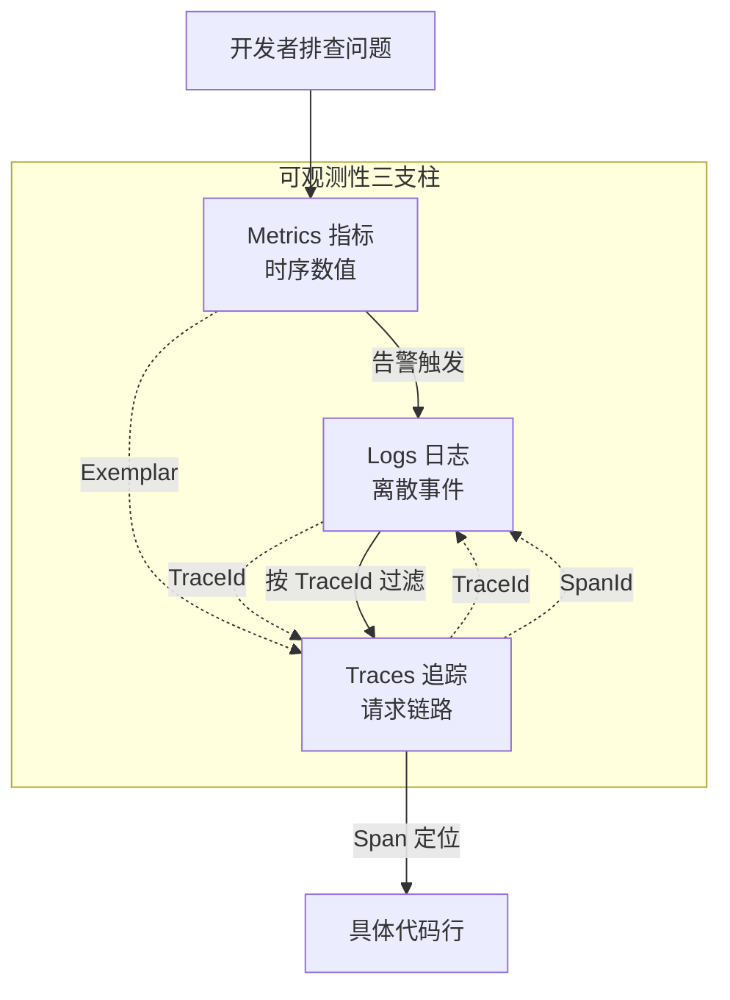
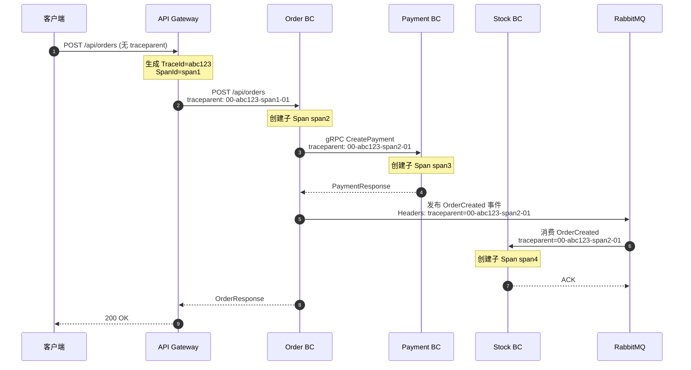

# 第 8 章 可观测性

## 学习目标

1. 理解可观测性三支柱（日志、追踪、指标）的定位与协作关系，能够说出每种信号解决什么问题
2. 掌握 Leno 平台基于 Serilog 的结构化日志配置，能够解读 `SerilogConfig` 与 `TraceIdEnricher` 的工作机制
3. 学会使用 OpenTelemetry + Jaeger 进行跨 BC（Bounded Context，限界上下文）分布式追踪，能够在 Jaeger UI 中定位慢调用与错误调用
4. 熟悉 Prometheus 指标体系（网关 6 指标 + 防腐层 5 指标），能够编写基础 PromQL 查询并读懂 Grafana 仪表盘
5. 能够配置健康检查端点、Alertmanager 告警规则与抑制策略，并完成线上故障的"指标 → 日志 → 追踪"三步定位

## 适用读者

- **开发人员**：负责业务 BC 实现，需要在自己的服务中正确接入日志、追踪、指标，并在排查问题时能够使用 Jaeger/Grafana 等工具
- **运维人员**：负责平台部署与监控，需要理解各项指标的含义、配置告警规则与仪表盘、配置 K8s 探针与 HealthChecksUI

## 术语速查

| 术语 | 行内解释 |
|------|---------|
| 可观测性三支柱 | Logs（日志）、Traces（追踪）、Metrics（指标）三种遥测信号的统称，是分布式系统排障的基础 |
| Serilog | .NET 生态最流行的结构化日志库，支持 JSON 输出、多 Sink（控制台/文件/ELK/Seq）与富化器（Enricher） |
| 结构化日志 | 以字段（键值对）而非纯文本组织日志内容，便于机器检索与聚合（如按 `TraceId` 过滤） |
| OpenTelemetry | CNCF 主推的开放遥测标准，统一 Logs/Traces/Metrics 数据模型与 SDK，厂商无关 |
| Jaeger | Uber 开源的分布式追踪后端，存储与查询 Trace/Span，提供链路瀑布图与依赖图 |
| TraceId | 一次完整请求链路的唯一标识（32 位十六进制），跨服务贯穿传递 |
| SpanId | 链路中单个操作的唯一标识（16 位十六进制），多个 Span 通过父子关系组成一棵 Trace 树 |
| Prometheus | SoundCloud 开源的时序数据库与拉取式（Pull）监控系统，已成为云原生监控事实标准 |
| Grafana | 开源可视化平台，对接 Prometheus/Jaeger/ES 等数据源展示仪表盘与告警 |
| Histogram | 分桶统计的指标类型，常用于请求延迟分布（如 P95/P99 计算） |
| Counter | 单调递增计数器，常用于请求总数、错误数、消息发布数 |
| Gauge | 可增可减的瞬时值，常用于活跃连接数、熔断器状态、队列长度 |
| Alertmanager | Prometheus 配套告警组件，负责告警分组、抑制、路由与通知（webhook/邮件/钉钉） |

---

## 8.1 可观测性三支柱

可观测性（Observability）源自控制论，指通过系统的外部输出推断系统内部状态的能力。在单体应用中，开发者可以直接 attach 调试器或查看本地日志；但在 Leno 这样的微服务架构中，一个用户请求可能跨越网关、订单、支付、库存、通知等多个服务，传统调试手段失效。可观测性正是为解决"分布式黑盒"问题而生：当线上出现异常时，开发者能够基于日志、追踪、指标三类遥测信号，快速定位"哪个服务、哪段代码、哪个时刻、什么原因"出了问题。

需要区分两个概念：**监控（Monitoring）** 与 **可观测性（Observability）**。监控是"我知道该看什么"——预设仪表盘与告警，回答已知问题；可观测性是"我能探究未知的问题"——通过关联多维度信号，回答事先未预料到的问题。监控是可观测性的子集，Leno 平台通过完整的三支柱建设，从监控升级到可观测性。

可观测性三支柱（Three Pillars of Observability）是行业共识的遥测信号分类，每种信号回答不同问题：

| 支柱 | 关注问题 | 数据特征 | 典型工具 | Leno 实现 |
|------|---------|---------|---------|----------|
| 日志（Logs） | "发生了什么？" | 离散事件、带时间戳、文本或 JSON | Serilog、ELK、Loki | Serilog + Console/File Sink |
| 追踪（Traces） | "请求经过了哪些服务？" | 树形 Span 结构、因果有序 | OpenTelemetry、Jaeger、Zipkin | OpenTelemetry SDK + Jaeger |
| 指标（Metrics） | "系统当前状态如何？" | 时序数值、可聚合、低基数 | Prometheus、Grafana | prometheus-net + Prometheus |

三支柱并非孤立，而是通过**关联 ID** 贯穿：每次请求生成唯一 TraceId，日志通过 `TraceIdEnricher` 注入该 ID，指标可通过 exemplar 关联到 Trace，从而实现"指标告警 → 日志检索 → 追踪定位"的闭环排查。



**关联 ID 贯穿三支柱**是 Leno 平台可观测性建设的核心理念。当 Prometheus 触发"网关 5xx 错误率"告警时，开发者可以按以下三步定位：

1. **指标定位时间窗口**：在 Grafana 查看错误率曲线，确定异常开始时间与影响范围
2. **日志检索错误堆栈**：在 Kibana/Loki 按 `TraceId` 过滤该时间窗口内的 Error 日志，查看异常堆栈与上下文
3. **追踪定位根因 Span**：在 Jaeger 用同一 `TraceId` 查询完整调用链，定位是哪个 BC 的哪个 Span 出错（如 Payment BC 调用第三方支付网关超时）

这种"指标 → 日志 → 追踪"的三步排查法，是 Leno 故障定位的标准动作，也是本章内容的组织主线。

---

## 8.2 日志

Serilog 是 .NET 生态最流行的结构化日志库，支持 JSON 输出、多 Sink（控制台/文件/ELK/Seq）、富化器（Enricher）与过滤器。结构化日志（Structured Logging）将日志内容组织为字段（键值对）而非纯文本，便于 ELK/Loki 等系统按字段检索与聚合。例如传统日志 `User 12345 created order 67890` 无法按用户 ID 过滤；而结构化日志 `{"Message":"created order", "UserId":12345, "OrderId":67890}` 可以直接按 `UserId=12345` 精确检索。

### 8.2.1 网关日志配置

Leno API Gateway 在 `appsettings.json` 中配置了 Console + File 两个 Sink，文件按天滚动并保留 7 天：

```json
// src/ApiGateway/Leno.ApiGateway/appsettings.json L35-L63
"Serilog": {
  "Using": ["Serilog.Sinks.Console", "Serilog.Sinks.File"],
  "MinimumLevel": {
    "Default": "Information",
    "Override": {
      "Microsoft.AspNetCore": "Warning",
      "Yarp": "Warning",
      "Microsoft.Extensions.Diagnostics.HealthChecks": "Warning"
    }
  },
  "WriteTo": [
    {
      "Name": "Console",
      "Args": {
        "outputTemplate": "{Timestamp:yyyy-MM-dd HH:mm:ss.fff zzz} [{Level:u3}] {Message:lj} {Properties:j}{NewLine}{Exception}"
      }
    },
    {
      "Name": "File",
      "Args": {
        "path": "logs/gateway-.log",
        "rollingInterval": "Day",
        "retainedFileCountLimit": 7,
        "outputTemplate": "{Timestamp:yyyy-MM-dd HH:mm:ss.fff zzz} [{Level:u3}] {Message:lj} {Properties:j}{NewLine}{Exception}"
      }
    }
  ],
  "Enrich": ["FromLogContext"]
}
```

来源：[appsettings.json](file:///c:/Users/Junjie/.trae-cn/worktrees/Leno/feat-project-optimization-plan-O7ECNx/src/ApiGateway/Leno.ApiGateway/appsettings.json#L35-L63)

关键配置说明：

- **Console Sink**：开发期实时输出到控制台，模板含时间戳（`Timestamp`）、级别（`Level:u3`，大写三字母如 INF/WRN/ERR）、消息（`Message:lj`，JSON 安全转义）、属性（`Properties:j`，JSON 格式）、异常堆栈（`Exception`）
- **File Sink**：`path: "logs/gateway-.log"` 文件名前缀，`rollingInterval: Day` 按天滚动（实际文件名如 `gateway-20260719.log`），`retainedFileCountLimit: 7` 仅保留最近 7 天日志文件
- **MinimumLevel.Override**：将框架级日志压低到 Warning，避免 Microsoft.AspNetCore 的请求日志、Yarp 的代理日志、HealthChecks 的探活日志淹没业务日志
- **Enrich.FromLogContext**：从 `LogContext` 拉取上下文字段（如用户 ID、CorrelationId），实现按请求上下文富化

### 8.2.2 业务 BC 简版配置

业务 BC（如 Cart）采用更精简的 Serilog 配置，仅指定 MinimumLevel 与 Override，不在 `appsettings.json` 中硬编码 Sink：

```json
// src/Services/Cart/Leno.Cart.Api/appsettings.json L9-L17
"Serilog": {
  "MinimumLevel": {
    "Default": "Information",
    "Override": {
      "Microsoft.AspNetCore": "Warning",
      "Microsoft.EntityFrameworkCore": "Warning"
    }
  }
}
```

来源：[appsettings.json](file:///c:/Users/Junjie/.trae-cn/worktrees/Leno/feat-project-optimization-plan-O7ECNx/src/Services/Cart/Leno.Cart.Api/appsettings.json#L9-L17)

业务 BC 不在 `appsettings.json` 中硬编码 Sink 的原因：①所有服务输出格式需统一，避免每个 BC 各自配置导致格式漂移；②Sink 选择（如是否输出到 Seq/ELK）应由基础设施层统一决定，与业务无关。因此 Leno 通过 `SerilogConfig` 代码配置统一所有 BC 的 Sink 与富化器。

### 8.2.3 SerilogConfig 配置代码

`SerilogConfig` 是 Leno 平台的日志配置入口，提供统一的结构化日志默认配置（JSON 输出、应用名、环境、TraceId 贯穿）：

```csharp
// src/BuildingBlocks/Leno.Infrastructure/Logging/SerilogConfig.cs
using System.Diagnostics;
using Serilog;
using Serilog.Core;
using Serilog.Events;

namespace Leno.Infrastructure.Logging;

public static class SerilogConfig
{
    public static LoggerConfiguration ConfigureDefaults(
        LoggerConfiguration loggerConfig,
        string applicationName,
        string environmentName)
    {
        ArgumentNullException.ThrowIfNull(loggerConfig);
        return loggerConfig
            .Enrich.WithProperty("Application", applicationName)
            .Enrich.WithProperty("Environment", environmentName)
            .Enrich.FromLogContext()
            .Enrich.With<TraceIdEnricher>()
            .WriteTo.Console(new Serilog.Formatting.Json.JsonFormatter());
    }
}

/// <summary>
/// 将当前 Activity 的 TraceId 注入每条日志，实现链路追踪贯穿。
/// </summary>
public sealed class TraceIdEnricher : ILogEventEnricher
{
    public void Enrich(LogEvent logEvent, ILogEventPropertyFactory propertyFactory)
    {
        ArgumentNullException.ThrowIfNull(logEvent);
        ArgumentNullException.ThrowIfNull(propertyFactory);

        var traceId = Activity.Current?.TraceId.ToString();
        if (!string.IsNullOrEmpty(traceId))
        {
            logEvent.AddPropertyIfAbsent(propertyFactory.CreateProperty("TraceId", traceId));
        }
    }
}
```

来源：[SerilogConfig.cs](file:///c:/Users/Junjie/.trae-cn/worktrees/Leno/feat-project-optimization-plan-O7ECNx/src/BuildingBlocks/Leno.Infrastructure/Logging/SerilogConfig.cs)

`ConfigureDefaults` 方法做了 5 件事：

1. `Enrich.WithProperty("Application", applicationName)`：为每条日志添加 `Application` 字段（如 `leno-cart-api`），便于在集中日志系统中区分来源
2. `Enrich.WithProperty("Environment", environmentName)`：添加 `Environment` 字段（如 `Production`），避免开发环境日志污染生产排查
3. `Enrich.FromLogContext()`：从 `LogContext` 拉取动态上下文字段（如用户 ID、请求 ID）
4. `Enrich.With<TraceIdEnricher>()`：注入 OpenTelemetry 的 TraceId，实现日志与追踪关联
5. `WriteTo.Console(new JsonFormatter())`：输出 JSON 格式到控制台，便于 Filebeat 采集与 ELK 解析

**TraceIdEnricher** 是关联日志与追踪的关键：它从 `Activity.Current?.TraceId`（OpenTelemetry 当前 Span 的 TraceId）读取并注入每条日志。这样在 Kibana/Loki 中按 `TraceId` 过滤日志时，可以一次拉出整条链路的所有日志。`AddPropertyIfAbsent` 确保不覆盖已有 TraceId（如手动设置的）。

### 8.2.4 日志级别规范

Leno 平台采用标准日志级别体系，各级别有明确使用场景：

| 级别 | 用途 | 示例场景 | 生产环境 |
|------|------|---------|---------|
| Trace | 极细粒度调试，仅开发期 | SQL 参数绑定细节、变量中间值 | 关闭 |
| Debug | 调试信息，开发期使用 | 中间状态计算结果、缓存命中/未命中 | 关闭 |
| Information | 业务关键事件（默认级别） | 订单创建、支付成功、用户登录 | 开启 |
| Warning | 异常但可恢复 | 重试触发、限流拒绝、降级到兜底 | 开启 |
| Error | 异常需关注 | 外部依赖失败、未处理异常、业务规则违反 | 开启 |
| Fatal | 服务不可用 | 启动失败、配置缺失、数据库连接断开 | 开启 |

> 注：Serilog 实际支持 Verbose(=Trace)/Debug/Information/Warning/Error/Fatal 六级，Leno 项目中 Trace/Debug 在生产关闭，Information 为默认级别。

### 8.2.5 关联 ID 与 CorrelationId 中间件

**关联 ID（CorrelationId）** 是 Leno 平台在 TraceId 之外补充的请求级标识。当请求进入 API Gateway 时，网关会生成或透传 `X-Correlation-Id` 头，并通过 YARP 转发到下游 BC。所有 BC 的日志都会带上该 ID，即使 OpenTelemetry 链路丢失（如采样丢弃），也能通过 CorrelationId 串联同一请求的所有日志。

CorrelationId 中间件的核心逻辑：

1. 检查入站请求是否携带 `X-Correlation-Id` 头
2. 若无则生成新的 GUID（如 `a3f5e2b1-1234-5678-9abc-def012345678`）
3. 将 CorrelationId 写入 `LogContext` 供 Serilog 富化
4. 通过 YARP 转发时透传该头到下游 BC

CorrelationId 与 TraceId 的关系：TraceId 由 OpenTelemetry 自动管理，但生产环境仅 10% 采样；CorrelationId 100% 保留，是采样丢失时的兜底关联手段。两者互补，共同保证日志的可追溯性。

### 8.2.6 按天滚动与 30 天保留期

Leno 平台日志保留策略分两层，兼顾排查速度与存储成本：

- **本地文件（7 天）**：`rollingInterval: Day` + `retainedFileCountLimit: 7`，每个服务本地仅保留最近 7 天日志，用于快速排查近期问题。文件名形如 `logs/gateway-20260719.log`，按日期可追溯
- **集中存储（30 天）**：Filebeat 采集所有服务日志发送到 Elasticsearch，索引按天滚动（如 `leno-logs-2026.07.19`），保留 30 天，支持跨服务检索与聚合

这种"本地 7 天 + 集中 30 天"的分层策略，既保证了近期问题的快速排查（本地文件无网络延迟），又控制了长期存储成本（30 天后自动清理）。

### 8.2.7 结构化日志输出示例

`SerilogConfig` 配置的 JSON 格式日志输出实例如下（已格式化便于阅读，实际为单行）：

```json
{
  "@t": "2026-07-19T10:23:45.123Z",
  "@mt": "Order {OrderId} created for user {UserId}",
  "@r": "Order 67890 created for user 12345",
  "OrderId": 67890,
  "UserId": 12345,
  "Application": "leno-order-api",
  "Environment": "Production",
  "TraceId": "0af7651916cd43dd8448eb211c80319c",
  "CorrelationId": "a3f5e2b1-1234-5678-9abc-def012345678",
  "SourceContext": "Leno.Order.Application.Services.OrderService",
  "@l": "Information"
}
```

关键字段说明：

- `@t`：时间戳（ISO 8601 格式，UTC）
- `@mt`：消息模板（含占位符 `{OrderId}`）
- `@r`：渲染后的消息（占位符已替换为实际值）
- `OrderId` / `UserId`：业务字段（结构化，可检索）
- `Application` / `Environment`：通过 `WithProperty` 添加的固定字段
- `TraceId`：由 `TraceIdEnricher` 注入，用于关联 Jaeger 追踪
- `CorrelationId`：由 `LogContext` 拉取，用于跨服务请求关联
- `SourceContext`：日志记录器的类名，便于按代码位置过滤
- `@l`：日志级别

在 Kibana/Loki 中，可以通过 KQL 查询 `TraceId: "0af7651916cd43dd8448eb211c80319c"` 一次性拉出整条链路的所有日志，再切换到 Jaeger 查看对应 Trace 的瀑布图，实现日志与追踪的双向跳转。

### 8.2.8 业务代码中的日志使用

业务代码通过 `ILogger<T>` 注入日志记录器，使用结构化模板（而非字符串拼接）记录日志：

```csharp
public class OrderService
{
    private readonly ILogger<OrderService> _logger;

    public OrderService(ILogger<OrderService> logger)
    {
        _logger = logger;
    }

    public async Task<Order> CreateOrderAsync(long userId, CreateOrderRequest request)
    {
        // 结构化日志：使用 {占位符}，Serilog 自动捕获为字段
        _logger.LogInformation("Order creation started for user {UserId} with {ItemCount} items",
            userId, request.Items.Count);

        try
        {
            var order = await _orderRepository.CreateAsync(userId, request.Items);

            _logger.LogInformation("Order {OrderId} created for user {UserId}, total={Total}",
                order.Id, userId, order.TotalAmount);

            return order;
        }
        catch (Exception ex)
        {
            // 错误日志：包含异常对象（Serilog 自动展开堆栈）
            _logger.LogError(ex, "Failed to create order for user {UserId}", userId);
            throw;
        }
    }
}
```

> **最佳实践**：①使用 `{占位符}` 而非字符串插值（`$"..."`），否则会丢失结构化字段；②异常对象作为第一个参数传入 `LogError(ex, ...)`，Serilog 自动展开为 `Exception` 字段；③避免在 hot path 记录 Debug/Trace 级别日志（即使关闭也会有模板渲染开销）。

---

## 8.3 分布式追踪

分布式追踪（Distributed Tracing）记录一次请求在多个服务之间的完整调用链路。在微服务架构中，一个用户请求可能经过网关 → 订单 → 支付 → 库存 → 通知等多个服务，追踪系统通过 TraceId 串联这些调用，形成树形 Span 结构，让开发者能够看到"请求在哪个服务耗时多少、在哪里失败"。如果说日志回答"发生了什么"，追踪则回答"经过哪些服务、按什么顺序、各自耗时多少"。

OpenTelemetry（简称 OTel）是 CNCF 主推的开放遥测标准，统一了 Logs/Traces/Metrics 的数据模型与 SDK。它的核心价值在于厂商无关：同一套 SDK 可以导出到 Jaeger、Zipkin、Datadog、Tempo 等不同后端，避免锁定。OTel 提供自动埋点（Instrumentation）库，无需修改业务代码即可采集 ASP.NET Core、HttpClient、EF Core、MassTransit 等组件的调用链路。

### 8.3.1 核心概念

- **Trace**：一次完整请求链路，由唯一 TraceId（32 位十六进制）标识，是一棵 Span 树
- **Span**：链路中的一个操作单元，有唯一 SpanId（16 位十六进制），包含开始/结束时间、属性（Attributes）、事件（Events）、状态（Status: OK/ERROR）
- **上下文传播（Context Propagation）**：TraceId/SpanId 通过 W3C Trace Context 协议在服务间传递，HTTP 走 `traceparent` 头，gRPC 走 metadata，RabbitMQ 走消息 Headers
- **采样（Sampling）**：为了避免全量采集压力，按策略丢弃部分 Trace（如生产 10%），被采样的 Trace 完整上报，未采样的丢弃
- **ActivitySource**：.NET 中创建自定义 Span 的工厂，业务代码通过 `ActivitySource.StartActivity("name")` 创建业务 Span

### 8.3.2 Leno OpenTelemetry 配置

Leno 平台通过 `OpenTelemetryExtensions` 统一配置所有 BC 的追踪与指标，各 BC 在 `Program.cs` 调用 `builder.AddLenoOpenTelemetry()` 即可完成接入：

```csharp
// src/BuildingBlocks/Leno.Infrastructure/Telemetry/OpenTelemetryExtensions.cs
public static class OpenTelemetryExtensions
{
    public const string DefaultOtlpEndpoint = "http://localhost:4317";

    public static class ActivitySources
    {
        public const string Order = "Leno.Order";
        public const string Payment = "Leno.Payment";
        public const string Stock = "Leno.Stock";
    }

    public static IHostApplicationBuilder AddLenoOpenTelemetry(
        this IHostApplicationBuilder builder,
        Action<TracerProviderBuilder>? configureTracing = null,
        Action<MeterProviderBuilder>? configureMetrics = null)
    {
        var otlpEndpoint = builder.Configuration["OpenTelemetry:OtlpEndpoint"] ?? DefaultOtlpEndpoint;
        var serviceName = builder.Configuration["OpenTelemetry:ServiceName"]
                          ?? Assembly.GetEntryAssembly()?.GetName().Name
                          ?? "Leno";

        builder.Services.AddOpenTelemetry()
            .ConfigureResource(resource =>
            {
                resource.AddService(
                    serviceName: serviceName,
                    serviceVersion: "1.0.0",
                    autoGenerateServiceInstanceId: true);
            })
            .WithTracing(tracing =>
            {
                tracing
                    .AddAspNetCoreInstrumentation()
                    .AddHttpClientInstrumentation()
                    .AddEntityFrameworkCoreInstrumentation()
                    .AddSource("MassTransit")
                    .AddSource(ActivitySources.Order)
                    .AddSource(ActivitySources.Payment)
                    .AddSource(ActivitySources.Stock)
                    .SetSampler(CreateSampler(builder.Environment))
                    .AddOtlpExporter(options =>
                    {
                        options.Endpoint = new Uri(otlpEndpoint);
                    });

                configureTracing?.Invoke(tracing);
            })
            .WithMetrics(metrics =>
            {
                metrics
                    .AddAspNetCoreInstrumentation()
                    .AddHttpClientInstrumentation()
                    .AddMeter("Leno.AntiCorruption")
                    .AddMeter("Leno.SystemAdmin.DeadLetter")
                    .AddMeter("Leno.Order.AntiCorruption")
                    .AddMeter("Leno.Outbox")
                    .AddOtlpExporter(options => options.Endpoint = new Uri(otlpEndpoint));

                configureMetrics?.Invoke(metrics);
            });

        // 注册 Serilog OpenTelemetry TraceId 富化器
        builder.Services.AddSingleton<ILogEventEnricher, OpenTelemetryTraceIdEnricher>();

        builder.Logging.AddOpenTelemetry(logging =>
        {
            logging.IncludeFormattedMessage = true;
            logging.IncludeScopes = true;
        });

        return builder;
    }

    /// <summary>
    /// 根据环境选择采样策略：开发环境 100% 采样，生产环境 10% 采样。
    /// </summary>
    private static Sampler CreateSampler(IHostEnvironment environment)
    {
        if (environment.IsDevelopment())
        {
            return new AlwaysOnSampler();
        }

        return new TraceIdRatioBasedSampler(0.1);
    }
}
```

来源：[OpenTelemetryExtensions.cs](file:///c:/Users/Junjie/.trae-cn/worktrees/Leno/feat-project-optimization-plan-O7ECNx/src/BuildingBlocks/Leno.Infrastructure/Telemetry/OpenTelemetryExtensions.cs)

配置要点解读：

- **资源（Resource）**：`AddService` 为所有 Span 添加 `service.name`、`service.version`、`service.instance.id` 属性，便于在 Jaeger 中按服务筛选
- **自动埋点**：
  - `AddAspNetCoreInstrumentation`：采集 HTTP 请求入站 Span（方法、路由、状态码）
  - `AddHttpClientInstrumentation`：采集 HttpClient 出站调用 Span（目标 URL、耗时）
  - `AddEntityFrameworkCoreInstrumentation`：采集 EF Core 数据库查询 Span（SQL 语句、耗时）
- **消息总线埋点**：`AddSource("MassTransit")` 采集 MassTransit 发送/消费 RabbitMQ 消息的 Span
- **业务 ActivitySource**：`Leno.Order` / `Leno.Payment` / `Leno.Stock` 由各 BC 在关键业务操作（如创建订单、扣减库存）处手动创建 Span，记录业务语义
- **采样策略**：`CreateSampler(builder.Environment)` 按环境切换
  - 开发环境：`AlwaysOnSampler`（100% 采样，便于调试）
  - 生产环境：`TraceIdRatioBasedSampler(0.1)`（10% 采样，降低后端存储压力）
- **OTLP 导出**：通过 gRPC OTLP 协议发送到 `http://localhost:4317`（本地 Jaeger/Collector）

### 8.3.3 OpenTelemetryTraceIdEnricher

除 `SerilogConfig.TraceIdEnricher` 外，OpenTelemetry 模块还提供了功能等价的 `OpenTelemetryTraceIdEnricher`，同时注入 TraceId 与 SpanId：

```csharp
// src/BuildingBlocks/Leno.Infrastructure/Telemetry/OpenTelemetryExtensions.cs L124-L149
public sealed class OpenTelemetryTraceIdEnricher : ILogEventEnricher
{
    public void Enrich(LogEvent logEvent, ILogEventPropertyFactory propertyFactory)
    {
        ArgumentNullException.ThrowIfNull(logEvent);
        ArgumentNullException.ThrowIfNull(propertyFactory);

        var traceId = Activity.Current?.TraceId.ToString();
        if (!string.IsNullOrEmpty(traceId) && traceId != "00000000000000000000000000000000")
        {
            logEvent.AddPropertyIfAbsent(propertyFactory.CreateProperty("TraceId", traceId));

            var spanId = Activity.Current?.SpanId.ToString();
            if (!string.IsNullOrEmpty(spanId))
            {
                logEvent.AddPropertyIfAbsent(propertyFactory.CreateProperty("SpanId", spanId));
            }
        }
    }
}
```

来源：[OpenTelemetryExtensions.cs](file:///c:/Users/Junjie/.trae-cn/worktrees/Leno/feat-project-optimization-plan-O7ECNx/src/BuildingBlocks/Leno.Infrastructure/Telemetry/OpenTelemetryExtensions.cs#L124-L149)

与 `TraceIdEnricher` 相比，此富化器额外注入了 `SpanId`，并显式排除了全零的无效 TraceId（`00000000000000000000000000000000`），避免在没有活跃 Span 时污染日志。两个富化器功能等价，项目可任选其一注册。

### 8.3.4 Jaeger

Jaeger（德语"猎人"）是 Uber 开源的分布式追踪后端，负责接收、存储与查询 Trace 数据。Leno 平台通过 OTLP 协议将 Span 推送到 Jaeger Collector（默认端口 4317），再由 Jaeger UI（默认端口 16686）提供链路查询界面。Jaeger 的核心能力：

- **链路查询**：按 TraceId、服务、操作、标签、耗时等多维度检索 Trace
- **瀑布图**：展示 Span 树形结构与时间线，直观看到每个服务耗时占比
- **依赖图**：自动生成服务调用依赖拓扑，发现隐藏的循环依赖
- **对比分析**：对比同一接口的不同 Trace，定位性能回归

### 8.3.5 TraceId 传播机制

OpenTelemetry 通过 W3C Trace Context 协议在服务间传播 TraceId/SpanId，不同传输协议的载体不同：

| 传输协议 | 载体 | 示例值 |
|---------|------|--------|
| HTTP | `traceparent` 请求头 | `traceparent: 00-0af7651916cd43dd8448eb211c80319c-b7ad6b7169203331-01` |
| gRPC | metadata（HTTP/2 头） | `traceparent: 00-0af7651916cd43dd8448eb211c80319c-b7ad6b7169203331-01` |
| RabbitMQ | 消息 Headers | `headers: { traceparent: "00-0af7651916cd43dd8448eb211c80319c-b7ad6b7169203331-01" }` |

`traceparent` 格式为 `00-{32位TraceId}-{16位SpanId}-{8位Flags}`，其中 `00` 是版本号，`01` 表示采样标记。OpenTelemetry SDK 在出站调用时自动注入该头，入站时自动解析并创建子 Span，业务代码完全无感知。

### 8.3.6 跨 BC 调用链路示例

以"用户下单"为例，请求经过网关 → 订单 → 支付 → 库存，每个服务产生一个 Span，通过 `traceparent` 串联：



整条链路在 Jaeger 中呈现为一棵以 `span1` 为根的 Span 树，开发者可以一眼看到：

- `span1`（API Gateway）：总耗时 850ms
- `span2`（Order BC）：业务处理 200ms
- `span3`（Payment BC）：gRPC 调用 500ms（瓶颈！）
- `span4`（Stock BC）：异步消费 150ms（与 span2 并行）

通过瀑布图可以立即定位 Payment BC 是性能瓶颈，进一步展开 span3 的属性可看到 gRPC 状态码、目标方法、重试次数等细节。

### 8.3.7 Jaeger UI 查询示例

在 Jaeger UI（默认 `http://localhost:16686`）中，常见查询操作：

1. **按服务查 Trace**：Service 下拉选 `leno-order-api`，Operation 下拉选 `POST /api/orders`，点击 Find Traces
2. **按 TraceId 查**：直接在搜索框粘贴 TraceId（如 `abc123...`），跳转到 Trace 详情页
3. **按耗时筛选**：Min Duration 设为 `500ms`，找出慢请求
4. **按标签筛选**：Tags 输入 `http.status_code=500`，定位错误请求
5. **按时间范围**：选择异常发生的时间窗口，缩小排查范围

每个 Trace 详情页展示 Span 树形瀑布图，点击 Span 可查看属性（如 `http.method`、`db.statement`、`messaging.destination`）、日志事件与时间线。

### 8.3.8 业务代码创建自定义 Span

OpenTelemetry 自动埋点覆盖了 HTTP/数据库/消息总线，但业务语义需要手动创建 Span。Leno 平台通过 `ActivitySource` 在关键业务操作处创建 Span：

```csharp
using System.Diagnostics;

// Order BC 中的订单创建服务
public class OrderService
{
    // 业务 ActivitySource，名称需与 OpenTelemetryExtensions 中 AddSource 注册一致
    private static readonly ActivitySource _activitySource = new("Leno.Order");

    public async Task<Order> CreateOrderAsync(long userId, CreateOrderRequest request)
    {
        // 创建业务 Span，自动成为当前 HTTP 请求 Span 的子 Span
        using var activity = _activitySource.StartActivity("CreateOrder");
        activity?.SetTag("user.id", userId);
        activity?.SetTag("order.item_count", request.Items.Count);
        activity?.SetTag("order.total_amount", request.Items.Sum(i => i.Price * i.Quantity));

        try
        {
            // 子操作 1：校验库存
            using (var stockActivity = _activitySource.StartActivity("ValidateStock"))
            {
                stockActivity?.SetTag("stock.warehouse", "default");
                await _stockService.ValidateAsync(request.Items);
            }

            // 子操作 2：创建订单记录
            var order = await _orderRepository.CreateAsync(userId, request.Items);
            activity?.SetTag("order.id", order.Id);

            // 子操作 3：发布 OrderCreated 事件（MassTransit 自动创建 Span）
            await _publishEndpoint.Publish(new OrderCreatedEvent
            {
                OrderId = order.Id,
                UserId = userId,
                TotalAmount = order.TotalAmount
            });

            activity?.SetStatus(ActivityStatusCode.Ok);
            return order;
        }
        catch (InsufficientStockException ex)
        {
            activity?.SetStatus(ActivityStatusCode.Error, ex.Message);
            activity?.SetTag("error.type", "insufficient_stock");
            throw;
        }
        catch (Exception ex)
        {
            activity?.SetStatus(ActivityStatusCode.Error, ex.Message);
            activity?.SetTag("error.type", ex.GetType().Name);
            throw;
        }
    }
}
```

业务 Span 的关键 API：

- `StartActivity("name")`：创建子 Span，自动继承父 Span 的 TraceId
- `SetTag(key, value)`：添加 Span 属性（在 Jaeger 中可查询过滤）
- `SetStatus(ActivityStatusCode.Ok/Error)`：标记 Span 成功/失败（失败 Span 在 Jaeger 中标红）
- `using` 包裹：活动结束时自动记录 Span 持续时间

这样在 Jaeger 中可以看到完整的业务操作树：`CreateOrder` → `ValidateStock` + `OrderRepository.Create` + `MassTransit.Publish`，每个 Span 都有业务属性（用户 ID、订单金额、库存仓库等），便于业务问题排查。

### 8.3.9 Span 属性规范

为保证 Jaeger 查询的一致性，Leno 平台约定以下 Span 属性命名规范：

| 属性名 | 含义 | 示例值 | 适用 Span |
|--------|------|--------|----------|
| `user.id` | 用户 ID | `12345` | 业务 Span |
| `order.id` | 订单 ID | `67890` | 订单相关 Span |
| `order.total_amount` | 订单总金额 | `99.50` | 订单创建 Span |
| `error.type` | 错误类型 | `insufficient_stock` | 错误 Span |
| `http.method` | HTTP 方法 | `POST` | 自动埋点 |
| `http.route` | 路由模板 | `/api/orders` | 自动埋点 |
| `http.status_code` | HTTP 状态码 | `200` | 自动埋点 |
| `db.system` | 数据库类型 | `mssql` | EF Core 自动埋点 |
| `db.statement` | SQL 语句 | `SELECT * FROM Orders` | EF Core 自动埋点 |
| `messaging.destination` | 消息目标 | `order-created` | MassTransit 自动埋点 |

---

## 8.4 指标

prometheus-net 是 .NET 生态的 Prometheus 客户端库，提供 Counter/Histogram/Gauge 三种指标类型，并通过 `/metrics` 端点暴露给 Prometheus 拉取。Prometheus 是 SoundCloud 开源的时序数据库与监控系统，采用拉取（Pull）模型定期从应用抓取指标，已成为云原生监控事实标准。与推送（Push）模型相比，拉取模型更易于控制抓取频率、发现新服务、处理服务下线。

### 8.4.1 三种指标类型

| 类型 | 特征 | 典型用途 | Leno 示例 |
|------|------|---------|----------|
| Counter | 单调递增（只能 Inc，不能 Dec） | 请求总数、错误数、消息发布数 | `gateway_requests_total` |
| Histogram | 分桶统计（observe 值落入预定义桶） | 请求延迟分布、消息处理耗时 | `gateway_request_duration` |
| Gauge | 可增可减（Inc/Dec/Set） | 当前活跃数、瞬时状态、队列长度 | `gateway_active_requests` |

**Histogram 与 Counter 的区别**：Counter 只记录累计值（如总请求数），Histogram 记录分布（如多少请求 <50ms、多少 <100ms），从而计算 P95/P99 分位数。在 PromQL 中通过 `histogram_quantile(0.99, rate(gateway_request_duration_bucket[5m]))` 计算 P99 延迟。

### 8.4.2 网关 6 个核心指标

`GatewayMetricsService` 集中持有 Leno API Gateway 的 6 个 Prometheus 指标，通过 `CollectorRegistry` 隔离指标注册便于单元测试：

```csharp
// src/ApiGateway/Leno.ApiGateway/Services/GatewayMetricsService.cs
using Prometheus;

namespace Leno.ApiGateway.Services;

public sealed class GatewayMetricsService
{
    // Histogram 桶边界（毫秒）：覆盖 5ms 到 10s 的典型请求耗时范围
    private static readonly double[] DurationBuckets = { 5, 10, 25, 50, 100, 250, 500, 1000, 2500, 5000, 10000 };
    private static readonly string[] DurationLabels = { "route", "method" };

    private readonly Counter _requestsTotal;
    private readonly Histogram _requestDuration;
    private readonly Gauge _activeRequests;
    private readonly Gauge _circuitBreakerState;
    private readonly Counter _rateLimitRejected;
    private readonly Counter _blacklistHits;

    public GatewayMetricsService() : this(Metrics.DefaultRegistry) { }

    public GatewayMetricsService(CollectorRegistry registry)
    {
        var factory = Metrics.WithCustomRegistry(registry);

        _requestsTotal = factory.CreateCounter(
            "gateway_requests_total",
            "Total number of HTTP requests processed by the gateway.",
            "route", "method", "status_code");

        _requestDuration = factory.CreateHistogram(
            "gateway_request_duration",
            "HTTP request processing duration in milliseconds.",
            DurationLabels,
            new HistogramConfiguration { Buckets = DurationBuckets });

        _activeRequests = factory.CreateGauge(
            "gateway_active_requests",
            "Current number of in-flight requests being processed by the gateway.");

        _circuitBreakerState = factory.CreateGauge(
            "gateway_circuit_breaker_state",
            "Circuit breaker state per cluster (0=closed, 1=open).",
            "cluster");

        _rateLimitRejected = factory.CreateCounter(
            "gateway_rate_limit_rejected",
            "Number of requests rejected by rate limiting.",
            "route", "policy");

        _blacklistHits = factory.CreateCounter(
            "gateway_blacklist_hits",
            "Number of requests rejected because the JWT was on the blacklist.");
    }

    public void RecordRequest(string? route, string method, int statusCode)
        => _requestsTotal.WithLabels(route ?? string.Empty, method, statusCode.ToString()).Inc();

    public void RecordRequestDuration(string? route, string method, double durationMs)
        => _requestDuration.WithLabels(route ?? string.Empty, method).Observe(durationMs);

    public void IncrementActiveRequests() => _activeRequests.Inc();
    public void DecrementActiveRequests() => _activeRequests.Dec();

    public void SetCircuitBreakerState(string cluster, bool isOpen)
        => _circuitBreakerState.WithLabels(cluster).Set(isOpen ? 1 : 0);

    public void RecordRateLimitRejection(string? route, string policy)
        => _rateLimitRejected.WithLabels(route ?? string.Empty, policy).Inc();

    public void RecordBlacklistHit() => _blacklistHits.Inc();
}
```

来源：[GatewayMetricsService.cs](file:///c:/Users/Junjie/.trae-cn/worktrees/Leno/feat-project-optimization-plan-O7ECNx/src/ApiGateway/Leno.ApiGateway/Services/GatewayMetricsService.cs)

6 个网关指标清单：

| 指标名 | 类型 | 标签 | 含义 | 典型 PromQL |
|--------|------|------|------|-------------|
| `gateway_requests_total` | Counter | route, method, status_code | 网关处理的总请求数 | `rate(gateway_requests_total[1m])` |
| `gateway_request_duration` | Histogram | route, method | 请求处理耗时分布（毫秒，桶 5ms~10s） | `histogram_quantile(0.99, rate(gateway_request_duration_bucket[5m]))` |
| `gateway_active_requests` | Gauge | - | 当前在处理的活跃请求数 | `gateway_active_requests` |
| `gateway_circuit_breaker_state` | Gauge | cluster | 熔断器状态（0=closed, 1=open） | `gateway_circuit_breaker_state` |
| `gateway_rate_limit_rejected` | Counter | route, policy | 限流拒绝次数 | `rate(gateway_rate_limit_rejected[1m])` |
| `gateway_blacklist_hits` | Counter | - | JWT 黑名单命中次数 | `increase(gateway_blacklist_hits[1h])` |

**桶边界设计**：`DurationBuckets = { 5, 10, 25, 50, 100, 250, 500, 1000, 2500, 5000, 10000 }` 覆盖 5ms 到 10s 的典型请求耗时范围，既能分辨秒杀接口（<100ms）与文件上传（>2s），又能避免桶过细导致基数爆炸。

### 8.4.3 AntiCorruptionMetrics 防腐层 5 个指标

防腐层（Anti-Corruption Layer，ACL）是 Leno 平台隔离下游服务故障的关键组件，其可观测性指标由 `AntiCorruptionMetrics` 集中定义，Meter 名为 `Leno.AntiCorruption`，各 BC 启动时通过 `AddLenoOpenTelemetry` 回调 `.AddMeter("Leno.AntiCorruption")` 订阅：

```csharp
// src/BuildingBlocks/Leno.Infrastructure/AntiCorruption/AntiCorruptionMetrics.cs
using System.Diagnostics.Metrics;

namespace Leno.Infrastructure.AntiCorruption;

public static class AntiCorruptionMetrics
{
    public const string MeterNamePrefix = "Leno.";
    public const string ServiceLabel = "service";
    public const string OperationLabel = "operation";
    public const string ReasonLabel = "reason";
    public const string StatusCodeLabel = "status_code";
    public const string PathLabel = "path";

    public const string FailureCounterName = "anticorruption_failure_total";
    public const string FallbackCounterName = "anticorruption_fallback_total";
    public const string CircuitOpenGaugeName = "anticorruption_circuit_open";
    public const string GrpcRequestCounterName = "anticorruption_grpc_request_total";
    public const string GrpcDurationHistogramName = "anticorruption_grpc_duration_seconds";

    private static readonly Meter _meter = new("Leno.AntiCorruption", "1.0.0");
    public static Meter Meter => _meter;

    public static Counter<int> FailureCounter { get; } =
        _meter.CreateCounter<int>(FailureCounterName, unit: "times",
            description: "防腐层远程调用失败次数（按 service/operation/path 维度统计）");

    public static Counter<int> FallbackCounter { get; } =
        _meter.CreateCounter<int>(FallbackCounterName, unit: "times",
            description: "gRPC 降级到 HttpClient 的次数（按 service/reason 维度统计）");

    public static ObservableGauge<int> CircuitOpenGauge { get; private set; } = null!;

    public static Counter<int> GrpcRequestCounter { get; } =
        _meter.CreateCounter<int>(GrpcRequestCounterName, unit: "times",
            description: "gRPC 调用计数（按 service/status_code 维度统计）");

    public static Histogram<double> GrpcDurationHistogram { get; } =
        _meter.CreateHistogram<double>(GrpcDurationHistogramName, unit: "s",
            description: "gRPC 调用延迟分布（按 service/status_code 维度统计）");

    public static void Initialize()
    {
        CircuitOpenGauge ??= _meter.CreateObservableGauge<int>(
            CircuitOpenGaugeName,
            observeValues: () => _circuitOpenStates.Select(kv => new Measurement<int>(
                kv.Value, new KeyValuePair<string, object?>(ServiceLabel, kv.Key))),
            unit: "bool",
            description: "熔断器是否打开（1=Open，0=Closed/HalfOpen）");
    }

    public static void RecordFailure(string service, string operation, string path = "http") { /* 省略 */ }
    public static void RecordFallback(string service, string reason) { /* 省略 */ }
    public static void UpdateCircuitOpenState(string service, bool isOpen) { /* 省略 */ }
    public static void RecordGrpcRequest(string service, string statusCode, double durationSeconds) { /* 省略 */ }
}
```

来源：[AntiCorruptionMetrics.cs](file:///c:/Users/Junjie/.trae-cn/worktrees/Leno/feat-project-optimization-plan-O7ECNx/src/BuildingBlocks/Leno.Infrastructure/AntiCorruption/AntiCorruptionMetrics.cs)

5 个防腐层指标清单：

| 指标名 | 类型 | 标签 | 含义 |
|--------|------|------|------|
| `anticorruption_failure_total` | Counter | service, operation, path | 防腐层远程调用失败次数 |
| `anticorruption_fallback_total` | Counter | service, reason | gRPC 降级到 HttpClient 的次数（reason: circuit_open/grpc_Unavailable/grpc_DeadlineExceeded 等） |
| `anticorruption_circuit_open` | Gauge | service | 熔断器是否打开（1=Open, 0=Closed/HalfOpen） |
| `anticorruption_grpc_request_total` | Counter | service, status_code | gRPC 调用计数 |
| `anticorruption_grpc_duration_seconds` | Histogram | service, status_code | gRPC 调用延迟分布（秒） |

这 5 个指标配合使用，可以完整还原防腐层的运行状态：当 `anticorruption_failure_total` 上升时，查看 `anticorruption_fallback_total` 的 reason 标签判断降级原因，结合 `anticorruption_circuit_open` 确认熔断器是否打开，再通过 `anticorruption_grpc_duration_seconds` 排查是否因 gRPC 调用慢导致。

### 8.4.4 /metrics 端点配置

网关在 `appsettings.json` 中配置 `/metrics` 端点路径：

```json
// src/ApiGateway/Leno.ApiGateway/appsettings.json L70-L73
"Metrics": {
  "Enabled": true,
  "Path": "/metrics"
}
```

来源：[appsettings.json](file:///c:/Users/Junjie/.trae-cn/worktrees/Leno/feat-project-optimization-plan-O7ECNx/src/ApiGateway/Leno.ApiGateway/appsettings.json#L70-L73)

应用启动时通过 `app.UseMetricServer()` 暴露 `/metrics` 端点，返回 Prometheus 文本格式指标，例如：

```
# HELP gateway_requests_total Total number of HTTP requests processed by the gateway.
# TYPE gateway_requests_total counter
gateway_requests_total{route="/api/orders",method="POST",status_code="200"} 12345
gateway_requests_total{route="/api/orders",method="POST",status_code="500"} 3

# HELP gateway_request_duration HTTP request processing duration in milliseconds.
# TYPE gateway_request_duration histogram
gateway_request_duration_bucket{route="/api/orders",method="POST",le="5"} 0
gateway_request_duration_bucket{route="/api/orders",method="POST",le="50"} 8200
gateway_request_duration_bucket{route="/api/orders",method="POST",le="100"} 11500
gateway_request_duration_bucket{route="/api/orders",method="POST",le="+Inf"} 12348
```

### 8.4.5 Prometheus 抓取配置

Prometheus 通过 `grafana/prometheus.yml` 配置定期拉取各服务的 `/metrics` 端点：

```yaml
# grafana/prometheus.yml
global:
  scrape_interval: 15s
  evaluation_interval: 15s

scrape_configs:
  - job_name: leno-api-gateway
    metrics_path: /metrics
    static_configs:
      - targets: ['api-gateway:8080']
        labels:
          service: api-gateway

  # M5.1 新增：11 个业务服务（服务名与 docker-compose.yml 一致，内部端口均为 8080）
  - job_name: leno-userauth
    metrics_path: /metrics
    static_configs:
      - targets: ['user-auth-api:8080']
        labels:
          service: userauth

  - job_name: leno-product
    metrics_path: /metrics
    static_configs:
      - targets: ['product-api:8080']
        labels:
          service: product

  - job_name: leno-cart
    metrics_path: /metrics
    static_configs:
      - targets: ['cart-api:8080']
        labels:
          service: cart

  - job_name: leno-order
    metrics_path: /metrics
    static_configs:
      - targets: ['order-api:8080']
        labels:
          service: order

  # 省略 promotion/reviewaftersales/pointsmembership/payment
  #      /notification/sellershop/systemadmin 共 6 个业务服务 job...
```

来源：[prometheus.yml](file:///c:/Users/Junjie/.trae-cn/worktrees/Leno/feat-project-optimization-plan-O7ECNx/grafana/prometheus.yml)

配置要点：

- `scrape_interval: 15s`：每 15 秒拉取一次（高频指标默认值，平衡实时性与负载）
- `evaluation_interval: 15s`：每 15 秒评估一次告警规则
- 共 12 个 job：1 个网关（`leno-api-gateway`）+ 11 个业务服务，所有服务内部端口均为 8080
- `service` 标签用于在 PromQL 中按服务筛选（如 `up{service="order"} == 0` 查询 Order 服务是否存活）

### 8.4.6 PromQL 实战示例

以下是 Leno 平台常用的 PromQL 查询，可直接用于 Grafana 面板或告警规则：

**1. 计算 QPS（按 route 分组）**

```promql
sum by (route) (rate(gateway_requests_total[1m]))
```

`rate(...[1m])` 计算过去 1 分钟的每秒速率，`sum by (route)` 按路由分组求和。

**2. 计算 P99 延迟（按 route）**

```promql
histogram_quantile(0.99,
  sum by (route, le) (rate(gateway_request_duration_bucket[5m]))
)
```

`histogram_quantile` 需要按 `le`（less than or equal）标签聚合所有桶，再按 route 分组。

**3. 计算错误率（5xx 占比）**

```promql
sum(rate(gateway_requests_total{status_code=~"5.."}[5m]))
/
sum(rate(gateway_requests_total[5m]))
```

`status_code=~"5.."` 是正则匹配 500-599，分子是 5xx 速率，分母是总速率。

**4. 监控熔断器打开的 Cluster**

```promql
gateway_circuit_breaker_state == 1
```

Gauge 值为 1 表示熔断器打开，可在 Grafana 状态面板用红色高亮显示。

**5. 防腐层失败率（按 service）**

```promql
sum by (service) (rate(anticorruption_failure_total[5m]))
```

定位是哪个下游服务的防腐层调用失败最多。

**6. 防腐层 gRPC P95 延迟**

```promql
histogram_quantile(0.95,
  sum by (service, le) (rate(anticorruption_grpc_duration_seconds_bucket[5m]))
)
```

注意此指标单位是秒（`_seconds`），与网关 `gateway_request_duration`（毫秒）不同。

**7. Outbox 积压趋势**

```promql
outbox_pending_count
```

直接读取 Gauge 当前值，配合 `max_over_time(outbox_pending_count[1h])` 可看 1 小时内最大积压。

---

## 8.5 健康检查

健康检查（Health Check）是 K8s 探针与负载均衡器判断服务是否可用的标准机制。Leno 平台通过 `HealthChecksUIExtensions` 配置三类端点，分别对应 K8s 的 livenessProbe、readinessProbe、startupProbe。

### 8.5.1 三类健康检查端点

| 端点 | K8s 探针 | 检查范围 | 用途 | 失败后果 |
|------|---------|---------|------|---------|
| `/health/live` | livenessProbe | 仅 self（进程存活） | 判断进程是否存活 | 重启 Pod |
| `/health/ready` | readinessProbe | self + 所有依赖 | 判断是否可接流量 | 从 Service 转发剔除 |
| `/health/startup` | startupProbe | self + 关键依赖 | 启动期探活 | 阻止 live/ready 检查 |
| `/health` | - | 综合（HealthChecksUI 使用） | 仪表盘聚合展示 | 仅展示 |

**为什么需要区分 live 与 ready**？如果用同一个端点，当 Redis 临时抖动时，ready 检查失败会从负载均衡剔除，这本是预期行为；但如果 live 也失败，Pod 会被重启，导致雪崩。区分后，依赖故障只影响 ready（剔除流量），不影响 live（不重启），等依赖恢复后 ready 自动恢复。

### 8.5.2 Leno 健康检查实现

`AddLenoHealthChecks` 注册了 4 项依赖检查（redis/elasticsearch/sqlserver/rabbitmq），并通过 tags 区分 live/ready：

```csharp
// src/BuildingBlocks/Leno.Infrastructure/HealthChecks/HealthChecksUIExtensions.cs
public static class HealthChecksUIExtensions
{
    private static readonly string[] LiveTags = [];
    private static readonly string[] ReadyTags = { "ready" };

    public static IHealthChecksBuilder AddLenoHealthChecks(
        this IServiceCollection services,
        IConfiguration configuration)
    {
        var builder = services.AddHealthChecks();

        // 自检
        builder.AddCheck("self", () => HealthCheckResult.Healthy(), tags: LiveTags);

        // Redis
        var redisConnection = configuration["Redis:Configuration"] ?? "localhost:6379";
        builder.AddRedis(redisConnection, name: "redis", tags: ReadyTags);

        // Elasticsearch
        var esUri = configuration.GetConnectionString("ReadDb")
                    ?? configuration["Elasticsearch:Uri"]
                    ?? "http://localhost:9200";
        builder.AddElasticsearch(esUri, name: "elasticsearch", tags: ReadyTags);

        // SQL Server（可选的 DB 健康检查）
        var dbConnectionString = configuration.GetConnectionString("DefaultConnection");
        if (!string.IsNullOrWhiteSpace(dbConnectionString))
        {
            builder.AddSqlServer(dbConnectionString, name: "sqlserver", tags: ReadyTags);
        }

        // RabbitMQ
        var rabbitHost = configuration["RabbitMQ:Host"];
        if (!string.IsNullOrWhiteSpace(rabbitHost))
        {
            var rabbitPort = configuration["RabbitMQ:Port"] ?? "5672";
            var rabbitConnectionString = $"amqp://{configuration["RabbitMQ:Username"] ?? "guest"}:{configuration["RabbitMQ:Password"] ?? "guest"}@{rabbitHost}:{rabbitPort}";
            builder.AddRabbitMQ(rabbitConnectionString, name: "rabbitmq", tags: ReadyTags);
        }

        return builder;
    }
}
```

来源：[HealthChecksUIExtensions.cs](file:///c:/Users/Junjie/.trae-cn/worktrees/Leno/feat-project-optimization-plan-O7ECNx/src/BuildingBlocks/Leno.Infrastructure/HealthChecks/HealthChecksUIExtensions.cs)

4 项依赖检查清单：

| 依赖 | 检查方法 | tags | 配置来源 | 默认地址 |
|------|---------|------|---------|---------|
| self | `AddCheck("self")` | live（空 tags） | 进程内存检查 | - |
| redis | `AddRedis` | ready | `Redis:Configuration` | `localhost:6379` |
| elasticsearch | `AddElasticsearch` | ready | `ConnectionStrings:ReadDb` 或 `Elasticsearch:Uri` | `http://localhost:9200` |
| sqlserver | `AddSqlServer` | ready | `ConnectionStrings:DefaultConnection` | 可选（未配置则跳过） |
| rabbitmq | `AddRabbitMQ` | ready | `RabbitMQ:Host/Port/Username/Password` | 可选（未配置则跳过） |

注意：sqlserver 与 rabbitmq 是条件注册（仅在配置存在时添加），避免未使用该依赖的 BC 报错。

### 8.5.3 端点映射

```csharp
// src/BuildingBlocks/Leno.Infrastructure/HealthChecks/HealthChecksUIExtensions.cs L97-L122
public static IEndpointRouteBuilder MapLenoHealthChecks(this IEndpointRouteBuilder endpoints)
{
    // 存活探针：仅检查自身，不包含依赖
    endpoints.MapHealthChecks("/health/live", new HealthCheckOptions
    {
        Predicate = check => !check.Tags.Contains("ready"),
        ResponseWriter = UIResponseWriter.WriteHealthCheckUIResponse
    });

    // 就绪探针：检查所有依赖（Redis、ES、DB、RabbitMQ）
    endpoints.MapHealthChecks("/health/ready", new HealthCheckOptions
    {
        Predicate = check => check.Tags.Contains("ready"),
        ResponseWriter = UIResponseWriter.WriteHealthCheckUIResponse
    });

    // 综合健康检查端点（HealthChecksUI 使用）
    endpoints.MapHealthChecks("/health", new HealthCheckOptions
    {
        ResponseWriter = UIResponseWriter.WriteHealthCheckUIResponse
    });

    return endpoints;
}
```

来源：[HealthChecksUIExtensions.cs](file:///c:/Users/Junjie/.trae-cn/worktrees/Leno/feat-project-optimization-plan-O7ECNx/src/BuildingBlocks/Leno.Infrastructure/HealthChecks/HealthChecksUIExtensions.cs#L97-L122)

关键设计：通过 `Predicate` 按 tags 过滤检查项——`/health/live` 排除 `ready` 标签（仅 self），`/health/ready` 仅包含 `ready` 标签（依赖项）。`UIResponseWriter` 输出 JSON 格式，包含每项检查的详细状态与耗时。

### 8.5.4 HealthChecksUI

`AddLenoHealthChecksUI` 注册 HealthChecksUI 仪表盘服务，从配置读取各 BC 健康端点，聚合展示在 `/health-dashboard`：

```json
// src/ApiGateway/Leno.ApiGateway/appsettings.json L163-L169
"HealthChecksUI": {
  "HealthChecks": [
    { "Name": "API Gateway", "Uri": "http://localhost:8080/health" }
  ],
  "EvaluationTimeInSeconds": 10,
  "MinimumSecondsBetweenFailureNotifications": 60
}
```

来源：[appsettings.json](file:///c:/Users/Junjie/.trae-cn/worktrees/Leno/feat-project-optimization-plan-O7ECNx/src/ApiGateway/Leno.ApiGateway/appsettings.json#L163-L169)

- `EvaluationTimeInSeconds: 10`：每 10 秒探活一次各 BC
- `MinimumSecondsBetweenFailureNotifications: 60`：失败通知最小间隔 60 秒，避免告警风暴

### 8.5.5 K8s 探针配置示例

业务 BC 在 K8s Deployment 中配置三类探针：

```yaml
livenessProbe:
  httpGet:
    path: /health/live
    port: 8080
  initialDelaySeconds: 30
  periodSeconds: 10
  failureThreshold: 3      # 连续 3 次失败（30s）重启 Pod

readinessProbe:
  httpGet:
    path: /health/ready
    port: 8080
  initialDelaySeconds: 10
  periodSeconds: 5
  failureThreshold: 3      # 连续 3 次失败（15s）剔除流量

startupProbe:
  httpGet:
    path: /health/live
    port: 8080
  periodSeconds: 10
  failureThreshold: 30     # 最多等 5 分钟启动
```

startupProbe 的作用是给慢启动服务（如需要预热缓存、建立连接池）足够的启动时间，避免 livenessProbe 误判重启。

### 8.5.6 健康检查 JSON 响应示例

`/health/ready` 端点返回 JSON 格式响应，包含每项检查的状态与耗时：

```json
{
  "status": "Unhealthy",
  "totalDuration": "00:00:01.2345678",
  "entries": {
    "self": {
      "data": {},
      "duration": "00:00:00.0012345",
      "status": "Healthy",
      "tags": []
    },
    "redis": {
      "data": {},
      "duration": "00:00:00.0234567",
      "status": "Healthy",
      "tags": ["ready"]
    },
    "elasticsearch": {
      "data": {},
      "duration": "00:00:00.0456789",
      "status": "Healthy",
      "tags": ["ready"]
    },
    "sqlserver": {
      "data": {},
      "duration": "00:00:01.1234567",
      "status": "Unhealthy",
      "tags": ["ready"],
      "exception": "Microsoft.Data.SqlClient.SqlException (0x80131904): Connection timeout..."
    },
    "rabbitmq": {
      "data": {},
      "duration": "00:00:00.0123456",
      "status": "Healthy",
      "tags": ["ready"]
    }
  }
}
```

- `status`：整体状态，任一依赖 Unhealthy 则整体 Unhealthy
- `entries`：每项检查的详细状态、耗时、异常信息
- `tags`：检查项标签，用于 `/health/live` 与 `/health/ready` 过滤
- `exception`：失败时的异常堆栈（生产环境应通过网关限流避免泄露）

HealthChecksUI 读取该 JSON 在 `/health-dashboard` 展示可视化面板，运维人员可一眼看到哪个服务、哪项依赖异常。

---

## 8.6 Grafana 仪表盘

Grafana 是开源的可视化平台，支持对接 Prometheus、Jaeger、Elasticsearch 等多种数据源，通过 PromQL/LogQL 查询语言构建仪表盘。Leno 平台使用 Grafana 展示指标曲线、告警状态与服务依赖图。Grafana 的优势在于：①声明式 JSON 配置可版本化；②支持变量与模板，一套仪表盘适配多环境；③告警集成，从可视化直接生成告警规则。

### 8.6.1 数据源 Provisioning

Grafana 通过 provisioning 机制自动加载数据源配置，无需手动在 UI 配置，保证配置可版本化：

```yaml
# grafana/provisioning/datasources/prometheus.yml
apiVersion: 1

datasources:
  - name: Prometheus
    type: prometheus
    access: proxy
    url: http://prometheus:9090
    isDefault: true
    editable: false
```

来源：[prometheus.yml](file:///c:/Users/Junjie/.trae-cn/worktrees/Leno/feat-project-optimization-plan-O7ECNx/grafana/provisioning/datasources/prometheus.yml)

- `access: proxy`：通过 Grafana 后端代理访问 Prometheus（避免浏览器 CORS 问题）
- `isDefault: true`：设为默认数据源
- `editable: false`：禁止在 UI 修改（保证配置仅通过 Git 版本控制变更）

### 8.6.2 10 面板网关仪表盘清单

`leno-gateway-dashboard.json` 包含 10 个核心面板，覆盖网关性能、错误、限流、熔断等维度：

| # | 面板名称 | 指标类型 | PromQL |
|---|---------|---------|--------|
| 1 | QPS（每秒请求数） | 时间序列 | `sum(rate(gateway_requests_total[1m]))` |
| 2 | P99 延迟 | 时间序列 | `histogram_quantile(0.99, sum by (le) (rate(gateway_request_duration_bucket[5m])))` |
| 3 | P95 延迟 | 时间序列 | `histogram_quantile(0.95, sum by (le) (rate(gateway_request_duration_bucket[5m])))` |
| 4 | 错误率（5xx） | 时间序列 | `sum(rate(gateway_requests_total{status_code=~"5.."}[5m])) / sum(rate(gateway_requests_total[5m]))` |
| 5 | 活跃请求数 | 时间序列 | `gateway_active_requests` |
| 6 | 熔断器状态 | 状态面板 | `gateway_circuit_breaker_state` |
| 7 | 限流拒绝 QPS | 时间序列 | `sum(rate(gateway_rate_limit_rejected[1m])) by (route)` |
| 8 | 黑名单命中数 | 计数器 | `increase(gateway_blacklist_hits[1h])` |
| 9 | 按 route QPS 热力图 | 热力图 | `sum by (route) (rate(gateway_requests_total[1m]))` |
| 10 | 服务状态总览 | 状态面板 | `up{job=~"leno-.*"}` |

**面板 4 错误率计算**：分子是 5xx 状态码的请求速率，分母是总请求速率，相除得到错误率百分比。这是 SRE 黄金信号中的"错误率"，是衡量服务可用性的核心指标。

**面板 9 热力图**：以 route 为维度展示 QPS 分布，颜色深浅表示流量大小，直观发现热点接口（如秒杀接口 `seckill` 在大促期间的流量峰值）。

### 8.6.3 仪表盘 JSON 文件位置

Leno 平台共 2 个 Grafana 仪表盘 JSON 文件，位于 `grafana/` 目录：

- **网关仪表盘**：[leno-gateway-dashboard.json](file:///c:/Users/Junjie/.trae-cn/worktrees/Leno/feat-project-optimization-plan-O7ECNx/grafana/leno-gateway-dashboard.json) —— 上述 10 个面板，专注 API Gateway 的 QPS、延迟、错误、熔断、限流、黑名单
- **业务服务仪表盘**：[leno-business-services-dashboard.json](file:///c:/Users/Junjie/.trae-cn/worktrees/Leno/feat-project-optimization-plan-O7ECNx/grafana/leno-business-services-dashboard.json) —— 11 个业务 BC 的防腐层指标（`anticorruption_*`）、Outbox 积压（`outbox_pending_count`）、死信队列（`dead_letter_count`）等

两个仪表盘通过 `grafana/provisioning/dashboards/` 自动加载，开发者无需手动导入。修改仪表盘后导出 JSON 提交 Git，即可在所有环境同步生效。

### 8.6.4 仪表盘 Provisioning 配置

Grafana 通过 `grafana/provisioning/dashboards/dashboards.yml` 自动扫描仪表盘 JSON 文件：

```yaml
apiVersion: 1

providers:
  - name: 'Leno Dashboards'
    orgId: 1
    folder: 'Leno'
    type: file
    disableDeletion: false
    updateIntervalSeconds: 30
    allowUiUpdates: true
    options:
      path: /var/lib/grafana/dashboards
      foldersFromFilesStructure: true
```

配置说明：

- `folder: 'Leno'`：所有仪表盘加载到 Leno 文件夹下
- `updateIntervalSeconds: 30`：每 30 秒扫描一次文件变化
- `allowUiUpdates: true`：允许在 UI 修改（修改后可导出回 Git）
- `path: /var/lib/grafana/dashboards`：仪表盘 JSON 文件目录（容器内路径）

### 8.6.5 仪表盘变量（模板化）

网关仪表盘支持变量，实现"选择服务 → 过滤面板数据"的交互式体验：

| 变量名 | 类型 | 查询 | 用途 |
|--------|------|------|------|
| `service` | Query | `label_values(gateway_requests_total, service)` | 按服务筛选 |
| `route` | Query | `label_values(gateway_requests_total{service="$service"}, route)` | 按路由筛选（级联） |
| `status_code` | Query | `label_values(gateway_requests_total, status_code)` | 按状态码筛选 |
| `time_range` | Interval | `1m,5m,15m,1h,6h,24h` | 切换 PromQL 时间窗口 |

面板 PromQL 中通过 `$variable` 引用变量：

```promql
sum by (route) (rate(gateway_requests_total{service="$service"}[$time_range]))
```

用户在仪表盘顶部选择 `service=api-gateway`、`time_range=5m`，所有面板自动按该过滤条件刷新，实现"一套仪表盘适配多服务"。

---

## 8.7 Alertmanager 告警规则与抑制

Alertmanager 是 Prometheus 配套的告警组件，负责接收 Prometheus 推送的告警，进行分组（group_by）、抑制（inhibit）、去重（repeat_interval）与路由（route），最终通过 webhook/邮件/钉钉等渠道通知。Alertmanager 与 Prometheus 的分工：Prometheus 负责评估告警规则（expr 是否满足），Alertmanager 负责告警的后处理（分组、抑制、通知）。

### 8.7.1 5 条核心告警规则

Leno 平台在 `grafana/provisioning/alerting/leno-alerts.yml` 中定义了核心告警规则：

```yaml
# grafana/provisioning/alerting/leno-alerts.yml
apiVersion: 1
groups:
  - name: leno-business-alerts
    interval: 30s
    rules:
      - alert: OutboxBacklogHigh
        expr: outbox_pending_count > 100
        for: 5m
        labels:
          severity: critical
          service: outbox
        annotations:
          summary: "Outbox 积压过高 ({{ $value }} > 100)"
          description: "Outbox 待发布消息数持续 5 分钟超过 100，可能存在 RabbitMQ 故障或消费方处理过慢"

      - alert: DeadLetterQueueHigh
        expr: dead_letter_count > 50
        for: 5m
        labels:
          severity: critical
          service: systemadmin
        annotations:
          summary: "死信队列积压过高 ({{ $value }} > 50)"
          description: "SystemAdmin 死信队列持续 5 分钟超过 50 条，需人工介入处理"

      - alert: AntiCorruptionFailureRateHigh
        expr: rate(anticorruption_failure_total[5m]) > 0.1
        for: 5m
        labels:
          severity: warning
          service: anticorruption
        annotations:
          summary: "防腐层失败率过高 ({{ $value | humanizePercentage }})"
          description: "防腐层调用失败率持续 5 分钟超过 0.1/s，可能存在下游服务故障"

      - alert: ServiceDown
        expr: up{job=~"leno-.*"} == 0
        for: 1m
        labels:
          severity: critical
          service: "{{ $labels.job }}"
        annotations:
          summary: "服务不可达 ({{ $labels.job }})"
          description: "Prometheus 抓取失败持续 1 分钟，服务可能已宕机"
```

来源：[leno-alerts.yml](file:///c:/Users/Junjie/.trae-cn/worktrees/Leno/feat-project-optimization-plan-O7ECNx/grafana/provisioning/alerting/leno-alerts.yml)

5 条核心告警规则汇总（实际仓库配置 4 条，建议补充第 5 条网关 5xx 告警）：

| # | 告警名 | PromQL | 持续时间 | 级别 | 触发场景 |
|---|--------|--------|---------|------|---------|
| 1 | OutboxBacklogHigh | `outbox_pending_count > 100` | 5m | critical | Outbox 积压，可能 RabbitMQ 故障或消费方慢 |
| 2 | DeadLetterQueueHigh | `dead_letter_count > 50` | 5m | critical | 死信队列积压，需人工介入 |
| 3 | AntiCorruptionFailureRateHigh | `rate(anticorruption_failure_total[5m]) > 0.1` | 5m | warning | 防腐层失败率 >0.1/s，下游服务故障 |
| 4 | ServiceDown | `up{job=~"leno-.*"} == 0` | 1m | critical | Prometheus 抓取失败，服务宕机 |
| 5 | GatewayErrorRateHigh（建议补充） | `sum(rate(gateway_requests_total{status_code=~"5.."}[5m])) / sum(rate(gateway_requests_total[5m])) > 0.05` | 2m | critical | 网关 5xx 错误率 >5% |

### 8.7.2 告警抑制示例

Alertmanager 通过 `inhibit_rules` 配置告警抑制——当高级别告警触发时，自动静默同服务的低级别告警，避免告警风暴：

```yaml
# alertmanager/alertmanager.yml
global:
  resolve_timeout: 5m

route:
  group_by: ['alertname', 'service']
  group_wait: 30s
  group_interval: 5m
  repeat_interval: 4h
  receiver: 'default'

receivers:
  - name: 'default'
    webhook_configs:
      # 钉钉/企业微信 webhook（生产替换为实际 URL）
      - url: 'https://oapi.dingtalk.com/robot/send?access_token=REPLACE_ME'
        send_resolved: true

inhibit_rules:
  - source_match:
      severity: 'critical'
    target_match:
      severity: 'warning'
    equal: ['service']
```

来源：[alertmanager.yml](file:///c:/Users/Junjie/.trae-cn/worktrees/Leno/feat-project-optimization-plan-O7ECNx/alertmanager/alertmanager.yml)

抑制规则含义：当 `severity=critical` 的告警触发时，同 `service` 的 `severity=warning` 告警被静默。例如 Order 服务 `ServiceDown`（critical）触发时，同服务的 `AntiCorruptionFailureRateHigh`（warning）会被抑制——因为服务都宕机了，防腐层失败是必然结果，无需重复告警。

其他配置说明：

- `group_by: ['alertname', 'service']`：按告警名与服务分组，同组告警合并通知
- `group_wait: 30s`：首次告警等待 30 秒，收集同组告警一起发送
- `group_interval: 5m`：同组新告警的最小间隔 5 分钟
- `repeat_interval: 4h`：同告警重复通知间隔 4 小时
- `send_resolved: true`：告警恢复时发送恢复通知

### 8.7.3 实际配置文件位置

- 告警规则：[grafana/provisioning/alerting/leno-alerts.yml](file:///c:/Users/Junjie/.trae-cn/worktrees/Leno/feat-project-optimization-plan-O7ECNx/grafana/provisioning/alerting/leno-alerts.yml)
- Alertmanager 配置：[alertmanager/alertmanager.yml](file:///c:/Users/Junjie/.trae-cn/worktrees/Leno/feat-project-optimization-plan-O7ECNx/alertmanager/alertmanager.yml)

---

## 8.8 要点回顾

本章介绍了 Leno 电商平台的可观测性体系建设，核心要点：

1. **三支柱协作**：日志（发生了什么）、追踪（经过哪些服务）、指标（当前状态如何）通过 TraceId 贯穿，形成"指标告警 → 日志检索 → 追踪定位"的闭环排查。可观测性不是监控的同义词，而是从"看已知问题"升级到"探究未知问题"
2. **Serilog 结构化日志**：网关 Console + File 双 Sink（按天滚动，保留 7 天），业务 BC 通过 `SerilogConfig` 统一 JSON 输出，`TraceIdEnricher` 注入 TraceId 实现日志与追踪关联
3. **OpenTelemetry 分布式追踪**：自动埋点 ASP.NET Core/HttpClient/EF Core/MassTransit + 业务 ActivitySource（Leno.Order/Payment/Stock），采样策略 `CreateSampler` 按环境切换（开发 100%、生产 10%），通过 OTLP 推送 Jaeger
4. **Prometheus 指标体系**：网关 6 指标（`GatewayMetricsService`：requests_total/request_duration/active_requests/circuit_breaker_state/rate_limit_rejected/blacklist_hits）+ 防腐层 5 指标（`AntiCorruptionMetrics`：failure_total/fallback_total/circuit_open/grpc_request_total/grpc_duration_seconds），通过 `/metrics` 端点暴露，Prometheus 15s 拉取一次
5. **健康检查**：4 项依赖（redis/elasticsearch/sqlserver/rabbitmq）+ 3 类端点（live/ready/startup）+ HealthChecksUI 仪表盘，区分 live 与 ready 避免依赖抖动导致 Pod 雪崩重启
6. **Grafana 仪表盘**：2 个 JSON 文件（网关 + 业务服务），10 面板网关仪表盘覆盖 QPS/P99/P95/错误率/活跃数/熔断/限流/黑名单/route 热力图/服务状态
7. **Alertmanager 告警**：5 条核心规则（Outbox 积压/死信队列/防腐层失败/服务宕机/网关错误率），critical 抑制 warning 避免告警风暴，通过钉钉 webhook 通知

## 8.9 常见问题

**Q1：为什么我的日志看不到 TraceId？**

A：可能原因：①请求未经过 OpenTelemetry 自动埋点（如后台任务、定时任务）；②`Activity.Current` 为 null（在 `async` 流上下文丢失场景）；③未注册 `TraceIdEnricher` 或 `OpenTelemetryTraceIdEnricher`。可在 `Program.cs` 中确认 `builder.AddLenoOpenTelemetry()` 与 `SerilogConfig.ConfigureDefaults()` 均已调用。后台任务建议手动 `using var activity = new ActivitySource("Leno.Background").StartActivity("task-name");` 创建 Span。

**Q2：生产环境 Jaeger 查不到某些 Trace？**

A：生产环境采用 `TraceIdRatioBasedSampler(0.1)`，仅 10% 请求被采样。这是正常现象。如需排查特定问题，可临时将采样率调高到 1.0（修改 `CreateSampler` 方法或通过环境变量注入）并重启服务，但需注意 Jaeger 后端存储压力。排查完毕后务必恢复 10% 采样。

**Q3：Prometheus 抓取失败（target down）？**

A：检查步骤：①确认服务 `/metrics` 端点可访问（在容器内 `curl http://localhost:8080/metrics` 验证）；②检查 `prometheus.yml` 中 target 地址与 `docker-compose.yml` 服务名一致；③确认 K8s NetworkPolicy 或 Docker 网络未阻止 Prometheus 容器访问业务容器；④检查 `Metrics:Enabled` 配置是否为 `true`。

**Q4：健康检查 `/health/ready` 一直 Unhealthy？**

A：常见原因：①Redis/ES/DB/RabbitMQ 依赖未启动或地址错误；②连接字符串配置错误（如密码含特殊字符未转义）；③网络隔离（如 K8s NetworkPolicy 阻止 Pod 访问 DB）。可通过 HealthChecksUI（`/health-dashboard`）查看具体哪项依赖失败及错误信息。

**Q5：告警一直触发但没收到通知？**

A：检查 Alertmanager 配置：①`webhook_configs.url` 是否替换为实际钉钉/企微 URL（默认是 `REPLACE_ME` 占位符）；②`inhibit_rules` 是否误抑制（如 critical 告警抑制了同 service 的 warning）；③`repeat_interval: 4h` 内同告警不会重复发送，需等待间隔；④检查 Alertmanager 容器日志是否有发送失败记录。

**Q6：如何为新增的业务 BC 接入可观测性？**

A：三步接入：①在 `Program.cs` 调用 `builder.AddLenoOpenTelemetry()`（自动埋点 + OTLP 导出）；②调用 `SerilogConfig.ConfigureDefaults()` 配置日志（JSON + TraceId 富化）；③调用 `services.AddLenoHealthChecks<TDbContext>()` 注册健康检查。如需自定义业务 Span，创建 `new ActivitySource("Leno.{BCName}")` 并在 `AddLenoOpenTelemetry` 回调中 `AddSource`。

## 8.10 下一章衔接

本章覆盖了运行时可观测性建设，下一章将进入**安全**主题：包括 JWT 认证、RBAC 授权、API 网关黑名单、防腐层 API Key、数据加密、审计日志等。安全与可观测性紧密相关：

- **审计日志**（属于日志体系）是安全合规的关键证据，记录"谁在何时做了什么操作"
- **告警规则中的安全指标**：`gateway_blacklist_hits`（黑名单命中数）是安全监控的重要维度，异常飙升可能意味着凭证泄露
- **追踪用于安全分析**：当发现异常请求模式时，可通过 Jaeger 追踪链路还原攻击路径
- **健康检查与安全**：`/health/ready` 暴露的依赖信息可能泄露内部架构，生产环境应限制访问

理解本章的可观测性基础设施，是构建下一章安全监控视图的前提。下一章将基于本章的指标与日志体系，构建安全态势感知仪表盘与异常行为告警规则。
