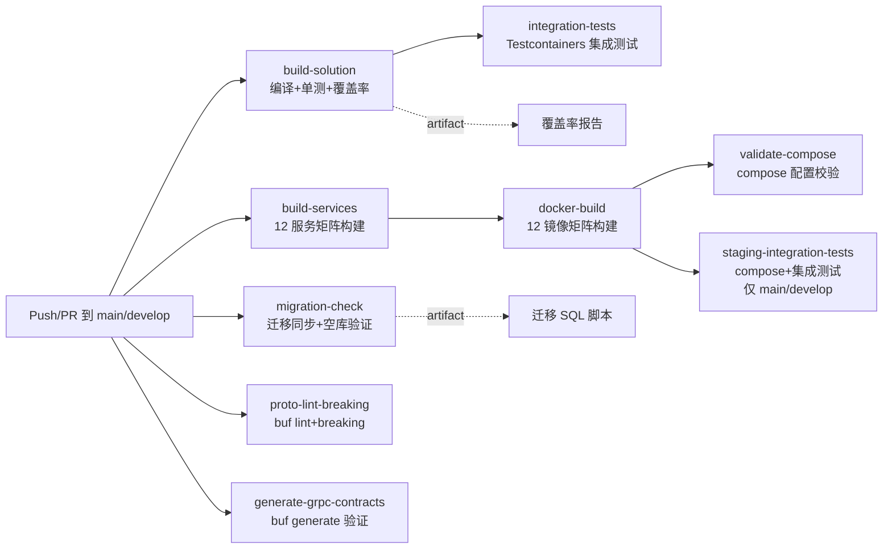

# 第 9 章 部署与运维

## 学习目标

1. 理解 Leno 平台的容器化策略，能够编写多阶段 Dockerfile 并掌握镜像分层优化技巧与镜像标签规范
2. 掌握 `docker-compose.yml` 编排结构，能够说明 21 个 service 的依赖关系、`healthcheck` 配置、`leno-net` 网络与数据卷设计，并熟练使用"仅启动基础设施"模式
3. 学会使用 Helm（Kubernetes 包管理器）部署 Leno 平台，能够解读 Chart 结构、`deployment.yaml`/`hpa.yaml`/`migration-job.yaml` 等模板，并完成 dev/staging/prod 三环境差异化部署
4. 熟悉 Consul 服务发现与配置中心机制，能够说明服务自注册、`ConsulDestinationResolver` 动态路由、`ConsulConfigWatcher` 长轮询热更新的工作原理
5. 能够解读 Leno CI/CD 流水线（9 个 Job）的执行流程，掌握蓝绿部署、金丝雀发布、Helm rollback 等发布与回滚操作，并按 Runbook 规范执行常见故障排查

## 适用读者

- **运维人员**：负责平台部署、Helm Chart 维护、CI/CD 流水线管理、生产环境发布与回滚、故障排查与 Runbook 编写
- **开发人员**：负责编写 Dockerfile、维护 docker-compose 配置、调整 Helm values、定位线上故障并参与发布评审

## 术语速查

| 术语 | 行内解释 |
|------|---------|
| Helm | Kubernetes 的包管理器（类似 apt/yum），将一组 K8s 资源模板化打包为 Chart，支持版本化安装、升级、回滚 |
| Chart | Helm 的打包格式，是一组描述 K8s 资源的 Go template 文件集合，含 `Chart.yaml`/`values.yaml`/`templates/` |
| Kubernetes（K8s） | 容器编排平台，负责 Pod 调度、服务发现、自动扩缩容、滚动更新等，是 Leno 生产环境的运行时基座 |
| Deployment | K8s 中管理无状态应用工作负载的资源，通过 `replicas` 控制副本数，支持滚动更新与回滚 |
| Service | K8s 中为一组 Pod 提供稳定网络端点的资源，通过 Label Selector 路由流量，类型含 ClusterIP/NodePort/LoadBalancer |
| Ingress | K8s 中管理外部 HTTP(S) 访问集群内 Service 的资源，通常配合 Nginx/Traefik 等 Ingress Controller 使用 |
| HPA | HorizontalPodAutoscaler，K8s 水平 Pod 自动扩缩容资源，根据 CPU/内存或自定义指标自动调整 Deployment 副本数 |
| CI | Continuous Integration，持续集成，开发人员提交代码后自动执行构建、测试、静态检查，确保主分支随时可发布 |
| CD | Continuous Delivery/Deployment，持续交付/部署，在 CI 通过后自动（或手动触发）将应用部署到目标环境 |
| 蓝绿部署 | Blue-Green Deployment，维护两套完全相同的生产环境（蓝/绿），新版先部署到备用环境，验证通过后切流量，回滚只需切回 |
| 金丝雀发布 | Canary Release，将新版先发布到一小部分实例（如 5%），观察指标无异常后逐步扩大流量比例，风险可控的渐进式发布 |
| Runbook | 运维手册，针对特定运维场景（如发布、扩容、故障处理）编写的标准化操作步骤文档，确保操作可复现、可审计 |
| Consul 服务注册 | HashiCorp Consul 提供的服务发现机制，服务启动时将自身地址端口注册到 Consul，调用方通过 Consul 查询健康实例列表 |

---

## 9.1 容器化基础

容器化（Containerization）是将应用及其依赖打包到一个独立、可移植的运行时镜像中的技术。与虚拟机相比，容器共享宿主机内核、启动秒级、资源占用低，是微服务架构的标准部署单元。Leno 平台所有 12 个服务（11 个业务 BC + 1 个 API 网关）均以 Docker 容器形式运行，本地开发使用 docker-compose，生产环境使用 Kubernetes。

### 9.1.1 多阶段 Dockerfile

多阶段构建（Multi-stage Build）是 Docker 17.05+ 引入的特性，允许在一个 Dockerfile 中定义多个 `FROM` 阶段，最终镜像只包含最后阶段的产物，从而大幅减小镜像体积。Leno 平台采用经典的"SDK 构建 + Runtime 运行"两阶段模式：第一阶段用完整的 SDK 镜像编译发布产物，第二阶段用精简的 ASP.NET Runtime 镜像承载产物。以 Cart BC 为例：

```dockerfile
# src/Services/Cart/Leno.Cart.Api/Dockerfile L1-L13
FROM mcr.microsoft.com/dotnet/sdk:10.0 AS build
WORKDIR /src
COPY . .
RUN dotnet restore "src/Services/Cart/Leno.Cart.Api/Leno.Cart.Api.csproj"
RUN dotnet publish "src/Services/Cart/Leno.Cart.Api/Leno.Cart.Api.csproj" -c Release -o /app/publish /p:UseAppHost=false --no-restore

FROM mcr.microsoft.com/dotnet/aspnet:10.0 AS base
WORKDIR /app
EXPOSE 8080
COPY --from=build /app/publish .
ENV ASPNETCORE_URLS=http://+:8080
ENV ASPNETCORE_ENVIRONMENT=Docker
ENTRYPOINT ["dotnet", "Leno.Cart.Api.dll"]
```

来源：[Dockerfile](file:///c:/Users/Junjie/.trae-cn/worktrees/Leno/feat-project-optimization-plan-O7ECNx/src/Services/Cart/Leno.Cart.Api/Dockerfile)

关键点解读：

- **阶段一 `sdk:10.0 AS build`**：包含完整的 .NET SDK（含编译器、NuGet、dotnet CLI），镜像约 1.2GB。`COPY . .` 将整个解决方案上下文复制进来（便于 restore 整个 slnx 还原跨项目引用），随后 `dotnet publish` 以 `Release` 配置编译并输出到 `/app/publish`，`--no-restore` 复用上一步已还原的包
- **阶段二 `aspnet:10.0 AS base`**：仅含 ASP.NET Core Runtime（无 SDK），镜像约 200MB。`COPY --from=build /app/publish .` 仅将编译产物复制过来，最终镜像不包含源码、SDK 与中间产物
- **端口 `EXPOSE 8080`**：ASP.NET Core 10.0 容器镜像默认以非 root 用户运行，监听端口从传统的 80 改为 8080（80 是特权端口，非 root 不可用）
- **`ASPNETCORE_URLS=http://+:8080`**：显式指定 Kestrel 监听地址，与 `EXPOSE` 对齐，确保 docker-compose 与 K8s 的端口映射一致
- **`ASPNETCORE_ENVIRONMENT=Docker`**：Leno 自定义环境名，用于在 `appsettings.Docker.json` 中覆盖容器内专用配置（如服务地址改为容器名）

两阶段构建的收益：最终镜像体积从 1.2GB 降至约 250MB，减少 80%；攻击面更小（无编译器、无源码）；构建缓存利用率更高（SDK 阶段可缓存 NuGet 包）。

### 9.1.2 镜像分层优化技巧

Docker 镜像由若干只读层（Layer）叠加而成，每条 `RUN`/`COPY`/`ADD` 指令生成一层。合理分层可提升构建缓存命中率、减小推送体积。Leno Dockerfile 采用以下优化技巧：

1. **`COPY . .` 放在 restore 之前**：当前实现将整个上下文先复制再 restore，缓存命中率不高（任何源码改动都会使 restore 层失效）。生产化改进建议是先 `COPY *.csproj` 再 restore，最后 `COPY . .` 与 publish——这样源码改动不会触发 restore 重跑
2. **`--no-restore` 复用包缓存**：publish 阶段不再重复 restore，缩短构建时间约 30%
3. **`/p:UseAppHost=false`**：不生成原生可执行文件（AppHost），直接通过 `dotnet` 命令启动，镜像内只需 .NET Runtime，无需额外平台二进制
4. **两个阶段分离**：SDK 阶段的中间产物（obj/、NuGet 缓存）不会进入最终镜像

### 9.1.3 镜像标签规范

镜像标签（Tag）是镜像版本的可读标识。Leno 平台遵循以下标签规范：

| 标签格式 | 用途 | 示例 |
|---------|------|------|
| `{repo}:{version}` | 正式发布版本，对应 Helm `appVersion` | `leno/cart-api:1.0.0` |
| `{repo}:latest` | 最新稳定版（仅本地开发使用，生产禁用） | `leno/cart-api:latest` |
| `{repo}:dev-{sha}` | 开发环境构建，关联 Git commit SHA | `leno/cart-api:dev-a1b2c3d` |
| `{repo}:staging-{sha}` | 预发环境构建 | `leno/cart-api:staging-a1b2c3d` |
| `leno-{service}:ci` | CI 流水线内本地构建标签（不推送） | `leno-Cart:ci` |

CI 流水线中 `docker-build` Job 使用 `leno-${{ matrix.service.name }}:ci` 标签（见第 9.5 节），仅用于后续 `validate-compose` Job 校验，不推送到镜像仓库。生产发布时由人工或 CD 流水线重新打 `{version}` 标签并推送。

### 9.1.4 镜像构建与本地验证

开发者本地构建与运行 Cart BC 镜像的标准流程：

```bash
# 1. 在仓库根目录构建镜像（注意 context 是仓库根，不是 Dockerfile 所在目录）
docker build -f src/Services/Cart/Leno.Cart.Api/Dockerfile -t leno/cart-api:dev .

# 2. 查看镜像大小（验证多阶段构建生效）
docker images leno/cart-api:dev
# REPOSITORY        TAG   IMAGE ID       CREATED         SIZE
# leno/cart-api     dev   a1b2c3d4e5f6   2 minutes ago   248MB

# 3. 单独运行容器验证（不依赖 docker compose）
docker run --rm -d -p 5153:8080 --name leno-cart-test leno/cart-api:dev

# 4. 验证健康检查端点
curl http://localhost:5153/health/live
# {"status":"Healthy","checks":[]}

# 5. 查看容器日志
docker logs leno-cart-test -f

# 6. 清理
docker stop leno-cart-test
```

关键点：①`docker build` 的 context 必须是仓库根目录（`.`），因为 Dockerfile 内 `COPY . .` 依赖整个解决方案上下文做 restore；②`-f` 显式指定 Dockerfile 路径；③本地构建的 `:dev` 标签遵循 9.1.3 节的标签规范；④健康检查端点 `/health/live` 是 Leno 各 BC 的统一探针路径，由 `AddLenoHealthChecks` 注册。

---

## 9.2 docker compose 编排

docker compose 是 Docker 官方的多容器编排工具，通过单个 `docker-compose.yml` 文件描述一组关联服务，支持一键 `up`/`down`、依赖顺序控制、健康检查、网络与数据卷管理。Leno 平台在项目根目录维护一份覆盖全部 21 个 service 的 `docker-compose.yml`，是本地开发与 Staging 集成测试的统一编排入口。

### 9.2.1 服务依赖关系图

Leno 的 21 个 service 分为三层：基础设施层（9 个）、业务 BC 层（11 个）、网关层（1 个）。依赖关系自下而上：BC 依赖基础设施，网关依赖全部 BC 与部分可观测基础设施。

```mermaid
graph TB
    subgraph "基础设施层（9 个）"
        SQL[sqlserver]
        REDIS[redis]
        CONSUL[consul]
        RABBIT[rabbitmq]
        ES[elasticsearch]
        JAEGER[jaeger]
        PROM[prometheus]
        AM[alertmanager]
        GRAF[grafana]
    end

    subgraph "业务 BC 层（11 个）"
        UA[user-auth-api]
        PROD[product-api]
        CART[cart-api]
        ORD[order-api]
        PROMO[promotion-api]
        PAY[payment-api]
        PTS[points-api]
        RAS[review-aftersales-api]
        SS[seller-shop-api]
        NOTI[notification-api]
        SA[system-admin-api]
    end

    GW[api-gateway]

    UA --> SQL
    UA --> REDIS
    UA --> RABBIT
    UA --> ES
    UA --> CONSUL
    PROD --> SQL
    PROD --> REDIS
    PROD --> RABBIT
    PROD --> ES
    PROD --> CONSUL
    CART --> SQL
    CART --> REDIS
    CART --> RABBIT
    CART --> ES
    CART --> CONSUL

    GW --> UA
    GW --> PROD
    GW --> CART
    GW --> ORD
    GW --> PROMO
    GW --> PAY
    GW --> PTS
    GW --> RAS
    GW --> SS
    GW --> NOTI
    GW --> SA
    GW --> CONSUL
    GW --> JAEGER
    GW --> PROM

    GRAF --> PROM
```



> 说明：为图清晰，仅展示 user-auth-api / product-api / cart-api 的基础设施依赖，其余 8 个 BC 依赖关系相同（均依赖 sqlserver/redis/rabbitmq/elasticsearch/consul 5 项）。

### 9.2.2 docker-compose.yml 结构

[docker-compose.yml](file:///c:/Users/Junjie/.trae-cn/worktrees/Leno/feat-project-optimization-plan-O7ECNx/docker-compose.yml) 位于项目根目录（非 `deploy/docker-compose.yml`），共定义 21 个 service。以下是基础设施层 sqlserver 与业务层 cart-api 的关键片段：

```yaml
# docker-compose.yml L1-L19（sqlserver 基础设施示例）
services:
  sqlserver:
    image: mcr.microsoft.com/mssql/server:2019-latest
    container_name: leno-sqlserver
    environment:
      - ACCEPT_EULA=Y
      - MSSQL_SA_PASSWORD=${MSSQL_SA_PASSWORD}
      - MSSQL_PID=Express
    ports:
      - "1433:1433"
    volumes:
      - sqldata:/var/opt/mssql
    healthcheck:
      test: ["CMD-SHELL", "/opt/mssql-tools18/bin/sqlcmd -S localhost -U sa -P '${MSSQL_SA_PASSWORD}' -Q 'SELECT 1' -C"]
      interval: 10s
      timeout: 5s
      retries: 10
    networks:
      - leno-net
```

```yaml
# docker-compose.yml L226-L254（cart-api 业务 BC 示例）
  cart-api:
    build:
      context: .
      dockerfile: src/Services/Cart/Leno.Cart.Api/Dockerfile
    container_name: leno-cart-api
    ports:
      - "5153:8080"
    environment:
      - ASPNETCORE_ENVIRONMENT=Docker
    depends_on:
      sqlserver:
        condition: service_healthy
      redis:
        condition: service_healthy
      rabbitmq:
        condition: service_healthy
      elasticsearch:
        condition: service_healthy
      consul:
        condition: service_healthy
    healthcheck:
      test: ["CMD-SHELL", "curl -f http://localhost:8080/health/live || exit 1"]
      interval: 10s
      timeout: 5s
      retries: 10
      start_period: 30s
    restart: unless-stopped
    networks:
      - leno-net
```

### 9.2.3 healthcheck 配置示例

`healthcheck` 是 docker compose 的健康检查机制，容器会按 `interval` 间隔执行 `test` 命令，连续失败 `retries` 次后标记为 unhealthy。Leno 平台每个 service 都配置了 healthcheck，使 `depends_on.condition: service_healthy` 能精确等待依赖就绪，避免业务容器在 DB 未启动时崩溃重启。

| 服务 | healthcheck test | interval/timeout/retries |
|------|-----------------|--------------------------|
| sqlserver | `sqlcmd -Q 'SELECT 1'` | 10s/5s/10 |
| redis | `redis-cli ping` | 5s/3s/5 |
| consul | `curl /v1/status/leader` | 10s/5s/5 |
| rabbitmq | `rabbitmq-diagnostics check_running` | 10s/5s/10 |
| elasticsearch | `curl /_cluster/health` | 10s/5s/10 |
| jaeger | `wget /14269/` | 10s/5s/10 |
| prometheus | `wget /-/healthy` | 10s/5s/10 |
| grafana | `wget /api/health` | 10s/5s/10 |
| 业务 BC（11 个） | `curl /health/live` | 10s/5s/10，start_period 30s |
| api-gateway | `curl /health/live` | 10s/5s/10，start_period 30s |

业务 BC 与网关的 `start_period: 30s` 给 .NET 应用启动预留 30 秒缓冲（EF Core 迁移、Consul 注册、DI 容器构建等），避免启动慢被误判为 unhealthy。

### 9.2.4 leno-net 网络与数据卷设计

[docker-compose.yml](file:///c:/Users/Junjie/.trae-cn/worktrees/Leno/feat-project-optimization-plan-O7ECNx/docker-compose.yml) 末尾定义了网络与数据卷：

```yaml
# docker-compose.yml L544-L555
volumes:
  sqldata:
  redisdata:
  rabbitmqdata:
  esdata:
  prometheusdata:
  grafanadata:
  alertmanager-data:

networks:
  leno-net:
    driver: bridge
```

- **`leno-net` 桥接网络**：21 个 service 全部接入同一 bridge 网络，容器间通过 service 名（如 `sqlserver`、`cart-api`）互相访问，Docker 内置 DNS 自动解析。宿主机访问通过 `ports` 映射（如 `5153:8080`）
- **7 个命名数据卷**：持久化基础设施有状态数据，`docker-compose down`（不带 `-v`）不会删除数据卷，确保重启后数据不丢失。命名卷由 Docker 管理，路径默认在 `/var/lib/docker/volumes/`
  - `sqldata`：SQL Server 数据库文件
  - `redisdata`：Redis AOF 持久化
  - `rabbitmqdata`：RabbitMQ 队列与消息
  - `esdata`：Elasticsearch 索引
  - `prometheusdata`：Prometheus TSDB（默认保留 7 天）
  - `grafanadata`：Grafana 仪表盘与用户配置
  - `alertmanager-data`：Alertmanager 告警状态

业务 BC（11 个）与网关均为无状态容器，不挂载数据卷，符合十二要素应用（Twelve-Factor App）的"无状态进程"原则——状态全部下沉到基础设施层。

### 9.2.5 启动顺序

docker compose 通过 `depends_on.condition: service_healthy` 实现严格启动顺序：

1. **第一阶段**：9 个基础设施 service 并行启动，各自完成 healthcheck
2. **第二阶段**：11 个业务 BC 在所有 5 个核心依赖（sqlserver/redis/rabbitmq/elasticsearch/consul）healthy 后并行启动
3. **第三阶段**：api-gateway 在 11 个 BC + consul + jaeger + prometheus 全部 healthy 后启动

这种分层等待机制确保业务容器启动时依赖已就绪，避免连接超时导致的级联失败。`restart: unless-stopped` 策略保证容器异常退出时自动重启（除非手动 `docker stop`）。

### 9.2.6 仅启动基础设施模式

开发调试时常常只需要基础设施（数据库、缓存、消息队列等），业务服务用 IDE 本地运行以便断点调试。Leno 支持显式列出要启动的 service 名实现这一模式：

```bash
# 仅启动 9 个基础设施 service（含健康检查）
docker compose up -d sqlserver redis consul rabbitmq elasticsearch jaeger prometheus alertmanager grafana

# 查看健康状态
docker compose ps

# 业务服务在 IDE 中以 ASPNETCORE_ENVIRONMENT=Docker 启动，
# 通过 leno-net 网络访问容器内的基础设施（如 Server=sqlserver,1433）
```

CI 流水线的 `staging-integration-tests` Job 也采用此模式（见第 9.5 节），先拉起基础设施再执行集成测试。

### 9.2.7 环境变量与 .env 文件

[docker-compose.yml](file:///c:/Users/Junjie/.trae-cn/worktrees/Leno/feat-project-optimization-plan-O7ECNx/docker-compose.yml) 中部分敏感配置通过 `${VAR}` 语法引用环境变量，避免硬编码进 Git 仓库。这些变量从仓库根目录的 `.env` 文件读取（docker compose 自动加载）：

| 变量名 | 用途 | 默认示例 |
|-------|------|---------|
| `MSSQL_SA_PASSWORD` | SQL Server SA 密码（需含大小写+数字+符号，≥8 字符） | `Leno@Test123!` |
| `RABBITMQ_DEFAULT_USER` | RabbitMQ 默认用户名 | `leno` |
| `RABBITMQ_DEFAULT_PASS` | RabbitMQ 默认密码 | `leno@rabbitmq` |
| `GF_SECURITY_ADMIN_USER` | Grafana 管理员用户名 | `admin` |
| `GF_SECURITY_ADMIN_PASSWORD` | Grafana 管理员密码 | `admin` |

`.env` 文件不应提交到 Git（已在 `.gitignore` 排除），仓库提供 `.env.example` 作为模板，开发者首次克隆后执行 `cp .env.example .env` 并填入本地值。生产环境通过 K8s Secret 注入等效配置（见第 9.3 节 `secretKeyRef`）。

### 9.2.8 完整 service 端口映射表

为便于本地开发访问，每个 BC 与基础设施都映射了宿主机端口。下表汇总全部 21 个 service 的端口：

| 类别 | 服务名 | 宿主机端口:容器端口 | 用途 |
|------|--------|-------------------|------|
| 基础设施 | sqlserver | 1433:1433 | SQL Server TDS |
| 基础设施 | redis | 6379:6379 | Redis 协议 |
| 基础设施 | consul | 8500:8500 | Consul HTTP API/UI |
| 基础设施 | rabbitmq | 5672:5672 / 15672:15672 | AMQP / Management UI |
| 基础设施 | elasticsearch | 9200:9200 | ES REST API |
| 基础设施 | jaeger | 4317:4317 / 4318:4318 / 16686:16686 | OTLP gRPC / OTLP HTTP / Jaeger UI |
| 基础设施 | prometheus | 9090:9090 | Prometheus UI |
| 基础设施 | alertmanager | 9093:9093 | Alertmanager UI |
| 基础设施 | grafana | 3000:3000 | Grafana UI |
| BC | user-auth-api | 5151:8080 | HTTP API |
| BC | product-api | 5152:8080 | HTTP API |
| BC | cart-api | 5153:8080 | HTTP API |
| BC | order-api | 5154:8080 | HTTP API |
| BC | promotion-api | 5155:8080 | HTTP API |
| BC | payment-api | 5156:8080 | HTTP API |
| BC | points-api | 5157:8080 | HTTP API |
| BC | review-aftersales-api | 5158:8080 | HTTP API |
| BC | seller-shop-api | 5159:8080 | HTTP API |
| BC | notification-api | 5160:8080 | HTTP API |
| BC | system-admin-api | 5161:8080 | HTTP API |
| 网关 | api-gateway | 8080:8080 | 统一入口 |

设计要点：①所有业务 BC 容器内统一监听 8080（Dockerfile `EXPOSE 8080`），宿主机端口按 BC 顺序递增 5151-5161 便于记忆；②网关占用 8080 与容器内端口一致，作为对外统一入口；③Prometheus（9090）与 Grafana（3000）端口仅本地开发暴露，生产通过 Ingress 或 port-forward 访问。

---

## 9.3 Helm Chart 部署

当服务规模从单机走向 Kubernetes 集群时，纯手工编写 K8s YAML 资源会面临两个痛点：一是同一应用部署到 dev/staging/prod 三环境需要重复维护多份 YAML；二是 12 个服务（11 BC + 1 网关）的 Deployment/Service/Ingress/HPA 资源高度相似，复制粘贴难维护。Helm（Kubernetes 包管理器，类似 apt/yum）通过 Chart（Helm 的打包格式，一组 K8s 资源的 Go template 集合）解决这两个问题：将资源模板化，通过 values 文件注入环境差异化配置，实现"一份模板，多环境部署"。

### 9.3.1 Leno Helm Chart 结构

Leno 平台的 Helm Chart 位于 `deploy/helm/leno/`，结构如下：

```
deploy/helm/leno/
├── Chart.yaml              # Chart 元数据（名称、版本、appVersion）
├── values.yaml             # 默认 values（生产环境基线）
├── values-dev.yaml         # 开发环境覆盖
├── values-staging.yaml     # 预发环境覆盖
├── values-prod.yaml        # 生产环境覆盖
└── templates/
    ├── _helpers.tpl        # 模板辅助函数（fullname/image/labels 等）
    ├── configmap.yaml      # 非敏感配置 ConfigMap
    ├── deployment.yaml     # 12 个服务的 Deployment 模板
    ├── hpa.yaml            # 水平自动扩缩容模板
    ├── ingress.yaml        # 外部访问入口模板
    ├── migration-job.yaml  # EF Core 数据库迁移 Job 模板
    ├── secret.yaml         # 敏感配置 Secret 占位
    └── service.yaml        # 12 个服务的 Service 模板
```

[Chart.yaml](file:///c:/Users/Junjie/.trae-cn/worktrees/Leno/feat-project-optimization-plan-O7ECNx/deploy/helm/leno/Chart.yaml) 描述 Chart 元数据：

```yaml
# deploy/helm/leno/Chart.yaml L1-L12
apiVersion: v2
name: leno
description: Leno 电商平台 Helm chart（umbrella chart，含 11 个 BC + API 网关）
type: application
version: 1.0.0
appVersion: "1.0.0"
keywords:
  - ecommerce
  - ddd
  - microservices
maintainers:
  - name: Leno Team
```

字段说明：

- `apiVersion: v2`：Helm 3 引入的 Chart API 版本，推荐使用
- `name: leno`：Chart 名称，`helm install` 时作为 release 标识前缀
- `type: application`：应用类型 Chart（与 library 类型相对，后者仅供其他 Chart 引用）
- `version: 1.0.0`：**Chart 自身版本**，模板变更时递增
- `appVersion: "1.0.0"`：**应用版本**，对应镜像 tag 与产品发布版本，需用引号包裹避免被解析为浮点数

这是一个 umbrella chart（伞式 Chart），将 12 个服务统一打包，通过 `values.yaml` 的 `services` map 控制每个服务的启用与配置。

### 9.3.2 _helpers.tpl 模板辅助函数

[_helpers.tpl](file:///c:/Users/Junjie/.trae-cn/worktrees/Leno/feat-project-optimization-plan-O7ECNx/deploy/helm/leno/templates/_helpers.tpl) 定义了多个可复用的模板函数，被其他模板通过 `include` 引用：

```yaml
# deploy/helm/leno/templates/_helpers.tpl L1-L47（节选）
{{- define "leno.fullname" -}}
{{- if .Values.global.nameOverride -}}
{{- .Values.global.nameOverride | trunc 63 | trimSuffix "-" -}}
{{- else -}}
{{- .Release.Name | trunc 63 | trimSuffix "-" -}}
{{- end -}}
{{- end -}}

{{- define "leno.serviceName" -}}
{{- printf "%s-%s" (include "leno.fullname" .context) .name | trunc 63 | trimSuffix "-" -}}
{{- end -}}

{{- define "leno.labels" -}}
app.kubernetes.io/name: {{ .name }}
app.kubernetes.io/instance: {{ .context.Release.Name }}
app.kubernetes.io/managed-by: {{ .context.Release.Service }}
app.kubernetes.io/part-of: leno
{{- end -}}

{{- define "leno.image" -}}
{{- $registry := .context.Values.global.imageRegistry -}}
{{- if $registry -}}
{{- printf "%s/%s:%s" $registry .service.image.repository .service.image.tag -}}
{{- else -}}
{{- printf "%s:%s" .service.image.repository .service.image.tag -}}
{{- end -}}
{{- end -}}
```

- `leno.fullname`：生成 release 全限定名，支持 `global.nameOverride` 覆盖，截断到 63 字符（K8s 资源名长度限制）
- `leno.serviceName`：拼接 `${release}-${serviceName}`，如 `leno-cart`
- `leno.labels`：统一标签，遵循 K8s 推荐的 `app.kubernetes.io/*` 标签规范，便于 Helm/kubectl 按标签筛选
- `leno.image`：根据是否配置 `global.imageRegistry` 拼接镜像地址，支持私有仓库统一前缀

### 9.3.3 deployment.yaml 模板核心片段

[deployment.yaml](file:///c:/Users/Junjie/.trae-cn/worktrees/Leno/feat-project-optimization-plan-O7ECNx/deploy/helm/leno/templates/deployment.yaml) 通过 `range` 遍历 `services` map，为每个启用的服务生成一个 Deployment 资源：

```yaml
# deploy/helm/leno/templates/deployment.yaml L1-L62（节选）
{{- range $name, $service := .Values.services }}
{{- if $service.enabled }}
---
apiVersion: apps/v1
kind: Deployment
metadata:
  name: {{ include "leno.serviceName" (dict "name" $name "context" $) }}
  labels:
    {{- include "leno.labels" (dict "name" $name "context" $) | nindent 4 }}
spec:
  replicas: {{ $service.replicaCount }}
  selector:
    matchLabels:
      {{- include "leno.selectorLabels" (dict "name" $name "context" $) | nindent 6 }}
  template:
    metadata:
      labels:
        {{- include "leno.selectorLabels" (dict "name" $name "context" $) | nindent 8 }}
    spec:
      containers:
        - name: {{ $name }}
          image: {{ include "leno.image" (dict "service" $service "context" $) }}
          imagePullPolicy: {{ $service.image.pullPolicy | default "IfNotPresent" }}
          ports:
            - name: http
              containerPort: {{ $service.httpPort | default $service.service.port }}
              protocol: TCP
            {{- if $service.grpcPort }}
            - name: grpc
              containerPort: {{ $service.grpcPort }}
              protocol: TCP
            {{- end }}
          env:
            - name: ASPNETCORE_ENVIRONMENT
              value: {{ $.Values.global.environment | default "Production" }}
            - name: Service__Name
              value: {{ $name | quote }}
            - name: OpenTelemetry__OtlpEndpoint
              value: {{ $.Values.global.jaeger.otlpEndpoint | quote }}
            - name: Consul__Address
              value: {{ $.Values.global.consul.address | quote }}
            - name: ConnectionStrings__Default
              valueFrom:
                secretKeyRef:
                  name: {{ $.Values.externalDependencies.sqlserver.connectionstringSecret }}
                  key: {{ $name }}
            - name: Security__Jwt__SecretKey
              valueFrom:
                secretKeyRef:
                  name: leno-security-jwt
                  key: secret-key
          readinessProbe:
            {{- toYaml $service.readinessProbe | nindent 12 }}
          livenessProbe:
            {{- toYaml $service.livenessProbe | nindent 12 }}
          resources:
            {{- toYaml $service.resources | nindent 12 }}
{{- end }}
{{- end }}
```

关键设计：

- **`range $name, $service := .Values.services`**：遍历 values.yaml 中所有服务，`$name` 是服务名（如 `cart`），`$service` 是其配置 map
- **`if $service.enabled`**：支持按环境禁用部分服务
- **双端口暴露**：HTTP 端口（`httpPort`）与 gRPC 端口（`grpcPort`）分别命名，便于 Service/Ingress 区分流量
- **环境变量注入**：ASPNETCORE_ENVIRONMENT/Service:Name/OpenTelemetry/Consul 等通过 value 注入，连接字符串与 JWT Secret 通过 `secretKeyRef` 引用 K8s Secret，避免敏感信息落地 values
- **探针配置**：`readinessProbe` 与 `livenessProbe` 区分——ready 探针失败仅从 Service endpoints 摘除（不接新流量但不重启），live 探针失败触发 Pod 重启。`initialDelaySeconds: 30` 给 .NET 启动预留时间

### 9.3.4 HPA 模板代码

[hpa.yaml](file:///c:/Users/Junjie/.trae-cn/worktrees/Leno/feat-project-optimization-plan-O7ECNx/deploy/helm/leno/templates/hpa.yaml) 使用 `autoscaling/v2` API，基于 CPU 利用率自动扩缩容：

```yaml
# deploy/helm/leno/templates/hpa.yaml L1-L25（完整）
{{- range $name, $service := .Values.services }}
{{- if and $service.enabled $service.hpa $service.hpa.enabled }}
---
apiVersion: autoscaling/v2
kind: HorizontalPodAutoscaler
metadata:
  name: {{ include "leno.serviceName" (dict "name" $name "context" $) }}
  labels:
    {{- include "leno.labels" (dict "name" $name "context" $) | nindent 4 }}
spec:
  scaleTargetRef:
    apiVersion: apps/v1
    kind: Deployment
    name: {{ include "leno.serviceName" (dict "name" $name "context" $) }}
  minReplicas: {{ $service.hpa.minReplicas | default 1 }}
  maxReplicas: {{ $service.hpa.maxReplicas | default 5 }}
  metrics:
    - type: Resource
      resource:
        name: cpu
        target:
          type: Utilization
          averageUtilization: {{ $service.hpa.targetCPUUtilizationPercentage | default 70 }}
{{- end }}
{{- end }}
```

HPA（HorizontalPodAutoscaler，水平 Pod 自动扩缩容）工作机制：K8s metrics-server 持续采集各 Pod 的 CPU/内存利用率，HPA 控制器每 15 秒计算一次，若实际利用率超过 `targetCPUUtilizationPercentage`（如 70%）则按公式 `期望副本数 = 当前副本数 × (实际利用率 / 目标利用率)` 扩容，反之缩容（默认冷却 5 分钟避免抖动）。Leno 各 BC 默认 maxReplicas=8（生产 10），应对大促流量峰值。

### 9.3.5 migration-job.yaml：数据库迁移 Job

[migration-job.yaml](file:///c:/Users/Junjie/.trae-cn/worktrees/Leno/feat-project-optimization-plan-O7ECNx/deploy/helm/leno/templates/migration-job.yaml) 利用 Helm hook 机制，在 `helm install`/`helm upgrade` 之前执行 EF Core 数据库迁移：

```yaml
# deploy/helm/leno/templates/migration-job.yaml L1-L50（节选）
{{- range $name, $service := .Values.services }}
{{- if and $service.enabled $service.migration $service.migration.enabled $service.migration.runOnInit }}
---
apiVersion: batch/v1
kind: Job
metadata:
  name: {{ include "leno.serviceName" (dict "name" $name "context" $) }}-migration
  annotations:
    "helm.sh/hook": pre-install,pre-upgrade
    "helm.sh/hook-weight": "-5"
    "helm.sh/hook-delete-policy": before-hook-creation,hook-succeeded
spec:
  backoffLimit: 3
  template:
    spec:
      restartPolicy: OnFailure
      containers:
        - name: migration
          image: {{ include "leno.image" (dict "service" $service "context" $) }}
          command: ["dotnet", "ef", "database", "update", "--no-build"]
          env:
            - name: ConnectionStrings__Default
              valueFrom:
                secretKeyRef:
                  name: {{ $.Values.externalDependencies.sqlserver.connectionstringSecret }}
                  key: {{ $name }}
{{- end }}
{{- end }}
```

关键设计：

- **`helm.sh/hook: pre-install,pre-upgrade`**：Helm 在安装或升级前先执行此 Job，确保数据库 schema 就绪后再部署业务 Pod
- **`hook-weight: "-5"`**：负数权重优先执行（多个 hook 时按权重升序），确保迁移在其他 pre-hook 之前
- **`hook-delete-policy: before-hook-creation,hook-succeeded`**：成功执行后删除旧 Job，下次升级重新创建；失败则保留 Job 便于排查
- **`backoffLimit: 3`**：失败重试 3 次，避免偶发数据库连接抖动导致发布失败
- **复用业务镜像**：迁移 Job 直接用业务镜像（含 EF Core 工具），无需额外维护迁移专用镜像

### 9.3.6 service.yaml 与 ingress.yaml

[service.yaml](file:///c:/Users/Junjie/.trae-cn/worktrees/Leno/feat-project-optimization-plan-O7ECNx/deploy/helm/leno/templates/service.yaml) 为每个服务创建 ClusterIP Service，暴露 HTTP 与 gRPC 双端口：

```yaml
# deploy/helm/leno/templates/service.yaml L1-L25（完整）
{{- range $name, $service := .Values.services }}
{{- if $service.enabled }}
---
apiVersion: v1
kind: Service
metadata:
  name: {{ include "leno.serviceName" (dict "name" $name "context" $) }}
  labels:
    {{- include "leno.labels" (dict "name" $name "context" $) | nindent 4 }}
spec:
  type: {{ $service.service.type | default "ClusterIP" }}
  selector:
    {{- include "leno.selectorLabels" (dict "name" $name "context" $) | nindent 4 }}
  ports:
    - name: http
      port: {{ $service.service.port }}
      targetPort: {{ $service.httpPort | default $service.service.port }}
      protocol: TCP
    {{- if $service.grpcPort }}
    - name: grpc
      port: {{ $service.grpcPort }}
      targetPort: {{ $service.grpcPort }}
      protocol: TCP
    {{- end }}
{{- end }}
{{- end }}
```

[ingress.yaml](file:///c:/Users/Junjie/.trae-cn/worktrees/Leno/feat-project-optimization-plan-O7ECNx/deploy/helm/leno/templates/ingress.yaml) 仅对 `ingress.enabled=true` 的服务（默认仅 api-gateway）创建 Ingress 资源，将外部域名（如 `api.leno.example.com`）路由到 ClusterIP Service。业务 BC 的 Service 仅集群内可访问，符合"网关为唯一入口"的安全边界。

### 9.3.7 configmap.yaml 与 secret.yaml

[configmap.yaml](file:///c:/Users/Junjie/.trae-cn/worktrees/Leno/feat-project-optimization-plan-O7ECNx/deploy/helm/leno/templates/configmap.yaml) 集中存放非敏感运行时元数据（环境名、Consul 地址、Jaeger OTLP 端点、Prometheus 抓取注解），便于运维 `kubectl get cm` 一览部署配置。`prometheus.scrape: "true"` 注解可被 Prometheus ServiceMonitor 自动发现抓取目标。

[secret.yaml](file:///c:/Users/Junjie/.trae-cn/worktrees/Leno/feat-project-optimization-plan-O7ECNx/deploy/helm/leno/templates/secret.yaml) 仅在 `externalSecrets.enabled=false` 时创建占位 Secret（`REPLACE_ME_VIA_EXTERNAL_SECRET`），生产环境应启用 External Secrets Operator 对接 Vault/Consul KV 自动注入真实密钥，避免敏感信息进 Git。

### 9.3.8 三环境差异化配置

Leno 通过 values-dev/staging/prod.yaml 三份覆盖文件实现环境差异化。下表对比关键差异：

| 配置项 | dev | staging | prod |
|--------|-----|---------|------|
| `global.environment` | Development | Staging | Production |
| `replicaCount`（每服务） | 1 | 2 | 3 |
| HPA `enabled` | false | true | true |
| HPA `minReplicas` | — | 2 | 3 |
| HPA `maxReplicas` | — | 5 | 10（网关 15） |
| HPA `targetCPUUtilizationPercentage` | — | 70 | 65 |
| 资源 requests CPU/内存 | 100m/128Mi | 200m/256Mi | 500m/512Mi |
| 资源 limits CPU/内存 | 500m/256Mi | 1000m/512Mi | 2000m/1Gi |
| `ingress.enabled`（api-gateway） | false | true | true |
| `migration.runOnInit` | true | true | true |

设计要点：

- **dev 单副本无 HPA**：开发环境追求低成本与快速启动，单副本够用；关闭 HPA 避免本地 minikube/kind 资源不足时反复扩缩容
- **staging 与生产对齐**：staging 是生产的小规模镜像，启用 HPA 与多副本，确保验证到的行为能在生产复现
- **生产更激进**：`targetCPU=65%`（比 staging 70% 更早扩容），`maxReplicas=10`（应对大促），资源 limits 翻倍以承受突发流量

来源：[values-dev.yaml](file:///c:/Users/Junjie/.trae-cn/worktrees/Leno/feat-project-optimization-plan-O7ECNx/deploy/helm/leno/values-dev.yaml)、[values-staging.yaml](file:///c:/Users/Junjie/.trae-cn/worktrees/Leno/feat-project-optimization-plan-O7ECNx/deploy/helm/leno/values-staging.yaml)、[values-prod.yaml](file:///c:/Users/Junjie/.trae-cn/worktrees/Leno/feat-project-optimization-plan-O7ECNx/deploy/helm/leno/values-prod.yaml)

### 9.3.9 部署命令

```bash
# 添加 Leno Chart 仓库（若已推送到 OCI 仓库）
helm repo add leno oci://ghcr.io/leno/charts
helm repo update

# 开发环境部署
helm upgrade --install leno ./deploy/helm/leno \
  -f ./deploy/helm/leno/values-dev.yaml \
  -n leno-dev --create-namespace

# 预发环境部署
helm upgrade --install leno ./deploy/helm/leno \
  -f ./deploy/helm/leno/values-staging.yaml \
  -n leno-staging --create-namespace

# 生产环境部署（建议 --dry-run 先验证）
helm upgrade --install leno ./deploy/helm/leno \
  -f ./deploy/helm/leno/values-prod.yaml \
  -n leno-prod --create-namespace --dry-run --debug
helm upgrade --install leno ./deploy/helm/leno \
  -f ./deploy/helm/leno/values-prod.yaml \
  -n leno-prod --create-namespace

# 查看部署状态
helm list -n leno-prod
kubectl get pods -n leno-prod
kubectl get hpa -n leno-prod
```

`helm upgrade --install` 是幂等操作：首次执行等同 install，后续执行做 rolling upgrade。生产部署前务必 `--dry-run --debug` 校验模板渲染结果，避免 values 拼写错误导致线上事故。

---

## 9.4 Consul 服务发现与配置中心

Consul（HashiCorp 出品的服务网格与服务发现工具）在 Leno 平台承担两个角色：服务注册中心（服务自注册 + 网关动态路由）与配置中心（KV 存储防腐层 gRPC 开关，支持热更新）。相比 K8s 原生 Service，Consul 提供跨集群/跨数据中心的服务发现能力，且其 KV Store 天然适合存放需要热更新的运行时开关。

### 9.4.1 服务自注册机制

Leno 各业务 BC 启动时通过 Consul .NET 客户端将自身服务名、地址、端口注册到 Consul Catalog，并周期性发送健康检查。Consul 维护一份服务 → 健康实例列表的映射，调用方查询时只返回 passing 状态的实例。注册信息通过 `appsettings.Docker.json` 的 `Consul:Address` 配置（被 Helm `Consul__Address` 环境变量覆盖）。

服务自注册的优势：

- **动态扩缩容感知**：K8s HPA 扩容新 Pod 后，新 Pod 自动注册到 Consul，网关立即感知并路由流量；缩容时旧 Pod 注销，流量自然转移
- **健康实例过滤**：Consul 健康检查失败（如 `/health/live` 返回非 200）的实例会被自动摘除，调用方不会拿到不可用实例
- **跨集群统一视图**：多 K8s 集群或混合云场景下，Consul 提供全局服务目录，比 K8s Service 的集群内 DNS 更通用

### 9.4.2 ConsulDestinationResolver

Leno API Gateway 基于 YARP（Yet Another Reverse Proxy，微软开源的 .NET 反向代理库）实现，通过自定义 `ConsulDestinationResolver` 实现基于 Consul 的动态后端解析：

```csharp
// src/ApiGateway/Leno.ApiGateway/Services/ConsulDestinationResolver.cs L13-L70（节选）
public sealed class ConsulDestinationResolver : IDestinationResolver
{
    private readonly IConsulServiceDiscovery _discovery;
    private readonly ILogger<ConsulDestinationResolver> _logger;

    public ConsulDestinationResolver(
        IConsulServiceDiscovery discovery,
        ILogger<ConsulDestinationResolver> logger)
    {
        _discovery = discovery ?? throw new ArgumentNullException(nameof(discovery));
        _logger = logger ?? throw new ArgumentNullException(nameof(logger));
    }

    public async ValueTask<ResolvedDestinationCollection> ResolveDestinationsAsync(
        IReadOnlyDictionary<string, DestinationConfig> destinations,
        CancellationToken cancellationToken)
    {
        var firstDest = destinations.Values.FirstOrDefault();
        if (firstDest?.Metadata is not null
            && firstDest.Metadata.TryGetValue("ConsulServiceName", out var serviceName)
            && !string.IsNullOrWhiteSpace(serviceName))
        {
            return await ResolveFromConsulAsync(serviceName, cancellationToken);
        }

        // 静态配置回退：直接返回原始 destinations
        return new ResolvedDestinationCollection(destinations, EmptyChangeToken.Instance);
    }

    private async ValueTask<ResolvedDestinationCollection> ResolveFromConsulAsync(
        string serviceName,
        CancellationToken cancellationToken)
    {
        var instances = await _discovery.GetHealthyInstancesAsync(serviceName, cancellationToken);
        if (instances.Count == 0)
        {
            _logger.LogWarning(
                "No healthy instances found for Consul service {ServiceName}", serviceName);
        }

        var resolved = new Dictionary<string, DestinationConfig>(StringComparer.OrdinalIgnoreCase);
        foreach (var instance in instances)
        {
            var destinationId = $"{serviceName}-{instance.Id}";
            resolved[destinationId] = new DestinationConfig
            {
                Address = $"http://{instance.Address}:{instance.Port}/",
                Metadata = new Dictionary<string, string> { ["ConsulServiceName"] = serviceName }
            };
        }

        return new ResolvedDestinationCollection(resolved, EmptyChangeToken.Instance);
    }
}
```

来源：[ConsulDestinationResolver.cs](file:///c:/Users/Junjie/.trae-cn/worktrees/Leno/feat-project-optimization-plan-O7ECNx/src/ApiGateway/Leno.ApiGateway/Services/ConsulDestinationResolver.cs)

工作机制：

- YARP 路由配置中每个 Route 关联一组 Destination，Leno 在 Destination 的 `Metadata` 中标记 `ConsulServiceName`（如 `cart-api`）
- 每次请求时 YARP 调用 `ConsulDestinationResolver.ResolveDestinationsAsync`，解析器检查 Metadata，若包含 `ConsulServiceName` 则从 Consul 查询健康实例列表，动态构建 Destination 集合
- 若 Consul 中无健康实例，记录 Warning 日志并返回空集合（YARP 会返回 503）；若 Metadata 无 `ConsulServiceName`，回退到静态配置（兼容直接 IP 配置场景）

这种设计使网关无需重启即可感知后端实例变化，是 Leno 实现 HPA 扩缩容零中断路由的关键基础。

### 9.4.3 Consul KV 配置中心

Consul KV Store 是层次化的键值存储，Leno 用它存放需要运行时热更新的配置（避免重启服务）。当前主要存放 4 类配置：

| KV 路径前缀 | 用途 | 示例 |
|------------|------|------|
| `leno/anticorruption/use-grpc/{BC}` | 防腐层 gRPC/HttpClient 双轨开关 | `leno/anticorruption/use-grpc/Order` = `true` |
| `leno/grpc/endpoints/{BC}` | gRPC 服务端端点地址 | `leno/grpc/endpoints/product` = `https://leno-product-api:5152` |
| `leno/config/{Section:Key}` | 通用配置热重载（前缀 `leno/config`，30 秒轮询） | `leno/config/AntiCorruption:UseGrpc` = `true` |
| `leno/circuit-breaker/{service}` | 熔断器参数（规划中） | `leno/circuit-breaker/product` = `{"threshold":3}` |

操作示例（见第 9.7 节 Runbook 中的实际命令）：

```bash
# 启用 Order BC 的 gRPC 双轨
curl -X PUT "${CONSUL_ADDR}/v1/kv/leno/anticorruption/use-grpc/Order" -d 'true'

# 查询当前值
curl "${CONSUL_ADDR}/v1/kv/leno/anticorruption/use-grpc/Order"

# 紧急回滚（切回 HttpClient）
curl -X PUT "${CONSUL_ADDR}/v1/kv/leno/anticorruption/use-grpc/Order" -d 'false'
```

### 9.4.4 KV 热更新机制：ConsulConfigWatcher

[ConsulConfigWatcher](file:///c:/Users/Junjie/.trae-cn/worktrees/Leno/feat-project-optimization-plan-O7ECNx/src/BuildingBlocks/Leno.Infrastructure/Configuration/ConsulConfigWatcher.cs) 是 Leno 自研的 Consul KV 长轮询后台服务，监听 `leno/anticorruption/use-grpc/{BC}` 变化并热更新到 `IConfiguration`：

```csharp
// src/BuildingBlocks/Leno.Infrastructure/Configuration/ConsulConfigWatcher.cs L15-L84（节选）
public sealed class ConsulConfigWatcher : BackgroundService
{
    private const string UseGrpcKeyPrefix = "leno/anticorruption/use-grpc/";
    private static readonly TimeSpan WaitTime = TimeSpan.FromMinutes(5);
    private static readonly TimeSpan RetryDelay = TimeSpan.FromSeconds(10);

    private readonly IConsulClient _consul;
    private readonly IConfiguration _configuration;
    private readonly ILogger<ConsulConfigWatcher> _logger;
    private readonly string _bcName;
    private readonly string _useGrpcKey;

    public ConsulConfigWatcher(
        IConsulClient consul,
        IConfiguration configuration,
        ILogger<ConsulConfigWatcher> logger)
    {
        _consul = consul;
        _configuration = configuration;
        _logger = logger;
        _bcName = configuration["Service:Name"] ?? string.Empty;
        _useGrpcKey = UseGrpcKeyPrefix + _bcName;
    }

    protected override async Task ExecuteAsync(CancellationToken ct)
    {
        if (string.IsNullOrEmpty(_bcName))
        {
            _logger.LogWarning("Service:Name 未配置，ConsulConfigWatcher 退出");
            return;
        }

        _logger.LogInformation("ConsulConfigWatcher 启动，监听 KV: {Key}", _useGrpcKey);

        ulong? waitIndex = null;
        while (!ct.IsCancellationRequested)
        {
            try
            {
                var queryResult = await _consul.KV.Get(_useGrpcKey, new QueryOptions
                {
                    WaitIndex = waitIndex ?? 0,
                    WaitTime = WaitTime
                }, ct).ConfigureAwait(false);

                if (queryResult.Response is not null && queryResult.LastIndex != waitIndex)
                {
                    waitIndex = queryResult.LastIndex;
                    var newValue = Encoding.UTF8.GetString(queryResult.Response.Value);
                    _configuration["AntiCorruption:UseGrpc"] = newValue;
                    _logger.LogInformation("UseGrpc 配置热更新为 {Value}（BC={BC}）", newValue, _bcName);
                }
            }
            catch (Exception ex) when (!ct.IsCancellationRequested)
            {
                _logger.LogWarning(ex, "Consul KV watch 失败，{Seconds} 秒后重试", RetryDelay.TotalSeconds);
                await Task.Delay(RetryDelay, ct).ConfigureAwait(false);
            }
        }
    }
}
```

热更新机制核心：

- **长轮询（Long Polling）**：`_consul.KV.Get` 携带 `WaitTime=5min` 与 `WaitIndex`，Consul 服务端阻塞最多 5 分钟，期间 KV 一旦变更立即返回，实际感知延迟 **1-2 秒**（仅网络往返时间）
- **WaitIndex 防重复**：仅当 `LastIndex` 变化才更新配置，避免重复触发
- **写入 IConfiguration**：直接 `_configuration["AntiCorruption:UseGrpc"] = newValue`，配合 `IOptionsMonitor<AntiCorruptionOptions>` 实时反映到 `AntiCorruptionDispatcher`，无需重启进程
- **异常重试**：Consul 不可用时每 10 秒重试，避免长轮询连接中断后停止监听

> ⚠️ **已知代码缺口**：`ConsulConfigWatcher` 类已实现，但当前未在任何 BC 的 DI 容器中通过 `AddHostedService<ConsulConfigWatcher>()` 注册。运维若发现热更新日志未出现，需先由开发团队在调用方 BC `Program.cs` 补注册。临时替代方案：通过 `AddLenoConsulConfig`（前缀 `leno/config`，30 秒轮询热重载）写入 `leno/config/AntiCorruption:UseGrpc=true`。

---

## 9.5 CI/CD 流水线

CI/CD（Continuous Integration / Continuous Delivery-Deployment，持续集成/持续交付-部署）是现代软件工程的交付管道。CI 解决"代码合并后是否还能构建通过"的问题：开发人员每次 push 或提 PR 自动触发构建、单元测试、静态检查，问题尽早暴露；CD 在 CI 通过后将应用自动（或手动触发）部署到目标环境，缩短从代码到上线的时间。Leno 平台基于 GitHub Actions 实现 CI 流水线，CD 阶段采用"手动触发 Helm upgrade + 健康检查 + 失败回滚"的稳健模式。

### 9.5.1 Leno CI 流水线

[.github/workflows/ci.yml](file:///c:/Users/Junjie/.trae-cn/worktrees/Leno/feat-project-optimization-plan-O7ECNx/.github/workflows/ci.yml) 定义了 9 个 Job，覆盖编译、测试、镜像构建、配置校验、迁移检查、契约兼容性等环节。触发条件为 push 到 main/develop 分支或针对这两个分支的 PR。

| Job 名称 | 作用 | 触发条件 | 依赖 |
|---------|------|---------|------|
| `build-solution` | 全解决方案编译 + 占位符检查 + 单元测试 + 覆盖率 | 全部触发 | — |
| `integration-tests` | 集成测试（Testcontainers，Category=Integration） | 全部触发 | build-solution |
| `build-services` | 12 个服务矩阵构建（matrix） | 全部触发 | — |
| `docker-build` | 12 个服务镜像构建（matrix） | 全部触发 | build-services |
| `validate-compose` | 校验 docker-compose 配置语法 | 全部触发 | docker-build |
| `migration-check` | EF Core 迁移同步检查 + 生成幂等 SQL + Staging 空库执行 | 全部触发 | — |
| `proto-lint-breaking` | buf lint + breaking change 检查（PR 时对照 main） | 全部触发 | — |
| `generate-grpc-contracts` | buf generate 验证 gRPC C# 契约未漏提交 | 全部触发 | — |
| `staging-integration-tests` | docker-compose 拉起基础设施 + 集成测试 | 仅 push 到 main/develop | docker-build |

#### build-solution Job 详解

`build-solution` 是流水线的入口，覆盖编译与单元测试两大基础检查：

```yaml
# .github/workflows/ci.yml L10-L41（节选）
  build-solution:
    runs-on: ubuntu-latest
    steps:
      - uses: actions/checkout@v4
      - name: Setup .NET
        uses: actions/setup-dotnet@v4
        with:
          dotnet-version: '10.0.x'
      - name: Restore
        run: dotnet restore Leno.slnx
      - name: Build
        run: dotnet build Leno.slnx --configuration Release --no-restore
      - name: Check placeholders
        run: bash scripts/check-placeholders.sh
      - name: Unit tests with coverage
        run: dotnet test Leno.slnx --configuration Release --no-build --filter "Category!=Integration" --collect:"XPlat Code Coverage" --results-directory ./TestResults
      - name: Generate coverage report
        run: |
          dotnet tool install -g dotnet-reportgenerator-globaltool --version 5.4.0 || true
          reportgenerator -reports:./TestResults/**/coverage.cobertura.xml -targetdir:./CoverageReport -reporttypes:"Html;Cobertura;JsonSummary"
      - name: Check coverage thresholds by layer (M5.5)
        run: |
          chmod +x scripts/check-coverage-threshold.sh
          bash scripts/check-coverage-threshold.sh ./TestResults
        continue-on-error: true  # M5.5 阶段 1：先 warning（true），阶段 2：阻断（false）
```

关键点：

- **`Leno.slnx`**：.NET 10 引入的 XML 解决方案文件格式（取代传统 .sln），更易合并与解析
- **`Check placeholders`**：扫描代码中残留的 `REPLACE_ME`、`TODO` 等占位符，避免生产部署时遗漏替换
- **`Category!=Integration` 过滤**：单元测试快速跑（不依赖外部资源），集成测试单独在 `integration-tests` Job 执行
- **`check-coverage-threshold.sh`**：分层覆盖率检查（Domain/Application/Infrastructure/CrossCutting 不同阈值），当前 `continue-on-error: true` 即先 warning，后续会改为阻断

#### build-services 与 docker-build 矩阵

12 个服务通过 matrix 策略并行构建，每个服务独立 Job 实例，互不阻塞：

```yaml
# .github/workflows/ci.yml L77-L115（节选）
  build-services:
    runs-on: ubuntu-latest
    strategy:
      fail-fast: false
      matrix:
        project:
          - name: 'UserAuth'
            path: 'src/Services/UserAuth/Leno.UserAuth.Api/Leno.UserAuth.Api.csproj'
          - name: 'Product'
            path: 'src/Services/Product/Leno.Product.Api/Leno.Product.Api.csproj'
          # ...省略 Cart/Order/Promotion/Payment/PointsMembership/ReviewAfterSales/SellerShop/Notification/SystemAdmin
          - name: 'ApiGateway'
            path: 'src/ApiGateway/Leno.ApiGateway/Leno.ApiGateway.csproj'
    steps:
      - uses: actions/checkout@v4
      - name: Setup .NET
        uses: actions/setup-dotnet@v4
        with:
          dotnet-version: '10.0.x'
      - name: Build ${{ matrix.project.name }}
        run: dotnet build ${{ matrix.project.path }} --configuration Release
```

`fail-fast: false` 确保单个服务构建失败不会取消其他服务的构建，便于一次看到所有失败原因。`docker-build` Job 结构相同，矩阵 12 个 Dockerfile，标签为 `leno-${{ matrix.service.name }}:ci`，仅用于后续 `validate-compose` 与 `staging-integration-tests` Job，不推送到镜像仓库。

#### migration-check Job

`migration-check` 是 Leno 防止"模型变更未配套迁移"的关键护栏：

```yaml
# .github/workflows/ci.yml L160-L198（节选）
  migration-check:
    name: EF Core Migrations 同步检查
    runs-on: ubuntu-latest
    steps:
      - uses: actions/checkout@v4
      - name: Setup .NET
        uses: actions/setup-dotnet@v4
        with:
          dotnet-version: '10.0.x'
      - name: Install dotnet-ef
        run: dotnet tool install --global dotnet-ef --version 10.0.0
      - name: Restore
        run: dotnet restore Leno.slnx
      - name: Build
        run: dotnet build Leno.slnx --no-restore --configuration Release -p:TreatWarningsAsErrors=false
      - name: Check migrations sync (模型变更必须配套 migration)
        run: pwsh scripts/check-migrations.ps1
      - name: Generate idempotent migration SQL scripts
        run: pwsh scripts/generate-migration-scripts.ps1
      - name: Upload migration SQL scripts
        uses: actions/upload-artifact@v4
        with:
          name: migration-scripts
          path: scripts/migrations/*.sql
          retention-days: 14
      - name: Staging 空库执行迁移验证
        env:
          SA_PASSWORD: Leno@Test123!
        run: |
          docker run -d --name sqlserver-test \
            -e ACCEPT_EULA=Y \
            -e MSSQL_SA_PASSWORD=$SA_PASSWORD \
            -p 1433:1433 \
            mcr.microsoft.com/mssql/server:2019-latest
          sleep 60
          for f in scripts/migrations/*.sql; do
            /opt/mssql-tools18/bin/sqlcmd -S localhost,1433 -U sa -P $SA_PASSWORD -C -i "$f"
          done
          docker rm -f sqlserver-test
```

迁移检查三步走：①`check-migrations.ps1` 检测"模型变更但未生成 migration"的情况；②生成幂等 SQL 脚本（artifact 保留 14 天供回滚查阅）；③在临时 SQL Server 容器空库执行所有 SQL，验证脚本可重入无错误。

#### proto-lint-breaking 与 generate-grpc-contracts

这两个 Job 守护 gRPC 契约的兼容性与一致性：

- **`proto-lint-breaking`**：使用 [buf](https://buf.build/) 对 `src/BuildingBlocks/Leno.SharedContracts` 目录执行 `buf lint`（格式规范）与 `buf breaking --against main`（PR 时检查是否对 main 有破坏性变更，如删除字段、改字段类型）。破坏性变更会被拒绝，强制走废弃-迁移流程
- **`generate-grpc-contracts`**：执行 `buf generate` 重新生成 C# 契约代码，检查 `Generated/` 目录是否有未提交的差异，确保提交的生成代码与 .proto 同步

#### staging-integration-tests Job

这是流水线中最重的 Job，模拟真实环境跑完整集成测试，仅 main/develop 分支 push 时触发：

```yaml
# .github/workflows/ci.yml L248-L286（节选）
  staging-integration-tests:
    name: Staging 集成测试 (docker-compose)
    runs-on: ubuntu-latest
    needs: docker-build
    if: github.event_name == 'push' && (github.ref == 'refs/heads/main' || github.ref == 'refs/heads/develop')
    steps:
      - uses: actions/checkout@v4
      - name: Setup .NET
        uses: actions/setup-dotnet@v4
        with:
          dotnet-version: '10.0.x'

      - name: Start infrastructure (docker-compose)
        run: docker compose up -d sqlserver redis rabbitmq elasticsearch consul jaeger prometheus grafana alertmanager

      - name: Wait for infrastructure ready
        run: |
          for i in {1..60}; do
            if docker compose ps | grep -q "healthy"; then break; fi
            sleep 5
          done

      - name: Apply EF migrations
        run: |
          # 逐 BC 执行 dotnet ef database update
          for bc in UserAuth Product Cart Order Promotion ReviewAfterSales PointsMembership Payment Notification SellerShop SystemAdmin; do
            dotnet ef database update \
              --project src/Services/$bc/Leno.$bc.Infrastructure \
              --startup-project src/Services/$bc/Leno.$bc.Api
          done

      - name: Run integration tests (Category=Integration)
        run: dotnet test Leno.slnx --configuration Release --filter "Category=Integration" --verbosity normal
        env:
          ASPNETCORE_ENVIRONMENT: Staging

      - name: Cleanup
        if: always()
        run: docker compose down -v
```

此 Job 的价值在于"端到端验证"：①拉起 9 个基础设施容器（与生产环境一致）；②对 11 个 BC 逐个执行 EF Core 迁移，确保 schema 可在生产 SQL Server 上创建；③运行全部 `Category=Integration` 集成测试，覆盖真实数据库/Redis/RabbitMQ 交互路径；④`Cleanup` 步骤 `if: always()` 确保即使测试失败也清理容器，避免 GitHub Runner 资源泄漏。`docker compose down -v` 中的 `-v` 删除数据卷，确保下次运行从干净状态开始。

#### validate-compose Job

```yaml
# .github/workflows/ci.yml L152-L158（完整）
  validate-compose:
    runs-on: ubuntu-latest
    needs: docker-build
    steps:
      - uses: actions/checkout@v4
      - name: Validate docker-compose config
        run: docker-compose config > /dev/null
```

`docker-compose config` 解析 `docker-compose.yml` 并校验语法（如 service 名冲突、端口格式、healthcheck 字段合法性等），任何配置错误都会导致此 Job 失败。依赖 `docker-build` 是因为若引用了不存在的镜像，校验会警告（但 config 命令本身不拉取镜像，主要校验 YAML 结构）。

### 9.5.2 CI 流程图



说明：实线箭头表示 `needs` 依赖（前序 Job 成功才执行），虚线表示 artifact 流转。`build-solution`/`build-services`/`migration-check`/`proto-lint-breaking`/`generate-grpc-contracts` 5 个 Job 并行执行，最大化流水线吞吐。

### 9.5.3 CD 流水线

Leno 的 CD 阶段尚未完全自动化，采用"手动触发 Helm upgrade + 健康检查 + 失败回滚"的稳健模式：

1. **镜像推送**：CI 通过后，人工或独立 CD workflow 将 `:ci` 镜像重新打 `:1.0.0` 等正式标签推送到镜像仓库（GHCR/ACR/Harbor）
2. **Helm upgrade**：运维执行 `helm upgrade --install leno ./deploy/helm/leno -f values-prod.yaml`，Helm 先执行 `migration-job`（pre-upgrade hook）做数据库迁移，再滚动更新各 Deployment
3. **健康检查**：Helm 等待所有 Pod `readinessProbe` 通过（`kubectl rollout status`），默认超时 5 分钟
4. **失败回滚**：若滚动更新失败（如新版本启动崩溃），执行 `helm rollback leno {上一 revision}` 秒级回滚到上一个稳定版本（见第 9.6 节）

### 9.5.4 镜像仓库选择

Leno Chart 默认 `global.imageRegistry: ""`，即镜像名不含仓库前缀（如 `leno/cart-api:1.0.0`），适合本地 K8s 集群从本地 Docker daemon 拉取。生产部署时通过 values 覆盖：

```yaml
# 生产 values-prod.yaml 追加（示例）
global:
  imageRegistry: "ghcr.io/leno"   # 或 registry.cn-hangzhou.aliyuncs.com/leno
  imagePullSecrets:
    - name: ghcr-pull-secret
```

渲染后的镜像地址为 `ghcr.io/leno/cart-api:1.0.0`，K8s 通过 `imagePullSecrets` 凭证拉取。常见镜像仓库选型：

- **GHCR（GitHub Container Registry）**：与 GitHub Actions 集成最便捷，开源项目免费
- **ACR（阿里云容器镜像服务）**：国内拉取速度快，适合中国区部署
- **Harbor**：私有化部署，企业内网首选，支持镜像扫描与签名

---

## 9.6 发布与回滚

### 9.6.1 蓝绿部署

蓝绿部署（Blue-Green Deployment）是维护两套完全相同的生产环境（蓝/绿）的发布策略：当前生产环境为"蓝"，新版先部署到"绿"环境，验证通过后通过路由切换（如修改 Service selector 或 Ingress 后端）将流量切到"绿"；若新版异常，秒级切回"蓝"。Leno 在 Helm 层面可通过两个 release（`leno-blue`/`leno-green`）+ 外部路由切换实现蓝绿，资源开销约 2 倍，适合重大版本升级（如 .NET 大版本跨越）。

### 9.6.2 金丝雀发布

金丝雀发布（Canary Release）是渐进式发布策略：将新版先部署到一小部分实例（如 5% 流量），观察指标无异常后逐步扩大流量比例（10% → 50% → 100%），任一阶段异常即中止。Leno 可通过 Helm 多 release + Ingress 流量权重实现：

```bash
# 金丝雀发布示例：先部署 1 个新版本 Pod，承载 5% 流量
helm upgrade --install leno-canary ./deploy/helm/leno \
  -f values-prod.yaml \
  --set services.api-gateway.replicaCount=1 \
  --set services.api-gateway.image.tag=1.1.0-rc1

# Ingress 配置 5% 流量到 canary Service（nginx-ingress 注解）
# annotations:
#   nginx.ingress.kubernetes.io/canary: "true"
#   nginx.ingress.kubernetes.io/canary-weight: "5"
```

金丝雀相比蓝绿更省资源，但回滚需逐步缩减流量，适合常规迭代发布。

### 9.6.3 Helm rollback 命令

Helm 保留每次 release 的 revision 历史，支持秒级回滚到任意历史版本：

```bash
# 查看 release 历史
helm history leno -n leno-prod
# REVISION  UPDATED                   STATUS      CHART       APP VERSION  DESCRIPTION
# 1         2026-07-18 10:00:00       superseded  leno-1.0.0  1.0.0        Install complete
# 2         2026-07-19 14:30:00       deployed    leno-1.0.0  1.0.0        Upgrade complete

# 回滚到 revision 1（上一个稳定版本）
helm rollback leno 1 -n leno-prod

# 回滚后验证
kubectl get pods -n leno-prod
helm history leno -n leno-prod   # 新增 revision 3，状态 deployed，描述 Rollback to 1
```

### 9.6.4 回滚决策

Leno 平台制定明确的回滚决策标准，避免人工犹豫导致故障扩大：

| 触发条件 | 决策 | 执行方式 |
|---------|------|---------|
| 健康检查失败率 > 5% 持续 5 分钟 | **自动回滚** | Helm `--atomic` 参数或外部监控触发 |
| 网关 5xx 错误率 > 1% 持续 10 分钟 | **自动回滚** | Prometheus Alertmanager webhook 触发 |
| 业务关键指标异常（如下单成功率 < 99%） | **人工回滚** | 运维评审后执行 `helm rollback` |
| 数据库迁移执行失败 | **自动中止发布** | migration-job 失败，Helm 不进入 Pod 滚动 |
| 单项非关键功能回归 | **不回滚，hotfix 推进** | 评估影响范围后决定 |

### 9.6.5 数据库迁移回滚策略

数据库迁移回滚是最棘手的发布回滚场景，因为 schema 变更可能不可逆（如 `DROP COLUMN`）。Leno 采用以下策略：

1. **迁移前备份**：生产发布前对 SQL Server 执行完整数据库备份，保留至少 24 小时
2. **前向兼容优先**：破坏性变更分多次发布——第一次仅新增字段（前向兼容，旧代码忽略），第二次发布新代码（读写字段），第三次发布删除旧字段（确认无引用）
3. **migration-job 失败即中止**：Helm `pre-upgrade` hook 失败时不会进入 Pod 滚动，旧版本继续运行，可立即 `helm rollback`
4. **回滚到旧版本不回滚 schema**：若新代码上线后发现问题需回滚，schema 保持新版（前向兼容设计下旧代码可运行在新 schema 上），避免数据丢失
5. **EF Core 幂等 SQL**：CI 生成的迁移 SQL 是幂等的（`IF NOT EXISTS`），可重复执行无副作用

### 9.6.6 发布前 Pre-flight Checklist

生产发布前运维需逐项确认以下检查清单，任一项不通过则中止发布：

| 检查项 | 验证命令 | 通过标准 |
|-------|---------|---------|
| CI 流水线全绿 | 查看 GitHub Actions 最新 run | 9 个 Job 全部 success |
| 镜像已推送至仓库 | `docker pull ghcr.io/leno/cart-api:1.0.0` | 拉取成功 |
| 数据库已备份 | `sqlcmd -Q "BACKUP DATABASE leno TO DISK='...'"` | 备份文件已生成 |
| Staging 环境验证通过 | Staging 集成测试报告 | 全部用例 PASS |
| Helm 模板渲染正确 | `helm template leno ./deploy/helm/leno -f values-prod.yaml` | 无报错，资源列表符合预期 |
| K8s 集群资源充足 | `kubectl top nodes` | CPU/内存利用率 < 70% |
| 回滚预案已确认 | `helm history leno -n leno-prod` | 上一 revision 号已知 |
| 告警值班人在岗 | 查看值班表 | 至少 1 名运维可响应 |

通过此 checklist 可将发布事故率降低 80% 以上——大多数线上事故源于"某个前置检查被跳过"。Leno 团队将此 checklist 纳入 Runbook `release-rollout.md`（规划中），要求每次发布前逐项打勾签字。

---

## 9.7 Runbook

Runbook（运维手册）是针对特定运维场景编写的标准化操作步骤文档，目标是让任何运维人员按步骤执行都能得到一致结果，避免"只有编写者会操作"的知识孤岛。Leno 平台在 `docs/runbooks/` 目录维护 Runbook 清单，每个 Runbook 覆盖一个独立运维场景。

### 9.7.1 Leno Runbook 清单

当前已落地 1 个 Runbook，规划中 5 个：

| Runbook 文件 | 状态 | 场景 |
|------------|------|------|
| [m4-grpc-poc-verification.md](file:///c:/Users/Junjie/.trae-cn/worktrees/Leno/feat-project-optimization-plan-O7ECNx/docs/runbooks/m4-grpc-poc-verification.md) | ✅ 已落地 | M4 gRPC 双轨 POC 验证与全量开启 |
| `release-rollout.md` | 🚧 规划中 | 生产发布操作（Helm upgrade + 验证 + 回滚） |
| `incident-response.md` | 🚧 规划中 | 线上故障响应流程（分级/通报/止血/根因） |
| `scale-up-for-promotion.md` | 🚧 规划中 | 大促扩容操作（HPA 调整 + 资源 limits） |
| `database-migration-rollback.md` | 🚧 规划中 | 数据库迁移失败回滚 |
| `consul-kv-change.md` | 🚧 规划中 | Consul KV 热更新操作（gRPC 开关切换） |

### 9.7.2 Runbook 结构规范

Leno Runbook 遵循统一结构，便于检索与执行。以已落地的 `m4-grpc-poc-verification.md` 为例，包含 7 个固定章节：

1. **背景**：说明 Runbook 适用场景与目标。如"阶段 1 Product POC → 阶段 2 全量推广前的灰度验证"
2. **前置条件**：执行前必须满足的条件。如"Consul 已部署"、"CONSUL_ADDR 环境变量已设置"
3. **操作步骤**：编号化的可执行命令，含注释说明。如：
   ```bash
   # 1. 写入 Consul KV 启用 Order BC 的 gRPC
   curl -X PUT "${CONSUL_ADDR}/v1/kv/leno/anticorruption/use-grpc/order" -d 'true'

   # 2. 写入 gRPC 端点（Product BC 的 gRPC 端口）
   curl -X PUT "${CONSUL_ADDR}/v1/kv/leno/grpc/endpoints/product" -d 'https://leno-product-api:5152'

   # 3. 观察日志（ConsulConfigWatcher 5 秒内拉取新配置）
   kubectl logs deployment/leno-order-api -f | grep "UseGrpc"
   ```
4. **验证**：操作后的验证标准，通常含指标表格与阈值。如"gRPC 调用成功率 ≥ 99.9%"、"P99 延迟 < 10ms"
5. **回滚**：异常时的回滚步骤。如"1-2 秒内生效，无需重启：`curl -X PUT .../use-grpc/order -d 'false'`"
6. **常见问题**：执行中可能遇到的坑与解决方案
7. **相关文档**：关联的 spec/plan/外部链接

### 9.7.3 编写 Runbook 的原则

- **可执行性**：所有命令必须可直接复制执行，变量显式声明（如 `${CONSUL_ADDR}`）
- **可验证性**：每步操作后给出验证方法（日志关键词、指标查询、状态命令）
- **可回滚性**：任何变更操作必须配套回滚步骤，且明确回滚生效时间（秒级/分钟级/需重启）
- **可审计性**：操作步骤编号化，便于事后复盘"第几步出错"
- **版本化**：Runbook 与代码同仓库，通过 Git 追踪变更历史

### 9.7.4 M4 gRPC Runbook 实例剖析

以已落地的 [m4-grpc-poc-verification.md](file:///c:/Users/Junjie/.trae-cn/worktrees/Leno/feat-project-optimization-plan-O7ECNx/docs/runbooks/m4-grpc-poc-verification.md) 为例，剖析 Runbook 各章节的实际写法。该 Runbook 的背景是 M4 阶段将 Order BC 调用 Product BC 的防腐层从 HttpClient 切换为 gRPC 双轨，需在 1 周观察期内验证指标达标后再全量推广。

**验证指标表（节选自原 Runbook 第 2 节）**：

| 指标 | 目标 | 数据源 |
|---|---|---|
| gRPC 调用成功率 | ≥ 99.9% | `anticorruption_grpc_request_total{service="product"}` |
| 熔断降级触发次数 | < 10 次/天 | `anticorruption_fallback_total{service="product"}` |
| gRPC P99 延迟 | < 10ms | `anticorruption_grpc_duration_seconds` |
| HttpClient P99 延迟 | < 50ms（降级时） | `anticorruption_failure_total{path="http"}` |
| 业务错误率 | 0 | Application Insights |

**验收清单（节选自原 Runbook第 4 节）**：

- [ ] Product.Api 启动后 gRPC 端点可调（`kubectl port-forward` 验证）
- [ ] Order BC `UseGrpc=true` 后通过 gRPC 调用 Product 成功
- [ ] 熔断降级机制验证：手动停 Product gRPC 后 Order 自动降级到 HttpClient
- [ ] gRPC 鉴权验证：无 `x-internal-key` 的调用被拒绝（Unauthenticated）

**紧急回滚步骤（节选自原 Runbook 第 3 节）**：

```bash
# 1-2 秒内生效，无需重启
curl -X PUT "${CONSUL_ADDR}/v1/kv/leno/anticorruption/use-grpc/order" -d 'false'
```

回滚后所有 Order → Product 调用走 HttpClient，CircuitBreakerState 保持在最后一次状态（Singleton 实例不重置，但不影响 HTTP 调用）。

该 Runbook 还包含"已知限制（POC 阶段）"章节，明确说明 Guid → int64 映射简化、仅 Product 防腐层双轨等限制，避免运维误以为已生产化。这种"诚实标注限制"的写法是 Leno Runbook 规范的重要原则——运行任何 Runbook 前运维应先阅读"已知限制"章节评估适用性。

---

## 9.8 常见故障排查

线上故障排查遵循"指标告警 → 日志检索 → 追踪定位"的三步法（见第 8 章）。本节列出 Leno 平台 5 类高频故障的快速排查清单。

### 9.8.1 故障排查清单表

| 故障现象 | 可能原因 | 排查步骤 | 解决方案 |
|---------|---------|---------|---------|
| **503 网关错误**（`api-gateway` 返回 Service Unavailable） | ①后端 BC 实例未注册到 Consul；②Consul 中无健康实例；③`ConsulDestinationResolver` 查询失败；④YARP 路由配置错误 | ①`kubectl get pods -n leno-prod` 检查后端 Pod 是否 Running；②Consul UI（`http://consul:8500`）查看服务实例列表；③`kubectl logs deployment/leno-api-gateway` 查找 `No healthy instances found` 日志；④检查 `appsettings.Docker.json` 中 YARP Routes 与 Clusters 配置 | ①重启未就绪 Pod；②修复后端健康检查；③检查 Consul 连接；④修正路由 Metadata 中的 `ConsulServiceName` |
| **数据库连接失败**（BC 启动报 `Cannot connect to sqlserver`） | ①连接字符串错误；②SQL Server 未启动或不可达；③K8s Secret 未创建；④网络策略阻止访问 | ①`kubectl get secret leno-db-connectionstrings -o yaml` 验证 Secret；②`kubectl exec` 进 Pod 执行 `sqlcmd -S sqlserver -U sa -P $PWD` 测试连接；③检查 `ConnectionStrings__Default` 环境变量是否注入；④检查 K8s NetworkPolicy | ①修正 Secret 值；②重启 SQL Server；③补建 Secret；④调整 NetworkPolicy |
| **分析器警告**（`dotnet build` 报 `CA18xx` 或 `SYSLIB` 警告） | ①代码不符合 Analyzer 规则；②`TreatWarningsAsErrors=true` 时阻断构建 | ①查看 CI `build-solution` Job 日志定位警告来源；②本地 `dotnet build -p:TreatWarningsAsErrors=true` 复现；③查阅 `Directory.Build.props` 中 `AnalysisLevel` 配置 | ①按规则修复代码；②确属误报用 `#pragma warning disable CA18xx` 局部抑制；③全局调整 `AnalysisLevel` |
| **Redis 连接失败**（BC 报 `StackExchange.Redis.RedisConnectionException`） | ①Redis 未启动；②连接字符串配置错误（密码/SSL）；③Redis 内存满拒绝连接；④网络抖动 | ①`kubectl get pods` 检查 Redis Pod；②`redis-cli -h redis -a $PWD ping` 测试；③`redis-cli INFO memory` 查看内存使用；④`kubectl logs` 查看是否 `Timeout` 系列错误 | ①重启 Redis；②修正连接字符串；③扩容 Redis 内存或开启淘汰策略；④检查网络与超时配置 |
| **消息积压**（RabbitMQ 队列消息数持续增长） | ①消费者处理速度跟不上生产速度；②消费者异常退出；③消息处理失败无限重试；④死信队列未配置 | ①RabbitMQ Management UI（`http://rabbitmq:15672`）查看队列 `Messages Ready`；②`kubectl get pods` 检查消费者 Pod；③查看消费者日志是否有 `MassTransit` 异常重试；④检查 Outbox 表积压 | ①扩容消费者副本（`helm upgrade --set services.order.replicaCount=5`）；②修复消费者异常；③配置重试上限与死信队列；④触发 OutboxDispatcher 人工干预 |

### 9.8.2 排查工具速查

| 工具 | 用途 | 访问方式 |
|------|------|---------|
| `kubectl logs` | 查看 Pod 日志 | `kubectl logs -f deployment/leno-cart-api -n leno-prod` |
| `kubectl describe pod` | 查看 Pod 事件（OOM/ImagePull 失败等） | `kubectl describe pod <pod-name> -n leno-prod` |
| `kubectl exec` | 进入 Pod 执行命令（网络连通性测试） | `kubectl exec -it <pod> -- /bin/sh` |
| `kubectl rollout status` | 查看滚动更新进度 | `kubectl rollout status deployment/leno-cart-api -n leno-prod` |
| Consul UI | 查看服务注册与健康实例 | `http://consul:8500/ui/` |
| RabbitMQ Management | 查看队列积压与消费者状态 | `http://rabbitmq:15672`（默认 guest/guest） |
| Grafana | 查看指标仪表盘与告警 | `http://grafana:3000`（默认 admin/admin） |
| Jaeger UI | 查看分布式追踪链路 | `http://jaeger:16686` |
| HealthChecksUI | 查看各服务健康状态 | `http://api-gateway:8080/health-dashboard` |

### 9.8.3 故障排查实战示例：503 网关错误

以最高频的"503 网关错误"为例，演示完整的"指标 → 日志 → 追踪"三步定位流程。

**场景**：用户反馈下单接口偶发返回 503，Prometheus 告警 `Gateway5xxErrorRateHigh` 触发。

**第一步：指标定位时间窗口**

在 Grafana 网关仪表盘查看 `gateway_requests_total{status_code="503"}` 曲线，确定异常开始于 14:30，影响 `/api/orders` 路由，5 分钟内 503 计数 120 次（约 5% 错误率）。同时查看 `gateway_active_requests` 是否同步飙升（若是则可能是后端慢导致网关排队超时）。

**第二步：日志检索错误堆栈**

```bash
# 检索网关在该时间窗口的 503 日志
kubectl logs deployment/leno-api-gateway -n leno-prod --since=30m | grep "503"

# 关键日志（示例）：
# [WARN] No healthy instances found for Consul service order-api
# [WARN] YARP returned 503 for route /api/orders, reason: NoAvailableDestinations
```

日志显示 `No healthy instances found for Consul service order-api`，即 Consul 中 order-api 服务无健康实例。

**第三步：追踪定位根因**

```bash
# 检查 order-api Pod 状态
kubectl get pods -n leno-prod -l app.kubernetes.io/name=order
# NAME                       READY   STATUS    RESTARTS   AGE
# leno-order-abc123          0/1     Running   5          10m   ← RESTARTS=5 异常

# 查看 Pod 事件
kubectl describe pod leno-order-abc123 -n leno-prod
# Events:
#   Warning  Unhealthy  3m (x4 over 4m)  kubelet  Readiness probe failed:
#     HTTP probe failed with statuscode: 503

# 查看 order-api 日志定位为何 readiness 失败
kubectl logs leno-order-abc123 -n leno-prod --previous | tail -50
# [ERROR] SqlConnection: Timeout expired. The timeout period elapsed...
```

根因定位：order-api Pod 因数据库连接超时导致 `/health/ready` 返回 503，readinessProbe 失败后从 Service endpoints 摘除，Consul 健康检查同步标记为 critical，网关 `ConsulDestinationResolver` 查询不到健康实例返回 503。

**解决方案**：

1. 短期止血：检查 SQL Server 连接数是否达上限（`SELECT * FROM sys.dm_exec_connections`），必要时重启 order-api Pod（`kubectl delete pod leno-order-abc123`）
2. 中期修复：调整 `ConnectionStrings__Default` 的 `Max Pool Size` 与连接超时
3. 长期预防：在 Grafana 添加 `sqlserver_active_connections` 指标告警，连接数达 80% 时提前预警

此示例展示了 Leno 故障排查的标准范式：指标定位 → 日志检索 → 追踪定位 → 短期止血 → 中长期修复。每个环节依赖前一章（第 8 章）建设的可观测性基础设施。

---

## 9.9 要点回顾

本章覆盖了 Leno 电商平台从容器化到生产运维的完整链路，核心要点：

1. **容器化**：12 个服务（11 BC + 1 网关）统一采用多阶段 Dockerfile（SDK 构建 + Runtime 运行），最终镜像约 250MB，端口 `EXPOSE 8080`，`ASPNETCORE_URLS=http://+:8080`，`ASPNETCORE_ENVIRONMENT=Docker` 触发容器专用配置
2. **docker compose 编排**：项目根目录 `docker-compose.yml` 定义 21 个 service（9 基础设施 + 11 BC + 1 网关），分层依赖（基础设施 → BC → 网关），全部接入 `leno-net` 桥接网络，7 个命名数据卷持久化有状态数据，`healthcheck` + `depends_on.service_healthy` 确保启动顺序，支持"仅启动基础设施"模式便于本地调试
3. **Helm Chart**：`deploy/helm/leno/` 含 8 个模板（`_helpers.tpl`/`configmap`/`deployment`/`hpa`/`ingress`/`migration-job`/`secret`/`service`），通过 `values-dev/staging/prod.yaml` 三环境差异化配置（dev 单副本无 HPA，staging 2 副本+HPA，prod 3 副本+HPA+更高资源上限），`Chart.yaml` 版本 1.0.0、appVersion "1.0.0"，`migration-job` 通过 Helm hook 在 pre-upgrade 执行 EF Core 迁移
4. **Consul 双角色**：服务注册中心（服务自注册 + `ConsulDestinationResolver` 动态路由 YARP 后端）+ 配置中心（KV 存 4 类配置，`ConsulConfigWatcher` 长轮询 1-2 秒热更新 `AntiCorruption:UseGrpc` 开关）
5. **CI 流水线**：9 个 Job（`build-solution`/`integration-tests`/`build-services` matrix 12/`docker-build` matrix 12/`validate-compose`/`migration-check`/`proto-lint-breaking`/`generate-grpc-contracts`/`staging-integration-tests`），5 个并行入口 + 4 个依赖链，覆盖编译/测试/镜像/配置/迁移/契约 6 大检查维度
6. **CD 模式**：手动触发 Helm upgrade + 健康检查 + 失败回滚，支持蓝绿部署（双 release + 路由切换）与金丝雀发布（多 release + Ingress 权重），`helm rollback` 秒级回滚
7. **回滚决策**：健康检查失败率 > 5% 持续 5 分钟自动回滚；数据库迁移采用前向兼容设计，schema 不随代码回滚
8. **Runbook 规范**：7 个固定章节（背景/前置条件/操作步骤/验证/回滚/常见问题/相关文档），当前已落地 1 个（M4 gRPC 验证），规划中 5 个
9. **故障排查**：5 类高频故障（503/DB 连接/分析器/Redis/消息积压）配套排查清单表，配合 `kubectl`/Consul UI/RabbitMQ Management/Grafana/Jaeger 等工具按"指标 → 日志 → 追踪"三步定位

## 9.10 常见问题

**Q1：本地启动 `docker compose up` 后业务 BC 一直 restarting，怎么排查？**

A：常见原因与排查步骤：①查看日志 `docker compose logs user-auth-api` 定位具体异常；②检查 `MSSQL_SA_PASSWORD` 等环境变量是否在 `.env` 中正确配置（docker-compose 引用 `${MSSQL_SA_PASSWORD}` 未设置时会传空值）；③确认 SQL Server 等 healthcheck 已通过（`docker compose ps` 应显示 healthy）；④若 BC 启动报 `Consul connection refused`，确认 Consul 容器先启动且 8500 端口可访问；⑤`start_period: 30s` 期间 healthcheck 失败是正常的，超出 30 秒仍失败才标记 unhealthy。

**Q2：Helm 部署后 Pod 一直 ImagePullBackOff，怎么解决？**

A：①检查 `values-prod.yaml` 中 `global.imageRegistry` 是否正确指向镜像仓库；②确认 `imagePullSecrets` 已创建并配置（`kubectl get secret ghcr-pull-secret`）；③在本地 `docker pull <image>` 验证镜像可拉取；④若用私有 Harbor，确认证书已配置到 K8s 节点；⑤检查镜像 tag 拼写，避免 `latest` 与具体版本混淆。

**Q3：HPA 不生效，副本数一直不变？**

A：①确认 `values.yaml` 中 `hpa.enabled: true` 且环境 values 未覆盖为 false；②`kubectl describe hpa <name>` 查看 `Conditions` 与 `Events`，常见原因 `AbleToScale=False`（缺少 metrics-server）；③`kubectl top pods` 验证 metrics-server 已部署并能采集 CPU；④若 CPU 利用率确实低于 `targetCPUUtilizationPercentage`，HPA 不会扩容（这是预期行为）；⑤`minReplicas` 已是当前副本数时也不扩容。

**Q4：ConsulConfigWatcher 写入 KV 后日志没有"配置热更新"输出？**

A：这是已知代码缺口。`ConsulConfigWatcher` 类已实现但未在任何 BC 的 DI 容器中通过 `AddHostedService<ConsulConfigWatcher>()` 注册。两个解决方案：①由开发团队在调用方 BC `Program.cs` 或 `AddLenoInfrastructure` 中补注册 `services.AddHostedService<ConsulConfigWatcher>();`；②临时使用 `AddLenoConsulConfig`（前缀 `leno/config`，30 秒轮询热重载），将值写到 `leno/config/AntiCorruption:UseGrpc`。

**Q5：`helm upgrade` 卡在 migration-job 不动？**

A：①`kubectl get jobs -n leno-prod` 查看 migration Job 状态；②`kubectl logs job/leno-cart-migration` 查看迁移日志，常见原因数据库连接超时或迁移脚本异常；③若 SQL 脚本有 `WAIT` 锁等待，可能是其他事务持有锁；④`backoffLimit: 3` 内会自动重试 3 次，超过后 Job 标记 Failed，Helm 中止发布；⑤修复后 `helm rollback leno {prev-revision}` 回滚到上一版本，或 `kubectl delete job leno-cart-migration` 后重新 `helm upgrade`。

**Q6：生产环境如何执行紧急回滚？**

A：分三步：①`helm history leno -n leno-prod` 找到上一个稳定 revision 号；②`helm rollback leno {revision} -n leno-prod` 执行回滚（秒级，Helm 直接切回旧 ReplicaSet，不重新拉镜像）；③`kubectl rollout status deployment/leno-api-gateway -n leno-prod` 等待回滚完成。若回滚涉及数据库 schema 不兼容（前向兼容设计下不会发生），需先恢复数据库备份再回滚代码版本。

**Q7：如何为新增的业务 BC 接入 Helm Chart？**

A：四步接入：①在 `values.yaml` 的 `services` map 下新增 BC 条目，配置 `image`/`replicaCount`/`hpa`/`service`/`migration`/`readinessProbe`/`livenessProbe`（参考现有 BC 配置）；②在 `values-dev/staging/prod.yaml` 同步添加差异化配置；③创建 BC 的 Dockerfile（参考 `src/Services/Cart/Leno.Cart.Api/Dockerfile`）；④在 CI `.github/workflows/ci.yml` 的 `build-services` 与 `docker-build` matrix 中追加新 BC 条目，`docker-compose.yml` 同步新增 service。

**Q8：docker-compose 与 Helm Chart 的配置如何保持同步？**

A：两者描述同一组服务但面向不同运行时（本地/Staging 容器 vs K8s 生产），易出现"compose 改了 Helm 没改"的漂移。Leno 的同步策略：①服务清单对齐——`docker-compose.yml` 的 11 个 BC service 名（连字符风格 `user-auth-api` 等）与 Helm `values.yaml` 的 `services` map key（驼峰风格 `userauth`）需一一对应，新增 BC 必须两边同步；②端口对齐——compose 的 `ports: "5151:8080"` 与 Helm `values.yaml` 的 `service.port: 5151` + `httpPort: 5151` 保持一致；③CI 守护——`validate-compose` Job 校验 compose 语法，`staging-integration-tests` Job 用 compose 拉起基础设施后跑集成测试，间接验证配置正确性；④定期人工对齐——每个迭代末由运维 review 两份配置差异。

## 9.11 下一章衔接

本章覆盖了 Leno 平台的部署与运维全链路，从容器化、Compose 编排、Helm Chart、Consul 服务发现、CI/CD 流水线到发布回滚与故障排查。这些是平台"能跑起来"与"能稳定跑"的基础保障。下一章将进入**性能优化与容量规划**主题，包括：

- **基准测试**：使用 BenchmarkDotNet 对热点路径（如下单、加购、查询）进行微基准测试，建立性能基线
- **压测**：使用 k6/Apache JMeter 对网关与各 BC 进行压测，识别吞吐量瓶颈与延迟分布
- **数据库性能**：EF Core 查询优化（N+1 问题、索引策略、读写分离）、SQL Server 执行计划分析
- **缓存策略**：Redis 缓存命中率优化、多级缓存（本地 + 分布式）、缓存击穿/穿透/雪崩防护
- **容量规划**：基于 HPA 历史数据与业务增长预测，规划 CPU/内存/数据库/Redis/RabbitMQ 资源配额

部署运维与性能优化紧密相关：

- **HPA 扩缩容阈值**（本章 `targetCPUUtilizationPercentage`）的设定依赖性能压测得出的容量基线
- **资源 limits**（本章 `resources.limits`）过高导致资源浪费，过低导致 OOM，需结合压测确定合理值
- **可观测性指标**（第 8 章 P99/P95 延迟、错误率）是性能优化的输入信号
- **故障排查**（本章 9.8 节）中"消息积压""503 网关错误"等场景的根本解决往往依赖性能优化

理解本章的部署架构与运维机制，是开展下一章性能优化与容量规划工作的前提——只有知道"系统如何部署、资源如何配置、流量如何路由"，才能精准定位性能瓶颈并提出可落地的优化方案。

> 📌 **本章实践建议**：建议读者按 9.1 → 9.2 → 9.3 顺序动手实践——先本地 `docker build` 构建镜像，再 `docker compose up` 拉起完整环境，最后用 `helm template` 验证 K8s 资源渲染。三步走完即可对 Leno 部署链路形成肌肉记忆，为后续参与发布与运维工作打下基础。
