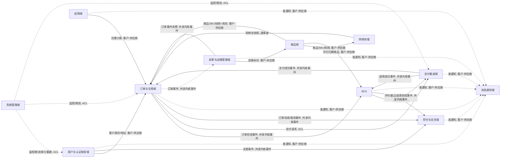

# 电商平台需求文档总览与 DDD 架构

**文档版本**：V2.5
**技术栈基准**：.NET 10、EF Core、DDD、CQRS、RESTful API、消息队列、事件总线、gRPC、Consul KV、Helm
**集成组件**：Swagger、Redis、Elasticsearch、JWT、OAuth2、微信支付、支付宝、邮件（SMTP）、短信、Consul、Prometheus、Grafana、Alertmanager
**创建日期**：2026-07-09
**最近更新**：2026-07-19（V2.5 同步 M1–M6 架构决策）

本文档是电商平台需求文档集的入口与纲领。它定义系统范围、用户角色、DDD 战略设计（限界上下文、上下文映射、共享内核、统一语言）以及各层架构规范，并为各限界上下文的需求文档建立索引。V2.4 引入积分与会员体系、支付集成、消息通知集成三个限界上下文与按角色模块独立部署的架构约束；V2.5 同步 M1–M6 阶段已落地的架构决策：事件契约分离（M1）、Internal API 版本治理（M4.2）、gRPC 决策（M4.3）、Consul KV 配置中心（M5.2）、Helm Chart 部署（M5.4）、可观测性增强（M5.1 + M5.3）、CQRS Query Handler 与网关 BFF 聚合层（M6）。各上下文的详细功能点、聚合设计、领域事件、API 与验收标准见独立文档。

## 1 项目背景与目标

平台定位为高可用、可扩展的标准 B2C 电商平台，覆盖商品浏览、购物车、订单交易、用户管理、促销运营、售后、积分会员与支付通知全链路。业务逻辑通过 DDD 实现领域模型与数据模型分离；读写分离（CQRS）让 Command 侧保证一致性、Query 侧优化复杂检索；跨聚合操作由消息队列与事件总线保障最终一致性；高并发场景以 Redis 缓存与 Elasticsearch 搜索承载；安全标准化采用 JWT 无状态认证与 OAuth2 社交登录；支付通过独立的支付集成域对接微信支付与支付宝，渠道参数由配置中心注入；邮件与短信通知通过消息通知域统一收口，外部服务商参数同样配置化；积分与会员体系以独立限界上下文承载，与订单、评价、促销联动。

核心目标拆解为八项：业务规则内聚于领域层、读写职责物理分离、跨聚合事件最终一致、热点数据缓存与高性能检索、认证授权标准化、外部能力（支付/通知）配置驱动且可替换、积分会员体系与交易主链路解耦、按角色使用的系统模块可独立部署互不影响。

## 2 系统范围与用户角色

平台涉及四类参与方，各自的职责边界与典型操作如下表。角色之间的数据隔离与权限差异在各自上下文文档中细化。角色与可独立部署模块的对应关系见 `10-模块化部署架构.md`。

| 角色 | 职责边界 | 典型操作 |
|-|-|-|
| 买家 | 个人消费侧，关注浏览、下单、售后、积分会员 | 商品搜索、加入购物车、创建订单、支付、申请售后、评价、签到领积分、查看会员等级 |
| 卖家（商家） | 店铺经营侧，管理商品与履约 | 发布商品、库存管理、订单发货、查看店铺订单与售后 |
| 运营管理员 | 平台经营侧，治理商家与活动 | 商品审核、商家管理、优惠券发放、促销配置、积分规则配置、数据看板 |
| 系统管理员 | 技术运维侧，保障系统稳定 | 角色权限、接口限流、消息重试、索引重建、支付/通知渠道参数配置、日志监控 |

## 3 DDD 战略设计

### 3.1 限界上下文划分

限界上下文是领域模型的显式边界，每个上下文内部拥有独立的聚合、统一语言与持久化模型。平台划分为十一个限界上下文，核心域六个、支撑域三个、通用子域两个。

| 编号 | 限界上下文 | 类型 | 核心职责 | 对应文档 |
|-|-|-|-|-|
| BC1 | 用户与认证授权域 | 核心 | 账户生命周期、身份认证、权限授权、收货地址 | `01-用户与认证授权域.md` |
| BC2 | 商品域 | 核心 | SPU/SKU 建模、分类品牌、商品审核、搜索索引 | `02-商品域.md` |
| BC3 | 购物车域 | 核心 | 购物车聚合、匿名与登录合并、价格实时计算 | `03-购物车域.md` |
| BC4 | 订单与交易域 | 核心 | 订单聚合、状态机、库存预占与扣减、发起支付请求 | `04-订单与交易域.md` |
| BC5 | 促销域 | 核心 | 优惠券、限时秒杀、满减折扣 | `05-促销域.md` |
| BC6 | 评价与售后域 | 核心 | 商品评价、退货退款售后单、发起退款请求 | `06-评价与售后域.md` |
| BC7 | 积分与会员域 | 支撑 | 积分账户、成长值与会员等级、付费会员、积分流水、任务中心 | `07-积分与会员域.md` |
| BC8 | 支付集成域 | 支撑 | 支付单、微信/支付宝渠道适配、退款、回调验签、对账 | `08-支付集成域.md` |
| BC9 | 消息通知域 | 通用子域 | 通知模板、邮件/短信渠道适配、发送记录、重试 | `09-消息通知集成.md` |
| BC10 | 卖家与店铺管理域 | 支撑 | 卖家入驻审核、店铺信息与资质管理、店铺状态管理 | `11-卖家与店铺管理域.md` |
| BC11 | 系统管理域 | 通用子域 | 数据看板统计、死信队列管理、索引重建、审计日志聚合、接口限流配置、系统健康监控 | `12-系统管理域.md` |

### 3.2 上下文映射

上下文之间的协作关系决定了集成方式。下图展示各上下文的依赖方向与集成模式，订单域仍是交易枢纽，积分域与支付域作为支撑域围绕交易主链路。



各集成关系说明：

- **用户域 → 订单域**：订单创建时以快照方式固化买家身份与收货地址，采用客户-供应商关系。
- **商品域 → 购物车/订单域**：商品基础信息、SKU 价格与可售库存由商品域权威持有，下游通过快照或查询接口获取。
- **购物车域 → 订单域**：购物车为订单提供行项来源，转化后购物车清空已下单项。
- **促销域 → 订单域**：促销域提供优惠计算能力，订单域在结算时调用其应用服务。
- **订单域 → 评价与售后域**：订单完成或售后触发后，通过领域事件驱动评价与售后流程。
- **订单域 ⇄ 支付集成域**：订单域通过防腐层向支付集成域发起支付请求，支付集成域对接微信/支付宝并返回支付结果事件，订单域不直接持有任何渠道 SDK。售后退款由评价与售后域经防腐层请求支付集成域执行。
- **订单/评价/用户域 → 积分与会员域**：订单售后期结束发放消费积分、订单取消释放冻结积分或扣回已发放积分、退款扣回积分、评价审核通过发放积分、用户注册发放新人积分，全部经集成事件异步驱动，积分域不被主链路同步阻塞。
- **各域 → 消息通知域**：通知为通用子域，各上下文通过 `INotificationService` 同步发送或发布通知请求事件异步发送，通知渠道参数配置化。

### 3.3 共享内核

跨上下文共享的最小概念集合，避免重复建模与语义漂移。共享内核仅包含货币、金额、基础标识、事件契约与外部能力配置抽象，变更需所有上下文协商一致。

| 共享概念 | 说明 |
|-|-|
| `Money` 值对象 | 金额与币种，四舍五入到两位小数，所有上下文统一货币运算 |
| 身份标识 | 用户ID、商品ID、SKU ID、订单ID、支付单ID 采用 GUID，跨上下文以 ID 引用而非对象引用 |
| 集成事件契约 | 跨上下文事件（如 `OrderPaidIntegrationEvent`、`PaymentSucceededIntegrationEvent`）的命名与字段约定，定义在共享层 |
| 审计字段 | 创建时间、更新时间、操作人，由基础设施层统一填充 |
| `IExternalChannelOptions` 配置抽象 | 支付渠道、邮件、短信等外部能力参数的统一配置契约，具体实现由各集成域的基础设施层从配置中心读取，领域层与应用层只见接口 |
| `IFileStorageService` 文件存储抽象 | 文件上传、下载、删除、URL 校验的统一契约，定义在共享内核。基础设施层提供 `LocalFileStorageService`（默认，本地磁盘）与 `ObjectStorageService`（MinIO/OSS 对象存储）两种实现，由配置决定采用哪种。所有上下文的文件存储功能（用户头像、商品图片、评价图片、售后凭证、资质证照等）统一通过此抽象实现 |

### 3.4 统一语言术语表

统一语言贯穿代码、文档与沟通，避免同义词混用。下表收录跨上下文核心术语，各上下文专属术语见各自文档。

| 术语 | 英文 | 定义 |
|-|-|-|
| 标准化产品单元 | SPU | 一类商品的标准化抽象，如"某品牌某型号手机" |
| 库存量单位 | SKU | SPU 下可售卖的最小规格单元，如"黑色 256G 版" |
| 聚合根 | Aggregate Root | 聚合的对外入口，唯一持有外部引用权 |
| 领域事件 | Domain Event | 上下文内部已发生的重要业务事实 |
| 集成事件 | Integration Event | 跨上下文传递的事件，经事件总线发布 |
| 预占库存 | Pre-occupied Stock | 下单时锁定但未真实扣减的库存 |
| 真实库存 | Physical Stock | 实际可售库存，支付成功后扣减 |
| 积分 | Points | 平台内可赚可花的虚拟权益，100 积分 = 1 元 |
| 成长值 | Growth Value | 仅用于会员等级评定的不可消耗指标 |
| 会员等级 | Member Level | 基于近 12 个月成长值的免费等级 V0–V4 |
| 付费会员 | Paid Member | 年费制高级身份，与免费等级并行、权益叠加 |
| 支付单 | Payment Order | 支付集成域对接渠道的独立单据，与订单一对多或一对一 |

## 4 DDD 分层架构规范

严格遵循依赖倒置原则，编译时依赖从外向内指向领域核心，运行时由外层调用内层。各层职责与规范如下，所有上下文一致遵守。

### 4.1 领域层

封装核心业务规则、不变量与领域事件，是系统心脏，独立于技术细节。包含实体、值对象、聚合、领域服务、仓储接口与领域事件。领域层不引用基础设施层、应用层、表现层的任何类型；仓储接口以 `I{聚合根名}Repository` 命名并定义在本层；领域对象方法应是行为意图明确的，避免 get/set 式贫血模型；聚合根通过构造函数或工厂方法保证创建时即处于有效状态。

### 4.2 应用层

协调领域对象完成用户用例，本身很薄，不含业务规则，只做任务编排、事务管理、输入验证、安全认证、事件发布。包含应用服务、DTO、命令/查询对象。应用服务方法名体现用例（如 `PlaceOrderAsync`）；事务边界由应用服务通过 UnitOfWork 控制；需要发邮件、推送、发起支付等外部副作用时依赖基础设施层抽象接口而非具体实现，外部能力参数由配置注入；禁止将领域实体直接暴露给表现层。

### 4.3 基础设施层

实现领域层定义的抽象接口，提供具体技术能力，包含仓储实现、工作单元实现、消息发布、缓存、文件存储、支付渠道适配、通知渠道适配等。基础设施层依赖领域层抽象并实现它们，可依赖 EF Core、Redis 客户端、微信支付/支付宝 SDK、SMTP 客户端、短信服务商 SDK 等具体框架；DbContext、渠道客户端等实现细节仅在本层可见；按 `Persistence`、`Messaging`、`Caching`、`Storage`、`Payment`、`Notification` 等子目录组织。文件存储通过共享内核 `IFileStorageService` 抽象统一实现（见第 4.9 节），默认本地磁盘存储，可配置切换为对象存储（MinIO/OSS）。外部渠道参数从配置中心或 `appsettings.json` 读取并注入适配器实例，更换服务商只改配置不改代码。

### 4.4 表现层

接收用户输入，调用应用层服务，返回响应。控制器不包含业务逻辑或数据访问代码，只做接收请求、调用应用服务、返回结果；接口采用 RESTful 风格；输入输出一律使用 DTO。表现层按角色拆分为独立部署单元（买家端、卖家端、运营端、系统管理端），各端只暴露该角色所需的 API 子集，详见 `10-模块化部署架构.md`。

### 4.5 聚合设计原则

聚合边界以一致性为依据：单次事务只修改一个聚合，跨聚合协作通过领域事件异步完成。聚合根是唯一入口，外部对象只能持有聚合根引用，不可直接引用内部实体。聚合内不变量由聚合根方法保证，避免在应用层散落校验逻辑。大聚合应拆分，将高频独立变更的部分独立为聚合。

### 4.6 领域事件与集成事件

领域事件在聚合方法中产生、在当前上下文内消费，用于解耦聚合内部逻辑。集成事件跨上下文传递，经事件总线发布订阅。为保证本地事务与事件发布原子性，采用发件箱模式：聚合保存与事件记录在同一事务写入，后台进程轮询发件箱表并发布到消息队列，消费失败进入死信队列并重试。积分发放、支付结果、通知发送等跨域副作用一律走集成事件，主交易链路不等待其完成。

#### 4.6.1 事件契约分离（M1 落地）

历史版本中存在大量"双身份事件"——同一事件类型同时承担领域事件与集成事件两种角色，导致事件结构耦合、跨上下文契约难以独立演进。M1 完成事件契约分离改造：

- **集成事件统一基类**：所有集成事件继承 `IntegrationEventBase`，携带 `EventId`（事件唯一标识）、`OccurredAt`（发生时间）、`IdempotencyKey`（幂等键）、`SchemaVersion`（事件 schema 版本）四个标准字段，由基类统一提供，派生类只关心业务字段。
- **物理位置**：集成事件统一存放于 `Leno.SharedContracts/Events/` 目录，按 BC 分文件组织（如 `OrderEvents.cs`、`PromotionEvents.cs`、`PointsMembershipEvents.cs` 等），便于跨 BC 协商与契约扫描。
- **职责隔离**：集成事件不实现 `IDomainEvent`，域事件不实现 `IIntegrationEvent`。跨上下文发布的事件必须经翻译器（`IIntegrationEventMapper<TDomainEvent>`）由领域事件翻译为集成事件后发布到消息总线，禁止领域事件直接发布到总线。
- **双发期 1 周**：分离期间同时发布旧双身份事件与新分离事件，消费端按批次迁移，1 周后下线旧双身份事件。

### 4.7 CQRS 与最终一致性

Command 侧使用 EF Core 写库（SQL Server/PostgreSQL），保证 ACID；Query 侧直接查询 Elasticsearch 读库，可辅以 Redis 缓存。写库变更通过事件总线同步到读库。库存预占等强一致操作在 Command 侧以 Redis Lua 脚本原子完成；订单超时取消、积分清零、会员等级刷新等延迟与定时任务由 MQ 延迟消息或调度器驱动。

#### 4.7.1 CQRS Query Handler 与 BFF 聚合层（M6 落地）

M6 在既有 CQRS 基础设施上完成读侧职责分离与网关聚合层落地：

- **ES 读模型同步基类扩展**：`ReadModelSyncConsumerBase<TEvent, TReadModel>` 新增 `BuildDeleteActionAsync` 虚方法（默认返回 null，向后兼容），支持"事件触发删除读模型"场景。删除失败抛 `InvalidOperationException` 触发 MassTransit 重试与死信队列，与索引分支错误处理策略保持一致。
- **3 BC 新建读模型与同步 Consumer**：Promotion、PointsMembership、SellerShop 三个 BC 新建 5 个 ES 读模型（SeckillActivity/Coupon/PointsAccount/Member/ShopDashboard）与 11 个同步 Consumer，订阅各自 BC 与跨 BC 集成事件，增量聚合到 ES 索引供前台快速检索。
- **IQueryHandler 接口 + DI 注册**：新建 `IQueryHandler<TQuery, TResult>` 通用接口与 `AddQueryHandler<TQuery, TResult, THandler>` DI 扩展方法，**不引入 MediatR**，通过 DI 容器解析即可。QueryHandler 位于 Application 层，走 ES 读模型或只读仓储，禁止调用 `SaveChangesAsync` 与发布领域事件。
- **3 BC 新建 Query + Handler**：Product（ProductSearchQuery/ProductDetailQuery）、Order（OrderListQuery/OrderDetailQuery/LogisticsTraceQuery）、SellerShop（ShopDashboardQuery）共 6 个 Query + Handler。双发期 2 周：QueryHandler 与既有 AppService 查询方法并存，AppService 查询方法标记 `[Obsolete]`，2 周后 Controller 切换到 QueryHandler 并移除 Obsolete 方法。
- **网关 BFF 聚合层**：网关新建 `Bff/` 目录与 4 个聚合端点（`/api/bff/order-detail`、`/api/bff/product-detail`、`/api/bff/cart-checkout-preview`、`/api/bff/seller-dashboard`）。使用 `Parallel.ForEachAsync` 并行调用下游 BC，单次调用超时 3 秒，部分下游失败时返回 `partial: true` + 错误明细，避免单点故障导致整端点不可用。

### 4.8 外部能力配置驱动

支付渠道（微信支付、支付宝）与通知渠道（邮件 SMTP、短信服务商）属于可替换的外部能力。各集成域在领域层定义渠道抽象接口（如 `IPaymentChannel`、`INotificationChannel`），基础设施层提供具体适配器实现，适配器所需参数（商户号、密钥、AppID、SMTP 主机、短信 API Key 等）从配置中心或 `appsettings.json` 注入。切换或新增服务商只需新增适配器实现并改配置，不触动领域层与应用层。

### 4.9 文件存储抽象

文件存储（用户头像、商品图片、评价图片、售后凭证、店铺 Logo、资质证照等）是跨上下文的通用能力，统一通过共享内核定义的 `IFileStorageService` 抽象实现，各上下文不自行实现文件存储逻辑。

```csharp
// 共享内核
public interface IFileStorageService
{
    /// 上传文件，返回可访问的 URL
    Task<FileUploadResult> UploadAsync(Stream stream, string fileName, string contentType, string category, CancellationToken ct = default);
    /// 下载文件
    Task<Stream> DownloadAsync(string fileUrl, CancellationToken ct = default);
    /// 删除文件
    Task DeleteAsync(string fileUrl, CancellationToken ct = default);
    /// 校验 URL 是否为合法的存储服务 URL
    bool ValidateUrl(string fileUrl);
    /// 校验文件是否存在
    Task<bool> ExistsAsync(string fileUrl, CancellationToken ct = default);
}

public record FileUploadResult(string Url, long Size, string ContentType);
```

基础设施层提供两种实现，由配置决定采用哪种：

- **`LocalFileStorageService`（默认实现）**：文件存储到本地磁盘，适用于开发环境与中小规模部署。配置项包括 `BasePath`（存储根目录）、`BaseUrl`（公开访问基址）、`MaxFileSize`（单文件上限，默认 10MB）。
- **`ObjectStorageService`（对象存储实现）**：对接 MinIO 或阿里云 OSS，适用于生产环境与大规模部署。配置项包括 `Provider`（`MinIO`/`AliyunOSS`）、`Endpoint`、`AccessKey`、`SecretKey`、`BucketName`、`PublicUrl`，敏感参数（AccessKey/SecretKey）存于配置中心或环境变量，不落代码仓库。

配置示例：

```json
{
  "FileStorage": {
    "Provider": "Local",
    "Local": {
      "BasePath": "/data/uploads",
      "BaseUrl": "https://cdn.example.com/uploads",
      "MaxFileSize": 10485760
    },
    "ObjectStorage": {
      "Provider": "MinIO",
      "Endpoint": "minio.internal:9000",
      "AccessKey": "",
      "SecretKey": "",
      "BucketName": "ecommerce-files",
      "PublicUrl": "https://cdn.example.com"
    }
  }
}
```

各上下文在应用层依赖 `IFileStorageService` 接口，由 DI 容器根据配置注入对应实现。文件上传走独立端点（如 `POST /api/files/upload`，带 `category` 参数区分头像/商品图片/评价图片/资质证照等），返回 URL 后再提交业务请求。基础设施层按 `Storage` 子目录组织，实现细节仅在本层可见。

## 5 跨上下文领域事件清单

下表汇总各上下文对外发布的关键事件，作为事件总线契约的索引。事件命名统一为过去时，字段以业务语义为准。

| 事件 | 发布方 | 消费方 | 触发时机与用途 |
|-|-|-|-|
| `UserRegisteredEvent` | 用户域 | 积分域/消息通知域 | 注册成功，发放新人积分、发送欢迎通知 |
| `ProductPublishedEvent` | 商品域 | 卖家域/商品域读模型（ES） | 商品审核通过上架，卖家域店铺商品数加一、同步 ES 索引 |
| `ProductUpdatedEvent` | 商品域 | 商品域读模型（ES）/购物车域 | 商品信息变更，更新 ES 索引、刷新购物车项展示快照 |
| `ProductTakenDownEvent` | 商品域 | 购物车域/卖家域/商品域读模型（ES） | 商品下架，购物车标记失效项、卖家域店铺商品数减一、ES 索引移除 |
| `OrderCreatedEvent` | 订单域 | 购物车/促销/库存/卖家/消息通知域 | 订单创建，清空购物车已下单项、预占库存、设置超时取消、卖家域店铺订单数加一、发送下单通知 |
| `OrderPaidEvent` | 订单域 | 库存/促销/积分域/卖家/消息通知域 | 支付成功，扣减真实库存、核销优惠券、正式扣减冻结积分、通知卖家发货、发送支付成功通知 |
| `OrderCancelledEvent` | 订单域 | 库存/促销/积分域/卖家/消息通知域 | 订单取消，释放预占库存、退还优惠券、释放冻结积分或扣回已发放积分、卖家域店铺订单数调整、发送取消通知 |
| `OrderCompletedEvent` | 订单域 | 评价域/积分域/卖家域 | 订单完成（确认收货），开放评价入口、积分域标记待发积分状态、卖家域累计经营概览、设置售后期结束延迟消息（不直接发积分） |
| `OrderAfterSalesWindowClosedEvent` | 订单域 | 积分与会员域 | 售后期结束，发放消费返积分与成长值（携带 PaidAmount） |
| `SeckillOrderCreatedEvent` | 促销域 | 订单域/库存/消息通知域 | 秒杀订单异步创建成功，订单域落单、消息通知域发送秒杀成功通知 |
| `PaymentRequestedIntegrationEvent` | 订单域 | 支付集成域 | 订单请求发起支付，支付集成域创建支付单并对接渠道 |
| `RefundRequestedIntegrationEvent` | 评价与售后域 | 支付集成域 | 售后退款审核通过，请求支付集成域执行退款 |
| `PaymentSucceededIntegrationEvent` | 支付集成域 | 订单域 | 渠道支付成功回调确认，订单域标记已支付 |
| `PaymentFailedIntegrationEvent` | 支付集成域 | 订单域 | 支付失败，订单域关单或保持待支付 |
| `RefundSucceededIntegrationEvent` | 支付集成域 | 评价与售后域 | 退款成功，售后单流转到退款完成 |
| `PointsEarnedEvent` | 积分域 | 消息通知域（可选） | 积分入账，可选发送到账通知 |
| `PointsConsumedEvent` | 积分域 | 积分域内部/消息通知域 | 积分消耗（抵现/兑换/抽奖），更新账户余额、可选发送消耗通知 |
| `PointsRevertedEvent` | 积分域 | 积分域内部 | 退款扣回积分，账户可为负，后续获取优先抵扣 |
| `MemberLevelChangedEvent` | 积分域 | 消息通知域 | 会员等级升降级，发送祝贺或保级提醒通知 |
| `PaidMemberSubscribedEvent` | 积分域 | 消息通知域 | 付费会员开通/续费，发送权益通知 |
| `PointsExchangeCouponRequestedEvent` | 积分域 | 促销域 | 用户以积分兑换优惠券，促销域校验并创建券实例 |
| `CouponExchangeSucceededEvent` | 促销域 | 积分域 | 积分换券成功，积分域正式扣减积分 |
| `ReviewApprovedEvent` | 评价域 | 积分域/消息通知域 | 评价审核通过，发放评价积分、发送评价通过通知 |
| `RefundCompletedEvent` | 评价与售后域 | 订单域/促销域/积分域/消息通知域 | 退款完成，回滚销量、退还优惠券、扣回积分、发送退款完成通知 |
| `ShopSuspendedEvent` | 卖家与店铺管理域 | 商品域/订单域/消息通知域 | 店铺暂停，商品域置店铺商品不可售、订单域阻止新单、通知卖家 |
| `ShopClosedEvent` | 卖家与店铺管理域 | 商品域/订单域/消息通知域 | 店铺关闭，商品域下架全部商品、订单域停止新单、通知卖家 |
| `ReviewHiddenEvent` | 评价与售后域 | 商品域/消息通知域 | 评价被运营隐藏，商品域更新评分摘要、通知用户 |
| `ReviewSubmittedEvent` | 评价与售后域 | 商品域 | 评价提交，回写商品评分摘要 |

## 6 非功能需求

### 6.1 性能与可用性

订单创建支持 1000 TPS，秒杀接口限流后支持 5000 QPS；95% 的 API 请求响应时间低于 500ms，复杂搜索低于 800ms。Redis 缓存热点数据（商品详情、库存预占、积分余额），以布隆过滤器防缓存穿透、随机过期时间防雪崩。异步消息使用 RabbitMQ/Kafka，通过死信队列与重试机制保障事件最终一致性。支付回调与通知发送均异步处理，不阻塞主交易。

### 6.2 安全性

JWT 有效期 2 小时，Refresh Token 有效期 7 天，OAuth2 以 state 参数防 CSRF。用户密码采用 bcrypt 哈希，敏感日志脱敏，支付回调验签。API 层通过 EF Core 参数化防 SQL 注入、XSS 过滤、基于 Redis 滑动窗口的请求频率限制。支付渠道密钥、短信/邮件 API Key 等敏感参数存于配置中心或环境变量，不落代码仓库，日志中脱敏输出。

#### 6.2.1 Consul KV 配置中心与 InternalApiKey 分治（M5.2 落地）

M5.2 将敏感配置统一收敛到 Consul KV 配置中心，并完成 InternalApiKey 分 BC 独立治理：

- **11 BC 独立 InternalApiKey**：废除全平台共用单一 InternalApiKey 的做法，11 个限界上下文各自持有独立 InternalApiKey，Consul KV 路径约定 `leno/security/internal-key/{bc}`（如 `leno/security/internal-key/order`、`leno/security/internal-key/product`）。任一 BC 密钥泄露不影响其余 BC。
- **调用方配置**：调用方在 `AntiCorruption:TargetInternalApiKeys` 字典中按 BC 名配置目标 BC 的 InternalApiKey，防腐层 HttpClient 在请求时注入 `X-Internal-Key` 头部，密钥本身不进入防腐层代码或日志。
- **启动期 fail-closed**：应用启动时执行 `ValidateSensitiveConfig` 校验所有必需的敏感配置项（数据库连接串、Redis 密码、JWT 签名密钥、InternalApiKey 等），缺失时 fail-closed 阻止启动。生产环境若 Consul 不可达降级为 warning 日志并继续启动（依赖本地缓存配置），但InternalApiKey 缺失仍 fail-closed。
- **配置热更新**：Consul KV 变更通过 watch 机制推送到各 BC，无需重启即可生效（InternalApiKey 轮换、数据库连接串切换等）。

### 6.3 可扩展性与维护

领域层聚合、值对象、领域事件独立演进；应用层命令查询处理器职责单一；基础设施层按持久化、消息、缓存、支付、通知分目录；接口层 REST API。Command 写库与 Query 读库物理分离，可独立扩缩容。事件总线 `IEventBus` 接口支持发布订阅，保证跨聚合解耦。支付与通知渠道通过适配器接口实现可替换，新增渠道不影响既有代码。

### 6.4 模块独立部署

不同角色使用的系统模块按限界上下文拆分为独立可部署单元，买家端、卖家端、运营端、系统管理端各自独立部署、独立扩缩容、独立发布，单一模块故障不波及其他角色。模块间通过集成事件异步通信与防腐层同步查询解耦，不共享数据库。详细拆分方案、网关路由与故障隔离策略见 `10-模块化部署架构.md`。

### 6.5 可观测性

结构化日志（Serilog）记录请求响应与事件处理耗时；`/health` 端点按模块分别检测 DB、Redis、ES、MQ、支付渠道、通知渠道状态；可选 OpenTelemetry 链路追踪跨模块串联；Prometheus + Grafana 采集各模块请求数、延迟、MQ 队列长度、支付成功率、通知送达率，错误率超 1% 触发告警。

#### 6.5.1 可观测性增强（M5.1 + M5.3 落地）

M5.1 与 M5.3 在既有可观测性基础上完成 metrics 全覆盖与告警闭环：

- **11 BC 暴露 Prometheus `/metrics` 端点**：所有限界上下文统一通过 `AddLenoObservability` 注册 Prometheus metrics 中间件，暴露 `/metrics` 端点供 Prometheus 抓取。关键指标包括 HTTP 请求计数/延迟分布、EF Core 查询耗时、MQ 队列长度、Redis 命中率、防腐层调用成功率等。
- **Outbox 指标**：`OutboxMetrics` 暴露 `outbox_pending_count`（Gauge，待发布事件数）与 `outbox_published_total`（Counter，累计已发布事件数）两个核心指标，用于监控发件箱积压与吞吐。积压超阈值即触发告警。
- **Alertmanager 告警闭环**：部署 Alertmanager 容器与 4 条核心告警规则：
  - **Outbox 积压告警**：`outbox_pending_count > 1000` 持续 5 分钟（事件发布器异常或下游消费阻塞）
  - **死信队列告警**：死信队列消息数 > 0 持续 1 分钟（消费失败需人工介入）
  - **防腐层失败率告警**：5 分钟内防腐层调用失败率 > 5%（下游 BC 不可达或契约不一致）
  - **服务宕机告警**：任一 BC `/health` 端点连续 3 次探测失败（实例宕机或网络分区）
- **告警通知**：Alertmanager 通过邮件/钉钉/飞书 webhook 推送告警，含告警名称、实例、阈值、当前值、Runbook 链接。

## 7 技术架构组件映射

| 需求/组件 | 技术实现 |
|-|-|
| Web 框架 | ASP.NET Core 10 Web API，RESTful + Swagger 文档，按角色拆分独立 API 项目 |
| ORM | EF Core 10（Code First，Repository 持久化聚合） |
| 写库（Command） | SQL Server 2019 / PostgreSQL，每个限界上下文独立 Schema 或独立库 |
| 读库（Query） | Elasticsearch 8.x + NEST，商品索引扁平化文档 |
| 缓存 | Redis，存储会话、临时购物车、库存预占、限流计数、积分余额 |
| 消息队列 | RabbitMQ + MassTransit，Topic Exchange + 死信队列 + 延迟队列 |
| 事件总线 | `IEventBus` 基于 MQ 发布订阅，处理领域事件与集成事件 |
| 搜索引擎 | Elasticsearch，`ik_smart` 中文分词 |
| 认证授权 | JWT + OAuth2（OpenIddict / AspNet.Security.OAuth.Providers） |
| 支付渠道 | 微信支付 SDK + 支付宝 SDK，`IPaymentChannel` 适配，参数配置化 |
| 邮件 | SMTP 客户端（MailKit），`IEmailChannel` 适配，参数配置化 |
| 短信 | 短信服务商 SDK（阿里云/腾讯云），`ISmsChannel` 适配，参数配置化 |
| 配置中心 | 环境变量 + `appsettings.json` + Consul KV（M5.2 落地，生产环境默认 Consul，敏感配置路径约定 `leno/security/{key}`） |
| 容器化 | Docker + docker-compose（开发环境）+ Helm Chart（M5.4 落地，生产环境 K8s） |
| 内部服务通信 | REST（`/internal/v1/` 前缀，M4.2 落地）+ gRPC（`leno.{bc}.v1` package，M4.3 落地，灰度开关 `AntiCorruption:UseGrpc`） |
| 文件存储 | `IFileStorageService` 抽象，默认 `LocalFileStorageService`（本地磁盘），可切换 `ObjectStorageService`（MinIO/阿里云 OSS），由 `FileStorage:Provider` 配置决定 |
| 可观测性 | Serilog 结构化日志 + Prometheus `/metrics`（M5.1 落地）+ Grafana 仪表盘 + Alertmanager 告警闭环（M5.3 落地，4 条核心告警规则） |

## 8 API 设计规范

接口采用 RESTful 风格，资源以名词复数命名，动作通过 HTTP 方法表达。统一响应结构包含 `code`、`message`、`data` 三段；分页响应包含 `items`、`total`、`page`、`pageSize`。鉴权通过 `Authorization: Bearer {token}` 头传递。各上下文的具体端点见各自文档的 API 章节。

通用约束：列表查询默认分页（page 从 1 开始，pageSize 默认 20、最大 100）；写操作返回创建或更新后的资源；幂等键通过 `Idempotency-Key` 头支持重复请求安全，支付回调与通知发送强制要求幂等键；时间字段统一 ISO 8601 UTC。各角色端 API 经独立网关暴露，跨端调用的内部服务走服务间直连或事件总线。

### 8.1 Internal API 版本治理（M4.2 落地）

BC 间同步调用走 Internal API，与面向终端用户的公开 API 隔离治理：

- **路由前缀**：11 条 internal 路由统一加 `/v1/` 版本前缀（如 `/internal/v1/products/skus/{skuId}`、`/internal/v1/orders/{orderId}/status`）。当前版本 v1，未来 v2 上线时保留 v1 双发期 ≥ 4 周。
- **双路由期**：新旧路由并存 1 周（旧无前缀路由 + 新 `/v1/` 路由），调用方按批次切换，1 周后下线旧路由。详细路由清单见 `docs/contracts/internal-api-contracts.md`。
- **gRPC 契约**：11 个 .proto 文件位于 `Leno.SharedContracts/Protos/`，package 命名 `leno.{bc}.v1`，服务名 `{BC}InternalService`，方法名采用动词前缀（如 `GetProductById`、`ValidateSellerOwnership`）。buf CLI 强制校验风格与向后兼容。
- **SchemaVersion 持久化**：`IntegrationEventBase.SchemaVersion` 字段持久化到 Outbox 表 `schema_version` 列，消费端按版本号兼容处理事件结构演进。
- **鉴权**：所有 internal 端点由 `InternalApiKeyMiddleware` 校验 `X-Internal-Key` 请求头，不经过 JWT 鉴权。11 BC 各自独立 InternalApiKey（M5.2 落地，详见 6.2.1 节）。

### 8.2 gRPC 决策（M4.3 落地）

M4.3 在 REST Internal API 之外补充 gRPC 通道，用于高频、强类型、低延迟的 BC 间同步调用：

- **服务端**：11 个 BC.Api 新增 `GrpcServices/` 目录，承载 `{BC}InternalService` gRPC 服务实现。gRPC 端口分配为 HTTP 端口 +100（如 UserAuth 5251、Product 5252、...、SystemAdmin 5261）。
- **客户端**：防腐层新建 `GrpcAntiCorruptionClientBase` 基类，封装 gRPC 调用 + Polly 策略链（重试 3 次指数退避 1s/2s/4s + 熔断 50%/30s + Timeout 10s），通过 `AddAntiCorruptionPolicies()` 链式注入。调用方按 BC 选择目标 InternalApiKey 注入 gRPC metadata。
- **灰度开关**：`AntiCorruption:UseGrpc` 配置项控制 REST/gRPC 切换，默认 `false`（走 REST）。按 3 批次灰度迁移：
  1. 高频防腐层（Order → Product/Promotion/PointsMembership）
  2. Cart/SellerShop 防腐层
  3. ReviewAfterSales/Notification/SystemAdmin 防腐层
- **错误映射**：gRPC 状态码统一映射为 `DomainException`：`Unavailable`/`DeadlineExceeded` → `{SERVICE}_UNAVAILABLE`（HTTP 503）；`Internal` → `{SERVICE}_REMOTE_FAILED`（HTTP 502）；`InvalidArgument` → `{SERVICE}_INVALID_ARGUMENT`（HTTP 400）。
- **与 REST 并存**：gRPC 不替换 REST Internal API，两者并行提供。REST 作为兼容与调试通道，gRPC 作为性能优化通道，由灰度开关切换。

## 9 部署与运维

环境配置基于 `appsettings.json` + 环境变量 + 配置中心，支持开发/测试/生产多环境。数据库迁移通过 EF Core Migrations 脚本化执行，各上下文迁移独立。消息队列启动时声明 Exchange、Queue、Binding 与死信 Exchange。ES 索引启动时检查存在性，缺失则创建并配置中文分词器。监控告警基于 Prometheus + Grafana。

模块按角色与限界上下文独立打包部署，单一模块可独立发布与回滚，详见 `10-模块化部署架构.md`。支付渠道与通知渠道参数通过配置中心热更新，无需重启即可切换服务商。

### 9.1 Helm Chart 部署（M5.4 落地）

M5.4 完成 Kubernetes 生产部署的 Helm Chart 标准化：

- **Umbrella Chart 结构**：`deploy/helm/leno/` 为 umbrella chart，含 12 个子服务完整定义（11 个 BC + 1 个 API 网关）。各服务独立 `values.yaml` 子配置，支持按环境（dev/staging/prod）覆盖。
- **HPA + 探针**：每个服务配置 HorizontalPodAutoscaler（CPU/内存阈值触发扩缩容）+ readiness probe（就绪后接流量）+ liveness probe（异常自动重启）。Probe 端点复用 `/health`，readiness 另含 DB/Redis/MQ 依赖检测。
- **Init Container 迁移 Job**：数据库迁移通过 Init Container 在应用启动前执行 EF Core Migrations，确保 schema 就绪后再启动业务容器。迁移 Job 与业务容器共享镜像，仅启动命令不同。
- **与 docker-compose 并存**：开发环境沿用 `docker-compose.yml`（轻量、快速启动），生产环境使用 Helm Chart（K8s 调度、HPA、滚动发布、ConfigMap/Secret 管理）。两者**二选一**，不强制统一。
- **配置注入**：非敏感配置通过 Helm `values.yaml` + ConfigMap 注入，敏感配置（InternalApiKey、数据库连接串、JWT 签名密钥等）通过 Secret 注入，Secret 内容由 Consul KV 同步生成（详见 6.2.1 节）。

## 10 文档索引

| 文档 | 内容 |
|-|-|
| `00-需求文档总览与DDD架构.md` | 本文档，战略设计与架构纲领 |
| `01-用户与认证授权域.md` | 账户、认证、授权、地址功能点 |
| `02-商品域.md` | SPU/SKU、分类品牌、审核、搜索功能点 |
| `03-购物车域.md` | 购物车聚合、匿名合并、价格计算功能点 |
| `04-订单与交易域.md` | 订单状态机、库存、支付请求、CQRS 流程功能点 |
| `05-促销域.md` | 优惠券、秒杀、满减功能点 |
| `06-评价与售后域.md` | 评价、退货退款售后、退款请求功能点 |
| `07-积分与会员域.md` | 积分账户、成长值等级、付费会员、任务中心功能点 |
| `08-支付集成域.md` | 支付单、微信/支付宝渠道适配、退款、对账功能点 |
| `09-消息通知集成.md` | 通知模板、邮件/短信渠道适配、发送记录功能点 |
| `10-模块化部署架构.md` | 角色模块独立部署、网关路由、故障隔离方案 |
| `11-卖家与店铺管理域.md` | 卖家入驻审核、店铺信息与资质、店铺状态管理功能点 |
| `12-系统管理域.md` | 数据看板、死信队列管理、索引重建、审计日志、限流配置、健康监控功能点 |
| `../contracts/internal-api-contracts.md` | 11 条 Internal API 路由清单（M4.2 落地）、鉴权约定、版本治理、错误响应 |
