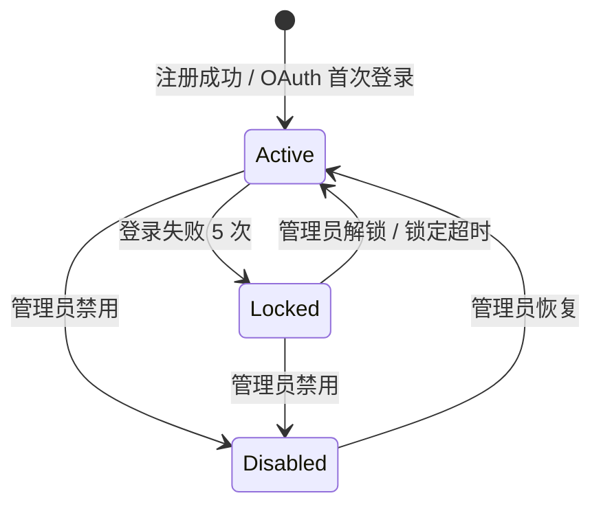
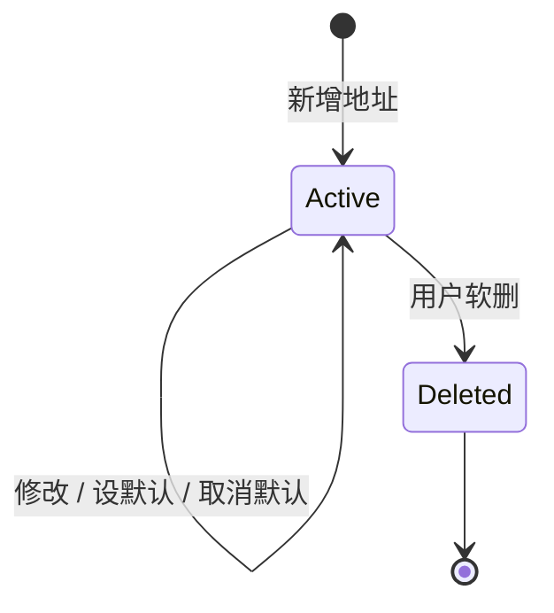
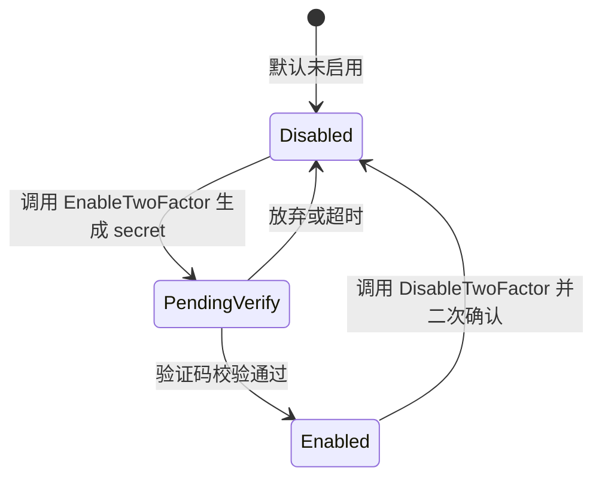

# 用户与认证授权域需求文档

**所属限界上下文**：BC1 用户与认证授权域
**版本**：V2.3
**创建日期**：2026-07-09

本域对应总览文档限界上下文表中的 BC1，覆盖账户生命周期、身份认证、权限授权与收货地址管理。文档遵循 `00-需求文档总览与DDD架构.md` 中定义的分层架构规范、共享内核约定与统一语言，并与该总览文档第 5 章的事件契约保持一致。本版对接积分与会员域（BC7）的新人积分发放与消息通知域（BC9）的欢迎通知，认证相关邮件/短信统一经消息通知域发送。

## 1 上下文概述

### 1.1 职责

本域是平台的身份中枢，承担四类职责：账户的创建与生命周期管理、本地与第三方的身份认证、基于策略的 RBAC 授权、收货地址簿维护。账户身份与角色是下游所有业务上下文的访问前提，收货地址是订单创建时的关键快照来源。

### 1.2 边界

本域内部包含两个聚合根：`User`（账户、凭证、角色、第三方登录、双因子配置、默认地址引用）与 `Address`（收货地址详情）。账户密码哈希、Token 签发、OAuth2 客户端交互属于本域的技术能力，由基础设施层实现。本域不负责商品、订单、促销等业务数据，仅以用户 ID 对外提供身份标识。

### 1.3 与其他上下文的关系

依据总览文档第 3.2 章的上下文映射，本域与各上下文的协作关系涵盖以下几类：

- 用户域 → 订单域（客户-供应商）：订单创建时以快照方式固化买家身份与收货地址，订单域为下游消费者，通过本域提供的查询接口或集成事件获取用户身份摘要。
- 用户域 → 积分与会员域（经集成事件）：注册成功后发布 `UserRegisteredEvent`，积分与会员域消费发放新人积分，关系参见总览文档第 5 章。
- 用户域 → 消息通知域（客户-供应商）：注册欢迎、密码找回验证码、登录异常、双因子等通知统一经消息通知域（BC9）的 `INotificationService` 发送，本域不直接持有邮件/短信渠道客户端。
- 用户域 → 购物车域：登录后以用户 ID 关联匿名购物车并合并，购物车域消费登录态完成归属转换。
- 用户域 → 评价与售后域：评价与售后单归属用户，以用户 ID 引用，不跨聚合持有对象。
- 用户域 → 全平台：JWT 中携带用户 ID 与角色声明，各上下文据此做权限校验。

### 1.4 事件契约引用

本域对外发布的集成事件遵循总览文档第 5 章约定，核心事件为 `UserRegisteredEvent`（注册成功，消费方为积分与会员域、消息通知域）。本域内部领域事件清单见本文档第 3 章。所有跨上下文事件经事件总线发布，采用发件箱模式保证本地事务与事件发布的原子性。

## 2 领域模型设计

本域严格遵循总览文档第 4 章与 DDD 最佳实践的分层规范：领域层封装聚合、值对象、领域服务、仓储接口与领域事件，不引用任何技术细节；应用层编排用例并控制事务；基础设施层实现 JWT、OAuth2、bcrypt 等技术能力；表现层只调用应用服务。

### 2.1 聚合与实体

本域设两个聚合根：`User` 与 `Address`。`Address` 作为独立聚合根，通过 `UserId` 反向引用所属用户；地址上限与默认地址唯一的不变量由领域服务 `AddressPolicy` 校验，应用层在编排时调用。`User` 聚合持有 `DefaultAddressId` 引用，避免跨聚合持有对象。

#### 2.1.1 User 聚合根

`User` 是账户身份的聚合根，封装凭证、角色、第三方登录与双因子配置。所有变更通过行为意图明确的方法完成，禁止外部直接 set 字段。

| 字段 | 类型 | 说明 | 约束 |
|-|-|-|-|
| Id | Guid | 用户唯一标识 | 主键，GUID，创建时生成 |
| Email | Email | 邮箱（值对象） | 全局唯一；OAuth 注册可空 |
| PhoneNumber | PhoneNumber | 手机号（值对象） | 全局唯一；E.164 格式 |
| PasswordHash | PasswordHash | 密码哈希（值对象） | bcrypt，cost ≥ 12；纯 OAuth 用户可空 |
| Nickname | string | 昵称 | 1–32 字符 |
| AvatarUrl | string? | 头像 URL | 可空，HTTPS |
| Roles | IReadOnlyCollection\<Role\> | 角色集合 | 至少 1 个；枚举 Buyer/Seller/Operator/Admin |
| ExternalLogins | IReadOnlyCollection\<ExternalLogin\> | 第三方登录绑定 | provider+providerUserId 全局唯一 |
| TwoFactorConfig | TwoFactorConfig? | 双因子配置（值对象） | 可空；启用后非空 |
| Status | AccountStatus | 账户状态 | 枚举 Active/Locked/Disabled |
| DefaultAddressId | Guid? | 默认地址标识 | 可空；引用 Address 聚合 |
| FailedLoginCount | int | 连续登录失败次数 | 阈值 5 触发锁定 |
| LockedUntil | DateTime? | 锁定截止时间 | UTC；锁定状态非空 |
| CreatedAt | DateTime | 创建时间 | UTC，基础设施层填充 |
| UpdatedAt | DateTime | 更新时间 | UTC，基础设施层填充 |

`User` 聚合方法（行为意图明确，避免贫血模型）：

- `Register(...)`：工厂方法，创建处于 Active 状态的账户，初始角色为 Buyer，附加 `UserRegisteredEvent`。
- `ChangePassword(oldPlain, newPlain, hasher)`：校验旧密码后写入新哈希，附加 `PasswordChangedEvent`。
- `VerifyPassword(plain, hasher)`：校验密码，失败时累加 `FailedLoginCount`，达阈值调用 `Lock`。
- `Lock(duration)`：置 Status 为 Locked 并设置 `LockedUntil`，附加 `AccountLockedEvent`。
- `Unlock()`：置 Status 为 Active 并清零 `FailedLoginCount` 与 `LockedUntil`。
- `Disable()`：置 Status 为 Disabled，附加 `AccountDisabledEvent`。
- `AssignRole(role, operatorId)`：增加角色，附加 `RoleAssignedEvent`。
- `RevokeRole(role, operatorId)`：移除角色；禁止移除最后一个角色，禁止管理员自删角色。
- `BindExternalLogin(externalLogin)`：绑定第三方账号，附加 `ExternalLoginBoundEvent`。
- `UnbindExternalLogin(provider)`：解绑，要求至少保留一种登录方式，附加 `ExternalLoginUnboundEvent`。
- `EnableTwoFactor(method, secret)`：写入双因子配置（未验证态）。
- `ConfirmTwoFactor(code, verifier)`：验证通过后标记已验证，附加 `TwoFactorEnabledEvent`。
- `DisableTwoFactor(code, verifier)`：校验后清空配置，附加 `TwoFactorDisabledEvent`。
- `UpdateProfile(nickname, avatarUrl)`：更新资料，附加 `ProfileUpdatedEvent`。
- `SetDefaultAddress(addressId)`：更新默认地址引用，附加 `DefaultAddressChangedEvent`。
- `RecordLogin(ip, userAgent)`：登录成功后清零失败计数，附加 `UserLoggedInEvent`。

#### 2.1.2 Address 聚合根

`Address` 封装收货地址详情，是订单地址快照的来源。

| 字段 | 类型 | 说明 | 约束 |
|-|-|-|-|
| Id | Guid | 地址唯一标识 | 主键，GUID |
| UserId | Guid | 所属用户标识 | 非空，引用 User |
| RecipientName | string | 收件人姓名 | 1–32 字符 |
| RecipientPhone | PhoneNumber | 收件人手机号（值对象） | E.164 格式 |
| Province | string | 省/直辖市 | 非空 |
| City | string | 市 | 非空 |
| District | string | 区/县 | 非空 |
| Detail | string | 详细地址 | 5–200 字符 |
| Tag | string? | 标签（如"家""公司"） | 可空，≤8 字符 |
| IsDefault | bool | 是否默认 | 同一用户下唯一为 true |
| Status | AddressStatus | 地址状态 | 枚举 Active/Deleted |
| CreatedAt | DateTime | 创建时间 | UTC |
| UpdatedAt | DateTime | 更新时间 | UTC |

`Address` 聚合方法：

- `Create(...)`：工厂方法，创建 Active 状态地址，附加 `AddressAddedEvent`。
- `UpdateInfo(recipientName, phone, province, city, district, detail, tag)`：更新可变字段，附加 `AddressUpdatedEvent`。
- `MarkAsDefault()`：置 `IsDefault = true`。
- `UnmarkDefault()`：置 `IsDefault = false`。
- `SoftDelete()`：置 Status 为 Deleted，附加 `AddressRemovedEvent`。

#### 2.1.3 值对象

值对象无唯一标识，通过属性值判断相等性，不可变。

##### Email

| 字段 | 类型 | 说明 | 约束 |
|-|-|-|-|
| Value | string | 邮箱地址 | RFC 5322 格式；存储前转小写 |

##### PhoneNumber

| 字段 | 类型 | 说明 | 约束 |
|-|-|-|-|
| Value | string | 手机号 | E.164 格式，含国家码（如 +86） |

##### PasswordHash

| 字段 | 类型 | 说明 | 约束 |
|-|-|-|-|
| Hash | string | 哈希值 | bcrypt 输出 |
| Algorithm | string | 算法标识 | 固定 "bcrypt" |

##### Role

| 字段 | 类型 | 说明 | 约束 |
|-|-|-|-|
| Value | string | 角色标识 | Buyer/Seller/Operator/Admin |

在 `User` 聚合内 `Role` 仅承载角色标识，用于 Token 角色声明与基础判断。权限策略管理（FR-21）将 `Role` 建模为独立实体承载权限资源绑定，关键字段如下：

| 字段 | 类型 | 说明 | 约束 |
|-|-|-|-|
| Id | Guid | 角色标识 | 主键，GUID |
| Code | string | 角色编码 | 内置编码 Buyer/Seller/Operator/Admin 或自定义编码；内置编码不可改 |
| Name | string | 角色名称 | 2–32 字符，全局唯一 |
| IsBuiltIn | bool | 是否系统内置角色 | 内置角色不可删除，可编辑权限绑定 |
| Permissions | IReadOnlyCollection\<Permission\> | 权限资源标识列表 | 元素格式"资源类型:资源标识"，如 `api:/api/admin/products`、`ui:product:force-take-down` |
| Enabled | bool | 是否启用 | 停用后不再授予新权限，已签发 Token 不受影响 |
| CreatedAt | DateTime | 创建时间 | UTC |
| UpdatedAt | DateTime | 更新时间 | UTC |

`Permission` 为值对象，由 `ResourceType`（api/ui）与 `Resource`（资源标识）构成；`IRoleRepository` 负责角色的持久化与权限绑定查询。角色与权限绑定变更（FR-21）在事务内经审计中间件写入 `AuditLog`；`AuditLog` 仅用于事务内写入，本域不对外暴露审计日志查询 API，跨域审计日志聚合查询统一由 BC11 系统管理域 F-SYS-009 承载。

##### ExternalLogin

| 字段 | 类型 | 说明 | 约束 |
|-|-|-|-|
| Provider | string | 提供商 | WeChat/Alipay/Google |
| ProviderUserId | string | 提供商侧用户标识 | 非空 |
| UnionId | string? | 联合标识（微信 UnionId） | 可空 |

##### TwoFactorConfig

| 字段 | 类型 | 说明 | 约束 |
|-|-|-|-|
| Method | string | 双因子方式 | TOTP/SMS |
| Secret | string? | TOTP 密钥 | TOTP 方式非空，加密存储 |
| Verified | bool | 是否已验证启用 | 未验证不生效 |

#### 2.1.4 AuditLog 实体

`AuditLog` 记录管理员关键操作的不可变审计记录，只读追加，由审计中间件在各管理操作的应用服务事务内写入，不可修改不可删除。`AuditLog` 仅用于事务内写入，本域不对外暴露审计日志查询 API；跨域审计日志聚合查询统一由 BC11 系统管理域 F-SYS-009 承载。

| 字段 | 类型 | 说明 | 约束 |
|-|-|-|-|
| Id | Guid | 日志标识 | 主键，GUID |
| OperatorId | Guid | 操作人标识 | 引用 User |
| Action | string | 操作类型 | 枚举（UserBan/UserUnban/AccountDisable/RoleAssign/RoleRevoke/PermissionChange/OAuthClientUpdate 等） |
| ResourceType | string | 目标资源类型 | 非空（如 User/Role/OAuthClient） |
| ResourceId | string? | 目标资源标识 | 可空（列表类操作无具体资源） |
| BeforeSnapshot | string? | 操作前快照 | JSON，可空 |
| AfterSnapshot | string? | 操作后快照 | JSON，可空 |
| OperatedAt | DateTime | 操作时间 | UTC |
| Ip | string? | 操作来源 IP | 可空 |
| UserAgent | string? | 操作来源 UA | 可空 |

`IAuditLogRepository` 提供 `AddAsync`（事务内写入审计记录）写入方法与 `QueryAsync`（按操作人/操作类型/时间区间/资源类型筛选分页）、`GetByIdAsync`（详情）查询方法；审计日志仅追加写入，不提供更新与删除方法。本域不对外暴露审计日志查询 HTTP API，`QueryAsync`/`GetByIdAsync` 仅作为内部查询接口供 BC11 系统管理域（F-SYS-009）跨域只读聚合调用。

### 2.2 领域服务

领域服务处理无法归入单一聚合的领域逻辑，接口与实现均在领域层。

- `IExternalAuthService`：协调外部认证结果与本地账户绑定。
  - `FindUserByExternalLoginAsync(ExternalLogin login)`：按第三方标识查找已绑定用户。
  - `CreateUserFromExternalAsync(ExternalLogin login, ExternalUserProfile profile)`：首次第三方登录时创建本地账户（无密码，角色 Buyer）。
  - `LinkExternalLoginAsync(Guid userId, ExternalLogin login)`：为已登录用户绑定第三方账号，校验该 provider+providerUserId 未被其他用户占用。

- `IAddressPolicy`：保证地址相关跨聚合不变量。
  - `EnsureWithinLimitAsync(Guid userId)`：校验用户地址数未达上限（20）。
  - `EnsureSingleDefaultAsync(Guid userId)`：校验设默认地址前清掉原有默认。

- `IPasswordHasher`：密码哈希与校验的领域抽象，实现在基础设施层。
  - `Hash(string plainPassword)`：返回 `PasswordHash`。
  - `Verify(string plainPassword, PasswordHash hash)`：返回布尔。

- `ITokenVerifier`：双因子验证码校验抽象，实现在基础设施层。
  - `VerifyTotp(string code, string secret)`：校验 TOTP 6 位码。
  - `VerifySms(string code, string expected)`：校验短信验证码。

### 2.3 仓储接口

仓储接口定义在领域层，命名遵循 `I{聚合根名}Repository`，由基础设施层实现（如 `EfCoreUserRepository`）。

```csharp
// 领域层
public interface IUserRepository
{
    Task<User?> GetByIdAsync(Guid id, CancellationToken ct = default);
    Task<User?> GetByEmailAsync(Email email, CancellationToken ct = default);
    Task<User?> GetByPhoneNumberAsync(PhoneNumber phone, CancellationToken ct = default);
    Task<User?> GetByExternalLoginAsync(ExternalLogin login, CancellationToken ct = default);
    Task AddAsync(User user, CancellationToken ct = default);
    Task UpdateAsync(User user, CancellationToken ct = default);
}

public interface IAddressRepository
{
    Task<Address?> GetByIdAsync(Guid id, CancellationToken ct = default);
    Task<IReadOnlyList<Address>> GetActiveByUserIdAsync(Guid userId, CancellationToken ct = default);
    Task<int> CountActiveByUserIdAsync(Guid userId, CancellationToken ct = default);
    Task AddAsync(Address address, CancellationToken ct = default);
    Task UpdateAsync(Address address, CancellationToken ct = default);
    Task RemoveAsync(Address address, CancellationToken ct = default);
}

public interface IRefreshTokenStore
{
    Task AddAsync(RefreshToken token, CancellationToken ct = default);
    Task<RefreshToken?> GetByTokenAsync(string token, CancellationToken ct = default);
    Task RevokeAsync(Guid tokenId, CancellationToken ct = default);
    Task<bool> IsRevokedAsync(string token, CancellationToken ct = default);
}

public interface IPermissionRepository
{
    Task<IReadOnlyList<Permission>> GetByRoleAsync(Role role, CancellationToken ct = default);
    Task<IReadOnlyList<Permission>> GetByUserIdAsync(Guid userId, CancellationToken ct = default);
}
```

`RefreshToken` 与 `Permission` 为持久化模型，非聚合根，仅用于 Token 管理与权限查询。`IRefreshTokenStore` 管理 Refresh Token 的存储与撤销；Token 本身不可撤销只能过期，但 Refresh Token 通过撤销表主动失效（详见第 6 章不变量）。

## 3 领域事件清单

领域事件在聚合方法中产生，本上下文内消费的用于解耦聚合内部逻辑；对外发布的集成事件经事件总线传递。事件命名统一过去时。

| 事件名 | 触发时机 | 消费方 | 关键字段 |
|-|-|-|-|
| UserRegisteredEvent | 注册成功 | 积分与会员域（发新人积分）、消息通知域（欢迎通知） | UserId, Account(Email/Phone), Channel, RegisteredAt |
| UserLoggedInEvent | 登录成功 | 审计、风控 | UserId, LoginAt, Ip, UserAgent, LoginType |
| UserLoggedOutEvent | 登出 | 审计 | UserId, LoggedOutAt |
| PasswordChangedEvent | 密码修改成功 | 通知、安全审计 | UserId, ChangedAt |
| ForgotPasswordRequestedEvent | 发起密码找回 | 通知（发验证码） | UserId, Target(Email/Phone), RequestedAt |
| ExternalLoginBoundEvent | 第三方账号绑定 | 通知、审计 | UserId, Provider, BoundAt |
| ExternalLoginUnboundEvent | 第三方账号解绑 | 审计 | UserId, Provider, UnboundAt |
| TwoFactorEnabledEvent | 双因子启用 | 通知 | UserId, Method, EnabledAt |
| TwoFactorDisabledEvent | 双因子关闭 | 通知 | UserId, DisabledAt |
| AccountLockedEvent | 登录失败达阈值锁定 | 通知、审计 | UserId, LockedUntil, Reason |
| AccountUnlockedEvent | 管理员或超时解锁 | 审计 | UserId, UnlockedAt, OperatorId? |
| AccountDisabledEvent | 账户禁用 | 审计 | UserId, DisabledAt, OperatorId |
| ProfileUpdatedEvent | 资料修改 | 搜索（昵称） | UserId, UpdatedFields, UpdatedAt |
| AddressAddedEvent | 地址新增 | — | AddressId, UserId, IsDefault |
| AddressUpdatedEvent | 地址修改 | — | AddressId, UserId |
| AddressRemovedEvent | 地址删除 | — | AddressId, UserId |
| DefaultAddressChangedEvent | 默认地址变更 | 订单域（可选） | UserId, OldAddressId?, NewAddressId |
| RoleAssignedEvent | 角色分配 | 审计 | UserId, Role, OperatorId, AssignedAt |
| RoleRevokedEvent | 角色撤销 | 审计 | UserId, Role, OperatorId, RevokedAt |
| RefreshTokenRevokedEvent | Refresh Token 撤销 | — | UserId, TokenId, RevokedAt |

## 4 功能需求

### 4.0 功能点概览表

| 编号 | 功能模块 | 功能描述 |
|-|-|-|
| FR-01 | 账号注册 | 邮箱或手机号注册，创建账户并签发 Token |
| FR-02 | 账号登录 | 邮箱/手机号 + 密码登录，签发 Access/Refresh Token |
| FR-03 | 登录失败限流与锁定 | 连续失败达阈值锁定账户，防暴力破解 |
| FR-04 | Token 刷新 | 用 Refresh Token 换取新 Access Token |
| FR-05 | 登出 | 撤销 Refresh Token，客户端清除凭证 |
| FR-06 | OAuth2 第三方登录 | 微信/支付宝/Google 授权码模式登录 |
| FR-07 | 第三方账号绑定与解绑 | 已登录用户绑定或解绑第三方账号 |
| FR-08 | 密码修改 | 验证旧密码后设置新密码 |
| FR-09 | 密码找回 | 通过邮箱/手机验证码重置密码 |
| FR-10 | 双因子认证 | 可选启用/关闭 TOTP 双因子 |
| FR-11 | 个人资料查询 | 查看当前用户资料 |
| FR-12 | 个人资料修改 | 修改昵称、头像等资料 |
| FR-13 | 收货地址列表查询 | 查询用户地址簿 |
| FR-14 | 收货地址新增 | 新增收货地址 |
| FR-15 | 收货地址修改 | 修改已有地址 |
| FR-16 | 收货地址删除 | 删除地址 |
| FR-17 | 设置默认地址 | 指定默认收货地址 |
| FR-18 | 角色分配与撤销 | 管理员为用户分配或撤销角色 |
| FR-19 | 权限策略查询 | 查询当前用户可访问的权限与资源 |
| FR-20 | 账户状态管理 | 管理员锁定/解锁/禁用账户 |
| FR-21 | 权限策略管理 | 管理员维护角色与 API/UI 资源的绑定关系，含角色增删改 |
| FR-22 | OAuth2 客户端参数配置 | 管理员维护各 OAuth2 提供商的客户端参数与启停 |
| FR-23 | 审计日志写入 | 本域经审计中间件在事务内写入审计日志（`AuditLog` 记录），审计日志的跨域聚合查询由 BC11 系统管理域统一承载（F-SYS-009），本域不对外暴露审计日志查询 API |

### 4.1 账号注册

功能点：FR-01 账号注册

#### 业务逻辑
- 触发条件：未登录用户在注册页提交邮箱或手机号与密码。
- 处理规则：校验账号（邮箱或手机号）全局唯一；密码经 `IPasswordHasher.Hash` 生成 bcrypt 哈希；调用 `User.Register` 工厂方法创建账户，初始角色 Buyer，状态 Active；生成 Refresh Token 并签发 Access Token；账户与 Refresh Token 在同一事务持久化；事务提交后由发件箱发布 `UserRegisteredEvent`。
- 输出结果：返回 userId、accessToken、refreshToken、expiresIn。

#### 交互逻辑
- 用户动作：填写账号、密码、确认密码，勾选协议，点击注册。
- 系统响应：实时校验格式（前端）→ 提交后服务端校验唯一性与强度 → 成功返回 Token 并跳转首页；失败返回具体错误码与字段提示。

#### 规则约束
- 字段校验：邮箱符合 RFC 5322；手机号 E.164；密码 8–64 位，至少含字母与数字。
- 状态流转：账户创建即 Active；不产生中间态。
- 唯一性：Email、PhoneNumber 各自全局唯一，重复注册返回 409。

#### 权限逻辑
- 角色可见性：注册接口匿名可访问。
- 数据隔离：新账户默认角色 Buyer，仅可访问买家资源。

#### 边界与异常
- 超时：OAuth 邮箱验证若启用，验证码 10 分钟过期。
- 并发：同一账号并发注册以数据库唯一约束兜底，后到者返回 409。
- 空数据：账号或密码为空返回 400，附字段级错误。
- 权限不足：本接口无需鉴权，不涉及。

### 4.2 账号登录

功能点：FR-02 账号登录、FR-03 登录失败限流与锁定

#### 业务逻辑
- 触发条件：用户在登录页提交账号（邮箱或手机号）与密码。
- 处理规则：按账号查找用户；用户不存在或密码错误统一返回"账号或密码错误"以防账号枚举；密码校验调用 `User.VerifyPassword`，失败累加 `FailedLoginCount`，达 5 次调用 `Lock` 锁定 30 分钟；校验账户状态（Disabled 拒绝，Locked 在 `LockedUntil` 内拒绝）；双因子启用时进入二次验证流程；成功调用 `User.RecordLogin` 清零失败计数，签发 Access/Refresh Token。
- 输出结果：未启用双因子直接返回 Token；启用双因子返回 `twoFactorRequired` 标志与临时凭证，待二次验证后再签发。

#### 交互逻辑
- 用户动作：输入账号、密码，点击登录。
- 系统响应：校验通过且无双因子 → 返回 Token；校验通过但启用双因子 → 返回需二次验证提示，用户输入 TOTP 码或短信码后换 Token；校验失败 → 返回错误，前端提示剩余尝试次数；账户锁定 → 返回锁定截止时间。

#### 规则约束
- 字段校验：账号非空，密码非空。
- 状态流转：登录不改变账户状态，仅锁定与解锁触发状态变更。
- 失败计数：仅密码错误计数；账号不存在不计数但返回相同错误。

#### 权限逻辑
- 角色可见性：登录接口匿名可访问。
- 数据隔离：登录后 Token 携带角色声明，后续请求据此鉴权。

#### 边界与异常
- 超时：登录请求 5 秒内未响应返回 503。
- 并发：同一账户并发登录以最终一致性容忍，Refresh Token 各自独立。
- 空数据：账号或密码为空返回 400。
- 权限不足：Disabled 账户返回 403 并提示联系管理员。

### 4.3 Token 刷新与登出

功能点：FR-04 Token 刷新、FR-05 登出

#### 业务逻辑
- Token 刷新触发条件：Access Token 过期，客户端持有有效 Refresh Token。
- Token 刷新处理规则：校验 Refresh Token 存在且未撤销且未过期；撤销旧 Refresh Token（轮换），签发新 Access Token 与新 Refresh Token；返回新凭证。
- 登出触发条件：用户主动登出。
- 登出处理规则：将当前 Refresh Token 写入撤销表（`IRefreshTokenStore.Revoke`），附加 `RefreshTokenRevokedEvent` 与 `UserLoggedOutEvent`；Access Token 不可撤销，仅靠客户端清除与自然过期失效。
- 输出结果：刷新返回新 Token；登出返回成功。

#### 交互逻辑
- 刷新：客户端检测 401 后用 Refresh Token 调用刷新接口 → 系统返回新 Token。
- 登出：用户点击登出 → 客户端调用登出接口并清除本地 Token。

#### 规则约束
- 字段校验：Refresh Token 非空且格式合法。
- 状态流转：Refresh Token 撤销后不可再用；Access Token 在过期前仍有效（短窗口可接受）。
- 有效期：Access Token 2 小时，Refresh Token 7 天（来自总览文档 6.2 章）。

#### 权限逻辑
- 刷新接口匿名可访问（凭 Refresh Token）。
- 登出需携带有效 Access Token 与 Refresh Token。

#### 边界与异常
- 超时：刷新接口 3 秒内未响应返回 503。
- 并发：同一 Refresh Token 并发刷新，先到者成功并撤销，后到者返回 401。
- 空数据：Token 为空或格式非法返回 400。
- 权限不足：Refresh Token 已撤销或过期返回 401，要求重新登录。

### 4.4 OAuth2 第三方登录

功能点：FR-06 OAuth2 第三方登录、FR-07 第三方账号绑定与解绑

#### 业务逻辑
- OAuth2 登录触发条件：用户在登录页选择微信/支付宝/Google。
- 登录处理规则：生成随机 `state` 存 Redis（5 分钟过期）防 CSRF；重定向到提供商授权页；回调携带 `code` 与 `state`，校验 `state` 一致；用 `code` 换 access_token，拉取用户信息构造 `ExternalLogin`；调用 `IExternalAuthService.FindUserByExternalLoginAsync`，命中则登录，未命中则 `CreateUserFromExternalAsync` 创建本地账户；签发本平台 Token。
- 绑定触发条件：已登录用户在安全设置中绑定第三方账号。
- 绑定处理规则：走 OAuth2 授权流程获取 `ExternalLogin`；调用 `LinkExternalLoginAsync` 校验未被占用后调用 `User.BindExternalLogin`。
- 解绑触发条件：已登录用户解绑第三方账号。
- 解绑处理规则：调用 `User.UnbindExternalLogin`，要求至少保留一种登录方式（密码或一个第三方）。
- 输出结果：登录返回 Token；绑定/解绑返回绑定列表。

#### 交互逻辑
- 登录：用户点击第三方图标 → 跳转授权页 → 用户授权 → 回调换 Token → 跳转回平台首页。
- 绑定：用户在安全设置点击"绑定微信" → 走授权流程 → 回调后提示绑定成功。
- 解绑：用户点击"解绑" → 二次确认 → 提示成功或拒绝（最后一个登录方式）。

#### 规则约束
- 字段校验：`state` 必须匹配；`code` 必须有效。
- 状态流转：首次 OAuth 登录创建 Active 账户。
- 唯一性：同一 provider+providerUserId 只能绑定一个本地用户。

#### 权限逻辑
- 登录接口匿名可访问。
- 绑定/解绑需登录态，且只能操作本人账户。

#### 边界与异常
- 超时：OAuth 授权流程整体 5 分钟内完成，`state` 过期返回 400。
- 并发：同一第三方账号并发绑定以唯一约束兜底。
- 空数据：回调缺少 `code` 或 `state` 返回 400。
- 权限不足：解绑最后一个登录方式返回 409。

### 4.5 密码与安全设置

功能点：FR-08 密码修改、FR-09 密码找回、FR-10 双因子认证

#### 业务逻辑
- 密码修改触发条件：已登录用户在安全设置修改密码。
- 密码修改处理规则：调用 `User.ChangePassword`，校验旧密码后写入新哈希；可选吊销除当前会话外的所有 Refresh Token；附加 `PasswordChangedEvent`。
- 密码找回触发条件：未登录用户忘记密码。
- 密码找回处理规则：按账号查找用户，生成一次性重置令牌（10 分钟过期）经邮箱/短信发送；用户提交令牌与新密码，校验令牌后重置哈希并附加 `PasswordChangedEvent`。
- 双因子启用触发条件：已登录用户开启 TOTP。
- 双因子启用处理规则：调用 `User.EnableTwoFactor` 生成 secret 与二维码 URI（未验证态）；用户用 Authenticator 扫码输入 6 位码，调用 `User.ConfirmTwoFactor` 校验通过后标记已验证，附加 `TwoFactorEnabledEvent`。
- 双因子关闭触发条件：已登录用户关闭双因子。
- 双因子关闭处理规则：调用 `User.DisableTwoFactor`，要求输入当前 TOTP 码或密码二次确认，附加 `TwoFactorDisabledEvent`。
- 输出结果：修改/重置成功返回成功；启用双因子返回 secret 与二维码 URI；关闭返回成功。

#### 交互逻辑
- 修改密码：用户输入旧密码、新密码、确认新密码 → 提交 → 成功提示并可选要求重新登录。
- 找回密码：用户输入账号 → 收到验证码 → 输入验证码与新密码 → 重置成功。
- 启用双因子：用户点击开启 → 显示二维码 → 扫码后输入验证码 → 启用成功。
- 关闭双因子：用户点击关闭 → 输入验证码或密码 → 关闭成功。

#### 规则约束
- 字段校验：新密码 8–64 位，至少含字母与数字；不得与旧密码相同。
- 状态流转：双因子配置经历"未启用 → 待验证 → 已启用"。
- 重置令牌：一次性使用，使用后失效。

#### 权限逻辑
- 密码修改、双因子操作需登录态且只能操作本人账户。
- 密码找回接口匿名可访问。

#### 边界与异常
- 超时：重置令牌 10 分钟过期。
- 并发：重置令牌一次性，并发使用后到者失败。
- 空数据：旧密码或验证码错误返回 400/401。
- 权限不足：操作他人账户返回 403。

### 4.6 个人资料管理

功能点：FR-11 个人资料查询、FR-12 个人资料修改

#### 业务逻辑
- 查询触发条件：已登录用户进入个人中心。
- 查询处理规则：按当前用户 ID 加载 User 聚合，返回昵称、头像、邮箱脱敏、手机脱敏、角色、双因子状态、绑定第三方列表。
- 修改触发条件：用户编辑资料并提交。
- 修改处理规则：调用 `User.UpdateProfile` 更新昵称与头像，附加 `ProfileUpdatedEvent`；邮箱与手机号修改走单独的验证流程，不在本功能点直接变更。
- 输出结果：查询返回资料 DTO；修改返回更新后的资料。

#### 交互逻辑
- 查询：用户进入个人中心 → 系统展示资料。
- 修改：用户编辑昵称、上传头像 → 提交 → 成功提示并刷新展示。

#### 规则约束
- 字段校验：昵称 1–32 字符；头像 URL 为 HTTPS。
- 状态流转：无状态变更。

#### 权限逻辑
- 仅可查询与修改本人资料。

#### 边界与异常
- 超时：头像上传走 `IFileStorageService` 抽象（默认本地磁盘，可配置切换对象存储），整体 10 秒超时。
- 并发：资料并发修改以最后写入为准，附 `UpdatedAt`。
- 空数据：昵称为空返回 400。
- 权限不足：查询/修改他人资料返回 403。

### 4.7 收货地址簿管理

功能点：FR-13 地址列表查询、FR-14 地址新增、FR-15 地址修改、FR-16 地址删除、FR-17 设置默认地址

#### 业务逻辑
- 列表查询触发条件：用户进入地址簿或下单选择地址。
- 列表查询处理规则：调用 `IAddressRepository.GetActiveByUserIdAsync` 返回 Active 地址，默认地址排在首位。
- 新增触发条件：用户新增收货地址。
- 新增处理规则：调用 `IAddressPolicy.EnsureWithinLimitAsync` 校验未达 20 条上限；调用 `Address.Create` 创建；若是用户首条地址则自动置默认并调用 `User.SetDefaultAddress`；持久化后附加 `AddressAddedEvent`。
- 修改触发条件：用户编辑已有地址。
- 修改处理规则：加载 Address 聚合，调用 `Address.UpdateInfo` 更新字段，附加 `AddressUpdatedEvent`。
- 删除触发条件：用户删除地址。
- 删除处理规则：调用 `Address.SoftDelete`；若删除的是默认地址，自动选取最近一条 Active 地址为默认并更新 `User.DefaultAddressId`，无其他地址则置空；附加 `AddressRemovedEvent`。
- 设默认触发条件：用户将某地址设为默认。
- 设默认处理规则：调用 `IAddressPolicy.EnsureSingleDefaultAsync` 取消原默认（`Address.UnmarkDefault`），目标地址 `MarkAsDefault`，调用 `User.SetDefaultAddress` 更新引用，附加 `DefaultAddressChangedEvent`。
- 输出结果：列表返回地址数组；新增/修改返回地址 DTO；删除/设默认返回成功。

#### 交互逻辑
- 列表：用户进入地址簿 → 系统展示地址卡片，默认地址带标记。
- 新增：用户点击"新增地址" → 填写表单 → 保存 → 列表刷新。
- 修改：用户点击"编辑" → 修改表单 → 保存。
- 删除：用户点击"删除" → 二次确认 → 删除并刷新。
- 设默认：用户点击"设为默认" → 立即生效并刷新标记。

#### 规则约束
- 字段校验：收件人 1–32 字符；手机号 E.164；省/市/区非空；详细地址 5–200 字符。
- 状态流转：地址 Active → Deleted（软删，不物理删除以保订单快照可追溯）。
- 上限：每用户最多 20 条 Active 地址。
- 默认唯一：同用户仅一条 `IsDefault = true`。

#### 权限逻辑
- 仅可操作本人地址；按 `Address.UserId` 与当前用户 ID 比对，不一致返回 403。

#### 边界与异常
- 超时：地址操作 3 秒超时返回 503。
- 并发：设默认地址并发操作以事务串行化保证唯一，后到者覆盖前者。
- 空数据：地址 ID 不存在或已删除返回 404。
- 权限不足：操作他人地址返回 403。
- 上限超出：新增时达上限返回 409 并提示。

### 4.8 角色与权限管理

功能点：FR-18 角色分配与撤销、FR-19 权限策略查询、FR-20 账户状态管理

#### 业务逻辑
- 角色分配触发条件：管理员在后台为用户分配角色（如升级为卖家）。
- 角色分配处理规则：管理员加载目标 User，调用 `User.AssignRole`，附加 `RoleAssignedEvent`；Token 中角色声明在下一次登录或刷新后生效。
- 角色撤销触发条件：管理员撤销用户某角色。
- 角色撤销处理规则：调用 `User.RevokeRole`；禁止移除最后一个角色；禁止管理员撤销自身 Admin 角色（防锁死）。
- 权限查询触发条件：前端加载菜单/按钮或后端网关鉴权。
- 权限查询处理规则：按用户角色查询 `IPermissionRepository.GetByRoleAsync` 返回资源（API 端点、UI 按钮标识）列表；前端据此渲染按钮可见性，后端据此做策略校验。
- 账户状态管理触发条件：管理员锁定/解锁/禁用某账户。
- 账户状态管理处理规则：锁定调用 `User.Lock`，解锁调用 `User.Unlock`，禁用调用 `User.Disable`；禁用后该账户 Refresh Token 全部撤销；附加对应事件。
- 输出结果：角色操作返回用户新角色列表；权限查询返回权限标识数组；状态管理返回成功。

#### 交互逻辑
- 角色分配：管理员在用户管理页选择用户 → 勾选角色 → 保存 → 列表刷新。
- 权限查询：前端登录后调用权限接口 → 渲染菜单与按钮。
- 状态管理：管理员点击"锁定/禁用" → 二次确认 → 状态变更生效。

#### 规则约束
- 字段校验：角色值在枚举范围内。
- 状态流转：Active ⇄ Locked（超时或管理员解锁回 Active）；Active/Locked → Disabled（终态，需管理员恢复）。
- 权限策略：基于 Policy 的 RBAC，角色与资源（API/UI 按钮）绑定，策略定义在配置或代码中。

#### 权限逻辑
- 角色与权限管理仅 Operator/Admin 可访问；账户禁用仅 Admin 可操作。
- 数据隔离：管理员可管理所有用户；普通用户仅能查询自身权限。

#### 边界与异常
- 超时：管理操作 5 秒超时返回 503。
- 并发：角色并发分配以最后写入为准。
- 空数据：目标用户不存在返回 404。
- 权限不足：非管理员访问返回 403；撤销最后一个角色或自删 Admin 返回 409。

### 4.9 权限策略管理

功能点：FR-21 权限策略管理

#### 业务逻辑
- 触发条件：系统管理员在后台维护角色及其与可访问资源（API 端点、UI 按钮标识）的绑定关系。
- 处理规则：角色列表返回全部角色及是否内置标识；新增角色校验名称唯一，创建后默认无权限绑定；编辑角色可调整名称与权限资源绑定；删除前校验未被任何用户引用，系统内置角色（买家/卖家/运营/系统管理员）不可删除；查看与更新权限绑定以"资源类型:资源标识"格式描述权限资源（如 `api:/api/admin/products`、`ui:product:force-take-down`）；权限绑定变更后已签发 Token 的角色声明不变，前端重新拉取权限接口或下次刷新登录后生效；写操作在事务内附加 `AuditLog`。
- 输出结果：角色列表/详情返回角色标识、名称、是否内置、绑定权限数组；权限绑定操作返回成功。

#### 交互逻辑
- 角色管理：管理员进入角色管理页 → 查看角色列表 → 新增/编辑/删除角色。
- 权限绑定：管理员在角色编辑页勾选可访问的 API 与 UI 资源 → 保存 → 绑定即时落库。

#### 规则约束
- 字段校验：角色名称 2–32 字符且全局唯一；权限资源标识符合"资源类型:资源标识"格式，资源类型限 api/ui。
- 状态流转：角色无状态机；内置角色编码不可修改，仅可调整权限绑定。
- 内置保护：买家/卖家/运营/系统管理员四个内置角色不可删除，可编辑权限绑定。
- 引用约束：删除自定义角色前校验无在用用户，存在引用返回 409。

#### 权限逻辑
- 系统管理员可访问角色管理与权限绑定接口，运营可只读查询。
- 数据隔离：系统管理员可管理所有角色与权限资源。

#### 边界与异常
- 超时：管理操作 5 秒超时返回 503。
- 并发：权限绑定并发更新以乐观锁（版本号）兜底，冲突返回 409。
- 空数据：角色 ID 不存在返回 404。
- 权限不足：非系统管理员访问返回 403；删除内置角色或存在引用的角色返回 409。

### 4.10 OAuth2 客户端参数配置

功能点：FR-22 OAuth2 客户端参数配置

#### 业务逻辑
- 触发条件：系统管理员在后台维护微信/支付宝/Google 等 OAuth2 提供商的客户端参数。
- 处理规则：客户端列表返回已配置的提供商及启用状态，clientSecret 脱敏展示；更新参数校验 clientId/clientSecret/redirectUri/scopes 非空，clientSecret 加密存储；启停操作切换提供商的 enabled 标志，停用后该提供商登录与绑定流程不可用，已绑定账号不受影响；参数变更与启停走配置驱动，基础设施层在适配器实例化时读取，与支付/通知渠道参数配置模式一致；参数更新与启停在事务内附加 `AuditLog`。
- 输出结果：列表返回脱敏的客户端参数与状态；更新/启停返回成功。

#### 交互逻辑
- 参数维护：管理员进入 OAuth2 配置页 → 选择提供商 → 填写 clientId、clientSecret、redirectUri、scopes → 保存。
- 启停：管理员点击"启用/停用" → 二次确认 → 状态变更生效。

#### 规则约束
- 字段校验：clientId、clientSecret 非空；redirectUri 为合法 HTTPS；scopes 为提供商支持的授权范围数组。
- 状态流转：提供商 enabled/disabled 二态切换。
- 加密存储：clientSecret 加密落库，日志与响应均脱敏。
- 启停影响：停用提供商不影响已绑定账号的解绑与本地登录。

#### 权限逻辑
- 仅系统管理员可访问 OAuth2 客户端参数管理接口。
- 数据隔离：系统管理员可管理所有提供商配置。

#### 边界与异常
- 超时：管理操作 5 秒超时返回 503。
- 并发：参数并发更新以乐观锁兜底，冲突返回 409。
- 空数据：提供商不存在返回 404。
- 权限不足：非系统管理员访问返回 403。

### 4.11 审计日志写入

功能点：FR-23 审计日志写入——本域经审计中间件在事务内写入审计日志（`AuditLog` 记录），审计日志的跨域聚合查询由 BC11 系统管理域统一承载（F-SYS-009），本域不对外暴露审计日志查询 API。

#### 业务逻辑
- 触发条件：管理员执行关键操作（用户封禁/解封、账户禁用、角色分配与撤销、权限变更、OAuth2 参数修改等）经审计中间件拦截。
- 处理规则：审计中间件在各管理操作的应用服务事务内写入 `AuditLog` 记录，记录操作人 ID、操作类型、目标资源、操作时间、操作前后快照、来源 IP 与 UA；审计日志随业务事务一同提交，保证审计记录与业务变更原子一致；审计日志只读追加，不可修改不可删除。
- 输出结果：业务操作正常返回，审计日志在事务内落库；本域不对外暴露审计日志查询 API。

#### 交互逻辑
- 无独立交互入口；审计日志在管理员执行各管理操作时由审计中间件自动写入。
- 审计日志的跨域聚合查询经 BC11 系统管理域 F-SYS-009 的审计日志聚合查询接口承载，本域不再提供查询端点。

#### 规则约束
- 事务一致性：审计日志写入与业务变更在同一事务，业务回滚则审计日志一并回滚，不产生孤儿审计记录。
- 状态流转：审计日志为不可变追加流，无状态变更。
- 保留策略：审计日志保留期 ≥ 1 年，到期归档。

#### 权限逻辑
- 审计日志写入由审计中间件在鉴权通过后自动完成，无需单独授权。
- 本域不对外暴露审计日志查询 API；跨域查询权限由 BC11 F-SYS-009 控制。

#### 边界与异常
- 事务失败：业务事务回滚时审计日志一并回滚，不产生孤儿审计记录。
- 并发：审计日志仅追加写入，以主键唯一约束兜底。
- 跨域查询：本域不提供审计日志查询端点，查询请求统一路由至 BC11 F-SYS-009。

## 5 API 设计

接口遵循总览文档第 8 章 RESTful 规范，资源以名词复数命名，统一响应含 `code`/`message`/`data`，鉴权通过 `Authorization: Bearer {token}`。表现层控制器（如 `AccountController`、`AuthController`、`AddressesController`、`AdminUsersController`）只调用应用服务，不含业务逻辑。

| 方法 | 端点 | 说明 | 请求体概要 | 响应概要 | 鉴权要求 |
|-|-|-|-|-|-|
| POST | /api/account/register | 注册 | {account, password} | {userId, accessToken, refreshToken, expiresIn} | 无 |
| POST | /api/account/login | 登录 | {account, password} | {accessToken, refreshToken, expiresIn} 或 {twoFactorRequired, tempToken} | 无 |
| POST | /api/account/login/two-factor | 双因子二次验证 | {tempToken, code} | {accessToken, refreshToken, expiresIn} | 无（凭 tempToken） |
| POST | /api/auth/refresh | 刷新 Token | {refreshToken} | {accessToken, refreshToken, expiresIn} | 无 |
| POST | /api/auth/logout | 登出 | {refreshToken} | {} | Bearer |
| GET | /api/auth/oauth/{provider}/login | 发起 OAuth2 | — | 302 重定向 | 无 |
| GET | /api/auth/oauth/{provider}/callback | OAuth2 回调 | code, state | {accessToken, refreshToken, expiresIn} | 无 |
| POST | /api/account/external-logins | 绑定第三方 | {provider, authCode} | {externalLogin} | Bearer |
| DELETE | /api/account/external-logins/{provider} | 解绑第三方 | — | {} | Bearer |
| POST | /api/account/change-password | 修改密码 | {oldPassword, newPassword} | {} | Bearer |
| POST | /api/account/forgot-password | 发起找回 | {account} | {} | 无 |
| POST | /api/account/reset-password | 重置密码 | {resetToken, newPassword} | {} | 无 |
| POST | /api/account/two-factor/enable | 启用双因子 | {method} | {secret, qrCodeUri} | Bearer |
| POST | /api/account/two-factor/confirm | 确认启用 | {code} | {} | Bearer |
| POST | /api/account/two-factor/disable | 关闭双因子 | {code 或 password} | {} | Bearer |
| GET | /api/account/profile | 查询资料 | — | {nickname, avatarUrl, emailMasked, phoneMasked, roles, twoFactorEnabled} | Bearer |
| PUT | /api/account/profile | 修改资料 | {nickname, avatarUrl} | {profile} | Bearer |
| GET | /api/addresses | 地址列表 | — | {items:[address]} | Bearer |
| POST | /api/addresses | 新增地址 | {recipientName, phone, province, city, district, detail, tag} | {address} | Bearer |
| PUT | /api/addresses/{id} | 修改地址 | 同新增 | {address} | Bearer |
| DELETE | /api/addresses/{id} | 删除地址 | — | {} | Bearer |
| PUT | /api/addresses/{id}/default | 设默认 | — | {address} | Bearer |
| GET | /api/account/permissions | 查询自身权限 | — | {permissions:[{resource, action}]} | Bearer |
| GET | /api/admin/users | 用户列表 | query: keyword, role, status, page, pageSize | {items, total, page, pageSize} | Bearer + Admin |
| PUT | /api/admin/users/{id}/roles | 分配角色 | {roles} | {} | Bearer + Admin |
| PUT | /api/admin/users/{id}/status | 账户状态 | {status, reason} | {} | Bearer + Admin |
| GET | /api/admin/users/{id} | 用户详情 | — | {userDetail} | Bearer + Admin |
| GET | /api/admin/roles | 角色列表 | — | {items:[{id, code, name, isBuiltIn, enabled, permissions}]} | Bearer + Admin |
| POST | /api/admin/roles | 新增角色 | {name, permissions} | {role} | Bearer + Admin |
| PUT | /api/admin/roles/{roleId} | 编辑角色 | {name, permissions} | {role} | Bearer + Admin |
| DELETE | /api/admin/roles/{roleId} | 删除角色 | — | {} | Bearer + Admin |
| GET | /api/admin/roles/{roleId}/permissions | 查看角色权限 | — | {permissions:[{resourceType, resource}]} | Bearer + Admin |
| PUT | /api/admin/roles/{roleId}/permissions | 更新角色权限 | {permissions:[{resourceType, resource}]} | {} | Bearer + Admin |
| GET | /api/admin/oauth-clients | OAuth2 客户端列表 | — | {items:[{provider, clientIdMasked, redirectUri, scopes, enabled}]} | Bearer + Admin |
| PUT | /api/admin/oauth-clients/{provider} | 更新客户端参数 | {clientId, clientSecret, redirectUri, scopes} | {} | Bearer + Admin |
| POST | /api/admin/oauth-clients/{provider}/enable | 启用提供商 | — | {} | Bearer + Admin |
| POST | /api/admin/oauth-clients/{provider}/disable | 停用提供商 | — | {} | Bearer + Admin |

通用约束：分页默认 page=1、pageSize=20、最大 100；写操作返回创建或更新后的资源；时间字段 ISO 8601 UTC；幂等键通过 `Idempotency-Key` 头支持。本域不对外暴露审计日志查询 API，审计日志的跨域聚合查询经 BC11 系统管理域 F-SYS-009 的 `/api/admin/audit-logs` 端点承载。

## 6 业务规则与不变量

| 编号 | 规则 | 说明 |
|-|-|-|
| INV-01 | 邮箱全局唯一 | Email 在所有用户中唯一，含已禁用账户 |
| INV-02 | 手机号全局唯一 | PhoneNumber 在所有用户中唯一 |
| INV-03 | 第三方登录全局唯一 | provider+providerUserId 仅绑定一个本地用户 |
| INV-04 | 每用户每种第三方至多一个 | 同一 provider 同一用户最多一条绑定 |
| INV-05 | 地址上限 20 | 每用户 Active 地址不超过 20 条 |
| INV-06 | 默认地址唯一 | 每用户至多一条 IsDefault=true |
| INV-07 | 密码强度 | 8–64 位，至少含字母与数字，不得与旧密码相同 |
| INV-08 | 密码哈希 bcrypt | cost ≥ 12，明文不落库不落日志 |
| INV-09 | Token 有效期 | Access Token 2 小时，Refresh Token 7 天 |
| INV-10 | Access Token 不可撤销 | 只能过期失效；Refresh Token 可经撤销表主动失效 |
| INV-11 | 登录失败锁定 | 连续失败 5 次锁定 30 分钟 |
| INV-12 | 角色至少 1 个 | 禁止移除用户最后一个角色 |
| INV-13 | 管理员防锁死 | 禁止管理员撤销自身 Admin 角色或禁用自身账户 |
| INV-14 | 解绑保留登录方式 | 至少保留密码或一个第三方登录 |
| INV-15 | 默认地址删除自愈 | 删除默认地址后自动选取最近 Active 地址为默认，无则置空 |
| INV-16 | 双因子需验证 | 启用双因子必须验证 TOTP 码后才生效 |
| INV-17 | 地址软删 | 地址删除为软删，保留以供订单快照追溯 |
| INV-18 | 账户枚举防护 | 登录失败统一错误信息，不区分账号不存在与密码错误 |

## 7 状态机

### 7.1 账户状态机



### 7.2 地址状态机



### 7.3 双因子启用流程



## 8 验收标准

以下用 Given/When/Then 描述可测试条件，覆盖核心功能点与边界。

### 8.1 账号注册

- AC-01：Given 邮箱未被注册，When 用户提交合法邮箱与密码，Then 返回 200 与 Token，账户状态 Active，角色 Buyer，发布 `UserRegisteredEvent`。
- AC-02：Given 邮箱已被注册，When 用户再次注册，Then 返回 409，提示邮箱已存在。
- AC-03：Given 密码为 7 位，When 用户提交注册，Then 返回 400，提示密码强度不足。
- AC-04：Given 两个请求并发注册同一邮箱，When 同时提交，Then 仅一个成功，另一个返回 409。

### 8.2 账号登录

- AC-05：Given 账号存在且密码正确，When 用户登录，Then 返回 200 与 Token，`FailedLoginCount` 清零，发布 `UserLoggedInEvent`。
- AC-06：Given 密码错误，When 用户登录，Then 返回 401 且不区分账号不存在，`FailedLoginCount` 累加。
- AC-07：Given 连续失败 5 次，When 第 5 次失败，Then 账户置 Locked，`LockedUntil` 为 30 分钟后，发布 `AccountLockedEvent`。
- AC-08：Given 账户 Locked 且未超时，When 用户登录，Then 返回 403 并提示锁定截止时间。
- AC-09：Given 账户启用双因子，When 密码校验通过，Then 返回 `twoFactorRequired` 与临时凭证，不签发最终 Token。

### 8.3 Token 刷新与登出

- AC-10：Given Refresh Token 有效，When 调用刷新，Then 返回新 Token，旧 Refresh Token 被撤销。
- AC-11：Given Refresh Token 已撤销，When 调用刷新，Then 返回 401。
- AC-12：Given 同一 Refresh Token 并发刷新，When 两次请求同时到达，Then 仅一次成功，另一次返回 401。
- AC-13：Given 用户登出，When 调用登出，Then Refresh Token 写入撤销表，发布 `UserLoggedOutEvent`，Access Token 在过期前仍有效。

### 8.4 OAuth2 第三方登录

- AC-14：Given 用户首次微信登录，When 回调成功，Then 创建本地账户并返回 Token，发布 `UserRegisteredEvent`。
- AC-15：Given 已绑定微信的用户，When 再次微信登录，Then 命中已有账户并返回 Token，不重复创建。
- AC-16：Given `state` 已过期，When 回调到达，Then 返回 400，拒绝该请求。
- AC-17：Given 用户仅有一个第三方登录无密码，When 解绑该第三方，Then 返回 409，提示至少保留一种登录方式。

### 8.5 密码与安全设置

- AC-18：Given 旧密码正确，When 修改密码，Then 返回 200，发布 `PasswordChangedEvent`，新密码经 bcrypt 哈希。
- AC-19：Given 旧密码错误，When 修改密码，Then 返回 401。
- AC-20：Given 重置令牌已过期，When 提交重置，Then 返回 400。
- AC-21：Given 用户启用双因子并扫码，When 输入正确 TOTP 码，Then 标记已验证，发布 `TwoFactorEnabledEvent`。
- AC-22：Given 双因子待验证状态，When 不确认直接关闭，Then 回到未启用状态，secret 失效。

### 8.6 个人资料管理

- AC-23：Given 已登录用户，When 查询资料，Then 返回昵称、头像、脱敏邮箱与手机、角色与双因子状态。
- AC-24：Given 昵称为空，When 修改资料，Then 返回 400。
- AC-25：Given 用户 A 试图查询用户 B 资料，When 请求到达，Then 返回 403。

### 8.7 收货地址簿管理

- AC-26：Given 用户已有 20 条地址，When 新增第 21 条，Then 返回 409，提示达到上限。
- AC-27：Given 用户首条地址，When 新增，Then 自动置为默认，`User.DefaultAddressId` 更新。
- AC-28：Given 已有默认地址，When 将另一地址设默认，Then 原默认取消，新地址置默认，发布 `DefaultAddressChangedEvent`。
- AC-29：Given 删除的是默认地址且存在其他地址，When 删除，Then 自动选取最近一条为默认，`User.DefaultAddressId` 更新。
- AC-30：Given 用户 A 试图删除用户 B 的地址，When 请求到达，Then 返回 403。
- AC-31：Given 地址已软删，When 查询列表，Then 不返回该地址。

### 8.8 角色与权限管理

- AC-32：Given 管理员，When 为用户分配 Seller 角色，Then 返回 200，发布 `RoleAssignedEvent`，用户下次刷新 Token 后角色生效。
- AC-33：Given 用户仅有 Buyer 角色，When 管理员尝试撤销该角色，Then 返回 409，提示至少保留一个角色。
- AC-34：Given 管理员，When 撤销自身 Admin 角色，Then 返回 409，提示禁止操作。
- AC-35：Given 用户角色为 Buyer，When 查询权限，Then 返回买家可访问的 API 与 UI 按钮标识。
- AC-36：Given 管理员禁用某账户，When 该账户已有 Refresh Token，Then 所有 Refresh Token 撤销，发布 `AccountDisabledEvent`。
- AC-37：Given 普通用户，When 访问 /api/admin/users，Then 返回 403。

## 9 DDD 分层落点

本节归纳各层在本域的具象落点，呼应总览文档第 4 章与 DDD 最佳实践。

- 领域层：`User`、`Address` 聚合根，`AuditLog` 审计实体（仅用于事务内写入，不对外暴露查询 API），`Email`/`PhoneNumber`/`PasswordHash`/`Role`/`ExternalLogin`/`TwoFactorConfig` 值对象，`IExternalAuthService`/`IAddressPolicy`/`IPasswordHasher`/`ITokenVerifier` 领域服务接口及实现，`IUserRepository`/`IAddressRepository`/`IRefreshTokenStore`/`IPermissionRepository`/`IAuditLogRepository` 仓储接口（`IAuditLogRepository` 承载事务内写入，其查询方法仅供 BC11 系统管理域 F-SYS-009 跨域只读聚合内部调用，不对外暴露查询 HTTP API），第 3 章领域事件。不含 EF Core、JWT、HTTP 等技术细节。
- 应用层：`IAccountAppService`、`IAuthAppService`、`IAddressAppService`、`IUserAdminAppService` 等应用服务，注册/登录/刷新等 Command/Query 对象与 DTO，通过 UnitOfWork 控制事务边界，编排聚合方法与领域服务，不写业务 if 判断。外部副作用（发邮件、短信）统一经消息通知域（BC9）的 `INotificationService` 发送，本域基础设施层不持有邮件/短信渠道客户端。
- 基础设施层：`EfCoreUserRepository`、`EfCoreAddressRepository`、`EfCoreUnitOfWork`、`JwtTokenGenerator`、`OAuth2Client`（微信/支付宝/Google）、`BcryptPasswordHasher`、`TotpTokenVerifier`、`RedisRefreshTokenStore`、`RabbitMqEventPublisher`、`LocalFileStorageService`（默认，本地磁盘）/`ObjectStorageService`（MinIO/OSS，二者均实现共享内核 `IFileStorageService` 抽象，由配置决定采用哪种），按 Persistence/Authentication/Messaging/Caching/Storage 子目录组织，DbContext 仅在本层可见。
- 表现层：`AccountController`、`AuthController`、`AddressesController`、`AdminUsersController`，仅接收请求、调用应用服务、返回 DTO，不包含业务逻辑与数据访问代码。
