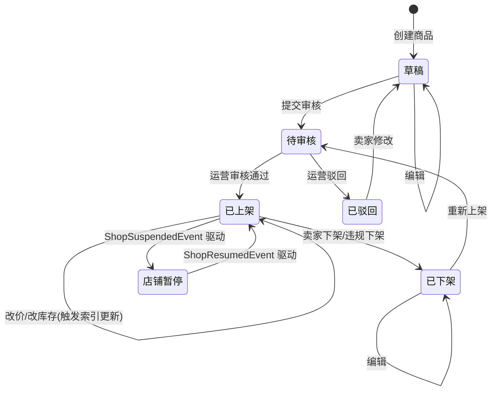

# 商品域需求文档

**所属限界上下文**：BC2 商品域
**文档版本**：V2.5
**创建日期**：2026-07-09

本版统一搜索术语为商品域读模型（ES），补充商品下架事件通知购物车域标记失效。

## 1 上下文概述

商品域负责 SPU/SKU 建模、分类与品牌管理、商品审核流转与搜索索引构建，是买家浏览链路的数据源头。本上下文权威持有商品基础信息、SKU 价格与可售库存基线，下游上下文不直接引用商品聚合对象，而是通过快照或查询接口获取所需数据。

与其它限界上下文的协作关系如下：

- 商品域 → 购物车域/订单域：以商品与 SKU 快照形式提供基础信息与价格，采用客户-供应商关系，下游为消费者。
- 商品域 → 购物车域（共享内核事件）：商品下架发布 `ProductTakenDownEvent`，购物车域消费后标记对应购物车项为失效，阻止下单。
- 评价与售后域 → 商品域：评价提交后通过 `ReviewSubmittedEvent` 回写商品评分摘要，商品域消费该事件更新 `score`。
- 商品域 → 商品域读模型（ES）：商品发布与变更通过领域事件驱动 Elasticsearch 索引同步，读模型由本上下文负责维护。
- 订单域 → 商品域：订单预占、扣减、释放库存的高并发操作在订单域以 Redis Lua 脚本原子完成，商品域通过订阅订单事件同步可售库存基线。

商品域对外发布的集成事件见第 3 章；读模型设计见第 8 章。

## 2 领域模型设计

### 2.1 聚合与实体

本上下文包含三个聚合根：Product（SPU）、Category、Brand。SKU 作为 Product 聚合内的实体，规格属性以 SpecAttribute 值对象表达。

#### 2.1.1 Product 聚合根（SPU）

| 字段名 | 类型 | 说明 | 约束 |
|-|-|-|-|
| ProductId | Guid | 商品 SPU 唯一标识 | 主键，创建时生成 |
| SellerId | Guid | 所属卖家/店铺标识 | 非空，关联卖家聚合 |
| Name | string | 商品标题 | 2-100 字 |
| Subtitle | string | 副标题/卖点 | ≤200 字，可空 |
| CategoryId | Guid | 所属分类 | 非空，须为叶子分类 |
| BrandId | Guid? | 所属品牌 | 可空 |
| Description | string | 图文详情（富文本/HTML） | ≤50000 字 |
| MainImages | List&lt;string&gt; | 主图 URL 列表 | 1-9 张，首张为主图 |
| DetailImages | List&lt;string&gt; | 详情图 URL 列表 | 可空 |
| Skus | List&lt;Sku&gt; | SKU 实体集合 | ≥1，规格组合唯一 |
| Status | ProductStatus | 商品状态 | 枚举：草稿/待审核/已上架/已下架/已驳回/店铺暂停 |
| AuditInfo | AuditInfo? | 审核记录值对象 | 待审核及之后填充 |
| PriceRange | PriceRange | 价格区间（派生） | 由 SKU 价格聚合得出 |
| SoldCount | long | 销量 | 默认 0，由订单事件累计 |
| Score | decimal | 评分摘要 | 0-5，由评价事件更新 |
| CreatedAt | DateTime | 创建时间 | UTC |
| UpdatedAt | DateTime | 更新时间 | UTC |

聚合根方法（行为意图明确，避免贫血模型）：

- `SubmitForReview()`：卖家将草稿或驳回态商品提交审核，状态流转至待审核，记录提交时间，产生 `ProductSubmittedForReviewEvent`。
- `Publish(operatorId)`：运营审核通过后上架，状态流转至已上架，记录审核人与时间，产生 `ProductPublishedEvent`。仅在待审核态可调用。
- `Reject(operatorId, reason)`：运营驳回，状态流转至已驳回，记录驳回原因，产生 `ProductRejectedEvent`。
- `TakeDown(reason)`：卖家主动下架或违规下架，状态流转至已下架，产生 `ProductTakenDownEvent`。
- `AdjustPrice(skuId, newPrice)`：调整指定 SKU 价格，校验价格 > 0 并记录价格变更历史，产生 `ProductUpdatedEvent`。
- `UpdateStock(skuId, delta)`：卖家补货或盘点修正库存，校验结果 ≥ 0，产生 `StockAdjustedEvent`。
- `AddSku(sku)` / `UpdateSku(skuId, spec, price)` / `RemoveSku(skuId)`：维护 SKU 集合，校验规格组合唯一性。
- `UpdateBasicInfo(...)`：编辑标题、副标题、分类、品牌、图文等基础属性，已上架商品编辑后产生 `ProductUpdatedEvent`。
- `SuspendByShop(shopId, reason)`：店铺暂停时调用，校验当前状态为已上架且 SellerId 匹配，流转至店铺暂停态，附加 `ProductSuspendedEvent`（可选，内部事件）。暂停态商品不可售新单。
- `ResumeByShop(shopId)`：店铺恢复时调用，校验当前状态为店铺暂停，流转回已上架，恢复可售。

#### 2.1.2 SKU 实体

| 字段名 | 类型 | 说明 | 约束 |
|-|-|-|-|
| SkuId | Guid | SKU 唯一标识 | 主键 |
| ProductId | Guid | 所属 SPU | 外键，非空 |
| SkuCode | string | 商家自定义编码 | 唯一，≤64 字 |
| SpecAttributes | List&lt;SpecAttribute&gt; | 规格属性集合 | ≥1，组合在同 SPU 下唯一 |
| Price | Money | 销售价格 | > 0 |
| Stock | int | 可售库存基线 | ≥ 0 |
| Barcode | string? | 条形码 | 可空 |
| Weight | decimal? | 重量(kg) | ≥ 0，可空 |
| ImageUrl | string? | SKU 专属图 | 可空 |

SKU 不作为独立聚合根对外暴露，外部对象只能通过 Product 聚合根访问与操作 SKU。

#### 2.1.3 SpecAttribute 值对象

| 字段名 | 类型 | 说明 | 约束 |
|-|-|-|-|
| Name | string | 规格名（如颜色/尺寸） | 非空 |
| Value | string | 规格值（如黑色/XL） | 非空 |

值对象不可变，相等性由 Name 与 Value 联合判定。规格组合唯一性以 SpecAttribute 集合的整体序列化比对。

#### 2.1.4 Category 聚合根

| 字段名 | 类型 | 说明 | 约束 |
|-|-|-|-|
| CategoryId | Guid | 分类唯一标识 | 主键 |
| Name | string | 分类名称 | 1-32 字 |
| ParentId | Guid? | 父分类 | 根分类为空 |
| Level | int | 层级 | 1-4 |
| SortOrder | int | 排序序号 | ≥ 0 |
| IconUrl | string? | 分类图标 | 可空 |
| IsLeaf | bool | 是否叶子分类 | 仅叶子分类可挂商品 |
| Status | CategoryStatus | 状态 | 枚举：启用/停用，默认启用 |

聚合根方法：

- `Enable()`：将停用分类恢复为启用，产生 `CategoryChangedEvent`，驱动买家导航树与搜索筛选器刷新。
- `Disable()`：将分类置为停用，产生 `CategoryChangedEvent`；停用分类及其下商品在买家侧不展示，已挂载商品在卖家后台仍可见。

#### 2.1.5 Brand 聚合根

| 字段名 | 类型 | 说明 | 约束 |
|-|-|-|-|
| BrandId | Guid | 品牌唯一标识 | 主键 |
| Name | string | 品牌名称 | 1-64 字，唯一 |
| LogoUrl | string? | 品牌 Logo | 可空 |
| Description | string? | 品牌简介 | ≤500 字，可空 |
| Status | BrandStatus | 状态 | 启用/停用 |
| CreatedAt | DateTime | 创建时间 | UTC |

#### 2.1.6 SPU 与 SKU 聚合边界说明

SKU 作为 Product 聚合内的实体而非独立聚合，理由有三：第一，SKU 规格组合唯一性这一核心不变量需要在同一事务内校验，置于聚合内可由聚合根统一保证；第二，SKU 生命周期与 SPU 强绑定，SPU 下架则其 SKU 一并不可售；第三，高频库存预占/扣减已下沉至订单域 Redis 层完成，商品域侧的 `UpdateStock` 仅承载卖家低频的补货与盘点修正，不会引发聚合频繁加载的性能问题。

**关键警告**：SKU 不可被外部上下文直接引用，订单与购物车域引用的是 SKU 快照（含 SkuId、价格、规格），不持有 SKU 实体引用。

### 2.2 领域服务

- `IProductReviewDomainService`：封装审核流转的跨角色逻辑，校验只有待审核态商品可被运营审核、只有运营角色可审核，并协同统计待审核队列。
- `IStockValidationDomainService`：跨 SPU 的库存校验，如批量上架前校验所属卖家全部商品的库存合规性，避免逐个加载聚合。
- `IProductUniquenessChecker`：校验商品标题在同店铺内不重复、SKU 编码全局唯一，依赖仓储的查询能力，跨聚合校验无法归入单聚合根。
- `ICategoryValidator`：校验商品挂载的分类为叶子分类且处于启用态。

### 2.3 仓储接口

```csharp
public interface IProductRepository
{
    Task<Product?> GetByIdAsync(Guid productId, CancellationToken ct = default);
    Task<Product?> GetBySkuCodeAsync(string skuCode, CancellationToken ct = default);
    Task<(IReadOnlyList<Product> Items, int Total)> QueryAsync(ProductQuery query, CancellationToken ct = default);
    Task AddAsync(Product product, CancellationToken ct = default);
    Task UpdateAsync(Product product, CancellationToken ct = default);
}

public interface ICategoryRepository
{
    Task<Category?> GetByIdAsync(Guid categoryId, CancellationToken ct = default);
    Task<IReadOnlyList<Category>> GetTreeAsync(CancellationToken ct = default);
    Task AddAsync(Category category, CancellationToken ct = default);
    Task UpdateAsync(Category category, CancellationToken ct = default);
    Task RemoveAsync(Guid categoryId, CancellationToken ct = default);
}

public interface IBrandRepository
{
    Task<Brand?> GetByIdAsync(Guid brandId, CancellationToken ct = default);
    Task<IReadOnlyList<Brand>> ListEnabledAsync(CancellationToken ct = default);
    Task AddAsync(Brand brand, CancellationToken ct = default);
    Task UpdateAsync(Brand brand, CancellationToken ct = default);
}
```

仓储接口定义在领域层，实现位于基础设施层 `EfCoreProductRepository` 等，DbContext 仅在基础设施层可见。

### 2.4 分层落点

| 分层 | 商品域落点 | 职责 |
|-|-|-|-|
| 领域层 | Product/Category/Brand 聚合、SpecAttribute 值对象、领域服务、领域事件、`IProductRepository` 等仓储接口 | 封装业务规则与不变量 |
| 应用层 | `IProductAppService`、`IProductQueryService`、DTO、Command/Query | 用例编排与事务边界；查询走 ES（CQRS） |
| 基础设施层 | `EfCoreProductRepository`、ES 查询实现、`ProductIndexSyncConsumer`、`IIndexRebuildExecutor` 实现 | 持久化、检索、索引同步消费者；提供内部全量索引重建执行能力，不暴露管理员 reindex 端点（由 BC11 系统管理域统一触发） |
| 表现层 | `ProductController`（卖家写）、`ProductQueryController`（买家读）、`CategoryController` | 接收请求、调用应用服务、返回 DTO |

## 3 领域事件清单

| 事件名 | 触发时机 | 消费方 | 关键字段 |
|-|-|-|-|
| `ProductCreatedEvent` | 卖家创建草稿商品 | 商品域读模型（ES 索引同步）、统计 | productId, sellerId, name, status |
| `ProductSubmittedForReviewEvent` | 卖家提交审核 | 运营审核队列、通知 | productId, sellerId, submittedAt |
| `ProductPublishedEvent` | 运营审核通过上架 | 商品域读模型（ES 索引同步） | productId, name, brandId, priceRange, skus |
| `ProductRejectedEvent` | 运营驳回 | 通知卖家 | productId, reason, operatorId |
| `ProductUpdatedEvent` | 商品基础信息或价格变更 | 商品域读模型（ES 索引同步）、购物车域 | productId, changedFields, updatedAt |
| `ProductTakenDownEvent` | 商品下架 | 商品域读模型（ES 索引同步）、购物车域 | productId, skuIds, reason, takenDownAt |
| `StockAdjustedEvent` | 卖家调整库存基线 | 商品域读模型（ES 索引同步）、订单域 | skuId, productId, delta, newStock |
| `CategoryChangedEvent` | 分类调整 | 商品域读模型（ES 索引同步） | categoryId, parentId, action |
| `ReviewSubmittedEvent`（入站） | 评价域评价提交 | 商品域（更新评分） | productId, newScore, reviewCount |
| `ShopSuspendedEvent`（入站） | 卖家域店铺暂停 | 商品域（调用 `SuspendByShop` 置商品店铺暂停态，阻止新单） | shopId, sellerId, reason, suspendedAt |
| `ShopClosedEvent`（入站） | 卖家域店铺关闭 | 商品域（调用 `TakeDown` 下架全部商品，复用已有方法并产出 `ProductTakenDownEvent`） | shopId, sellerId, reason, closedAt |
| `ShopResumedEvent`（入站） | 卖家域店铺恢复 | 商品域（调用 `ResumeByShop` 恢复商品已上架态） | shopId, sellerId, resumedAt |

事件经发件箱模式与聚合持久化在同一事务写入，后台进程发布到事件总线，消费失败进入死信队列重试。

## 4 功能需求

### 4.0 功能点概览表

| 编号 | 功能模块 | 功能描述 |
|-|-|-|
| F-PRD-001 | 商品发布 | 卖家创建 SPU 并配置多规格 SKU，建立草稿 |
| F-PRD-002 | 商品编辑 | 卖家修改商品基础信息与 SKU |
| F-PRD-003 | 商品提交审核 | 卖家将草稿/驳回商品提交运营审核 |
| F-PRD-004 | 运营审核上架与驳回 | 运营审核商品并决定上架或驳回，含批量审核、审核历史与全量商品管理列表 |
| F-PRD-005 | 商品下架 | 卖家主动下架或运营违规下架 |
| F-PRD-006 | 库存管理 | 卖家补货、盘点修正可售库存基线 |
| F-PRD-007 | 分类管理 | 运营维护分类树，支持启用/停用分类 |
| F-PRD-008 | 品牌管理 | 运营维护品牌库 |
| F-PRD-009 | 买家商品列表与多维筛选 | 买家按分类/品牌导航并多维筛选 |
| F-PRD-010 | 商品详情页 | 买家查看商品详情、评价摘要与推荐 |
| F-PRD-011 | ES 全文检索与拼音纠错 | 买家关键词搜索商品 |
| F-PRD-012 | 聚合统计 | 搜索结果按价格/品牌/属性聚合 |
| F-PRD-013 | 实时索引同步 | 商品变更事件驱动 ES 索引同步 |

### F-PRD-001 商品发布

业务逻辑：卖家在卖家中心填写商品标题、副标题、分类、品牌、主图、图文详情，并配置规格维度（如颜色、尺寸）生成 SKU 矩阵，每个 SKU 设定价格、库存、编码。创建后商品处于草稿态，不对外可见。

交互逻辑：卖家选择叶子分类后系统返回该分类绑定的规格属性模板；卖家勾选规格值生成 SKU 组合表，逐行填写价格与库存；提交后调用 `IProductAppService.CreateProductAsync`，应用服务校验后调用 Product 工厂方法构造聚合并持久化。

规则约束：标题 2-100 字；分类须为叶子分类且启用；主图 1-9 张，首张必填；SKU 至少 1 个；每个 SKU 价格 > 0、库存 ≥ 0；同 SPU 下 SKU 规格组合唯一；SKU 编码全局唯一；同店铺内商品标题不重复。

权限逻辑：仅卖家角色可发布，且 SellerId 取自当前登录身份，不可伪造他人店铺。

边界与异常：规格组合数超过上限（如 100）拒绝创建；图片 URL 须经 `IFileStorageService.ValidateUrl` 校验；并发提交相同 SKU 编码以唯一索引拦截并返回冲突。

### F-PRD-002 商品编辑

业务逻辑：卖家修改自有商品的基础信息与 SKU。草稿与已驳回态可全量编辑；已上架商品仅允许编辑非价格敏感字段（标题、详情、主图、库存），改价须走改价流程并记录历史。

交互逻辑：卖家进入编辑页加载商品详情，修改后提交；应用服务加载聚合，调用 `UpdateBasicInfo` 或 `AddSku`/`UpdateSku`/`RemoveSku`，已上架商品编辑后产生 `ProductUpdatedEvent` 触发索引更新。

规则约束：编辑后标题仍须 2-100 字；新增 SKU 规格组合不与既有重复；移除 SKU 时若该 SKU 存在未完成订单则禁止移除；已上架商品编辑分类须重新审核。

权限逻辑：卖家只能编辑 SellerId 与自身匹配的商品；运营不可直接编辑卖家商品内容。

边界与异常：并发编辑采用乐观锁（行版本号），冲突时返回 409 提示刷新后重试；编辑已下架商品不会自动恢复上架。

### F-PRD-003 商品提交审核

业务逻辑：卖家将草稿或驳回态商品提交运营审核，状态流转至待审核。提交前系统校验商品完整性。

交互逻辑：卖家在商品列表勾选草稿商品点击"提交审核"；应用服务调用 `SubmitForReview`，聚合校验状态合法后产生 `ProductSubmittedForReviewEvent`，运营审核队列接收。

规则约束：仅草稿/已驳回态可提交；必填项校验（标题、主图、至少 1 个有效 SKU、图文详情非空）；同一商品重复提交幂等。

权限逻辑：仅商品所属卖家可提交。

边界与异常：商品已被他人下架或删除时提交返回 409；审核队列积压超过阈值告警。

### F-PRD-004 运营审核上架与驳回

业务逻辑：运营在审核工作台查看待审核商品，核对内容合规性后通过或驳回。通过则商品上架对外可售，驳回则回退卖家并附原因。

交互逻辑：运营打开审核详情查看图文与 SKU；点击通过调用 `Publish(operatorId)`，点击驳回填写原因调用 `Reject(operatorId, reason)`；通过产生 `ProductPublishedEvent`，驳回产生 `ProductRejectedEvent`。批量场景调用 `batch-approve` 或 `batch-reject` 端点一次提交多条商品，单条状态非法或被卖家撤回不影响其余条目。运营在全量商品管理列表 `GET /api/admin/products` 按状态、卖家、分类、品牌、时间筛选治理全平台商品；审核历史 `GET /api/admin/products/review-history` 按审核结果、审核人、时间回溯已通过与已驳回记录。

规则约束：仅待审核态可审核；驳回原因 1-500 字必填；审核操作记录审计人与时间。

权限逻辑：仅运营管理员角色可审核；运营不可审核自己关联店铺商品。

边界与异常：商品在审核期间被卖家撤回（草稿态）则审核动作返回 409；批量审核支持但单条失败不影响其余。

### F-PRD-005 商品下架

业务逻辑：卖家主动下架自有商品，或运营对违规商品强制下架。下架后商品在买家侧不可见、不可售，但卖家后台仍可见。

交互逻辑：卖家在商品列表点击下架，调用 `TakeDown(reason)`；运营在治理页面强制下架同理。产生 `ProductTakenDownEvent`，商品域读模型（ES）将索引置为不可售或移除，购物车域消费后标记对应购物车项失效。

规则约束：仅已上架态可下架；下架原因 1-200 字；存在未完成订单不影响下架，订单按原快照履约。

权限逻辑：卖家只能下架自有商品；运营可下架任意商品并标记违规。

边界与异常：下架后买家已加入购物车的该商品标记为"已下架"不可结算；下架商品的搜索索引在事件消费后失效，存在秒级最终一致窗口。

### F-PRD-006 库存管理

业务逻辑：卖家对自有 SKU 补货或盘点修正可售库存基线。商品域权威持有可售库存基线，订单域在 Redis 侧完成高频预占/扣减/释放，商品域通过订阅订单事件同步基线。

交互逻辑：卖家在库存管理页输入 SKU 与增减数量，调用 `UpdateStock(skuId, delta)`，聚合校验结果 ≥ 0 后产生 `StockAdjustedEvent`，商品域读模型（ES）更新库存字段，订单域感知基线变化。

规则约束：库存调整后结果 ≥ 0；delta 为正表示补货、为负表示扣减；调整须记录操作人与原因；高频预占不在本功能点范围，由订单域 Redis Lua 脚本承载。

权限逻辑：仅商品所属卖家可调整库存；运营不可直接改卖家库存。

边界与异常：并发调整采用乐观锁；卖家调整的基线与订单域 Redis 预占余额可能短暂偏差，由对账任务周期校正；库存为 0 的 SKU 在买家侧展示"暂时缺货"但保留商品页。

### F-PRD-007 分类管理

业务逻辑：运营维护商品分类树，支持新增、编辑、启用/停用、删除分类。分类层级不超过 4 级，仅叶子分类可挂商品。

交互逻辑：运营在分类管理页操作分类树，调用 `CategoryController` 对应端点；启用/停用分类经聚合 `Enable()`/`Disable()` 方法流转并产生 `CategoryChangedEvent`，同步搜索导航与买家筛选器。

规则约束：分类名 1-32 字；层级 1-4；删除分类前须确认无子分类且无商品挂载，否则拒绝；停用分类后其下商品在买家侧不展示。

权限逻辑：仅运营与系统管理员可管理分类。

边界与异常：删除非空分类返回 409 并提示关联商品数；分类树缓存于 Redis，变更后失效。

### F-PRD-008 品牌管理

业务逻辑：运营维护品牌库，支持新增、编辑、启用/停用品牌。卖家发布商品时从启用品牌中选择。

交互逻辑：运营在品牌管理页通过 `GET /api/admin/brands` 查看全部品牌（含停用），调用品牌管理端点新增、编辑、启用/停用；停用品牌后该品牌不在卖家发布选项中出现，已上架商品保留品牌显示。

规则约束：品牌名 1-64 字且唯一；Logo URL 须有效；停用品牌不影响已挂载商品。

权限逻辑：仅运营与系统管理员可管理品牌。

边界与异常：重名品牌以唯一约束拦截返回 409；品牌列表缓存于 Redis。

### F-PRD-009 买家商品列表与多维筛选

业务逻辑：买家按分类或品牌进入商品列表，支持按价格区间、属性、评分多维筛选，支持按价格/销量/评分排序与分页。查询走 Elasticsearch 读库。

交互逻辑：买家点击分类或品牌导航，前端调用 `ProductQueryController`；应用层 `IProductQueryService` 构造 ES 查询，返回扁平化商品卡片列表；筛选条件变更实时重查。

规则约束：仅返回已上架商品；分页 page 从 1 开始，pageSize 默认 20、最大 100；筛选属性维度由分类绑定的规格模板动态生成。

权限逻辑：买家无需登录即可浏览；游客与登录用户结果一致。

边界与异常：ES 不可用时降级到数据库查询并降低分页上限；筛选条件组合无结果时返回空集与建议词。

### F-PRD-010 商品详情页

业务逻辑：买家查看单个商品 SPU 详情，包含主图、图文详情、SKU 规格选择、价格、库存状态、评价摘要与推荐商品。评价摘要由评价域事件回写。

交互逻辑：买家进入详情页，调用 `ProductQueryController.GetDetail`；应用层从 ES 或缓存加载商品文档，SKU 选择切换实时计算价格与库存；评价摘要与推荐商品并行加载。

规则约束：仅已上架商品详情可访问，其它状态返回 404；评价摘要展示评分、评论数、好评率；推荐商品基于同分类/同品牌召回。

权限逻辑：买家无需登录；游客可见详情但加购时引导登录。

边界与异常：商品详情缓存于 Redis 并设随机过期防雪崩；库存为 0 时 SKU 置灰显示"暂时缺货"；商品刚下架存在缓存残留，由 `ProductTakenDownEvent` 主动失效缓存。

### F-PRD-011 ES 全文检索与拼音纠错

业务逻辑：买家输入关键词搜索商品，ES 对商品标题、描述执行全文检索，支持中文分词（`ik_smart`）、拼音检索与拼写纠错，返回匹配商品。

交互逻辑：买家在搜索框输入关键词，前端调用 `ProductQueryController.Search`；应用层构造 ES `multi_match` 查询，结合拼音分词器与 `suggest` 接口纠错；返回商品卡片与纠错建议。

规则约束：仅检索已上架商品；关键词为空时返回热门商品；搜索响应 95% 低于 800ms。

权限逻辑：买家无需登录。

边界与异常：关键词无结果时返回纠错建议与热门搜索；ES 索引重建期间查询降级到旧索引。

### F-PRD-012 聚合统计

业务逻辑：搜索结果页对命中商品按价格区间、品牌、属性维度聚合统计，供买家二次筛选。

交互逻辑：搜索查询同时携带聚合参数，ES `aggregation` 返回各维度桶计数；前端渲染为筛选侧边栏。

规则约束：价格区间按动态分桶（如 0-100、100-500…）；品牌聚合仅返回命中商品涉及的品牌；属性聚合维度由分类规格模板决定。

权限逻辑：买家无需登录。

边界与异常：聚合结果与列表分页独立计算；聚合桶过多时限制返回前 N 个。

### F-PRD-013 实时索引同步

业务逻辑：商品发布、编辑、下架、库存调整、评分更新等变更通过领域事件驱动 ES 索引同步，保持读库与写库最终一致。

交互逻辑：聚合持久化时事件写入发件箱，后台进程发布到事件总线；`ProductIndexSyncConsumer` 订阅 `ProductPublishedEvent`、`ProductUpdatedEvent`、`ProductTakenDownEvent`、`StockAdjustedEvent`、`ReviewSubmittedEvent`，将聚合或变更字段写入 ES `products` 索引。

规则约束：事件消费幂等，以 productId 与事件版本号去重；消费失败进入死信队列重试，超过阈值告警；索引文档版本号与聚合 UpdatedAt 对齐防止乱序覆盖。

权限逻辑：消费者为系统内部服务，不对外暴露。

边界与异常：ES 写入失败重试 3 次后入死信；全量索引重建由 BC11 系统管理域统一触发（`POST /api/admin/index-rebuilds?targetContext=product`），本域提供内部索引重建执行接口 `IIndexRebuildExecutor` 供 BC11 调用，期间增量事件暂存补偿。

## 5 API 设计

接口遵循 RESTful 风格，资源以名词复数命名，鉴权通过 `Authorization: Bearer {token}`。卖家写接口需卖家角色，运营接口需运营角色，买家读接口公开。

### 5.1 卖家商品写接口

| 方法 | 端点 | 说明 | 权限 |
|-|-|-|-|
| POST | /api/seller/products | 创建草稿商品 | 卖家 |
| PUT | /api/seller/products/{productId} | 编辑商品 | 卖家 |
| POST | /api/seller/products/{productId}/submit-review | 提交审核 | 卖家 |
| POST | /api/seller/products/{productId}/take-down | 下架商品 | 卖家 |
| PUT | /api/seller/products/{productId}/skus/{skuId}/price | 调整 SKU 价格 | 卖家 |
| PUT | /api/seller/products/{productId}/skus/{skuId}/stock | 调整 SKU 库存 | 卖家 |
| GET | /api/seller/products | 卖家商品列表（分页、状态筛选） | 卖家 |
| GET | /api/seller/products/{productId} | 卖家商品详情（含所有状态） | 卖家 |

### 5.2 运营审核与管理接口

| 方法 | 端点 | 说明 | 权限 |
|-|-|-|-|
| GET | /api/admin/products/pending-review | 待审核商品列表 | 运营 |
| GET | /api/admin/products | 全量商品列表（按状态/卖家/分类/品牌/时间筛选，分页） | 运营 |
| GET | /api/admin/products/review-history | 已审核商品列表（按审核结果/审核人/时间筛选） | 运营 |
| POST | /api/admin/products/{productId}/approve | 审核通过上架 | 运营 |
| POST | /api/admin/products/{productId}/reject | 审核驳回 | 运营 |
| POST | /api/admin/products/batch-approve | 批量审核通过（body: { productIds: [] }） | 运营 |
| POST | /api/admin/products/batch-reject | 批量审核驳回（body: { productIds: [], reason }） | 运营 |
| POST | /api/admin/products/{productId}/force-take-down | 违规强制下架 | 运营 |
| POST | /api/admin/categories | 新增分类 | 运营 |
| PUT | /api/admin/categories/{categoryId} | 编辑分类 | 运营 |
| DELETE | /api/admin/categories/{categoryId} | 删除分类 | 运营 |
| POST | /api/admin/categories/{categoryId}/enable | 启用分类 | 运营 |
| POST | /api/admin/categories/{categoryId}/disable | 停用分类 | 运营 |
| GET | /api/admin/categories/tree | 分类树 | 运营 |
| GET | /api/admin/brands | 品牌管理列表（分页，含停用品牌） | 运营 |
| POST | /api/admin/brands | 新增品牌 | 运营 |
| PUT | /api/admin/brands/{brandId} | 编辑品牌 | 运营 |
| POST | /api/admin/brands/{brandId}/enable | 启用品牌 | 运营 |
| POST | /api/admin/brands/{brandId}/disable | 停用品牌 | 运营 |

### 5.3 买家读接口

| 方法 | 端点 | 说明 | 权限 |
|-|-|-|-|
| GET | /api/products | 商品搜索（keyword、分类、品牌、筛选、排序、分页） | 公开 |
| GET | /api/products/{productId} | 商品详情 | 公开 |
| GET | /api/products/{productId}/recommendations | 推荐商品 | 公开 |
| GET | /api/categories/tree | 买家分类导航树 | 公开 |
| GET | /api/brands | 启用品牌列表 | 公开 |
| GET | /api/products/search/suggest | 搜索纠错建议 | 公开 |

## 6 业务规则与不变量

- 同一 SPU 下 SKU 规格组合唯一，由 Product 聚合根在 `AddSku`/`UpdateSku` 时校验。
- 商品上架须经运营审核通过，`Publish` 仅在待审核态可调用。
- 库存不可负，`UpdateStock` 与订单域扣减均校验结果 ≥ 0。
- SKU 价格 > 0，`AdjustPrice` 校验并记录价格变更历史。
- 同店铺内商品标题不重复，SKU 编码全局唯一，由 `IProductUniquenessChecker` 跨聚合校验。
- 仅叶子分类可挂商品，挂载分类须启用。
- 已上架商品改价或改库存触发索引更新，价格变更须可审计追溯。
- 商品下架后买家侧不可见、不可售，但已生成订单按快照履约。
- 评分摘要由评价域事件驱动更新，商品域不直接计算评分。
- 单次事务只修改一个 Product 聚合，跨聚合协作通过领域事件异步完成。

## 7 状态机

商品生命周期状态流转如下。



状态流转均由聚合根方法驱动，非法流转抛出领域异常。已下架商品重新上架须重新审核，已驳回商品修改后回到草稿态再次提交。

## 8 读模型设计

买家查询走 Elasticsearch `products` 索引，文档结构如下，参考原文 6.2 并扩展。

```json
{
  "productId": "123",
  "name": "智能手机",
  "subtitle": "旗舰影像",
  "brandId": "b1",
  "brand": "BrandX",
  "categoryId": "c10",
  "categoryPath": ["c1", "c5", "c10"],
  "sellerId": "s1",
  "status": "Published",
  "priceRange": { "min": 2999.00, "max": 3999.00 },
  "skus": [
    {
      "skuId": "s1",
      "skuCode": "PHN-BLK-256",
      "price": 2999.00,
      "stock": 150,
      "specs": [
        { "name": "颜色", "value": "黑色" },
        { "name": "存储", "value": "256G" }
      ]
    }
  ],
  "mainImages": ["https://cdn/x1.jpg"],
  "soldCount": 1500,
  "score": 4.5,
  "reviewCount": 320,
  "attributes": { "颜色": ["黑色", "白色"], "存储": ["256G", "512G"] },
  "updatedAt": "2026-07-09T08:00:00Z"
}
```

字段说明：

| 字段 | ES 类型 | 用途 |
|-|-|-|
| name | text（ik_smart + pinyin 分词） | 全文检索与拼音检索 |
| subtitle | text | 辅助检索 |
| brand | keyword | 品牌聚合与筛选 |
| categoryPath | keyword 数组 | 分类导航与层级筛选 |
| priceRange | object | 价格区间筛选与排序 |
| skus | nested | SKU 级价格、库存、规格检索 |
| attributes | object | 多维属性筛选与聚合 |
| soldCount | long | 销量排序 |
| score | double | 评分筛选与排序 |
| status | keyword | 过滤仅可售商品 |
| updatedAt | date | 索引版本对齐 |

索引创建时配置 `ik_smart` 中文分词器与拼音分词器，`skus` 设为 nested 类型以支持 SKU 级精确查询。索引同步由 `ProductIndexSyncConsumer` 消费领域事件完成。

## 9 验收标准

### AC-PRD-001 商品发布

- Given 卖家已登录且选择叶子分类
- When 卖家填写标题、主图、2 个规格组合的 SKU 并提交
- Then 系统创建草稿态商品，返回 productId，产生 `ProductCreatedEvent`，且 2 个 SKU 规格组合唯一

### AC-PRD-001a 规格组合重复拦截

- Given 卖家发布商品时提交两个颜色/尺寸相同的 SKU
- When 应用服务调用 Product 工厂方法
- Then 抛出领域异常，返回 400，商品不持久化

### AC-PRD-003 提交审核

- Given 卖家有一草稿商品且必填项完整
- When 卖家点击提交审核
- Then 商品状态流转至待审核，产生 `ProductSubmittedForReviewEvent`，运营审核队列可见

### AC-PRD-004 审核上架

- Given 运营对待审核商品点击通过
- When 调用 `Publish`
- Then 商品状态流转至已上架，产生 `ProductPublishedEvent`，ES 索引置为可售，买家侧可搜到

### AC-PRD-004a 审核驳回

- Given 运营对待审核商品填写驳回原因并驳回
- When 调用 `Reject`
- Then 商品状态流转至已驳回，产生 `ProductRejectedEvent`，卖家收到通知

### AC-PRD-005 下架搜索失效

- Given 商品处于已上架且已被 ES 索引
- When 卖家下架商品
- Then 产生 `ProductTakenDownEvent`，消费者将索引置为不可售，买家搜索不再命中（容忍秒级最终一致窗口）

### AC-PRD-006 库存非负

- Given 某 SKU 当前库存基线为 5
- When 卖家尝试调整 delta=-10
- Then 抛出领域异常，返回 400，库存不变

### AC-PRD-006a 库存为 0 展示

- Given 某 SKU 库存为 0 且商品已上架
- When 买家查看详情页
- Then SKU 显示"暂时缺货"，商品页保留可见

### AC-PRD-009 多维筛选

- Given 买家在手机分类下筛选价格 2000-4000 且品牌为 BrandX
- When 调用商品列表接口
- Then 仅返回已上架、价格区间命中、品牌命中的商品，分页正确

### AC-PRD-011 拼音纠错

- Given 买家输入"shouji"（手机拼音）
- When 调用搜索接口
- Then 命中标题含"手机"的商品；输入"shouj"时返回纠错建议"手机"

### AC-PRD-013 索引同步幂等

- Given 同一 `ProductUpdatedEvent` 因重试被消费两次
- When 消费者处理事件
- Then ES 索引仅更新一次，文档版本号与聚合 UpdatedAt 对齐，无乱序覆盖

### AC-PRD-002 并发改价冲突

- Given 两个请求同时编辑同一商品价格
- When 第二个请求提交时行版本号已变
- Then 返回 409 冲突，提示刷新后重试，价格不变

### AC-PRD-007 删除非空分类

- Given 某分类下存在已上架商品
- When 运营尝试删除该分类
- Then 返回 409 并提示关联商品数，分类不删除
