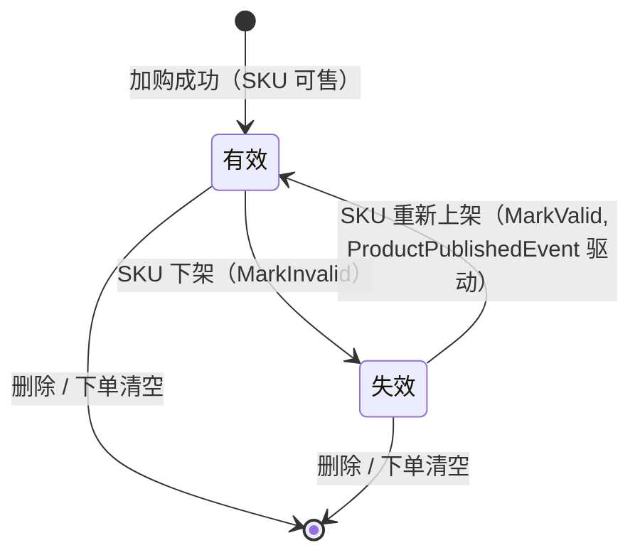

# 购物车域需求文档

**所属限界上下文**：BC3 购物车域
**文档版本**：V2.3
**创建日期**：2026-07-09

本版补充订阅商品下架事件标记购物车项失效，闭环下单校验。

## 1 上下文概述

购物车域负责买家在结算前的商品暂存与选中管理，是商品域与订单域之间的临时性缓冲集合。购物车本身不持有商品价格快照，也不承担交易一致性职责：它记录买家意图（哪些 SKU、多少数量、是否选中），在下单瞬间由订单域将选中项转化为订单行快照，转化完成后购物车清空已下单项。购物车因此是短期、可重建的集合，丢失或过期不影响已成交订单。

职责边界限定为四项：管理购物车项的增删改与选中状态、维护购物车内不变量（数量与种类上限、同 SKU 合并）、在匿名与登录两种身份下提供一致的购物车存取、为总价计算提供行项来源。价格计算、库存校验、优惠核销均不属于购物车域自身职责，由应用层编排跨上下文查询完成。

购物车是临时性集合，下单时转化为订单快照后清空已下单项，未选中项保留。这一生命周期决定了购物车无需事件溯源、无需保留历史价格，只需保证当前状态的实时性与一致性。

与相邻上下文的关系如下：

- **商品域**：购物车以 SKU ID 引用商品，不持有商品聚合对象。SKU 现价、可售状态、库存由商品域权威持有，购物车域通过查询服务实时读取，避免跨上下文对象引用。
- **促销域**：总价计算时调用促销域获取适用优惠（满减、优惠券等），优惠结果由促销域计算，购物车域只负责展示与汇总。
- **订单域**：下单时购物车选中项转化为订单行快照（价格快照在订单域下单瞬间固化）；订单创建后通过 `OrderCreatedEvent` 集成事件通知购物车域清空已结算项。

上下文映射上，购物车域对商品域、促销域为下游消费者（客户-供应商关系），对订单域为上游供给方（遵奉者关系，订单域决定快照内容）。

## 2 领域模型设计

### 2.1 聚合与实体

购物车域以 `Cart` 为聚合根，内含 `CartItem` 实体集合。聚合根是外部唯一入口，外部对象只持有 `Cart` 引用，不直接引用 `CartItem`。聚合内不变量（数量范围、种类上限、同 SKU 合并、失效项不可选中）由聚合根方法保证，不在应用层散落校验。聚合根、实体、值对象、领域事件均属领域层，不依赖任何其他层。

`Cart` 聚合根字段：

| 字段名 | 类型 | 说明 | 约束 |
|-|-|-|-|
| CartId | Guid | 购物车唯一标识 | 主键，创建时生成 |
| UserId | Guid? | 所属用户 ID | 登录购物车必填 |
| AnonymousId | string? | 匿名会话/设备标识 | 匿名购物车必填；与 UserId 互斥 |
| Items | List&lt;CartItem&gt; | 购物车项集合 | 不同 SKU 种类上限 50 |
| CreatedAt | DateTime | 创建时间 | 审计字段，UTC |
| UpdatedAt | DateTime | 更新时间 | 审计字段，UTC |
| Version | int | 乐观锁版本号 | 并发控制 |

`CartItem` 实体字段：

| 字段名 | 类型 | 说明 | 约束 |
|-|-|-|-|
| CartItemId | CartItemId | 购物车项唯一标识 | 值对象，主键 |
| SkuId | Guid | 商品 SKU 标识 | 非空，引用商品域 |
| Quantity | Quantity | 购买数量 | 值对象，1-99 |
| IsSelected | bool | 选中状态 | 默认 true |
| AddedAt | DateTime | 加入时间 | 审计字段 |
| IsValid | bool | 是否有效 | 默认 true，下架时置 false |
| InvalidReason | string? | 失效原因 | 如"已下架" |

值对象：

- `CartItemId`：封装 Guid，无标识语义，仅作强类型区分。
- `Quantity`：封装 int，构造时校验 1-99 不变量，超出抛出领域异常，不可变。

聚合根方法行为意图明确，避免贫血模型：

- `AddItem(SkuId, Quantity)`：同 SKU 合并数量（合并后不超 99），新增时校验种类上限 50，新增项默认选中，产出 `CartItemAddedEvent`。
- `ChangeQuantity(CartItemId, Quantity)`：校验项存在与数量 1-99，更新数量，产出 `CartItemQuantityChangedEvent`。
- `RemoveItem(CartItemId)`：移除指定项，产出 `CartItemRemovedEvent`。
- `ToggleSelection(CartItemId, bool)`：切换单项选中，失效项拒绝选中并抛出领域异常。
- `ToggleAllSelection(bool)`：批量切换所有有效项选中状态，失效项不受影响。
- `MarkInvalid(SkuId, reason)`：按 SKU 标记对应项失效（IsValid=false），自动取消选中，产出 `CartItemInvalidatedEvent`。
- `MarkValid(SkuId)`：按 SKU 标记失效项恢复有效（IsValid=true），恢复选中状态（可选）。
- `ClearCheckedOutItems(IEnumerable<CartItemId>)`：清空已下单项，仅移除传入的 CartItemId 集合，保留其余项，产出 `CartItemsClearedEvent`。

匿名购物车与登录购物车的存储差异：

- 匿名购物车以 `AnonymousId` 为键存入 Redis，结构为轻量 JSON（仅 SKU ID、数量、选中状态、加入时间，不含价格），TTL 短期（默认 30 天），不落 DB，读取与写入走 `RedisCartStore`。
- 登录购物车以 `UserId` 为键持久化到 DB（Cart 聚合表），同时缓存到 Redis 加速读取；写入经 `EfCoreCartRepository` 落库后同步更新缓存，缓存与 DB 不一致时以 DB 为准并回填。

### 2.2 领域服务

购物车域不把跨上下文的价格逻辑内嵌进聚合。现价与可售状态由商品域权威持有，优惠由促销域计算，二者均跨上下文边界，购物车域聚合不直接依赖商品域或促销域的类型。价格实时计算通过应用层编排完成：应用层加载购物车后，调用防腐层查询服务获取外部数据，再组装含价购物车视图。

防腐层查询接口（定义在应用层，基础设施层实现，调用商品域/促销域 API 或读模型）：

- `IProductPricingQueryService`：`GetCurrentPricesAsync(IEnumerable&lt;Guid&gt; skuIds)` 返回各 SKU 现价、可售状态、可售库存。
- `IPromotionQueryService`：`GetApplicableDiscountsAsync(CartPricingContext context)` 返回适用优惠金额与明细。

购物车域内部的纯领域逻辑（如选中项小计汇总、失效项过滤）可由领域服务 `CartPricingDomainService` 承担，它接收应用层传入的现价与优惠快照，在领域层完成纯计算，不触碰外部依赖。这一拆分让价格数据的获取（跨上下文）与价格的计算（域内）各归其位。

应用层 `ICartAppService` 编排上述流程并控制事务边界：加载购物车 → 调用 `IProductPricingQueryService` 取现价 → 调用 `IPromotionQueryService` 取优惠 → 调用 `CartPricingDomainService` 汇总 → 返回 `PricedCartDto`。应用服务方法名体现用例，如 `GetCartAsync`、`AddItemAsync`、`MergeAnonymousCartAsync`。

### 2.3 仓储接口

仓储接口定义在领域层，基础设施层提供实现。匿名临时存储与登录持久化分属两个接口，职责清晰：

```csharp
// 领域层
public interface ICartRepository  // 登录用户购物车，DB 持久化
{
    Task<Cart?> GetByUserIdAsync(Guid userId, CancellationToken ct = default);
    Task<Cart?> GetByIdAsync(Guid cartId, CancellationToken ct = default);
    Task AddAsync(Cart cart, CancellationToken ct = default);
    Task UpdateAsync(Cart cart, CancellationToken ct = default);
    Task RemoveAsync(Guid cartId, CancellationToken ct = default);
}

public interface IAnonymousCartStore  // 匿名购物车，Redis 临时
{
    Task<Cart?> GetAsync(string anonymousId, CancellationToken ct = default);
    Task SaveAsync(string anonymousId, Cart cart, CancellationToken ct = default);
    Task RemoveAsync(string anonymousId, CancellationToken ct = default);
    Task ExtendTtlAsync(string anonymousId, TimeSpan ttl, CancellationToken ct = default);
}
```

基础设施层落点：`EfCoreCartRepository` 实现 `ICartRepository`（EF Core 持久化，DbContext 仅在本层可见）；`RedisCartStore` 实现 `IAnonymousCartStore`（Redis 临时存储，带 TTL）。匿名购物车到登录购物车的合并逻辑跨两种存储，由应用层 `ICartAppService.MergeAnonymousCartAsync` 编排，不放进仓储。

## 3 领域事件清单

领域事件在聚合方法中产生、在当前上下文内消费，跨上下文传递经事件总线以集成事件形式发布。购物车域消费的入站集成事件：订单域 `OrderCreatedEvent`（触发清空已结算项）、商品域 `ProductTakenDownEvent`（触发标记对应 SKU 购物车项失效）、商品域 `ProductPublishedEvent`（触发调用 `MarkValid` 恢复失效项为有效）、商品域 `ProductUpdatedEvent`（触发刷新购物车项展示快照如名称图片）。

| 事件名 | 类型 | 触发时机 | 消费方 | 关键字段 |
|-|-|-|-|-|
| `CartItemAddedEvent` | 领域事件 | 加购成功 | 购物车域内部、分析 | CartId, SkuId, Quantity, AddedAt |
| `CartItemQuantityChangedEvent` | 领域事件 | 修改数量 | 分析 | CartId, CartItemId, OldQuantity, NewQuantity |
| `CartItemRemovedEvent` | 领域事件 | 删除项 | 分析 | CartId, CartItemId, SkuId |
| `CartItemSelectionChangedEvent` | 领域事件 | 切换单项选中 | 购物车域内部 | CartId, CartItemId, IsSelected |
| `CartItemInvalidatedEvent` | 领域事件 | SKU 下架标记失效 | 通知 | CartId, SkuId, Reason |
| `CartMergedEvent` | 领域事件（可发集成） | 登录合并完成 | 分析 | UserId, AnonymousId, MergedItemCount |
| `CartItemsClearedEvent` | 领域事件 | 下单清空已结算项 | 购物车域内部 | CartId, OrderId, ClearedItemIds |
| `OrderCreatedEvent`（入站） | 集成事件 | 订单域创建订单 | 购物车域（本域） | userId, orderId, checkedOutItemIds |
| `ProductTakenDownEvent`（入站） | 集成事件 | 商品下架（来自商品域） | 购物车域（本域） | productId, skuIds, reason, takenDownAt |
| `ProductPublishedEvent`（入站） | 集成事件 | 商品上架/重新上架（来自商品域） | 购物车域（本域，调用 `MarkValid`） | productId, skuIds, publishedAt |
| `ProductUpdatedEvent`（入站） | 集成事件 | 商品信息或价格变更（来自商品域） | 购物车域（本域） | productId, changedFields, updatedAt |

聚合保存与事件记录在同一事务写入（发件箱模式），后台进程轮询发件箱表并发布到消息队列，消费失败进入死信队列重试。

## 4 功能需求

### 功能点概览表

| 编号 | 功能模块 | 功能描述 |
|-|-|-|
| FP-01 | 匿名购物车 | 未登录用户购物车存 Redis 临时存储 |
| FP-02 | 登录用户购物车 | 登录用户购物车 DB 持久化 + 缓存 |
| FP-03 | 添加 SKU | 向购物车添加商品 SKU，同 SKU 合并数量 |
| FP-04 | 修改数量 | 修改购物车项数量 |
| FP-05 | 删除商品 | 从购物车删除商品项 |
| FP-06 | 选中/取消选中 | 切换单个购物车项选中状态 |
| FP-07 | 全选/取消全选 | 切换所有有效项选中状态 |
| FP-08 | 购物车总价实时计算 | 实时取现价 + 促销计算总价 |
| FP-09 | 登录时匿名购物车合并 | 登录后合并匿名购物车到用户购物车 |
| FP-10 | 下单后清空已结算项 | 订单创建后清空已下单购物车项 |
| FP-11 | 购物车失效商品提示 | SKU 下架时标记失效并提示 |

### FP-01 匿名购物车（Redis 临时）

业务逻辑：未登录买家加购时，购物车以匿名标识为键存入 Redis，结构为轻量 JSON，仅含 SKU ID、数量、选中状态、加入时间，不含价格。TTL 默认 30 天，每次访问续期。

交互逻辑：客户端首次访问时由网关或前端生成匿名标识（写入 Cookie / localStorage），随加购请求以 `X-Anonymous-Id` 头携带；服务端按标识读写 `IAnonymousCartStore`。

规则约束：购物车不同 SKU 种类上限 50；单 SKU 数量 1-99；不保留价格快照。

权限逻辑：无需认证，以匿名标识隔离数据，一个标识对应一个匿名购物车。

边界与异常：Redis 不可用时返回错误并提示稍后重试；TTL 到期自动清理；匿名标识缺失时由网关生成后重试。

### FP-02 登录用户购物车（DB+缓存）

业务逻辑：登录买家购物车以用户 ID 为键持久化到 DB（Cart 聚合表），同时缓存到 Redis 加速读取。写操作先落 DB 再更新缓存；读取优先命中缓存，未命中回源 DB 并回填。

交互逻辑：请求携带 `Authorization: Bearer {token}`，应用层从 JWT 解析用户 ID 定位购物车。

规则约束：种类上限 50，数量 1-99，与匿名购物车一致。

权限逻辑：需认证，用户只能访问自己的购物车，应用层校验 Token 中的用户 ID 与购物车归属一致。

边界与异常：缓存与 DB 不一致时以 DB 为准并回填；并发修改用 `Version` 乐观锁避免丢失更新，冲突时返回提示让客户端重试。

### FP-03 添加 SKU

业务逻辑：应用层先调用商品域查询服务校验 SKU 存在且可售，再调用 `Cart.AddItem(skuId, quantity)`。购物车已存在同 SKU 时合并数量（合并后不超 99），否则新增 `CartItem`，默认选中。聚合产出 `CartItemAddedEvent`。

交互逻辑：`POST /api/cart/items`，body `{ skuId, quantity }`。匿名请求带 `X-Anonymous-Id`，登录请求带 Bearer Token。

规则约束：数量 1-99；单 SKU 加购后总量上限 99；购物车种类达 50 时拒绝新增不同 SKU；SKU 必须处于上架可售状态。

权限逻辑：匿名按匿名标识写入临时存储，登录按用户 ID 写入持久化。

边界与异常：SKU 不存在或已下架返回错误且不加入；库存为 0 时拒绝加入；库存不足（小于加购数量）时允许加入但在总价计算时标记提示；数量超限返回校验错误。

### FP-04 修改数量

业务逻辑：调用 `Cart.ChangeQuantity(cartItemId, quantity)`，校验项存在与数量 1-99，产出 `CartItemQuantityChangedEvent`。

交互逻辑：`PATCH /api/cart/items/{itemId}`，body `{ quantity }`。

规则约束：数量 1-99；数量改为 0 不在此接口处理，前端应调用删除接口。

权限逻辑：同 FP-03。

边界与异常：项不存在返回 404；数量超限返回校验错误；失效项不允许改数量并提示先删除或等待上架。

### FP-05 删除商品

业务逻辑：调用 `Cart.RemoveItem(cartItemId)`，产出 `CartItemRemovedEvent`。

交互逻辑：`DELETE /api/cart/items/{itemId}`。

规则约束：仅删除指定项，不影响其他项。

权限逻辑：同 FP-03。

边界与异常：项不存在返回 404 或幂等返回成功。

### FP-06 选中/取消选中

业务逻辑：调用 `Cart.ToggleSelection(cartItemId, isSelected)`，产出 `CartItemSelectionChangedEvent`。

交互逻辑：`PATCH /api/cart/items/{itemId}/selection`，body `{ selected: true/false }`。

规则约束：失效项不可选中，聚合根拒绝并抛出领域异常。

权限逻辑：同 FP-03。

边界与异常：项不存在返回 404；对失效项设为选中返回校验错误。

### FP-07 全选/取消全选

业务逻辑：调用 `Cart.ToggleAllSelection(isSelected)`，批量切换所有有效项选中状态。

交互逻辑：`PATCH /api/cart/selection`，body `{ selected: true/false }`。

规则约束：仅影响有效项，失效项保持不选中。

权限逻辑：同 FP-03。

边界与异常：空购物车返回成功且无副作用。

### FP-08 购物车总价实时计算（现价+促销）

业务逻辑：应用层加载购物车，调用 `IProductPricingQueryService` 获取各 SKU 现价、可售状态、可售库存，调用 `IPromotionQueryService` 获取适用优惠，再由 `CartPricingDomainService` 汇总：商品小计按现价 × 数量，失效项不计入，优惠金额按促销域结果，应付总额 = 小计 - 优惠。购物车不存历史价格，每次实时取价。

交互逻辑：`GET /api/cart`（返回含价购物车视图）或 `GET /api/cart/summary`（仅返回金额汇总）。前端进入购物车页即触发。

规则约束：价格以商品域现价为准，优惠以促销域计算为准；失效项不计入总价且不可选；库存不足项仍计入小计但标记库存提示。

权限逻辑：匿名/登录均可用，按身份定位购物车。

边界与异常：商品域或促销域查询失败时降级展示缓存价并标记"价格可能已变"；价格为空时提示暂不可购买。

### FP-09 登录时匿名购物车合并

业务逻辑：用户登录成功后，应用层读取匿名标识对应的临时购物车，与用户持久化购物车合并：同 SKU 数量相加（上限 99），不同 SKU 直接并入（受 50 种上限约束），合并完成后删除匿名购物车。合并逻辑在应用层编排（跨 Redis 与 DB 两种存储）。合并产出 `CartMergedEvent`。

交互逻辑：登录响应后前端调用 `POST /api/cart/merge`，body `{ anonymousId }`；或在登录流程内自动触发。

规则约束：合并后单 SKU 总量不超 99、种类不超 50，超出部分按加入时间丢弃较新项并提示；选中状态按"任一来源选中即选中"合并。

权限逻辑：需登录态，合并目标为当前登录用户的购物车。

边界与异常：匿名购物车不存在或已过期则跳过合并；合并在单事务内完成用户购物车的写入与匿名购物车的删除；同一匿名标识重复触发合并需幂等（已合并则无操作）。

### FP-10 下单后清空已结算项

业务逻辑：订单域创建订单时将购物车选中项转化为订单行快照（价格快照在订单域下单瞬间固化），并发布 `OrderCreatedEvent` 集成事件，事件携带已下单的 CartItemId 集合。购物车域订阅该事件，调用 `Cart.ClearCheckedOutItems(checkedOutItemIds)` 清空已下单项，仅清空已结算项，保留未选中项。

交互逻辑：由事件总线异步驱动，无前端直接交互；订单创建接口同步返回，清空异步完成。

规则约束：清空以订单快照中的 CartItemId 为准，未在订单中的项保留。

权限逻辑：事件携带用户 ID，消费时校验购物车归属与用户一致。

边界与异常：事件重复消费需幂等（项已不存在则跳过）；事件丢失导致残留项由对账任务补偿，对账依据订单与购物车的差异修正。

### FP-11 购物车失效商品提示

业务逻辑：商品域下架商品时发布 `ProductTakenDownEvent`（携带 productId 与受影响 skuIds），购物车域订阅该事件，按 skuIds 调用 `Cart.MarkInvalid(skuId, reason)` 将对应 `CartItem` 标记为失效（IsValid=false），自动取消选中。展示时失效项置灰并提示原因，不计入总价、不可选中。失效项在下单结算时自动排除或提示用户移除；下单校验时若选中项含失效项则拒绝下单并返回失效商品列表。聚合产出 `CartItemInvalidatedEvent`。

交互逻辑：事件驱动批量处理；前端获取购物车时返回 `IsValid` 与 `InvalidReason` 字段。

规则约束：失效项可删除；下单校验选中项须全部有效（IsValid=true），含失效项拒绝下单；商品重新上架时自动恢复有效。

权限逻辑：事件驱动，按 SKU 批量处理所有含该 SKU 的购物车。

边界与异常：事件延迟会导致短暂展示已下架商品，下次取价时由商品域返回不可售状态校正为失效。

## 5 API 设计

表现层 `CartController` 只依赖 `ICartAppService`，不含业务逻辑与数据访问代码，输入输出一律使用 DTO。匿名请求以 `X-Anonymous-Id` 头标识身份，登录请求以 `Authorization: Bearer {token}` 头鉴权。统一响应结构含 `code`、`message`、`data` 三段，写操作支持 `Idempotency-Key` 头。

| 功能 | 方法 | 端点 | 鉴权 | 说明 |
|-|-|-|-|-|
| 获取购物车 | GET | /api/cart | 匿名/登录 | 返回含价购物车视图，含失效项标记 |
| 总价计算 | GET | /api/cart/summary | 匿名/登录 | 返回小计、优惠、应付总额 |
| 添加 SKU | POST | /api/cart/items | 匿名/登录 | body `{ skuId, quantity }` |
| 修改数量 | PATCH | /api/cart/items/{itemId} | 匿名/登录 | body `{ quantity }` |
| 删除商品 | DELETE | /api/cart/items/{itemId} | 匿名/登录 | |
| 选中切换 | PATCH | /api/cart/items/{itemId}/selection | 匿名/登录 | body `{ selected }` |
| 全选切换 | PATCH | /api/cart/selection | 匿名/登录 | body `{ selected }` |
| 合并（登录触发） | POST | /api/cart/merge | 登录 | body `{ anonymousId }` |

## 6 业务规则与不变量

- 同一 SKU 合并：购物车内同一 SKU 只有一条 `CartItem`，加购时合并数量，合并后不超 99。
- 数量范围：单 SKU 数量 1-99，由 `Quantity` 值对象在构造时校验。
- 种类上限：购物车不同 SKU 种类上限 50，达到上限拒绝新增不同 SKU。
- 不保留价格快照：购物车实时取商品域现价，不存历史价；价格快照仅在订单域下单瞬间固化到订单行。
- 选中约束：仅有效项可选中，失效项自动取消选中且不可选。
- 单聚合事务：单次事务只修改一个 `Cart` 聚合，跨聚合协作（清空已结算项）通过集成事件异步完成。
- 身份互斥：`UserId` 与 `AnonymousId` 互斥，匿名购物车不落 DB，登录购物车不依赖匿名标识。
- 失效项不计价：失效项不计入总价，不参与优惠计算。
- 下单校验：下单时校验选中项全部有效（IsValid=true），含失效项时拒绝下单并返回失效商品列表。
- 合并上限继承：合并后总量与种类上限与单购物车一致（99、50）。

## 7 状态机

购物车项存在有效与失效两种状态，状态由 SKU 上下架事件驱动。



失效状态下项不可选中、不计入总价；用户可删除失效项，或等待商品重新上架后自动恢复。

## 8 验收标准

验收以 Given/When/Then 形式覆盖核心功能点与边界，重点验证匿名合并与价格实时性。

**AC-01 加购合并同 SKU**
Given 购物车已存在 SKU A 数量 2
When 用户加购 SKU A 数量 3
Then 购物车中 SKU A 数量为 5，仅一条 CartItem，触发 `CartItemAddedEvent`

**AC-02 数量边界**
Given 用户修改某购物车项数量
When 输入数量为 0 或 100
Then 返回校验错误，数量保持不变

**AC-03 种类上限**
Given 购物车已有 50 种不同 SKU
When 用户加购第 51 种新 SKU
Then 返回错误提示购物车已满，拒绝加入

**AC-04 匿名购物车 Redis 存储**
Given 未登录用户加购
When 加购请求携带 `X-Anonymous-Id`
Then 购物车写入 Redis 且 TTL 生效，DB 无记录

**AC-05 登录合并**
Given 匿名购物车含 SKU A(2)、SKU B(1)，用户购物车含 SKU A(1)
When 用户登录并触发合并
Then 用户购物车为 SKU A(3)、SKU B(1)，匿名购物车删除，触发 `CartMergedEvent`

**AC-06 合并幂等**
Given 合并已完成
When 同一匿名标识再次触发合并
Then 用户购物车不变，匿名购物车已不存在，无重复并入

**AC-07 价格实时性**
Given 购物车含 SKU A，商品域现价从 100 调整为 80
When 用户查看购物车总价
Then 小计按 80 计算，购物车未存历史价 100

**AC-08 促销优惠计算**
Given 购物车选中项小计 200，促销域返回满 200 减 30
When 计算应付总额
Then 应付总额为 170，优惠明细返回

**AC-09 下架失效提示**
Given 购物车含 SKU A 且选中
When 商品域下架 SKU A 并发布下架事件
Then CartItem 标记失效，自动取消选中，展示置灰提示，不计入总价

**AC-10 下单后清空已结算项**
Given 购物车含选中项 SKU A、未选中项 SKU B
When 订单域创建订单并发布 `OrderCreatedEvent`（含 SKU A 的 CartItemId）
Then 购物车清空 SKU A，保留 SKU B

**AC-11 全选**
Given 购物车含多个有效项与一个失效项
When 用户点击全选
Then 所有有效项选中，失效项保持不选中

**AC-12 库存不足提示**
Given 购物车含 SKU A 数量 10，商品域可售库存为 3
When 用户查看购物车
Then SKU A 小计按数量 10 计算，标记库存不足提示
