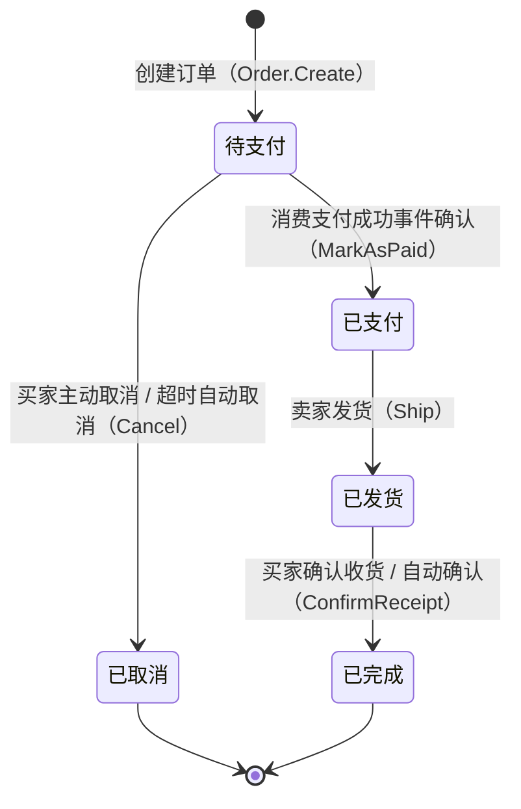
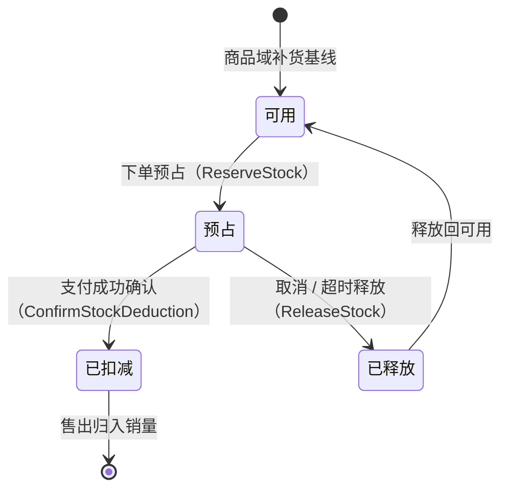
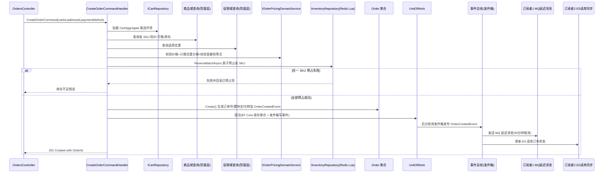

# 订单与交易域需求文档

**所属限界上下文**：BC4 订单与交易域
**文档版本**：V2.7
**创建日期**：2026-07-09

V2.2 修订：支付渠道对接剥离至支付集成域（BC8）；金额模型新增积分抵现项 `PointsOffsetAmount`；新增售后期结束事件驱动积分发放；新增付费会员年费订阅订单场景；补充物流轨迹查询集成。V2.3 修订：新增运营端物流公司管理（F-ORD-021）、运费模板配置（F-ORD-022）、运营强制取消异常订单（F-ORD-023），及对应 `LogisticsCompany`、`FreightTemplate` 聚合根与不变量。本域对应总览文档限界上下文表中的 BC4，覆盖订单生成、状态机流转、库存预占与扣减、支付请求发起与结果消费、多视角查询。文档遵循 `00-需求文档总览与DDD架构.md` 中定义的分层架构规范、共享内核约定与统一语言，并与该总览文档第 5 章事件清单、第 5.3 节 CQRS 下单流程保持一致。下单 CQRS 流程作为本域的核心交互范式贯穿全文。

## 1 上下文概述

订单与交易域是平台的交易核心，承载从买家下单到交易完结的全链路状态流转。本域是强一致的 Command 侧：订单创建、库存预占、支付确认等关键操作在单事务内保证聚合不变量，跨聚合协作通过领域事件异步完成。库存预占这一高并发强一致操作以 Redis Lua 脚本原子执行，订单超时取消由 MQ 延迟消息驱动，支付结果由消费支付集成域返回的事件驱动，三者共同构成交易域的一致性骨架。

职责边界限定为七项：订单聚合的创建与状态机流转、订单行价格与商品快照固化、库存预占与扣减与释放、发起支付请求并消费支付集成域返回的支付结果、订单履约（发货与确认收货）、订单超时自动取消、订单多视角查询（CQRS 读侧）。支付渠道对接（微信/支付宝）、回调验签、退款执行由支付集成域（BC8）承载，本域不持有渠道 SDK。退款退货的售后流程不属于本域，由评价与售后域承载；本域在退款完成时消费 `RefundCompletedEvent` 回滚销量与库存。

### 与其他限界上下文的关系

依据总览文档第 3.2 章的上下文映射，本域与各上下文的协作关系如下：

- 用户域（客户-供应商，本域为下游）：订单创建时以快照方式固化买家身份与收货地址。地址快照在订单创建瞬间从用户域 `Address` 聚合拷贝为不可变值对象，订单后续履约不依赖用户域地址的实时变更。
- 商品域（客户-供应商，本域为下游）：商品域权威持有 SKU 价格与可售库存基线。下单瞬间订单行拷贝 SKU 名称、规格、图片、价格为商品快照，此后订单履约不依赖商品域实时数据；商品下架不影响已生成订单按快照履约。库存预占/扣减/释放的高频操作在本域 Redis 侧完成，商品域通过订阅本域库存事件同步可售库存基线。
- 购物车域（遵奉者，订单域决定快照内容）：购物车为订单提供行项来源，下单时购物车选中项转化为订单行快照。订单创建发布 `OrderCreatedEvent` 后，购物车域消费该事件清空已结算项，未选中项保留。
- 促销域（客户-供应商，本域为下游）：结算时本域调用促销域获取适用优惠（满减、优惠券等），优惠金额与分摊明细在订单创建瞬间固化到订单行。支付成功发布 `OrderPaidEvent` 后，促销域消费该事件核销优惠券。
- 评价与售后域（共享内核事件，本域为上游）：订单完成发布 `OrderCompletedEvent`，评价域消费该事件开放评价入口；售后退款完成发布 `RefundCompletedEvent`，本域消费该事件回滚销量并按规则退还库存与优惠券。
- 支付集成域（ACL/共享内核事件）：本域发布 `PaymentRequestedIntegrationEvent` 请求发起支付，消费 `PaymentSucceededIntegrationEvent` 标记已支付、消费 `PaymentFailedIntegrationEvent` 关单或保持待支付；退款由售后域经支付集成域执行，本域消费 `RefundCompletedEvent` 回滚销量与库存。

上下文映射上，订单域对用户域、商品域、促销域为下游消费者，对购物车域为上游供给方，对评价与售后域为事件发布方与消费方双向协作，对支付集成域以防腐层发起支付请求并消费其结果事件。

## 2 领域模型设计

本域严格遵循总览文档第 4 章与 DDD 最佳实践的分层规范。领域层封装聚合、值对象、领域服务、仓储接口与领域事件，不引用任何技术细节；应用层编排用例并控制事务；基础设施层实现 EF Core 仓储、Redis Lua 库存、支付集成域事件消费者、MQ 消费者与 ES 同步消费者；表现层只调用应用服务。

本域设两个聚合根：`Order`（订单，内含 `OrderItem` 实体集合）、`StockReservation`（库存预占，按 SKU 独立聚合）。支付单由支付集成域（BC8）维护，本域不设 `Payment` 聚合，仅在 `Order` 聚合上保留支付结果快照。聚合边界以一致性为依据：单次事务只修改一个聚合，跨聚合协作通过领域事件异步完成。

### 2.1 聚合与实体

#### 2.1.1 Order 聚合根

`Order` 是交易核心聚合根，封装订单状态机与金额不变量。所有状态流转通过行为意图明确的方法完成，禁止外部直接 set 字段。一个 `Order` 归属单一卖家；当购物车结算涉及多卖家时，应用层按卖家拆分为多个 `Order` 聚合，以支撑卖家按店铺查看与履约订单。

| 字段名 | 类型 | 说明 | 约束 |
|-|-|-|-|
| OrderId | Guid | 订单唯一标识 | 主键，创建时生成 |
| OrderNo | string | 订单号 | 全局唯一，按生成规则产生（见第 6 章） |
| OrderType | OrderType | 订单类型 | 枚举：商品订单/会员订阅订单，默认商品订单 |
| UserId | Guid | 买家标识 | 非空，引用用户域 |
| SellerId | Guid? | 卖家/店铺标识 | 商品订单非空（单卖家）；会员订阅订单为空（平台直营） |
| Items | List&lt;OrderItem&gt; | 订单行集合 | ≥1，同 SKU 合并为单行 |
| ItemsAmount | Money | 商品总金额 | Σ(行单价×数量)，>0 |
| DiscountAmount | Money | 优惠总额 | ≥0，等于各行优惠分摊之和 |
| PointsOffsetAmount | Money | 积分抵扣金额 | ≥0，100 积分抵 1 元，单笔上限见 INV-18 |
| FreightAmount | Money | 运费总额 | ≥0 |
| TotalAmount | Money | 应付总额 | = ItemsAmount - DiscountAmount - PointsOffsetAmount + FreightAmount |
| Status | OrderStatus | 订单状态 | 枚举：待支付/已支付/已发货/已完成/已取消 |
| AddressSnapshot | AddressSnapshot | 收货地址快照 | 不可变值对象 |
| PaymentMethod | PaymentMethod? | 支付渠道 | 枚举：支付宝/微信，来自支付集成域结果；待支付时可空 |
| ExpireAt | DateTime | 支付截止时间 | 创建时刻 + 30 分钟，UTC |
| PaidAt | DateTime? | 支付时间 | 已支付起填充 |
| PaymentId | Guid? | 支付集成域支付单标识 | 已支付起填充，引用 BC8 支付单 |
| TradeNo | string? | 渠道交易号 | 已支付起填充，来自支付集成域结果 |
| ShippedAt | DateTime? | 发货时间 | 已发货起填充 |
| LogisticsNo | string? | 物流单号 | 已发货起填充 |
| CompletedAt | DateTime? | 完成时间 | 已完成起填充 |
| AfterSalesWindowEndsAt | DateTime? | 售后期结束时间 | 完成时刻 + 售后期天数（默认 7 天），UTC |
| CancelledAt | DateTime? | 取消时间 | 已取消起填充 |
| CancelReason | string? | 取消原因 | 已取消起填充，区分超时/买家主动 |
| CreatedAt | DateTime | 创建时间 | UTC，基础设施层填充 |
| UpdatedAt | DateTime | 更新时间 | UTC，基础设施层填充 |
| Version | int | 乐观锁版本号 | 并发控制 |

`Order` 聚合方法（行为意图明确，避免贫血模型）：

- `Create(...)`：工厂方法，校验订单行与金额恒等式，生成订单号，置状态为待支付，设置 `ExpireAt`，附加 `OrderCreatedEvent`。
- `ApplyDiscount(discountAllocations)`：按行分摊优惠金额，校验各行分摊之和等于优惠总额且不超行小计，更新 `DiscountAmount` 与 `TotalAmount`。
- `ApplyPointsOffset(pointsOffsetAmount)`：应用积分抵现，校验 `PointsOffsetAmount ≤ ItemsAmount - DiscountAmount` 且满足单笔上限（见 INV-18），更新 `PointsOffsetAmount` 与 `TotalAmount`。调用积分域确认接口冻结积分后由应用层调用此方法。
- `MarkAsPaid(paymentId, channel, paidAt, tradeNo)`：仅待支付态可调用，置状态为已支付，填充支付结果快照（PaymentId、渠道、PaidAt、TradeNo），附加 `OrderPaidEvent`。
- `Ship(logisticsNo, shippedAt, operatorId)`：仅已支付态可调用，置状态为已发货，记录物流单号与发货时间，附加 `OrderShippedEvent`。
- `ConfirmReceipt()`：仅已发货态可调用，置状态为已完成，记录 `CompletedAt` 与 `AfterSalesWindowEndsAt`（完成时刻 + 售后期天数），附加 `OrderCompletedEvent`。
- `CompleteMembershipOrder()`：会员订阅订单专用完成方法，校验 `OrderType=会员订阅订单` 且 `Status=已支付`，直接流转至已完成，附加 `OrderCompletedEvent` 和 `OrderAfterSalesWindowClosedEvent`（会员订阅订单无售后期，`AfterSalesWindowEndsAt=CompletedAt`）。
- `CloseAfterSalesWindow()`：售后期结束延迟消息到达时调用，校验 `Status == 已完成` 且当前时间 ≥ `AfterSalesWindowEndsAt`，附加 `OrderAfterSalesWindowClosedEvent`，通知积分域发放消费返积分。
- `Cancel(reason, cancelledBy)`：仅待支付态可调用，置状态为已取消，记录取消时间与原因，附加 `OrderCancelledEvent`。已支付后不可经此方法取消，退款走售后域。取消时若已冻结积分，事件携带需释放的积分数供积分域回退。
- `IsExpired(currentTime)`：判断是否超过 `ExpireAt`，供超时取消消费者决策。

**关键警告**：已支付订单不可经 `Cancel` 取消，退款退货须经售后域发起；本域仅在退款完成事件回滚销量与库存。

#### 2.1.2 OrderItem 实体

`OrderItem` 是 `Order` 聚合内的实体，持有下单瞬间的价格与商品快照，不依赖商品域实时数据。外部对象不直接引用 `OrderItem`，只能经 `Order` 聚合根访问。

| 字段名 | 类型 | 说明 | 约束 |
|-|-|-|-|
| OrderItemId | Guid | 订单行唯一标识 | 主键 |
| SkuId | Guid | 商品 SKU 标识 | 非空，引用商品域 |
| ProductSnapshot | ProductSnapshot | 商品快照（名称/规格/图片） | 不可变值对象 |
| UnitPrice | Money | 下单时单价快照 | >0 |
| Quantity | int | 购买数量 | 1-99 |
| DiscountAllocation | Money | 优惠分摊金额 | ≥0，≤行小计 |
| Subtotal | Money | 行小计 | = UnitPrice × Quantity - DiscountAllocation |
| SourceCartItemId | Guid? | 来源购物车项标识 | 购物车结算时填充，用于清空 |

订单行在创建时固化商品名称、规格、图片与单价，商品域后续调价、下架、改图均不影响已生成订单的履约与展示。`SourceCartItemId` 随 `OrderCreatedEvent` 传递给购物车域，驱动清空已结算项。

#### 2.1.3 支付单归属说明

本域不再设 `Payment` 聚合根，支付单（`PaymentOrder`）由支付集成域（BC8）维护，承载支付生命周期、渠道对接、回调验签与退款执行。本域在 `Order` 聚合上仅保留支付结果快照字段（PaymentId、PaymentMethod、PaidAt、TradeNo），这些字段在消费 `PaymentSucceededIntegrationEvent` 时由应用层调用 `Order.MarkAsPaid` 填充。支付单的字段定义、状态机、渠道适配与对账逻辑详见 `08-支付集成域.md`。

#### 2.1.4 StockReservation 聚合根

`StockReservation` 按 SKU 独立为聚合根，承载本域的库存预占台账。其与商品域可售库存基线的关系是：商品域权威持有基线，本域在 Redis 侧维护预占/扣减/释放的高频台账，二者通过库存事件与对账任务周期校正。独立聚合的理由是高频预占需独立的一致性边界与原子实现，若并入 `Order` 会使订单聚合在每次库存操作时被频繁加载且跨 SKU 不可合并。

| 字段名 | 类型 | 说明 | 约束 |
|-|-|-|-|
| SkuId | Guid | SKU 标识 | 主键，引用商品域 |
| AvailableQty | int | 可售数量 | ≥0，来自商品域基线 |
| ReservedQty | int | 预占数量 | ≥0 |
| DeductedQty | int | 已扣减（已售）数量 | ≥0 |
| Version | int | 乐观锁版本号 | 并发控制 |

不变量：`AvailableQty = 基线 - ReservedQty - DeductedQty`，且 `AvailableQty ≥ 0`。`StockReservation` 聚合方法：

- `ReserveStock(orderId, quantity)`：校验 `AvailableQty ≥ quantity`，`ReservedQty += quantity`，附加 `StockReservedEvent`。
- `ConfirmStockDeduction(orderId, quantity)`：校验 `ReservedQty ≥ quantity`，`ReservedQty -= quantity`，`DeductedQty += quantity`，附加 `StockConfirmedEvent`。
- `ReleaseStock(orderId, quantity)`：校验 `ReservedQty ≥ quantity`，`ReservedQty -= quantity`，附加 `StockReleasedEvent`。
- `Replenish(delta)`：商品域补货事件驱动，`AvailableQty` 基线上调。

`ReserveStock` 的原子性由基础设施层 Redis Lua 脚本兜底，脚本内完成"判余量 + 扣减 + 记录预占"的原子操作，避免并发下单超卖。

#### 2.1.5 LogisticsCompany 聚合根

物流公司主数据由运营维护，承载平台可用的物流公司信息与启停状态。卖家发货时从启用项中选择，订单发货以编码快照方式记录所选公司，公司后续停用不影响已发货订单的展示与轨迹查询。该聚合独立于 `Order`，亦可纳入平台共享主数据中心。

| 字段名 | 类型 | 说明 | 约束 |
|-|-|-|-|
| CompanyId | Guid | 物流公司唯一标识 | 主键，创建时生成 |
| Name | string | 公司名称 | 1-64 字符 |
| Code | string | 公司编码 | 全局唯一，创建后不可变 |
| ServicePhone | string | 客服电话 | E.164 或国内座机格式 |
| SupportTracking | bool | 是否支持轨迹查询 | 决定 F-ORD-008a 是否可查 |
| Status | LogisticsCompanyStatus | 启停状态 | 枚举：启用/停用，默认启用 |
| CreatedAt | DateTime | 创建时间 | UTC，基础设施层填充 |
| UpdatedAt | DateTime | 更新时间 | UTC，基础设施层填充 |
| Version | int | 乐观锁版本号 | 并发控制 |

`LogisticsCompany` 聚合方法（行为意图明确，避免贫血模型）：

- `Create(name, code, servicePhone, supportTracking)`：工厂方法，校验编码非空，置启用态。
- `Update(name, servicePhone, supportTracking)`：修改可变属性，编码不可改。
- `Enable()`：置启用态，幂等。
- `Disable()`：置停用态；仅影响后续发货可选性，已发货订单的物流展示与轨迹查询不受影响（见 INV-22）。

#### 2.1.6 FreightTemplate 聚合根

运费模板承载计费规则，运营创建平台默认模板，卖家引用或自建店铺模板。下单与结算预览时 `IFreightCalculator` 依据卖家绑定的模板与收货地址区域计算运费，订单运费在创建瞬间固化到 `Order.FreightAmount`，模板后续启停与修改不回溯影响已生成订单（见 INV-23）。

| 字段名 | 类型 | 说明 | 约束 |
|-|-|-|-|
| TemplateId | Guid | 模板唯一标识 | 主键，创建时生成 |
| Name | string | 模板名称 | 1-64 字符 |
| Type | FreightType | 计费类型 | 枚举：按重量/按件数/固定运费 |
| FreeShippingThreshold | Money? | 满额包邮阈值 | 可空，空表示不包邮；非空须 >0 |
| RegionRules | List&lt;FreightRegionRule&gt; | 地区计费规则集合 | 可空，空按默认全国规则 |
| Status | FreightTemplateStatus | 启停状态 | 枚举：启用/停用，默认启用 |
| CreatedAt | DateTime | 创建时间 | UTC，基础设施层填充 |
| UpdatedAt | DateTime | 更新时间 | UTC，基础设施层填充 |
| Version | int | 乐观锁版本号 | 并发控制 |

`FreightRegionRule` 为值对象（地区编码、首重/首件单位、首价、续单位、续价）。`FreightTemplate` 聚合方法：

- `Create(name, type, freeShippingThreshold, regionRules)`：工厂方法，校验计费类型与规则金额非负，置启用态。
- `UpdateRules(name, type, freeShippingThreshold, regionRules)`：修改计费规则，校验同 Create。
- `Enable()`：置启用态，仅启用模板参与运费计算。
- `Disable()`：置停用态，不影响已生成订单。

#### 2.1.7 值对象

值对象无唯一标识，通过属性值判断相等性，不可变。本域值对象除下述外，`Money` 沿用共享内核定义（金额与币种，四舍五入到两位小数）。

##### OrderStatus

| 字段 | 类型 | 说明 | 约束 |
|-|-|-|-|
| Value | string | 订单状态 | 枚举：PendingPayment/Paid/Shipped/Completed/Cancelled |

##### PaymentChannel

| 字段 | 类型 | 说明 | 约束 |
|-|-|-|-|
| Value | string | 支付渠道 | 枚举：Alipay/WeChat |

##### AddressSnapshot

| 字段名 | 类型 | 说明 | 约束 |
|-|-|-|-|
| RecipientName | string | 收件人姓名 | 1-32 字符 |
| RecipientPhone | string | 收件人手机号 | E.164 格式 |
| Province | string | 省/直辖市 | 非空 |
| City | string | 市 | 非空 |
| District | string | 区/县 | 非空 |
| Detail | string | 详细地址 | 5-200 字符 |

##### ProductSnapshot（订单行商品快照）

| 字段名 | 类型 | 说明 | 约束 |
|-|-|-|-|
| ProductName | string | 商品标题 | 非空 |
| SkuCode | string | SKU 编码 | 非空 |
| Specs | List&lt;SpecAttribute&gt; | 规格属性集合 | 下单瞬间固化 |
| ImageUrl | string? | 商品主图 URL | 可空 |

`SpecAttribute` 沿用商品域定义（Name/Value 值对象）。

### 2.2 领域服务

领域服务处理无法归入单一聚合的领域逻辑，接口与实现均在领域层。

- `IStockReservationDomainService`：跨 SKU 的库存预占/扣减/释放批量协调。
  - `ReserveBatchAsync(IEnumerable&lt;(Guid skuId, int quantity)&gt; reservations)`：批量预占，任一 SKU 预占失败则回滚已预占项，整体原子。
  - `ConfirmBatchAsync(IEnumerable&lt;(Guid skuId, int quantity)&gt; confirmations)`：批量确认扣减。
  - `ReleaseBatchAsync(IEnumerable&lt;(Guid skuId, int quantity)&gt; releases)`：批量释放预占。
- `IOrderPricingDomainService`：订单价格校验与优惠分摊计算。
  - `ValidatePricesAsync(IEnumerable&lt;OrderItemDraft&gt; items)`：校验下单输入价格与商品域现价一致（防篡改），不一致抛出领域异常。
  - `CalculateAndAllocate(items, promotionResult, freight)`：计算商品总金额、优惠总额、运费，按行分摊优惠，校验金额恒等式后返回最终金额。
- `IOrderNumberGenerator`：订单号生成，规则见第 6 章；接口在领域层，实现可基于雪花算法或数据库序列置于基础设施层。
- `IFreightCalculator`：运费计算，按卖家绑定的 `FreightTemplate` 与收货地址区域计算（模板定义见 2.1.6），接口在领域层。

跨上下文的外部数据获取（商品域现价与可售状态、促销域优惠、用户域地址）不内嵌进领域服务，由应用层经防腐层查询服务编排，领域服务只接收应用层传入的快照做纯计算，这一拆分让数据获取（跨上下文）与计算（域内）各归其位。

### 2.3 仓储接口

仓储接口定义在领域层，命名遵循 `I{聚合根名}Repository`，由基础设施层实现。库存仓储因 Redis 原子实现单独抽象。

```csharp
// 领域层
public interface IOrderRepository
{
    Task<Order?> GetByIdAsync(Guid orderId, CancellationToken ct = default);
    Task<Order?> GetByOrderNoAsync(string orderNo, CancellationToken ct = default);
    Task<(IReadOnlyList<Order> Items, int Total)> QueryAsync(OrderQuery query, CancellationToken ct = default);
    Task AddAsync(Order order, CancellationToken ct = default);
    Task UpdateAsync(Order order, CancellationToken ct = default);
}

public interface IInventoryRepository  // Redis Lua 原子实现
{
    Task<bool> ReserveAsync(Guid skuId, Guid orderId, int quantity, CancellationToken ct = default);
    Task<bool> ConfirmAsync(Guid skuId, Guid orderId, int quantity, CancellationToken ct = default);
    Task<bool> ReleaseAsync(Guid skuId, Guid orderId, int quantity, CancellationToken ct = default);
    Task<StockReservation?> GetAsync(Guid skuId, CancellationToken ct = default);
}
```

基础设施层落点：`EfCoreOrderRepository`（EF Core 持久化，DbContext 仅在本层可见）；`RedisInventoryRepository` 实现 `IInventoryRepository`，以 Redis Lua 脚本完成预占/扣减/释放的原子操作。`IOrderNumberGenerator` 实现位于基础设施层。支付单的持久化由支付集成域（BC8）承载，本域不设 `IPaymentRepository`。

### 2.4 分层落点

| 分层 | 订单域落点 | 职责 |
|-|-|-|
| 领域层 | `Order`/`OrderItem`、`StockReservation`、`LogisticsCompany`、`FreightTemplate` 聚合，`OrderStatus`/`PaymentChannel`/`AddressSnapshot`/`ProductSnapshot` 值对象，`IStockReservationDomainService`/`IOrderPricingDomainService`/`IOrderNumberGenerator`/`IFreightCalculator` 领域服务，`IOrderRepository`/`IInventoryRepository`/`ILogisticsCompanyRepository`/`IFreightTemplateRepository` 仓储接口，第 3 章领域事件 | 封装状态机、金额恒等式、库存预占规则、物流公司与运费模板主数据 |
| 应用层 | `IOrderAppService`、`CreateOrderCommandHandler`、`PayOrderCommandHandler`、`ShipOrderCommandHandler` 等，DTO、Command/Query，通过 UnitOfWork 控制事务边界，经发件箱发布事件 | 用例编排与事务边界；查询走 ES（CQRS） |
| 基础设施层 | `EfCoreOrderRepository`、`EfCoreLogisticsCompanyRepository`、`EfCoreFreightTemplateRepository`、`RedisInventoryRepository`（Lua 脚本）、`OrderTimeoutDelayMessageConsumer`、`PaymentSucceededEventConsumer`/`PaymentFailedEventConsumer`（消费支付集成域事件）、`OrderReadModelSyncConsumer`（ES 同步） | 持久化、库存原子操作、支付结果事件消费、MQ 消费、读库同步 |
| 表现层 | `OrdersController`、`PaymentsController`、`LogisticsCompaniesController`、`FreightTemplatesController` | 接收请求、调用应用服务、返回 DTO |

## 3 领域事件清单

领域事件在聚合方法中产生，本上下文内消费的用于解耦聚合内部逻辑；对外发布的集成事件经事件总线传递。事件命名统一过去时。聚合保存与事件记录在同一事务写入（发件箱模式），后台进程轮询发件箱表并发布到消息队列，消费失败进入死信队列重试。本域消费的入站事件：支付集成域 `PaymentSucceededIntegrationEvent`（标记已支付）、`PaymentFailedIntegrationEvent`（关单或保持待支付），评价与售后域 `RefundCompletedEvent`（回滚销量与库存）、商品域 `StockAdjustedEvent`（同步可售库存基线）。

| 事件名 | 触发时机 | 消费方 | 关键字段 |
|-|-|-|-|
| `OrderCreatedEvent` | 订单创建成功 | 购物车域（清空已结算项）、库存（预占）、促销（锁定优惠券）、MQ 延迟消息（超时取消）、消息通知域（下单通知）、ES 读库 | OrderId, OrderNo, OrderType, UserId, SellerId, Items(skuId,quantity,sourceCartItemId), TotalAmount, ExpireAt |
| `OrderPaidEvent` | 消费 `PaymentSucceededIntegrationEvent` 后订单转已支付 | 库存（确认真实扣减）、促销（核销优惠券）、积分域（正式扣减抵现冻结积分）、卖家（通知发货）、消息通知域（支付成功通知）、ES 读库 | OrderId, UserId, OrderType, PaymentId, Channel, PaidAt, TradeNo, Amount, PointsConsumed, PointsOffsetAmount |
| `OrderShippedEvent` | 卖家发货 | 买家（通知）、消息通知域（发货通知）、ES 读库、物流跟踪 | OrderId, UserId, LogisticsNo, LogisticsCompany, ShippedAt, SellerId |
| `OrderCompletedEvent` | 确认收货订单完成 | 评价域（开放评价）、积分域（标记待发积分状态）、卖家域（累计经营概览）、MQ 延迟消息（售后期结束）、ES 读库 | OrderId, UserId, OrderType, ItemsAmount, DiscountAmount, PointsOffsetAmount, FreightAmount, TotalAmount（即 PaidAmount）, OrderLines, CompletedAt, AfterSalesWindowEndsAt |
| `OrderAfterSalesWindowClosedEvent` | 售后期结束延迟消息到达，订单过售后期 | 积分与会员域（发放消费返积分与成长值） | OrderId, UserId, PaidAmount（= TotalAmount）, ItemsAmount, CompletedAt, AfterSalesWindowEndsAt |
| `OrderCancelledEvent` | 买家主动取消或超时自动取消 | 库存（释放预占）、促销（退还优惠券）、积分域（释放冻结的抵现积分）、消息通知域（取消通知）、ES 读库 | OrderId, CancelReason, CancelledAt, CancelledBy, PointsToRelease |
| `OrderPaymentTimeoutEvent` | 支付超时延迟消息到达 | 订单域内部（驱动取消） | OrderId, ExpireAt |
| `PaymentRequestedIntegrationEvent` | 订单发起支付请求 | 支付集成域（创建支付单对接渠道） | OrderId, UserId, BusinessOrderNo, Amount, Channel, IdempotencyKey |
| `PaymentSucceededIntegrationEvent`（入站） | 支付集成域回调验签确认成功 | 订单域（驱动 `Order.MarkAsPaid` 并产出 `OrderPaidEvent`） | PaymentOrderId, OrderId, TradeNo, Channel, Amount, PaidAt |
| `PaymentFailedIntegrationEvent`（入站） | 支付集成域支付失败或回调验签失败 | 订单域（关单或保持待支付） | PaymentOrderId, OrderId, FailReason, FailedAt |
| `StockReservedEvent` | 下单预占库存成功 | 商品域（同步基线预占）、对账 | SkuId, OrderId, Quantity |
| `StockConfirmedEvent` | 支付成功确认真实扣减 | 商品域（同步基线扣减）、销量统计 | SkuId, OrderId, Quantity |
| `StockReleasedEvent` | 取消或超时释放预占 | 商品域（同步基线释放）、对账 | SkuId, OrderId, Quantity |

## 4 功能需求

### 功能点概览表

| 编号 | 功能模块 | 功能描述 |
|-|-|-|
| F-ORD-001 | 创建订单（从购物车结算） | 从购物车选中项生成订单，按卖家拆分 |
| F-ORD-002 | 创建订单（直接购买） | 商品详情页直接购买生成订单 |
| F-ORD-003 | 订单价格与优惠计算 | 校验价格、计算优惠分摊、积分抵现试算、校验金额恒等式 |
| F-ORD-004 | 库存预占 | 下单时 Redis Lua 原子预占库存 |
| F-ORD-004a | 积分抵现试算与冻结 | 结算时调用积分域试算可抵金额，确认后冻结积分 |
| F-ORD-005 | 支付下单 | 向支付集成域发起支付请求，返回支付凭证 |
| F-ORD-006 | 支付异步回调确认 | 消费支付集成域支付成功事件，驱动订单转已支付 |
| F-ORD-007 | 支付失败与关单 | 消费支付集成域支付失败事件，关单或保持待支付 |
| F-ORD-008 | 订单发货 | 卖家填写物流单号发货 |
| F-ORD-008a | 物流轨迹查询 | 买家查询订单物流轨迹，对接物流查询接口 |
| F-ORD-009 | 确认收货 | 买家确认收货或超时自动确认 |
| F-ORD-010 | 订单完成 | 订单转已完成，开放评价入口 |
| F-ORD-010a | 售后期结束与积分发放 | 售后期结束事件驱动积分域发放消费返积分 |
| F-ORD-011 | 订单超时自动取消 | 30 分钟未支付延迟消息驱动取消 |
| F-ORD-012 | 买家主动取消订单 | 待支付态买家主动取消 |
| F-ORD-013 | 库存扣减确认 | 支付成功将预占转为真实扣减 |
| F-ORD-014 | 库存释放 | 取消或超时释放预占库存 |
| F-ORD-015 | 会员订阅订单 | 付费会员年费订阅订单创建与支付 |
| F-ORD-016 | 订单查询（买家视角） | 买家查询自己的订单列表 |
| F-ORD-017 | 订单查询（卖家视角） | 卖家查询本店订单列表 |
| F-ORD-018 | 订单查询（运营视角） | 运营查询全平台订单列表 |
| F-ORD-019 | 订单详情 | 多角色查看订单详情 |
| F-ORD-020 | 订单读库同步 | 写库变更事件驱动 ES 读库同步 |
| F-ORD-021 | 物流公司管理 | 运营维护物流公司主数据（名称、编码、客服电话、轨迹查询支持、启停状态） |
| F-ORD-022 | 运费模板配置 | 运营或卖家配置运费模板（按重量/件数/固定计费、满额包邮、地区规则） |
| F-ORD-023 | 运营强制取消异常订单 | 运营强制取消异常订单（重复支付、系统故障），记录操作人与原因 |

### F-ORD-001 创建订单（从购物车结算）

业务逻辑：买家在购物车勾选选中项并选择收货地址与支付方式后提交结算。`CreateOrderCommandHandler` 经 `ICartRepository` 加载 `Cart` 聚合取选中项，经防腐层查询商品域各 SKU 现价、可售状态与库存，经促销域查询适用优惠。若买家选择积分抵现，经防腐层调用积分域 `IPointsRedeemService.PreviewAsync` 试算可抵金额与消耗积分数（100 积分=1 元，单笔上限订单金额 30% 或 50 元取较小者），确认后调用积分域 `Freeze` 冻结积分。`IOrderPricingDomainService` 校验下单价格与商品域现价一致、计算商品总金额与优惠分摊、调用 `Order.ApplyPointsOffset` 填充积分抵扣项、校验金额恒等式。`IStockReservationDomainService.ReserveBatchAsync` 以 Redis Lua 原子预占各 SKU 库存，任一失败回滚已预占项与已冻结积分。按卖家拆分为多个 `Order` 聚合，调用 `Order.Create` 工厂方法生成订单号、置待支付、设置 `ExpireAt`，附加 `OrderCreatedEvent`。UnitOfWork 提交：EF Core 保存聚合到写库，事件写入发件箱。

交互逻辑：`POST /api/orders`，body `{ cartId, addressId, paymentMethod, couponId?, usePoints?, pointsToUse? }`，请求支持 `Idempotency-Key` 头。成功返回 201 与各拆分订单的 OrderId 列表。

规则约束：金额恒等式 `TotalAmount = ItemsAmount - DiscountAmount - PointsOffsetAmount + FreightAmount` 必须成立；下单价格须等于商品域现价；积分抵现金额 ≤ ItemsAmount - DiscountAmount 且满足单笔上限；任一 SKU 库存不足或已下架则整笔下单失败并回滚已预占库存与已冻结积分；同一 SKU 合并为单订单行；`ExpireAt` 为创建时刻加 30 分钟。

权限逻辑：需买家登录态，UserId 取自 JWT，只能为自己下单。

边界与异常：并发下单超卖由 Redis Lua 脚本原子拦截，预占失败返回库存不足提示并回滚；预占成功但聚合保存失败时，应用层在事务回滚后由补偿任务释放已预占库存；商品域或促销域查询失败返回错误且不创建订单；`Idempotency-Key` 重复请求返回首次结果，避免重复下单。

### F-ORD-002 创建订单（直接购买）

业务逻辑：买家在商品详情页选择规格与数量后直接购买，不经购物车。命令 `BuyNowCommand` 携带 `skuId`、`quantity`、`addressId`、`paymentMethod`。处理流程与 F-ORD-001 一致，差别在于行项来源是直接购买输入而非购物车选中项，故不携带 `SourceCartItemId`，也不触发购物车清空。

交互逻辑：`POST /api/orders/buy-now`，body `{ skuId, quantity, addressId, paymentMethod, couponId? }`，支持 `Idempotency-Key`。成功返回 201 与 OrderId。

规则约束：数量 1-99；SKU 须处于上架可售；其余与 F-ORD-001 一致。

权限逻辑：需买家登录态。

边界与异常：与 F-ORD-001 一致；不涉及购物车清空。

### F-ORD-003 订单价格与优惠计算

业务逻辑：`IOrderPricingDomainService.ValidatePricesAsync` 逐行校验下单输入单价与商品域现价一致，不一致视为价格篡改并抛出领域异常。`CalculateAndAllocate` 计算商品总金额 `ItemsAmount = Σ(单价×数量)`，从促销域结果取优惠总额，按行金额比例分摊优惠到各订单行（分摊后单行优惠不超行小计），运费由 `IFreightCalculator` 按卖家模板与地址计算。最终校验金额恒等式 `TotalAmount = ItemsAmount - DiscountAmount - PointsOffsetAmount + FreightAmount` 成立，否则抛出领域异常。

交互逻辑：内部计算，无独立端点；下单流程内调用。前端可在结算页调用 `POST /api/orders/preview` 预览金额（Query 侧聚合现价与优惠，不创建订单）。

规则约束：下单价格须等于商品域现价；优惠分摊之和等于优惠总额；单行优惠 ≤ 行小计；金额恒等式成立。

权限逻辑：预览接口需买家登录态。

边界与异常：促销域返回的优惠金额为负或超小计时拒绝；分摊除零（小计为零）时优惠分摊为零。

### F-ORD-004 库存预占

业务逻辑：下单时 `IStockReservationDomainService.ReserveBatchAsync` 对各 SKU 调用 `IInventoryRepository.ReserveAsync`，基础设施层 `RedisInventoryRepository` 以 Lua 脚本原子完成"判余量 + 扣减可用 + 累加预占 + 记录订单预占明细"。任一 SKU 预占失败，领域服务回滚已预占项。预占成功后聚合附加 `StockReservedEvent`。

交互逻辑：内部操作，随下单流程触发，无独立端点。

规则约束：预占原子性由 Lua 脚本保证，并发下单不会超卖；预占数量 = 订单行数量；同一订单对同一 SKU 的预占以 OrderId 关联，便于后续确认与释放。

权限逻辑：系统内部操作，不对外暴露。

边界与异常：Redis 不可用时下单失败并返回提示，不降级到数据库悲观锁；预占成功但后续聚合保存失败时，应用层补偿释放已预占库存；预占明细持久化到 DB 以便对账与崩溃恢复。

### F-ORD-004a 积分抵现试算与冻结

业务逻辑：买家在结算页选择"积分抵现"后，应用层经防腐层调用积分域（BC7）的 `IPointsRedeemService.PreviewAsync(userId, orderAmount)` 试算可抵金额与消耗积分数。试算规则：100 积分=1 元，单笔抵现上限为订单金额 30% 或 50 元取较小者（见 INV-18）。买家确认后调用积分域 `Freeze(points, businessNo)` 冻结对应积分，冻结成功后应用层调用 `Order.ApplyPointsOffset(pointsOffsetAmount)` 写入抵扣项并更新 `TotalAmount`。订单取消时 `OrderCancelledEvent` 携带 `PointsToRelease` 通知积分域释放冻结；支付成功时 `OrderPaidEvent` 携带 `PointsConsumed` 通知积分域正式扣减。

交互逻辑：结算页 `POST /api/orders/points-preview`，body `{ cartId, itemsAmount, pointsToUse }`，返回 `{ pointsToUse, offsetAmount, remainingAfterDeduction }`。

规则约束：积分抵现金额 ≤ ItemsAmount - DiscountAmount；试算与实际下单的金额须一致，不一致以下单时刻重新试算为准；冻结积分有效期与订单待支付期一致（30 分钟），超时自动释放。

权限逻辑：需买家登录态，只能用自己的积分。

边界与异常：积分域冻结失败（余额不足）则抵现不生效，订单仍可正常下单但不抵现；试算与冻结非同一事务，冻结以业务单号幂等；并发下单时积分余额以积分域 Redis 原子扣减为准。

### F-ORD-005 支付下单

业务逻辑：买家在订单待支付页选择支付渠道后发起支付。`PayOrderCommandHandler` 加载 `Order` 聚合校验状态为待支付且未过期，发布 `PaymentRequestedIntegrationEvent`（经发件箱），携带 OrderId、Amount、Channel、IdempotencyKey。支付集成域（BC8）消费该事件创建支付单并对接微信/支付宝渠道预支付，返回支付凭证（支付宝跳转 URL 或 SDK 参数，微信预支付 ID 与调起参数）。本域不直接调用渠道 SDK。UnitOfWork 提交保存 `Order` 聚合并写入发件箱。

交互逻辑：`POST /api/payments` 仍由本域表现层接收，body `{ orderId, channel }`，内部转发为发布 `PaymentRequestedIntegrationEvent` 或经防腐层调用支付集成域应用服务（按 ACL），返回 `{ paymentId, channel, payParams, expireAt }`，前端据此调起支付宝/微信收银台。

规则约束：仅待支付态订单可发起支付；请求金额须等于 `Order.TotalAmount`；订单已过期拒绝发起支付；`Idempotency-Key` 重复请求返回首次结果。

权限逻辑：需买家登录态，且只能为自己的订单发起支付。

边界与异常：支付集成域渠道预支付超时返回 503 提示重试；订单已被取消或已支付时返回 409；本域不持有渠道异常，渠道错误由支付集成域处理并以 `PaymentFailedIntegrationEvent` 回传。

### F-ORD-006 支付异步回调确认

业务逻辑：第三方支付平台异步通知支付结果由支付集成域（BC8）的回调端点接收并验签，本域不再接收第三方回调。支付集成域验签确认成功后发布 `PaymentSucceededIntegrationEvent`，本域 `PaymentSucceededEventConsumer` 消费该事件，加载 `Order` 聚合校验金额一致，调用 `Order.MarkAsPaid(paymentId, channel, paidAt, tradeNo)` 转已支付并填充支付结果快照，附加 `OrderPaidEvent`。UnitOfWork 提交，事件经发件箱发布。

交互逻辑：本域无回调端点；支付回调端点由支付集成域提供（`/api/payments/callbacks/wechat`、`/api/payments/callbacks/alipay`），见 BC8 文档。

规则约束：回调验签与金额校验由支付集成域承载；本域消费事件幂等，同一支付单重复事件不重复流转订单；订单已取消时收到成功事件须触发退款对账。

权限逻辑：本域仅消费内部集成事件，不对外暴露回调端点。

边界与异常：事件重复到达以 `Order.Status` 幂等；事件到达但订单已被超时取消时进入对账退款流程；事件延迟导致订单超时的竞态由对账任务补偿。

### F-ORD-007 支付失败与关单

业务逻辑：支付集成域确认支付失败后发布 `PaymentFailedIntegrationEvent`，本域 `PaymentFailedEventConsumer` 消费该事件。若订单仍为待支付，保持待支付态待买家重新发起支付；若订单已被取消或超时，则忽略。订单取消（主动或超时）后，支付单的关单由支付集成域执行，本域经事件或防腐层通知支付集成域关单，避免后续成功事件误确认。

交互逻辑：失败由支付集成域事件驱动感知；关单随订单取消流程经事件通知支付集成域，无独立端点。

规则约束：失败支付可由买家重新发起（发布新的 `PaymentRequestedIntegrationEvent`）；已关单支付单不可再确认。

权限逻辑：买家可查询自身支付状态（查询经支付集成域）；关单为系统内部操作。

边界与异常：失败事件与成功事件乱序到达时，以先到者为准，后到者幂等拒绝；关单后仍收到成功事件须对账退款。

### F-ORD-008 订单发货

业务逻辑：卖家在卖家中心对待发货订单填写物流公司与单号后发货。`ShipOrderCommandHandler` 加载 `Order` 聚合，校验当前用户为订单卖家，调用 `Order.Ship(logisticsNo, shippedAt, operatorId)` 转已发货，附加 `OrderShippedEvent`。UnitOfWork 提交。

交互逻辑：`POST /api/seller/orders/{orderId}/ship`，body `{ logisticsCompany, logisticsNo }`。

规则约束：仅已支付态可发货；仅订单所属卖家可发货；物流单号非空。

权限逻辑：需卖家登录态，SellerId 须与订单卖家一致，否则 403。

边界与异常：订单非已支付态返回 409；非本人店铺订单返回 403；并发发货以乐观锁拦截，冲突返回 409。

### F-ORD-008a 物流轨迹查询

业务逻辑：买家在订单详情查看物流轨迹。应用层经防腐层调用物流查询接口（`ILogisticsTrackingService.QueryAsync(logisticsCompany, logisticsNo)`），基础设施层对接第三方物流轨迹 API（如快递 100/快递鸟）。查询结果按时间倒序返回节点列表，含时间、地点、状态描述。物流轨迹结果缓存到 Redis（TTL 30 分钟）以减少第三方调用。发货时 `OrderShippedEvent` 触发首次轨迹拉取并订阅后续状态推送。

交互逻辑：`GET /api/orders/{orderId}/logistics`，返回 `{ logisticsCompany, logisticsNo, traces: [{ time, location, description }], isSigned }`。

规则约束：仅已发货及之后状态可查询物流；物流轨迹为只读查询，走 Query 侧；第三方接口异常时返回缓存或最近一次结果并标注"数据可能延迟"。

权限逻辑：买家只能查自己订单的物流；卖家可查本店订单物流；运营可查任意订单。

边界与异常：第三方物流接口超时降级返回缓存；物流单号尚未被物流公司揽收时返回空轨迹并提示"等待揽收"；部分小物流公司不支持轨迹查询时返回"暂不支持查询"。

### F-ORD-009 确认收货

业务逻辑：买家在订单列表点击确认收货。`ConfirmReceiptCommandHandler` 加载 `Order` 聚合，校验买家身份，调用 `Order.ConfirmReceipt()` 转已完成，记录 `CompletedAt` 与 `AfterSalesWindowEndsAt`（完成时刻 + 售后期天数，见 INV-21），附加 `OrderCompletedEvent`。另设自动确认：发货后默认 15 天买家未确认，由 MQ 延迟消息驱动自动确认收货。

交互逻辑：`POST /api/orders/{orderId}/confirm-receipt`。

规则约束：仅已发货态可确认收货；仅订单买家可确认。

权限逻辑：需买家登录态，UserId 须与订单买家一致，否则 403。

边界与异常：订单非已发货态返回 409；自动确认与手动确认竞态以乐观锁与状态校验幂等处理。

### F-ORD-010 订单完成

业务逻辑：`Order.ConfirmReceipt` 将状态转已完成，记录 `CompletedAt` 与 `AfterSalesWindowEndsAt`，附加 `OrderCompletedEvent`。事件经发件箱发布，评价域消费后开放评价入口，销量统计消费后累加商品销量，MQ 延迟消息消费方设置售后期结束延迟消息，ES 读库同步消费后更新订单状态。`OrderCompletedEvent` 携带 `PaidAmount`（= TotalAmount）与金额明细，供消费方使用。

交互逻辑：随确认收货触发，无独立端点。

规则约束：仅已发货态可流转到已完成；完成后订单进入售后窗口（售后期 7 天）。

权限逻辑：系统内部事件驱动。

边界与异常：事件重复消费幂等；评价入口开放存在秒级最终一致窗口。

### F-ORD-010a 售后期结束与积分发放

业务逻辑：`OrderCompletedEvent` 发布后，MQ 延迟消息消费方根据 `AfterSalesWindowEndsAt` 设置售后期结束延迟消息（默认 7 天）。延迟消息到达后 `AfterSalesWindowDelayConsumer` 加载 `Order` 聚合，校验 `Status == 已完成` 且当前时间 ≥ `AfterSalesWindowEndsAt`，调用 `Order.CloseAfterSalesWindow()` 附加 `OrderAfterSalesWindowClosedEvent`。该事件经发件箱发布，积分与会员域消费后发放消费返积分与成长值。积分发放基数为实付金额（= PaidAmount = TotalAmount，含运费，已扣除优惠券抵扣与积分抵现），按会员等级加速倍率计算。若订单在售后期内发起售后退款，`RefundCompletedEvent` 先到达则积分域标记该订单积分不发放。

交互逻辑：事件与延迟消息驱动，无前端直接交互。

规则约束：仅已完成态且过售后期才发积分；售后期内退款则不发放消费积分；延迟消息幂等消费。

权限逻辑：系统内部消费者，不对外暴露。

边界与异常：延迟消息丢失由补偿任务扫描已过售后期未发积分订单兜底；售后期内部分退款时，积分按退款比例发放；`OrderAfterSalesWindowClosedEvent` 重复到达以积分域幂等去重。

### F-ORD-011 订单超时自动取消

业务逻辑：订单创建发布 `OrderCreatedEvent`，订阅者据此发送 MQ 延迟消息，延迟时长等于 `ExpireAt - Now`（30 分钟）。延迟消息到达后 `OrderTimeoutDelayMessageConsumer` 加载 `Order` 聚合，若仍为待支付则调用 `Order.Cancel("支付超时", CancelledBy.System)` 转已取消，附加 `OrderCancelledEvent`；若已支付则忽略。取消事件驱动库存释放（F-ORD-014）与优惠券退还。

交互逻辑：事件与延迟消息驱动，无前端直接交互。

规则约束：仅待支付态且超过 `ExpireAt` 才取消；已支付订单不取消。

权限逻辑：系统内部消费者，不对外暴露。

边界与异常：延迟消息丢失由补偿任务扫描超时未支付订单兜底；延迟消息重复到达以状态校验幂等；补偿任务与延迟消息竞态以乐观锁处理。

### F-ORD-012 买家主动取消订单

业务逻辑：买家在待支付订单上点击取消。`CancelOrderCommandHandler` 加载 `Order` 聚合，校验买家身份，调用 `Order.Cancel(reason, CancelledBy.Buyer)` 转已取消，附加 `OrderCancelledEvent`。取消事件驱动库存释放与优惠券退还，同时经事件通知支付集成域关单未完成支付单。

交互逻辑：`POST /api/orders/{orderId}/cancel`，body `{ reason? }`。

规则约束：仅待支付态可主动取消；仅订单买家可取消。

权限逻辑：需买家登录态，UserId 须与订单买家一致，否则 403。

边界与异常：订单非待支付态返回 409；与超时取消竞态以乐观锁与状态校验处理，先到者生效。

### F-ORD-013 库存扣减确认

业务逻辑：支付成功发布 `OrderPaidEvent`，库存消费者加载该订单各行 SKU 与数量，调用 `IInventoryRepository.ConfirmAsync` 将预占转为真实扣减（`ReservedQty -= qty`，`DeductedQty += qty`），聚合附加 `StockConfirmedEvent`。商品域消费该事件同步可售库存基线扣减。

交互逻辑：事件驱动，随支付确认触发，无独立端点。

规则约束：扣减数量等于预占数量；扣减前校验预占余量充足。

权限逻辑：系统内部消费者。

边界与异常：扣减失败（预占已被释放）进入对账补偿；事件重复消费幂等。

### F-ORD-014 库存释放

业务逻辑：订单取消（主动或超时）发布 `OrderCancelledEvent`，库存消费者加载该订单各行 SKU 与数量，调用 `IInventoryRepository.ReleaseAsync` 释放预占（`ReservedQty -= qty`，`AvailableQty += qty`），聚合附加 `StockReleasedEvent`。商品域消费该事件同步可售库存基线恢复。

交互逻辑：事件驱动，随取消触发，无独立端点。

规则约束：仅释放尚未确认扣减的预占；已确认扣减的库存不释放（退款走售后域）。

权限逻辑：系统内部消费者。

边界与异常：释放数量超过预占余量时以实际预占为准；事件重复消费幂等；释放与扣减竞态以 Lua 脚本原子与状态校验处理。

### F-ORD-015 会员订阅订单

业务逻辑：买家开通或续费付费会员时，应用层创建 `OrderType = 会员订阅订单` 的订单，`SellerId` 为空（平台直营），订单行商品为会员年费（固定 199 元）。该订单复用标准下单流程但不涉及库存预占（虚拟商品）与物流发货：创建→支付→支付成功后直接转已完成。`OrderPaidEvent` 由积分域消费，积分域识别为会员订阅订单后调用 `PaidMembership.Subscribe` 或 `Renew` 开通/续费会员，发放开卡礼 2000 积分与 500 成长值（续费发 1000 积分），并发布 `PaidMemberSubscribedEvent`。会员订阅订单支持用积分抵扣年费（5000 积分抵 50 元，见积分域规则）。

交互逻辑：`POST /api/orders/membership-subscribe`，body `{ plan: "annual", usePoints?, pointsToUse?, paymentMethod }`，返回订单 ID 与支付凭证。

规则约束：会员订阅订单 `OrderType = 会员订阅订单`，`SellerId` 为空；不预占库存、不发货；支付成功后自动转已完成；同一用户未到期不可重复开通（续费在到期前 30 天内可操作，到期时间往后延一年）。

权限逻辑：需买家登录态。

边界与异常：支付超时取消同商品订单；积分域开通会员失败时由事件重试补偿；重复支付幂等。

### F-ORD-016 订单查询（买家视角）

业务逻辑：买家在我的订单页按状态标签查询订单列表，查询走 Elasticsearch 读库。`IOrderQueryService` 按 UserId 与状态过滤，返回订单卡片（订单号、商品缩略、金额、状态、时间）。支持按 `OrderType` 区分商品订单与会员订阅订单。

交互逻辑：`GET /api/orders?status={status}&page={page}&pageSize={pageSize}`，Bearer 鉴权。

规则约束：仅返回当前买家的订单；分页 page 从 1 开始，pageSize 默认 20、最大 100；状态筛选可选。

权限逻辑：需买家登录态，UserId 取自 JWT 强制过滤，不可查询他人订单。

边界与异常：ES 不可用时降级到数据库查询并降低分页上限；读库存在秒级最终一致窗口，刚创建的订单可能短暂不可见。

### F-ORD-017 订单查询（卖家视角）

业务逻辑：卖家在卖家中心按状态查询本店订单，查询走 ES 读库。按 SellerId 与状态过滤，支持按订单号、买家昵称检索。

交互逻辑：`GET /api/seller/orders?status={status}&keyword={keyword}&page={page}&pageSize={pageSize}`，Bearer + 卖家角色。

规则约束：仅返回当前卖家店铺的订单；分页约束同 F-ORD-016。

权限逻辑：需卖家登录态，SellerId 取自 JWT 强制过滤，不可查看他店订单。

边界与异常：ES 不可用降级同 F-ORD-016；多卖家拆分订单各自独立查询。

### F-ORD-018 订单查询（运营视角）

业务逻辑：运营在管理后台查询全平台订单，支持按订单号、买家、卖家、状态、时间区间多维筛选，查询走 ES 读库。

交互逻辑：`GET /api/admin/orders?orderNo={orderNo}&userId={userId}&sellerId={sellerId}&status={status}&startTime={startTime}&endTime={endTime}&page={page}&pageSize={pageSize}`，Bearer + 运营角色。

规则约束：可见全部订单；分页约束同 F-ORD-016。

权限逻辑：需运营登录态。

边界与异常：ES 不可用降级同 F-ORD-016；敏感字段脱敏展示。

### F-ORD-019 订单详情

业务逻辑：多角色查看订单详情。买家看本人订单详情，卖家看本店订单详情，运营看任意订单详情。详情含订单基础信息、订单行（含商品快照）、地址快照、支付信息、物流信息、状态时间线。查询走 ES 读库，写库聚合作为权威补充。

交互逻辑：`GET /api/orders/{orderId}`（买家）、`GET /api/seller/orders/{orderId}`（卖家）、`GET /api/admin/orders/{orderId}`（运营）。

规则约束：买家仅可看本人订单；卖家仅可看本店订单；运营可看任意订单。

权限逻辑：按角色与归属校验，越权返回 403。

边界与异常：订单不存在返回 404；读库未同步时回源写库聚合。

### F-ORD-020 订单读库同步

业务逻辑：订单状态变更通过领域事件驱动 ES 读库同步。`OrderReadModelSyncConsumer` 订阅 `OrderCreatedEvent`、`OrderPaidEvent`、`OrderShippedEvent`、`OrderCompletedEvent`、`OrderCancelledEvent`，将订单文档写入 ES `orders` 索引。支付结果快照（PaymentId、Channel、PaidAt、TradeNo）随 `OrderPaidEvent` 一并同步。

交互逻辑：事件驱动，无前端交互。

规则约束：事件消费幂等，以 OrderId 与事件版本号去重；消费失败进入死信队列重试；索引文档版本号与聚合 UpdatedAt 对齐防止乱序覆盖。

权限逻辑：系统内部消费者。

边界与异常：ES 写入失败重试 3 次后入死信；全量索引重建由系统管理员触发，期间增量事件暂存补偿。

### F-ORD-021 物流公司管理

业务逻辑：运营在管理后台维护物流公司主数据。`LogisticsCompany` 作为独立聚合根（或纳入平台共享主数据中心），承载公司名称、编码、客服电话、是否支持轨迹查询、启停状态。`LogisticsCompanyAppService` 编排新增、编辑、启用、停用用例。新增时校验编码全局唯一，调用 `LogisticsCompany.Create` 工厂方法置启用态；编辑仅修改可变属性（名称、客服电话、轨迹查询标志），编码创建后不可变；启停经聚合的 `Enable`/`Disable` 方法切换 `Status`。列表查询默认含停用项，支持按名称与状态筛选。卖家发货（F-ORD-008）仅从启用状态的物流公司中选择，停用项不可选但已发货订单仍展示公司名称快照。物流公司为平台级共享主数据，本域承载其管理职责以服务于订单履约链路；若后续扩展多仓、承运商路由等能力，建议独立为物流域或归入平台主数据管理中心。

交互逻辑：

- `GET /api/admin/logistics-companies?keyword={keyword}&status={status}&page={page}&pageSize={pageSize}`，列表含停用项。
- `POST /api/admin/logistics-companies`，body `{ name, code, servicePhone, supportTracking }`，返回新建资源。
- `PUT /api/admin/logistics-companies/{id}`，body `{ name, servicePhone, supportTracking }`，编码不可改。
- `POST /api/admin/logistics-companies/{id}/enable`，无 body。
- `POST /api/admin/logistics-companies/{id}/disable`，无 body。

规则约束：编码全局唯一且创建后不可变；名称 1-64 字符；客服电话符合 E.164 或国内座机格式；同一编码重复新增返回 409；停用后卖家发货下拉不可选该物流公司，已发货订单的物流展示与轨迹查询不受影响（见 INV-22）；启停为幂等操作，重复请求返回当前状态。

权限逻辑：仅运营管理员可访问，需 Bearer + 运营角色；卖家发货经只读查询获取启用列表。

边界与异常：编码冲突返回 409；物流公司不存在返回 404；停用被订单引用中的物流公司允许操作，仅影响后续发货可选性；并发编辑以乐观锁拦截，冲突返回 409。

### F-ORD-022 运费模板配置

业务逻辑：运营在管理后台配置平台运费模板，`FreightTemplate` 作为聚合根，承载模板名称、计费类型（按重量/按件数/固定运费）、满额包邮阈值、地区计费规则集合、启停状态。运营创建平台默认模板供全平台卖家引用，卖家可引用平台模板或自建店铺模板。`IFreightCalculator` 在下单与结算预览时按卖家绑定的模板与收货地址区域计算运费：固定运费直接取值；按重量计费以首重首价加续重续价累加；按件数计费以首件首价加续件续价累加；订单商品总额达到 `FreeShippingThreshold` 时运费为零。模板启停与规则修改经 `FreightTemplate.Enable`/`Disable`/`UpdateRules` 完成，仅启用模板参与运费计算。运费模板为计费规则主数据，运费计算（`IFreightCalculator`）属订单域核心职责，模板配置管理随物流公司主数据一同归本域承载。

交互逻辑：

- `GET /api/admin/freight-templates?status={status}&page={page}&pageSize={pageSize}`，运营查看全平台模板列表。
- `POST /api/admin/freight-templates`，body `{ name, type, freeShippingThreshold?, regionRules:[{regionCode, firstUnit, firstPrice, additionalUnit, additionalPrice}] }`，创建平台默认模板。
- `PUT /api/admin/freight-templates/{id}`，body 同上，编辑计费规则。
- `POST /api/admin/freight-templates/{id}/enable`，无 body。
- `POST /api/admin/freight-templates/{id}/disable`，无 body。

规则约束：计费类型三选一；地区规则集合可空，空按默认全国首重规则适用；`FreeShippingThreshold` 为空表示不包邮，非空须 >0；模板启停与修改不回溯影响已生成订单（见 INV-23）；停用模板不再参与新订单运费计算；同一卖家同时只绑定一个生效模板。

权限逻辑：仅运营管理员可创建、编辑、启停平台模板，需 Bearer + 运营角色；卖家对店铺模板的权限见卖家域。

边界与异常：模板不存在返回 404；地区规则金额为负或计费单位 ≤0 返回 400；停用被卖家引用中的模板允许操作，卖家后续下单按"无可用模板"处理并提示；并发编辑以乐观锁拦截，冲突返回 409。

### F-ORD-023 运营强制取消异常订单

业务逻辑：运营在管理后台对异常订单（如重复支付、系统故障导致的异常状态）强制取消。`ForceCancelOrderCommandHandler` 加载 `Order` 聚合并区分情形：订单仍为待支付态时直接调用 `Order.Cancel(reason, CancelledBy.AdminForce)` 转已取消并附加 `OrderCancelledEvent`，驱动库存释放与优惠券退还；订单已支付时不可直接取消，须经退款流程——应用层标记异常并经防腐层向售后域发起退款请求，订单状态由 `RefundCompletedEvent` 回滚驱动，不引入独立"运营强制取消"中间态。两种情形均将操作人 ID 与 reason 写入审计日志。已发货订单不可强制取消（见 INV-24），运营改走售后退货流程。

交互逻辑：`POST /api/admin/orders/{orderId}/force-cancel`，body `{ reason }`，返回操作结果并标注是否已转入退款流程。

规则约束：区别于买家主动取消（F-ORD-012）与超时自动取消（F-ORD-011），强制取消专用于异常订单处置；reason 非空且 ≤200 字符；已发货及之后状态不可强制取消，返回 409；已支付订单的强制取消须经退款流程，不直接置已取消；操作人与原因记录到审计日志；取消幂等，订单已取消时重复请求返回当前状态。

权限逻辑：仅运营管理员可调用，需 Bearer + 运营角色；买家与卖家无此权限，调用返回 403。

边界与异常：订单不存在返回 404；已发货订单强制取消返回 409 并提示走售后退货；待支付态与超时取消竞态以乐观锁与状态校验处理，先到者生效；已支付订单转入退款流程后若退款失败由售后域重试补偿，本域不回滚订单状态直至收到 `RefundCompletedEvent`。

## 5 API 设计

接口遵循总览文档第 8 章 RESTful 规范，资源以名词复数命名，统一响应含 `code`/`message`/`data`，鉴权通过 `Authorization: Bearer {token}`。表现层 `OrdersController`、`PaymentsController` 只调用应用服务，不含业务逻辑与数据访问代码，输入输出一律使用 DTO。写操作支持 `Idempotency-Key` 头保证重复请求安全。

### 5.1 买家订单接口

| 方法 | 端点 | 说明 | 请求体概要 | 响应概要 | 鉴权要求 |
|-|-|-|-|-|-|
| POST | /api/orders | 从购物车创建订单 | {cartId, addressId, paymentMethod, couponId?} | {orderIds:[], expireAt} | Bearer + 买家 |
| POST | /api/orders/buy-now | 直接购买创建订单 | {skuId, quantity, addressId, paymentMethod, couponId?} | {orderId, expireAt} | Bearer + 买家 |
| POST | /api/orders/preview | 结算金额预览 | {cartId 或 skuId+quantity, addressId, couponId?} | {itemsAmount, discountAmount, freightAmount, totalAmount} | Bearer + 买家 |
| GET | /api/orders | 买家订单列表 | query: status, page, pageSize | {items, total, page, pageSize} | Bearer + 买家 |
| GET | /api/orders/{orderId} | 买家订单详情 | — | {orderDetail} | Bearer + 买家 |
| POST | /api/orders/{orderId}/cancel | 买家取消订单 | {reason?} | {order} | Bearer + 买家 |
| POST | /api/orders/{orderId}/confirm-receipt | 确认收货 | — | {order} | Bearer + 买家 |

### 5.2 支付接口

| 方法 | 端点 | 说明 | 请求体概要 | 响应概要 | 鉴权要求 |
|-|-|-|-|-|-|
| POST | /api/payments | 发起支付（实际渠道对接在支付集成域） | {orderId, channel} | {paymentId, channel, payParams, expireAt} | Bearer + 买家 |
| GET | /api/payments/{paymentId} | 查询支付状态（转发支付集成域） | — | {paymentOrder} | Bearer + 买家 |

支付异步回调端点（`/api/payments/callbacks/wechat`、`/api/payments/callbacks/alipay`）由支付集成域（BC8）提供并完成验签，本域不提供回调端点；支付结果经 `PaymentSucceededIntegrationEvent`/`PaymentFailedIntegrationEvent` 回传本域。

### 5.3 卖家接口

| 方法 | 端点 | 说明 | 请求体概要 | 响应概要 | 鉴权要求 |
|-|-|-|-|-|-|
| GET | /api/seller/orders | 卖家订单列表 | query: status, keyword, page, pageSize | {items, total, page, pageSize} | Bearer + 卖家 |
| GET | /api/seller/orders/{orderId} | 卖家订单详情 | — | {orderDetail} | Bearer + 卖家 |
| POST | /api/seller/orders/{orderId}/ship | 订单发货 | {logisticsCompany, logisticsNo} | {order} | Bearer + 卖家 |

### 5.4 运营接口

| 方法 | 端点 | 说明 | 请求体概要 | 响应概要 | 鉴权要求 |
|-|-|-|-|-|-|
| GET | /api/admin/orders | 全平台订单列表 | query: orderNo, userId, sellerId, status, startTime, endTime, page, pageSize | {items, total, page, pageSize} | Bearer + 运营 |
| GET | /api/admin/orders/{orderId} | 运营订单详情 | — | {orderDetail} | Bearer + 运营 |
| POST | /api/admin/orders/{orderId}/force-cancel | 运营强制取消异常订单 | {reason} | {order, refundInitiated} | Bearer + 运营 |
| GET | /api/admin/logistics-companies | 物流公司列表（含停用） | query: keyword, status, page, pageSize | {items, total, page, pageSize} | Bearer + 运营 |
| POST | /api/admin/logistics-companies | 新增物流公司 | {name, code, servicePhone, supportTracking} | {logisticsCompany} | Bearer + 运营 |
| PUT | /api/admin/logistics-companies/{id} | 编辑物流公司 | {name, servicePhone, supportTracking} | {logisticsCompany} | Bearer + 运营 |
| POST | /api/admin/logistics-companies/{id}/enable | 启用物流公司 | — | {logisticsCompany} | Bearer + 运营 |
| POST | /api/admin/logistics-companies/{id}/disable | 停用物流公司 | — | {logisticsCompany} | Bearer + 运营 |
| GET | /api/admin/freight-templates | 运费模板列表 | query: status, page, pageSize | {items, total, page, pageSize} | Bearer + 运营 |
| POST | /api/admin/freight-templates | 创建平台运费模板 | {name, type, freeShippingThreshold?, regionRules} | {freightTemplate} | Bearer + 运营 |
| PUT | /api/admin/freight-templates/{id} | 编辑运费模板 | {name, type, freeShippingThreshold?, regionRules} | {freightTemplate} | Bearer + 运营 |
| POST | /api/admin/freight-templates/{id}/enable | 启用运费模板 | — | {freightTemplate} | Bearer + 运营 |
| POST | /api/admin/freight-templates/{id}/disable | 停用运费模板 | — | {freightTemplate} | Bearer + 运营 |

通用约束：分页默认 page=1、pageSize=20、最大 100；写操作返回创建或更新后的资源；时间字段 ISO 8601 UTC；幂等键通过 `Idempotency-Key` 头支持。

## 6 业务规则与不变量

| 编号 | 规则 | 说明 |
|-|-|-|
| INV-01 | 金额恒等式 | `TotalAmount = ItemsAmount - DiscountAmount - PointsOffsetAmount + FreightAmount`，创建与每次变更均校验 |
| INV-02 | 下单价格快照 | 订单行 `UnitPrice` 在创建瞬间固化等于商品域现价，创建后不再随商品域调价变化 |
| INV-03 | 商品快照不可变 | 订单行 `ProductSnapshot`（名称/规格/图片）固化于创建瞬间，商品域下架改图不影响已生成订单 |
| INV-04 | 地址快照不可变 | `AddressSnapshot` 固化于创建瞬间，用户域地址变更不影响已生成订单履约 |
| INV-05 | 状态流转合法迁移 | 仅允许：待支付→已支付、待支付→已取消、已支付→已发货、已发货→已完成；非法迁移抛出领域异常 |
| INV-06 | 已支付不可经取消退款 | 已支付订单不可经 `Order.Cancel` 取消，退款退货须经售后域发起 |
| INV-07 | 库存预占原子性 | 预占以 Redis Lua 脚本原子完成，并发下单不超卖 |
| INV-08 | 库存预占与真实扣减对应 | 预占数量 = 订单行数量；支付成功确认扣减数量 = 预占数量；取消释放数量 = 未确认的预占数量 |
| INV-09 | 库存非负 | `AvailableQty ≥ 0`，预占/扣减/释放均校验不使余量为负 |
| INV-10 | 支付结果事件幂等 | 同一支付单重复 `PaymentSucceededIntegrationEvent` 不重复流转订单；以 `Order.Status` 去重 |
| INV-11 | 支付金额一致 | 支付请求金额须等于 `Order.TotalAmount`；金额校验由支付集成域承载，不一致拒绝 |
| INV-12 | 回调验签归属 | 支付回调验签由支付集成域承载，验签失败拒绝并记录，本域仅消费验签通过的结果事件 |
| INV-13 | 订单号生成规则 | 格式 `PO` + `yyyyMMdd` + `4位机器标识` + `6位日内序列`，总长 20 位，全局唯一，可读下单日期且防枚举 |
| INV-14 | 支付超时 30 分钟 | `ExpireAt` 为创建时刻加 30 分钟，超时未支付自动取消 |
| INV-15 | 单订单单卖家 | 商品订单归属单一 `SellerId`；多卖家结算在应用层拆分；会员订阅订单 `SellerId` 为空 |
| INV-16 | 单聚合事务 | 单次事务只修改一个聚合，跨聚合协作（库存确认、清空购物车、评价开放）通过领域事件异步完成 |
| INV-17 | 发件箱原子发布 | 聚合保存与事件记录在同一事务写入，后台进程轮询发件箱发布，保证本地事务与事件发布原子性 |
| INV-18 | 积分抵现上限 | `PointsOffsetAmount` 换算积分须满足 100 积分=1 元，单笔抵现上限为订单金额 30% 或 50 元取较小者，抵现金额 ≤ ItemsAmount - DiscountAmount |
| INV-19 | 积分抵现冻结与扣减对应 | 下单时积分经积分域冻结，支付成功经 `OrderPaidEvent` 正式扣减，取消经 `OrderCancelledEvent` 释放冻结 |
| INV-20 | 售后期事件驱动积分 | 消费返积分不在 `OrderCompletedEvent` 发放，而在 `OrderAfterSalesWindowClosedEvent`（售后期结束）发放，避免退款振荡 |
| INV-21 | 售后期结束时间 | `AfterSalesWindowEndsAt` = `CompletedAt` + 售后期天数（默认 7 天），到期由 MQ 延迟消息驱动 `CloseAfterSalesWindow` |
| INV-22 | 物流公司停用不影响历史订单 | 物流公司停用后卖家发货不可选该物流公司，但已发货订单的物流展示与轨迹查询不受影响 |
| INV-23 | 运费模板启停不回溯 | 订单运费在创建瞬间固化到 `Order.FreightAmount`，模板后续启停与修改不回溯影响已生成订单 |
| INV-24 | 运营强制取消审计与禁用条件 | 运营强制取消记录操作人与原因到审计日志；已发货及之后状态订单不可强制取消，须走售后退货流程 |

## 7 状态机

### 7.1 订单状态机



状态流转均由聚合根方法驱动，非法迁移抛出领域异常。已支付后的退款退货不经订单状态机，由售后域承载，退款完成时回滚销量与库存。

**特例迁移路径**：会员订阅订单（OrderType=会员订阅订单）支付成功后，跳过发货环节，直接由已支付→已完成，该方法为 `CompleteMembershipOrder()`，仅限 OrderType=会员订阅订单 调用。

### 7.2 库存状态机

库存以 SKU 为单位维护可用、预占、已扣减三类计数，下图描绘一个"库存单位"的生命周期流向。



预占态的库存既不可售也不算已售出；支付成功转为已扣减（已售），取消或超时经已释放回到可用。已扣减库存的回退须经售后域退款流程，不经本状态机直接回退。

## 8 CQRS 与下单流程

下单是本域最复杂的 Command 流程，遵循总览文档第 5.3 节定义的 CQRS 请求流程。Command 侧以 EF Core 写库保证 ACID，库存预占以 Redis Lua 脚本原子完成，跨聚合副作用经发件箱模式发布事件异步完成，Query 侧由 ES 读库承载。下图描绘创建订单的完整时序。



发件箱模式保证聚合保存与事件发布的原子性：`OrderCreatedEvent` 与 `Order` 聚合在同一事务写入写库的发件箱表，后台进程轮询发件箱表并将事件发布到消息队列。这样即使应用进程在保存后、发布前崩溃，事件也不会丢失，重启后由轮询进程补发，保证最终一致性。

订阅者1 收到 `OrderCreatedEvent` 后发送 MQ 延迟消息，延迟时长等于 `ExpireAt - Now`（30 分钟），到期后驱动超时取消。订阅者2 收到事件后更新 ES 读库的订单状态，供 Query 侧查询。两个订阅者与下单主流程异步解耦，下单接口在 UnitOfWork 提交后即返回 201，不等待订阅者完成，因此读库与延迟消息存在秒级最终一致窗口。库存预占作为强一致操作在下单事务内同步完成（非异步），超卖防护在 Command 侧闭环。

## 9 验收标准

以下用 Given/When/Then 描述可测试条件，覆盖核心功能点与边界，重点验证超卖防护、超时取消、支付幂等与金额一致性。

### AC-ORD-001 创建订单成功

- Given 买家购物车含选中项 SKU A(2)、SKU B(1)，库存充足，价格与商品域一致
- When 买家提交结算
- Then 创建订单置待支付，`ExpireAt` 为 30 分钟后，订单行含价格与商品快照，发布 `OrderCreatedEvent`，返回 201

### AC-ORD-002 金额恒等式

- Given 订单商品总金额 200，优惠 30，运费 10
- When 创建订单
- Then `TotalAmount = 180`，满足 `ItemsAmount + FreightAmount = TotalAmount + DiscountAmount`（200+10=180+30）

### AC-ORD-003 价格篡改拦截

- Given 买家提交的下单单价与商品域现价不一致
- When 创建订单
- Then 抛出领域异常，返回 400，订单不创建，库存不预占

### AC-ORD-004 超卖防护

- Given SKU A 可售库存为 1，两个买家并发各下单 1 件
- When 两个创建订单请求同时到达
- Then 仅一个预占成功并创建订单，另一个被 Redis Lua 脚本原子拦截返回库存不足

### AC-ORD-005 预占失败回滚

- Given 订单含 SKU A(2)、SKU B(1)，SKU A 预占成功但 SKU B 库存不足
- When 创建订单
- Then 整笔下单失败，SKU A 已预占库存被回滚释放，无订单创建

### AC-ORD-006 预占成功但保存失败补偿

- Given 库存预占成功，但 EF Core 保存聚合因冲突失败
- When 事务回滚
- Then 应用层补偿释放已预占库存，无残留预占

### AC-ORD-007 支付结果事件确认

- Given 订单处于待支付，买家发起支付后支付集成域回调验签确认成功
- When 本域消费 `PaymentSucceededIntegrationEvent` 且金额一致
- Then 订单转已支付，填充支付结果快照（PaymentId、Channel、PaidAt、TradeNo），发布 `OrderPaidEvent`，库存确认真实扣减

### AC-ORD-008 支付结果事件幂等

- Given 同一支付单的成功事件已处理一次
- When 同一 `PaymentSucceededIntegrationEvent` 再次到达
- Then 订单状态不重复流转，仍为已支付

### AC-ORD-009 验签失败不流转订单

- Given 第三方回调签名不匹配
- When 回调到达支付集成域
- Then 支付集成域验签失败拒绝并记录，本域不收到 `PaymentSucceededIntegrationEvent`，订单状态不变

### AC-ORD-010 超时自动取消

- Given 订单待支付且超过 `ExpireAt`（30 分钟）未支付
- When MQ 延迟消息到达
- Then 订单转已取消，`CancelReason` 为支付超时，发布 `OrderCancelledEvent`，预占库存释放，优惠券退还

### AC-ORD-011 延迟消息丢失补偿

- Given 订单待支付超过 `ExpireAt` 但延迟消息丢失
- When 补偿任务扫描到该超时订单
- Then 订单转已取消，效果同 AC-ORD-010

### AC-ORD-012 买家主动取消

- Given 订单处于待支付
- When 买家点击取消
- Then 订单转已取消，发布 `OrderCancelledEvent`，预占库存释放，经事件通知支付集成域关单未完成支付单

### AC-ORD-013 已支付不可经取消退款

- Given 订单处于已支付
- When 调用 `Order.Cancel`
- Then 抛出领域异常，返回 409，订单状态不变

### AC-ORD-014 库存扣减确认

- Given 订单支付成功发布 `OrderPaidEvent`
- When 库存消费者处理事件
- Then 各 SKU 预占转为真实扣减，`DeductedQty` 增加，`ReservedQty` 减少，发布 `StockConfirmedEvent`

### AC-ORD-015 库存释放

- Given 订单取消发布 `OrderCancelledEvent`
- When 库存消费者处理事件
- Then 各 SKU 预占释放回可用，`AvailableQty` 增加，发布 `StockReleasedEvent`；已确认扣减的库存不释放

### AC-ORD-016 订单发货

- Given 订单处于已支付，当前用户为订单卖家
- When 卖家填写物流单号发货
- Then 订单转已发货，记录物流单号，发布 `OrderShippedEvent`

### AC-ORD-017 越权发货拦截

- Given 订单属于卖家 A
- When 卖家 B 调用发货接口
- Then 返回 403，订单状态不变

### AC-ORD-018 确认收货

- Given 订单处于已发货
- When 买家确认收货
- Then 订单转已完成，发布 `OrderCompletedEvent`，评价入口开放

### AC-ORD-019 自动确认收货

- Given 订单已发货且超过自动确认天数买家未确认
- When 自动确认延迟消息到达
- Then 订单转已完成，发布 `OrderCompletedEvent`

### AC-ORD-020 多视角查询权限

- Given 订单属于买家 A、卖家 B
- When 买家 A 查询订单列表，卖家 B 查询本店订单，运营查询全平台订单
- Then 买家仅见本人订单，卖家仅见本店订单，运营见全部订单；买家 C 查询买家 A 的订单返回 403

### AC-ORD-021 幂等下单

- Given 买家携带同一 `Idempotency-Key` 提交两次创建订单
- When 第二次请求到达
- Then 返回首次创建的订单结果，不重复创建订单与预占库存

### AC-ORD-022 读库最终一致

- Given 订单刚创建并发布 `OrderCreatedEvent`
- When 订单列表查询
- Then 读库同步消费者处理后订单可见，存在秒级最终一致窗口

### AC-ORD-023 订单号唯一可读

- Given 创建订单
- When 生成订单号
- Then 订单号格式为 `PO`+`yyyyMMdd`+`4位机器标识`+`6位日内序列`，全局唯一，可读出下单日期
