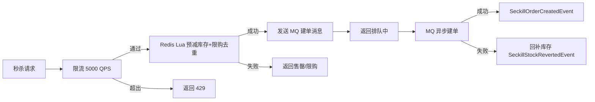
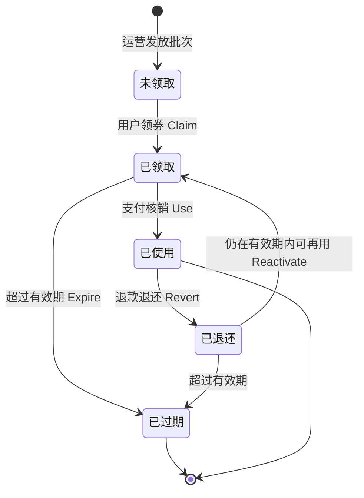
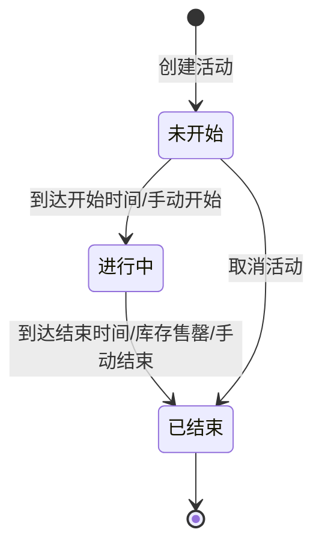

# 促销域需求文档

**所属限界上下文**：BC5 促销域
**文档版本**：V2.3
**创建日期**：2026-07-09

本版补充与积分与会员域（积分换券）和消息通知域（秒杀/券通知）的对接关系，并新增积分兑换优惠券功能点；另补充运营端秒杀活动详情与取消、满减规则详情与删除、优惠券使用明细查询端点，并新增满额赠规则管理功能点（FP-14）。

## 1 上下文概述

促销域负责优惠券、限时秒杀、满减折扣与满额赠四类营销能力，是订单结算链路的优惠计算源头。本上下文权威持有优惠券批次与领用记录、秒杀活动配置与活动库存、满减折扣规则、满额赠规则，下游上下文不直接引用促销聚合对象，而是在结算时调用促销域的应用服务或消费促销集成事件获取优惠结果。促销本身不持有商品价格与可售库存，秒杀商品的基础信息与原价由商品域权威持有，秒杀价与活动库存由本上下文独立配置。

职责边界限定为六项：优惠券批次的创建发放与领用核销退还、秒杀活动的配置与高并发预减库存、满减折扣规则的配置与计算、满额赠规则的配置与支付成功事件触发、订单结算时的优惠试算与最终计算、促销相关领域事件的发布。订单金额的汇总、库存的真实扣减、支付流程均不属于促销域自身职责，由订单域承担。

促销域以客户-供应商关系向订单域提供优惠计算能力：订单域在结算与下单时作为下游消费者，调用促销域应用服务获取适用优惠与核销结果；促销域不反向依赖订单域的类型，仅通过订阅订单域集成事件（`OrderPaidEvent` 核销券、`RefundCompletedEvent` 退还券、`OrderPaidEvent` 触发满额赠）完成跨上下文协作。秒杀链路例外——秒杀下单经独立接口入口，由促销域编排限流、Redis 预减库存与 MQ 异步建单，建单结果以集成事件通知订单域。

与相邻上下文的关系如下：

- **订单域**：促销域为上游供给方（客户-供应商关系），提供优惠计算与核销能力；订单域为下游消费者，在结算调用促销试算、在下单绑定券、在支付完成后由促销域订阅 `OrderPaidEvent` 核销。秒杀订单异步建单后，促销域发布 `SeckillOrderCreatedEvent` 通知订单域落单。
- **商品域**：秒杀活动以 SKU ID 引用商品，秒杀价与原价由商品域权威持有，活动库存独立于商品域可售库存基线，互不影响。
- **用户域**：优惠券领用人、秒杀下单人均以用户 ID 引用，促销域不持有用户聚合，仅校验领用人身份与归属。
- **积分与会员域**：积分域用户以积分兑换优惠券时发布 `PointsExchangeCouponRequestedEvent`，本域消费后校验券模板与库存，创建用户优惠券实例并发布 `CouponExchangeSucceededEvent` 回传积分域扣减积分。
- **消息通知域**：秒杀成功、优惠券到账、优惠券即将过期等通知统一经消息通知域（BC9）的 `INotificationService` 发送，本域不直接持有邮件/短信渠道客户端。

上下文映射上，促销域对订单域为上游供给方（客户-供应商关系），对商品域、用户域为下游消费者（客户-供应商关系，按 ID 引用而非对象引用）。

## 2 领域模型设计

### 2.1 聚合与实体

本上下文包含四个聚合根：Coupon（优惠券批次）、SeckillActivity（秒杀活动）、PromotionRule（满减折扣规则）、GiftRule（满额赠规则）。Coupon 聚合内含 CouponInstance 实体，记录每个用户领取的券实例及其状态。聚合根是外部唯一入口，外部对象只持有聚合根引用，不直接引用 CouponInstance。聚合内不变量由聚合根方法保证，不在应用层散落校验。聚合根、实体、值对象、领域事件均属领域层，不依赖任何其他层。

#### 2.1.1 Coupon 聚合根（优惠券批次）

| 字段名 | 类型 | 说明 | 约束 |
|-|-|-|-|
| CouponId | Guid | 优惠券批次唯一标识 | 主键，创建时生成 |
| Name | string | 批次名称 | 1-64 字 |
| Type | DiscountType | 优惠券类型 | 值对象：满减/折扣/无门槛 |
| DiscountValue | DiscountValue | 面额或折扣率 | 值对象，满减为金额 >0，折扣为 0-1 之间小数 |
| Threshold | Money? | 使用门槛（满 X 元可用） | 无门槛券为空，满减券必填且 >0 |
| Validity | TimeWindow | 有效期窗口 | 值对象，含开始/结束时间，结束晚于开始 |
| TotalQuota | int | 发放总量 | ≥0 |
| IssuedCount | int | 已领取量 | 0≤已领量≤发放量 |
| UsedCount | int | 已使用量 | 0≤已用量≤已领量 |
| Scope | CouponScope | 适用范围 | 值对象：全场/指定分类/指定商品/指定店铺 |
| PerUserLimit | int | 每人领取上限 | ≥1，默认 1 |
| Stackable | bool | 是否可与满减叠加 | 默认 false |
| Status | CouponTemplateStatus | 批次状态 | 草稿/生效中/已停发/已失效 |
| Instances | List&lt;CouponInstance&gt; | 领用实例集合 | 按用户与实例访问，不全量加载 |
| CreatedAt | DateTime | 创建时间 | 审计字段，UTC |
| UpdatedAt | DateTime | 更新时间 | 审计字段，UTC |

`CouponInstance` 实体字段：

| 字段名 | 类型 | 说明 | 约束 |
|-|-|-|-|
| InstanceId | Guid | 领用实例唯一标识 | 主键 |
| CouponId | Guid | 所属批次 | 外键，非空 |
| ClaimantId | Guid | 领用人用户 ID | 非空，引用用户域 |
| Status | CouponStatus | 实例状态 | 值对象：未领取/已领取/已使用/已过期/已退还 |
| ClaimedAt | DateTime | 领取时间 | UTC |
| Source | ClaimSource | 领取来源 | 枚举：Activity/Exchange，默认 Activity |
| BoundOrderId | Guid? | 预占绑定订单 ID | 下单校验时绑定，核销或释放后清空 |
| UsedOrderId | Guid? | 核销订单 ID | 已使用态填充 |
| UsedAt | DateTime? | 核销时间 | 已使用态填充 |
| ExpiredAt | DateTime? | 过期时间 | 已过期态填充 |
| RevertedAt | DateTime? | 退还时间 | 已退还态填充 |

值对象：

- `DiscountType`：枚举值对象，满减（FullReduction）/折扣（Discount）/无门槛（NoThreshold），不可变。
- `DiscountValue`：封装面额或折扣率，构造时按类型校验（满减金额 >0，折扣率 0-1），不可变。
- `CouponStatus`：实例状态枚举值对象，未领取/已领取/已使用/已过期/已退还。
- `ClaimSource`：领取来源枚举值对象，Activity（活动领取/赠券）/Exchange（积分兑换），默认 Activity。
- `CouponScope`：适用范围值对象，含范围类型与目标 ID 集合（分类/商品/店铺 ID）。
- `TimeWindow`：时间窗口值对象，含开始与结束时间，构造时校验结束晚于开始，提供 `Contains(at)` 判定。
- `CouponTemplateStatus`：批次状态枚举值对象，草稿/生效中/已停发/已失效。

聚合根方法行为意图明确，避免贫血模型：

- `Issue(...)`：工厂方法，运营创建优惠券批次，校验类型与面额/门槛匹配（满减券门槛必填、折扣券折扣率合法）、有效期合法、发放量 ≥0，初始状态为草稿，产出 `CouponIssuedEvent`。
- `Publish()`：批次从草稿流转至生效中，开始接受领券。
- `Stop()`：批次停发，不再接受新领券，已领取券仍可使用至过期。
- `Claim(userId, now, source = Activity)`：领券，校验批次为生效中、在有效期内、剩余量（TotalQuota-IssuedCount）>0、该用户已领量 < PerUserLimit，创建 `CouponInstance`（状态=已领取，Source 记入来源），IssuedCount++，产出 `CouponClaimedEvent`。不变量：领后已领量 ≤ 发放量。
- `ValidateForOrder(instanceId, orderId, orderAmount, lineItems, now)`：下单校验并预占，校验实例状态=已领取、在有效期内、未绑定其他订单、门槛满足、适用范围匹配订单行，绑定 BoundOrderId（预占），不改状态。
- `Release(instanceId, orderId)`：订单取消时释放预占，校验绑定一致，清空 BoundOrderId，状态保持已领取。
- `Use(instanceId, orderId, now)`：支付核销，校验绑定一致与状态=已领取，状态流转至已使用，记录 UsedOrderId/UsedAt，UsedCount++，产出 `CouponUsedEvent`。不变量：核销后已用量 ≤ 已领量。
- `Revert(instanceId, orderId, now)`：退款退还，校验状态=已使用且订单一致，状态流转至已退还，记录 RevertedAt，UsedCount--，产出 `CouponRevertedEvent`。
- `Reactivate(instanceId, now)`：已退还态且仍在有效期内时恢复为已领取态，供退款撤销等场景使用，校验状态=已退还且当前时间在有效期内，状态流转回已领取。
- `Expire(instanceId, now)`：超过有效期，已领取态流转至已过期，记录 ExpiredAt，产出 `CouponExpiredEvent`。
- `CalculateDiscount(orderAmount)`：按类型计算优惠金额，满减为 min(面额, orderAmount-门槛后抵扣)、折扣为 orderAmount×(1-折扣率)、无门槛为 min(面额, orderAmount)，返回优惠后金额不可为负。

优惠券核销与退还的不变量恒成立：`0 ≤ 已用量 ≤ 已领量 ≤ 发放量`。Claim 保证已领量 ≤ 发放量，Use 保证已用量 ≤ 已领量，Revert 保证已用量 ≥0。领券并发防超发不依赖聚合全量加载：高并发领券在基础设施层以 Redis 原子预减领券库存（TotalQuota-IssuedCount）先行扣减，成功后再持久化实例与聚合计数，聚合方法 `Claim` 封装领域规则。

**关键警告**：CouponInstance 不可被订单域等外部上下文直接引用，订单域持有的是券实例 ID 与优惠快照，不持有实例对象。

#### 2.1.2 SeckillActivity 聚合根（秒杀活动）

| 字段名 | 类型 | 说明 | 约束 |
|-|-|-|-|
| ActivityId | Guid | 秒杀活动唯一标识 | 主键，创建时生成 |
| SkuId | Guid | 秒杀商品 SKU | 非空，引用商品域 |
| SeckillPrice | Money | 秒杀价 | >0，低于商品原价 |
| TotalStock | int | 活动库存总量 | ≥1，独立于商品域可售库存 |
| PreDeductedCount | int | 已预减库存 | 0≤已预减≤活动总量 |
| AvailableStock | int | 剩余可预减库存 | =活动总量-已预减，≥0 |
| TimeWindow | TimeWindow | 活动时间窗口 | 含开始/结束，结束晚于开始 |
| PerUserLimit | int | 每人限购 | 默认 1 |
| Status | SeckillStatus | 活动状态 | 值对象：未开始/进行中/已结束 |
| CreatedAt | DateTime | 创建时间 | 审计字段，UTC |
| UpdatedAt | DateTime | 更新时间 | 审计字段，UTC |

值对象：

- `SeckillStatus`：活动状态枚举值对象，未开始/进行中/已结束。

聚合根方法：

- `Configure(...)`：工厂方法，运营创建秒杀活动，校验秒杀价 < 原价（原价由商品域查询）、活动库存 ≥1、时间窗口合法、每人限购 ≥1，初始状态为未开始。
- `Start(now)`：到达开始时间或手动开始，未开始流转至进行中，活动库存载入 Redis 预减计数器。
- `PreDeductStock(userId, now)`：预减库存领域规则，校验状态=进行中、在时间窗口内、剩余库存 >0、该用户未达限购，AvailableStock--、PreDeductedCount++，产出 `SeckillStockPreDeductedEvent`，返回预减令牌。不变量：预减后剩余 ≥0。
- `RevertStock(preDeductToken, reason)`：建单失败或超时回补，AvailableStock++、PreDeductedCount--，产出 `SeckillStockRevertedEvent`。
- `ConfirmOrder(preDeductToken, orderId)`：建单成功确认，记录订单与令牌对应，产出 `SeckillOrderCreatedEvent`。
- `End(now)`：到达结束时间或库存售罄或手动结束，进行中流转至已结束，停止预减。

秒杀高并发路径不逐请求加载聚合：活动开始时将 AvailableStock 与每用户限购集合载入 Redis，秒杀接口以 Redis Lua 脚本原子执行 check-and-decrement（剩余 >0 且用户未达限购才预减），聚合方法 `PreDeductStock` 表达领域规则，Redis Lua 是其在高并发下的原子实现。聚合的 AvailableStock 与 PreDeductedCount 由对账任务周期校正。

#### 2.1.3 PromotionRule 聚合根（满减折扣规则）

| 字段名 | 类型 | 说明 | 约束 |
|-|-|-|-|
| RuleId | Guid | 规则唯一标识 | 主键，创建时生成 |
| Name | string | 规则名称 | 1-64 字 |
| RuleType | RuleType | 规则类型 | 值对象：满减/折扣/阶梯满减 |
| Threshold | Money? | 满足门槛 | 满减必填 >0，折扣可空 |
| DiscountValue | DiscountValue | 减额或折扣率 | 值对象，满减为金额，折扣为 0-1 |
| Scope | PromotionScope | 适用范围 | 值对象：全场/分类/商品/店铺 |
| Stackable | bool | 是否可与优惠券叠加 | 默认 false |
| Priority | int | 优先级 | ≥0，值大优先 |
| Validity | TimeWindow | 生效时间窗口 | 含开始/结束 |
| Status | RuleStatus | 规则状态 | 值对象：草稿/生效/停用 |
| CreatedAt | DateTime | 创建时间 | 审计字段，UTC |
| UpdatedAt | DateTime | 更新时间 | 审计字段，UTC |

值对象：

- `RuleType`：满减（FullReduction）/折扣（Discount）/阶梯满减（TieredFullReduction）枚举值对象。
- `PromotionScope`：适用范围值对象，含范围类型与目标 ID 集合。
- `RuleStatus`：草稿/生效/停用枚举值对象。

聚合根方法：

- `Configure(...)`：工厂方法，运营创建满减折扣规则，校验类型与门槛/折扣值匹配、有效期合法。
- `Enable()` / `Disable()`：规则生效与停用。
- `CalculateDiscount(orderAmount, lineItems, now)`：策略模式入口，校验状态=生效、在有效期内、适用范围匹配，按 RuleType 委托对应策略计算优惠金额，返回不可为负的结果。

#### 2.1.4 GiftRule 聚合根（满额赠规则）

| 字段名 | 类型 | 说明 | 约束 |
|-|-|-|-|
| RuleId | Guid | 满额赠规则唯一标识 | 主键，创建时生成 |
| ThresholdAmount | Money | 满额门槛金额 | >0，订单实付达此金额触发赠券 |
| GiftCouponId | Guid | 赠送优惠券批次 | 外键，引用 Coupon 聚合，非空 |
| Status | GiftRuleStatus | 规则状态 | 值对象：草稿/生效/停用 |
| CreatedAt | DateTime | 创建时间 | 审计字段，UTC |
| UpdatedAt | DateTime | 更新时间 | 审计字段，UTC |

值对象：

- `GiftRuleStatus`：草稿/生效/停用枚举值对象。

聚合根方法：

- `Configure(...)`：工厂方法，运营创建满额赠规则，校验门槛金额 >0、赠券批次存在且为生效中（券模板校验经应用层跨聚合查询），初始状态为草稿。
- `Enable()` / `Disable()`：规则生效与停用，仅生效态规则参与满额赠判断。

满额赠判断不在 GiftRule 聚合内完成优惠计算：订单支付成功事件触发时，应用层加载所有生效态 GiftRule，按 ThresholdAmount 匹配订单实付金额，达门槛则向买家调用 `Coupon.Claim(userId, now)` 发放 GiftCouponId 对应券实例，复用 FP-02 的赠券链路与每人上限约束。

#### 2.1.5 聚合边界说明

CouponInstance 作为 Coupon 聚合内的实体而非独立聚合，理由有二：第一，券量恒等式（已用量≤已领量≤发放量）需要在领用与核销时与批次计数协同维护，置于同一聚合可由聚合根统一保证；第二，实例状态流转（领取/核销/退还/过期）与批次计数变更在同一事务内完成，避免跨聚合一致性问题。秒杀活动库存与商品域可售库存分离为独立聚合，避免高频预减冲击商品聚合。满减规则独立为聚合，因其配置低频而计算高频，独立聚合便于按适用范围批量加载计算。满额赠规则独立为聚合，配置低频而触发由订单支付事件驱动，独立聚合便于按生效态批量加载匹配门槛。

### 2.2 领域服务

促销域以策略模式封装优惠计算的选择逻辑，不同类型（满减/折扣/无门槛/阶梯满减）对应不同策略，避免在聚合内堆叠分支判断。

- `IDiscountCalculationService`：优惠计算领域服务，根据优惠券类型或满减规则类型选择策略计算优惠。策略接口 `IDiscountStrategy` 与实现 `FullReductionStrategy`、`DiscountStrategy`、`NoThresholdStrategy`、`TieredFullReductionStrategy` 定义在领域层。服务还负责优惠叠加裁决：单订单最多 1 张优惠券，满减按适用范围自动触发，券与满减是否叠加由券的 Stackable 标志决定，叠加后优惠总额不可使订单金额为负。
- `ISeckillStockDomainService`：秒杀库存预减领域服务，封装预减的领域规则——校验活动状态、时间窗口、每人限购、剩余库存，定义预减令牌与建单的对应关系，以及预减计数与建单成功/回补的对账规则。
- `ICouponClaimChecker`：跨实例校验每人领取上限，需查询用户在该批次下的已领量，跨实例查询无法归入单聚合根，由领域服务依赖仓储查询完成。

应用层 `ICouponAppService`、`ISeckillAppService`、`IPromotionAppService` 编排用例并控制事务边界：领券（Redis 预减 + 聚合 Claim）、核销（订阅 `OrderPaidEvent` + 聚合 Use）、退还（订阅 `RefundCompletedEvent` + 聚合 Revert）、秒杀下单（限流 + Redis Lua 预减 + MQ 发送）、满减试算（加载适用规则 + 策略计算）。应用服务方法名体现用例，如 `ClaimCouponAsync`、`UseCouponAsync`、`PlaceSeckillOrderAsync`、`TryCalculateAsync`。

### 2.3 仓储接口

仓储接口定义在领域层，基础设施层提供实现。秒杀活动库存与领券库存的高并发计数走 Redis，聚合配置与计数基线走 DB。

```csharp
// 领域层
public interface ICouponRepository
{
    Task<Coupon?> GetByIdAsync(Guid couponId, CancellationToken ct = default);
    Task<CouponInstance?> GetInstanceAsync(Guid instanceId, CancellationToken ct = default);
    Task<IReadOnlyList<CouponInstance>> GetByUserAsync(Guid userId, CouponStatus? status, CancellationToken ct = default);
    Task<int> CountClaimedByUserAsync(Guid couponId, Guid userId, CancellationToken ct = default);
    Task<(IReadOnlyList<Coupon> Items, int Total)> QueryAsync(CouponQuery query, CancellationToken ct = default);
    Task AddAsync(Coupon coupon, CancellationToken ct = default);
    Task UpdateAsync(Coupon coupon, CancellationToken ct = default);
    Task RemoveAsync(Guid couponId, CancellationToken ct = default);
}

public interface ICouponStockStore  // 领券库存高并发计数，Redis 原子预减
{
    Task<bool> TryPreDeductAsync(Guid couponId, int quantity, CancellationToken ct = default);
    Task RestoreAsync(Guid couponId, int quantity, CancellationToken ct = default);
    Task<int> GetRemainingAsync(Guid couponId, CancellationToken ct = default);
}

public interface ISeckillRepository
{
    Task<SeckillActivity?> GetByIdAsync(Guid activityId, CancellationToken ct = default);
    Task<SeckillActivity?> GetBySkuAsync(Guid skuId, DateTime at, CancellationToken ct = default);
    Task<(IReadOnlyList<SeckillActivity> Items, int Total)> QueryAsync(SeckillQuery query, CancellationToken ct = default);
    Task AddAsync(SeckillActivity activity, CancellationToken ct = default);
    Task UpdateAsync(SeckillActivity activity, CancellationToken ct = default);
}

public interface ISeckillStockStore  // 秒杀库存高并发预减，Redis Lua 原子
{
    Task<PreDeductResult> TryPreDeductAsync(Guid activityId, Guid userId, int quantity, CancellationToken ct = default);
    Task RestoreAsync(Guid activityId, string preDeductToken, CancellationToken ct = default);
    Task LoadAsync(Guid activityId, int totalStock, int perUserLimit, CancellationToken ct = default);
}

public interface IPromotionRuleRepository
{
    Task<PromotionRule?> GetByIdAsync(Guid ruleId, CancellationToken ct = default);
    Task<IReadOnlyList<PromotionRule>> FindApplicableAsync(PromotionScope scope, DateTime at, CancellationToken ct = default);
    Task AddAsync(PromotionRule rule, CancellationToken ct = default);
    Task UpdateAsync(PromotionRule rule, CancellationToken ct = default);
    Task RemoveAsync(Guid ruleId, CancellationToken ct = default);
}

public interface IGiftRuleRepository
{
    Task<GiftRule?> GetByIdAsync(Guid ruleId, CancellationToken ct = default);
    Task<IReadOnlyList<GiftRule>> FindActiveAsync(DateTime at, CancellationToken ct = default);
    Task<(IReadOnlyList<GiftRule> Items, int Total)> QueryAsync(GiftRuleQuery query, CancellationToken ct = default);
    Task AddAsync(GiftRule rule, CancellationToken ct = default);
    Task UpdateAsync(GiftRule rule, CancellationToken ct = default);
    Task RemoveAsync(Guid ruleId, CancellationToken ct = default);
}
```

基础设施层落点：`EfCoreCouponRepository`、`EfCoreSeckillRepository`、`EfCorePromotionRuleRepository`、`EfCoreGiftRuleRepository` 实现 DB 持久化（DbContext 仅在本层可见）；`RedisCouponStockStore` 实现领券库存原子预减；`RedisSeckillStockStore` 以 Lua 脚本实现秒杀库存 check-and-decrement 与每用户限购去重；限流与 MQ 异步建单消费者位于基础设施层 `Messaging`、`Caching` 子目录。

### 2.4 分层落点

| 分层 | 促销域落点 | 职责 |
|-|-|-|
| 领域层 | Coupon/SeckillActivity/PromotionRule/GiftRule 聚合、CouponInstance 实体、DiscountType/DiscountValue/CouponStatus/ClaimSource/TimeWindow/CouponScope/GiftRuleStatus 值对象、`IDiscountCalculationService`（策略模式）、`ISeckillStockDomainService`、领域事件、`ICouponRepository`/`ISeckillRepository`/`IPromotionRuleRepository`/`IGiftRuleRepository` 仓储接口 | 封装业务规则与不变量 |
| 应用层 | `ICouponAppService`、`ISeckillAppService`、`IPromotionAppService`、`IGiftRuleAppService`、DTO、Command/Query；秒杀限流与 MQ 异步建单编排、领券/核销/退还用例编排、满额赠规则配置与触发编排 | 用例编排与事务边界 |
| 基础设施层 | `EfCoreCouponRepository`/`EfCoreSeckillRepository`/`EfCorePromotionRuleRepository`/`EfCoreGiftRuleRepository`、`RedisSeckillStockStore`（Lua 预减）、`RedisCouponStockStore`、限流实现（滑动窗口）、MQ 异步建单消费者、过期任务调度 | 持久化、缓存、消息、限流 |
| 表现层 | `CouponController`、`SeckillController`、`PromotionController`、`GiftRuleController` | 接收请求、调用应用服务、返回 DTO |

## 3 领域事件清单

领域事件在聚合方法中产生、在当前上下文内消费，跨上下文传递经事件总线以集成事件形式发布。促销域消费的入站集成事件：订单域 `OrderPaidEvent`（触发券核销与满额赠判断）、`RefundCompletedEvent`（触发券退还）、`OrderCancelledEvent`（触发券预占释放）、积分与会员域 `PointsExchangeCouponRequestedEvent`（触发积分换券）。

| 事件名 | 触发时机 | 消费方 | 关键字段 |
|-|-|-|-|
| `CouponIssuedEvent` | 运营创建并发布优惠券批次 | 用户域（通知）、分析 | CouponId, Type, DiscountValue, TotalQuota, Validity, Scope |
| `CouponClaimedEvent` | 用户领券成功 | 分析、消息通知域（券到账通知） | CouponId, InstanceId, UserId, ClaimedAt |
| `CouponUsedEvent` | 支付成功核销优惠券 | 促销域内部（更新使用量） | CouponId, InstanceId, UserId, OrderId, DiscountAmount, UsedAt |
| `CouponExpiredEvent` | 优惠券超过有效期 | 促销域内部、消息通知域（过期提醒） | CouponId, InstanceId, ExpiredAt |
| `CouponRevertedEvent` | 退款退还优惠券 | 促销域内部（回滚使用量） | CouponId, InstanceId, OrderId, RevertedAt |
| `CouponExchangeSucceededEvent` | 积分兑换优惠券创建实例成功 | 积分与会员域（扣减积分） | CouponId, InstanceId, UserId, PointsCost, ExchangedAt |
| `CouponExchangeFailedEvent` | 积分兑换优惠券失败 | 积分与会员域（不扣减积分） | CouponId, UserId, PointsCost, FailReason, FailedAt |
| `SeckillStockPreDeductedEvent` | 秒杀 Redis 预减库存成功 | 秒杀建单消费者 | ActivityId, SkuId, UserId, PreDeductToken, SeckillPrice |
| `SeckillOrderCreatedEvent` | 秒杀订单异步创建成功 | 订单域（落单）、库存、消息通知域（秒杀成功通知） | ActivityId, SkuId, UserId, OrderId, SeckillPrice |
| `SeckillStockRevertedEvent` | 秒杀建单失败或超时回补库存 | 促销域内部 | ActivityId, PreDeductToken, Reason |

聚合保存与事件记录在同一事务写入（发件箱模式），后台进程轮询发件箱表并发布到消息队列，消费失败进入死信队列重试。

## 4 功能需求

### 功能点概览表

| 编号 | 功能模块 | 功能描述 |
|-|-|-|
| FP-01 | 优惠券创建与发放（运营） | 运营创建优惠券批次并配置发放规则 |
| FP-02 | 满额自动赠券 | 订单支付达门槛自动赠券 |
| FP-03 | 用户领券 | 买家主动领取优惠券 |
| FP-04 | 我的优惠券列表 | 查询用户已领优惠券及状态 |
| FP-05 | 下单使用优惠券校验 | 下单时校验并预占优惠券 |
| FP-06 | 优惠券核销（CouponUsedEvent） | 支付成功核销优惠券并更新使用量 |
| FP-07 | 退款退还优惠券 | 退款完成退还优惠券并回滚使用量 |
| FP-08 | 限时秒杀活动配置 | 运营配置秒杀活动与活动库存 |
| FP-09 | 秒杀独立接口（限流+Redis预减库存+MQ异步建单） | 高并发秒杀下单入口 |
| FP-10 | 秒杀订单异步创建 | MQ 消费者异步创建秒杀订单 |
| FP-11 | 满减/折扣规则配置 | 运营配置满减折扣规则 |
| FP-12 | 订单结算自动计算优惠（策略模式） | 结算时按规则与券自动计算优惠 |
| FP-13 | 积分兑换优惠券 | 用户以积分兑换优惠券，跨域协作扣减积分 |
| FP-14 | 满额赠规则管理（运营） | 运营配置满额赠规则（门槛与赠券批次绑定）并启停 |

### FP-01 优惠券创建与发放（运营）

业务逻辑：运营在促销后台填写批次名称、类型（满减/折扣/无门槛）、面额或折扣率、使用门槛、有效期、发放总量、适用范围、每人领取上限、是否可叠加，调用 `Coupon.Issue(...)` 创建草稿批次，再调用 `Publish()` 发布生效。发布后批次接受领券。产出 `CouponIssuedEvent`。

交互逻辑：`POST /api/admin/coupons` 创建，`POST /api/admin/coupons/{couponId}/publish` 发布；运营在工作台预览面额与门槛后提交，批次详情与券实例核销明细经 `GET /api/admin/coupons/{couponId}` 与 `/instances` 查询。

规则约束：满减券门槛必填且 >0；折扣率 0-1；无门槛券门槛为空；有效期结束晚于开始；发放量 ≥0；每人领取上限 ≥1；面额不可超过单订单最大金额。

权限逻辑：仅运营管理员角色可创建与发布；批次创建人记入审计。

边界与异常：并发创建同名批次以名称不唯一约束拦截；发布前校验必填项，缺失返回 400；已停发批次不可重新发布。

### FP-02 满额自动赠券

业务逻辑：订单支付完成时，促销域订阅 `OrderPaidEvent`，按订单实付金额匹配满额赠规则（门槛与赠券批次），达门槛则向买家自动发放指定优惠券，调用 `Coupon.Claim(userId, now)` 创建实例。满额赠规则与优惠券批次预先绑定。

交互逻辑：事件驱动，无前端直接交互；满额赠规则由运营经 FP-14 配置（门槛与赠券批次绑定），赠券结果通过用户域通知推送。

规则约束：仅订单实付金额达门槛触发；同一订单同一满额赠规则只赠一次；赠券受批次剩余量与每人上限约束，量不足时降级或跳过。

权限逻辑：事件驱动，按订单买家 ID 发放。

边界与异常：批次已停发或库存为 0 时跳过并记录；事件重复消费需幂等（按订单 ID 与规则 ID 去重）；满额赠与主动领券共享每人上限。

### FP-03 用户领券

业务逻辑：买家在领券中心查看可领取优惠券，点击领取。应用层先以 `ICouponClaimChecker` 校验该用户在该批次的已领量 < PerUserLimit，再以 `RedisCouponStockStore.TryPreDeductAsync` 原子预减领券库存（TotalQuota-IssuedCount），成功后调用 `Coupon.Claim(userId, now)` 创建实例并持久化计数。产出 `CouponClaimedEvent`。

交互逻辑：`POST /api/coupons/{couponId}/claim`；前端即时反馈领取结果。

规则约束：批次须为生效中且在有效期内；剩余量 >0；每人领取不超 PerUserLimit；领券库存原子预减防超发。

权限逻辑：需登录态，买家只能为自己领券，UserId 取自 JWT。

边界与异常：并发领券以 Redis 原子预减保证不超发，预减失败返回已领完；每人上限超限返回限制提示；批次停发后拒绝领取；Redis 预减成功但聚合持久化失败时回补 Redis 库存。

### FP-04 我的优惠券列表

业务逻辑：买家查询自己已领优惠券及状态，按状态（可用/已用/已过期/已退还）筛选，可查看面额、门槛、有效期、适用范围。查询走读模型（ES 或缓存）。

交互逻辑：`GET /api/coupons/mine?status=...`；下单结算页据此展示可用券。

规则约束：仅返回当前用户的实例；按到期时间排序；可用券须状态=已领取且未过期。

权限逻辑：需登录态，按 JWT 用户 ID 过滤，不可查询他人券。

边界与异常：读模型与写库存在秒级最终一致窗口；过期券由定时任务驱动状态流转，列表即时反映。

### FP-05 下单使用优惠券校验

业务逻辑：买家在结算页选择优惠券，订单域调用促销域 `IPromotionAppService.TryCalculateAsync` 试算优惠，确认使用时调用 `Coupon.ValidateForOrder(instanceId, orderId, orderAmount, lineItems, now)` 校验并预占（绑定 BoundOrderId）。校验项：状态=已领取、在有效期内、未绑定其他订单、门槛满足、适用范围匹配订单行。

交互逻辑：`POST /api/promotions/try-calculate` 试算；下单请求携带 instanceId，订单域绑定后回传预占结果。

规则约束：单订单最多 1 张优惠券；门槛按适用范围商品金额或订单金额校验；适用范围不匹配拒绝使用；已预占给其他订单的券不可重复绑定。

权限逻辑：需登录态，券实例归属须与下单用户一致。

边界与异常：券已过期或已使用返回不可用；门槛不满足返回差额提示；预占后订单未支付超时取消，由 `OrderCancelledEvent` 触发 `Release` 释放预占。

### FP-06 优惠券核销（CouponUsedEvent）

业务逻辑：订单支付成功后，促销域订阅 `OrderPaidEvent`，加载绑定的券实例，调用 `Coupon.Use(instanceId, orderId, now)` 核销，状态流转至已使用，UsedCount++，产出 `CouponUsedEvent`。事件消费方更新使用量与库存。

交互逻辑：事件驱动异步核销，无前端直接交互；支付成功后核销在秒级内完成。

规则约束：核销前校验绑定订单一致与状态=已领取；核销后已用量 ≤ 已领量恒成立；核销幂等（同一订单重复核销无副作用）。

权限逻辑：事件驱动，按订单与券实例归属校验。

边界与异常：券在支付前已过期则核销失败并记录，订单按原价履约；事件重复消费以订单 ID 与实例 ID 去重；核销失败进入死信队列重试。

### FP-07 退款退还优惠券

业务逻辑：售后退款完成时，促销域订阅 `RefundCompletedEvent`，调用 `Coupon.Revert(instanceId, orderId, now)` 退还，状态流转至已退还，UsedCount--，产出 `CouponRevertedEvent`，回滚使用量。

交互逻辑：事件驱动，无前端直接交互；退还后券状态在"我的券"反映。

规则约束：仅已使用态可退还；退还后已用量 ≥0 恒成立；退还幂等（同一订单重复退还无副作用）；退还后券是否可再用由有效期决定。

权限逻辑：事件驱动，按订单与券实例归属校验。

边界与异常：券已过期则退还后不可再用，仅回滚使用量；部分退款是否退还券按业务规则配置；事件重复消费以订单 ID 与实例 ID 去重。

### FP-08 限时秒杀活动配置

业务逻辑：运营选择商品 SKU，配置秒杀价、活动库存、活动时间窗口、每人限购，调用 `SeckillActivity.Configure(...)` 创建未开始态活动。活动开始时由定时任务或手动触发 `Start(now)`，将活动库存与限购集合载入 Redis。结束触发 `End(now)`。

交互逻辑：`POST /api/admin/seckill/activities` 创建，`POST /api/admin/seckill/activities/{activityId}/publish` 发布；运营在工作台预览库存与价格，可经 `GET /api/admin/seckill/activities/{activityId}` 查看活动详情与销量统计，未开始态经 `/cancel` 取消活动。

规则约束：秒杀价 < 商品原价（原价由商品域查询）；活动库存 ≥1；时间窗口合法；每人限购 ≥1，默认 1；同一 SKU 同一时间窗口只允许一个进行中活动。

权限逻辑：仅运营管理员角色可配置与发布。

边界与异常：秒杀价高于原价返回校验错误；活动库存独立于商品域可售库存，互不影响；活动发布后改库存需重新载入 Redis。

### FP-09 秒杀独立接口（限流+Redis预减库存+MQ异步建单）

业务逻辑：买家在秒杀详情页点击抢购，请求进入独立秒杀接口。接口先经限流（滑动窗口，阈值 5000 QPS），再以 `RedisSeckillStockStore.TryPreDeductAsync` 执行 Lua 原子 check-and-decrement：校验活动进行中、剩余库存 >0、该用户未达限购（Redis Set 去重），原子预减成功生成预减令牌。预减成功后向 MQ 发送秒杀建单消息（含 ActivityId、SkuId、UserId、PreDeductToken、SeckillPrice），接口立即返回"排队中"。产出 `SeckillStockPreDeductedEvent`。

秒杀链路流程：



交互逻辑：`POST /api/seckill/orders`（独立接口，与常规下单分离）；响应携带预减令牌供查询建单结果。

规则约束：限流阈值 5000 QPS，超出返回 429；预减原子性由 Lua 脚本保证，不超卖；每人限购 1 件（默认），Redis Set 去重；活动须为进行中且在时间窗口内。

权限逻辑：需登录态，UserId 取自 JWT；买家只能为自己抢购。

边界与异常：限流超出返回 429 并提示稍后重试；库存售罄返回售罄；重复抢购返回限购提示；MQ 发送失败回补 Redis 库存并返回失败；Redis 不可用时降级拒绝抢购。

### FP-10 秒杀订单异步创建

业务逻辑：MQ 消费者接收秒杀建单消息，调用订单域创建秒杀订单（含 SKU 快照、秒杀价、收货地址），建单成功调用 `SeckillActivity.ConfirmOrder(preDeductToken, orderId)` 确认，产出 `SeckillOrderCreatedEvent` 通知订单域落单与通知买家。建单失败（库存对账异常、订单域拒绝等）调用 `RevertStock(preDeductToken, reason)` 回补 Redis 库存，产出 `SeckillStockRevertedEvent`。

交互逻辑：MQ 异步驱动，无前端直接交互；买家通过订单列表或推送查看建单结果。

规则约束：每个预减令牌对应一次建单成功或一次回补，不重复；建单成功后预减计数与订单数对账；建单失败必回补库存。

权限逻辑：消费者为系统内部服务，不对外暴露。

边界与异常：MQ 消费失败进入死信队列重试，超阈值告警；建单超时（令牌 TTL 到期未确认）由定时任务回补库存；重复消费以预减令牌幂等；订单域建单失败原因记录用于补偿。

### FP-11 满减/折扣规则配置

业务逻辑：运营配置满减折扣规则，填写规则类型（满减/折扣/阶梯满减）、门槛、减额或折扣率、适用范围、是否可叠加、优先级、生效时间窗口，调用 `PromotionRule.Configure(...)` 创建草稿，再 `Enable()` 生效。

交互逻辑：`POST /api/admin/promotion-rules` 创建，`POST /api/admin/promotion-rules/{ruleId}/enable` 启用，`POST /api/admin/promotion-rules/{ruleId}/disable` 停用；规则详情经 `GET /api/admin/promotion-rules/{ruleId}` 查询，停用态可经 `DELETE` 删除。

规则约束：满减门槛必填 >0；折扣率 0-1；阶梯满减为门槛-减额阶梯集合；适用范围必填；生效时间窗口合法。

权限逻辑：仅运营管理员角色可配置与启停。

边界与异常：规则启停即时影响结算计算；停用规则不参与计算但保留历史；并发编辑以乐观锁避免冲突。

### FP-12 订单结算自动计算优惠（策略模式）

业务逻辑：订单结算时，订单域调用促销域 `IPromotionAppService.TryCalculateAsync`，应用层加载适用满减规则（`IPromotionRuleRepository.FindApplicableAsync`）与用户可用券，由 `IDiscountCalculationService` 以策略模式计算：满减规则按适用范围触发，券按类型（满减/折扣/无门槛）经对应策略计算，叠加裁决后返回优惠明细与应付金额。计算纯领域逻辑在领域层完成，不触碰外部依赖。

交互逻辑：`POST /api/promotions/try-calculate`；购物车与结算页实时调用展示优惠。

规则约束：单订单最多 1 张优惠券；满减按适用范围自动触发；券与满减叠加由券 Stackable 标志决定；优惠后金额 ≥0，不可为负；策略按 RuleType 选择。

权限逻辑：需登录态（结算），按用户加载可用券；试算可匿名但券部分需登录。

边界与异常：无适用规则或券时返回原价；优惠使金额为负时截断为 0；规则或券查询失败降级返回原价并标记。

### FP-13 积分兑换优惠券

业务逻辑：积分与会员域用户在积分商城选择用积分兑换指定优惠券时，积分域发布 `PointsExchangeCouponRequestedEvent`（含 userId、couponId、pointsCost），本域消费该事件。应用层经 `ICouponRepository` 加载券模板校验是否允许积分兑换、券库存是否充足（Redis 原子预减）、用户是否已达领取上限（`ICouponClaimChecker`）。校验通过后调用 `Coupon.Claim(userId, now, source: Exchange)` 创建用户优惠券实例（Source 标记为 Exchange），附加 `CouponExchangeSucceededEvent`（含 couponId、instanceId、userId、pointsCost）回传积分域正式扣减积分。若校验失败则发布 `CouponExchangeFailedEvent` 回传积分域，积分域不扣减积分。

交互逻辑：积分域发起请求，本域消费事件处理，无直接前端端点；兑换结果经 `CouponExchangeSucceededEvent` 由积分域反馈给用户。

规则约束：券模板须配置 `Exchangeable=true` 与 `PointsCost`；券库存不足拒绝；每人领取上限校验同领券；积分扣减与券实例创建跨上下文，以事件最终一致性保证，券实例创建成功即视为兑换成功。

权限逻辑：系统内部事件驱动，买家不可直接调用本域兑换接口（由积分域编排）。

边界与异常：券模板不存在或不可兑换时发布 `CouponExchangeFailedEvent` 回传积分域，积分域不扣减积分；券库存 Redis 预减成功但实例创建失败时回补库存并发布 `CouponExchangeFailedEvent` 回传积分域；`CouponExchangeSucceededEvent` 重复到达由积分域幂等去重。

### FP-14 满额赠规则管理（运营）

业务逻辑：运营配置满额赠规则，填写门槛金额与赠券批次（GiftCouponId），调用 `GiftRule.Configure(...)` 创建草稿，再 `Enable()` 生效。订单支付成功事件触发满额赠判断时，应用层加载所有生效态规则，按 ThresholdAmount 匹配订单实付金额，达门槛则向买家发放 GiftCouponId 对应券实例，复用 FP-02 的赠券链路与每人上限约束。规则与券批次预先绑定，券批次停发或库存为 0 时该规则触发赠券降级跳过。

交互逻辑：`POST /api/admin/gift-rules` 创建，`PUT /api/admin/gift-rules/{ruleId}` 编辑，`POST /api/admin/gift-rules/{ruleId}/enable` 与 `/disable` 启停，`GET /api/admin/gift-rules` 列表；运营在工作台预览门槛与赠券批次后提交。

规则约束：门槛金额 >0；赠券批次须存在且为生效中；同一赠券批次可被多条规则绑定；规则停用后不再参与满额赠判断，已触发赠券不受影响。

权限逻辑：仅运营管理员角色可配置与启停；配置人记入审计。

边界与异常：券批次被删除或停发时规则触发赠券跳过并记录；规则编辑不影响已发放的赠券实例；并发编辑以乐观锁避免冲突。

## 5 API 设计

接口遵循 RESTful 风格，资源以名词复数命名，鉴权通过 `Authorization: Bearer {token}`。运营接口需运营角色，买家接口需登录态，秒杀列表与详情可公开浏览。统一响应结构含 `code`、`message`、`data` 三段，写操作支持 `Idempotency-Key` 头。秒杀下单为独立接口，与常规下单端点分离。

### 5.1 优惠券管理与发放

| 方法 | 端点 | 说明 | 权限 |
|-|-|-|-|
| POST | /api/admin/coupons | 创建优惠券批次（草稿） | 运营 |
| PUT | /api/admin/coupons/{couponId} | 编辑批次 | 运营 |
| POST | /api/admin/coupons/{couponId}/publish | 发布生效 | 运营 |
| POST | /api/admin/coupons/{couponId}/stop | 停发 | 运营 |
| DELETE | /api/admin/coupons/{couponId} | 删除批次（草稿态） | 运营 |
| GET | /api/admin/coupons | 批次列表（分页、状态筛选） | 运营 |
| GET | /api/admin/coupons/{couponId} | 批次详情（含领用统计） | 运营 |
| GET | /api/admin/coupons/{couponId}/instances | 券实例明细列表（领取人/领取时间/核销状态/核销订单号/核销时间，分页筛选） | 运营 |
| POST | /api/admin/coupons/{couponId}/issue | 定向发放给指定用户 | 运营 |

### 5.2 领券与我的券

| 方法 | 端点 | 说明 | 权限 |
|-|-|-|-|
| GET | /api/coupons/available | 可领取优惠券列表 | 买家 |
| POST | /api/coupons/{couponId}/claim | 领取优惠券 | 买家 |
| GET | /api/coupons/mine | 我的优惠券列表（状态筛选） | 买家 |
| GET | /api/coupons/mine/{instanceId} | 我的券详情 | 买家 |

### 5.3 秒杀活动与下单

| 方法 | 端点 | 说明 | 权限 |
|-|-|-|-|
| POST | /api/admin/seckill/activities | 创建秒杀活动 | 运营 |
| PUT | /api/admin/seckill/activities/{activityId} | 编辑活动 | 运营 |
| POST | /api/admin/seckill/activities/{activityId}/publish | 发布活动 | 运营 |
| POST | /api/admin/seckill/activities/{activityId}/end | 手动结束 | 运营 |
| POST | /api/admin/seckill/activities/{activityId}/cancel | 取消活动（仅未开始态可取消） | 运营 |
| GET | /api/admin/seckill/activities | 活动列表（分页） | 运营 |
| GET | /api/admin/seckill/activities/{activityId} | 活动详情（含配置、参与商品、库存与销量统计） | 运营 |
| GET | /api/seckill/activities | 买家秒杀活动列表（进行中） | 公开 |
| GET | /api/seckill/activities/{activityId} | 秒杀活动详情（含剩余库存） | 公开 |
| POST | /api/seckill/orders | 秒杀下单（独立接口，限流 5000 QPS） | 买家 |
| GET | /api/seckill/orders/result | 查询秒杀建单结果（按预减令牌） | 买家 |

### 5.4 满减规则与优惠试算

| 方法 | 端点 | 说明 | 权限 |
|-|-|-|-|
| POST | /api/admin/promotion-rules | 创建满减折扣规则 | 运营 |
| PUT | /api/admin/promotion-rules/{ruleId} | 编辑规则 | 运营 |
| POST | /api/admin/promotion-rules/{ruleId}/enable | 启用规则 | 运营 |
| POST | /api/admin/promotion-rules/{ruleId}/disable | 停用规则 | 运营 |
| GET | /api/admin/promotion-rules | 规则列表（分页） | 运营 |
| GET | /api/admin/promotion-rules/{ruleId} | 规则详情 | 运营 |
| DELETE | /api/admin/promotion-rules/{ruleId} | 删除规则（仅停用态可删） | 运营 |
| POST | /api/promotions/try-calculate | 优惠试算（规则+券） | 买家/匿名 |

### 5.5 满额赠规则管理

| 方法 | 端点 | 说明 | 权限 |
|-|-|-|-|
| GET | /api/admin/gift-rules | 满额赠规则列表（分页、状态筛选） | 运营 |
| POST | /api/admin/gift-rules | 创建满额赠规则（绑定门槛金额与赠券批次） | 运营 |
| PUT | /api/admin/gift-rules/{ruleId} | 编辑满额赠规则 | 运营 |
| POST | /api/admin/gift-rules/{ruleId}/enable | 启用规则 | 运营 |
| POST | /api/admin/gift-rules/{ruleId}/disable | 停用规则 | 运营 |

## 6 业务规则与不变量

- 券量恒等式：`0 ≤ 已用量 ≤ 已领量 ≤ 发放量`，由 `Claim`/`Use`/`Revert` 在 Coupon 聚合内保证，领后已领量 ≤ 发放量，核销后已用量 ≤ 已领量，退还后已用量 ≥0。
- 领券防超发：并发领券以 `RedisCouponStockStore` 原子预减领券库存（TotalQuota-IssuedCount）保证不超发；每人限领 PerUserLimit 张，由 `ICouponClaimChecker` 跨实例校验。
- 秒杀预减与建单对应：每个预减令牌对应一次建单成功或一次回补，`预减计数 = 建单成功数 + 回补数 + 待建单数`，由 `ISeckillStockDomainService` 对账。
- 秒杀不超卖：`RedisSeckillStockStore` 以 Lua 脚本原子 check-and-decrement，剩余 >0 才预减；每人限购 1 件以 Redis Set 去重。
- 优惠叠加规则：单订单最多 1 张优惠券；满减规则按适用范围自动触发；券与满减是否叠加由券 Stackable 标志决定；叠加后优惠总额不可使订单金额为负，截断为 0。
- 门槛校验：满减券与满减规则按订单金额（或适用范围商品金额）校验门槛；折扣按比例计算；无门槛券直接抵扣面额，抵扣不超过订单金额。
- 有效期：券与规则在 `TimeWindow` 内有效；过期券不可领不可用；过期由定时任务驱动 `Expire` 流转状态。
- 适用范围匹配：优惠券与满减规则的适用范围（全场/分类/商品/店铺）在下单校验时与订单行匹配，不匹配拒绝使用。
- 单聚合事务：单次事务只修改一个聚合，跨聚合协作（核销、退还、秒杀建单）通过领域事件异步完成。
- 秒杀库存独立：秒杀活动库存独立于商品域可售库存基线，互不影响，活动结束未售库存不回写商品域。

## 7 状态机

优惠券实例生命周期状态流转如下，状态由聚合根方法驱动，非法流转抛出领域异常。



已领取态可被下单预占（绑定 BoundOrderId）但状态不变；订单取消释放预占回已领取；支付核销流转至已使用；退款退还流转至已退还，使用量回滚；超过有效期流转至已过期。

秒杀活动状态流转如下。



未开始态不接受预减；进行中态接受秒杀预减；已结束态停止预减，未售库存不再释放。取消活动仅未开始态可发起，进行中或已结束活动不可取消。

## 8 验收标准

验收以 Given/When/Then 形式覆盖核心功能点与边界，重点验证秒杀不超卖、优惠券不超发、核销退还一致性与 MQ 异步建单失败补偿。

### AC-01 优惠券不超发

Given 优惠券批次发放量 100、已领量 99
When 10 个用户并发领券
Then 仅 1 个用户领券成功，已领量变为 100，其余返回已领完，未超发

### AC-02 每人限领

Given 优惠券每人领取上限 1，用户 A 已领 1 张
When 用户 A 再次领券
Then 返回限制提示，已领量不变

### AC-03 领券状态与计数

Given 用户领取一张满减券
When 领券成功
Then 创建 CouponInstance 状态=已领取，批次 IssuedCount++，触发 `CouponClaimedEvent`

### AC-04 下单门槛校验

Given 用户持有满 200 减 30 券，订单金额 150
When 用户结算选择该券
Then 校验门槛不满足，返回差额提示，券不可用

### AC-05 支付核销 CouponUsedEvent

Given 订单绑定券实例且支付成功
When 促销域消费 `OrderPaidEvent`
Then 券状态流转至已使用，UsedCount++，触发 `CouponUsedEvent`，已用量 ≤ 已领量

### AC-06 退款退还 CouponRevertedEvent

Given 已使用券的订单退款完成
When 促销域消费 `RefundCompletedEvent`
Then 券状态流转至已退还，UsedCount--，触发 `CouponRevertedEvent`，已用量 ≥0

### AC-07 核销退还一致性

Given 批次发放量 100、已领量 50、已用量 20
When 5 张已用券因退款退还
Then 已用量变为 15，恒等式 `0 ≤ 15 ≤ 50 ≤ 100` 成立

### AC-08 秒杀不超卖

Given 秒杀活动库存 10
When 100 个用户并发抢购
Then 仅 10 个预减成功，Redis 剩余库存为 0，无超卖

### AC-09 秒杀每人限购 1 件

Given 秒杀每人限购 1，用户 A 已抢购成功
When 用户 A 再次抢购
Then 返回限购提示，Redis 限购 Set 去重生效，不重复预减

### AC-10 秒杀 MQ 异步建单成功

Given 秒杀预减成功并发出建单消息
When MQ 消费者建单成功
Then 调用 `ConfirmOrder`，触发 `SeckillOrderCreatedEvent`，订单域落单，买家可见订单

### AC-11 秒杀 MQ 异步建单失败补偿

Given 秒杀预减成功但 MQ 建单失败
When 消费者重试耗尽
Then 调用 `RevertStock` 回补 Redis 库存，触发 `SeckillStockRevertedEvent`，剩余库存恢复，预减与建单对账平衡

### AC-12 秒杀限流

Given 秒杀接口限流阈值 5000 QPS
When 请求速率超过 5000 QPS
Then 超出请求返回 429，未超出请求正常预减

### AC-13 满额自动赠券

Given 满额赠规则门槛 500，赠券批次有库存
When 订单实付 600 支付完成触发 `OrderPaidEvent`
Then 向买家发放赠券，触发 `CouponClaimedEvent`，受每人上限约束

### AC-14 满减策略计算

Given 满 200 减 30 规则生效，订单金额 250
When 结算试算
Then 满减策略触发，优惠 30，应付 220

### AC-15 优惠叠加不为负

Given 订单金额 100，券面额 120（无门槛）
When 核销计算优惠
Then 优惠截断为 100，应付 0，不为负

### AC-16 优惠券过期

Given 用户持有券且有效期已过
When 定时任务驱动 `Expire`
Then 券状态流转至已过期，触发 `CouponExpiredEvent`，不可再使用

### AC-17 秒杀活动状态流转

Given 秒杀活动处于未开始
When 到达开始时间
Then 活动流转至进行中，活动库存载入 Redis；到达结束时间流转至已结束，停止预减
