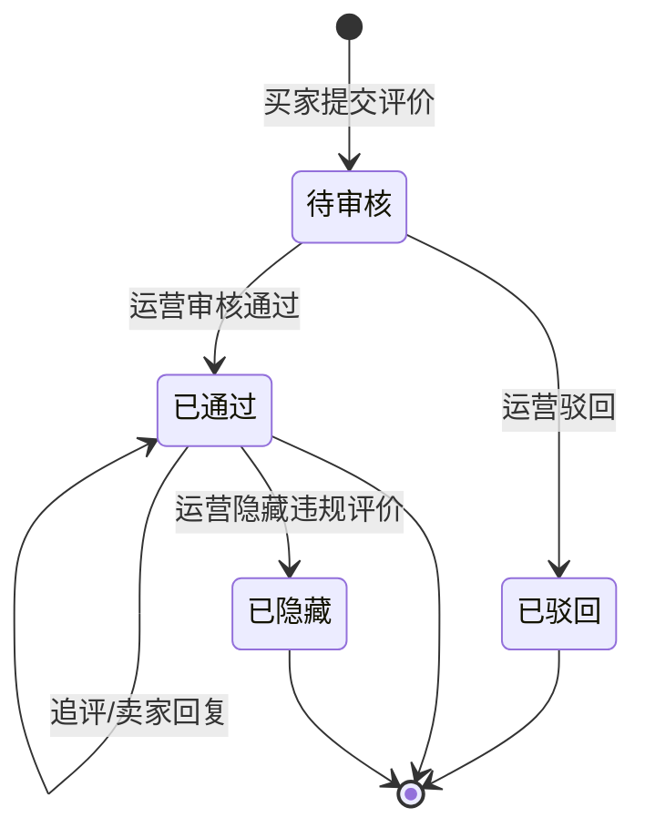
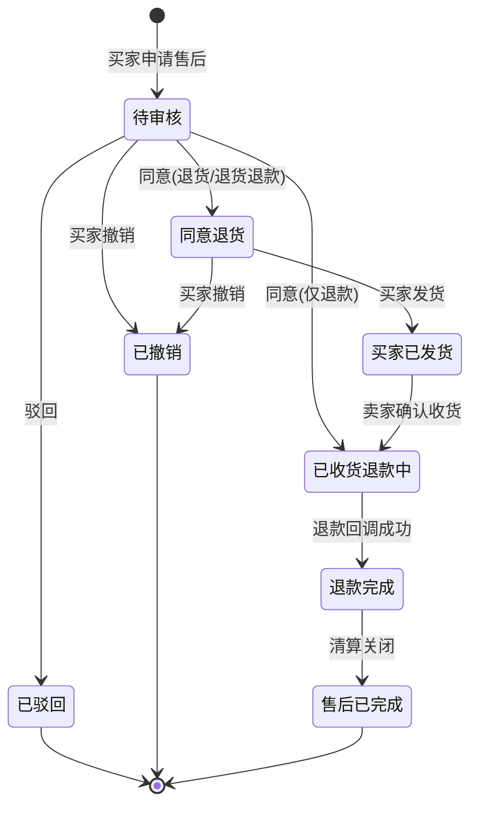

# 评价与售后域需求文档

**所属限界上下文**：BC6 评价与售后域
**文档版本**：V2.4
**创建日期**：2026-07-09

本域对应总览文档限界上下文表中的 BC6，覆盖商品评价与退货退款售后单两条业务线，对应原始需求 3.6 节。文档遵循 `00-需求文档总览与DDD架构.md` 第 4 章分层架构规范、第 3 章共享内核与统一语言，并与第 5 章跨上下文事件契约保持一致。本版将退款执行剥离至支付集成域（BC8），本域仅发起退款请求并消费退款结果；评价审核通过后向积分与会员域（BC7）发放评价积分，通知统一经消息通知域（BC9）发送。

## 1 上下文概述

### 1.1 职责

本域承担两类业务对象的生命周期管理：一是订单完成后买家对所购商品的评价（打分、文字、图片，审核后展示），二是买家发起的退货退款售后单（退货、退款、退货退款三种类型的状态流转）。评价聚合权威持有评价内容与审核状态，售后单聚合权威持有售后申请、审核、退货物流与退款事实。评分摘要与销量回滚不在本域计算，本域只负责发布事件交由商品域与订单域消费。

### 1.2 边界

本域内部包含两个聚合根：**Review**（评价聚合根）与 **AfterSales**（售后单聚合根）。评价以订单行 ID 为最小单位，一个订单行只能有一条主评价；售后单可关联整单或单个订单行。退款金额、评分、售后类型等以值对象表达。本域不持有订单、商品、优惠券聚合对象，只以 ID 引用，订单实付金额、商品归属、优惠券核销记录通过查询接口或集成事件获取。图片存储统一通过共享内核定义的 `IFileStorageService` 抽象由基础设施层实现，支付退款调用经集成事件请求支付集成域，二者均属基础设施层技术能力，本域不自行实现。

### 1.3 与其他上下文的关系

评价与售后由订单完成或售后触发的事件驱动，与六个上下文存在协作：

- 订单域 → 评价与售后域（客户-供应商）：订单完成时发布 `OrderCompletedEvent`，本域消费该事件开放对应订单行的评价入口；售后申请与退款以订单行实付金额为上限，订单域提供订单与订单行快照查询。退款完成发布 `RefundCompletedEvent`，订单域消费以回滚销量。
- 商品域 → 评价与售后域 / 评价与售后域 → 商品域（客户-供应商）：评价归属商品，以 productId、skuId 引用商品聚合；评价提交后发布 `ReviewSubmittedEvent`，商品域消费回写商品评分摘要（score、reviewCount、好评率）。
- 促销域（客户-供应商）：退款完成发布 `RefundCompletedEvent`，促销域消费按规则退还该订单已核销的优惠券（恢复券使用量与库存）。
- 支付集成域（ACL/共享内核事件）：售后退款审核通过后，本域发布 `RefundRequestedIntegrationEvent` 请求支付集成域（BC8）执行退款；支付集成域对接微信/支付宝完成退款后发布 `RefundSucceededIntegrationEvent`，本域消费该事件触发 `AfterSales.ConfirmRefund` 完成退款事实记录。本域不持有支付渠道客户端。
- 积分与会员域（经集成事件）：评价审核通过发布 `ReviewApprovedEvent`，积分与会员域消费发放评价积分；退款完成发布 `RefundCompletedEvent`，积分与会员域消费扣回已发放的消费积分。
- 消息通知域（客户-供应商）：售后状态变更、评价审核结果等通知统一经消息通知域（BC9）的 `INotificationService` 发送，本域不直接持有邮件/短信渠道客户端。
- 用户域：评价与售后单归属买家，以 userId 引用，不跨聚合持有对象；JWT 中携带用户 ID 与角色声明供本域鉴权。

### 1.4 事件契约引用

本域对外发布的集成事件遵循总览文档第 5 章约定，核心事件为 `ReviewSubmittedEvent`（消费方商品域）、`ReviewApprovedEvent`（消费方积分与会员域、消息通知域）、`ReviewHiddenEvent`（消费方商品域、消息通知域）、`RefundRequestedIntegrationEvent`（消费方支付集成域）与 `RefundCompletedEvent`（消费方订单域、促销域、积分与会员域、消息通知域）。本域入站消费 `OrderCompletedEvent`（订单域，开放评价入口）、`RefundSucceededIntegrationEvent`（支付集成域，驱动退款完成）与 `RefundFailedIntegrationEvent`（支付集成域，重试或转人工）。事件经发件箱模式与聚合持久化在同一事务写入，后台进程发布到事件总线，消费失败进入死信队列重试。

## 2 领域模型设计

### 2.1 聚合与实体

本域设两个聚合根：**Review** 与 **AfterSales**。两者均以订单行 ID 为业务锚点，但分属不同聚合，单次事务只修改其一，跨聚合协作通过领域事件异步完成。

#### 2.1.1 Review 聚合根

Review 是商品评价的聚合根，封装评分、文字、图片与审核状态，所有变更通过行为意图明确的方法完成，禁止外部直接 set 字段。

| 字段名 | 类型 | 说明 | 约束 |
|-|-|-|-|
| ReviewId | Guid | 评价唯一标识 | 主键，创建时生成 |
| OrderId | Guid | 订单标识 | 非空，引用订单聚合 |
| OrderLineId | Guid | 订单行标识 | 非空，同一订单行仅一条主评价 |
| ProductId | Guid | 商品 SPU 标识 | 非空，引用商品聚合 |
| SkuId | Guid | SKU 标识 | 非空 |
| UserId | Guid | 评价人（买家） | 非空，须为订单买家 |
| Rating | Rating | 评分（值对象） | 1–5 整数 |
| Content | string | 文字内容 | 1–500 字 |
| Images | List&lt;string&gt; | 图片 URL 列表 | 0–9 张，HTTPS |
| Status | ReviewStatus | 审核状态 | 枚举 Pending/Approved/Rejected/Hidden |
| AdditionalReview | AdditionalReview? | 追评（值对象） | 可空，已通过且未追评时可追加一次 |
| SellerReply | string? | 卖家回复内容 | 可空，≤500 字 |
| SubmittedAt | DateTime | 提交时间 | UTC |
| AuditedAt | DateTime? | 审核时间 | UTC，审核后填充 |
| AuditorId | Guid? | 审核人标识 | 运营角色 |
| RejectReason | string? | 驳回原因 | 驳回时必填，1–200 字 |
| HiddenAt | DateTime? | 隐藏时间 | UTC，隐藏后填充 |
| HiddenBy | Guid? | 隐藏操作人 | 运营角色 |
| HideReason | string? | 隐藏原因 | 隐藏时必填，1–200 字 |
| CreatedAt | DateTime | 创建时间 | UTC，基础设施层填充 |
| UpdatedAt | DateTime | 更新时间 | UTC，基础设施层填充 |

Review 聚合方法（行为意图明确，避免贫血模型）：

- `Submit(...)`：工厂方法，创建处于 Pending 状态的评价，校验评分 1–5、图片不超过 9 张、内容非空，附加 `ReviewSubmittedEvent`。
- `Approve(auditorId)`：运营审核通过，状态流转至 Approved，记录审核人与时间，附加 `ReviewApprovedEvent`。仅在 Pending 态可调用。
- `Reject(auditorId, reason)`：运营驳回，状态流转至 Rejected，记录驳回原因，附加 `ReviewRejectedEvent`。仅在 Pending 态可调用。
- `AppendAdditionalReview(content, images)`：买家追评，校验状态为 Approved 且尚无追评，写入 AdditionalReview 值对象，附加 `ReviewAppendedEvent`。追评不可编辑删除。
- `Reply(sellerId, content)`：卖家回复评价，校验卖家为该商品所属卖家，写入 SellerReply，附加 `ReviewRepliedEvent`。仅已通过评价可回复。
- `Hide(operatorId, reason)`：运营隐藏已通过的违规评价，状态由 Approved 流转至 Hidden，写入 HiddenBy/HideReason/HiddenAt，附加 `ReviewHiddenEvent`（供商品域重算评分摘要）。仅在 Approved 态可调用，隐藏后买家侧不展示但聚合记录保留供审计。

#### 2.1.2 AfterSales 聚合根

AfterSales 是售后单聚合根，封装售后类型、申请金额、退货物流与状态机，退款金额上限由聚合根方法保证。

| 字段名 | 类型 | 说明 | 约束 |
|-|-|-|-|
| AfterSalesId | Guid | 售后单唯一标识 | 主键，创建时生成 |
| OrderId | Guid | 订单标识 | 非空 |
| OrderLineId | Guid? | 订单行标识 | 整单售后可空；按行售后非空 |
| UserId | Guid | 申请人（买家） | 非空，须为订单买家 |
| SellerId | Guid | 被申请卖家 | 非空 |
| Type | AfterSalesType | 售后类型 | 枚举 RefundOnly/ReturnOnly/ReturnAndRefund |
| ReasonCategory | string | 原因分类 | 如"质量问题""七天无理由" |
| Reason | string | 申请原因描述 | 1–500 字 |
| Images | List&lt;string&gt; | 凭证图片 URL 列表 | 0–9 张 |
| RequestedAmount | Money | 申请金额 | > 0，≤ 订单行实付 |
| ApprovedAmount | Money? | 审核同意金额 | ≤ RequestedAmount |
| RefundedAmount | Money? | 实际退款金额 | ≤ ApprovedAmount |
| Status | AfterSalesStatus | 售后状态 | 枚举见 2.1.5 |
| ReturnLogistics | ReturnLogistics? | 退货物流（值对象） | 退货类型发货后填充 |
| AppliedAt | DateTime | 申请时间 | UTC |
| ApprovedAt | DateTime? | 审核时间 | UTC |
| ShippedAt | DateTime? | 买家发货时间 | UTC |
| ReceivedAt | DateTime? | 卖家收货时间 | UTC |
| RefundedAt | DateTime? | 退款完成时间 | UTC |
| CompletedAt | DateTime? | 售后完成时间 | UTC |
| RejectReason | string? | 驳回原因 | 驳回时必填，1–200 字 |
| CreatedAt | DateTime | 创建时间 | UTC |
| UpdatedAt | DateTime | 更新时间 | UTC |

AfterSales 聚合方法：

- `Request(...)`：工厂方法，创建处于 Pending 状态的售后单，校验售后类型合法、申请金额 > 0，附加 `AfterSalesRequestedEvent`。
- `Approve(operatorId, approvedAmount)`：卖家或运营同意，校验 approvedAmount ≤ RequestedAmount；退货类型流转至 Approved（待买家退货），仅退款类型流转至 ReceivedRefunding（跳过发货），附加 `AfterSalesApprovedEvent`。
- `Reject(operatorId, reason)`：驳回，状态流转至 Rejected，附加 `AfterSalesRejectedEvent`。仅在 Pending 态可调用。
- `ShipReturn(logistics)`：买家发货退货，校验状态为 Approved 且类型含退货，写入 ReturnLogistics，流转至 ReturnShipped，附加 `ReturnShippedEvent`。
- `ConfirmReceive(operatorId)`：卖家或运营确认收到退货，流转至 ReceivedRefunding。仅在 ReturnShipped 态可调用。
- `ConfirmRefund(operatorId, amount, refundTradeNo)`：退款结果确认，由应用层消费支付集成域的 `RefundSucceededIntegrationEvent` 后调用，校验 amount ≤ ApprovedAmount，流转至 Refunded，记录 RefundedAt 与渠道退款号，附加 `RefundCompletedEvent`（含订单 ID、退款金额、优惠券退还标识）。本方法不执行实际退款，实际退款由支付集成域完成。
- `Complete(operatorId)`：售后完成，清算并流转至 Completed，附加 `AfterSalesCompletedEvent`。仅在 Refunded 态可调用。
- `Cancel(userId, reason)`：买家撤销，仅在 Pending 或 Approved（未发货）态可调用，流转至 Cancelled，附加 `AfterSalesCancelledEvent`。

运营强制介入售后复用上述 `Approve`、`Reject`、`Complete` 方法，operatorId 传入运营管理员 ID，状态迁移与事件路径与卖家操作一致，仅操作主体不同；运营介入同样受状态机约束，非法迁移抛出领域异常，operatorId 记入审计字段供纠纷追溯。运营介入适用于卖家超时未处理或买卖纠纷场景，绕过卖家审核环节直接流转售后单状态。

#### 2.1.3 值对象

值对象无唯一标识，通过属性值判断相等性，不可变。

##### Rating

| 字段名 | 类型 | 说明 | 约束 |
|-|-|-|-|
| Score | int | 评分分值 | 1–5 整数 |

构造时校验 Score 范围，越界抛出领域异常。相等性由 Score 判定。

##### ReviewStatus

| 字段名 | 类型 | 说明 | 约束 |
|-|-|-|-|
| Value | string | 审核状态 | Pending/Approved/Rejected/Hidden |

Hidden 表示已通过评价因违规被运营隐藏，买家侧不可见但聚合记录保留供审计，由 `Review.Hide` 流转入此态，不可逆。

##### AfterSalesType

| 字段名 | 类型 | 说明 | 约束 |
|-|-|-|-|
| Value | string | 售后类型 | RefundOnly/ReturnOnly/ReturnAndRefund |

仅退款不退货，退货退款需买家寄回商品后退款，仅退货为退货不退款（如换货场景）。

##### AfterSalesStatus

| 字段名 | 类型 | 说明 | 约束 |
|-|-|-|-|
| Value | string | 售后状态 | Pending/Approved/Rejected/ReturnShipped/ReceivedRefunding/Refunded/Completed/Cancelled |

##### ReturnLogistics

| 字段名 | 类型 | 说明 | 约束 |
|-|-|-|-|
| Company | string | 物流公司 | 非空 |
| TrackingNo | string | 运单号 | 非空 |
| ShippedAt | DateTime | 发货时间 | UTC |

##### AdditionalReview

| 字段名 | 类型 | 说明 | 约束 |
|-|-|-|-|
| Content | string | 追评文字 | 1–500 字 |
| Images | List&lt;string&gt; | 追评图片 | 0–9 张 |
| AppendedAt | DateTime | 追评时间 | UTC |

#### 2.1.4 评价与售后聚合边界说明

Review 与 AfterSales 拆分为两个独立聚合，理由有三：第一，评价与售后是两条独立业务线，生命周期与触发时机不同（评价由订单完成驱动，售后由买家主动发起），合并聚合会引入无关加载；第二，单次事务只修改一个聚合，退款事实（AfterSales）与评价内容（Review）无一致性耦合，无需同事务保证；第三，售后退款涉及支付回调与销量回滚等跨上下文副作用，聚合拆分使事务边界更小、重试更可控。

**关键警告**：售后退款不可直接调用订单域、促销域或支付渠道，实际退款由支付集成域（BC8）执行，本域仅发布 `RefundRequestedIntegrationEvent` 请求并消费 `RefundSucceededIntegrationEvent` 确认；退款完成对订单销量、优惠券、积分的影响只能通过 `RefundCompletedEvent` 异步通知，避免跨聚合事务与循环依赖。

### 2.2 领域服务

领域服务处理无法归入单一聚合的领域逻辑，接口与实现均在领域层。

- `IReviewEligibilityService`：评价归属与资格校验。
  - `EnsureOrderCompletedAsync(orderId)`：校验订单已完成（消费 `OrderCompletedEvent` 后标记可评价）。
  - `EnsureNotReviewedAsync(orderLineId)`：校验该订单行尚未评价。
  - `EnsureWithinWindowAsync(orderId)`：校验在评价期限内（订单完成后 30 天内）。
  - `EnsureBuyerMatchAsync(orderId, userId)`：校验申请人为订单买家。

- `IRefundAmountValidator`：退款金额上限校验，防止退款超过实付。
  - `ValidateAsync(orderId, orderLineId, requestedAmount)`：根据订单行实付与该订单已退款累计，校验申请金额不超额，返回允许的最大可退金额。

- `IAfterSalesWindowService`：售后期限校验。
  - `EnsureWithinWindowAsync(orderId)`：校验售后申请在售后期限内（如订单完成后 7 天或签收后 15 天）。
  - `EnsureNotDuplicatedAsync(orderId, orderLineId, type)`：校验同一订单行不存在进行中的同类型售后单。

- `IReviewAuditPolicy`：评价审核策略，决定是否需人工审核。
  - `RequiresManualAudit(review)`：含图片或命中敏感词时返回 true，纯文字低分可能自动通过。

### 2.3 仓储接口

仓储接口定义在领域层，命名遵循 `I{聚合根名}Repository`，由基础设施层实现（如 `EfCoreReviewRepository`、`EfCoreAfterSalesRepository`）。

```csharp
// 领域层
public interface IReviewRepository
{
    Task<Review?> GetByIdAsync(Guid reviewId, CancellationToken ct = default);
    Task<Review?> GetByOrderLineAsync(Guid orderLineId, CancellationToken ct = default);
    Task<bool> ExistsByOrderLineAsync(Guid orderLineId, CancellationToken ct = default);
    Task<(IReadOnlyList<Review> Items, int Total)> QueryAsync(ReviewQuery query, CancellationToken ct = default);
    Task AddAsync(Review review, CancellationToken ct = default);
    Task UpdateAsync(Review review, CancellationToken ct = default);
}

public interface IAfterSalesRepository
{
    Task<AfterSales?> GetByIdAsync(Guid afterSalesId, CancellationToken ct = default);
    Task<(IReadOnlyList<AfterSales> Items, int Total)> QueryAsync(AfterSalesQuery query, CancellationToken ct = default);
    Task<bool> HasActiveByOrderLineAsync(Guid orderLineId, AfterSalesType type, CancellationToken ct = default);
    Task AddAsync(AfterSales afterSales, CancellationToken ct = default);
    Task UpdateAsync(AfterSales afterSales, CancellationToken ct = default);
}
```

`ReviewQuery` 与 `AfterSalesQuery` 为查询参数对象，支持按 productId、orderId、userId、sellerId、status 等维度过滤与分页。评价摘要（评分、评论数、好评率）的聚合查询走读库，详见第 5 章。

### 2.4 分层落点

| 分层 | 评价与售后域落点 | 职责 |
|-|-|-|
| 领域层 | Review/AfterSales 聚合根，Rating/ReviewStatus/AfterSalesType/AfterSalesStatus/ReturnLogistics/AdditionalReview 值对象，IReviewEligibilityService/IRefundAmountValidator/IAfterSalesWindowService/IReviewAuditPolicy 领域服务，领域事件，IReviewRepository/IAfterSalesRepository 仓储接口 | 封装业务规则与不变量 |
| 应用层 | IReviewAppService、IAfterSalesAppService，DTO、Command/Query，事务边界，发布 RefundCompletedEvent 等集成事件 | 用例编排与事务管理 |
| 基础设施层 | EfCoreReviewRepository、EfCoreAfterSalesRepository、RefundSucceededEventConsumer（消费支付集成域退款结果）、OrderCompletedEventConsumer（订阅开放评价）、ReviewSummarySyncConsumer 供商品域消费；退款经支付集成域（BC8）执行，本域不持有支付渠道客户端 | 持久化、退款结果消费、事件消费 |
| 表现层 | ReviewsController、AfterSalesController | 接收请求、调用应用服务、返回 DTO |

## 3 领域事件清单

领域事件在聚合方法中产生，本上下文内消费的用于解耦聚合内部逻辑；对外发布的集成事件经事件总线传递。事件命名统一过去时。

| 事件名 | 触发时机 | 消费方 | 关键字段 |
|-|-|-|-|
| `OrderCompletedEvent`（入站） | 订单域订单完成 | 评价域（开放评价入口） | orderId, orderLines, userId, completedAt |
| `ReviewSubmittedEvent` | 评价提交 | 商品域（更新评分摘要）、评价审核队列 | reviewId, productId, skuId, orderLineId, userId, rating, submittedAt |
| `ReviewApprovedEvent` | 运营审核通过 | 评价展示（发布可见）、积分与会员域（发评价积分）、消息通知域 | reviewId, productId, auditorId, approvedAt |
| `ReviewRejectedEvent` | 运营驳回 | 通知买家 | reviewId, userId, rejectReason, auditorId |
| `ReviewAppendedEvent` | 买家追评 | 商品域（更新评价数） | reviewId, productId, appendedAt |
| `ReviewRepliedEvent` | 卖家回复评价 | 通知买家 | reviewId, sellerId, repliedAt |
| `ReviewHiddenEvent` | 运营隐藏违规评价 | 商品域（重算评分摘要）、消息通知域 | reviewId, productId, operatorId, reason, hiddenAt |
| `AfterSalesRequestedEvent` | 售后申请提交 | 卖家/运营处理队列、通知 | afterSalesId, orderId, orderLineId, userId, sellerId, type, requestedAmount |
| `AfterSalesApprovedEvent` | 售后审核同意 | 通知买家退货/退款 | afterSalesId, approvedAmount, type, approvedAt |
| `AfterSalesRejectedEvent` | 售后驳回 | 通知买家 | afterSalesId, userId, rejectReason |
| `ReturnShippedEvent` | 买家发货退货 | 卖家收货提醒 | afterSalesId, sellerId, company, trackingNo, shippedAt |
| `RefundRequestedIntegrationEvent` | 售后退款审核通过 | 支付集成域（执行退款） | refundId, afterSalesId, orderId, paymentId, refundAmount, reason |
| `RefundSucceededIntegrationEvent`（入站） | 支付集成域退款成功 | 评价域（售后单流转到退款完成态） | refundId, afterSalesId, paymentId, refundAmount, succeededAt |
| `RefundFailedIntegrationEvent`（入站） | 支付集成域退款失败 | 评价域（重试发起退款或转人工处理） | refundOrderId, orderId, afterSalesId, failReason, failedAt |
| `RefundCompletedEvent` | 退款完成 | 订单域（回滚销量）、促销域（退还优惠券）、积分与会员域（扣回消费积分）、消息通知域 | afterSalesId, orderId, orderLineId, refundedAmount, couponRefundRequired |
| `AfterSalesCompletedEvent` | 售后完成 | 统计、通知 | afterSalesId, orderId, completedAt |
| `AfterSalesCancelledEvent` | 买家撤销 | 通知卖家 | afterSalesId, userId, reason |

事件经发件箱模式与聚合持久化在同一事务写入，后台进程发布到事件总线，消费失败进入死信队列重试，超过阈值告警。`RefundCompletedEvent` 携带 `couponRefundRequired` 标识，促销域据此判断是否需退还优惠券。

## 4 功能需求

### 4.0 功能点概览表

| 编号 | 功能模块 | 功能描述 |
|-|-|-|
| F-RVW-001 | 提交商品评价 | 买家对已完成订单的商品打分、写文字、传图片，提交待审核 |
| F-RVW-002 | 评价审核 | 运营审核评价，通过或驳回 |
| F-RVW-003 | 评价展示 | 商品详情页评价列表与评分摘要展示 |
| F-RVW-004 | 追评 | 买家在主评价通过后追加一次追评（可选） |
| F-RVW-005 | 售后申请 | 买家发起退货/退款/退货退款申请 |
| F-RVW-006 | 售后审核 | 卖家或运营审核售后单，同意或驳回 |
| F-RVW-007 | 同意退货与买家发货 | 退货类型同意后买家寄回商品并录入物流 |
| F-RVW-008 | 退款处理 | 退款回调，发布 RefundCompletedEvent 回滚销量、退还优惠券 |
| F-RVW-009 | 售后完成 | 退款完成后清算并关闭售后单 |
| F-RVW-010 | 售后查询 | 买家、卖家、运营多视角查询售后单 |
| F-RVW-011 | 违规评价处理 | 运营隐藏或删除已通过但违规的评价 |
| F-RVW-012 | 运营强制介入售后 | 运营绕过卖家直接流转售后单状态 |

### F-RVW-001 提交商品评价

业务逻辑：买家在订单完成后对所购商品逐订单行提交评价，包含 1–5 分评分、文字内容与最多 9 张图片。提交前由 `IReviewEligibilityService` 校验订单已完成、该订单行未评价、在评价期限内、申请人为订单买家；由 `IReviewAuditPolicy` 判定是否需人工审核。调用 `Review.Submit` 工厂方法创建 Pending 态评价，附加 `ReviewSubmittedEvent`，商品域消费回写评分摘要。

交互逻辑：买家在"我的订单"已完成订单中点击"评价"进入评价页，逐订单行填写评分与文字、上传图片后提交（图片经 `IFileStorageService.UploadAsync` 上传至独立文件端点，返回 URL 后随评价提交）；应用服务加载订单行快照校验资格，调用工厂方法构造聚合并持久化；提交成功返回评价 ID 与审核状态。

规则约束：评分 1–5 整数；文字 1–500 字；图片 0–9 张 HTTPS URL；同一订单行仅一条主评价，重复提交拦截返回 409；评价须订单已完成且在评价期限内（默认 30 天）；超期不可评价返回 409。

权限逻辑：仅订单买家可评价，UserId 取自当前登录身份并校验与订单买家一致；运营、卖家不可代买家评价。

边界与异常：订单未完成返回 409；图片 URL 须经 `IFileStorageService.ValidateUrl` 校验有效性；并发重复评价以 OrderLineId 唯一索引拦截；评价页入口由 `OrderCompletedEvent` 消费后开放，事件延迟到达时入口短暂不可用，由重试补偿。

### F-RVW-002 评价审核

业务逻辑：运营在审核工作台查看待审核评价，核对内容合规性后通过或驳回。通过调用 `Review.Approve`，评价对外可见并产生 `ReviewApprovedEvent`；驳回调用 `Review.Reject`，附驳回原因并产生 `ReviewRejectedEvent`。纯文字且未命中敏感词的评价可由 `IReviewAuditPolicy` 自动通过。

交互逻辑：运营打开待审核列表，查看评价文字、图片、评分与订单信息；点击通过或填写驳回原因后驳回；批量审核支持，单条失败不影响其余。

规则约束：仅 Pending 态可审核；驳回原因 1–200 字必填；审核操作记录审计人与时间；自动通过策略命中敏感词时强制转人工；批量审核逐条处理，单条失败（如状态非待审核）不影响其余，返回每条结果，批量上限默认 100 条。

权限逻辑：仅运营管理员角色可审核；运营不可审核涉及自身关联店铺的评价。

边界与异常：评价在审核期间被买家撤销（不可撤销，评价一旦提交不可删）返回 409；审核队列积压超阈值告警。

### F-RVW-003 评价展示

业务逻辑：商品详情页展示该商品的评价列表与评分摘要。评分摘要含平均分、评论数、好评率（4–5 分占比），由商品域消费 `ReviewSubmittedEvent` 维护，本域只提供评价列表查询。仅 Approved 态评价对外可见，按时间倒序分页，支持按评分筛选。

交互逻辑：买家进入商品详情页，评价区并行加载摘要与第一页评价列表；切换评分筛选或翻页时实时重查；列表项展示评分、文字、图片、追评、卖家回复与时间。

规则约束：仅展示 Approved 评价；分页 page 从 1 开始，pageSize 默认 20、最大 100；评分摘要展示平均分（一位小数）、评论数、好评率。

权限逻辑：买家无需登录即可查看评价列表与摘要；游客可见。

边界与异常：评价列表查询走读库（Elasticsearch 或缓存）；读库不可用时降级查写库并降低分页上限；刚通过的评价存在秒级最终一致窗口才可见。

### F-RVW-004 追评

业务逻辑：买家在主评价审核通过后可追加一次追评，补充使用感受。调用 `Review.AppendAdditionalReview`，校验状态为 Approved 且尚无追评，写入 AdditionalReview 值对象，附加 `ReviewAppendedEvent`。追评不可编辑删除。

交互逻辑：买家在"我的评价"找到已通过评价，点击"追评"填写文字与图片后提交；返回更新后的评价详情。

规则约束：仅 Approved 态且无追评可追加；追评文字 1–500 字、图片 0–9 张；每个主评价至多一条追评，重复追加返回 409。

权限逻辑：仅原评价买家可追评。

边界与异常：主评价被驳回不可追评返回 409；并发追评以聚合乐观锁拦截。

### F-RVW-005 售后申请

业务逻辑：买家对已完成订单发起售后，选择售后类型（仅退款、仅退货、退货退款）、原因分类、填写描述与凭证图片，并填写申请金额。提交前由 `IAfterSalesWindowService` 校验在售后期限内、无重复进行中售后单；由 `IRefundAmountValidator` 校验申请金额不超过订单行实付。调用 `AfterSales.Request` 工厂方法创建 Pending 态售后单，附加 `AfterSalesRequestedEvent`，卖家处理队列接收。

交互逻辑：买家在订单详情选择"申请售后"，选择订单行或整单，选择类型与原因，上传凭证，填写金额后提交（凭证图片经 `IFileStorageService.UploadAsync` 上传至独立文件端点，返回 URL 后随售后申请提交）；应用服务校验后创建聚合并持久化；返回售后单 ID 与状态。

规则约束：售后类型三选一；原因描述 1–500 字；凭证图片 0–9 张；申请金额 > 0 且 ≤ 订单行实付；须在售后期限内（签收后 15 天）；同一订单行同类型进行中售后单不可重复申请。

权限逻辑：仅订单买家可申请售后；SellerId 由订单快照带入，不可伪造。

边界与异常：超期不可售后返回 409；申请金额超实付返回 400；凭证图片 URL 须经 `IFileStorageService.ValidateUrl` 校验有效性；并发重复申请以唯一约束拦截；整单售后须订单所有行均已发货。

### F-RVW-006 售后审核

业务逻辑：卖家或运营审核售后单，同意或驳回。同意调用 `AfterSales.Approve(operatorId, approvedAmount)`，校验 approvedAmount ≤ RequestedAmount；退货类型流转至 Approved 待买家退货，仅退款类型直接流转至 ReceivedRefunding。驳回调用 `AfterSales.Reject`，附原因。产生对应事件通知买家。

交互逻辑：卖家在售后工作台查看待审核售后单，核对原因、凭证、申请金额与订单信息；同意时填写审核金额（可小于申请金额），驳回时填写原因；批量审核支持。

规则约束：仅 Pending 态可审核；审核金额 ≤ 申请金额；驳回原因 1–200 字；审核操作记录审计人与时间。

权限逻辑：卖家只能审核自有店铺订单的售后单；运营可审核任意售后单并可介入强制处理。

边界与异常：售后单已被买家撤销返回 409；审核金额超申请金额返回 400；卖家超时未处理由运营介入或系统自动同意（超 48 小时）。

### F-RVW-007 同意退货与买家发货

业务逻辑：退货类型售后单同意后，买家寄回商品并录入物流信息。买家调用 `AfterSales.ShipReturn(logistics)`，写入 ReturnLogistics，流转至 ReturnShipped，附加 `ReturnShippedEvent` 通知卖家收货。卖家收到后调用 `AfterSales.ConfirmReceive` 确认收货，流转至 ReceivedRefunding。

交互逻辑：买家在售后详情点击"填写物流"，选择物流公司、输入运单号后提交；卖家收到商品后在售后单点击"确认收货"；状态实时更新。

规则约束：仅 Approved 态且类型含退货可发货；物流公司与运单号非空；仅 ReturnShipped 态可确认收货；确认收货后进入退款流程。

权限逻辑：买家只能为本人售后单发货；卖家只能确认自有店铺售后单收货；运营可代为确认收货。

边界与异常：买家超时未发货售后单自动关闭（7 天未发货）；运单号格式校验；确认收货后不可撤销。

### F-RVW-008 退款处理

业务逻辑：售后单进入 ReceivedRefunding 后，由卖家或运营触发退款，本域发布 `RefundRequestedIntegrationEvent`（含原支付单号、退款金额、幂等键）请求支付集成域（BC8）执行退款；支付集成域对接微信/支付宝完成退款后发布 `RefundSucceededIntegrationEvent`，本域消费该事件调用 `AfterSales.ConfirmRefund(operatorId, amount, refundTradeNo)`，校验 amount ≤ ApprovedAmount，流转至 Refunded，附加 `RefundCompletedEvent`。订单域消费该事件回滚对应订单行销量；促销域消费按规则退还该订单已核销的优惠券（恢复券使用量与库存）；积分与会员域消费扣回已发放的消费积分。

交互逻辑：卖家在售后单点击"退款"，系统发布退款请求事件由支付集成域异步执行，支付集成域退款回调确认后回传结果，本域更新售后单；运营可介入强制退款。买家可在售后详情查看退款进度。

规则约束：退款金额 ≤ 审核同意金额；退款须经支付集成域回调确认才算成功；`RefundCompletedEvent` 携带 `couponRefundRequired` 标识，仅全额退款或满足退还规则时为 true（部分退款按比例退还）。

权限逻辑：卖家只能对自有店铺售后单发起退款；运营可介入退款。

边界与异常：支付集成域退款回调失败由其补偿任务重试，本域消费超时未收到结果则主动查询支付集成域退款状态；退款金额回调与申请不一致时以较小者为准并记录差异；重复回调以幂等键去重。

### F-RVW-009 售后完成

业务逻辑：退款完成后售后单清算关闭。调用 `AfterSales.Complete`，校验状态为 Refunded，流转至 Completed，附加 `AfterSalesCompletedEvent`。完成后售后单不可再操作，仅可查询。

交互逻辑：退款回调成功后系统自动完成清算，或由运营手动确认完成；状态更新为已完成。

规则约束：仅 Refunded 态可完成；完成后不可撤销、不可再次退款。

权限逻辑：系统自动完成或运营手动完成；买家、卖家不可直接调用完成。

边界与异常：退款未完成时调用完成返回 409；完成后状态机终态，仅查询。

### F-RVW-010 售后查询

业务逻辑：买家、卖家、运营按各自视角查询售后单。买家查询本人售后单；卖家查询自有店铺售后单；运营查询全平台售后单。支持按状态、类型、时间筛选与分页。

交互逻辑：买家在"我的售后"查看列表与详情；卖家在售后工作台按状态筛选处理；运营在全平台售后看板查询与统计。

规则约束：分页 page 从 1 开始，pageSize 默认 20、最大 100；买家仅可见本人售后单；卖家仅可见自有店铺售后单；运营可见全部。

权限逻辑：按 userId、sellerId、全平台三级数据隔离；越权访问返回 403。

边界与异常：售后单不存在或无权访问返回 404；列表查询走读库以提升性能。

### F-RVW-011 违规评价处理

业务逻辑：已通过的评价如发现违规（含广告、辱骂、虚假、违法内容等），运营可将其隐藏或彻底删除。隐藏调用 `Review.Hide(operatorId, reason)`，状态流转至 Hidden，买家侧不再展示但评价记录保留供审计与申诉复核；删除为硬删除，调用仓储移除评价聚合，仅用于极端违规场景。隐藏与删除均写入操作日志，记录 operatorId、原因与时间。

交互逻辑：运营在全量评价列表或评价详情中识别违规评价，选择"隐藏"填写原因后提交，评价立即从买家侧下线；选择"删除"时二次确认后提交，记录删除日志。隐藏操作可由更高权限运营复核恢复。

规则约束：仅 Approved 态可隐藏；删除仅限极端违规且须经二次确认；隐藏原因 1–200 字必填；隐藏后买家侧评价列表与摘要均不展示该条，评分摘要由商品域消费 `ReviewHiddenEvent` 重算；删除不可恢复。

权限逻辑：仅运营管理员可隐藏或删除评价；运营不可处理涉及自身关联店铺的评价。

边界与异常：非 Approved 态调用隐藏返回 409；评价不存在返回 404；删除日志独立存储，评价聚合移除后仍可追溯操作记录。

### F-RVW-012 运营强制介入售后

业务逻辑：当卖家超时未处理售后单或买卖双方发生纠纷时，运营可绕过卖家审核环节直接流转售后单状态。运营同意调用 `AfterSales.Approve(operatorId, approvedAmount)`，与卖家同意走同一聚合方法；运营驳回调用 `AfterSales.Reject(operatorId, reason)`；退款完成后运营手动确认调用 `AfterSales.Complete(operatorId)`。三类操作均将 operatorId 记入审计字段，与卖家操作走相同状态迁移与事件，仅操作主体不同。

交互逻辑：运营在全平台售后看板选择待介入售后单，查看申请原因、凭证、聊天记录与卖家处理时效后选择"强制同意""强制驳回"或"确认完成"；强制同意时填写审核金额，强制驳回时填写原因。操作结果即时通知买卖双方。

规则约束：运营介入同意的金额校验同卖家（≤ RequestedAmount）；驳回原因 1–200 字；仅对应可迁移状态可调用（Pending 可同意/驳回，Refunded 可完成）；operatorId 写入审计，与卖家操作可区分（审计字段区分操作主体类型）。

权限逻辑：仅运营管理员可介入；运营可处理任意店铺售后单。

边界与异常：售后单处于不可迁移状态返回 409；卖家已在处理中的售后单运营可覆盖处理；介入操作记录供纠纷追溯。

## 5 API 设计

接口遵循总览文档第 8 章 RESTful 规范，资源以名词复数命名，统一响应含 `code`/`message`/`data`，鉴权通过 `Authorization: Bearer {token}`。表现层控制器 `ReviewsController`、`AfterSalesController` 只调用应用服务，不含业务逻辑。

| 方法 | 端点 | 说明 | 请求体概要 | 响应概要 | 鉴权要求 |
|-|-|-|-|-|-|
| POST | /api/orders/{orderId}/reviews | 提交评价 | {orderLineId, productId, skuId, rating, content, images} | {reviewId, status} | Bearer + Buyer |
| POST | /api/reviews/{reviewId}/append | 追评 | {content, images} | {review} | Bearer + Buyer |
| POST | /api/reviews/{reviewId}/reply | 卖家回复评价 | {content} | {review} | Bearer + Seller |
| GET | /api/products/{productId}/reviews | 商品评价列表 | query: rating, page, pageSize, sort | {items, total, page, pageSize} | 公开 |
| GET | /api/products/{productId}/reviews/summary | 评价摘要 | — | {avgScore, reviewCount, goodRate} | 公开 |
| GET | /api/admin/reviews/pending | 待审核评价列表 | query: page, pageSize | {items, total} | Bearer + Operator |
| POST | /api/admin/reviews/{reviewId}/approve | 审核通过 | — | {review} | Bearer + Operator |
| POST | /api/admin/reviews/{reviewId}/reject | 审核驳回 | {reason} | {review} | Bearer + Operator |
| POST | /api/admin/reviews/batch-approve | 批量审核通过 | {reviewIds: []} | {results: [{reviewId, success, error}]} | Bearer + Operator |
| POST | /api/admin/reviews/batch-reject | 批量审核驳回 | {reviewIds: [], reason} | {results: [{reviewId, success, error}]} | Bearer + Operator |
| GET | /api/admin/reviews | 全量评价列表 | query: status, productId, userId, page, pageSize | {items, total} | Bearer + Operator |
| GET | /api/admin/reviews/{reviewId} | 评价详情（运营视角） | — | {review} | Bearer + Operator |
| POST | /api/admin/reviews/{reviewId}/hide | 隐藏违规评价 | {reason} | {review} | Bearer + Operator |
| DELETE | /api/admin/reviews/{reviewId} | 删除违规评价 | — | {deleted: true} | Bearer + Operator |
| POST | /api/orders/{orderId}/after-sales | 售后申请 | {orderLineId?, type, reasonCategory, reason, images, requestedAmount} | {afterSalesId, status} | Bearer + Buyer |
| POST | /api/after-sales/{id}/ship | 买家发货退货 | {company, trackingNo} | {afterSales} | Bearer + Buyer |
| POST | /api/after-sales/{id}/cancel | 撤销售后 | {reason} | {afterSales} | Bearer + Buyer |
| GET | /api/after-sales | 买家售后列表 | query: status, page, pageSize | {items, total} | Bearer + Buyer |
| GET | /api/after-sales/{id} | 售后详情 | — | {afterSales} | Bearer + Buyer/Seller/Operator |
| GET | /api/seller/after-sales | 卖家售后列表 | query: status, page, pageSize | {items, total} | Bearer + Seller |
| POST | /api/seller/after-sales/{id}/approve | 同意售后 | {approvedAmount} | {afterSales} | Bearer + Seller |
| POST | /api/seller/after-sales/{id}/reject | 驳回售后 | {reason} | {afterSales} | Bearer + Seller |
| POST | /api/seller/after-sales/{id}/receive | 确认收货 | — | {afterSales} | Bearer + Seller |
| POST | /api/seller/after-sales/{id}/refund | 发起退款 | {amount} | {afterSales} | Bearer + Seller |
| GET | /api/admin/after-sales | 运营售后列表 | query: status, sellerId, page, pageSize | {items, total} | Bearer + Operator |
| POST | /api/admin/after-sales/{id}/refund | 运营介入退款 | {amount} | {afterSales} | Bearer + Operator |
| POST | /api/admin/after-sales/{id}/approve | 运营强制同意 | {approvedAmount} | {afterSales} | Bearer + Operator |
| POST | /api/admin/after-sales/{id}/reject | 运营强制驳回 | {reason} | {afterSales} | Bearer + Operator |
| POST | /api/admin/after-sales/{id}/complete | 运营确认完成 | — | {afterSales} | Bearer + Operator |

通用约束：分页默认 page=1、pageSize=20、最大 100；写操作返回创建或更新后的资源；时间字段 ISO 8601 UTC；幂等键通过 `Idempotency-Key` 头支持重复请求安全，退款等关键写操作强制要求幂等键。批量审核端点逐条处理，单条失败不影响其余，响应返回每条结果；违规评价删除为硬删除，仅限极端违规，操作前须二次确认。

## 6 业务规则与不变量

| 编号 | 规则 | 说明 |
|-|-|-|
| INV-RVW-01 | 一订单行一主评价 | 同一 OrderLineId 仅一条主评价，由 OrderLineId 唯一索引保证 |
| INV-RVW-02 | 评价须订单完成 | 评价入口由 `OrderCompletedEvent` 开放，未完成订单不可评价 |
| INV-RVW-03 | 评价期限 | 订单完成后 30 天内可评价，超期不可评价 |
| INV-RVW-04 | 评分范围 | Rating.Score 为 1–5 整数，越界拒绝 |
| INV-RVW-05 | 图片上限 | 评价与追评图片各不超过 9 张 |
| INV-RVW-06 | 评价归属校验 | 评价人须为订单买家，由 `IReviewEligibilityService` 校验 |
| INV-RVW-07 | 追评唯一 | 每条主评价至多一条追评，且须主评价已通过 |
| INV-AS-01 | 售后期限 | 售后申请须在售后期限内（签收后 15 天） |
| INV-AS-02 | 售后金额上限 | 申请金额 ≤ 订单行实付；审核金额 ≤ 申请金额；退款金额 ≤ 审核金额 |
| INV-AS-03 | 退款不超实付 | 同一订单行累计退款不超过实付，由 `IRefundAmountValidator` 校验 |
| INV-AS-04 | 售后去重 | 同一订单行同类型进行中售后单不可重复申请 |
| INV-AS-05 | 状态合法迁移 | 售后状态只能按状态机迁移，非法迁移抛出领域异常 |
| INV-AS-06 | 退款回调确认 | 退款须经支付回调确认才算成功，未确认不计入已退金额 |
| INV-AS-07 | 优惠券退还规则 | `RefundCompletedEvent` 携带 `couponRefundRequired`，促销域按全额或比例退还 |
| INV-AS-08 | 跨聚合解耦 | 退款不直接调用订单域/促销域聚合，仅通过 `RefundCompletedEvent` 异步通知 |
| INV-AS-09 | 单事务单聚合 | 单次事务只修改 Review 或 AfterSales 一个聚合 |

## 7 状态机

### 7.1 评价状态机



评价提交即待审核，通过后对外可见并支持追评与卖家回复，驳回后不可见且终态。已通过评价可由运营隐藏违规内容流转至已隐藏，隐藏后买家侧不可见但记录保留供审计，已隐藏为终态不可逆。评价提交后不可撤销。

### 7.2 售后状态机



仅退款类型审核同意后跳过发货直接进入已收货退款中；退货与退货退款类型须经买家发货、卖家收货后进入退款。退款完成后清算关闭为终态。驳回与撤销为终态。

## 8 验收标准

以下用 Given/When/Then 描述可测试条件，覆盖核心功能点与边界。

### 8.1 提交商品评价

- AC-RVW-01：Given 订单已完成且订单行未评价且在期限内，When 买家提交 5 分评价含 3 张图片，Then 返回评价 ID 且状态为待审核，发布 `ReviewSubmittedEvent`。
- AC-RVW-02：Given 同一订单行已存在评价，When 买家再次提交，Then 返回 409，重复评价被拦截。
- AC-RVW-03：Given 订单未完成，When 买家尝试评价，Then 返回 409，提示订单未完成。
- AC-RVW-04：Given 订单完成超过评价期限，When 买家尝试评价，Then 返回 409，提示超期。
- AC-RVW-05：Given 买家提交 6 分评分，When 调用提交，Then 返回 400，提示评分越界。
- AC-RVW-06：Given 买家提交 10 张图片，When 调用提交，Then 返回 400，提示图片上限 9 张。
- AC-RVW-07：Given 用户 A 尝试评价用户 B 的订单，When 请求到达，Then 返回 403。

### 8.2 评价审核与展示

- AC-RVW-08：Given 运营对待审核评价点击通过，When 调用 `Approve`，Then 状态流转至已通过，发布 `ReviewApprovedEvent`，评价对外可见。
- AC-RVW-09：Given 运营驳回并填写原因，When 调用 `Reject`，Then 状态流转至已驳回，发布 `ReviewRejectedEvent`，评价不可见。
- AC-RVW-10：Given 已驳回评价，When 买家尝试追评，Then 返回 409。
- AC-RVW-11：Given 商品有 3 条已通过评价（4、5、5 分），When 查询评价摘要，Then 返回平均分 4.7、评论数 3、好评率 100%。

### 8.3 追评

- AC-RVW-12：Given 主评价已通过且无追评，When 买家提交追评，Then 写入追评，发布 `ReviewAppendedEvent`。
- AC-RVW-13：Given 主评价已有追评，When 买家再次追评，Then 返回 409。
- AC-RVW-14：Given 非评价人，When 尝试追评，Then 返回 403。

### 8.4 售后申请

- AC-AS-01：Given 订单在售后期限内且无进行中售后单，When 买家申请退货退款且金额 ≤ 实付，Then 返回售后单 ID 且状态为待审核，发布 `AfterSalesRequestedEvent`。
- AC-AS-02：Given 订单超过售后期限，When 买家申请售后，Then 返回 409，提示超期。
- AC-AS-03：Given 申请金额大于订单行实付，When 买家提交，Then 返回 400，提示金额超限。
- AC-AS-04：Given 同一订单行存在进行中同类型售后单，When 买家再次申请，Then 返回 409。
- AC-AS-05：Given 非订单买家，When 尝试申请售后，Then 返回 403。

### 8.5 售后审核与退货

- AC-AS-06：Given 退货退款售后单待审核，When 卖家同意且审核金额 ≤ 申请金额，Then 状态流转至同意退货，发布 `AfterSalesApprovedEvent`。
- AC-AS-07：Given 仅退款售后单待审核，When 卖家同意，Then 状态流转至已收货退款中（跳过发货）。
- AC-AS-08：Given 审核金额大于申请金额，When 卖家同意，Then 返回 400。
- AC-AS-09：Given 售后单处于同意退货，When 买家填写物流发货，Then 状态流转至买家已发货，发布 `ReturnShippedEvent`。
- AC-AS-10：Given 售后单处于买家已发货，When 卖家确认收货，Then 状态流转至已收货退款中。

### 8.6 退款处理

- AC-AS-11：Given 售后单处于已收货退款中，When 退款回调成功且金额 ≤ 审核金额，Then 状态流转至退款完成，发布 `RefundCompletedEvent`。
- AC-AS-12：Given `RefundCompletedEvent` 发布，When 订单域消费，Then 对应订单行销量回滚。
- AC-AS-13：Given `RefundCompletedEvent` 携带 `couponRefundRequired=true`，When 促销域消费，Then 退还该订单已核销优惠券并恢复券使用量与库存。
- AC-AS-14：Given 退款金额回调为 80 而审核金额为 100，When 处理退款，Then 实退 80，记录差异，`couponRefundRequired` 按比例规则判定。
- AC-AS-15：Given 退款回调失败，When 重试任务触发，Then 重新发起退款，超阈值告警转人工。
- AC-AS-16：Given 同一退款回调重复到达，When 消费者处理，Then 以幂等键去重，仅退款一次。

### 8.7 售后完成与查询

- AC-AS-17：Given 售后单处于退款完成，When 调用完成，Then 状态流转至售后已完成，发布 `AfterSalesCompletedEvent`，售后单不可再操作。
- AC-AS-18：Given 售后单未退款完成，When 调用完成，Then 返回 409。
- AC-AS-19：Given 买家查询本人售后单，When 调用列表，Then 仅返回本人售后单，分页正确。
- AC-AS-20：Given 卖家查询售后单，When 调用列表，Then 仅返回自有店铺售后单。
- AC-AS-21：Given 买家 A 尝试查询买家 B 的售后单，When 请求到达，Then 返回 404。

### 8.8 状态流转合法

- AC-AS-22：Given 售后单处于待审核，When 买家撤销，Then 状态流转至已撤销。
- AC-AS-23：Given 售后单处于买家已发货，When 买家尝试撤销，Then 返回 409（发货后不可撤销）。
- AC-AS-24：Given 售后单处于已驳回，When 卖家尝试同意，Then 返回 409，状态不变。
- AC-AS-25：Given 售后单处于售后已完成（终态），When 任意操作，Then 返回 409。
