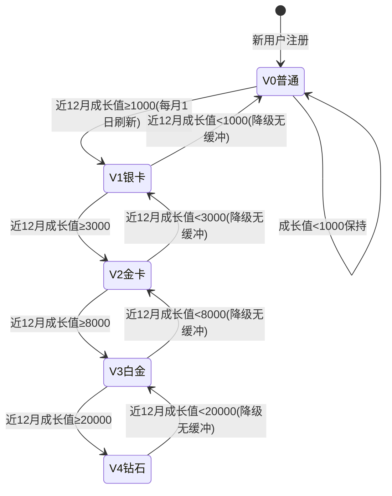
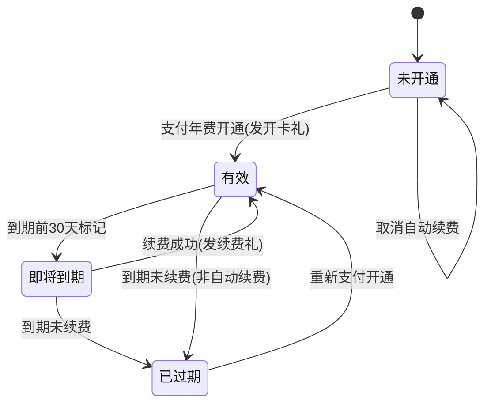

# 积分与会员域需求文档

**所属限界上下文**：BC7 积分与会员域
**文档版本**：V2.5
**创建日期**：2026-07-09
**类型**：支撑域

本域对应总览文档限界上下文表中的 BC7，覆盖平台通用积分账户、免费成长会员等级、付费会员、积分流水、任务中心五条业务线。文档遵循 `00-需求文档总览与DDD架构.md` 第 4 章分层架构规范、第 3 章共享内核与统一语言，并与第 5 章跨上下文事件契约保持一致。本域全部由集成事件异步驱动，不阻塞订单、支付等主交易链路；积分与会员数值规则（倍率、门槛、年费、上限）来源于业务规则文件，已完整采纳。

## 1 上下文概述

### 1.1 职责

本域承担四类业务对象的生命周期管理：一是平台通用积分的获取、消耗、冻结、扣回与清零，积分账户余额可为负；二是基于近 12 个月滚动有效成长值的免费会员等级评定与权益发放；三是付费会员（至尊黑卡/PLUS）的开通、续费与到期，其权益与免费等级叠加；四是任务中心与积分明细的查询展示。积分计算含会员等级加速与黑卡双倍叠加的倍率规则，等级评定按月刷新。积分与会员作为支撑域，不参与交易主链路同步流程，仅通过事件与订单、评价、用户、促销、消息通知等域协作。

### 1.2 边界

本域设五个聚合根：PointsAccount（积分账户）、GrowthProfile（成长值档案）、PaidMembership（付费会员）、PointsTransaction（积分流水）、TaskRecord（任务完成记录）。积分账户与流水分离为两个聚合，账户只持有余额与冻结值，每笔余额变更伴随一条流水，账户与流水的一致性由聚合方法保证并在同一事务落库。本域不持有订单、商品、优惠券、用户聚合对象，只以 ID 引用；订单实付金额、评价归属、优惠券模板通过查询接口或集成事件获取。会员等级门槛、加速倍率、任务奖励等可配置规则由运营配置驱动，领域层只见配置抽象接口。

积分账户余额允许为负：退款扣回已发放积分时若积分已被消耗，扣为负分，后续获取优先抵扣负值。成长值不可消耗，仅用于等级评定，且仅近 12 个月有效，更早的成长值不参与当前等级计算。付费会员与免费等级并行，黑卡用户消费返积分先按等级基础倍率计算再乘 2 倍，非消费获取积分享 1.2 倍加成。

### 1.3 与其他上下文的关系

积分与会员域围绕交易与互动主链路，与六个上下文存在协作，全部经集成事件异步驱动：

- 订单域 → 本域（共享内核事件）：订单完成发布 `OrderCompletedEvent` 开放评价入口，本域不在此事件发放积分；售后期结束发布 `OrderAfterSalesWindowClosedEvent`，本域消费后发放消费返积分与成长值（订单域在确认收货时设置售后期结束延迟消息）；订单取消发布 `OrderCancelledEvent`，本域释放冻结的抵现积分或扣回已发放积分；退款完成由售后域发布 `RefundCompletedEvent`，本域扣回消费积分（账户可为负，后续获取优先抵扣）。积分抵现由订单域在结算时调用本域试算与冻结接口。`OrderAfterSalesWindowClosedEvent` 携带 `paidAmount`（= 实付金额（= 订单 TotalAmount = PaidAmount，含运费，已扣除优惠券抵扣与积分抵现），作为消费返积分计算基准）供本域计算。
- 评价与售后域 → 本域（共享内核事件）：评价审核通过发布 `ReviewApprovedEvent`，本域消费发放评价积分（带图 30 分、纯文字 10 分）与成长值 +10；退款完成发布 `RefundCompletedEvent`，本域消费扣回该订单已发放积分与成长值，扣回可使积分余额为负。
- 用户域 → 本域（共享内核事件）：用户注册发布 `UserRegisteredEvent`，本域消费发放新人积分与创建成长值档案；用户完善资料由用户域事件或本域任务中心触发发放 +200 积分。
- 促销域（客户-供应商）：本域发布积分换券请求事件，促销域消费生成优惠券并回执；积分换券的券模板与库存由促销域权威持有。
- 消息通知域（客户-供应商）：本域发布 `MemberLevelChangedEvent`、`PaidMemberSubscribedEvent`、积分到账通知请求，消息通知域消费后发送 App 推送与短信；积分清零提醒、降级保级提醒同样经通知域发送。
- 支付集成域：付费会员年费支付经订单域创建会员订阅订单（OrderType=会员订阅订单）→ 支付集成域处理支付 → 支付成功后订单域发布 `OrderPaidEvent`（携带 OrderType=会员订阅订单）→ 本域消费该事件调用 `PaidMembership.Subscribe` 开通会员。本域不直接调用支付集成域，避免跨域耦合。

### 1.4 事件契约引用

本域对外发布的集成事件遵循总览文档第 5 章约定，核心事件为 `PointsEarnedEvent`、`PointsConsumedEvent`、`PointsRevertedEvent`、`PointsFrozeEvent`、`PointsExpiredEvent`、`MemberLevelChangedEvent`、`PaidMemberSubscribedEvent`、`PaidMemberRenewedEvent`。本域入站消费 `OrderCompletedEvent`、`OrderCancelledEvent`、`RefundCompletedEvent`、`ReviewApprovedEvent`、`UserRegisteredEvent` 五个事件。事件经发件箱模式与聚合持久化在同一事务写入，后台进程发布到事件总线，消费失败进入死信队列重试，超过阈值告警。

## 2 领域模型设计

### 2.1 聚合与实体

五个聚合根按一致性边界拆分：积分账户变更与流水在同事务，成长值档案独立，付费会员独立，任务记录独立。单次事务只修改一个聚合，跨聚合协作通过领域事件异步完成。

#### 2.1.1 PointsAccount 聚合根

PointsAccount 是积分账户聚合根，封装余额、冻结与可用余额，所有余额变更必须伴随流水，禁止外部直接 set 字段。

| 字段名 | 类型 | 说明 | 约束 |
|-|-|-|-|
| AccountId | Guid | 账户唯一标识 | 主键，创建时生成 |
| UserId | Guid | 归属用户 | 非空，唯一索引，一个用户一个账户 |
| Balance | Points | 积分余额 | 可为负；退款扣回或风控可致负 |
| Frozen | Points | 冻结积分 | ≥ 0 |
| AvailableBalance | Points | 可用余额 | 计算值 = Balance - Frozen |
| TotalEarned | Points | 累计获得 | ≥ 0，统计用 |
| TotalConsumed | Points | 累计消耗 | ≥ 0，统计用 |
| NegativeOffset | Points | 负分待抵扣额 | ≥ 0，余额为负时记录待抵扣量 |
| Version | int | 乐观锁版本 | 并发扣减防超发 |
| CreatedAt | DateTime | 创建时间 | UTC，基础设施层填充 |
| UpdatedAt | DateTime | 更新时间 | UTC，基础设施层填充 |

PointsAccount 聚合方法（行为意图明确，避免贫血模型）：

- `Create(userId)`：工厂方法，创建余额为 0 的账户。
- `Earn(amount, source, refId)`：赚取积分，若余额为负先抵扣 NegativeOffset，抵扣后剩余才计入余额；更新 TotalEarned，附加 `PointsEarnedEvent` 与一条收入方向流水。
- `Consume(amount, source, refId)`：消耗积分，校验 AvailableBalance ≥ amount，扣减余额与 TotalConsumed，附加 `PointsConsumedEvent` 与一条支出方向流水。
- `Freeze(amount, refId)`：冻结积分，校验可用余额足够，Frozen 增加，附加 `PointsFrozeEvent`。
- `Unfreeze(amount, refId)`：解冻积分，Frozen 减少，余额不变。
- `Revert(amount, refId)`：退款扣回，直接扣减余额，余额可为负并记录 NegativeOffset，附加 `PointsRevertedEvent` 与支出方向流水。
- `Adjust(amount, reason, operatorId)`：运营手动调整，正负皆可，记录审计，附加 `PointsAdjustedEvent`。
- `FreezeByRisk(reason, operatorId)`：风控冻结，将部分或全部可用余额转入冻结，附加 `PointsFrozeEvent`。
- `Expire(amount, year, refId)`：清零过期积分，扣减余额与 TotalEarned，附加 `PointsExpiredEvent`。

#### 2.1.2 GrowthProfile 聚合根

GrowthProfile 是成长值档案聚合根，封装近 12 个月有效成长值与当前会员等级，成长值不可消耗。

| 字段名 | 类型 | 说明 | 约束 |
|-|-|-|-|
| ProfileId | Guid | 档案唯一标识 | 主键 |
| UserId | Guid | 归属用户 | 非空，唯一索引 |
| CurrentLevel | MemberLevel | 当前会员等级 | 枚举 V0–V4 |
| EffectiveGrowth | GrowthValue | 近 12 个月有效成长值 | ≥ 0，每月 1 日重算 |
| TotalGrowth | GrowthValue | 历史累计成长值 | ≥ 0，统计用 |
| LastEvaluatedAt | DateTime | 上次定级时间 | UTC，每月 1 日刷新 |
| LevelEffectiveFrom | DateTime | 当前等级生效时间 | UTC |
| Version | int | 乐观锁版本 | 并发防超发 |
| CreatedAt | DateTime | 创建时间 | UTC |
| UpdatedAt | DateTime | 更新时间 | UTC |

GrowthProfile 聚合方法：

- `Create(userId)`：工厂方法，创建 V0 等级、有效成长值为 0 的档案。
- `AddGrowthValue(amount, source, refId)`：增加成长值（消费/签到/评价/分享/积分兑换），EffectiveGrowth 与 TotalGrowth 同步增加，附加 `GrowthValueAddedEvent` 与成长值条目。
- `DeductGrowthValue(amount, refId)`：退货扣减成长值，EffectiveGrowth 与 TotalGrowth 同步减少，附加 `GrowthValueDeductedEvent`。
- `RecalculateLevel(effectiveGrowth, evalDate)`：每月 1 日按过去 365 天累计有效成长值重算等级，对比 CurrentLevel 触发 `Upgrade` 或 `Downgrade`，更新 LastEvaluatedAt。
- `Upgrade(targetLevel)`：升级到更高等级，更新 CurrentLevel 与 LevelEffectiveFrom，附加 `MemberLevelChangedEvent`（方向为升级）。
- `Downgrade(targetLevel)`：降级到更低等级，无缓冲期，更新 CurrentLevel，附加 `MemberLevelChangedEvent`（方向为降级）。

成长值条目（GrowthEntry）为聚合内实体，记录每笔成长值的来源、金额、关联单号与获得日期，用于近 12 个月滚动窗口的重算与审计。月度重算时按获得日期过滤过去 365 天条目求和得到 EffectiveGrowth。

#### 2.1.3 PaidMembership 聚合根

PaidMembership 是付费会员聚合根，封装有效期、续费状态与到期流转。

| 字段名 | 类型 | 说明 | 约束 |
|-|-|-|-|
| MembershipId | Guid | 付费会员唯一标识 | 主键 |
| UserId | Guid | 归属用户 | 非空，唯一索引 |
| Type | PaidMemberType | 付费会员类型 | 枚举 BlackCard/Plus |
| Status | PaidMemberStatus | 状态 | 枚举见 2.1.6 |
| StartDate | DateTime | 开通时间 | UTC |
| ExpireDate | DateTime | 到期时间 | UTC，开卡即次年同日 |
| AutoRenew | bool | 是否自动续费 | 默认 false |
| RenewalCount | int | 续费次数 | ≥ 0 |
| LastRenewedAt | DateTime? | 上次续费时间 | UTC |
| PaymentRef | string? | 最近支付单号 | 关联支付集成域 |
| Version | int | 乐观锁版本 | 并发防重复开通 |
| CreatedAt | DateTime | 创建时间 | UTC |
| UpdatedAt | DateTime | 更新时间 | UTC |

PaidMembership 聚合方法：

- `Subscribe(userId, paymentRef, startAt)`：工厂方法，开通付费会员，状态置为 Active，ExpireDate 为开卡日次年同日，附加 `PaidMemberSubscribedEvent`。
- `Renew(paymentRef, renewedAt)`：续费，校验状态为 Active 或 ExpiringSoon，ExpireDate 顺延一年，RenewalCount 自增，附加 `PaidMemberRenewedEvent`。
- `MarkExpiringSoon()`：到期前 30 天由定时任务标记为 ExpiringSoon。
- `Expire()`：到期未续费，状态置为 Expired，附加 `PaidMemberExpiredEvent`。
- `CancelAutoRenew()`：取消自动续费，AutoRenew 置 false。
- `Reopen(paymentRef, startAt)`：已过期用户重新开通，复用 Subscribe 语义重置状态与有效期。

#### 2.1.4 PointsTransaction 聚合根

PointsTransaction 是积分流水聚合根，每笔余额变更产生一条不可变流水，用于审计与明细查询。流水与账户分属两个聚合，账户方法在变更时附加流水并通过同事务落库保证一致。

| 字段名 | 类型 | 说明 | 约束 |
|-|-|-|-|
| TransactionId | Guid | 流水唯一标识 | 主键 |
| UserId | Guid | 归属用户 | 非空 |
| AccountId | Guid | 关联积分账户 | 非空 |
| Source | PointsSource | 积分来源类型 | 枚举见 2.1.6 |
| Direction | PointsDirection | 收支方向 | 枚举 In/Out |
| Amount | Points | 积分数 | > 0 |
| BalanceAfter | Points | 操作后余额 | 可为负 |
| RefType | string? | 关联单号类型 | 如 Order/Review/Task/Exchange |
| RefId | Guid? | 关联单号 | 可空 |
| ExpireDate | DateTime? | 该笔积分过期日 | 滚动有效期时填充 |
| Status | TransactionStatus | 流水状态 | 枚举 Active/Expired/Reverted/Frozen |
| Remark | string? | 备注 | 可空 |
| CreatedAt | DateTime | 创建时间 | UTC，不可变 |

PointsTransaction 聚合方法：

- `Record(...)`：工厂方法，创建一条流水，校验 Amount > 0，记录 BalanceAfter。
- `MarkReverted()`：退款扣回时将该笔原发流水标记为 Reverted。
- `MarkExpired()`：清零时标记为 Expired。
- `MarkFrozen()`：风控冻结时标记为 Frozen。

#### 2.1.5 TaskRecord 聚合根

TaskRecord 是任务完成记录聚合根，记录签到、浏览、评价、分享、完善资料、邀请等任务的完成事实，用于防重复与上限控制。

| 字段名 | 类型 | 说明 | 约束 |
|-|-|-|-|
| RecordId | Guid | 记录唯一标识 | 主键 |
| UserId | Guid | 归属用户 | 非空 |
| TaskType | TaskType | 任务类型 | 枚举见 2.1.6 |
| TaskDate | DateTime | 任务日期 | UTC，按天去重 |
| RefId | Guid? | 关联 ID | 评价 ID/商品 ID/被邀请用户 ID |
| PointsAwarded | Points | 奖励积分 | ≥ 0 |
| GrowthAwarded | GrowthValue | 奖励成长值 | ≥ 0 |
| CreatedAt | DateTime | 创建时间 | UTC |

TaskRecord 聚合方法：

- `Complete(userId, taskType, taskDate, refId, points, growth)`：工厂方法，创建任务记录，由仓储的唯一约束与上限校验防止重复领取。

#### 2.1.6 值对象

值对象无唯一标识，通过属性值判断相等性，不可变。

##### Points

| 字段名 | 类型 | 说明 | 约束 |
|-|-|-|-|
| Value | int | 积分数 | 整数，可为负 |

构造时校验非零，相等性由 Value 判定。积分与元换算固定 100 积分 = 1 元。

##### GrowthValue

| 字段名 | 类型 | 说明 | 约束 |
|-|-|-|-|
| Value | int | 成长值 | 整数，≥ 0 |

成长值不可消耗，仅用于等级评定。

##### MemberLevel

| 字段名 | 类型 | 说明 | 约束 |
|-|-|-|-|
| Rank | int | 等级序号 | 0–4 |
| Name | string | 等级名称 | 普通/银卡/金卡/白金/钻石 |
| GrowthThreshold | int | 近 12 月成长值门槛 | V0=0/V1=1000/V2=3000/V3=8000/V4=20000 |
| PointsMultiplier | decimal | 消费返积分加速倍率 | V0=1.0/V1=1.2/V2=1.5/V3=2.0/V4=2.5 |

等级与门槛、倍率绑定，由值对象封装，避免散落魔法数字。

##### PointsSource

| 字段名 | 类型 | 说明 | 约束 |
|-|-|-|-|
| Value | string | 来源类型 | Consume/SignIn/Profile/Browse/ReviewImage/ReviewText/Share/Invite/RedeemCoupon/MallExchange/Lottery/ShippingFee/Donation/ExchangeGrowth/RefundRevert/Expire/Award/RiskFreeze/Adjust |

##### PointsDirection

| 字段名 | 类型 | 说明 | 约束 |
|-|-|-|-|
| Value | string | 收支方向 | In（收入）/Out（支出）|

##### PaidMemberType

| 字段名 | 类型 | 说明 | 约束 |
|-|-|-|-|
| Value | string | 付费会员类型 | BlackCard/Plus |

##### PaidMemberStatus

| 字段名 | 类型 | 说明 | 约束 |
|-|-|-|-|
| Value | string | 付费会员状态 | None/Active/ExpiringSoon/Expired |

##### TaskType

| 字段名 | 类型 | 说明 | 约束 |
|-|-|-|-|
| Value | string | 任务类型 | SignIn/Browse/Review/Share/Profile/Invite |

##### TransactionStatus

| 字段名 | 类型 | 说明 | 约束 |
|-|-|-|-|
| Value | string | 流水状态 | Active/Expired/Reverted/Frozen |

#### 2.1.7 聚合边界说明

积分账户与积分流水拆分为两个聚合：账户是余额的权威来源且高频读写，流水是不可变审计账本且只追加，二者在同一事务内变更但聚合边界分离使流水可独立分页查询与归档。成长值档案与积分账户分离，因成长值不可消耗、等级按月评定，与积分余额无一致性耦合。付费会员独立聚合，其有效期与续费状态变更频率低且与积分账户生命周期不同。任务记录独立聚合，支撑防重复与上限校验的高频写入。

**关键警告**：积分账户余额变更必须伴随流水，账户方法在变更余额时同时附加流水并同事务落库，禁止出现无流水的余额变更；跨聚合的积分换券、商城兑换等副作用只能通过事件异步通知促销域，不可同步调用促销域聚合。

#### 2.1.8 运营配置实体

会员等级门槛、加速倍率、权益项、任务奖励、付费会员套餐、积分商城商品等可配置规则由独立的运营配置聚合承载，与运行时积分账户、成长值档案等聚合分离。运行时聚合不直接持有配置对象，领域层为每类配置定义仓储接口（遵循 `I{聚合根名}Repository` 约定），由基础设施层实现持久化，运营端写入后即时生效，领域服务与聚合方法经仓储读取最新配置。各配置聚合的关键字段与归属如下：

- MemberLevelConfig（聚合根）：承载单个会员等级的序号（Rank 0–4）、名称（Name）、成长值门槛（GrowthThreshold）、积分加速倍率（PointsMultiplier）。V0–V4 各一条，等级评定经 `ILevelEvaluationService` 读取门槛，消费返积分经 `IPointsCalculationService` 读取倍率。
- BenefitConfig（聚合根）：承载某等级的权益项集合，含每月包邮券数量、生日礼包积分、专属客服开关、极速退款开关、退货免运费次数。按等级序号聚合，权益发放经 `IBenefitGrantService` 读取。
- TaskPointRule（聚合根）：承载单个任务类型的积分奖励值（PointsAwarded）、日上限（DailyCap）、月上限（MonthlyCap）。签到/浏览/评价（带图与纯文字两套）/分享/邀请各一条，任务中心与积分发放读取。
- PaidMemberPlan（聚合根）：承载付费会员套餐的年费金额（AnnualFee）、开卡礼积分（SubscribeBonusPoints）、开卡成长值（SubscribeBonusGrowth）、续费礼积分（RenewBonusPoints）、权益项集合。按套餐类型（BlackCard/Plus）各一条，开通与续费读取。
- PointsMallProduct（聚合根）：承载积分商城商品的名称、积分价（PointsPrice）、库存（Stock）、商品类型（Type）、兑换门槛（LevelThreshold/RequireRealName）、上下架状态（Status）。买家兑换时读取并扣减库存。

配置聚合的变更经运营端 API 写入，记录变更人与时间作为审计字段；关键配置（倍率、门槛、年费）变更需二次确认。配置聚合与运行时聚合之间无强一致性耦合，运行时通过仓储读取最新配置，配置走 Redis 缓存，变更后主动失效为主，下次读取即生效。

### 2.2 领域服务

领域服务处理无法归入单一聚合的领域逻辑，接口与实现均在领域层。

- `IPointsCalculationService`：积分计算服务，封装会员加速倍率与黑卡叠加规则。
  - `CalculateConsumePoints(paidAmount, level, isPaidMember, isMemberDay)`：消费返积分计算。基础 = 实付金额（1 元 = 1 积分），先乘等级倍率，黑卡用户再乘 2；会员日金卡及以上指定商品积分翻倍在此叠加。钻石 + 黑卡 = 1 × 2.5 × 2 = 5 倍，为最高倍率。
  - `CalculateNonConsumePoints(baseAmount, isPaidMember)`：非消费积分计算，黑卡用户乘 1.2 倍加成。
  - `CalculateRedeemCap(orderAmount)`：积分抵现上限，返回 min(订单金额 × 30%, 50 元) 对应积分数。

- `ILevelEvaluationService`：成长值等级评定服务。
  - `Evaluate(effectiveGrowth)`：按近 12 月有效成长值返回对应等级（V0=0/V1=1000/V2=3000/V3=8000/V4=20000）。
  - `GetLevelThreshold(level)`：返回该等级门槛。
  - `GetProgress(effectiveGrowth, currentLevel)`：返回成长值进度条数据，含距保级差距与距升级差距。

- `IPointsExpiryService`：积分清零调度服务。
  - `GetExpiringPoints(userId, year)`：获取该年度获得且未使用的即将清零积分。
  - `ExpirePoints(userId, year)`：执行清零，扣减余额并标记流水 Expired。
  - `GetExpiryPolicy()`：返回清零策略（年度清零或滚动次年年底有效），默认年度清零，可配置切换滚动有效期。

- `IRiskControlService`：风控校验服务。
  - `CheckAbnormalAsync(userId, source, device, ip)`：检测单设备、单 IP 高频获取异常，返回是否拦截。
  - `FreezePointsAsync(userId, reason)`：冻结异常积分。
  - `GetRiskMetrics(userId)`：返回风控指标供运营审计。

- `IBenefitGrantService`：会员权益发放服务，按等级权益矩阵发放包邮券、生日礼包等。
  - `GrantMonthlyBenefits(profile)`：每月按等级发放包邮券（银卡 2 张/金卡 5 张/白金与钻石无限包邮）。
  - `GrantBirthdayGift(profile)`：生日月发放礼包（银卡 1000 积分/金卡 2000 积分+券/白金 3000 积分+礼盒/钻石 5000 积分+专属礼）。
  - `GrantPaidMemberBenefits(membership)`：付费会员开通发放开卡礼 2000 积分+500 成长值，每月 8 张包邮券；续费发放 1000 积分。

### 2.3 仓储接口

仓储接口定义在领域层，命名遵循 `I{聚合根名}Repository`，由基础设施层实现。

```csharp
// 领域层
public interface IPointsAccountRepository
{
    Task<PointsAccount?> GetByUserIdAsync(Guid userId, CancellationToken ct = default);
    Task AddAsync(PointsAccount account, CancellationToken ct = default);
    Task UpdateAsync(PointsAccount account, CancellationToken ct = default);
}

public interface IGrowthProfileRepository
{
    Task<GrowthProfile?> GetByUserIdAsync(Guid userId, CancellationToken ct = default);
    Task<IReadOnlyList<GrowthProfile>> GetProfilesDueForEvaluationAsync(DateTime evalDate, CancellationToken ct = default);
    Task AddAsync(GrowthProfile profile, CancellationToken ct = default);
    Task UpdateAsync(GrowthProfile profile, CancellationToken ct = default);
}

public interface IPaidMembershipRepository
{
    Task<PaidMembership?> GetByUserIdAsync(Guid userId, CancellationToken ct = default);
    Task<IReadOnlyList<PaidMembership>> GetExpiringSoonAsync(int withinDays, CancellationToken ct = default);
    Task<IReadOnlyList<PaidMembership>> GetExpiredAsync(DateTime asOf, CancellationToken ct = default);
    Task AddAsync(PaidMembership membership, CancellationToken ct = default);
    Task UpdateAsync(PaidMembership membership, CancellationToken ct = default);
}

public interface IPointsTransactionRepository
{
    Task<PointsTransaction?> GetByIdAsync(Guid transactionId, CancellationToken ct = default);
    Task<(IReadOnlyList<PointsTransaction> Items, int Total)> QueryAsync(PointsTransactionQuery query, CancellationToken ct = default);
    Task<IReadOnlyList<PointsTransaction>> GetExpiringByUserAsync(Guid userId, DateTime asOf, CancellationToken ct = default);
    Task AddAsync(PointsTransaction transaction, CancellationToken ct = default);
    Task AddRangeAsync(IEnumerable<PointsTransaction> transactions, CancellationToken ct = default);
}

public interface ITaskRecordRepository
{
    Task<bool> ExistsTodayAsync(Guid userId, TaskType type, DateTime date, CancellationToken ct = default);
    Task<int> CountTodayAsync(Guid userId, TaskType type, DateTime date, CancellationToken ct = default);
    Task<int> CountThisMonthAsync(Guid userId, TaskType type, DateTime monthStart, CancellationToken ct = default);
    Task<TaskRecord?> GetByUserAndRefAsync(Guid userId, TaskType type, Guid refId, CancellationToken ct = default);
    Task AddAsync(TaskRecord record, CancellationToken ct = default);
}
```

`PointsTransactionQuery` 为查询参数对象，支持按 userId、source、direction、时间区间过滤与分页，明细查询走读库以提升性能。积分余额查询高频，由 Redis 缓存账户余额，写库变更后失效缓存。

### 2.4 分层落点

| 分层 | 积分与会员域落点 | 职责 |
|-|-|-|
| 领域层 | PointsAccount/GrowthProfile/PaidMembership/PointsTransaction/TaskRecord 聚合根，Points/GrowthValue/MemberLevel/PointsSource/PointsDirection/PaidMemberType/PaidMemberStatus/TaskType/TransactionStatus 值对象，IPointsCalculationService/ILevelEvaluationService/IPointsExpiryService/IRiskControlService/IBenefitGrantService 领域服务，领域事件，五个仓储接口 | 封装业务规则与不变量 |
| 应用层 | IPointsAppService、IMemberAppService、ITaskCenterAppService、IPointsRuleAppService，DTO、Command/Query，事件消费者编排（订阅订单/评价/用户/退款事件），事务边界，发件箱发布积分事件 | 用例编排与事务管理 |
| 基础设施层 | EfCore 仓储实现、Redis 积分余额缓存、定时任务（每月 1 日等级刷新、每年 12 月 31 日积分清零、到期前 30 天标记）、消息消费者（OrderAfterSalesWindowClosedEvent/OrderCancelledEvent/OrderPaidEvent/RefundCompletedEvent 等）、风控指标存储 | 持久化、缓存、调度、事件消费 |
| 表现层 | PointsController、MemberController、TaskCenterController（买家端）、PointsRuleController（运营端） | 接收请求、调用应用服务、返回 DTO |

## 3 领域事件清单

领域事件在聚合方法中产生，本上下文内消费的用于解耦聚合内部逻辑；对外发布的集成事件经事件总线传递。事件命名统一过去时。

| 事件名 | 触发时机 | 消费方 | 关键字段 |
|-|-|-|-|
| `UserRegisteredEvent`（入站） | 用户域注册成功 | 本域（创建积分账户与成长值档案、发新人积分） | userId, registeredAt |
| `OrderCompletedEvent`（入站） | 订单域订单完成（确认收货） | 本域仅标记可发积分状态，不发放（等待售后期结束） | orderId, userId, paidAmount, completedAt, afterSalesWindowEndsAt |
| `OrderAfterSalesWindowClosedEvent`（入站） | 订单域售后期结束 | 本域（发放消费返积分与成长值） | orderId, userId, paidAmount（实付金额 = 订单 TotalAmount，含运费，作为消费返积分计算基准）, completedAt, afterSalesWindowEndsAt |
| `OrderCancelledEvent`（入站） | 订单域订单取消 | 本域（释放冻结的抵现积分，或扣回已发放积分与成长值） | orderId, userId, pointsToRevert, pointsToRelease |
| `OrderPaidEvent`（入站） | 订单域支付成功 | 本域（正式扣减冻结的抵现积分；识别会员订阅订单则开通/续费付费会员） | orderId, userId, pointsConsumed, pointsOffsetAmount, orderType, paymentId |
| `RefundCompletedEvent`（入站） | 评价与售后域退款完成 | 本域（扣回该订单已发放消费积分与成长值，可为负分） | orderId, orderLineId, userId, refundedAmount, growthToRevert, couponRefundRequired |
| `ReviewApprovedEvent`（入站） | 评价域审核通过 | 本域（发放评价积分与成长值） | reviewId, userId, productId, hasImages |
| `CouponExchangeSucceededEvent`（入站） | 促销域优惠券生成回执成功 | 本域（正式确认积分扣减并记录兑换流水，回执失败则回滚已扣减积分） | couponId, instanceId, userId, pointsCost, exchangedAt |
| `PointsEarnedEvent` | 积分入账 | 消息通知域（到账通知，可选） | userId, amount, source, balanceAfter |
| `PointsConsumedEvent` | 积分消耗（抵现/兑换/抽奖） | 本域内部、消息通知域 | userId, amount, source, refId |
| `PointsRevertedEvent` | 退款扣回积分 | 本域内部 | userId, amount, refId, balanceAfter（可为负） |
| `PointsFrozeEvent` | 风控冻结积分 | 本域内部、运营审计 | userId, amount, reason |
| `PointsExpiredEvent` | 积分清零 | 本域内部、消息通知域 | userId, amount, year |
| `GrowthValueAddedEvent` | 成长值增加 | 本域内部 | userId, amount, source, refId |
| `GrowthValueDeductedEvent` | 成长值扣减 | 本域内部 | userId, amount, refId |
| `MemberLevelChangedEvent` | 会员等级升降级 | 消息通知域（祝贺/保级提醒） | userId, fromLevel, toLevel, direction, effectiveGrowth |
| `PaidMemberSubscribedEvent` | 付费会员开通 | 消息通知域（权益通知）、本域（发开卡礼） | userId, type, expireDate |
| `PaidMemberRenewedEvent` | 付费会员续费 | 消息通知域、本域（发续费礼） | userId, type, newExpireDate, renewalCount |
| `PaidMemberExpiredEvent` | 付费会员到期 | 消息通知域 | userId, type, expiredAt |
| `PointsExchangeCouponRequestedEvent` | 积分换券请求 | 促销域（生成优惠券） | userId, pointsCost, couponTemplateId |
| `MallExchangeRequestedEvent` | 积分商城兑换请求 | 履约/库存域（扣减兑换商品库存与发货） | userId, pointsCost, productId, quantity |

事件经发件箱模式与聚合持久化在同一事务写入，后台进程发布到事件总线，消费失败进入死信队列重试，超过阈值告警。消费入站事件时以事件携带的关联单号做幂等去重，重复消费不重复发放或扣回。

## 4 功能需求

### 4.0 功能点概览表

| 编号 | 功能模块 | 功能描述 |
|-|-|-|
| F-PTS-001 | 消费返积分 | 售后期结束（`OrderAfterSalesWindowClosedEvent`）后按实付金额与会员等级加速、黑卡叠加倍率发放积分 |
| F-PTS-002 | 每日签到 | 连续签到累积积分与成长值，第 7 天额外奖励 |
| F-PTS-003 | 完善个人资料 | 一次性完善头像昵称地区等资料奖励 200 积分 |
| F-PTS-004 | 浏览商品 | 浏览商品或直播间每次 2 积分，日上限 20 分 |
| F-PTS-005 | 评价积分 | 带图评价 30 分、纯文字评价 10 分，审核通过后发放并设月上限 |
| F-PTS-006 | 分享商品 | 分享商品或活动每次 5 积分，日上限 25 分 |
| F-PTS-007 | 邀请好友 | 邀请好友首单完成后奖励 500 积分 |
| F-PTS-008 | 积分订单抵现 | 结算时用积分抵扣订单金额，100 分抵 1 元，单笔上限 30% 或 50 元 |
| F-PTS-009 | 积分兑换优惠券 | 积分兑换满减券，请求促销域生成券 |
| F-PTS-010 | 积分商城兑换 | 积分兑换实物、周边、虚拟卡券，钻石会员 9 折积分消耗 |
| F-PTS-011 | 积分抽奖 | 大转盘/九宫格抽奖，每次消耗 10–50 积分 |
| F-PTS-012 | 积分抵运费 | 退换货时用积分抵扣运费 |
| F-PTS-013 | 积分公益捐赠 | 积分捐出，平台配捐 |
| F-PTS-014 | 积分有效期与清零提醒 | 年度清零或滚动有效期，提前 30 天提醒 |
| F-PTS-015 | 退款积分扣回 | 退款扣回已发放积分，已用则扣为负分，后续获取优先抵扣 |
| F-PTS-016 | 积分兑换成长值 | 每月限量 100 积分换 5 成长值，上限 1000 积分/月 |
| F-PTS-017 | 积分明细查询 | 买家查询积分流水明细与余额 |
| F-PTS-018 | 任务中心 | 集成签到浏览评价分享任务，展示完成状态与奖励 |
| F-PTS-019 | 积分风控与审计 | 风控监控异常获取、冻结扣回、发放消耗日志审计 |
| F-PTS-020 | 运营积分规则配置 | 运营配置倍率、门槛、上限、有效期策略 |
| F-PTS-021 | 会员等级配置 | 运营配置各等级成长值门槛、积分加速倍率与等级名称 |
| F-PTS-022 | 权益矩阵配置 | 运营配置各等级权益（包邮券数量、生日礼包积分、专属客服、极速退款等） |
| F-PTS-023 | 任务积分值配置 | 运营配置各任务积分奖励值与日/月上限 |
| F-PTS-024 | 付费会员套餐配置 | 运营配置年费金额、开卡礼积分、续费礼积分与权益项 |
| F-PTS-025 | 积分商城商品管理 | 运营上架/下架/编辑积分商城商品（积分价、库存、门槛） |
| F-MBR-001 | 成长值获取 | 消费、签到、评价、分享累积成长值，退货扣减 |
| F-MBR-002 | 会员等级评定与刷新 | 每月 1 日按近 12 月有效成长值重新定级 |
| F-MBR-003 | 会员权益发放与查询 | 按等级权益矩阵发放包邮券、生日礼包等并查询 |
| F-MBR-004 | 会员等级升降级与保级提醒 | 升级立即或次月生效、降级无缓冲、降级前推送保级 |
| F-MBR-005 | 会员中心 | 展示等级、成长进度条、保级升级差距、权益 |
| F-MBR-006 | 会员日特权 | 每月 8 号金卡及以上享指定商品积分翻倍或兑换折扣 |
| F-MBR-007 | 付费会员开通 | 支付年费开通黑卡，发开卡礼 |
| F-MBR-008 | 付费会员续费 | 续费顺延有效期，发续费礼 |
| F-MBR-009 | 付费会员到期与积分支付年费 | 到期流转，支持积分抵扣部分年费 |
| F-MBR-010 | 等级+积分解锁稀缺权益 | 钻石等级+支付积分参与稀缺商品或活动 |

### F-PTS-001 消费返积分

业务逻辑：订单确认收货后进入售后期（默认 7 天），售后期结束由订单域发布 `OrderAfterSalesWindowClosedEvent` 触发本域发放。`OrderCompletedEvent`（确认收货）到达时本域仅标记该订单为"待发积分"状态，不发放。计算基数 = 实付金额（`paidAmount` = 订单 TotalAmount，含运费，已扣除优惠券抵扣与积分抵现），基础倍率 1 元 = 1 积分。调用 `IPointsCalculationService.CalculateConsumePoints` 计算最终积分：先乘会员等级加速倍率（普通 1.0/银卡 1.2/金卡 1.5/白金 2.0/钻石 2.5），黑卡用户再乘 2 倍；会员日（每月 8 号）金卡及以上指定商品积分翻倍在此叠加。计算后调用 `PointsAccount.Earn` 入账，若余额为负先抵扣负分。同时调用 `GrowthProfile.AddGrowthValue` 按 1 元 = 1 成长值增加成长值。

交互逻辑：售后期结束由订单域延迟消息驱动，本域异步消费事件处理，无前端直接交互；发放完成后发布 `PointsEarnedEvent` 与 `GrowthValueAddedEvent`，消息通知域可选推送积分到账通知。

规则约束：基数 = paidAmount（含运费，已扣除优惠券抵扣与积分抵现）；等级加速倍率与黑卡双倍为乘法叠加，钻石+黑卡最高 5 倍；会员日翻倍仅适用于指定商品且金卡及以上；风控判定异常的订单不予发放；售后期内退款则不发放该订单消费积分。

权限逻辑：仅订单域事件触发，买家不可手动领取消费积分；运营可配置是否开启会员日翻倍与指定商品范围。

边界与异常：订单重复完成事件以 orderId 幂等去重；并发发放以账户乐观锁拦截；风控异常订单积分冻结不发放；订单取消或退款由对应事件扣回。

### F-PTS-002 每日签到

业务逻辑：买家每日签到一次，获得积分与成长值。签到积分第 1 天 5 分，连续签到第 7 天额外 20 分；签到成长值每次 +5。调用 `TaskRecord.Complete` 创建签到记录，由仓储校验当日是否已签到防重复；调用 `PointsAccount.Earn` 发放积分（黑卡用户非消费积分乘 1.2 倍），调用 `GrowthProfile.AddGrowthValue` 增加 5 成长值。

交互逻辑：买家在任务中心或会员中心点击"签到"，签到日历展示当月签到情况与连续天数；签到成功即时返回获得的积分与成长值。

规则约束：每日仅一次签到，重复签到返回 409；连续签到中断后重新计算连续天数；第 7 天额外 20 分在签到当日一并发放。

权限逻辑：仅登录买家可签到，UserId 取自当前身份。

边界与异常：并发重复签到以 (userId, taskType, taskDate) 唯一约束拦截；跨日签到以 UTC 日期判定。

### F-PTS-003 完善个人资料

业务逻辑：买家完善头像、昵称、地区等个人资料后一次性奖励 200 积分。调用 `TaskRecord.Complete` 记录，校验该用户此前未领取过此奖励（一次性）；调用 `PointsAccount.Earn` 发放 200 积分（黑卡用户乘 1.2 倍）。

交互逻辑：买家在"我的资料"页完善信息后保存，系统校验资料完整度达标后发放奖励并提示。

规则约束：每用户仅奖励一次，重复完善不重复发放；资料完整度须达到设定阈值（至少包含头像、昵称、地区）。

权限逻辑：仅本人完善资料可获奖励。

边界与异常：已领取用户再次触发返回 409；资料未达标返回 400。

### F-PTS-004 浏览商品

业务逻辑：买家浏览商品或直播间每次奖励 2 积分，每日上限 20 分。调用 `TaskRecord.Complete` 创建浏览记录，由仓储校验当日累计浏览积分是否达到上限；未达上限则调用 `PointsAccount.Earn` 发放 2 积分（黑卡用户乘 1.2 倍）。

交互逻辑：买家浏览商品详情页或进入直播间时前端上报浏览事件，系统异步发放积分；任务中心展示当日浏览积分进度。

规则约束：每次 2 积分，日上限 20 分（即每日最多 10 次）；超出上限当日不再发放。

权限逻辑：仅登录买家浏览可获奖励。

边界与异常：高频上报由风控检测单设备/单 IP 异常并拦截；并发上报以当日累计计数原子更新防超发。

### F-PTS-005 评价积分

业务逻辑：买家评价审核通过后由 `ReviewApprovedEvent` 触发发放评价积分。带图评价 30 分/条，纯文字评价 10 分/条；带图评价月上限 300 分，纯文字评价月上限 100 分。调用 `TaskRecord.Complete` 记录（关联 reviewId 防重复），由仓储校验当月该类型评价积分是否达上限；调用 `PointsAccount.Earn` 发放（黑卡用户乘 1.2 倍）。同时调用 `GrowthProfile.AddGrowthValue` 增加 10 成长值。

交互逻辑：买家提交评价待审核通过后系统异步发放，无直接交互；任务中心展示当月评价积分进度。

规则约束：带图 30 分月上限 300 分，纯文字 10 分月上限 100 分；同一评价不重复发放，以 reviewId 幂等；评价积分须审核通过后才发放。

权限逻辑：仅评价审核通过触发，运营驳回不发放。

边界与异常：重复审核通过事件以 reviewId 去重；月上限达额后超出部分不发放。

### F-PTS-006 分享商品

业务逻辑：买家分享商品或活动每次奖励 5 积分，每日上限 25 分。调用 `TaskRecord.Complete` 记录，由仓储校验当日分享积分是否达上限；调用 `PointsAccount.Earn` 发放（黑卡用户乘 1.2 倍）。

交互逻辑：买家点击分享生成链接或海报，分享行为上报后异步发放积分；任务中心展示当日分享积分进度。

规则约束：每次 5 积分，日上限 25 分（即每日最多 5 次）；超出上限当日不再发放。

权限逻辑：仅登录买家分享可获奖励。

边界与异常：刷量分享由风控检测异常并拦截；并发上报以当日累计计数原子更新防超发。

### F-PTS-007 邀请好友

业务逻辑：买家邀请好友注册，好友首单完成后奖励邀请人 500 积分。好友首单完成由订单域事件触发，本域校验邀请关系与首单有效性后，调用 `TaskRecord.Complete` 记录（关联被邀请用户 ID 防重复），调用 `PointsAccount.Earn` 发放 500 积分（黑卡用户乘 1.2 倍）。

交互逻辑：买家在任务中心生成专属邀请链接或邀请码分享给好友；好友注册并完成首单后系统异步发放奖励并通知邀请人。

规则约束：仅好友首单完成后发放，需有效首单；每个被邀请用户仅触发一次邀请奖励，以被邀请用户 ID 幂等；好友须通过邀请链接注册建立邀请关系。

权限逻辑：邀请关系由用户域或本域记录，不可伪造。

边界与异常：好友未完成首单不发放；好友退款导致首单失效扣回已发邀请积分；刷量邀请由风控检测并冻结。

### F-PTS-008 积分订单抵现

业务逻辑：买家在订单结算时使用积分抵扣订单金额，100 积分抵 1 元。抵现上限为单笔订单金额的 30% 或最高 50 元（取较小者）。订单域结算时调用本域试算接口返回可抵金额与消耗积分数，下单时调用 `PointsAccount.Freeze` 冻结积分（余额扣减并记冻结流水），支付成功后消费 `OrderPaidEvent` 调用 `PointsAccount.Consume` 正式扣减冻结的抵现积分；订单取消时消费 `OrderCancelledEvent` 调用 `PointsAccount.Unfreeze` 释放冻结积分。

交互逻辑：买家在结算页选择"积分抵扣"，系统试算展示可抵金额与消耗积分数；确认后锁定积分，支付成功后正式扣减。

规则约束：100 积分 = 1 元；单笔最多抵订单金额 30% 或最高 50 元，取较小者；可用积分不足时不允许部分超额抵扣。

权限逻辑：仅订单买家可用本人积分抵现。

边界与异常：积分抵现与优惠券可否叠加由促销域与订单域规则决定，默认积分与优惠券可叠加但各自独立计算；并发抵现以账户乐观锁防超扣；订单取消释放冻结积分。

### F-PTS-009 积分兑换优惠券

业务逻辑：买家用积分兑换满减券（如 1000 分换 10 元券）。调用 `PointsAccount.Consume` 扣减积分，发布 `PointsExchangeCouponRequestedEvent` 请求促销域按券模板生成优惠券并回执；回执成功后记录兑换流水，失败则回滚积分。

交互逻辑：买家在积分商城或优惠券页选择可兑换的券，查看所需积分后确认兑换；兑换成功后券进入卡包。

规则约束：兑换积分由促销域券模板定义；券库存由促销域权威持有，库存不足兑换失败；同一券模板可设每人兑换次数上限。

权限逻辑：仅登录买家可兑换本人积分。

边界与异常：促销域回执失败由补偿任务重试或回滚积分；重复兑换请求以幂等键去重；积分不足返回 400。

### F-PTS-010 积分商城兑换

业务逻辑：买家用积分兑换实物、周边、虚拟卡券、限量新品。钻石会员兑换享 9 折积分消耗。调用 `PointsAccount.Consume` 扣减积分（钻石用户按 9 折计算消耗），发布 `MallExchangeRequestedEvent` 请求履约/库存域扣减兑换商品库存与发货；高值商品需实名认证或会员等级门槛。

交互逻辑：买家在积分商城浏览商品，查看所需积分与库存后兑换；兑换成功后实物进入发货流程，虚拟卡券即时发放。

规则约束：钻石会员积分消耗 9 折；高值商品需实名认证或达指定会员等级门槛；兑换商品库存有限，兑完即止。

权限逻辑：买家兑换须满足商品门槛（等级/实名）；运营配置商品上架、积分价与门槛。

边界与异常：库存不足兑换失败；发货失败由履约域处理，积分按规则退还；并发兑换以库存原子扣减防超发。

### F-PTS-011 积分抽奖

业务逻辑：买家参与大转盘、九宫格抽奖，每次消耗 10–50 积分。调用 `PointsAccount.Consume` 扣减抽奖积分，按奖品概率中奖后发放奖品（积分、优惠券、实物）；中奖积分调用 `PointsAccount.Earn` 回补。

交互逻辑：买家在积分活动页选择抽奖档位（10/20/50 分），点击抽奖后展示中奖结果；中奖记录可查。

规则约束：每次消耗 10–50 积分，档位由运营配置；中奖概率与奖池由运营配置；每日抽奖次数上限。

权限逻辑：仅登录买家可抽奖。

边界与异常：积分不足返回 400；并发抽奖以账户乐观锁防超扣；奖品库存不足时降级发放积分补偿。

### F-PTS-012 积分抵运费

业务逻辑：买家退换货时用积分抵扣运费。调用 `PointsAccount.Consume` 扣减相应积分，抵扣金额按 100 积分 = 1 元换算。

交互逻辑：买家在退换货流程选择"积分抵运费"，系统展示可抵金额与消耗积分；确认后扣减积分并减免运费。

规则约束：100 积分 = 1 元；抵扣运费金额不超过实际运费。

权限逻辑：仅退换货买家可抵本人运费。

边界与异常：积分不足返回 400；运费抵扣与售后流程联动，退款时已抵运费积分不退还。

### F-PTS-013 积分公益捐赠

业务逻辑：买家将积分捐出做公益，平台配捐。调用 `PointsAccount.Consume` 扣减捐赠积分，记录捐赠流水，平台按规则配捐，配捐比例由运营配置。

交互逻辑：买家在公益专区选择捐赠积分数额，确认后扣减并展示捐赠证书。

规则约束：捐赠积分最低门槛 100 分起；捐赠不可撤销。

权限逻辑：仅登录买家可捐赠本人积分。

边界与异常：积分不足返回 400；捐赠记录可查询审计。

### F-PTS-014 积分有效期与清零提醒

业务逻辑：积分有效期采用年度清零或滚动次年年底有效策略。年度清零：每年 12 月 31 日对当年获得且未使用的积分清零，调用 `IPointsExpiryService.ExpirePoints` 执行；提前 30 天（12 月 1 日）通过 App/短信提醒即将清零积分。滚动有效期：积分自获取日起次年年底有效，按笔过期。

交互逻辑：12 月 1 日起会员中心与积分页展示"即将清零积分"提示；App 推送与短信提醒用户尽快使用。

规则约束：年度清零仅清零当年获得未使用部分，往年已清零不再处理；滚动有效期按笔到期日清零；策略可由运营配置切换。

权限逻辑：清零由定时任务执行，买家不可干预；运营配置清零策略。

边界与异常：清零任务分批执行避免大事务；清零后积分余额变更记录流水；提醒通知经消息通知域发送。

### F-PTS-015 退款积分扣回

业务逻辑：退款完成由 `RefundCompletedEvent` 触发扣回该订单已发放积分与成长值。调用 `PointsAccount.Revert` 扣回积分，余额可为负并记录 NegativeOffset；若积分已被消耗，扣为负分，后续获取优先抵扣负值。调用 `GrowthProfile.DeductGrowthValue` 扣减成长值。原发流水标记为 Reverted。

交互逻辑：退款流程触发后系统异步扣回，无直接交互；扣回后积分明细展示负向流水。

规则约束：退款扣回积分金额按订单实付比例计算；已消耗积分扣为负分，负分待后续获取抵扣；成长值同步扣减但不致负，成长值不低于 0。

权限逻辑：仅退款事件触发，买家不可手动操作。

边界与异常：重复退款事件以 orderId/orderLineId 幂等去重；负分账户不可消费积分直至抵扣为正；部分退款按比例扣回。

### F-PTS-016 积分兑换成长值

业务逻辑：买家用积分兑换成长值，每月限量 100 积分换 5 成长值，上限 1000 积分/月（即每月最多兑换 50 成长值）。调用 `PointsAccount.Consume` 扣减积分，调用 `GrowthProfile.AddGrowthValue` 增加 5 成长值（每 100 积分一次），由 `TaskRecordRepository.CountThisMonthAsync` 校验当月兑换积分是否达上限。

交互逻辑：买家在会员中心选择"积分换成长值"，展示当月剩余可兑换额度；确认后即时兑换。

规则约束：100 积分 = 5 成长值；每月上限 1000 积分（即 50 成长值）；当月达上限后不可再兑换，次月 1 日重置额度。

权限逻辑：仅登录买家可兑换本人积分。

边界与异常：积分不足返回 400；当月达上限返回 409；兑换后成长值可能触发等级变化由月度刷新评定。

### F-PTS-017 积分明细查询

业务逻辑：买家查询本人积分余额与流水明细。余额查询走 Redis 缓存，明细查询走读库分页返回，支持按来源、方向、时间筛选。

交互逻辑：买家在"我的积分"查看余额、累计获得、累计消耗；切换明细 tab 查看流水列表，支持筛选与分页。

规则约束：分页 page 从 1 开始，pageSize 默认 20、最大 100；仅返回本人流水。

权限逻辑：仅本人可查询本人积分；运营可查询全平台积分明细用于审计。

边界与异常：账户不存在返回 404；缓存未命中回源写库；越权查询返回 403。

### F-PTS-018 任务中心

业务逻辑：任务中心集成签到、浏览、评价、分享等任务，展示任务列表与完成状态、奖励额度与进度。每日任务（签到/浏览/分享）按日重置，月度任务（评价）按月重置。完成一步即发放对应积分或成长值，游戏化引导活跃。

交互逻辑：买家进入任务中心查看今日任务与进度条，点击任务跳转对应页面完成；完成后任务状态实时更新并展示奖励。

规则约束：任务奖励额度与上限按 F-PTS-002 至 F-PTS-007 规则；任务状态由 TaskRecord 聚合判定。

权限逻辑：仅登录买家可见本人任务中心。

边界与异常：任务完成上报以 TaskRecord 唯一约束防重复；任务配置由运营管理。

### F-PTS-019 积分风控与审计

业务逻辑：风控系统实时监控单设备、单 IP 高频获取积分行为，异常批量操作不予发放，已发积分有权冻结或扣回。所有积分发放与消耗记录流水日志支持审计，建立积分黑产监控模型。调用 `IRiskControlService.CheckAbnormalAsync` 检测异常，`FreezePointsAsync` 冻结积分。

交互逻辑：运营在风控看板查看异常用户与冻结记录，可手动冻结、解冻或扣回积分；审计日志支持按用户、来源、时间查询。

规则约束：风控规则由运营配置（频率阈值、设备/IP 维度）；冻结积分转入 Frozen 不可消费；扣回积分记录负向流水。

权限逻辑：仅运营管理员可查看风控看板与执行冻结扣回；系统管理员可审计全量日志。

边界与异常：误冻结由运营手动解冻；风控判定与发放解耦，先发放后风控复核的异常积分可追溯冻结。

### F-PTS-020 运营积分规则配置

业务逻辑：运营配置积分规则，含等级加速倍率、任务奖励额度与上限、抵现上限、清零策略、会员日翻倍、抽奖奖池等。规则变更后生效，历史数据不追溯。

交互逻辑：运营在规则配置页查看与编辑各规则项，保存后即时生效；支持规则版本与变更审计。

规则约束：倍率与门槛变更需谨慎，避免影响存量用户权益，倍率变更仅对新发放生效；规则配置记录变更人与时间。

权限逻辑：仅运营管理员可配置规则；系统管理员可审计规则变更。

边界与异常：规则校验失败返回 400；关键规则（倍率/门槛）变更需二次确认。

### F-PTS-021 会员等级配置

业务逻辑：运营管理员配置 V0–V4 各会员等级的成长值门槛、积分加速倍率与等级名称。等级配置由 MemberLevelConfig 聚合根承载，每条配置对应一个等级序号。列表查询返回全部等级配置，新增或编辑后即时生效，等级评定（F-MBR-002）与消费返积分（F-PTS-001）按最新配置读取。门槛与倍率变更仅对后续等级刷新与积分发放生效，不追溯历史已评定等级与已发放积分。

交互逻辑：运营在会员等级配置页查看各等级的门槛、倍率与名称，编辑后保存即时生效；保存时系统展示变更前后对比并记录变更审计。

规则约束：等级序号 0–4 固定不可调整；门槛须单调递增（V0=0 < V1 < V2 < V3 < V4）；倍率须为正数且随等级递增；等级名称不可为空且不可重复。

权限逻辑：仅运营管理员可查看与编辑等级配置；系统管理员可审计变更记录。

边界与异常：门槛非递增或倍率非正返回 400；并发编辑以乐观锁拦截；高等级（如 V4 钻石）倍率变更需二次确认。

### F-PTS-022 权益矩阵配置

业务逻辑：运营配置各等级的权益项，含每月包邮券数量、生日礼包积分、专属客服开关、极速退款开关、退货免运费次数等。权益配置由 BenefitConfig 聚合根承载，按等级维度存储，编辑后即时生效，权益发放（F-MBR-003）按最新配置执行。

交互逻辑：运营在权益矩阵配置页选择某等级，编辑该等级各项权益数值与开关，保存即时生效；支持矩阵视图横向对比各等级权益差异。

规则约束：包邮券张数 ≥ 0，白金与钻石默认无限包邮（以 -1 表示无限）；生日礼包积分 ≥ 0；专属客服与极速退款为布尔开关；退货免运费次数 ≥ 0；权益项不可跨等级引用冲突配置。

权限逻辑：仅运营管理员可查看与编辑权益配置。

边界与异常：权益数值非法返回 400；权益变更仅对新发放生效，已发放权益不追溯；下线某权益项需同步提示影响范围。

### F-PTS-023 任务积分值配置

业务逻辑：运营配置各任务（签到/浏览/评价/分享/邀请）的积分奖励值与日/月上限。任务积分规则由 TaskPointRule 聚合根承载，每条规则对应一个任务类型，编辑后即时生效，任务中心（F-PTS-018）与积分发放按最新规则执行。

交互逻辑：运营在任务积分配置页查看各任务的奖励值与上限，编辑后保存即时生效；支持查看各任务近 7 日发放量作为调参参考。

规则约束：奖励值 ≥ 0；日上限与月上限 ≥ 0 且不小于单次奖励值；签到任务保留连续签到第 7 天额外奖励项；评价任务区分带图与纯文字两套配置。

权限逻辑：仅运营管理员可查看与编辑任务积分规则。

边界与异常：奖励值或上限非法返回 400；规则变更不追溯已发放积分；下调上限后已达上限用户当日/当月不再发放。

### F-PTS-024 付费会员套餐配置

业务逻辑：运营配置付费会员套餐的年费金额、开卡礼积分、开卡成长值、续费礼积分与权益项。套餐配置由 PaidMemberPlan 聚合根承载，按套餐类型（BlackCard/Plus）存储，编辑后即时生效，新开通（F-MBR-007）与续费（F-MBR-008）按最新配置发放。

交互逻辑：运营在付费会员套餐配置页编辑年费、开卡礼、续费礼与权益项，保存即时生效；变更年费时提示影响在售开通订单。

规则约束：年费金额 > 0；开卡礼与续费礼积分 ≥ 0；权益项可多选（包邮券、专属客服、积分双倍等）；同一套餐类型仅一条生效配置。

权限逻辑：仅运营管理员可查看与编辑套餐配置。

边界与异常：年费或礼金非法返回 400；年费变更不追溯已开通会员；权益项下线需同步评估已开通会员权益。

### F-PTS-025 积分商城商品管理

业务逻辑：运营上架、下架、编辑积分商城商品，含积分价、库存、兑换门槛（等级/实名）、商品类型（实物/虚拟/卡券）。商品由 PointsMallProduct 聚合根承载，上架后买家可见可兑（F-PTS-010），下架后不可兑换但已兑换订单继续履约。

交互逻辑：运营在积分商城商品管理页新增商品、编辑积分价与库存、切换上下架；下架商品移入已下架列表，可重新上架。

规则约束：积分价 > 0；库存 ≥ 0；钻石 9 折消耗由系统自动计算不在商品价上体现；高值商品须配置等级或实名门槛；下架商品不影响已生成兑换订单。

权限逻辑：仅运营管理员可管理积分商城商品。

边界与异常：积分价或库存非法返回 400；商品被兑换中不允许删除，仅可下架；库存为 0 自动标记售罄但不下架。

### F-MBR-001 成长值获取

业务逻辑：成长值通过消费与活跃获取，不可消耗。消费获取：实付 1 元 = 1 成长值，订单完结发放，退货扣减；活跃获取：每日签到 +5、评价审核通过 +10、分享 +2/次。调用 `GrowthProfile.AddGrowthValue` 增加，退货调用 `DeductGrowthValue` 扣减。

交互逻辑：买家在会员中心查看成长值明细与来源；消费、签到、评价、分享行为自动累积。

规则约束：成长值不可消耗，仅用于等级评定；退货扣减成长值；成长值仅近 12 个月有效参与等级计算。

权限逻辑：仅本人行为累积本人成长值。

边界与异常：重复事件以关联单号幂等去重；成长值扣减不低于 0。

### F-MBR-002 会员等级评定与刷新

业务逻辑：每月 1 日定时任务按用户过去 365 天累计有效成长值重新定级。调用 `ILevelEvaluationService.Evaluate` 计算目标等级，与 CurrentLevel 对比触发 `GrowthProfile.Upgrade` 或 `Downgrade`。等级门槛：V0=0/V1=1000/V2=3000/V3=8000/V4=20000。

交互逻辑：每月 1 日系统批量刷新等级，无买家直接交互；刷新后会员中心展示新等级。

规则约束：仅近 12 个月有效成长值参与评定；每月 1 日刷新；升级达更高门槛立即或次月生效；降级无缓冲期。

权限逻辑：刷新由定时任务执行，买家不可干预。

边界与异常：刷新任务分批执行避免大事务；刷新期间等级短暂不一致由最终一致补偿；用户量大时按分片并行处理。

### F-MBR-003 会员权益发放与查询

业务逻辑：按等级权益矩阵发放权益：每月包邮券（银卡 2 张/金卡 5 张/白金与钻石无限包邮）、生日礼包（银卡 1000 积分/金卡 2000 积分+券/白金 3000 积分+礼盒/钻石 5000 积分+专属礼）、专属客服、极速退款、退货免运费（白金月 2 次/钻石无限）、会员日特权、新品试用。调用 `IBenefitGrantService.GrantMonthlyBenefits` 与 `GrantBirthdayGift` 发放。买家可查询本人权益与领取状态。

交互逻辑：买家在会员中心查看权益列表，可领取的权益（如包邮券、生日礼包）展示领取入口；每月与生日自动发放的权益到账后提示。

规则约束：包邮券与生日礼包按等级发放，降级后已领未用权益券保留，后续权益按新等级；极速退款与退货免运费按等级享次数限制。

权限逻辑：仅本人可查询与领取本人权益。

边界与异常：权益发放幂等，重复发放以 (userId, 权益类型, 周期) 去重；跨域权益（如包邮券）经事件通知促销域生成。

### F-MBR-004 会员等级升降级与保级提醒

业务逻辑：升级达更高门槛立即或次月生效，发布 `MemberLevelChangedEvent`（方向升级），消息通知域推送祝贺弹窗并展示新增权益；降级有效成长值不满足当前门槛时降至对应等级，无缓冲期，发布降级事件。降级前由定时任务检测用户距保级差距，提前推送"再购 XX 元保级"提醒刺激复购。

交互逻辑：升级时 App 弹窗祝贺并展示新增权益；降级前推送保级提醒；会员中心展示成长值进度条及距保级/升级所需差距。

规则约束：升级立即或次月生效（可配置），默认立即生效；降级无缓冲期；降级后已领未用权益券保留，后续权益按新等级。

权限逻辑：等级变更由系统评定，买家不可干预；运营可查看等级变更历史。

边界与异常：保级提醒提前天数由运营配置，默认提前 15 天；降级与升级事件经消息通知域发送。

### F-MBR-005 会员中心

业务逻辑：会员中心展示买家积分余额、会员等级、成长进度条、保级升级差距与权益列表。成长进度条由 `ILevelEvaluationService.GetProgress` 计算返回当前成长值、距保级差距与距升级差距。

交互逻辑：买家在 App"我的"查看积分余额、等级勋章、成长进度条；点击权益查看详情与领取。

规则约束：进度条展示当前等级、有效成长值、距升级/保级差距；权益按当前等级展示。

权限逻辑：仅本人可查看本人会员中心。

边界与异常：成长值与等级数据走缓存，刷新存在秒级最终一致窗口；缓存未命中回源。

### F-MBR-006 会员日特权

业务逻辑：每月 8 号会员日，金卡及以上会员享指定商品积分翻倍或兑换折扣。会员日消费返积分在 F-PTS-001 基础上叠加翻倍；兑换折扣由积分商城配置。

交互逻辑：会员日当天会员中心与活动页展示会员日专享商品与积分翻倍标识；金卡及以上会员下单或兑换享特权。

规则约束：会员日特权仅金卡及以上；指定商品范围由运营配置；积分翻倍与等级加速、黑卡双倍叠加。

权限逻辑：金卡及以上会员自动享特权，运营配置商品与折扣。

边界与异常：会员日商品库存有限，兑完即止；非金卡以上会员可参与但无翻倍。

### F-MBR-007 付费会员开通

业务逻辑：买家支付年费 199 元开通至尊黑卡/PLUS 会员。支付成功后调用 `PaidMembership.Subscribe` 创建付费会员，ExpireDate 为开卡日次年同日；调用 `IBenefitGrantService.GrantPaidMemberBenefits` 发放开卡礼 2000 积分+500 成长值；开通后消费返积分先按等级基础倍率再乘 2 倍，非消费获取积分乘 1.2 倍。

交互逻辑：买家在会员中心选择开通付费会员 → 前端调用订单域 `POST /api/orders/membership-subscribe` 创建会员订阅订单 → 订单域经支付集成域处理支付 → 支付成功后订单域发布 `OrderPaidEvent`（OrderType=会员订阅订单）→ 本域消费该事件调用 `PaidMembership.Subscribe` 开通会员。本域不直接暴露支付开通 API，避免与订单域形成双路径。

规则约束：年费 199 元/年；开卡礼 2000 积分+500 成长值一次性发放；支持 5000 积分抵扣 50 元，年费可部分积分支付。

权限逻辑：仅买家本人可开通本人付费会员。

边界与异常：重复开通以 UserId 唯一约束拦截；支付失败不开通；开卡礼积分与成长值幂等发放。

### F-MBR-008 付费会员续费

业务逻辑：付费会员续费顺延有效期一年，发放续费礼 1000 积分。调用 `PaidMembership.Renew`，ExpireDate 顺延，RenewalCount 自增；调用 `IBenefitGrantService` 发放续费礼。续费礼积分幂等发放。

交互逻辑：会员到期前在会员中心选择续费，支付年费后顺延有效期并发放续费礼；支持自动续费开启与取消。

规则约束：续费礼 1000 积分；续费顺延一年；支持积分抵扣部分年费。

权限逻辑：仅本人可续费本人付费会员。

边界与异常：已过期会员续费按重新开通处理；续费支付失败不顺延；自动续费扣费失败转人工或降级为到期。

### F-MBR-009 付费会员到期与积分支付年费

业务逻辑：付费会员到期前 30 天标记为 ExpiringSoon 并推送续费提醒；到期未续费状态置为 Expired，权益失效。年费支持部分积分支付：5000 积分抵扣 50 元，剩余以现金支付。

交互逻辑：到期前 30 天 App 推送续费提醒；到期后会员标识消失，权益失效；续费时可选积分抵扣部分年费。

规则约束：5000 积分抵扣 50 元年费，可部分积分支付；到期未续费权益失效。

权限逻辑：到期流转由定时任务执行。

边界与异常：到期标记与失效分批执行；积分抵扣年费后若未支付剩余现金不生效。

### F-MBR-010 等级+积分解锁稀缺权益

业务逻辑：部分稀缺商品或活动需"钻石等级+支付一定积分"方可参与，增加仪式感。买家须达钻石等级并支付指定积分后解锁参与资格。

交互逻辑：买家在稀缺权益活动页查看门槛（钻石等级+所需积分），满足条件后支付积分解锁参与。

规则约束：须同时满足钻石等级与积分支付两个条件；稀缺权益数量有限，先到先得。

权限逻辑：仅钻石会员可参与；运营配置稀缺权益与门槛。

边界与异常：等级不满足返回 403；积分不足返回 400；并发参与以资格原子扣减防超发。

## 5 API 设计

接口遵循总览文档第 8 章 RESTful 规范，资源以名词复数命名，统一响应含 `code`/`message`/`data`，鉴权通过 `Authorization: Bearer {token}`。表现层控制器 `PointsController`、`MemberController`、`TaskCenterController`（买家端）、`PointsRuleController`（运营端）只调用应用服务，不含业务逻辑。

| 方法 | 端点 | 说明 | 请求体概要 | 响应概要 | 鉴权要求 |
|-|-|-|-|-|-|
| GET | /api/points/balance | 积分余额查询 | — | {balance, frozen, available, totalEarned, totalConsumed} | Bearer + Buyer |
| GET | /api/points/transactions | 积分明细列表 | query: source, direction, startDate, endDate, page, pageSize | {items, total, page, pageSize} | Bearer + Buyer |
| GET | /api/points/transactions/{id} | 流水详情 | — | {transaction} | Bearer + Buyer |
| GET | /api/points/expiring | 即将清零积分 | — | {amount, expireDate} | Bearer + Buyer |
| POST | /api/points/sign-in | 每日签到 | — | {points, growth, continuousDays} | Bearer + Buyer |
| POST | /api/points/tasks/{taskType}/complete | 完成任务（浏览/分享/资料） | {refId?} | {points, growth} | Bearer + Buyer |
| GET | /api/task-center | 任务中心首页 | — | {dailyTasks, monthlyTasks, progress} | Bearer + Buyer |
| POST | /api/points/redeem/preview | 积分抵现试算 | {orderAmount, pointsToUse} | {redeemAmount, pointsCost, cap} | Bearer + Buyer |
| POST | /api/points/redeem/confirm | 积分抵现确认 | {orderId, points, idempotencyKey} | {redeemAmount, balanceAfter} | Bearer + Buyer |
| POST | /api/points/exchange/coupon | 积分兑换优惠券 | {couponTemplateId, idempotencyKey} | {couponId, pointsCost} | Bearer + Buyer |
| GET | /api/points/mall/products | 积分商城商品 | query: category, page, pageSize | {items, total} | Bearer + Buyer |
| POST | /api/points/mall/exchange | 积分商城兑换 | {productId, quantity, idempotencyKey} | {exchangeId, pointsCost} | Bearer + Buyer |
| GET | /api/points/lottery/config | 抽奖配置 | — | {tiers, prizes} | Bearer + Buyer |
| POST | /api/points/lottery | 积分抽奖 | {tier, idempotencyKey} | {prize, pointsCost} | Bearer + Buyer |
| POST | /api/points/shipping-fee/deduct | 积分抵运费 | {afterSalesId, points, idempotencyKey} | {deductAmount, balanceAfter} | Bearer + Buyer |
| POST | /api/points/donation | 积分公益捐赠 | {amount, idempotencyKey} | {donationId, certificateUrl} | Bearer + Buyer |
| POST | /api/points/exchange/growth | 积分兑换成长值 | {points, idempotencyKey} | {growth, monthlyRemaining} | Bearer + Buyer |
| GET | /api/members/profile | 会员中心 | — | {level, effectiveGrowth, progress, benefits} | Bearer + Buyer |
| GET | /api/members/growth | 成长值与等级详情 | — | {level, effectiveGrowth, totalGrowth, progress, gap} | Bearer + Buyer |
| GET | /api/members/benefits | 权益列表 | — | {items} | Bearer + Buyer |
| POST | /api/members/benefits/{benefitId}/claim | 领取权益 | — | {benefit, status} | Bearer + Buyer |
| GET | /api/members/level-history | 等级变更历史 | query: page, pageSize | {items, total} | Bearer + Buyer |
| GET | /api/members/paid | 付费会员状态 | — | {type, status, expireDate, autoRenew} | Bearer + Buyer |
| POST | /api/members/paid/renew | 续费付费会员 | {paymentRef, usePoints, idempotencyKey} | {expireDate, bonusPoints} | Bearer + Buyer |
| POST | /api/members/paid/cancel-auto-renew | 取消自动续费 | — | {autoRenew} | Bearer + Buyer |
| GET | /api/admin/points/rules | 积分规则查询 | — | {rules} | Bearer + Operator |
| PUT | /api/admin/points/rules/{ruleId} | 更新积分规则 | {config} | {rule} | Bearer + Operator |
| GET | /api/admin/points/audit | 积分审计日志 | query: userId, source, startDate, endDate, page, pageSize | {items, total} | Bearer + Operator/Admin |
| POST | /api/admin/points/accounts/{userId}/freeze | 冻结积分 | {amount, reason} | {account} | Bearer + Operator |
| POST | /api/admin/points/accounts/{userId}/unfreeze | 解冻积分 | {amount, reason} | {account} | Bearer + Operator |
| POST | /api/admin/points/accounts/{userId}/adjust | 手动调整积分 | {amount, reason} | {account} | Bearer + Operator |
| GET | /api/admin/points/risk | 积分黑产监控 | query: startDate, endDate, page, pageSize | {items, total} | Bearer + Operator |
| GET | /api/admin/member-levels | 会员等级配置列表 | — | {items} | Bearer + Operator |
| POST | /api/admin/member-levels | 新增等级配置 | {level, name, growthThreshold, pointsMultiplier} | {config} | Bearer + Operator |
| PUT | /api/admin/member-levels | 批量编辑等级配置 | {items[]} | {items} | Bearer + Operator |
| PUT | /api/admin/member-levels/{level} | 更新单等级门槛与倍率 | {name, growthThreshold, pointsMultiplier} | {config} | Bearer + Operator |
| GET | /api/admin/member-levels/{level}/benefits | 查询某等级权益 | — | {benefits} | Bearer + Operator |
| PUT | /api/admin/member-levels/{level}/benefits | 编辑某等级权益 | {benefits} | {benefits} | Bearer + Operator |
| GET | /api/admin/points/task-rules | 查询任务积分规则 | — | {rules} | Bearer + Operator |
| PUT | /api/admin/points/task-rules | 编辑任务积分规则 | {rules} | {rules} | Bearer + Operator |
| GET | /api/admin/paid-member-plans | 查询付费会员套餐 | — | {plans} | Bearer + Operator |
| PUT | /api/admin/paid-member-plans | 编辑付费会员套餐 | {plans} | {plans} | Bearer + Operator |
| GET | /api/admin/points-mall/products | 积分商城商品列表 | query: status, category, page, pageSize | {items, total} | Bearer + Operator |
| POST | /api/admin/points-mall/products | 新增积分商城商品 | {name, pointsPrice, stock, type, threshold} | {product} | Bearer + Operator |
| PUT | /api/admin/points-mall/products/{id} | 编辑积分商城商品 | {name, pointsPrice, stock, type, threshold} | {product} | Bearer + Operator |
| DELETE | /api/admin/points-mall/products/{id} | 删除积分商城商品 | — | {deleted} | Bearer + Operator |
| POST | /api/admin/points-mall/products/{id}/take-down | 下架积分商城商品 | — | {product, status} | Bearer + Operator |

通用约束：分页默认 page=1、pageSize=20、最大 100；写操作返回创建或更新后的资源；时间字段 ISO 8601 UTC；幂等键通过 `Idempotency-Key` 头支持重复请求安全，抵现、兑换、抽奖、捐赠、开通续费等关键写操作强制要求幂等键；买家端 API 与运营端 API 经独立网关暴露，详见 `10-模块化部署架构.md`。

## 6 业务规则与不变量

| 编号 | 规则 | 说明 |
|-|-|-|
| INV-PTS-01 | 账户余额=流水累计 | 账户余额等于所有收入流水减所有支出流水的累计，任何余额变更必须伴随流水 |
| INV-PTS-02 | 可用余额=余额-冻结 | AvailableBalance = Balance - Frozen，余额为负时可用余额为负不可消费 |
| INV-PTS-03 | 余额可为负 | 退款扣回已消耗积分扣为负分，NegativeOffset 记录待抵扣量 |
| INV-PTS-04 | 负分优先抵扣 | 后续获取积分先抵扣 NegativeOffset，抵扣后剩余才计入余额 |
| INV-PTS-05 | 积分汇率 | 100 积分 = 1 元，抵现/抵运费/换券统一换算 |
| INV-PTS-06 | 抵现上限 | 单笔最多抵订单金额 30% 或最高 50 元，取较小者 |
| INV-PTS-07 | 消费返积分基数 | 基数为实付金额 paidAmount（= 订单 TotalAmount，含运费，已扣除优惠券抵扣与积分抵现），1 元 = 1 积分 |
| INV-PTS-08 | 倍率叠加规则 | 先乘等级加速倍率，黑卡用户再乘 2 倍；钻石+黑卡最高 5 倍 |
| INV-PTS-09 | 非消费积分黑卡加成 | 黑卡用户非消费获取积分乘 1.2 倍 |
| INV-PTS-10 | 任务防重复 | 签到每日一次、浏览日上限 20 分、分享日上限 25 分、带图评价月上限 300 分、纯文字评价月上限 100 分，由 TaskRecord 唯一约束与计数保证 |
| INV-PTS-11 | 钻石商城 9 折 | 钻石会员积分商城兑换积分消耗 9 折 |
| INV-PTS-12 | 积分换成长值上限 | 100 积分换 5 成长值，每月上限 1000 积分（50 成长值） |
| INV-PTS-13 | 清零规则 | 年度清零每年 12 月 31 日清零当年获得未使用积分，或滚动次年年底有效，提前 30 天提醒 |
| INV-PTS-14 | 退款扣回 | 退款扣回已发放积分，已用扣为负分，原发流水标记 Reverted |
| INV-PTS-15 | 风控冻结 | 异常获取不予发放，已发可冻结扣回，冻结积分不可消费 |
| INV-PTS-16 | 高值兑换门槛 | 积分兑换高值商品需实名认证或会员等级门槛 |
| INV-MBR-01 | 成长值不可消耗 | 成长值仅用于等级评定，不可消耗、不可抵现 |
| INV-MBR-02 | 等级按近 12 月评定 | 等级按过去 365 天累计有效成长值评定，更早成长值不参与 |
| INV-MBR-03 | 等级门槛 | V0=0/V1=1000/V2=3000/V3=8000/V4=20000 |
| INV-MBR-04 | 等级加速倍率 | V0=1.0/V1=1.2/V2=1.5/V3=2.0/V4=2.5 |
| INV-MBR-05 | 每月 1 日刷新 | 每月 1 日按近 12 月有效成长值重新定级 |
| INV-MBR-06 | 升级立即或次月 | 升级达更高门槛立即或次月生效 |
| INV-MBR-07 | 降级无缓冲 | 降级无缓冲期，降至对应等级 |
| INV-MBR-08 | 降级权益保留 | 降级后已领未用权益券保留，后续权益按新等级 |
| INV-MBR-09 | 付费会员年费 | 年费 199 元/年，开卡礼 2000 积分+500 成长值，续费礼 1000 积分 |
| INV-MBR-10 | 付费会员积分叠加 | 黑卡消费返积分先按等级基础倍率再乘 2 倍，非消费积分乘 1.2 倍 |
| INV-MBR-11 | 积分抵扣年费 | 5000 积分抵扣 50 元，年费可部分积分支付 |
| INV-MBR-12 | 会员日 | 每月 8 号金卡及以上享指定商品积分翻倍或兑换折扣 |
| INV-MBR-13 | 单事务单聚合 | 单次事务只修改一个聚合，跨聚合经事件异步 |
| INV-MBR-14 | 事件幂等 | 入站事件以关联单号幂等去重，重复消费不重复发放或扣回 |

## 7 状态机

### 7.1 会员等级升降级判定

每月 1 日按过去 365 天累计有效成长值重新定级，升级立即或次月生效，降级无缓冲期。



升级达更高门槛立即或次月生效并发布 `MemberLevelChangedEvent`（方向升级），降级无缓冲期直接降至对应等级并发布降级事件。降级前由定时任务推送保级提醒。

### 7.2 付费会员状态机

付费会员经开通、即将到期、续费、过期流转，与免费等级并行。



开通即有效期至次年同日，到期前 30 天标记为即将到期并推送续费提醒，续费顺延一年；到期未续费权益失效。支持自动续费开启与取消，自动续费扣费失败转到期处理。

## 8 验收标准

以下用 Given/When/Then 描述可测试条件，覆盖核心功能点与边界。

### 8.1 消费返积分与倍率叠加

- AC-PTS-01：Given 银卡会员（V1）实付 100 元订单确认收货，When `OrderCompletedEvent` 到达，Then 标记待发积分但不发放；When 售后期结束 `OrderAfterSalesWindowClosedEvent` 到达，Then 发放 120 积分（100×1.2）与 100 成长值。
- AC-PTS-02：Given 钻石会员（V4）实付 100 元，When 发放积分，Then 发放 250 积分（100×2.5）。
- AC-PTS-03：Given 钻石会员且为黑卡用户实付 100 元，When 发放积分，Then 发放 500 积分（100×2.5×2），达最高 5 倍。
- AC-PTS-04：Given 订单 paidAmount 100 元（= 商品 110 − 券抵扣 20 + 运费 10，含运费，已扣券抵扣），When 计算积分基数，Then 基数为 paidAmount 100 元（含运费），普通会员发放 100 积分。
- AC-PTS-05：Given 会员日（每月 8 号）金卡会员购买指定翻倍商品实付 100 元，When 发放积分，Then 积分在 1.5 倍基础上翻倍（100×1.5×2=300），翻倍为额外乘 2。
- AC-PTS-06：Given 同一订单完成事件重复到达，When 消费者处理，Then 以 orderId 幂等去重，仅发放一次积分。

### 8.2 非消费任务积分

- AC-PTS-07：Given 买家当日首次签到，When 调用签到，Then 发放 5 积分与 5 成长值，连续天数 +1。
- AC-PTS-08：Given 买家连续签到第 7 天，When 签到，Then 当日发放 5 积分+额外 20 积分共 25 积分。
- AC-PTS-09：Given 买家当日已签到，When 再次签到，Then 返回 409，重复签到被拦截。
- AC-PTS-10：Given 黑卡买家浏览商品，When 上报浏览，Then 发放 2.4 积分（2×1.2），非消费积分按 1.2 倍且允许小数取整规则。
- AC-PTS-11：Given 买家当日浏览已获 20 积分，When 再次浏览上报，Then 返回不发放，达日上限 20 分。
- AC-PTS-12：Given 买家当月带图评价已获 300 积分，When 审核通过新带图评价，Then 不发放，达月上限 300 分。
- AC-PTS-13：Given 邀请好友首单完成，When 事件到达，Then 邀请人获 500 积分，被邀请用户 ID 幂等。
- AC-PTS-14：Given 并发两次签到请求，When 同时到达，Then 以唯一约束拦截，仅一次成功。

### 8.3 积分抵现与上限

- AC-PTS-15：Given 订单金额 100 元，买家使用 3000 积分抵现，When 试算，Then 抵现 30 元（3000 分），达订单 30% 上限。
- AC-PTS-16：Given 订单金额 200 元，买家使用 6000 积分抵现，When 试算，Then 抵现 50 元（5000 分），受最高 50 元上限限制，剩余 1000 分不抵。
- AC-PTS-17：Given 买家可用积分不足，When 抵现，Then 返回 400。
- AC-PTS-18：Given 订单取消，When 释放冻结积分，Then 积分退回账户可用余额。

### 8.4 退款扣回与负分

- AC-PTS-19：Given 订单已发放 120 积分且未使用，When `RefundCompletedEvent` 到达，Then 扣回 120 积分，余额恢复，原发流水标记 Reverted。
- AC-PTS-20：Given 订单已发放 120 积分且已消耗 100 积分，余额 20，When 退款扣回 120，Then 余额变为 -100，NegativeOffset 记录 100。
- AC-PTS-21：Given 账户余额为 -100（负分），When 新获取 50 积分，Then 优先抵扣负分，余额变为 -50，未计入可用余额。
- AC-PTS-22：Given 账户余额为负，When 买家尝试消费积分，Then 返回 400，可用余额不足。
- AC-PTS-23：Given 同一退款事件重复到达，When 消费者处理，Then 以 orderId 幂等去重，仅扣回一次。

### 8.5 积分清零

- AC-PTS-24：Given 买家当年获得未使用积分 500 分，When 12 月 31 日清零任务执行，Then 余额清零，流水标记 Expired，发布 `PointsExpiredEvent`。
- AC-PTS-25：Given 12 月 1 日，When 清零提醒任务执行，Then 推送 App/短信提醒即将清零积分。
- AC-PTS-26：Given 滚动有效期策略下某笔积分获取日为 2025-06-01，When 2026-12-31 到达，Then 该笔积分清零。

### 8.6 会员等级评定与降级

- AC-MBR-01：Given 银卡会员近 12 月有效成长值降至 800，When 每月 1 日刷新，Then 降级为 V0 普通，无缓冲期，发布降级事件。
- AC-MBR-02：Given 普通会员近 12 月有效成长值达 3000，When 每月 1 日刷新，Then 升级为 V2 金卡，发布升级事件。
- AC-MBR-03：Given 金卡会员降级为银卡，When 降级生效，Then 已领未用包邮券保留，后续权益按银卡发放。
- AC-MBR-04：Given 会员距保级差距 200 成长值，When 保级提醒任务执行，Then 推送"再购 200 元保级"提醒（1 元=1 成长值换算）。
- AC-MBR-05：Given 成长值仅近 12 个月有效，When 13 个月前的成长值不再计入，Then 等级按过去 365 天累计评定。

### 8.7 付费会员

- AC-MBR-06：Given 买家支付 199 元年费，When 开通黑卡，Then 状态置为有效，ExpireDate 为次年同日，发放 2000 积分+500 成长值。
- AC-MBR-07：Given 钻石黑卡会员实付 100 元，When 发放消费积分，Then 发放 500 积分（100×2.5×2）。
- AC-MBR-08：Given 黑卡会员签到，When 发放非消费积分，Then 积分乘 1.2 倍。
- AC-MBR-09：Given 付费会员到期前 30 天，When 定时任务执行，Then 标记为即将到期并推送续费提醒。
- AC-MBR-10：Given 付费会员到期未续费，When 到期任务执行，Then 状态置为已过期，权益失效。
- AC-MBR-11：Given 买家开通时用 5000 积分抵扣 50 元，When 支付剩余 149 元，Then 开通成功，扣 5000 积分与 149 元。
- AC-MBR-12：Given 付费会员续费，When 续费成功，Then ExpireDate 顺延一年，发放 1000 积分续费礼。

### 8.8 积分兑换与商城

- AC-PTS-27：Given 钻石会员兑换需 1000 积分商品，When 兑换，Then 实际消耗 900 积分（9 折）。
- AC-PTS-28：Given 买家本月已用 900 积分兑换成长值，When 再次兑换 100 积分（换 5 成长值），Then 成功，本月累计 1000 积分刚好达上限。
- AC-PTS-29：Given 买家本月已用 1000 积分兑换成长值，When 再次兑换，Then 返回 409，达月上限 1000 分。
- AC-PTS-30：Given 积分商城高值商品需钻石等级，When 金卡会员兑换，Then 返回 403，等级不满足。
- AC-PTS-31：Given 并发两人兑换仅剩 1 件库存商品，When 同时兑换，Then 以库存原子扣减，仅一人成功。

### 8.9 风控与审计

- AC-PTS-32：Given 单设备高频浏览上报触发风控，When 风控判定异常，Then 不予发放积分并记录异常。
- AC-PTS-33：Given 运营冻结异常用户 200 积分，When 冻结，Then Frozen 增加 200，可用余额减少，流水标记 Frozen。
- AC-PTS-34：Given 积分发放与消耗均记录流水，When 运营查询审计日志，Then 按用户、来源、时间筛选返回完整流水。
- AC-PTS-35：Given 账户余额与流水累计不一致，When 一致性校验，Then 触发告警并转人工核对。
