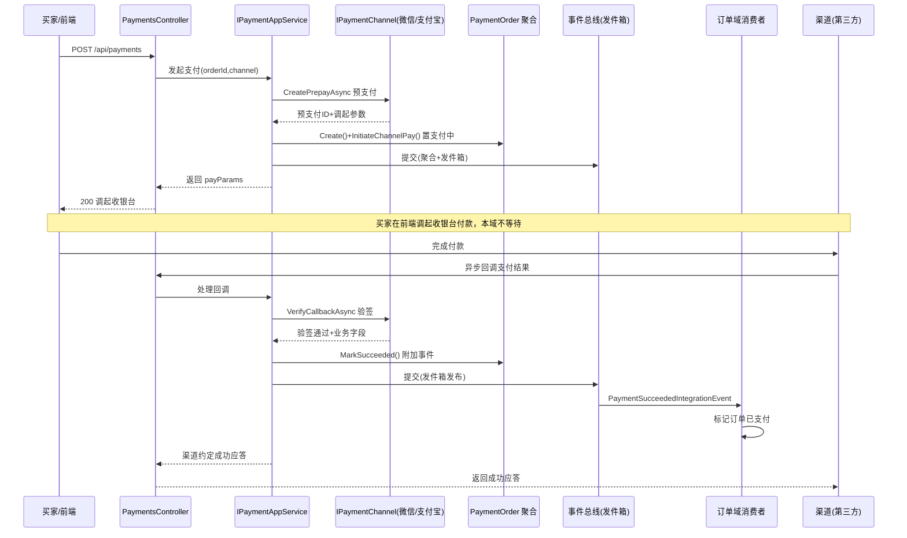
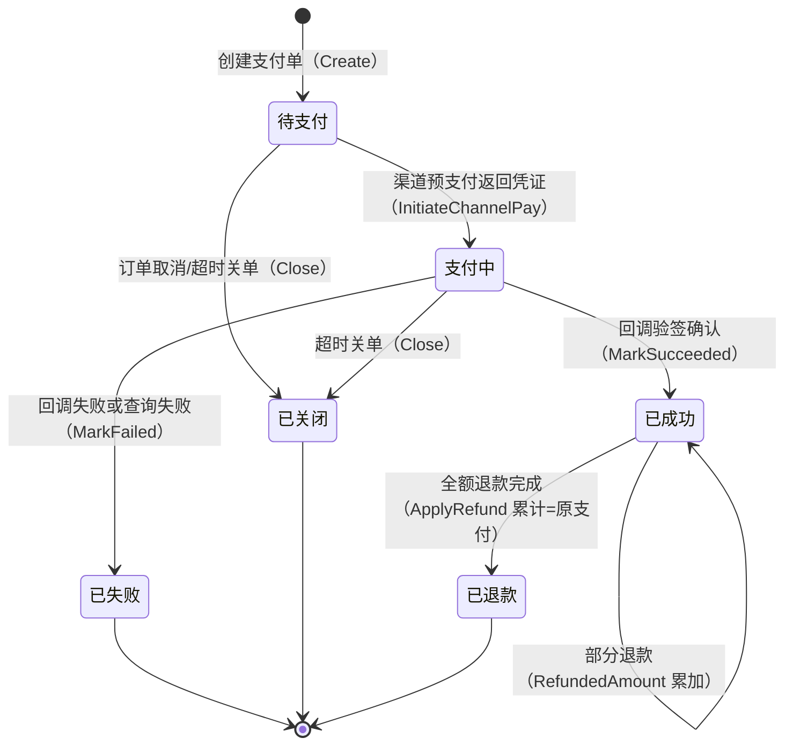
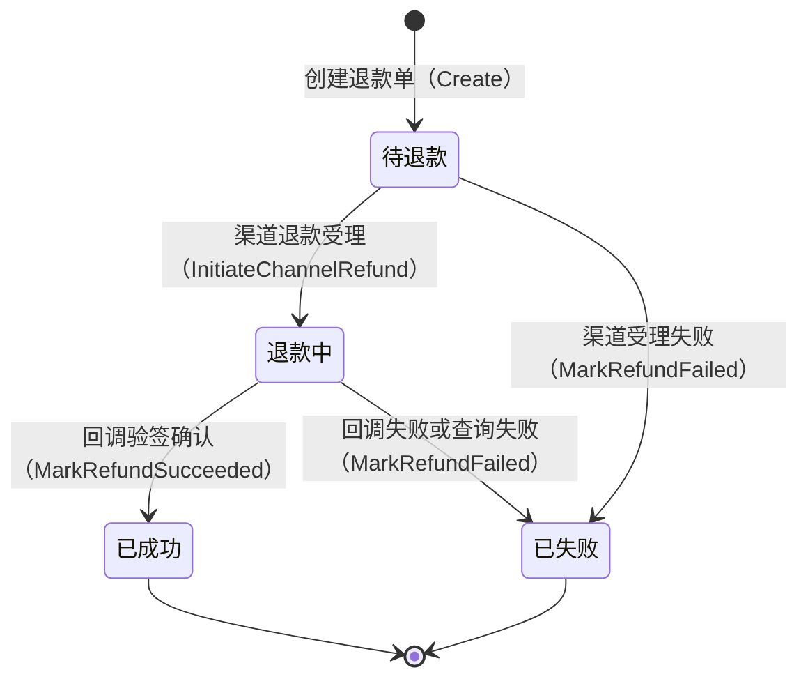

# 支付集成域需求文档

**所属限界上下文**：BC8 支付集成域
**文档版本**：V2.2
**创建日期**：2026-07-09
**类型**：支撑域

本域对应总览文档限界上下文表中的 BC8，作为支撑域承接订单域的支付请求与评价与售后域的退款请求，对接微信支付与支付宝两个外部渠道，对应原始需求 3.4 节支付集成。文档遵循 `00-需求文档总览与DDD架构.md` 第 4 章分层架构规范、第 3 章共享内核与统一语言、第 4.8 节外部能力配置驱动约定，并与第 5 章跨上下文事件清单保持一致。渠道参数配置化、回调验签、异步不阻塞主交易是贯穿全文的三条主线。

## 1 上下文概述

### 1.1 职责

本域是交易主链路的支付侧支撑域，承担四类职责：以支付单聚合根对接微信支付与支付宝，创建预支付并接收渠道异步回调确认支付结果；以退款单聚合根承接售后退款请求，向渠道发起退款并接收退款回调；对支付与退款回调执行渠道验签与幂等处理，避免伪造回调与重复入账；按日与渠道对账文件核对差异并补偿。订单域与售后域不直接持有任何渠道 SDK，所有渠道交互收敛于本域，渠道可替换、参数配置化。

本域不负责订单状态机本身，订单的待支付→已支付流转由订单域消费本域发布的 `PaymentSucceededIntegrationEvent` 完成；本域也不负责售后单状态机，退款完成后以 `RefundSucceededIntegrationEvent` 通知售后域流转。本域只对支付单与退款单两个聚合权威持有生命周期。

### 1.2 边界

本域内部包含两个聚合根：**PaymentOrder**（支付单聚合根）与 **RefundOrder**（退款单聚合根）。支付单以业务订单号为锚点，一笔业务订单可对应多次支付尝试（买家支付失败或关单后可重新发起，每次创建新的支付单），故支付单与业务订单为一对多关系；同一时刻一笔业务订单只允许存在一个未关单的待支付或支付中支付单，以避免重复扣款。退款单以原支付单为锚点，一张支付单可对应多笔部分退款退款单，累计退款金额不得超过原支付金额。

渠道凭证（商户号、AppID、密钥、证书、回调 URL）以 `ChannelCredential` 值对象表达，属敏感信息，领域层只见 `IPaymentChannel` 抽象与 `IExternalChannelOptions` 配置契约，具体参数由基础设施层从配置中心或 `appsettings.json` 注入。本域不持有订单、售后聚合对象，只以 ID 与业务单号引用；订单应付金额、售后退款金额由上游通过集成事件或查询接口传入。

**关键警告**：支付单聚合权威由本域持有，订单域仅保留对支付单的引用与支付状态标记，避免两侧重复建模支付生命周期。

### 1.3 与其他上下文的关系

依据总览文档第 3.2 章的上下文映射，本域作为支撑域围绕交易主链路，与四个上下文存在协作：

- 订单域（防腐层 + 共享内核事件）：订单域经防腐层发布 `PaymentRequestedIntegrationEvent` 请求支付，本域消费后创建支付单对接渠道；支付回调确认后本域发布 `PaymentSucceededIntegrationEvent`，订单域消费标记已支付；支付失败发布 `PaymentFailedIntegrationEvent`，订单域消费决定关单或保持待支付。订单域不直接持有渠道 SDK，所有渠道交互经本域。
- 评价与售后域（防腐层 + 共享内核事件）：售后退款审核通过后经防腐层发布 `RefundRequestedIntegrationEvent` 请求退款，本域消费后创建退款单向渠道发起退款；退款回调确认后本域发布 `RefundSucceededIntegrationEvent` 回传售后域，售后单流转到退款完成；退款失败发布 `RefundFailedIntegrationEvent` 通知售后域重试或转人工。
- 消息通知域（客户-供应商）：支付成功与退款完成后，本域可选发布通知请求事件，由消息通知域向买家发送支付成功或退款到账通知，通知渠道参数同样配置化。
- 用户域：支付单与退款单归属买家，以 UserId 引用，JWT 中携带用户 ID 与角色声明供本域鉴权买家发起支付的权限。

上下文映射上，本域对订单域与售后域为下游消费其支付/退款请求事件、上游回传支付/退款结果事件的双向事件协作关系；对消息通知域为通知请求的发布方。

### 1.4 异步不阻塞主交易

支付与退款均为外部渠道异步交互：发起支付时本域同步创建支付单并调用渠道预支付返回凭证后即应答，不等待买家实际完成付款；渠道付款结果由异步回调驱动，且回调可能丢失或延迟，故辅以主动查询补偿任务兜底。退款同理，渠道退款受理后异步处理，结果由回调与查询补偿共同确认。订单与售后主流程不阻塞等待渠道结果，仅消费本域发布的集成事件完成各自状态流转，最终一致性由发件箱模式与死信重试保障。

## 2 领域模型设计

本域严格遵循总览文档第 4 章与 DDD 最佳实践的分层规范。领域层封装支付单与退款单聚合、值对象、领域服务、渠道抽象接口、仓储接口与领域事件，不引用任何技术细节；应用层编排支付与退款用例、控制事务边界、订阅上游请求事件；基础设施层实现微信支付与支付宝渠道适配器、EF Core 仓储、回调验签、对账文件解析与渠道参数配置绑定；表现层只调用应用服务。

### 2.1 聚合与实体

本域设两个聚合根：`PaymentOrder` 与 `RefundOrder`。两者分属不同聚合，单次事务只修改其一，退款单确认成功时对支付单的已退款累计更新经应用层在独立事务或事件驱动完成，避免跨聚合同事务。

#### 2.1.1 PaymentOrder 聚合根

`PaymentOrder` 是支付单聚合根，封装支付金额、渠道、状态与渠道路径（预支付 ID、渠道交易号），所有变更通过行为意图明确的方法完成，禁止外部直接 set 字段。

| 字段名 | 类型 | 说明 | 约束 |
|-|-|-|-|
| PaymentOrderId | Guid | 支付单唯一标识 | 主键，创建时生成 |
| PaymentNo | string | 我方支付流水号 | 全局唯一，按规则生成（见第 6 章） |
| OrderId | Guid | 关联订单标识 | 非空，引用订单域 |
| BusinessOrderNo | string | 业务订单号 | 非空，来自订单域 |
| UserId | Guid | 买家标识 | 非空 |
| Amount | PaymentAmount | 支付金额（值对象） | >0，等于订单应付总额 |
| Channel | PaymentChannel | 支付渠道 | 枚举 WeChat/Alipay |
| PayScene | PayScene? | 支付场景 | 枚举 JSAPI/Native/Scan/App/Wap/PCWeb，预支付时填充 |
| Status | PaymentStatus | 支付状态 | 枚举见 2.1.3 |
| PrepayId | string? | 渠道预支付 ID | 微信预支付 ID 或支付宝订单号，预支付后填充 |
| PayParams | string? | 调起参数 JSON | 返回前端调起收银台的参数，预支付后填充 |
| TradeNo | string? | 渠道交易号 | 回调确认成功后填充 |
| CallbackRaw | string? | 回调原始报文 | 验签后留存，便于对账与排查 |
| ExpireAt | DateTime | 支付单有效期 | 创建时刻 + 30 分钟，UTC |
| PaidAt | DateTime? | 支付成功时间 | 成功起填充，UTC |
| CallbackReceivedAt | DateTime? | 回调到达时间 | 回调后填充，UTC |
| FailReason | string? | 失败原因 | 失败起填充 |
| RefundedAmount | Money | 已退款累计 | ≥0，初始 0，退款成功累加 |
| CreatedAt | DateTime | 创建时间 | UTC，基础设施层填充 |
| UpdatedAt | DateTime | 更新时间 | UTC，基础设施层填充 |
| Version | int | 乐观锁版本号 | 并发控制 |

`PaymentOrder` 聚合方法（行为意图明确，避免贫血模型）：

- `Create(...)`：工厂方法，校验金额 > 0、渠道合法，生成 `PaymentNo`，置状态为待支付，设置 `ExpireAt`。
- `InitiateChannelPay(prepayId, payParams, payScene)`：仅待支付态可调用，记录渠道预支付 ID 与调起参数，置状态为支付中。
- `MarkSucceeded(tradeNo, paidAt, callbackRaw)`：仅待支付或支付中态可调用，置状态为已成功，记录渠道交易号、支付时间与回调报文，附加 `PaymentSucceededIntegrationEvent`。同一支付单重复确认幂等返回成功，不重复发布事件。
- `MarkFailed(reason)`：仅待支付或支付中态可调用，置状态为已失败，记录原因，附加 `PaymentFailedIntegrationEvent`。
- `Close()`：仅待支付或支付中态可调用，置状态为已关闭，附加 `PaymentClosedEvent`。用于订单取消、超时或主动关单。
- `ApplyRefund(refundAmount)`：仅已成功态可调用，校验 `RefundedAmount + refundAmount ≤ Amount`，累加已退款累计；若累计等于原支付金额则置状态为已退款。退款金额超额抛出领域异常。

**关键警告**：`ApplyRefund` 的累计退款上限由聚合根方法保证，退款回调金额不得超过原支付未退余额，超额拒绝并记录差异。

#### 2.1.2 RefundOrder 聚合根

`RefundOrder` 是退款单聚合根，封装退款金额、渠道与状态，退款渠道继承自原支付单渠道。

| 字段名 | 类型 | 说明 | 约束 |
|-|-|-|-|
| RefundOrderId | Guid | 退款单唯一标识 | 主键，创建时生成 |
| RefundNo | string | 我方退款流水号 | 全局唯一，按规则生成 |
| PaymentOrderId | Guid | 原支付单标识 | 非空 |
| PaymentNo | string | 原支付流水号 | 非空，用于渠道退款请求 |
| OrderId | Guid | 关联订单标识 | 非空 |
| AfterSalesId | Guid? | 关联售后单标识 | 可空，来自售后域 |
| UserId | Guid | 买家标识 | 非空 |
| RefundAmount | PaymentAmount | 退款金额（值对象） | >0，≤原支付未退余额 |
| Channel | PaymentChannel | 退款渠道 | 继承原支付单渠道 |
| Status | RefundStatus | 退款状态 | 枚举见 2.1.3 |
| ChannelRefundNo | string? | 渠道退款号 | 回调确认后填充 |
| Reason | string | 退款原因 | 非空，≤200 字 |
| CallbackRaw | string? | 回调原始报文 | 验签后留存 |
| SucceededAt | DateTime? | 退款成功时间 | 成功起填充，UTC |
| FailReason | string? | 失败原因 | 失败起填充 |
| CreatedAt | DateTime | 创建时间 | UTC |
| UpdatedAt | DateTime | 更新时间 | UTC |
| Version | int | 乐观锁版本号 | 并发控制 |

`RefundOrder` 聚合方法：

- `Create(...)`：工厂方法，校验退款金额 > 0 且不超过原支付未退余额，生成 `RefundNo`，置状态为待退款。
- `InitiateChannelRefund(channelRefundNo)`：仅待退款态可调用，记录渠道退款受理号，置状态为退款中。
- `MarkRefundSucceeded(channelRefundNo, succeededAt, callbackRaw)`：仅退款中态可调用，置状态为已成功，记录渠道退款号、成功时间与回调报文，附加 `RefundSucceededIntegrationEvent`。重复确认幂等返回成功。
- `MarkRefundFailed(reason)`：仅退款中态可调用，置状态为已失败，记录原因，附加 `RefundFailedIntegrationEvent`。

退款单确认成功后，应用层据此调用原支付单的 `ApplyRefund(refundAmount)` 累加已退款累计，两者跨聚合经事件或独立事务串联，不在同一事务内同时修改。

#### 2.1.3 值对象

值对象无唯一标识，通过属性值判断相等性，不可变。`Money` 沿用共享内核定义（金额与币种，四舍五入到两位小数）。

##### PaymentChannel

| 字段 | 类型 | 说明 | 约束 |
|-|-|-|-|
| Value | string | 支付渠道 | 枚举 WeChat/Alipay |

##### PaymentAmount

| 字段名 | 类型 | 说明 | 约束 |
|-|-|-|-|
| Money | Money | 金额与币种 | >0，沿用共享内核 Money |
| Verified | bool | 是否已与订单应付核对 | 创建时由应用层置 true |

构造时校验金额 > 0，`Verified` 标识该金额已与订单域应付总额核对一致，防止支付单金额与订单金额漂移。

##### PaymentStatus

| 字段 | 类型 | 说明 | 约束 |
|-|-|-|-|
| Value | string | 支付状态 | 枚举 Pending/Paying/Success/Failed/Closed/Refunded |

含义：Pending 待支付、Paying 支付中（已预支付待回调）、Success 已成功、Failed 已失败、Closed 已关闭、Refunded 已退款（全额退款后）。

##### RefundStatus

| 字段 | 类型 | 说明 | 约束 |
|-|-|-|-|
| Value | string | 退款状态 | 枚举 Pending/Processing/Success/Failed |

含义：Pending 待退款、Processing 退款中（已向渠道发起待回调）、Success 已成功、Failed 已失败。

##### PayScene

| 字段 | 类型 | 说明 | 约束 |
|-|-|-|-|
| Value | string | 支付场景 | 枚举 JSAPI/Native/Scan/App/Wap/PCWeb |

微信侧 JSAPI 对应公众号/小程序、Native 对应扫码、App 对应 App 支付；支付宝侧 App/Wap/PCWeb 分别对应 App、手机网站、电脑网站支付。

##### ChannelCredential

| 字段名 | 类型 | 说明 | 约束 |
|-|-|-|-|
| Channel | PaymentChannel | 渠道 | 非空 |
| MerchantId | string | 商户号 | 非空，敏感 |
| AppId | string | 应用 ID | 非空，敏感 |
| ApiKey | string | API 密钥/私钥 | 非空，敏感，日志脱敏 |
| CertInfo | CertInfo? | 证书信息 | 可空，微信需证书 |
| NotifyUrl | string | 支付回调 URL | 非空，HTTPS |
| RefundNotifyUrl | string | 退款回调 URL | 非空，HTTPS |

`CertInfo` 含证书序列号与证书路径/口令，敏感字段日志脱敏输出。该值对象仅基础设施层在构造适配器时持有，领域层与应用层只见 `IPaymentChannel` 抽象。

#### 2.1.4 支付单与退款单聚合边界说明

`PaymentOrder` 与 `RefundOrder` 拆分为两个独立聚合，理由有三：第一，支付与退款生命周期独立，退款由售后触发且晚于支付完成，合并聚合会令支付回调加载无关退款明细；第二，单次事务只修改一个聚合，退款回调确认（RefundOrder）与已退款累计更新（PaymentOrder）无强一致耦合，经事件或独立事务串联即可；第三，一对多退款（一张支付单多笔部分退款）下，退款单独立聚合使每笔退款的事务边界更小、重试更可控。

### 2.2 领域服务

领域服务处理无法归入单一聚合的领域逻辑，接口与实现均在领域层。

- `IChannelSelectionService`：渠道选择服务，按配置与金额选择渠道。
  - `SelectAsync(PaymentAmount amount, PayScene? scene)`：依据配置默认渠道、渠道启用状态、金额上下限与场景支持度返回可用渠道；多渠道启用时按配置优先级与金额规则决策。
  - `IsEnabledAsync(PaymentChannel channel)`：校验渠道是否在配置中启用。

- `ICallbackVerificationService`：回调验签服务，按渠道规则验签。
  - `VerifyAsync(PaymentChannel channel, CallbackContext context)`：依据渠道公钥/密钥与签名算法验签，返回验签结果与解析出的业务字段（支付单号、交易号、金额、状态）。验签逻辑实现在基础设施层渠道适配器内，本服务编排按渠道分发。

- `IReconciliationService`：对账服务，核对渠道对账文件与本地支付/退款单。
  - `ReconcileAsync(DateTime date)`：拉取渠道对账文件，逐笔与本域支付单、退款单比对，产出差异清单（本地有渠道无、渠道有本地无、金额不一致）。
  - `ClassifyDiscrepancy(local, channel)`：对差异分类并产出补偿动作建议（补单、冲正、转人工）。

- `IPaymentAmountValidator`：支付金额一致性校验，防止支付单金额与订单应付漂移。
  - `ValidateAsync(Guid orderId, PaymentAmount amount)`：经防腐层查询订单域应付总额，校验支付单金额一致，不一致抛出领域异常。

- `IRefundAmountValidator`：退款金额上限校验，防止退款超过原支付未退余额。
  - `ValidateAsync(Guid paymentOrderId, Money refundAmount)`：加载原支付单已退款累计，校验本次退款不超额，返回允许最大可退金额。

### 2.3 仓储接口

仓储接口定义在领域层，命名遵循 `I{聚合根名}Repository`，由基础设施层实现（如 `EfCorePaymentOrderRepository`、`EfCoreRefundOrderRepository`）。

```csharp
// 领域层
public interface IPaymentOrderRepository
{
    Task<PaymentOrder?> GetByIdAsync(Guid paymentOrderId, CancellationToken ct = default);
    Task<PaymentOrder?> GetByPaymentNoAsync(string paymentNo, CancellationToken ct = default);
    Task<PaymentOrder?> GetActiveByOrderIdAsync(Guid orderId, CancellationToken ct = default);
    Task<(IReadOnlyList<PaymentOrder> Items, int Total)> QueryAsync(PaymentOrderQuery query, CancellationToken ct = default);
    Task AddAsync(PaymentOrder paymentOrder, CancellationToken ct = default);
    Task UpdateAsync(PaymentOrder paymentOrder, CancellationToken ct = default);
}

public interface IRefundOrderRepository
{
    Task<RefundOrder?> GetByIdAsync(Guid refundOrderId, CancellationToken ct = default);
    Task<RefundOrder?> GetByRefundNoAsync(string refundNo, CancellationToken ct = default);
    Task<IReadOnlyList<RefundOrder>> GetByPaymentOrderIdAsync(Guid paymentOrderId, CancellationToken ct = default);
    Task<(IReadOnlyList<RefundOrder> Items, int Total)> QueryAsync(RefundOrderQuery query, CancellationToken ct = default);
    Task AddAsync(RefundOrder refundOrder, CancellationToken ct = default);
    Task UpdateAsync(RefundOrder refundOrder, CancellationToken ct = default);
}
```

`PaymentOrderQuery` 与 `RefundOrderQuery` 为查询参数对象，支持按 orderId、userId、channel、status、时间区间过滤与分页。`GetActiveByOrderIdAsync` 返回一笔订单当前未关单的待支付或支付中支付单，用于发起支付时复用判断。

### 2.4 渠道适配抽象

渠道适配是本域的核心设计，体现总览文档第 4.8 节外部能力配置驱动。领域层定义 `IPaymentChannel` 抽象接口，基础设施层提供微信支付与支付宝两个具体适配器实现，适配器所需参数从配置中心或 `appsettings.json` 注入。切换或新增服务商只需新增适配器实现并改配置，不触动领域层与应用层。

```csharp
// 领域层抽象（依赖倒置，领域层定义契约）
public interface IPaymentChannel
{
    PaymentChannel Channel { get; }

    // 创建预支付，返回预支付 ID 与调起参数
    Task<PrepayResult> CreatePrepayAsync(PrepayRequest request, CancellationToken ct = default);

    // 主动查询支付状态（补偿回调丢失）
    Task<ChannelPayStatus> QueryPayStatusAsync(string outTradeNo, CancellationToken ct = default);

    // 回调验签，返回验签结果与解析出的业务字段
    Task<CallbackVerifyResult> VerifyCallbackAsync(CallbackContext context, CancellationToken ct = default);

    // 发起退款
    Task<RefundResult> RefundAsync(RefundRequest request, CancellationToken ct = default);

    // 主动查询退款状态（补偿回调丢失）
    Task<ChannelRefundStatus> QueryRefundStatusAsync(string outRefundNo, CancellationToken ct = default);
}

// 应用层通过工厂按渠道获取适配器实例
public interface IPaymentChannelFactory
{
    IPaymentChannel Resolve(PaymentChannel channel);
    IReadOnlyList<PaymentChannel> GetEnabledChannels();
}
```

基础设施层落点：`WeChatPayChannel` 实现 `IPaymentChannel`，对接微信支付 V3 API（微信支付 V3 统一下单、查单、验签、退款接口），参数（商户号、AppID、API V3 密钥、商户私钥、证书序列号、平台公钥、回调 URL）从配置注入；`AlipayChannel` 实现 `IPaymentChannel`，对接支付宝开放平台网关（支付宝 alipay.trade.precreate/pay/query/refund 接口），参数（AppID、应用私钥、支付宝公钥、网关地址、签名类型、回调 URL）从配置注入。`PaymentChannelFactory` 依据配置中启用的渠道构造适配器实例并注入凭证。

配置结构示例（完整 `appsettings` 片段见第 8 章）：

```csharp
// 配置选项绑定
public class PaymentOptions
{
    public string DefaultChannel { get; set; } = "WeChat";
    public Dictionary<string, ChannelCredentialOptions> Channels { get; set; } = new();
}

public class ChannelCredentialOptions
{
    public bool Enabled { get; set; }
    public int Priority { get; set; }
    public string MerchantId { get; set; } = string.Empty;
    public string AppId { get; set; } = string.Empty;
    public string ApiKey { get; set; } = string.Empty;       // 微信 API V3 密钥 / 支付宝应用私钥
    public string? PublicKey { get; set; }                    // 支付宝公钥 / 微信平台公钥
    public string? CertSerialNo { get; set; }                 // 微信证书序列号
    public string? CertPath { get; set; }                     // 微信证书路径
    public string NotifyUrl { get; set; } = string.Empty;
    public string RefundNotifyUrl { get; set; } = string.Empty;
}
```

**关键警告**：渠道密钥、证书口令等敏感参数须存于配置中心或环境变量，不落代码仓库，日志中脱敏输出，仅基础设施层在构造适配器时读取。

### 2.5 分层落点

| 分层 | 支付集成域落点 | 职责 |
|-|-|-|
| 领域层 | `PaymentOrder`/`RefundOrder` 聚合，`PaymentChannel`/`PaymentAmount`/`PaymentStatus`/`RefundStatus`/`PayScene`/`ChannelCredential`/`CertInfo` 值对象，`IPaymentChannel`/`IPaymentChannelFactory` 渠道抽象，`IChannelSelectionService`/`ICallbackVerificationService`/`IReconciliationService`/`IPaymentAmountValidator`/`IRefundAmountValidator` 领域服务，`IPaymentOrderRepository`/`IRefundOrderRepository` 仓储接口，第 3 章领域事件 | 封装支付/退款状态机、金额一致性与渠道抽象契约 |
| 应用层 | `IPaymentAppService`、`IRefundAppService`、`IReconciliationAppService`、`IPaymentConfigAppService`，DTO、Command/Query，`PaymentRequestedIntegrationEventConsumer`/`RefundRequestedIntegrationEventConsumer` 入站事件消费者，事务边界，编排渠道适配器 | 用例编排与事务管理、事件订阅与发布 |
| 基础设施层 | `WeChatPayChannel`/`AlipayChannel` 适配器实现、`PaymentChannelFactory`、`EfCorePaymentOrderRepository`/`EfCoreRefundOrderRepository`、回调验签实现、对账文件解析器、`PaymentOptions` 配置绑定、发件箱发布 | 渠道对接、持久化、验签、对账、配置注入 |
| 表现层 | `PaymentsController`（发起支付/查询）、`PaymentCallbacksController`（微信/支付宝回调端点，无需鉴权但验签）、`RefundsController`（发起/查询退款）、`RefundCallbacksController`（退款回调）、`PaymentConfigController`（系统管理员配置） | 接收请求、调用应用服务、返回 DTO |

## 3 领域事件清单

领域事件在聚合方法中产生，本上下文内消费的用于解耦聚合内部逻辑；对外发布的集成事件经事件总线传递。事件命名统一过去时。聚合保存与事件记录在同一事务写入（发件箱模式），后台进程轮询发件箱表并发布到消息队列，消费失败进入死信队列重试，超阈值告警。本域消费两个入站集成事件：订单域 `PaymentRequestedIntegrationEvent`（创建支付单对接渠道）、评价与售后域 `RefundRequestedIntegrationEvent`（创建退款单向渠道退款）。

| 事件名 | 触发时机 | 消费方 | 关键字段 |
|-|-|-|-|
| `PaymentRequestedIntegrationEvent`（入站） | 订单域买家发起支付请求 | 支付集成域（创建支付单对接渠道） | orderId, businessOrderNo, userId, amount, channel?, scene?, idempotencyKey |
| `RefundRequestedIntegrationEvent`（入站） | 售后域退款审核通过 | 支付集成域（创建退款单向渠道退款） | afterSalesId, orderId, paymentOrderId, userId, refundAmount, reason, idempotencyKey |
| `PaymentSucceededIntegrationEvent` | 支付回调验签确认成功 | 订单域（标记已支付） | paymentOrderId, paymentNo, orderId, tradeNo, channel, amount, paidAt |
| `PaymentFailedIntegrationEvent` | 支付失败或回调验签失败 | 订单域（关单或保持待支付） | paymentOrderId, orderId, failReason, failedAt |
| `PaymentClosedEvent` | 支付单关单（订单取消/超时/主动关单） | 订单域内部、对账 | paymentOrderId, orderId, closedAt, reason |
| `RefundSucceededIntegrationEvent` | 退款回调验签确认成功 | 评价与售后域（售后单流转退款完成） | refundOrderId, refundNo, paymentOrderId, orderId, afterSalesId, channelRefundNo, refundAmount, succeededAt |
| `RefundFailedIntegrationEvent` | 退款失败 | 评价与售后域（重试或转人工） | refundOrderId, orderId, afterSalesId, failReason, failedAt |

`PaymentSucceededIntegrationEvent` 与 `RefundSucceededIntegrationEvent` 是本域回传上游的核心事件，分别驱动订单域标记已支付与售后域流转退款完成。本域在事件中携带 `idempotencyKey` 供上游幂等消费，避免回调重试导致重复状态流转。支付成功后本域可选向消息通知域发布通知请求事件，由通知域向买家发送支付成功通知。

## 4 功能需求

### 4.0 功能点概览表

| 编号 | 功能模块 | 功能描述 |
|-|-|-|
| F-PAY-001 | 发起支付与渠道预支付 | 消费支付请求，创建支付单并调用渠道预支付，返回调起参数/二维码/跳转链接 |
| F-PAY-002 | 微信支付渠道对接 | 对接微信支付 JSAPI/Native/Scan 场景，创建预支付与调起参数 |
| F-PAY-003 | 支付宝渠道对接 | 对接支付宝 App/Wap/PCWeb 场景，创建交易与跳转链接 |
| F-PAY-004 | 支付异步回调接收与验签 | 接收微信/支付宝支付回调，按渠道规则验签确认支付单 |
| F-PAY-005 | 支付结果主动查询补偿 | 定时查询待支付/支付中支付单状态，补偿回调丢失 |
| F-PAY-006 | 支付成功通知订单域 | 支付确认后发布 PaymentSucceededIntegrationEvent 通知订单域 |
| F-PAY-007 | 支付失败处理与关单 | 支付失败标记、订单取消后关单、超时关单 |
| F-PAY-008 | 退款发起 | 消费退款请求，创建退款单向渠道发起退款 |
| F-PAY-009 | 退款异步回调接收与验签 | 接收退款回调，验签确认退款单 |
| F-PAY-010 | 退款结果通知售后域 | 退款确认后发布 RefundSucceeded/FailedIntegrationEvent 通知售后域 |
| F-PAY-011 | 退款主动查询补偿 | 定时查询退款中退款单状态，补偿回调丢失 |
| F-PAY-012 | 渠道对账 | 每日拉取渠道对账文件核对本地支付/退款单差异并补偿 |
| F-PAY-013 | 渠道参数配置管理 | 系统管理员配置微信/支付宝参数，热更新、脱敏 |
| F-PAY-014 | 多渠道选择策略 | 按配置默认渠道、启用状态、金额与场景选择渠道 |
| F-PAY-015 | 支付与退款状态查询 | 买家与运营查询支付单、退款单状态与明细 |
| F-PAY-016 | 支付异常实时监控 | 运营查看连续失败、超时未回调、金额不一致等异常支付列表 |

### F-PAY-001 发起支付与渠道预支付

业务逻辑：`PaymentRequestedIntegrationEventConsumer` 消费订单域发布的支付请求事件，以 `idempotencyKey` 幂等去重。应用服务经 `IPaymentAmountValidator` 校验支付金额与订单应付总额一致，经 `IPaymentOrderRepository.GetActiveByOrderIdAsync` 检查是否已有未关单支付单，有则复用或先关单再创建。调用 `PaymentOrder.Create` 工厂方法创建待支付支付单，经 `IChannelSelectionService` 确定渠道，经 `IPaymentChannelFactory.Resolve` 获取适配器调用 `CreatePrepayAsync` 向渠道发起预支付。渠道返回预支付 ID 与调起参数后调用 `PaymentOrder.InitiateChannelPay` 置支付中，记录 `PrepayId` 与 `PayParams`。UnitOfWork 提交保存聚合。

交互逻辑：买家也可经 `POST /api/payments` 同步发起支付，body `{ orderId, channel?, scene? }`，应用服务内部同样构造支付请求编排。成功返回 `{ paymentOrderId, paymentNo, channel, payParams, expireAt }`，前端据 `payParams` 调起微信收银台或跳转支付宝收银台。

规则约束：支付单金额须等于订单应付总额；同一订单同一时刻仅一个未关单待支付或支付中支付单；订单已支付或已取消拒绝发起；`ExpireAt` 为创建时刻加 30 分钟；`Idempotency-Key` 重复请求返回首次结果。

权限逻辑：买家发起支付需登录态，UserId 取自 JWT 且须为订单买家；运营不可代买家发起支付。

边界与异常：渠道预支付调用超时返回 503 提示重试，支付单保持待支付不置支付中；订单已过期拒绝发起支付返回 409；渠道返回错误时支付单不创建或置失败并提示；预支付成功但聚合保存失败时应用层回滚，因渠道侧已创建订单由对账任务清理。

### F-PAY-002 微信支付渠道对接

业务逻辑：`WeChatPayChannel.CreatePrepayAsync` 对接微信支付 V3 统一下单接口（`/v3/pay/transactions/jsapi`、`/v3/pay/transactions/native`、`/v3/pay/transactions/app`），按 `PayScene` 选择接口：JSAPI 场景传 openid 返回小程序/公众号调起参数，Native 场景返回扫码链接，App 场景返回 App 调起参数。请求携带商户号、AppID、我方支付单号、金额（分）、回调 URL、过期时间。验签 `VerifyCallbackAsync` 用微信平台公钥校验回调报文签名与时间戳防重放，解析出支付单号、交易号、金额、状态。

交互逻辑：内部渠道适配，无独立端点；由 F-PAY-001 发起支付与 F-PAY-004 回调编排调用。

规则约束：金额以分为单位整数传递，与支付单金额四舍五入换算一致；回调 URL 须与配置 `NotifyUrl` 一致；微信回调时间戳偏差超 5 分钟视为重放攻击拒绝。

权限逻辑：系统内部调用，不对外暴露。

边界与异常：微信接口限流或超时由适配器重试有限次后抛出；回调报文格式异常或解密失败拒绝处理并记录；证书缺失或密钥过期导致签名失败告警。

### F-PAY-003 支付宝渠道对接

业务逻辑：`AlipayChannel.CreatePrepayAsync` 对接支付宝开放平台网关（`alipay.trade.precreate`（扫码）、`alipay.trade.wap.pay`（手机网站）、`alipay.trade.page.pay`（电脑网站）、`alipay.trade.app.pay`（App）），按 `PayScene` 选择接口：PCWeb 返回跳转表单 URL，Wap 返回手机网站跳转 URL，Native 返回扫码二维码链接，App 返回 App 调起参数串。请求携带 AppID、我方支付单号、金额、标题、回调 URL，以应用私钥 RSA2 签名。验签 `VerifyCallbackAsync` 用支付宝公钥校验回调签名，解析出支付单号、交易号、金额、状态。

交互逻辑：内部渠道适配，无独立端点；由 F-PAY-001 与 F-PAY-004 编排调用。

规则约束：金额以元为单位两位小数传递；签名类型 RSA2；回调 URL 须与配置 `NotifyUrl` 一致；支付宝异步通知须返回 `success` 字符串应答。

权限逻辑：系统内部调用，不对外暴露。

边界与异常：网关返回错误码（如系统繁忙）由适配器重试有限次；回调签名不匹配拒绝并记录；应用私钥泄露风险由配置中心托管与脱敏日志控制。

### F-PAY-004 支付异步回调接收与验签

业务逻辑：渠道异步通知支付结果到回调端点。控制器接收原始报文后交应用服务，经 `ICallbackVerificationService.VerifyAsync` 按渠道规则验签，验签失败拒绝并记录异常。验签通过后解析出我方支付单号与渠道交易号、金额、状态，按 `PaymentNo` 加载 `PaymentOrder` 聚合。校验回调金额与支付单金额一致，金额不一致拒绝并记录差异。支付成功调用 `PaymentOrder.MarkSucceeded(tradeNo, paidAt, callbackRaw)` 置已成功并附加 `PaymentSucceededIntegrationEvent`；支付失败调用 `MarkFailed(reason)`。UnitOfWork 提交，事件经发件箱发布。

交互逻辑：`POST /api/payments/callbacks/wechat` 与 `POST /api/payments/callbacks/alipay`，第三方以 JSON/XML/表单推送通知，端点返回渠道约定成功应答（微信返回 JSON `{"code":"SUCCESS"}`，支付宝返回纯文本 `success`）。

规则约束：回调强制验签；金额校验失败拒绝并记录；回调幂等，同一支付单重复确认返回成功不重复发布事件；已关闭支付单收到成功回调须触发对账退款。

权限逻辑：回调端点匿名（由第三方调用），仅以验签与金额校验保障安全，不经 JWT 鉴权。

边界与异常：回调重复到达以 `PaymentStatus` 幂等；回调到达但支付单已被超时关单时进入对账退款流程；回调延迟导致支付单超时关单的竞态由对账任务补偿；验签失败返回失败应答且不修改状态。

支付发起与回调确认的异步时序如下，主交易不阻塞等待渠道结果。



### F-PAY-005 支付结果主动查询补偿

业务逻辑：回调可能丢失或延迟，定时补偿任务扫描处于待支付或支付中且未过期的支付单，经 `IPaymentChannel.QueryPayStatusAsync` 主动查询渠道真实状态。渠道返回成功且金额一致则调用 `PaymentOrder.MarkSucceeded`，返回失败则 `MarkFailed`，返回待支付则跳过。任务按支付单创建时间分批扫描，避免一次性加载过多。

交互逻辑：定时调度驱动，无前端交互；对账服务 `PaymentReconcileService` 扫描周期为每 2 分钟，扫描创建后超过 1 分钟仍未终态的支付单。

规则约束：仅查询未终态支付单；查询结果须验签或来源可信（渠道查单接口响应本身经渠道签名）；金额不一致不确认并记录差异转对账。

权限逻辑：系统内部调度任务，不对外暴露。

边界与异常：渠道查单接口超时或限流时跳过该单下次再查；查询与回调并发到达时以聚合乐观锁与状态校验幂等处理，先到者生效；查询连续多次失败告警。

### F-PAY-006 支付成功通知订单域

业务逻辑：`PaymentOrder.MarkSucceeded` 附加 `PaymentSucceededIntegrationEvent`，事件经发件箱发布到事件总线，订单域消费后将订单标记已支付并触发库存真实扣减、优惠券核销、卖家发货通知等后续流程。本域在事件中携带 `paymentOrderId`、`paymentNo`、`orderId`、`tradeNo`、`channel`、`amount`、`paidAt`，并以 `idempotencyKey` 支持订单域幂等消费。

交互逻辑：事件驱动，随支付确认触发，无前端交互。

规则约束：仅已成功态支付单发布成功事件；事件消费幂等，订单域重复消费不重复流转订单状态。

权限逻辑：系统内部事件，不对外暴露。

边界与异常：订单域消费失败由死信队列重试，超阈值告警；订单已被取消时收到支付成功事件由订单域决定退款对账，本域已关单支付单的成功回调由对账任务触发退款。

### F-PAY-007 支付失败处理与关单

业务逻辑：支付失败时 `PaymentOrder.MarkFailed(reason)` 附加 `PaymentFailedIntegrationEvent`，通知订单域关单或保持待支付待买家重试。订单取消（买家主动或超时）后，应用层加载该订单未完成的支付单调用 `Close` 置已关闭并附加 `PaymentClosedEvent`，避免后续回调误确认。超时关单由补偿任务扫描超过 `ExpireAt` 仍未终态的支付单调用 `Close`。

交互逻辑：失败由回调或查询接口感知；关单随订单取消或超时流程触发，买家也可经 `POST /api/payments/{id}/close` 主动关单后重新发起。

规则约束：失败支付可由买家重新发起（创建新支付单）；已关单支付单不可再确认，收到成功回调须对账退款；超时关单仅针对未终态支付单。

权限逻辑：买家可查询自身支付状态并主动关单重试；超时关单为系统内部操作。

边界与异常：失败回调与成功回调乱序到达时以先到者为准，后到者幂等拒绝；关单后仍收到成功回调进入对账退款；关单与回调并发以乐观锁与状态校验处理。

### F-PAY-008 退款发起

业务逻辑：`RefundRequestedIntegrationEventConsumer` 消费售后域发布的退款请求事件，以 `idempotencyKey` 幂等去重。应用服务加载原 `PaymentOrder` 聚合，经 `IRefundAmountValidator.ValidateAsync` 校验退款金额不超过原支付未退余额，调用 `RefundOrder.Create` 工厂方法创建待退款退款单。经 `IPaymentChannelFactory.Resolve` 获取与原支付同渠道的适配器调用 `RefundAsync` 向渠道发起退款，携带原支付单号、退款单号、退款金额。渠道受理返回渠道退款号后调用 `RefundOrder.InitiateChannelRefund` 置退款中。UnitOfWork 提交。

交互逻辑：退款由售后域事件驱动；运营也可经 `POST /api/refunds` 介入发起退款，body `{ paymentOrderId, afterSalesId?, refundAmount, reason }`。

规则约束：退款金额 > 0 且 ≤ 原支付未退余额；退款渠道继承原支付渠道；同一退款请求 `Idempotency-Key` 重复返回首次结果。

权限逻辑：售后退款由系统事件驱动；运营介入退款需运营角色。

边界与异常：原支付单未成功（非已成功态）拒绝退款返回 409；退款金额超额返回 400；渠道退款接口超时返回 503，退款单保持待退款由补偿重试；渠道受理失败退款单置失败并通知售后域。

### F-PAY-009 退款异步回调接收与验签

业务逻辑：渠道异步通知退款结果到退款回调端点。控制器接收原始报文交应用服务，经 `ICallbackVerificationService.VerifyAsync` 按渠道规则验签，验签失败拒绝并记录。验签通过后解析出我方退款单号与渠道退款号、金额、状态，按 `RefundNo` 加载 `RefundOrder` 聚合，校验回调金额与退款单金额一致。退款成功调用 `RefundOrder.MarkRefundSucceeded(channelRefundNo, succeededAt, callbackRaw)` 置已成功并附加 `RefundSucceededIntegrationEvent`；退款失败调用 `MarkRefundFailed(reason)`。退款单确认成功后，应用层在独立事务调用原 `PaymentOrder.ApplyRefund(refundAmount)` 累加已退款累计，全额退款则支付单置已退款。UnitOfWork 提交。

交互逻辑：`POST /api/refunds/callbacks/wechat` 与 `POST /api/refunds/callbacks/alipay`，第三方推送通知，端点返回渠道约定成功应答。

规则约束：回调强制验签；金额校验失败拒绝并记录；回调幂等，同一退款单重复确认返回成功不重复发布事件；退款单确认成功与支付单累计更新跨聚合经独立事务串联。

权限逻辑：回调端点匿名，仅以验签与金额校验保障安全。

边界与异常：回调重复到达以 `RefundStatus` 幂等；退款单已被标记失败后收到成功回调以对账补偿；验签失败返回失败应答且不修改状态。

### F-PAY-010 退款结果通知售后域

业务逻辑：`RefundOrder.MarkRefundSucceeded` 附加 `RefundSucceededIntegrationEvent`，`MarkRefundFailed` 附加 `RefundFailedIntegrationEvent`，事件经发件箱发布，售后域消费后将售后单流转到退款完成或重试转人工。成功事件携带 `refundOrderId`、`refundNo`、`paymentOrderId`、`orderId`、`afterSalesId`、`channelRefundNo`、`refundAmount`、`succeededAt`，并以 `idempotencyKey` 支持售后域幂等消费。

交互逻辑：事件驱动，随退款确认触发，无前端交互。

规则约束：仅已成功态退款单发布成功事件，仅已失败态发布失败事件；事件消费幂等。

权限逻辑：系统内部事件，不对外暴露。

边界与异常：售后域消费失败由死信队列重试；退款成功但售后单已取消的竞态由售后域决定处理。

### F-PAY-011 退款主动查询补偿

业务逻辑：退款回调同样可能丢失，定时补偿任务扫描处于退款中且超过一定时长未终态的退款单，经 `IPaymentChannel.QueryRefundStatusAsync` 主动查询渠道真实状态。渠道返回成功且金额一致则 `MarkRefundSucceeded`，返回失败则 `MarkRefundFailed`，返回处理中则跳过。

交互逻辑：定时调度驱动，无前端交互；对账服务 `RefundReconcileService` 扫描周期为每 5 分钟，扫描发起后超过 3 分钟仍未终态的退款单。

规则约束：仅查询退款中退款单；查询结果金额不一致不确认并记录差异转对账。

权限逻辑：系统内部调度任务，不对外暴露。

边界与异常：渠道查退款接口超时跳过下次再查；查询与回调并发以乐观锁与状态校验幂等处理；连续多次失败告警。

### F-PAY-012 渠道对账

业务逻辑：`IReconciliationAppService` 每日定时拉取微信与支付宝对账文件（T+1），经对账文件解析器解析为渠道侧支付与退款明细。`IReconciliationService.ReconcileAsync` 逐笔与本域支付单、退款单比对，产出差异清单：本地有渠道无（本地成功但渠道无记录，疑似误确认）、渠道有本地无（渠道成功但本地未确认，疑似回调丢失）、金额不一致。差异经 `ClassifyDiscrepancy` 分类产出补偿动作：渠道有本地无且金额一致则补确认支付单/退款单并发布事件；本地有渠道无则冲正（发起退款）并告警；金额不一致转人工核对。

交互逻辑：`GET /api/admin/payments/reconciliations?date={date}` 运营查询对账结果与差异清单；对账任务每日定时执行（每日凌晨拉取 T-1 对账文件）。未自动补偿的差异（如金额不一致转人工）由运营核对后经 `POST /api/admin/payments/reconciliations/{date}/mark-resolved` 标记已处理，body `{resolution, operatorNote}`，记录处理方式与处理人，差异状态从待处理变为已处理。

规则约束：对账以渠道对账文件为准核对本地；差异须分类记录并产出补偿动作；冲正与补单操作记录审计；人工标记已处理须记录处理人、处理方式与备注并写入审计日志，状态从待处理变为已处理。

权限逻辑：对账查询与人工处理差异需运营角色；对账任务为系统内部调度。

边界与异常：渠道对账文件未生成或拉取失败告警并次日补对；对账差异超阈值告警转人工；补确认与冲正操作幂等。

### F-PAY-013 渠道参数配置管理

业务逻辑：系统管理员经 `PaymentConfigController` 配置微信与支付宝渠道参数（启用状态、优先级、商户号、AppID、密钥、证书、回调 URL），配置经 `IPaymentConfigAppService` 写入配置中心或 `appsettings`，由 `PaymentChannelFactory` 热加载重建适配器实例。敏感参数（密钥、证书口令）写入时脱敏存储，读取时仅返回掩码（如 `****1234`）。切换默认渠道或启停渠道后，新发起的支付按新配置选择渠道，不影响已创建支付单。

交互逻辑：`GET /api/admin/payment-channels` 查询渠道配置（敏感字段掩码），`PUT /api/admin/payment-channels/{channel}` 更新配置。

规则约束：配置变更热更新，无需重启；敏感参数脱敏存储与展示；回调 URL 须 HTTPS；至少保留一个启用渠道。

权限逻辑：仅系统管理员角色可配置渠道参数。

边界与异常：配置中心不可用时降级读本地 `appsettings` 缓存配置；证书文件路径无效告警；密钥格式校验失败拒绝保存。

### F-PAY-014 多渠道选择策略

业务逻辑：`IChannelSelectionService.SelectAsync` 按配置默认渠道、渠道启用状态、金额上下限与场景支持度决策渠道。买家发起支付时若未指定渠道，按配置 `DefaultChannel` 选择；若默认渠道未启用或不支持当前场景，按 `Priority` 优先级选择次优启用渠道（多渠道选择权重规则，如大额优先某渠道）。

交互逻辑：内部决策，随 F-PAY-001 发起支付编排，无独立端点。

规则约束：仅从启用渠道中选择；渠道须支持当前 `PayScene`；无可用渠道时拒绝发起支付并告警。

权限逻辑：系统内部决策，不对外暴露。

边界与异常：所有渠道均未启用时发起支付返回 503；渠道选择与配置热更新联动，配置变更后下次决策生效。

### F-PAY-015 支付与退款状态查询

业务逻辑：买家查询本人支付单与退款单状态，运营查询全平台支付单与退款单。查询走读库或写库，返回支付单/退款单基础信息、渠道、状态、金额、时间线。退款单查询附带关联的原支付单与售后单引用。

交互逻辑：`GET /api/payments/{paymentOrderId}` 买家查询支付状态，`GET /api/refunds/{refundOrderId}` 买家查询退款状态，`GET /api/admin/payments` 与 `GET /api/admin/refunds` 运营分页查询。运营另可经 `GET /api/admin/payments/statistics` 按时间区间与渠道维度查询交易总额、成功笔数、失败笔数、成功率、退款总额与退款率，用于支付域数据看板；该端点为支付域细粒度统计查询，与跨域统一看板（如由系统管理域承载）互补。

规则约束：买家仅可查询本人支付单与退款单；运营可见全部；分页 page 从 1 开始，pageSize 默认 20、最大 100。

权限逻辑：买家查询须登录态且 UserId 匹配；运营查询须运营角色；越权返回 403。

边界与异常：支付单/退款单不存在或无权访问返回 404；读库秒级最终一致窗口内可能短暂状态滞后。

### F-PAY-016 支付异常实时监控

业务逻辑：运营查看异常支付列表，识别需介入的支付单。异常类型含连续多次失败（同一订单或同一买家短时间多次失败）、超时未回调（支付中且超过预期回调窗口仍未终态）、金额不一致（回调或对账发现金额与支付单不符）。应用服务从支付单与对账差异记录按异常类型、渠道、状态、时间区间聚合产出异常列表，标记每条异常的当前状态与建议处理入口。

交互逻辑：`GET /api/admin/payments/anomalies` 运营分页查询异常支付，支持按异常类型、渠道、状态、时间区间筛选。

规则约束：异常判定阈值（连续失败次数、超时窗口）配置化；异常列表只读，不直接修改支付单状态，处理经对应功能点（关单、对账补偿、人工退款）完成。

权限逻辑：仅运营角色可查询异常列表。

边界与异常：异常判定基于读库秒级最终一致窗口，可能短暂滞后；已处理异常经状态筛选查询，默认仅展示待处理项。

## 5 API 设计

接口遵循总览文档第 8 章 RESTful 规范，资源以名词复数命名，统一响应含 `code`/`message`/`data`，鉴权通过 `Authorization: Bearer {token}`。表现层控制器只调用应用服务，不含业务逻辑与数据访问代码，输入输出一律使用 DTO。支付与退款回调端点匿名，仅以验签保障安全；其余写操作支持 `Idempotency-Key` 头保证重复请求安全。

### 5.1 支付接口

| 方法 | 端点 | 说明 | 请求体概要 | 响应概要 | 鉴权要求 |
|-|-|-|-|-|-|
| POST | /api/payments | 发起支付 | {orderId, channel?, scene?} | {paymentOrderId, paymentNo, channel, payParams, expireAt} | Bearer + 买家 |
| GET | /api/payments/{paymentOrderId} | 查询支付状态 | — | {paymentOrder} | Bearer + 买家 |
| POST | /api/payments/{paymentOrderId}/close | 主动关单（重新发起前） | — | {paymentOrder} | Bearer + 买家 |
| POST | /api/payments/callbacks/wechat | 微信支付回调 | 微信 JSON/XML 报文 | `{"code":"SUCCESS"}` | 验签 |
| POST | /api/payments/callbacks/alipay | 支付宝支付回调 | 支付宝表单报文 | `success` | 验签 |

### 5.2 退款接口

| 方法 | 端点 | 说明 | 请求体概要 | 响应概要 | 鉴权要求 |
|-|-|-|-|-|-|
| POST | /api/refunds | 发起退款（运营介入） | {paymentOrderId, afterSalesId?, refundAmount, reason} | {refundOrderId, refundNo, status} | Bearer + 运营 |
| GET | /api/refunds/{refundOrderId} | 查询退款状态 | — | {refundOrder} | Bearer + 买家/运营 |
| POST | /api/refunds/callbacks/wechat | 微信退款回调 | 微信报文 | `{"code":"SUCCESS"}` | 验签 |
| POST | /api/refunds/callbacks/alipay | 支付宝退款回调 | 支付宝报文 | `success` | 验签 |

### 5.3 运营与系统管理接口

| 方法 | 端点 | 说明 | 请求体概要 | 响应概要 | 鉴权要求 |
|-|-|-|-|-|-|
| GET | /api/admin/payments | 支付单分页查询 | query: orderNo, channel, status, startTime, endTime, page, pageSize | {items, total, page, pageSize} | Bearer + 运营 |
| GET | /api/admin/refunds | 退款单分页查询 | query: orderNo, channel, status, startTime, endTime, page, pageSize | {items, total, page, pageSize} | Bearer + 运营 |
| GET | /api/admin/payments/anomalies | 异常支付监控列表 | query: type, channel, status, startTime, endTime, page, pageSize | {items, total, page, pageSize} | Bearer + 运营 |
| GET | /api/admin/payments/statistics | 支付统计报表 | query: startTime, endTime, channel? | {totalAmount, successCount, failCount, successRate, refundAmount, refundRate, channelBreakdown} | Bearer + 运营 |
| GET | /api/admin/payments/reconciliations | 对账结果查询 | query: date, channel, status | {date, channel, totalCount, discrepancies} | Bearer + 运营 |
| POST | /api/admin/payments/reconciliations/{date}/retry | 重新对账 | — | {reconciliation} | Bearer + 运营 |
| POST | /api/admin/payments/reconciliations/{date}/mark-resolved | 标记对账差异已人工处理 | {resolution, operatorNote} | {discrepancy} | Bearer + 运营 |
| GET | /api/admin/payment-channels | 渠道配置查询（脱敏） | — | {channels:[{channel,enabled,priority,merchantIdMasked,...}]} | Bearer + 系统管理员 |
| PUT | /api/admin/payment-channels/{channel} | 更新渠道配置 | {enabled, priority, merchantId, appId, apiKey?, ...} | {channel} | Bearer + 系统管理员 |

通用约束：分页默认 page=1、pageSize=20、最大 100；写操作返回创建或更新后的资源；时间字段 ISO 8601 UTC；幂等键通过 `Idempotency-Key` 头支持，发起支付、发起退款等关键写操作强制要求幂等键。

## 6 业务规则与不变量

| 编号 | 规则 | 说明 |
|-|-|-|
| INV-PAY-01 | 支付单金额一致 | `PaymentOrder.Amount` 须等于订单应付总额，由 `IPaymentAmountValidator` 校验；回调金额与支付单金额不一致拒绝 |
| INV-PAY-02 | 回调强制验签 | 支付与退款回调须经渠道公钥/密钥验签，验签失败拒绝并记录 |
| INV-PAY-03 | 回调幂等 | 同一支付单/退款单重复确认返回成功不重复发布事件，以状态去重 |
| INV-PAY-04 | 单订单单活跃支付单 | 同一订单同一时刻仅一个未关单待支付或支付中支付单，重复发起复用或先关单 |
| INV-PAY-05 | 支付单超时关闭 | 超过 `ExpireAt`（创建时刻 + 30 分钟）仍未终态的支付单自动关单 |
| INV-PAY-06 | 退款金额上限 | 退款金额累计 ≤ 原支付金额，由 `IRefundAmountValidator` 与 `PaymentOrder.ApplyRefund` 双重校验，超额拒绝 |
| INV-PAY-07 | 退款渠道继承 | 退款单渠道须与原支付单渠道一致，不可跨渠道退款 |
| INV-PAY-08 | 状态合法迁移 | 支付/退款状态只能按状态机迁移，非法迁移抛出领域异常 |
| INV-PAY-09 | 渠道参数配置化 | 渠道参数从配置中心或 `appsettings` 注入，切换服务商只改配置不改代码 |
| INV-PAY-10 | 配置热更新 | 渠道参数变更热加载，无需重启，新发起支付按新配置选择渠道 |
| INV-PAY-11 | 敏感参数脱敏 | 密钥、证书口令等敏感参数存于配置中心或环境变量，不落代码仓库，日志与接口返回脱敏 |
| INV-PAY-12 | 异步不阻塞主交易 | 发起支付同步返回调起参数即应答，渠道结果由回调与查询补偿驱动，订单主流程不阻塞等待 |
| INV-PAY-13 | 发件箱原子发布 | 聚合保存与事件记录在同一事务写入，后台进程轮询发件箱发布，保证本地事务与事件发布原子性 |
| INV-PAY-14 | 支付单号生成规则 | 格式 `PAY` + `yyyyMMdd` + `4位机器标识` + `6位日内序列`，总长 19 位，全局唯一可读日期防枚举；退款单号前缀 `RF` |
| INV-PAY-15 | 单聚合事务 | 单次事务只修改 PaymentOrder 或 RefundOrder 一个聚合，跨聚合累计更新经独立事务或事件串联 |

## 7 状态机

### 7.1 支付单状态机



状态流转均由聚合根方法驱动，非法迁移抛出领域异常。待支付与支付中均可因订单取消或超时关单；已成功后经退款累加，全额退款则流转到已退款终态；已失败与已关闭为终态，买家重新支付时创建新支付单而非复活旧单。已关闭支付单收到成功回调须经对账触发退款。

### 7.2 退款单状态机



退款单创建即待退款，渠道受理后流转到退款中，回调或查询确认成功流转到已成功终态并附加 `RefundSucceededIntegrationEvent`；失败流转到已失败终态并附加 `RefundFailedIntegrationEvent`，售后域消费后决定重试或转人工。退款失败后如需重试，创建新退款单而非复活旧单。

## 8 配置驱动设计

本域是外部能力配置驱动的典型落点，遵循总览文档第 4.8 节约定。渠道参数以 `IExternalChannelOptions` 配置抽象为契约，领域层与应用层只见 `IPaymentChannel` 接口与配置选项抽象，具体参数由基础设施层从配置中心或 `appsettings.json` 读取并注入适配器实例。切换或新增服务商只需新增适配器实现并改配置，不触动领域层与应用层。

### 8.1 配置结构

渠道参数按渠道分组，每渠道含启用状态、优先级、商户凭证与回调 URL。`DefaultChannel` 指定默认渠道，`Channels` 字典以渠道名为键承载各渠道凭证。`appsettings.json` 配置片段示例：

```json
{
  "Payment": {
    "DefaultChannel": "WeChat",
    "Channels": {
      "WeChat": {
        "Enabled": true,
        "Priority": 1,
        "MerchantId": "#{WECHAT_MCH_ID}",
        "AppId": "#{WECHAT_APP_ID}",
        "ApiKey": "#{WECHAT_API_V3_KEY}",
        "PublicKey": "#{WECHAT_PLATFORM_PUBLIC_KEY}",
        "CertSerialNo": "#{WECHAT_CERT_SERIAL}",
        "CertPath": "/var/certs/wechat/apiclient_cert.p12",
        "NotifyUrl": "https://api.example.com/api/payments/callbacks/wechat",
        "RefundNotifyUrl": "https://api.example.com/api/refunds/callbacks/wechat"
      },
      "Alipay": {
        "Enabled": true,
        "Priority": 2,
        "MerchantId": "",
        "AppId": "#{ALIPAY_APP_ID}",
        "ApiKey": "#{ALIPAY_PRIVATE_KEY}",
        "PublicKey": "#{ALIPAY_PUBLIC_KEY}",
        "GatewayUrl": "https://openapi.alipay.com/gateway.do",
        "SignType": "RSA2",
        "NotifyUrl": "https://api.example.com/api/payments/callbacks/alipay",
        "RefundNotifyUrl": "https://api.example.com/api/refunds/callbacks/alipay"
      }
    }
  }
}
```

占位符 `#{...}` 表示由配置中心或环境变量注入的敏感参数，不落代码仓库。`PaymentChannelFactory` 启动时读取 `PaymentOptions`，按启用渠道构造 `WeChatPayChannel` 与 `AlipayChannel` 实例并注入 `ChannelCredential`。

### 8.2 热更新与脱敏

生产环境渠道参数托管于配置中心（Consul/Apollo），配置变更由配置中心推送通知，`PaymentChannelFactory` 重建受影响渠道的适配器实例，无需重启服务。新发起的支付按新配置选择渠道，已创建支付单仍使用原适配器完成回调处理，避免切换中途状态错乱。

敏感参数（密钥、私钥、证书口令）在配置中心加密存储，应用层读取时仅基础设施层持有明文；接口返回与日志输出一律脱敏，密钥类字段返回掩码（如 `****1234`，仅显示末 4 位），证书口令完全不返回。系统管理员经 `PaymentConfigController` 更新配置时，写入加密存储，读取时返回掩码，明文不落日志。

### 8.3 多环境配置

配置按开发、测试、生产环境隔离：开发环境可用本地 `appsettings.Development.json` 与沙箱密钥；测试环境用沙箱渠道（微信支付沙箱、支付宝沙箱）；生产环境用配置中心托管的生产密钥与正式网关。环境间通过环境变量 `ASPNETCORE_ENVIRONMENT` 切换 `appsettings` 文件，生产密钥不经代码仓库流转。渠道网关地址、回调 URL 也随环境不同，开发与测试环境回调 URL 指向内网穿透或测试域名。

## 9 验收标准

以下用 Given/When/Then 描述可测试条件，覆盖核心功能点与边界，重点验证回调验签、回调幂等、退款金额上限、渠道超时补偿与配置切换不改代码。

### AC-PAY-001 发起支付成功

- Given 订单处于待支付且无未关单支付单，渠道已启用
- When 买家发起支付且金额等于订单应付
- Then 创建支付单置支付中，返回调起参数，`ExpireAt` 为 30 分钟后，发布事件供订单域感知

### AC-PAY-002 支付金额一致校验

- Given 订单应付 200 元
- When 发起支付且支付单金额与订单应付一致
- Then 校验通过，支付单创建；若金额不一致则返回 400，支付单不创建

### AC-PAY-003 支付回调验签通过

- Given 支付单处于支付中，渠道推送成功回调
- When 验签通过且回调金额与支付单金额一致
- Then 支付单置已成功，发布 `PaymentSucceededIntegrationEvent`，订单域消费后标记已支付

### AC-PAY-004 回调验签失败

- Given 渠道推送的回调签名不匹配
- When 回调到达
- Then 拒绝处理，记录异常，支付单状态不变，返回失败应答

### AC-PAY-005 回调幂等

- Given 同一支付单的成功回调已处理一次
- When 同一回调再次到达
- Then 支付单仍为已成功，不重复发布 `PaymentSucceededIntegrationEvent`，返回成功应答

### AC-PAY-006 回调金额不一致

- Given 支付单金额 200，回调金额 100
- When 回调到达且验签通过
- Then 拒绝确认，记录差异，支付单状态不变，转对账人工核对

### AC-PAY-007 渠道超时补偿

- Given 支付单处于支付中且回调丢失
- When 主动查询补偿任务扫描并查得渠道已成功
- Then 调用 `MarkSucceeded` 置已成功，发布 `PaymentSucceededIntegrationEvent`，效果同回调

### AC-PAY-008 支付失败与关单

- Given 支付单处于支付中
- When 渠道回调失败或查询得失败
- Then 支付单置已失败，发布 `PaymentFailedIntegrationEvent`；订单取消后该支付单关单，发布 `PaymentClosedEvent`

### AC-PAY-009 超时自动关单

- Given 支付单超过 `ExpireAt`（30 分钟）仍未终态
- When 超时关单任务扫描到该支付单
- Then 支付单置已关闭，发布 `PaymentClosedEvent`，已关闭支付单收到成功回调经对账触发退款

### AC-PAY-010 单订单单活跃支付单

- Given 订单已有一个未关单待支付支付单
- When 买家再次发起支付
- Then 复用该支付单或先关单再创建，不产生两个活跃支付单

### AC-PAY-011 退款金额上限

- Given 原支付单金额 200，已退款 50，本次退款 200
- When 发起退款
- Then 校验失败返回 400，因累计退款 250 超过原支付 200；仅允许退款 150

### AC-PAY-012 退款回调确认

- Given 退款单处于退款中，渠道推送退款成功回调
- When 验签通过且金额一致
- Then 退款单置已成功，发布 `RefundSucceededIntegrationEvent`，原支付单已退款累计累加，售后域消费后售后单流转退款完成

### AC-PAY-013 退款回调幂等

- Given 同一退款单的成功回调已处理一次
- When 同一回调再次到达
- Then 退款单仍为已成功，不重复发布事件，不重复累加已退款累计，返回成功应答

### AC-PAY-014 退款渠道继承

- Given 原支付单渠道为微信
- When 发起退款
- Then 退款单渠道为微信，经微信适配器发起退款；尝试跨渠道退款返回 400

### AC-PAY-015 退款超时补偿

- Given 退款单处于退款中且回调丢失
- When 退款查询补偿任务查得渠道已成功
- Then 调用 `MarkRefundSucceeded` 置已成功，发布 `RefundSucceededIntegrationEvent`

### AC-PAY-016 渠道对账差异补偿

- Given 某日渠道有成功支付但本地未确认（回调丢失且补偿未捕获）
- When 对账任务比对发现渠道有本地无且金额一致
- Then 补确认支付单置已成功，发布 `PaymentSucceededIntegrationEvent`，记录对账补偿审计

### AC-PAY-017 配置切换不改代码

- Given 系统管理员在配置中心将默认渠道从微信切换为支付宝
- When 配置热更新生效
- Then 新发起的支付按支付宝渠道选择，无需重启服务，不改动任何代码

### AC-PAY-018 敏感参数脱敏

- Given 系统管理员查询渠道配置
- When 调用 `GET /api/admin/payment-channels`
- Then 密钥类字段返回掩码（如 `****1234`），证书口令不返回，明文不落日志

### AC-PAY-019 多渠道选择

- Given 微信与支付宝均启用，默认渠道微信，当前场景微信不支持
- When 买家发起支付且指定该场景
- Then 按 `Priority` 选择次优启用渠道支付宝，返回支付宝调起参数

### AC-PAY-020 异步不阻塞主交易

- Given 买家发起支付
- When 渠道预支付返回调起参数
- Then 接口同步返回调起参数即应答，不等待买家实际付款；买家付款结果由异步回调与查询补偿驱动订单状态流转

### AC-PAY-021 状态非法迁移

- Given 支付单处于已关闭（终态）
- When 调用 `MarkSucceeded`
- Then 抛出领域异常返回 409，状态不变

### AC-PAY-022 越权查询拦截

- Given 支付单属于买家 A
- When 买家 B 查询该支付单
- Then 返回 404，无权访问

### AC-PAY-023 支付单号唯一可读

- Given 创建支付单
- When 生成支付单号
- Then 格式为 `PAY`+`yyyyMMdd`+`4位机器标识`+`6位日内序列`，全局唯一，可读出支付日期
