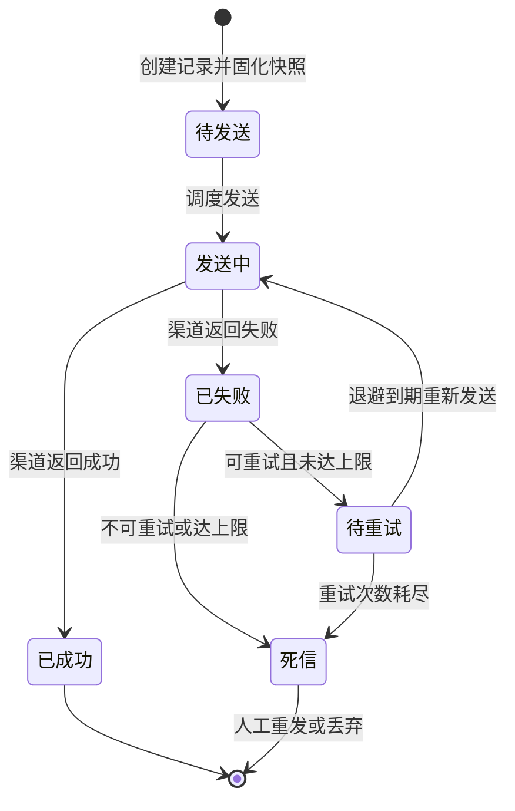

# 消息通知集成需求文档

**所属限界上下文**：BC9 消息通知域
**文档版本**：V2.4
**创建日期**：2026-07-09
**类型**：通用子域

本域对应总览文档限界上下文表中的 BC9，统一收口全平台邮件与短信通知的模板管理、渠道适配、发送记录、重试与防骚扰，对应原始需求 4.2 安全性中敏感参数脱敏与 4.4 可观测性中通知送达率监控，并落实总览 4.8 外部能力配置驱动。文档遵循 `00-需求文档总览与DDD架构.md` 第 4 章分层架构规范、4.8 外部能力配置驱动、3.3 共享内核中 `IExternalChannelOptions` 配置抽象，与第 5 章跨上下文事件契约保持一致。作为通用子域，本文档相对核心域适当精简，功能点仍细化到可开发粒度。

## 1 上下文概述

### 1.1 职责

本域统一收口全平台邮件与短信的发送，提供通知模板、渠道适配、发送记录、失败重试与频率限制能力。渠道参数配置化，更换服务商只改配置不改代码。各上游上下文通过 `INotificationService` 同步发送或发布通知请求事件异步发送，发送过程不阻塞主交易链路。本域权威持有通知模板与发送记录，对外发布送达、失败、重试等通知事件供可观测与统计消费。

### 1.2 边界

本域内部包含两个聚合根：**NotificationTemplate**（通知模板聚合根）与 **NotificationRecord**（发送记录聚合根）；`NotificationRequest` 作为命令对象在应用层流转，非聚合。本域不持有用户、订单、积分、支付等业务对象，只以 `Recipient`（邮箱或手机号）与变量字典接收上游入参，业务关联以 `BusinessRef` 字符串引用（如 orderId）便于追踪。通知渠道的具体技术实现属基础设施层，领域层只见 `INotificationChannel` 抽象接口。模板渲染、渠道选择、发送编排与重试策略由领域服务承担。敏感参数（SMTP 密码、短信 AccessKeySecret）不进入领域层与应用层，由基础设施层从配置中心注入适配器实例。

### 1.3 与其他上下文的关系

通知为通用子域，与多个上下文以客户-供应商关系单向协作，上游发布业务事件、本域消费并映射到通知模板。

- 用户域（客户-供应商）：用户注册成功发布 `UserRegisteredEvent`，本域消费发送欢迎邮件；验证码类即时通知经 `INotificationService` 同步发送。
- 订单与交易域（客户-供应商）：`OrderCreatedEvent` 触发下单通知、`OrderPaidEvent` 触发支付成功通知、`OrderCancelledEvent` 触发取消通知。
- 支付集成域（客户-供应商）：`PaymentFailedIntegrationEvent` 触发支付失败通知。
- 评价与售后域（客户-供应商）：`AfterSalesApprovedEvent`、`RefundCompletedEvent` 触发售后进度与退款到账通知。
- 积分与会员域（客户-供应商）：`PointsEarnedEvent` 触发积分到账通知、`MemberLevelChangedEvent` 触发等级变更通知、`PaidMemberSubscribedEvent` 触发付费会员权益通知。

各域也可在需要时调用 `INotificationService.SendAsync` 同步发送一次性通知；同步路径带超时与熔断，超时即转异步，不阻断主事务。

### 1.4 事件契约引用

本域对外发布 `NotificationSentEvent`、`NotificationFailedEvent`、`NotificationRetriedEvent`、`NotificationDeadLetteredEvent`，供可观测与统计消费。入站消费总览第 5 章各业务事件，由事件消费者映射到对应通知模板编码后入队。事件经发件箱模式与聚合持久化在同一事务写入，后台进程发布到事件总线，消费失败进入死信队列重试。

## 2 领域模型设计

### 2.1 聚合与实体

本域设两个聚合根：**NotificationTemplate** 与 **NotificationRecord**。模板为配置类低频变更对象，发送记录为高频写入且含状态机，二者拆分独立聚合，单次事务只修改其一，跨聚合协作通过领域事件异步完成。

#### 2.1.1 NotificationTemplate 聚合根

NotificationTemplate 封装通知模板的编码、渠道、标题、正文与变量定义，所有变更通过行为意图明确的方法完成，禁止外部直接 set 字段。

| 字段名 | 类型 | 说明 | 约束 |
|-|-|-|-|
| TemplateId | Guid | 模板唯一标识 | 主键，创建时生成 |
| Code | string | 模板编码 | 非空，全局唯一，如 `user_registered_welcome`，1–64 字符 |
| Name | string | 模板名称 | 非空，1–100 字符 |
| Channel | NotificationChannel | 渠道 | Email/Sms |
| Subject | string? | 标题 | 邮件渠道必填，短信可空，≤200 字符 |
| Body | string | 正文 | 非空，含变量占位符 `{{var}}`，邮件≤10000、短信≤500 字符 |
| Variables | List&lt;TemplateVariable&gt; | 变量定义 | 含名称、是否必填、描述 |
| SmsTemplateCode | string? | 短信服务商模板ID | 短信渠道必填 |
| Status | TemplateStatus | 启用状态 | Enabled/Disabled |
| Description | string? | 描述 | ≤200 字符 |
| CreatedAt | DateTime | 创建时间 | UTC，基础设施层填充 |
| UpdatedAt | DateTime | 更新时间 | UTC，基础设施层填充 |
| OperatorId | Guid? | 最后操作人 | 运营角色 |

NotificationTemplate 聚合方法：

- `Create(...)`：工厂方法，校验编码符合命名规则、邮件渠道标题必填、短信渠道 SmsTemplateCode 必填、变量名与占位符一致，创建 Enabled 态模板。
- `Update(name, subject, body, variables, description)`：更新可编辑字段，校验不变量，记录操作人。已禁用模板不可更新，须先启用。
- `AddVariable(variable)` / `RemoveVariable(name)`：维护变量定义，校验变量名唯一且不与现有占位符冲突。
- `Disable()` / `Enable()`：启停模板，禁用后不再被发送引用，已入队的发送记录不受影响。
- `ContainsPlaceholder(name)`：判断正文是否引用某变量，供渲染校验。

#### 2.1.2 NotificationRecord 聚合根

NotificationRecord 封装一次发送的收件人、内容快照、状态与重试信息，状态迁移由聚合根方法保证合法性。

| 字段名 | 类型 | 说明 | 约束 |
|-|-|-|-|
| RecordId | Guid | 记录唯一标识 | 主键，创建时生成 |
| TemplateCode | string | 模板编码 | 非空，引用模板 |
| Channel | NotificationChannel | 渠道 | Email/Sms |
| Recipient | Recipient | 收件人 | 值对象，邮箱或手机号 |
| Subject | string? | 标题快照 | 渲染后固化 |
| ContentSnapshot | string | 正文快照 | 发送时固化，防模板后续修改 |
| Status | NotificationStatus | 发送状态 | Pending/Sending/Succeeded/Failed/Retried/DeadLettered |
| RetryCount | int | 已重试次数 | 0–MaxRetry |
| MaxRetry | int | 最大重试次数 | 默认 3 |
| ChannelMessageId | string? | 渠道返回的消息ID | 回执匹配用 |
| ChannelReceipt | string? | 渠道回执原文 | JSON，脱敏存储 |
| ErrorCode | string? | 错误码 | 渠道或系统错误码 |
| ErrorMessage | string? | 错误信息 | 脱敏后存储 |
| NextRetryAt | DateTime? | 下次重试时间 | 指数退避计算 |
| SentAt | DateTime? | 发送成功时间 | UTC |
| FailedAt | DateTime? | 最终失败时间 | UTC |
| BusinessRef | string? | 业务关联 | 如 orderId，便于追踪 |
| IdempotencyKey | string | 幂等键 | 防重复发送，非空 |
| CreatedAt | DateTime | 创建时间 | UTC |
| UpdatedAt | DateTime | 更新时间 | UTC |

NotificationRecord 聚合方法：

- `Create(...)`：工厂方法，创建 Pending 态记录，写入内容快照与幂等键，RetryCount 置 0。
- `MarkSending()`：进入发送中，仅 Pending 或 Retried 态可调用。
- `MarkSucceeded(channelMessageId, receipt)`：标记成功，记录渠道消息ID与回执，写入 SentAt，附加 `NotificationSentEvent`。
- `MarkFailed(errorCode, errorMessage)`：标记本次失败，脱敏错误信息，判断是否达到重试上限。
- `ScheduleRetry(delay)`：调度下次重试，RetryCount+1，计算 NextRetryAt，状态置 Retried，附加 `NotificationRetriedEvent`；达到 MaxRetry 则调用 `MoveToDeadLetter`。
- `MoveToDeadLetter()`：转入死信终态，写入 FailedAt，附加 `NotificationDeadLetteredEvent`。
- `ApplyReceipt(status, receipt)`：依据渠道回执更新状态，已 Succeeded 的记录以幂等键去重不重复处理。

#### 2.1.3 NotificationRequest 命令对象

`NotificationRequest` 在应用层作为命令对象流转，非聚合根，承载一次发送请求的入参。

| 字段名 | 类型 | 说明 | 约束 |
|-|-|-|-|
| TemplateCode | string | 模板编码 | 非空 |
| Channel | NotificationChannel? | 渠道 | 可空，空则取模板渠道 |
| Recipient | Recipient | 收件人 | 非空 |
| Variables | Dictionary&lt;string,string&gt; | 变量字典 | 键为变量名 |
| BusinessRef | string? | 业务关联 | 可空 |
| IdempotencyKey | string | 幂等键 | 非空 |

#### 2.1.4 值对象

值对象无唯一标识，通过属性值判断相等性，不可变。

##### NotificationChannel

| 字段名 | 类型 | 说明 | 约束 |
|-|-|-|-|
| Value | string | 渠道类型 | Email/Sms |

##### NotificationStatus

| 字段名 | 类型 | 说明 | 约束 |
|-|-|-|-|
| Value | string | 发送状态 | Pending/Sending/Succeeded/Failed/Retried/DeadLettered |

##### TemplateStatus

| 字段名 | 类型 | 说明 | 约束 |
|-|-|-|-|
| Value | string | 启用状态 | Enabled/Disabled |

##### Recipient

| 字段名 | 类型 | 说明 | 约束 |
|-|-|-|-|
| Email | string? | 邮箱地址 | 邮件渠道必填，符合邮箱正则 |
| Phone | string? | 手机号 | 短信渠道必填，11 位国内手机号 |

构造时按渠道校验对应字段格式，越界抛出领域异常。

##### TemplateVariable

| 字段名 | 类型 | 说明 | 约束 |
|-|-|-|-|
| Name | string | 变量名 | 非空，字母数字下划线，1–32 字符 |
| Required | bool | 是否必填 | 默认 true |
| Description | string? | 描述 | ≤100 字符 |

#### 2.1.5 聚合边界说明

NotificationTemplate 与 NotificationRecord 拆分为两个独立聚合，理由有三：第一，模板为配置类低频变更，发送记录为高频写入且含状态机，合并聚合会引入无关加载与锁竞争；第二，单次事务只修改一个聚合，重试调度只需加载记录而非整模板；第三，发送记录固化内容快照后与模板解耦，模板后续修改不影响已发记录的可追溯性。

**关键警告**：发送记录的内容快照在发送时固化，渲染与发送只读快照，禁止运行时回引模板实时正文，否则模板修改会污染历史记录。

### 2.2 领域服务

领域服务处理无法归入单一聚合的领域逻辑，接口与实现均在领域层。

- `ITemplateRenderService`：模板渲染。
  - `RenderAsync(template, variables)`：校验所有 Required 变量已提供、占位符与变量定义一致，替换 `{{var}}` 占位符，返回渲染后的标题与正文；缺必填变量抛领域异常。
- `IChannelSelector`：渠道选择。
  - `Select(channel, recipient)`：依据渠道与收件人返回对应的 `INotificationChannel` 实现，支持多服务商按配置优先级选择。
- `INotificationDispatcher`：发送编排。
  - `DispatchAsync(record)`：选渠道、构造 `ChannelSendRequest`、调用 `INotificationChannel.SendAsync`、依据结果调用记录的 `MarkSucceeded` 或 `MarkFailed`/`ScheduleRetry`。
- `IRetryPolicy`：重试策略。
  - `ShouldRetry(record)`：判断是否可重试（未达 MaxRetry 且错误可重试）。
  - `NextDelay(retryCount)`：指数退避，如 30s、2min、10min。
- `IRateLimiter`：频率限制。
  - `AcquireAsync(recipient, templateCode, channel)`：基于 Redis 滑动窗口判断是否允许发送，超限抛 `NotificationRateLimitedException`。

### 2.3 仓储接口

仓储接口定义在领域层，命名遵循 `I{聚合根名}Repository`，由基础设施层实现（如 `EfCoreNotificationTemplateRepository`、`EfCoreNotificationRecordRepository`）。

```csharp
// 领域层
public interface INotificationTemplateRepository
{
    Task<NotificationTemplate?> GetByIdAsync(Guid templateId, CancellationToken ct = default);
    Task<NotificationTemplate?> GetByCodeAsync(string code, CancellationToken ct = default);
    Task<bool> ExistsByCodeAsync(string code, CancellationToken ct = default);
    Task<(IReadOnlyList<NotificationTemplate> Items, int Total)> QueryAsync(NotificationTemplateQuery query, CancellationToken ct = default);
    Task AddAsync(NotificationTemplate template, CancellationToken ct = default);
    Task UpdateAsync(NotificationTemplate template, CancellationToken ct = default);
}

public interface INotificationRecordRepository
{
    Task<NotificationRecord?> GetByIdAsync(Guid recordId, CancellationToken ct = default);
    Task<NotificationRecord?> GetByIdempotencyKeyAsync(string key, CancellationToken ct = default);
    Task<(IReadOnlyList<NotificationRecord> Items, int Total)> QueryAsync(NotificationRecordQuery query, CancellationToken ct = default);
    Task<IReadOnlyList<NotificationRecord>> GetRetryableAsync(int batchSize, CancellationToken ct = default);
    Task AddAsync(NotificationRecord record, CancellationToken ct = default);
    Task UpdateAsync(NotificationRecord record, CancellationToken ct = default);
}
```

`NotificationTemplateQuery` 与 `NotificationRecordQuery` 为查询参数对象，支持按渠道、状态、模板编码、收件人、时间范围过滤与分页。发送记录的统计聚合（送达率、失败率）走读库或缓存，详见第 8 章。

### 2.4 渠道适配抽象

本域遵循总览 4.8 外部能力配置驱动，领域层定义渠道抽象接口，基础设施层提供具体适配器实现，适配器所需参数从配置中心或 `appsettings.json` 注入。切换或新增服务商只需新增适配器实现并改配置，不触动领域层与应用层。

领域层抽象接口：

```csharp
// 领域层
public interface INotificationChannel
{
    NotificationChannel Channel { get; }
    Task<ChannelSendResult> SendAsync(ChannelSendRequest request, CancellationToken ct = default);
}

public record ChannelSendRequest(
    Recipient Recipient,
    string? Subject,
    string Content,
    string IdempotencyKey);

public record ChannelSendResult(
    bool Success,
    string? ChannelMessageId,
    string? Receipt,
    string? ErrorCode,
    string? ErrorMessage);
```

基础设施层适配器实现：

- `SmtpEmailChannel`：基于 **MailKit** 实现 `INotificationChannel`，参数从 `EmailChannelOptions`（SMTP 主机、端口、账号、密码、发件人、UseSsl）注入，支持 TLS。
- `AliyunSmsChannel` / `TencentSmsChannel`：基于阿里云/腾讯云短信 SDK 实现，参数从 `SmsChannelOptions`（AccessKeyId、AccessKeySecret、SignName、Endpoint）注入，调用服务商模板发送接口。

渠道参数配置结构示例：

```json
"Notification": {
  "Channels": {
    "Email": {
      "Provider": "Smtp",
      "Smtp": {
        "Host": "smtp.example.com",
        "Port": 587,
        "Username": "no-reply@example.com",
        "Password": "${EMAIL_SMTP_PASSWORD}",
        "From": "no-reply@example.com",
        "DisplayName": "平台通知",
        "UseSsl": true
      }
    },
    "Sms": {
      "Provider": "Aliyun",
      "Aliyun": {
        "AccessKeyId": "${SMS_ALIYUN_AK}",
        "AccessKeySecret": "${SMS_ALIYUN_SK}",
        "SignName": "平台",
        "Endpoint": "dysmsapi.aliyuncs.com"
      },
      "Tencent": {
        "SecretId": "${SMS_TENCENT_ID}",
        "SecretKey": "${SMS_TENCENT_KEY}",
        "SignName": "平台",
        "SdkAppId": "1400000000"
      }
    }
  },
  "Retry": {
    "MaxRetry": 3,
    "Delays": ["00:00:30", "00:02:00", "00:10:00"]
  },
  "RateLimit": {
    "EmailPerHourPerRecipient": 10,
    "SmsPerHourPerRecipient": 5,
    "SmsPerDayPerRecipient": 20
  }
}
```

## 3 领域事件清单

领域事件在聚合方法中产生；对外发布的集成事件经事件总线传递，供可观测与统计消费。入站消费各业务事件并映射到通知模板。事件命名统一过去时。

| 事件名 | 触发时机 | 消费方 | 关键字段 |
|-|-|-|-|
| `UserRegisteredEvent`（入站） | 用户域注册成功 | 通知域（发欢迎通知） | userId, email, registeredAt |
| `OrderCreatedEvent`（入站） | 订单域下单 | 通知域（发下单通知） | orderId, userId, totalAmount |
| `OrderPaidEvent`（入站） | 订单域支付成功 | 通知域（发支付成功通知） | orderId, userId, paidAmount, paidAt |
| `OrderCancelledEvent`（入站） | 订单域取消 | 通知域（发取消通知） | orderId, userId, reason |
| `OrderShippedEvent`（入站） | 订单域订单发货 | 通知域（发发货通知给买家） | orderId, userId, logisticsNo, logisticsCompany, shippedAt, sellerId |
| `SeckillOrderCreatedEvent`（入站） | 促销域秒杀订单创建成功 | 通知域（发秒杀成功通知） | activityId, skuId, userId, orderId, seckillPrice |
| `PaymentFailedIntegrationEvent`（入站） | 支付集成域支付失败 | 通知域（发失败通知） | orderId, userId, failReason |
| `AfterSalesApprovedEvent`（入站） | 售后审核同意 | 通知域（发售后进度通知） | afterSalesId, userId, type |
| `RefundCompletedEvent`（入站） | 退款完成 | 通知域（发退款到账通知） | afterSalesId, userId, refundedAmount |
| `PointsEarnedEvent`（入站） | 积分域积分到账 | 通知域（发到账通知，可选） | userId, points, balance |
| `MemberLevelChangedEvent`（入站） | 会员等级变更 | 通知域（发等级通知） | userId, oldLevel, newLevel |
| `PaidMemberSubscribedEvent`（入站） | 付费会员开通/续费 | 通知域（发权益通知） | userId, plan, expireAt |
| `NotificationSentEvent`（出站） | 发送记录标记成功 | 可观测、统计 | recordId, templateCode, channel, recipient, sentAt |
| `NotificationFailedEvent`（出站） | 发送失败 | 可观测、告警 | recordId, templateCode, channel, errorCode, errorMessage |
| `NotificationRetriedEvent`（出站） | 触发重试调度 | 可观测、统计 | recordId, retryCount, nextRetryAt |
| `NotificationDeadLetteredEvent`（出站） | 重试耗尽进入死信 | 告警、人工处理队列 | recordId, templateCode, channel, recipient |

入站事件由 `NotificationEventConsumer` 消费，按事件类型映射到模板编码与变量字典，构造 `NotificationRequest` 入队或直接调用 `INotificationService.SendAsync`。事件经发件箱模式与聚合持久化在同一事务写入，后台进程发布到事件总线，消费失败进入死信队列重试，超过阈值告警。

## 4 功能需求

### 4.0 功能点概览表

| 编号 | 功能模块 | 功能描述 |
|-|-|-|
| F-NTF-001 | 同步发送通知 | 通过 `INotificationService.SendAsync` 内部直接发送，带超时与熔断 |
| F-NTF-002 | 异步发送通知 | 消费业务事件或通知请求事件异步发送，不阻塞主交易 |
| F-NTF-003 | 邮件发送 | 经 SMTP/MailKit 渠道发送邮件 |
| F-NTF-004 | 短信发送 | 经阿里云/腾讯云短信渠道发送短信 |
| F-NTF-005 | 通知模板管理 | 运营增删改查模板与变量定义 |
| F-NTF-006 | 模板渲染 | 变量替换与必填校验，固化内容快照 |
| F-NTF-007 | 发送记录查询与追踪 | 多视角查询发送记录与状态 |
| F-NTF-008 | 发送失败重试与死信处理 | 指数退避重试与死信终态 |
| F-NTF-009 | 渠道参数配置管理 | 系统管理员配置邮件/短信渠道参数 |
| F-NTF-010 | 通知频率限制与防骚扰 | 滑动窗口频率限制，超限拒绝 |
| F-NTF-011 | 渠道回执接收与状态更新 | 接收服务商回执回调更新记录状态 |
| F-NTF-012 | 多渠道选择 | 按渠道与收件人选择适配器，支持服务商优先级 |

### F-NTF-001 同步发送通知

业务逻辑：上游上下文调用 `INotificationService.SendAsync(NotificationRequest)` 同步发送一次性通知（如验证码、即时提醒）。应用服务按 TemplateCode 加载启用模板，经 `ITemplateRenderService` 渲染、`IRateLimiter` 频率校验后，创建 `NotificationRecord`（Pending）并固化内容快照，再由 `INotificationDispatcher` 选渠道发送。发送结果回写记录状态。同步路径带超时与熔断，超时即返回"已受理转异步"并将记录留待重试，不抛异常阻断调用方主事务。

交互逻辑：调用方以 `NotificationRequest`（含模板编码、收件人、变量、幂等键）发起调用；应用服务校验入参后异步落库并发送，超时阈值内返回结果，超时返回受理状态。

规则约束：收件人邮箱或手机号格式校验；模板须为 Enabled；必填变量齐全；幂等键重复请求返回已存在记录；同步调用超时阈值 3s，超时不抛异常。

权限逻辑：仅系统内部服务可调用，经服务间鉴权（内部 API Key 或 mTLS），不暴露给终端用户。

边界与异常：模板缺失返回 404 并降级（跳过发送并记录告警）；渠道超时转异步重试；频率超限返回 429 并记录。同步发送不参与调用方数据库事务，记录落库独立事务。

### F-NTF-002 异步发送通知

业务逻辑：上游发布业务事件或通知请求事件，`NotificationEventConsumer` 消费后映射到模板编码与变量字典，构造 `NotificationRequest` 入队。后台 worker 从队列取出请求，复用 F-NTF-001 的发送链路完成发送。异步路径是默认推荐方式，主交易链路不等待通知完成。

交互逻辑：事件消费者接收事件→查映射表得模板编码→补全变量（部分变量需回调上游查询接口，如订单金额）→入队；worker 出队→渲染→频率校验→落库快照→发送→回写状态。

规则约束：事件消费幂等（以事件ID去重）；变量补全失败时记录并跳过，不阻塞队列；队列消费失败按 MQ 重试策略，超阈值进死信队列告警。

权限逻辑：事件消费者以服务身份运行，无终端用户上下文；通知收件人取自事件字段。

边界与异常：上游事件字段缺失导致无法渲染时记录失败并发 `NotificationFailedEvent`；MQ 不可用时事件暂存发件箱表，恢复后补发。异步发送与主交易解耦，主交易回滚不影响已入队通知。

### F-NTF-003 邮件发送

业务逻辑：邮件渠道由 `SmtpEmailChannel` 实现 `INotificationChannel.SendAsync`，使用 **MailKit** 连接 SMTP 服务器发送。请求含收件人邮箱、标题、正文快照、幂等键。发送成功返回渠道消息ID，失败返回错误码与信息。

交互逻辑：调度器调用 `IChannelSelector.Select(Email, recipient)` 得 `SmtpEmailChannel`，构造 `ChannelSendRequest` 调用 `SendAsync`；结果回写 `NotificationRecord`。

规则约束：SMTP 连接超时 10s；邮件正文支持 HTML；发件人地址来自配置；附件暂不支持；单次连接复用连接池。

权限逻辑：渠道实例由基础设施层注入，参数对应用层不可见。

边界与异常：SMTP 认证失败、收件人拒收、服务商限流（421/450）归为可重试错误；邮箱不存在（550）归为不可重试，直接标记失败不重试。连接异常由 Polly 熔断保护。

### F-NTF-004 短信发送

业务逻辑：短信渠道由 `AliyunSmsChannel` 或 `TencentSmsChannel` 实现，调用服务商模板发送接口。短信正文由服务商模板变量填充，模板ID取自 `NotificationTemplate.SmsTemplateCode`，签名取自配置。

交互逻辑：调度器选短信渠道适配器，将正文快照变量映射为服务商模板参数，调用发送API；结果回写记录。

规则约束：手机号 11 位国内格式；短信模板须在服务商侧审核通过；单条短信字数超 70 拆分计费但记录一条；短信内容不固化正文快照而固化变量字典。

权限逻辑：AccessKey 等敏感参数从配置注入，不落代码仓库。

边界与异常：服务商返回限流（如阿里云 isv.BUSINESS_LIMIT_CONTROL）归为可重试但需更长退避；手机号黑名单、签名不符归为不可重试。服务商API超时转异步重试。

### F-NTF-005 通知模板管理

业务逻辑：运营管理员维护通知模板，新增、编辑、启停、查询模板与变量定义。新增调用 `NotificationTemplate.Create`，编辑调用 `Update`，启停调用 `Disable`/`Enable`。模板编码全局唯一，变量名须与正文占位符一致。

交互逻辑：运营在模板管理后台填写编码、名称、渠道、标题、正文、变量定义、短信模板ID后保存；列表按渠道、状态、关键词筛选分页；编辑时校验占位符与变量一致性。

规则约束：编码符合 `^[a-z][a-z0-9_]{0,63}$`；邮件标题必填、短信 SmsTemplateCode 必填；变量名字母数字下划线；禁用模板不可被新发送引用；模板删除采用软删除（置 Disabled）。

权限逻辑：仅运营管理员可管理模板；系统管理员可查看但不可编辑业务模板。

边界与异常：编码重复返回 409；占位符与变量定义不一致返回 400；已禁用模板编辑须先启用。

### F-NTF-006 模板渲染

业务逻辑：`ITemplateRenderService.RenderAsync` 接收模板与变量字典，校验所有 Required 变量已提供且无多余变量，替换 `{{var}}` 占位符，返回渲染后标题与正文。渲染结果作为内容快照固化到 `NotificationRecord`。

交互逻辑：发送前由应用服务调用渲染服务；渲染失败抛领域异常，应用服务捕获后标记记录失败或跳过。

规则约束：必填变量缺失拒绝渲染并抛异常；多余变量忽略并记录告警；占位符未提供值时保留原占位符还是报错取决于变量 Required 标记；渲染结果须转义防注入。

权限逻辑：渲染为内部服务调用，无终端用户上下文。

边界与异常：模板正文含未定义占位符返回 400；变量值含 HTML 特殊字符须转义；渲染与发送分离，渲染失败不影响渠道。

### F-NTF-007 发送记录查询与追踪

业务逻辑：运营与系统管理员查询发送记录，按渠道、状态、模板编码、收件人、时间范围、业务关联筛选分页，查看记录详情含内容快照、状态、重试次数、回执、错误信息。支持按 BusinessRef（如 orderId）追踪某笔业务触发的所有通知。

交互逻辑：运营在发送记录看板筛选查询；详情页展示完整发送链路与时间线；失败与死信记录高亮。运营另可经 `GET /api/admin/notifications/statistics` 按时间区间与渠道维度查询发送总数、成功数、失败数、送达率、平均耗时与死信数，用于送达率监控看板；该端点为通知域细粒度统计查询，与跨域统一看板（由系统管理域 BC11 承载）互补。

规则约束：分页 page 从 1 开始，pageSize 默认 20、最大 100；手机号与邮箱在列表脱敏展示（如 138****1234）；内容快照原文仅详情页可见。

权限逻辑：运营可查询全部记录；系统管理员可查询并查看敏感配置相关记录；终端用户不可直接查询（通知归属业务方域）。

边界与异常：列表查询走读库或缓存以提升性能；刚发送的记录存在秒级最终一致窗口；记录不存在返回 404。

### F-NTF-008 发送失败重试与死信处理

业务逻辑：发送失败由 `NotificationRecord.MarkFailed` 标记，`IRetryPolicy` 判断是否可重试，可重试则 `ScheduleRetry` 计算指数退避下次重试时间，状态置 Retried。后台 worker 定期通过 `GetRetryableAsync` 捞取到点记录重新发送。重试达 MaxRetry 仍失败则 `MoveToDeadLetter` 进入死信终态，附加 `NotificationDeadLetteredEvent` 触发告警。

交互逻辑：worker 周期扫描 NextRetryAt 到期的 Retried 记录→重新选渠道发送→成功则 MarkSucceeded，失败则再次 MarkFailed/ScheduleRetry 或 MoveToDeadLetter。系统管理员经 `GET /api/admin/notifications/dead-letters` 按渠道、模板、时间筛选分页查询死信列表；对死信记录可批量重发（`POST /api/admin/notifications/dead-letters/batch-resend`，body `{recordIds:[]}`）将其重置 RetryCount 置回待发送重走发送链路，或丢弃（`POST /api/admin/notifications/dead-letters/{id}/discard` 单条、`POST /api/admin/notifications/dead-letters/batch-discard` 批量，body `{recordIds:[]}`）标记终态不再处理。

规则约束：最大重试 3 次；指数退避 30s/2min/10min；不可重试错误（如邮箱不存在、手机黑名单）直接失败不重试；死信记录不再自动重试，由系统管理员人工重发或丢弃；人工重发重置 RetryCount 并置回待发送，丢弃标记终态不再处理；批量操作记录操作人与记录 ID 清单入审计日志。

权限逻辑：重试由系统自动执行；死信处理需系统管理员介入重发或丢弃。

边界与异常：worker 单记录重试幂等（以 RecordId 与 RetryCount 版本控制）；并发捞取以乐观锁或 SELECT FOR UPDATE 防重复；死信队列积压超阈值告警。本域的死信管理为业务级死信——`NotificationRecord` 重试耗尽进入 `DeadLettered` 终态后的批量重发/丢弃，由本域自行处置。BC11 系统管理域的 F-SYS-007 死信队列管理为基础设施级死信——跨域 MQ 消费失败进入死信队列的消息统一管理。两者分层明确：通知域内部发送失败重试耗尽的死信记录由本域处置，不进入 BC11 死信管理；仅当 MQ 消费事件本身失败（如消费 `OrderPaidEvent` 失败）进入死信队列时才由 BC11 统一管理。

### F-NTF-009 渠道参数配置管理

业务逻辑：系统管理员配置邮件与短信渠道参数（SMTP 主机/端口/账号/密码/发件人、短信 AccessKey/签名/服务商）。配置存储于配置中心，支持热更新，变更后适配器实例重建。配置项含敏感参数加密存储，展示时脱敏。

交互逻辑：系统管理员在通知配置页填写或更新渠道参数；保存后配置中心推送变更；适配器监听变更重建实例；提供"测试发送"按钮验证配置有效性。

规则约束：敏感参数（密码、AccessKeySecret）加密存储不落明文；配置变更记录审计日志；测试发送不计入正式记录或标记为测试。

权限逻辑：仅系统管理员可查看与修改渠道配置；敏感参数展示脱敏，明文仅配置中心持有。

边界与异常：配置校验失败（如端口非法）返回 400；配置中心不可用时沿用本地缓存配置并告警；切换服务商后旧适配器实例平滑替换，在途发送不受影响。

### F-NTF-010 通知频率限制与防骚扰

业务逻辑：`IRateLimiter.AcquireAsync` 基于 Redis 滑动窗口按收件人与渠道统计单位时间发送量，超限拒绝发送并返回 429。限制维度含邮件每小时每收件人、短信每小时每收件人、短信每天每收件人。

交互逻辑：发送前调用频率校验；通过则继续发送并计数；超限则拒绝并记录 `NotificationFailedEvent`（errorCode=RATE_LIMITED）。系统管理员经 `GET /api/admin/notification-rate-limits` 查询各渠道频率限制规则，经 `PUT /api/admin/notification-rate-limits`（body `{channel, maxPerHour, maxPerDay}`）更新规则，变更后限流器热加载即时生效，不重启服务。

规则约束：默认邮件 10 条/小时/收件人、短信 5 条/小时/收件人、短信 20 条/天/收件人；验证码类通知可配置豁免或单独限流；限流计数以收件人为键；规则变更须记录审计日志；邮件渠道每日上限可不设。

权限逻辑：限流规则由系统管理员配置，运营不可绕过。

边界与异常：Redis 不可用时降级为放行并告警（避免限流故障阻断通知）；限流计数有最终一致窗口，极端并发可能略超阈值。

### F-NTF-011 渠道回执接收与状态更新

业务逻辑：服务商异步回执（如阿里云短信送达状态、邮件退信）经回执回调端点接收，验签后按 ChannelMessageId 匹配 `NotificationRecord`，调用 `ApplyReceipt` 更新状态与回执原文。已 Succeeded 的记录以幂等键去重。

交互逻辑：服务商推送回执→回执端点验签→查询记录→更新状态与回执→返回 ACK。

规则约束：回执须验签防伪造；回执处理幂等；回执原文脱敏存储；超时未回执的记录保持原状态不强制失败。

权限逻辑：回执端点对服务商开放，验签通过即处理，无需终端用户鉴权。

边界与异常：验签失败返回 401 并记录；记录不存在返回 404；回执延迟可达分钟级，状态更新有延迟窗口。

### F-NTF-012 多渠道选择

业务逻辑：`IChannelSelector.Select` 依据渠道与收件人返回适配器实现。邮件渠道默认 SMTP，短信渠道按配置 Provider 字段选择阿里云或腾讯云，支持配置优先级与故障转移（主服务商失败自动切备服务商）。

交互逻辑：调度器调用 `Select` 得适配器；主适配器失败且配置了备适配器时，可重试切备适配器。

规则约束：服务商优先级由配置定义；故障转移仅对可重试错误生效；切换服务商记录在记录的错误信息中。

权限逻辑：服务商选择由配置驱动，运营不可临时指定。

边界与异常：所有配置服务商均不可用时记录失败并告警；故障转移不跨渠道（邮件不会转短信）。

## 5 API 设计

接口遵循总览文档第 8 章 RESTful 规范，资源以名词复数命名，统一响应含 `code`/`message`/`data`，鉴权通过 `Authorization: Bearer {token}`。表现层控制器 `NotificationsController`（内部发送）、`NotificationTemplatesController`（运营）、`NotificationConfigController`（系统管理员）与回执端点只调用应用服务，不含业务逻辑。

| 方法 | 端点 | 说明 | 请求体概要 | 响应概要 | 鉴权要求 |
|-|-|-|-|-|-|
| POST | /api/notifications/send | 内部发送通知 | {templateCode, channel?, recipient, variables, businessRef?, idempotencyKey} | {recordId, status} | 内部服务（API Key/mTLS） |
| GET | /api/notifications/records | 发送记录列表 | query: channel, status, templateCode, recipient, businessRef, page, pageSize | {items, total, page, pageSize} | Bearer + Operator/SystemAdmin |
| GET | /api/notifications/records/{id} | 记录详情 | — | {record} | Bearer + Operator/SystemAdmin |
| GET | /api/notifications/records/by-business/{businessRef} | 按业务关联追踪 | — | {items} | Bearer + Operator/SystemAdmin |
| POST | /api/admin/notifications/records/{id}/resend | 死信记录重发 | — | {record} | Bearer + SystemAdmin |
| GET | /api/admin/notifications/dead-letters | 死信列表 | query: channel, templateCode, startTime, endTime, page, pageSize | {items, total, page, pageSize} | Bearer + SystemAdmin |
| POST | /api/admin/notifications/dead-letters/batch-resend | 死信批量重发 | {recordIds:[]} | {accepted, failed} | Bearer + SystemAdmin |
| POST | /api/admin/notifications/dead-letters/{id}/discard | 丢弃单条死信 | — | {record} | Bearer + SystemAdmin |
| POST | /api/admin/notifications/dead-letters/batch-discard | 死信批量丢弃 | {recordIds:[]} | {accepted, failed} | Bearer + SystemAdmin |
| GET | /api/admin/notifications/statistics | 送达率统计报表 | query: startTime, endTime, channel? | {totalCount, successCount, failCount, deliveryRate, avgLatencyMs, deadLetterCount, channelBreakdown} | Bearer + Operator/SystemAdmin |
| GET | /api/admin/notification-templates | 模板列表 | query: channel, status, keyword, page, pageSize | {items, total} | Bearer + Operator |
| POST | /api/admin/notification-templates | 新增模板 | {code, name, channel, subject, body, variables, smsTemplateCode?, description} | {template} | Bearer + Operator |
| GET | /api/admin/notification-templates/{id} | 模板详情 | — | {template} | Bearer + Operator |
| PUT | /api/admin/notification-templates/{id} | 编辑模板 | {name, subject, body, variables, description} | {template} | Bearer + Operator |
| POST | /api/admin/notification-templates/{id}/disable | 禁用模板 | — | {template} | Bearer + Operator |
| POST | /api/admin/notification-templates/{id}/enable | 启用模板 | — | {template} | Bearer + Operator |
| GET | /api/admin/notification-config | 渠道配置（脱敏） | — | {email:{provider,...masked}, sms:{...}} | Bearer + SystemAdmin |
| PUT | /api/admin/notification-config | 更新渠道配置 | {email, sms} | {config} | Bearer + SystemAdmin |
| POST | /api/admin/notification-config/test | 测试发送验证配置 | {channel, recipient} | {result} | Bearer + SystemAdmin |
| GET | /api/admin/notification-rate-limits | 频率限制规则查询 | — | {rules:[{channel, maxPerHour, maxPerDay}]} | Bearer + SystemAdmin |
| PUT | /api/admin/notification-rate-limits | 更新频率限制规则 | {channel, maxPerHour, maxPerDay} | {rule} | Bearer + SystemAdmin |
| POST | /api/notifications/callbacks/email | 邮件回执回调 | 服务商报文 | {ack} | 验签 |
| POST | /api/notifications/callbacks/sms | 短信回执回调 | 服务商报文 | {ack} | 验签 |

通用约束：分页默认 page=1、pageSize=20、最大 100；写操作返回创建或更新后的资源；时间字段 ISO 8601 UTC；幂等键通过 `Idempotency-Key` 头支持重复请求安全，内部发送与回执回调强制要求幂等键；内部发送端点与回执端点经服务间鉴权或验签，不走终端用户 JWT。

## 6 业务规则与不变量

| 编号 | 规则 | 说明 |
|-|-|-|
| INV-NTF-01 | 内容快照固化 | 发送记录创建时固化渲染后标题与正文，模板后续修改不影响历史记录 |
| INV-NTF-02 | 模板变量必填校验 | 渲染前校验所有 Required 变量已提供，缺失拒绝发送并抛领域异常 |
| INV-NTF-03 | 重试上限 | 最大重试 3 次，达上限进入死信终态；不可重试错误直接进入死信不重试 |
| INV-NTF-04 | 频率限制 | 按收件人与渠道滑动窗口限流，超限拒绝并返回 429 |
| INV-NTF-05 | 敏感参数不落库明文 | SMTP 密码、短信 AccessKeySecret 加密存储，日志与 API 返回脱敏 |
| INV-NTF-06 | 记录可审计 | 发送记录含模板编码、收件人、内容快照、状态变迁、重试次数、回执、错误信息，可追溯 |
| INV-NTF-07 | 幂等发送 | 以 IdempotencyKey 去重，重复请求返回已存在记录，不重复发送 |
| INV-NTF-08 | 异步不阻塞主交易 | 通知发送与主交易解耦，主链路不等待通知完成，超时转异步 |
| INV-NTF-09 | 单事务单聚合 | 单次事务只修改 NotificationTemplate 或 NotificationRecord 一个聚合 |
| INV-NTF-10 | 启用模板才可发送 | 仅 Enabled 模板可被发送引用，禁用模板对新发送拦截 |
| INV-NTF-11 | 渠道参数配置化 | 渠道参数从配置注入，切换服务商只改配置不改代码 |
| INV-NTF-12 | 回执验签 | 回执回调须验签，防伪造，验签失败拒绝处理 |
| INV-NTF-13 | 状态合法迁移 | 发送记录状态只能按状态机迁移，非法迁移抛领域异常 |
| INV-NTF-14 | 错误分级重试 | 可重试错误（限流、超时、服务商5xx）退避重试；不可重试错误（邮箱不存在、手机黑名单）直接死信 |

## 7 状态机

发送记录状态机覆盖 Pending（待发送）、Sending（发送中）、Succeeded（已成功）、Failed（已失败）、Retried（待重试）、DeadLettered（死信）六态。



待发送经调度进入发送中；发送中按渠道结果分流至已成功或已失败；已失败依据错误分级与重试次数转入待重试或死信；待重试退避到期回到发送中，重试耗尽则进死信。已成功与死信为终态，死信记录可由系统管理员手动重发回到待发送，或丢弃。

## 8 配置驱动设计

本域落实总览 4.8 外部能力配置驱动，邮件与短信渠道参数全部配置化，领域层与应用层只见 `INotificationChannel` 抽象，不感知具体服务商与参数。

### 8.1 配置结构

渠道参数分邮件与短信两类。邮件参数含 Provider、SMTP 主机/端口/账号/密码/发件人/显示名/UseSsl；短信参数含 Provider 与各服务商凭据（阿里云 AccessKeyId/AccessKeySecret/SignName/Endpoint，腾讯云 SecretId/SecretKey/SignName/SdkAppId）。重试参数含 MaxRetry 与 Delays 数组；频率参数含邮件每小时每收件人、短信每小时每收件人、短信每天每收件人阈值。完整配置片段见 2.4 节。

### 8.2 配置中心热更新

生产环境采用 **Consul** 或 **Apollo** 配置中心，参数变更通过监听机制推送到应用实例，适配器实例随之重建。热更新不重启服务，在途发送沿用旧适配器实例完成，新发送使用新实例。领域层与应用层只见抽象接口，不感知配置变更。

### 8.3 敏感参数脱敏与加密存储

SMTP 密码、短信 AccessKeySecret/SecretKey 等敏感参数加密存储于配置中心或环境变量，不落代码仓库，不落 `appsettings.json` 明文。配置值以 `${ENV_VAR}` 占位符引用环境变量。应用层与 API 返回时脱敏为 `******`；结构化日志（Serilog）中敏感参数脱敏输出，渠道回执原文中的凭据信息脱敏后存入 `ChannelReceipt`。

### 8.4 多环境配置

开发/测试/生产环境独立配置，通过 `appsettings.{Environment}.json` 与环境变量覆盖。开发环境可用本地测试邮箱服务（如 **MailHog**）与短信服务商沙箱，生产环境用正式 SMTP 与短信服务商生产 Endpoint。环境间配置隔离，互不影响。

### 8.5 多环境配置覆盖示例

```json
// appsettings.Development.json
"Notification": {
  "Channels": {
    "Email": {
      "Provider": "Smtp",
      "Smtp": { "Host": "localhost", "Port": 1025, "Username": "", "Password": "", "From": "dev@example.com", "UseSsl": false }
    },
    "Sms": {
      "Provider": "Aliyun",
      "Aliyun": { "AccessKeyId": "${SMS_ALIYUN_AK_SANDBOX}", "AccessKeySecret": "${SMS_ALIYUN_SK_SANDBOX}", "SignName": "平台测试", "Endpoint": "dysmsapi.aliyuncs.com" }
    }
  }
}
```

生产环境通过配置中心覆盖 Host、Port、凭据与 SignName，开发环境的本地配置不被带入生产镜像。

## 9 验收标准

以下用 Given/When/Then 描述可测试条件，覆盖核心功能点与边界。

### 9.1 模板渲染与变量校验

- AC-NTF-01：Given 模板含必填变量 `userName`，When 调用发送但未提供 `userName`，Then 返回 400，拒绝发送，记录失败原因为变量缺失。
- AC-NTF-02：Given 模板含可选变量 `coupon`，When 发送未提供 `coupon`，Then 渲染成功，发送成功。
- AC-NTF-03：Given 模板正文含未定义占位符 `{{foo}}`，When 保存模板，Then 返回 400，提示占位符未定义。

### 9.2 内容快照固化

- AC-NTF-04：Given 已发送成功记录内容快照为 A，When 运营修改模板正文为 B，Then 历史记录内容快照仍为 A，不受模板修改影响。
- AC-NTF-05：Given 发送记录已固化快照，When 查询记录详情，Then 返回固化时的标题与正文。

### 9.3 发送失败重试与死信

- AC-NTF-06：Given 渠道返回可重试错误（SMTP 421），When 处理失败，Then 状态置待重试，RetryCount+1，附加 `NotificationRetriedEvent`，NextRetryAt 按指数退避。
- AC-NTF-07：Given 记录已重试 3 次仍失败，When 第 3 次重试失败，Then 状态置死信，附加 `NotificationDeadLetteredEvent`，不再自动重试。
- AC-NTF-08：Given 渠道返回不可重试错误（邮箱不存在 550），When 处理失败，Then 直接进入死信，不重试。
- AC-NTF-09：Given 待重试记录退避到期，When worker 扫描，Then 重新选渠道发送，成功则置已成功。

### 9.4 配置切换不改代码

- AC-NTF-10：Given 短信服务商配置为阿里云，When 系统管理员在配置中心切换为腾讯云，Then 后续短信发送经腾讯云渠道，无需改代码或重启。
- AC-NTF-11：Given SMTP 密码更新，When 配置中心推送变更，Then 适配器实例重建，新发送使用新密码，在途发送沿用旧实例完成。
- AC-NTF-12：Given 渠道配置 API 返回，When 系统管理员查询，Then 密码与 AccessKeySecret 字段脱敏展示为 `******`。

### 9.5 频率限制防骚扰

- AC-NTF-13：Given 同一手机号 1 小时内已发送 5 条短信，When 第 6 条短信发送请求到达，Then 返回 429，拒绝发送，记录 errorCode=RATE_LIMITED。
- AC-NTF-14：Given 同一邮箱 1 小时内发送未达上限，When 发送请求到达，Then 通过频率校验，正常发送。
- AC-NTF-15：Given Redis 不可用，When 频率校验，Then 降级放行并告警，不阻断通知。

### 9.6 同步与异步发送

- AC-NTF-16：Given 内部服务调用同步发送，When 渠道 3s 内返回，Then 返回发送结果，记录状态已成功。
- AC-NTF-17：Given 同步发送渠道超时，When 超过 3s，Then 返回已受理转异步，不抛异常阻断调用方，记录留待重试。
- AC-NTF-18：Given 订单支付成功发布 `OrderPaidEvent`，When 通知域消费，Then 映射支付成功模板发送通知，主交易不阻塞。
- AC-NTF-19：Given 同一幂等键重复发送请求，When 第二次请求到达，Then 返回已存在记录，不重复发送。

### 9.7 模板管理与权限

- AC-NTF-20：Given 运营新增模板编码已存在，When 提交，Then 返回 409。
- AC-NTF-21：Given 模板已禁用，When 新发送引用该模板，Then 拦截返回错误。
- AC-NTF-22：Given 非运营角色，When 尝试管理模板，Then 返回 403。
- AC-NTF-23：Given 非系统管理员，When 尝试修改渠道配置，Then 返回 403。

### 9.8 回执与状态更新

- AC-NTF-24：Given 服务商推送回执，When 验签通过且匹配到记录，Then 更新记录状态与回执原文。
- AC-NTF-25：Given 回执验签失败，When 请求到达，Then 返回 401，不更新记录。
- AC-NTF-26：Given 同一回执重复推送，When 第二次到达，Then 幂等去重，不重复更新。

## 10 DDD 分层落点

本域四层落点遵循总览第 4 章分层架构规范与 DDD 最佳实践，依赖从外向内指向领域核心。

| 分层 | 消息通知域落点 | 职责 |
|-|-|-|
| 领域层 | NotificationTemplate/NotificationRecord 聚合，NotificationChannel/NotificationStatus/TemplateStatus/Recipient/TemplateVariable 值对象，INotificationChannel 渠道抽象接口，ITemplateRenderService/IChannelSelector/INotificationDispatcher/IRetryPolicy/IRateLimiter 领域服务，领域事件，INotificationTemplateRepository/INotificationRecordRepository 仓储接口 | 封装业务规则与不变量 |
| 应用层 | INotificationService（对外统一入口）、INotificationTemplateAppService、INotificationConfigAppService，DTO、Command/Query，NotificationEventConsumer（订阅业务事件发通知），重试编排 worker，事务边界 | 用例编排与事务管理 |
| 基础设施层 | SmtpEmailChannel/AliyunSmsChannel/TencentSmsChannel 适配器实现，EfCoreNotificationTemplateRepository/EfCoreNotificationRecordRepository，渠道参数配置绑定（IOptions/IExternalChannelOptions），RedisRateLimiter，回执回调处理，发件箱发布 | 持久化、渠道适配、事件发布 |
| 表现层 | NotificationsController（内部发送）、NotificationTemplatesController（运营）、NotificationConfigController（系统管理员）、回执端点 | 接收请求、调用应用服务、返回 DTO |
