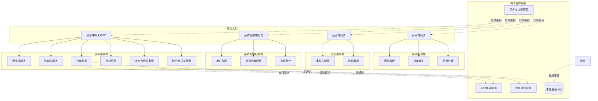

# 模块化部署架构

**所属**：跨上下文架构文档
**版本**：V2.1
**创建日期**：2026-07-09
**关联文档**：`00-需求文档总览与DDD架构.md` 第 6.4 节模块独立部署

本文档定义按角色使用的系统模块独立部署的架构方案。核心约束是：不同角色使用的模块各自独立部署、独立扩缩容、独立发布，单一模块故障不波及其他角色。方案以限界上下文为模块边界，通过角色网关路由、模块间事件解耦与独立数据存储实现故障隔离。

## 1 设计目标与约束

平台四类角色（买家、卖家、运营管理员、系统管理员）的使用场景、流量特征与发布节奏差异显著。买家端承载高并发读与秒杀峰值，卖家端以中低频写为主，运营端是低频重操作，系统管理端强调安全与审计。若所有角色共用一个部署单元，任一模块的发布或故障都会牵连全部角色。

独立部署要达成四项效果：单一模块可独立发布与回滚不影响其他角色；模块按自身流量独立扩缩容；单一模块故障被隔离不扩散；模块团队可独立迭代。约束是模块间不共享数据库，跨模块协作走集成事件异步通信与防腐层同步查询，避免同步强依赖造成级联故障。

## 2 模块划分

模块以限界上下文为基础，按角色使用面聚合为可独立部署单元。一个限界上下文可被多个角色端复用，但每个角色端只暴露该角色所需的 API 子集与应用服务子集。

| 部署模块 | 包含的限界上下文 | 主要服务角色 | 流量特征 | 独立扩缩容重点 |
|-|-|-|-|-|
| 买家端网关 + 买家服务集 | 商品读、购物车、订单、支付、评价售后、积分会员（买家面） | 买家 | 高并发读、秒杀峰值 | 读库、缓存、秒杀接口 |
| 卖家端 | 商品管理、订单履约、售后处理（卖家面） | 卖家 | 中低频写 | 写库连接池 |
| 运营端 | 商品审核、促销配置、积分规则、评价审核、数据看板 | 运营管理员 | 低频重操作 | 批量处理能力 |
| 系统管理端 | 用户与权限、渠道参数配置、监控运维、审计 | 系统管理员 | 极低频、高安全 | 隔离与审计 |
| 支付集成服务 | 支付集成域 | 被订单与售后调用 | 回调突发 | 回调处理队列 |
| 消息通知服务 | 消息通知域 | 被所有域调用 | 批量发送 | 发送队列与限流 |
| 用户与认证服务 | 用户与认证授权域 | 所有角色登录 | 高频读 | Token 缓存 |

买家端因聚合面最广、流量最大，进一步按高流量上下文拆分为独立微服务（商品读服务、购物车服务、订单服务、秒杀服务），其余低流量上下文可合并为买家核心服务。支付集成与消息通知作为通用支撑服务独立部署，被多角色端共享调用但不持有角色状态。

## 3 部署拓扑

下图展示角色端网关、限界上下文服务与共享支撑服务的部署关系。各角色端经独立网关入口，网关背后是按上下文拆分的服务，服务间通过事件总线与防腐层协作。

各角色端网关作为唯一外部入口，承担鉴权、限流、路由与角色级 API 聚合。用户与认证服务作为共享基础服务独立部署，所有角色端登录都依赖它，因此其可用性要求最高，单独保证 SLA。支付与通知服务被多端共享调用，独立部署以便按突发流量扩容。

## 4 角色网关与路由

每个角色端配置独立网关（BFF，Backend For Frontend），网关职责差异化的关键点如下。

| 网关 | 鉴权策略 | 限流策略 | 路由特点 |
|-|-|-|-|
| 买家端 | JWT，买家角色校验 | 滑动窗口，秒杀接口独立高阈值 | 聚合商品、购物车、订单多服务为前端友好响应 |
| 卖家端 | JWT，卖家角色校验 | 店铺级限流 | 按店铺数据隔离路由 |
| 运营端 | JWT + 操作二次确认 | IP 白名单 + 低频限流 | 长任务异步化，操作审计 |
| 系统管理端 | JWT + 双因子 + IP 白名单 | 严格低频 | 全部操作审计留痕 |

网关不持有业务逻辑，只做请求转发、响应聚合、鉴权与限流。跨端不直接互调，运营端管理买家/卖家数据时通过各上下文的应用服务接口访问，而非绕过网关直连数据库。

## 5 模块间通信与解耦

模块独立部署的前提是模块间无同步强依赖。通信分两类。

同步查询走防腐层（ACL）：当下游模块需要上游数据且无法等待事件时，通过应用服务接口查询并以 DTO 返回，不在模块间共享聚合对象或数据库表。例如订单服务创建订单时查询商品服务的 SKU 价格与库存，经防腐层转换为本地快照，查询失败则订单创建失败回滚，不阻塞但保证一致性。

异步协作走事件总线：跨模块的副作用一律经集成事件异步传递，主链路不等其完成。例如订单支付成功后发布 `OrderPaidEvent`，库存扣减、优惠券核销、积分发放、通知发送各自订阅独立处理，任一订阅者故障不影响订单本身。事件采用发件箱模式保证本地事务与事件发布原子性，消费失败进死信队列重试。

| 通信类型 | 适用场景 | 一致性 | 故障影响 |
|-|-|-|-|
| 防腐层同步查询 | 创建订单时取商品价格/库存、查询用户地址 | 强一致（失败回滚） | 查询失败导致当前请求失败，不扩散 |
| 集成事件异步 | 支付成功后扣库存、发积分、发通知 | 最终一致 | 订阅者故障不影响发布方，重试补偿 |

## 6 故障隔离策略

独立部署的价值在于故障不扩散。具体隔离手段分四层。

网络与部署隔离：每个模块独立容器/进程，独立资源配额（CPU/内存/连接池），单一模块 OOM 或死锁不占用其他模块资源。数据库按上下文独立 Schema 或独立库，避免慢查询拖垮全局。

限流与熔断：网关层按角色与模块限流，下游服务调用配置熔断器，当支付或通知服务响应超时，订单服务熔断后降级为"支付请求已受理，稍后重试"而非阻塞等待。

事件补偿：异步事件消费失败进死信队列，由补偿任务重试或人工介入，主交易已完成不受影响。支付回调丢失由主动查询补偿，通知发送失败由重试与死信兜底。

优雅降级：非核心模块故障时核心链路降级运行。通知服务故障不影响下单与支付；积分服务故障不影响交易，积分延迟入账由事件补偿；搜索服务故障降级为数据库查询。

| 故障场景 | 隔离手段 | 降级表现 |
|-|-|-|
| 通知服务宕机 | 事件入队等待恢复 | 下单支付正常，通知延迟补发 |
| 支付服务超时 | 熔断 + 主动查询补偿 | 订单保持待支付，用户可重试 |
| 积分服务故障 | 事件积压重试 | 交易正常，积分延迟入账 |
| 搜索服务故障 | 降级数据库查询 | 商品列表变慢但可访问 |
| 卖家端发布 | 独立部署 | 买家端不受影响 |

## 7 独立发布与版本管理

每个模块独立构建镜像、独立部署、独立回滚。发布遵循以下规则。

模块契约（API 与集成事件）采用语义化版本，破坏性变更需消费方先升级再下线旧版。集成事件新增字段向后兼容，消费方忽略未知字段。数据库迁移各模块独立执行，通过 EF Core Migrations 脚本化，发布前在测试环境验证。

发布顺序遵循依赖方向：先发布支撑服务（用户认证、支付、通知）再发布核心服务（商品、订单）再发布角色端网关。回滚按相反顺序，且数据迁移需保证可逆或兼容旧代码。灰度发布按角色端分批，买家端可按用户分桶灰度，卖家与运营端可按店铺或管理员分批。

## 8 数据存储隔离

每个限界上下文拥有独立 Schema 或独立数据库，禁止跨模块直接表连接查询。跨模块数据需求通过防腐层同步查询或事件同步的读模型满足。

| 模块 | 存储归属 | 跨模块数据获取方式 |
|-|-|-|
| 商品域 | 商品库（含 SPU/SKU/分类/品牌） | 下游通过商品查询接口或事件同步的读模型 |
| 订单域 | 订单库（含订单/订单行/库存预占） | 订单行持有商品快照，不回查商品库 |
| 支付集成域 | 支付库（含支付单/退款单） | 订单与售后经事件关联支付单ID |
| 积分与会员域 | 积分库（含账户/成长值/流水/会员） | 订单完成事件触发积分发放，不共享订单表 |
| 消息通知域 | 通知库（含模板/发送记录） | 各域通过通知服务发送，不持有各域业务数据 |

读模型同步通过事件总线消费上游事件更新本地投影，例如积分域消费 `OrderCompletedEvent` 在本地存储订单完成快照用于积分计算，不再回查订单库。

## 9 配置与密钥管理

各模块配置独立管理。通用配置（数据库连接、Redis、MQ）按模块实例绑定，外部能力配置（支付渠道、邮件、短信参数）按域集中管理并由系统管理端配置。

敏感参数（支付密钥、短信 API Key、SMTP 密码）存于配置中心或环境变量，不落代码仓库，日志脱敏输出。配置变更通过配置中心热更新，无需重启即生效，变更审计留痕。多环境（开发/测试/生产）配置隔离，生产环境密钥仅运维可访问。

## 10 可观测性按模块划分

健康检查、指标采集、链路追踪均按模块独立上报。`/health` 端点按模块分别检测依赖（DB、Redis、ES、MQ、支付渠道、通知渠道）状态，网关聚合各模块健康状态决定路由。Prometheus 按模块抓取指标，Grafana 看板按模块分组展示请求数、延迟、错误率、MQ 队列长度、支付成功率、通知送达率。OpenTelemetry 链路追踪跨模块串联，traceId 贯穿网关到各服务到事件消费，便于定位跨模块问题。

告警按模块与角色端分别配置阈值，单一模块错误率超 1% 触发该模块告警，不因一个模块故障淹没其他模块的信号。

## 11 验收标准

- 给定买家端正在发布新版本，当买家用户下单时，则卖家端订单履约与运营端审核不受影响。
- 给定消息通知服务宕机，当买家完成支付时，则订单与支付流程正常完成，通知延迟补发。
- 给定支付服务响应超时，当订单服务发起支付请求时，则熔断器触发降级，订单保持待支付且用户可重试。
- 给定积分服务故障，当订单完成事件发布时，则交易不受影响，积分延迟入账由事件重试补偿。
- 给定系统管理员修改支付渠道参数，当配置在配置中心更新时，则支付服务热加载新参数，无需重启。
- 给定运营端发起高负载批量操作，当请求到达运营端网关时，则限流保护运营端资源，不影响买家端与卖家端。
- 给定某模块数据库慢查询，当查询执行时，则仅该模块受影响，其他模块数据库与连接池不受牵连。
- 给定模块间通过事件协作，当某订阅者消费失败时，则事件进入死信队列，发布方与主交易不受影响。
