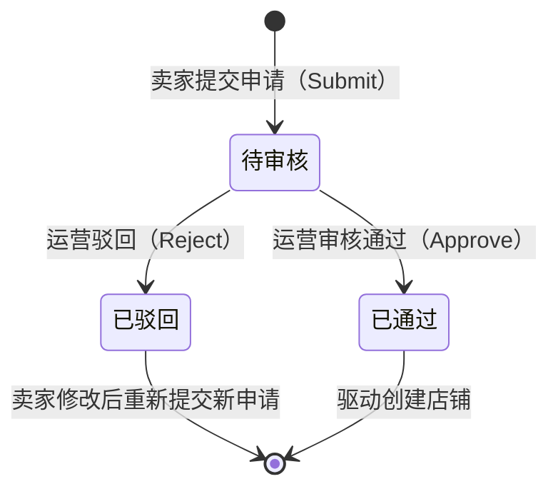
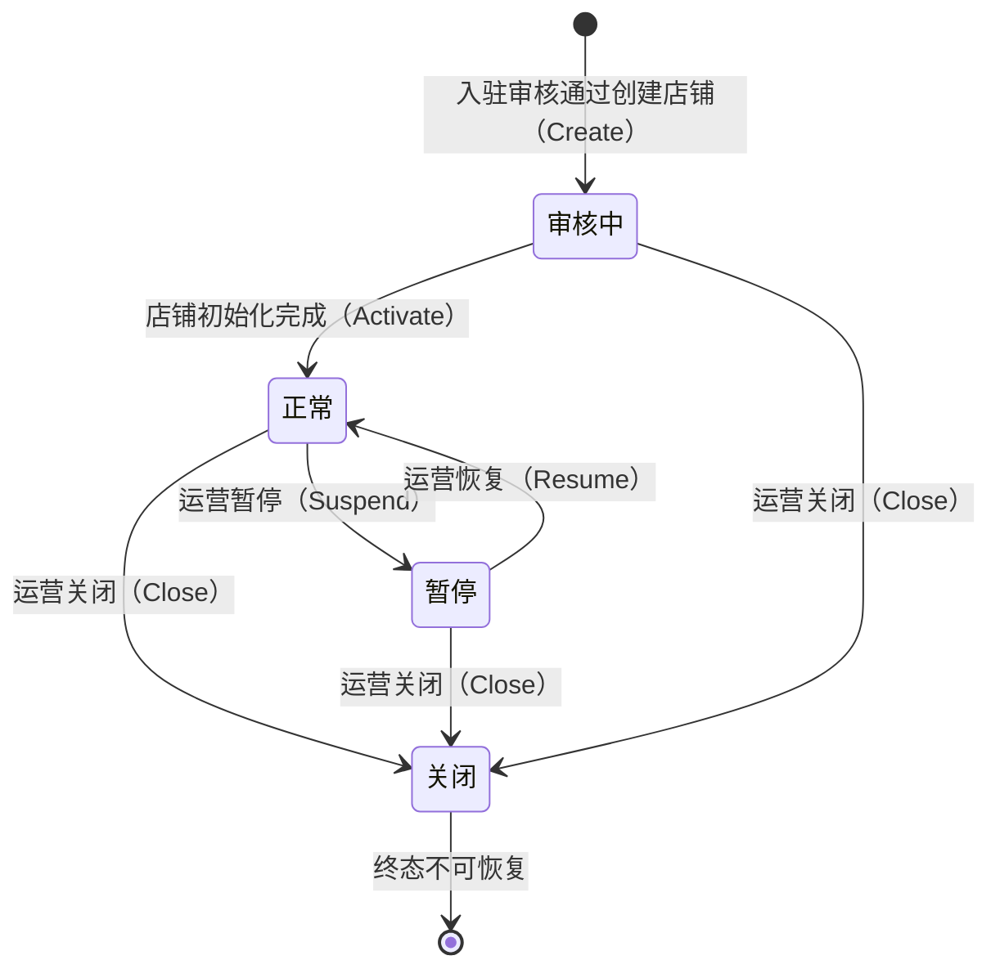

# 卖家与店铺管理域需求文档

**所属限界上下文**：BC10 卖家与店铺管理域
**文档版本**：V2.4
**创建日期**：2026-07-09
**类型**：支撑域

本域为新增限界上下文 BC10，补全审计中发现的卖家/店铺管理域缺失。商品域 `Product.SellerId` 与订单域 `Order.SellerId` 均依赖卖家标识，但全套文档缺少卖家入驻、店铺资质与店铺信息管理的限界上下文。本域权威持有店铺聚合与入驻申请聚合，管理卖家入驻生命周期与店铺信息。

## 1 上下文概述

卖家与店铺管理域负责卖家入驻申请、店铺资质审核、店铺信息维护、店铺状态治理与店铺经营概览，是卖家经营侧的身份与主体源头。本上下文权威持有店铺聚合（`Shop`）与入驻申请聚合（`SellerApplication`），下游上下文不直接引用店铺聚合对象，而是以店铺标识（`ShopId`）引用并通过查询接口获取所需数据。卖家账号的认证、密码、登录态归属用户域（BC1），本域只通过卖家账号标识（`SellerId`，即用户域 UserId）关联卖家身份，不持有认证细节。

职责边界限定为七项：卖家入驻申请的提交与资质承载、运营审核入驻申请的通过/驳回、入驻通过后创建店铺并绑定卖家账号、店铺基础信息（名称/Logo/描述/客服）维护、店铺资质（营业执照/经营范围/有效期）维护、店铺状态（审核中/正常/暂停/关闭）治理、卖家工作台经营概览（商品数/订单数/销售额）与店铺前台展示。商品的发布、库存与审核归属商品域（BC2）；订单与履约归属订单域（BC4）；售后处理归属评价与售后域（BC6）；通知发送归属消息通知域（BC9）。本域不承载商品、订单、售后的具体业务，仅持有店铺主体并对外提供店铺归属标识。

### 与其他限界上下文的关系

依据总览文档第 3.2 章的上下文映射，本域与各上下文的协作关系如下：

- 用户域（客户-供应商，本域为下游）：卖家账号身份由用户域权威持有。入驻申请的申请人即用户域用户，`SellerApplication.ApplicantUserId` 与 `Shop.SellerId` 均引用用户域 UserId。账号注册、登录、密码、角色权限不在本域范围。
- 商品域（客户-供应商/共享内核事件，本域为上游）：商品归属店铺，商品域 `Product.SellerId` 在语义上指代本域店铺标识（`ShopId`）。本域店铺暂停/关闭发布 `ShopSuspendedEvent`/`ShopClosedEvent`，商品域消费后将该店铺商品置为不可售，阻止新订单。
- 订单域（共享内核事件，本域为消费方）：订单归属卖家，订单域 `Order.SellerId` 同样指代本域店铺标识。本域消费订单域 `OrderCreatedEvent`、`OrderPaidEvent`、`OrderCompletedEvent`、`OrderCancelledEvent` 维护店铺经营概览读模型（订单数、销售额）。
- 评价与售后域（共享内核事件，本域为消费方）：售后处理归属卖家，本域消费售后域事件维护店铺售后概览指标（含售后数）。
- 消息通知域（客户-供应商，本域为上游）：入驻审核结果、店铺状态变更、资质过期提醒通过消息通知域向卖家发送邮件或短信通知。

上下文映射上，本域对用户域为下游消费者，对商品域与订单域为店铺标识供给方与订单事件消费方，对消息通知域为通知请求方。

### 统一语言补充术语

| 术语 | 英文 | 定义 |
|-|-|-|
| 店铺 | Shop | 卖家在平台上的经营主体，由入驻审核通过后创建 |
| 卖家账号 | Seller Account | 用户域中具备卖家角色的用户身份，以 UserId 标识 |
| 入驻申请 | Seller Application | 卖家提交的经营资质申请单，审核通过后生成店铺 |
| 店铺标识 | ShopId | 店铺唯一标识，商品域与订单域以此引用店铺归属 |
| 资质 | Qualification | 卖家经营所需的证照材料，如营业执照、特许经营证 |

## 2 领域模型设计

本域严格遵循总览文档第 4 章与 DDD 最佳实践的分层规范。领域层封装聚合、值对象、领域服务、仓储接口与领域事件，不引用任何技术细节；应用层编排用例并控制事务；基础设施层实现 EF Core 仓储、文件存储（资质图片）与消息消费者；表现层只调用应用服务。聚合边界以一致性为依据：单次事务只修改一个聚合，跨聚合协作通过领域事件异步完成。

本域设两个聚合根：`Shop`（店铺）与 `SellerApplication`（入驻申请）。店铺资质以 `Qualification` 值对象集合内聚于 `Shop` 聚合，理由是资质生命周期与店铺强绑定且变更频率低，内聚可由聚合根统一保证"至少一份有效营业执照"这一不变量。入驻申请独立为聚合，因为审核流程的状态机与店铺经营状态机不同步，申请通过前不存在店铺实体。

### 2.1 聚合与实体

#### 2.1.1 Shop 聚合根

`Shop` 是店铺经营主体聚合根，封装店铺信息、状态与资质不变量。一个卖家账号（`SellerId`）对应一个店铺，店铺与卖家一一对应。所有状态流转通过行为意图明确的方法完成，禁止外部直接 set 字段。

| 字段名 | 类型 | 说明 | 约束 |
|-|-|-|-|
| ShopId | Guid | 店铺唯一标识 | 主键，入驻审核通过时生成 |
| SellerId | Guid | 卖家账号身份标识 | 非空，引用用户域 UserId，全局唯一（一卖家一店铺） |
| ShopName | string | 店铺名称 | 2-32 字，全局唯一 |
| Logo | string? | 店铺 Logo URL | 可空，须经 `IFileStorageService.ValidateUrl` 校验 |
| Description | string? | 店铺描述 | ≤1000 字，可空 |
| CustomerService | CustomerService | 客服联系方式值对象 | 含电话与在线客服 |
| Status | ShopStatus | 店铺状态 | 枚举：审核中/正常/暂停/关闭 |
| Qualifications | List&lt;Qualification&gt; | 资质集合 | ≥1，须含一份有效营业执照 |
| CreatedAt | DateTime | 创建时间 | UTC，基础设施层填充 |
| UpdatedAt | DateTime | 更新时间 | UTC，基础设施层填充 |
| Version | int | 乐观锁版本号 | 并发控制 |

`Shop` 聚合方法（行为意图明确，避免贫血模型）：

- `Create(shopId, sellerId, shopName, qualifications, ...)`：工厂方法，由入驻审核通过驱动，校验店铺名称唯一与资质完整性，置状态为审核中，附加 `ShopCreatedEvent`。
- `Activate()`：店铺初始化完成后由审核中流转至正常，附加 `ShopActivatedEvent`。
- `UpdateInfo(shopName, logo, description, customerService)`：卖家维护店铺基础信息，校验店铺名称唯一性（经领域服务），附加 `ShopInfoUpdatedEvent`。任意非关闭状态可调用。
- `UpdateQualifications(qualifications)`：卖家更新资质材料，校验至少一份有效营业执照、有效期合法，附加 `ShopQualificationUpdatedEvent`。
- `Suspend(reason)`：运营暂停店铺，状态由审核中/正常流转至暂停，附加 `ShopSuspendedEvent`，携带原因与店铺标识供商品域消费置商品不可售。
- `Resume()`：运营恢复店铺，状态由暂停流转至正常，附加 `ShopResumedEvent`，商品域消费后恢复商品可售。
- `Close(reason)`：运营关闭店铺，状态流转至关闭，附加 `ShopClosedEvent`，商品域消费后下架全部商品，订单域按既有订单快照履约。

**关键警告**：关闭为终态，关闭后店铺不可恢复经营；暂停状态下店铺商品不可售新单，但既有订单正常履约。

#### 2.1.2 SellerApplication 聚合根

`SellerApplication` 是入驻申请聚合根，封装资质材料与审核状态机。申请通过后由应用层驱动创建 `Shop` 聚合，申请本身不持有店铺引用。

| 字段名 | 类型 | 说明 | 约束 |
|-|-|-|-|
| ApplicationId | Guid | 申请单唯一标识 | 主键，提交时生成 |
| ApplicantUserId | Guid | 申请人用户标识 | 非空，引用用户域 UserId |
| ShopName | string | 申请的店铺名称 | 2-32 字，须全局唯一 |
| BusinessType | BusinessType | 经营主体类型 | 枚举：企业/个人 |
| LicenseNo | string | 营业执照号/证件号 | 企业为18位统一社会信用代码，个人为身份证号 |
| LicenseImage | string | 营业执照图片 URL | 非空，`IFileStorageService` 合法 URL |
| BusinessScope | string | 经营范围 | ≤500 字 |
| Qualifications | List&lt;Qualification&gt; | 补充资质材料 | 可空，特许经营类目须补充 |
| Status | ApplicationStatus | 审核状态 | 枚举：待审核/已通过/已驳回 |
| SubmittedAt | DateTime | 提交时间 | UTC |
| ReviewedBy | Guid? | 审核人标识 | 引用用户域运营管理员，已通过/已驳回时填充 |
| ReviewedAt | DateTime? | 审核时间 | UTC |
| RejectReason | string? | 驳回原因 | 已驳回时必填，1-500 字 |
| CreatedAt | DateTime | 创建时间 | UTC，基础设施层填充 |
| Version | int | 乐观锁版本号 | 并发控制 |

`SellerApplication` 聚合方法：

- `Submit(...)`：工厂方法，校验资质完整性（企业须有营业执照、个人须有身份证件）、申请人未已有店铺（经领域服务）、店铺名称唯一，置状态为待审核，附加 `SellerApplicationSubmittedEvent`。
- `Approve(reviewedBy)`：运营审核通过，仅待审核态可调用，置状态为已通过，记录审核人与时间，附加 `SellerApplicationApprovedEvent`，事件携带申请信息供应用层创建店铺。
- `Reject(reviewedBy, reason)`：运营驳回，仅待审核态可调用，置状态为已驳回，记录驳回原因，附加 `SellerApplicationRejectedEvent`。

#### 2.1.3 值对象

值对象无唯一标识，通过属性值判断相等性，不可变。

##### ShopStatus

| 字段 | 类型 | 说明 | 约束 |
|-|-|-|-|
| Value | string | 店铺状态 | 枚举：UnderReview(审核中)/Active(正常)/Suspended(暂停)/Closed(关闭) |

##### ApplicationStatus

| 字段 | 类型 | 说明 | 约束 |
|-|-|-|-|
| Value | string | 审核状态 | 枚举：Pending(待审核)/Approved(已通过)/Rejected(已驳回) |

##### BusinessType

| 字段 | 类型 | 说明 | 约束 |
|-|-|-|-|
| Value | string | 经营主体类型 | 枚举：Enterprise(企业)/Individual(个人) |

##### Qualification

| 字段名 | 类型 | 说明 | 约束 |
|-|-|-|-|
| Type | QualificationType | 资质类型 | 枚举：BusinessLicense(营业执照)/IdCard(身份证)/SpecialPermit(特许经营证)/Other |
| CertificateNo | string | 证照编号 | 非空 |
| ImageUrl | string | 证照图片 URL | 非空，`IFileStorageService` 合法 URL |
| ValidFrom | DateTime | 生效日期 | UTC |
| ValidUntil | DateTime? | 失效日期 | UTC，可空表示长期有效 |

值对象不可变，相等性由 Type 与 CertificateNo 联合判定。资质集合的有效性由 `Shop`/`SellerApplication` 聚合根在变更时统一校验。

##### CustomerService

| 字段名 | 类型 | 说明 | 约束 |
|-|-|-|-|
| Phone | string | 客服电话 | E.164 格式或国内座机格式 |
| Email | string? | 客服邮箱 | 可空，须为合法邮箱 |
| OnlineAccount | string? | 在线客服账号 | 可空 |

### 2.2 领域服务

领域服务处理无法归入单一聚合的领域逻辑，接口与实现均在领域层。

- `IShopNameUniquenessChecker`：店铺名称全局唯一校验，依赖仓储查询能力，跨聚合校验无法归入单聚合根。`IsUniqueAsync(shopName, excludeShopId?)` 在 `Shop.UpdateInfo` 与 `SellerApplication.Submit` 时由应用层调用并传入聚合。
- `ISellerEligibilityChecker`：校验申请人是否已持有店铺（一卖家一店铺约束）与是否存在待审核申请，重复入驻拦截。`CanApplyAsync(applicantUserId)` 返回是否可提交新申请。
- `ILicenseValidator`：营业执照号格式校验。企业校验18位统一社会信用代码的校验位算法，个人校验身份证号格式与校验位。`Validate(businessType, licenseNo)` 不合法抛出领域异常。
- `IQualificationValidator`：资质有效期与完整性校验。校验至少一份有效营业执照、生效日期早于失效日期、长期有效证照的 `ValidUntil` 为空。`Validate(businessType, qualifications)` 在资质提交与更新时调用。

跨上下文的外部数据获取（用户域卖家账号是否存在与角色校验）不内嵌进领域服务，由应用层经防腐层查询服务编排，领域服务只接收应用层传入的结果做纯校验。

### 2.3 仓储接口

仓储接口定义在领域层，命名遵循 `I{聚合根名}Repository`，由基础设施层实现。

```csharp
// 领域层
public interface IShopRepository
{
    Task<Shop?> GetByIdAsync(Guid shopId, CancellationToken ct = default);
    Task<Shop?> GetBySellerIdAsync(Guid sellerId, CancellationToken ct = default);
    Task<Shop?> GetByShopNameAsync(string shopName, CancellationToken ct = default);
    Task<(IReadOnlyList<Shop> Items, int Total)> QueryAsync(ShopQuery query, CancellationToken ct = default);
    Task AddAsync(Shop shop, CancellationToken ct = default);
    Task UpdateAsync(Shop shop, CancellationToken ct = default);
}

public interface ISellerApplicationRepository
{
    Task<SellerApplication?> GetByIdAsync(Guid applicationId, CancellationToken ct = default);
    Task<SellerApplication?> GetByApplicantAsync(Guid applicantUserId, CancellationToken ct = default);
    Task<(IReadOnlyList<SellerApplication> Items, int Total)> QueryAsync(SellerApplicationQuery query, CancellationToken ct = default);
    Task AddAsync(SellerApplication application, CancellationToken ct = default);
    Task UpdateAsync(SellerApplication application, CancellationToken ct = default);
}
```

基础设施层落点：`EfCoreShopRepository`、`EfCoreSellerApplicationRepository`（EF Core 持久化，DbContext 仅在本层可见）；`IFileStorageService` 抽象（共享内核定义）用于资质图片与店铺 Logo 存储，默认本地磁盘实现，可配置切换为对象存储（MinIO/OSS），由 `FileStorage:Provider` 配置决定。

### 2.4 分层落点

| 分层 | 卖家与店铺管理域落点 | 职责 |
|-|-|-|
| 领域层 | `Shop`/`SellerApplication` 聚合，`ShopStatus`/`ApplicationStatus`/`BusinessType`/`Qualification`/`CustomerService` 值对象，`IShopNameUniquenessChecker`/`ISellerEligibilityChecker`/`ILicenseValidator`/`IQualificationValidator` 领域服务，`IShopRepository`/`ISellerApplicationRepository` 仓储接口，第 3 章领域事件 | 封装店铺状态机、入驻审核状态机与资质不变量 |
| 应用层 | `IShopAppService`、`ISellerApplicationAppService`、`IShopQueryService`，DTO、Command/Query，通过 UnitOfWork 控制事务边界，经发件箱发布事件 | 用例编排与事务边界；概览查询走读模型 |
| 基础设施层 | `EfCoreShopRepository`、`EfCoreSellerApplicationRepository`、`LocalFileStorageService`/`ObjectStorageService`（实现共享内核 `IFileStorageService`，由配置决定）、`OrderEventConsumer`/`ProductEventConsumer`（消费订单域/商品域事件维护概览读模型）、`ShopReadModelSyncConsumer` | 持久化、文件存储、跨域事件消费、读库同步 |
| 表现层 | `SellerApplicationController`（卖家端入驻）、`ShopController`（卖家端店铺管理）、`ShopAdminController`（运营端审核与状态治理）、`ShopViewController`（买家端店铺展示） | 接收请求、调用应用服务、返回 DTO |

## 3 领域事件清单

领域事件在聚合方法中产生，本上下文内消费的用于解耦聚合内部逻辑；对外发布的集成事件经事件总线传递。事件命名统一过去时。聚合保存与事件记录在同一事务写入（发件箱模式），后台进程轮询发件箱表并发布到消息队列，消费失败进入死信队列重试。本域消费的入站事件：订单域 `OrderCreatedEvent`/`OrderPaidEvent`/`OrderCompletedEvent`/`OrderCancelledEvent`（维护店铺订单数与销售额概览）、商品域 `ProductPublishedEvent`/`ProductTakenDownEvent`（维护店铺商品数概览）。

| 事件名 | 触发时机 | 消费方 | 关键字段 |
|-|-|-|-|
| `SellerApplicationSubmittedEvent` | 卖家提交入驻申请 | 运营审核队列、消息通知域（通知运营有新申请） | applicationId, applicantUserId, shopName, businessType, submittedAt |
| `SellerApplicationApprovedEvent` | 运营审核通过 | 卖家与店铺管理域内部（驱动创建店铺）、消息通知域（通知卖家入驻通过） | applicationId, applicantUserId, shopName, businessType, reviewedBy, reviewedAt |
| `SellerApplicationRejectedEvent` | 运营驳回 | 消息通知域（通知卖家驳回与原因） | applicationId, applicantUserId, rejectReason, reviewedBy, reviewedAt |
| `ShopCreatedEvent` | 入驻通过创建店铺 | 商品域（建立店铺归属基线）、消息通知域（通知卖家店铺已开通） | shopId, sellerId, shopName, status, createdAt |
| `ShopInfoUpdatedEvent` | 卖家更新店铺基础信息 | 商品域（同步店铺名称展示）、店铺读模型 | shopId, changedFields, updatedAt |
| `ShopQualificationUpdatedEvent` | 卖家更新资质 | 店铺读模型、消息通知域（资质变更提醒运营复核） | shopId, qualifications, updatedAt |
| `ShopSuspendedEvent` | 运营暂停店铺 | 商品域（置店铺商品不可售）、订单域（阻止新单）、消息通知域（通知卖家） | shopId, sellerId, reason, suspendedAt |
| `ShopResumedEvent` | 运营恢复店铺 | 商品域（恢复店铺商品可售）、消息通知域（通知卖家） | shopId, sellerId, resumedAt |
| `ShopClosedEvent` | 运营关闭店铺 | 商品域（下架全部商品）、订单域（停止新单）、消息通知域（通知卖家） | shopId, sellerId, reason, closedAt |
| `OrderCreatedEvent`（入站） | 订单域订单创建 | 卖家与店铺管理域（店铺订单数 +1） | orderId, sellerId(=shopId), totalAmount |
| `OrderPaidEvent`（入站） | 订单域支付成功 | 卖家与店铺管理域（店铺销售额累计） | orderId, sellerId(=shopId), amount, paidAt |
| `OrderCompletedEvent`（入站） | 订单域订单完成 | 卖家与店铺管理域（店铺已完成订单数 +1） | orderId, sellerId(=shopId), totalAmount, completedAt |
| `OrderCancelledEvent`（入站） | 订单域订单取消 | 卖家与店铺管理域（店铺订单数调整） | orderId, sellerId(=shopId), cancelReason, cancelledAt |
| `ProductPublishedEvent`（入站） | 商品域商品上架 | 卖家与店铺管理域（店铺商品数 +1） | productId, sellerId(=shopId) |
| `ProductTakenDownEvent`（入站） | 商品域商品下架 | 卖家与店铺管理域（店铺商品数 -1） | productId, sellerId(=shopId) |

## 4 功能需求

### 4.0 功能点概览表

| 编号 | 功能模块 | 功能描述 |
|-|-|-|
| F-SHP-001 | 卖家入驻申请 | 卖家提交企业/个人资质申请入驻 |
| F-SHP-002 | 运营审核入驻 | 运营审核通过/驳回入驻申请并创建店铺 |
| F-SHP-003 | 店铺信息管理 | 卖家维护店铺名称/Logo/描述/客服联系方式 |
| F-SHP-004 | 店铺资质管理 | 卖家维护营业执照/经营范围/资质有效期 |
| F-SHP-005 | 店铺状态管理 | 运营暂停/恢复/关闭店铺 |
| F-SHP-006 | 卖家工作台概览 | 卖家查看店铺商品数/订单数/销售额 |
| F-SHP-007 | 店铺前台展示 | 买家查看店铺公开信息 |

### F-SHP-001 卖家入驻申请

业务逻辑：已在用户域注册并具备卖家角色意向的用户提交入驻申请。申请人选择经营主体类型（企业/个人），填写店铺名称、营业执照号（企业为统一社会信用代码、个人为身份证号）、经营范围，上传营业执照图片与补充资质材料。提交后申请单处于待审核态，由运营审核。一个申请人只能持有一个店铺，已有店铺或存在待审核申请时拒绝重复入驻。

交互逻辑：卖家在入驻申请页填写信息并上传资质图片，前端先调用文件上传接口获得图片 URL，再提交申请。`ISellerApplicationAppService.SubmitAsync` 经防腐层校验申请人用户存在与角色合法，调用 `ISellerEligibilityChecker.CanApplyAsync` 校验未重复入驻，调用 `ILicenseValidator.Validate` 校验证照号格式，调用 `IShopNameUniquenessChecker.IsUniqueAsync` 校验店铺名称，最终调用 `SellerApplication.Submit` 工厂方法构造聚合并持久化，附加 `SellerApplicationSubmittedEvent`。UnitOfWork 提交保存聚合与发件箱事件。

规则约束：店铺名称 2-32 字且全局唯一；企业须提交18位统一社会信用代码营业执照且校验位合法；个人须提交身份证号且校验位合法；营业执照图片必填且为 `IFileStorageService` 合法 URL；经营范围 ≤500 字；同一申请人未持有店铺且无待审核申请方可提交；资质生效日期须早于失效日期，长期有效证照失效日期为空。

权限逻辑：需用户登录态，`ApplicantUserId` 取自 JWT，只能为自己提交申请；申请人须为用户域中已注册用户，卖家角色由入驻流程赋予。

边界与异常：重复入驻返回 409 并提示已持有店铺或申请处理中；证照号格式不合法返回 400；店铺名称重复返回 409；资质图片上传失败返回 400 并提示重新上传；并发提交相同店铺名称以唯一索引拦截返回 409。

### F-SHP-002 运营审核入驻

业务逻辑：运营在审核工作台查看待审核入驻申请，核对资质材料合规性后通过或驳回。通过则创建店铺并绑定卖家账号，店铺初始为审核中态后激活为正常；驳回则回退申请人并附原因。审核操作记录审计人与时间。

交互逻辑：运营打开申请详情查看证照图片与经营范围，点击通过调用 `ISellerApplicationAppService.ApproveAsync`，应用层加载 `SellerApplication` 聚合调用 `Approve(reviewedBy)`，聚合校验状态为待审核后置已通过并附加 `SellerApplicationApprovedEvent`；应用层消费该事件（同上下文内）创建 `Shop` 聚合并持久化，附加 `ShopCreatedEvent`，随后调用 `Shop.Activate` 流转至正常。点击驳回填写原因调用 `RejectAsync`，聚合调用 `Reject(reviewedBy, reason)` 附加 `SellerApplicationRejectedEvent`。UnitOfWork 提交。

规则约束：仅待审核态申请可审核；驳回原因 1-500 字必填；审核通过时店铺名称须仍唯一（审核期间可能被他店占用，占用则审核失败并提示）；审核通过后申请人不可再提交新申请；创建店铺时资质从申请单拷贝至店铺聚合。

权限逻辑：仅运营管理员角色可审核；运营不可审核自己提交的申请（运营本身不发起入驻，此约束预留）。

边界与异常：申请在审核期间被撤回则审核动作返回 409；审核通过时店铺名称已被占用返回 409 并提示申请人修改名称后重新提交；批量审核支持但单条失败不影响其余。

### F-SHP-003 店铺信息管理

业务逻辑：卖家维护自有店铺的基础信息，包括店铺名称、Logo、描述与客服联系方式。店铺名称变更须保持全局唯一。信息更新后商品域同步店铺名称展示。

交互逻辑：卖家在店铺设置页加载店铺信息，修改后提交。`IShopAppService.UpdateInfoAsync` 加载 `Shop` 聚合，校验当前用户为店铺卖家，调用 `IShopNameUniquenessChecker.IsUniqueAsync(shopName, excludeShopId)` 校验名称唯一，调用 `Shop.UpdateInfo` 更新字段并附加 `ShopInfoUpdatedEvent`。UnitOfWork 提交。

规则约束：店铺名称 2-32 字且全局唯一（排除自身）；Logo URL 须经 `IFileStorageService.ValidateUrl` 校验；描述 ≤1000 字；客服电话格式合法；任意非关闭状态可更新信息；暂停态卖家仍可编辑信息但不可上架商品（商品可售由状态事件驱动）。

权限逻辑：仅店铺所属卖家可编辑，`SellerId` 须与当前登录用户一致，否则 403；运营不可直接编辑卖家店铺信息。

边界与异常：店铺名称重复返回 409；并发编辑采用乐观锁（Version），冲突返回 409 提示刷新后重试；关闭态店铺不可编辑信息返回 409。

### F-SHP-004 店铺资质管理

业务逻辑：卖家维护自有店铺的资质材料，包括营业执照、经营范围补充与特许经营证。资质有有效期，临近过期须续期更新。资质变更后提醒运营复核。

交互逻辑：卖家在资质管理页上传新证照图片、填写证照编号与有效期，提交更新。`IShopAppService.UpdateQualificationsAsync` 加载 `Shop` 聚合，调用 `IQualificationValidator.Validate` 校验至少一份有效营业执照与有效期合法，调用 `Shop.UpdateQualifications` 替换资质集合并附加 `ShopQualificationUpdatedEvent`。UnitOfWork 提交。

规则约束：资质集合至少一份有效营业执照（企业）或身份证件（个人）；证照生效日期早于失效日期，长期有效证照失效日期为空；证照图片为 `IFileStorageService` 合法 URL；资质过期不影响店铺状态但触发续期提醒。

权限逻辑：仅店铺所属卖家可更新资质；资质变更须运营二次审核，提醒运营复核。

边界与异常：移除全部营业执照返回 400；证照有效期非法返回 400；并发更新采用乐观锁；资质过期由定时任务扫描并发布续期提醒事件，经消息通知域通知卖家。

### F-SHP-005 店铺状态管理

业务逻辑：运营对店铺执行暂停、恢复、关闭操作。暂停后店铺商品不可售新单，既有订单正常履约；恢复后商品恢复可售；关闭为终态，关闭后店铺商品全部下架且不可恢复经营。卖家不可自行变更店铺状态。

交互逻辑：运营在店铺治理页选择店铺执行操作。暂停调用 `IShopAppService.SuspendAsync(shopId, reason)`，应用层加载 `Shop` 聚合调用 `Suspend(reason)` 附加 `ShopSuspendedEvent`；恢复调用 `ResumeAsync` 调用 `Resume` 附加 `ShopResumedEvent`；关闭调用 `CloseAsync(shopId, reason)` 调用 `Close(reason)` 附加 `ShopClosedEvent`。UnitOfWork 提交，事件经发件箱发布，商品域消费后置商品不可售或下架。

规则约束：暂停仅审核中/正常态可调用；恢复仅暂停态可调用；关闭任意非关闭态可调用；关闭为终态不可恢复；操作原因 1-200 字。

权限逻辑：仅运营管理员角色可执行状态变更；卖家不可变更自身店铺状态。

边界与异常：非法状态流转返回 409（如对关闭态店铺执行暂停）；店铺不存在返回 404；关闭后商品下架存在秒级最终一致窗口，期间可能仍有订单流入由订单域按店铺状态校验拦截。

### F-SHP-006 卖家工作台概览

业务逻辑：卖家在工作台查看店铺经营概览，含在售商品数、累计订单数、累计销售额、近期订单趋势。概览数据由本域消费订单域与商品域事件维护的读模型聚合得出，查询走读模型不实时聚合写库。

交互逻辑：卖家进入工作台，`IShopQueryService.GetOverviewAsync(sellerId)` 从读模型加载店铺概览文档，返回商品数、订单数、销售额与近7日订单趋势。读模型由 `OrderEventConsumer` 消费 `OrderCreatedEvent`/`OrderPaidEvent`/`OrderCompletedEvent`/`OrderCancelledEvent` 与 `ProductEventConsumer` 消费 `ProductPublishedEvent`/`ProductTakenDownEvent` 维护。

规则约束：概览仅返回当前卖家店铺数据；销售额为已支付订单金额累计；订单数为已创建订单累计（不含已取消订单）；商品数为在售商品数（已上架且店铺正常）。

权限逻辑：需卖家登录态，`SellerId` 取自 JWT 强制过滤，仅可见本店概览。

边界与异常：读模型存在秒级最终一致窗口，刚支付订单的销售额可能短暂未更新；读模型不可用时降级到聚合查询服务实时统计；新店铺无数据时返回零值。

### F-SHP-007 店铺前台展示

业务逻辑：买家在商品详情或店铺页查看店铺公开信息，含店铺名称、Logo、描述、客服联系方式与店铺评分。仅正常态店铺对外完整展示，暂停态店铺商品不可售但店铺信息可有限展示，关闭态店铺不可访问。

交互逻辑：买家进入店铺页，`IShopQueryService.GetShopViewAsync(shopId)` 从读模型加载店铺公开信息文档返回。店铺评分由评价与售后域事件回写。

规则约束：仅正常态店铺完整展示；关闭态店铺页返回 404 或"店铺已关闭"提示；客服联系方式对买家可见（电话脱敏展示）；店铺 Logo 与描述经 XSS 过滤后展示。

权限逻辑：买家无需登录即可查看；游客与登录用户展示一致。

边界与异常：店铺页缓存于 Redis 设随机过期防雪崩；店铺刚关闭存在缓存残留，由 `ShopClosedEvent` 主动失效缓存；店铺评分读模型由评价域事件驱动更新，存在秒级最终一致窗口。

## 5 API 设计

接口遵循总览文档第 8 章 RESTful 规范，资源以名词复数命名，统一响应含 `code`/`message`/`data`，鉴权通过 `Authorization: Bearer {token}`。表现层控制器只调用应用服务，不含业务逻辑与数据访问代码，输入输出一律使用 DTO。写操作支持 `Idempotency-Key` 头保证重复请求安全。

### 5.1 卖家端接口

| 方法 | 端点 | 说明 | 请求体概要 | 响应概要 | 鉴权要求 |
|-|-|-|-|-|-|
| POST | /api/seller/applications | 提交入驻申请 | {shopName, businessType, licenseNo, licenseImage, businessScope, qualifications?} | {applicationId, status} | Bearer + 用户 |
| GET | /api/seller/applications/current | 查询我的申请 | — | {application} | Bearer + 用户 |
| GET | /api/seller/shop | 查询我的店铺 | — | {shop} | Bearer + 卖家 |
| PUT | /api/seller/shop | 更新店铺信息 | {shopName?, logo?, description?, customerService?} | {shop} | Bearer + 卖家 |
| GET | /api/seller/shop/qualifications | 查询店铺资质 | — | {qualifications} | Bearer + 卖家 |
| PUT | /api/seller/shop/qualifications | 更新店铺资质 | {qualifications[]} | {shop} | Bearer + 卖家 |
| GET | /api/seller/shop/overview | 工作台概览 | — | {productCount, orderCount, salesAmount, recentTrend} | Bearer + 卖家 |

### 5.2 运营端接口

| 方法 | 端点 | 说明 | 请求体概要 | 响应概要 | 鉴权要求 |
|-|-|-|-|-|-|
| GET | /api/admin/applications | 待审核申请列表 | query: status, businessType, page, pageSize | {items, total, page, pageSize} | Bearer + 运营 |
| GET | /api/admin/applications/{applicationId} | 申请详情 | — | {application} | Bearer + 运营 |
| POST | /api/admin/applications/{applicationId}/approve | 审核通过 | — | {shop, application} | Bearer + 运营 |
| POST | /api/admin/applications/{applicationId}/reject | 审核驳回 | {rejectReason} | {application} | Bearer + 运营 |
| GET | /api/admin/shops | 店铺列表 | query: status, keyword, page, pageSize | {items, total, page, pageSize} | Bearer + 运营 |
| GET | /api/admin/shops/{shopId} | 店铺详情 | — | {shop} | Bearer + 运营 |
| POST | /api/admin/shops/{shopId}/suspend | 暂停店铺 | {reason} | {shop} | Bearer + 运营 |
| POST | /api/admin/shops/{shopId}/resume | 恢复店铺 | — | {shop} | Bearer + 运营 |
| POST | /api/admin/shops/{shopId}/close | 关闭店铺 | {reason} | {shop} | Bearer + 运营 |
| POST | /api/admin/applications/batch-approve | 批量审核通过 | {applicationIds: []} | {results: [{applicationId, success, error}]} | Bearer + 运营 |
| POST | /api/admin/applications/batch-reject | 批量审核驳回 | {applicationIds: [], reason} | {results: [{applicationId, success, error}]} | Bearer + 运营 |
| GET | /api/admin/shops/{shopId}/qualifications | 店铺资质详情 | — | {qualifications, reviewStatus} | Bearer + 运营 |
| POST | /api/admin/shops/{shopId}/qualifications/review | 资质复核 | {result, note} | {shop} | Bearer + 运营 |
| GET | /api/admin/shops/expiring-qualifications | 临期/过期资质列表 | query: daysThreshold, status, page, pageSize | {items, total, page, pageSize} | Bearer + 运营 |
| GET | /api/admin/shops/statistics | 卖家统计看板 | query: dateFrom, dateTo | {totalShops, newShops, suspendedShops, closedShops, topShopsBySales} | Bearer + 运营 |
| GET | /api/admin/shops/{shopId}/overview | 单店经营概览 | — | {productCount, orderCount, totalSales, afterSalesCount} | Bearer + 运营 |

### 5.3 买家端接口

| 方法 | 端点 | 说明 | 请求体概要 | 响应概要 | 鉴权要求 |
|-|-|-|-|-|-|
| GET | /api/shops/{shopId} | 店铺公开信息 | — | {shopId, shopName, logo, description, customerService, score, status} | 公开 |

通用约束：分页默认 page=1、pageSize=20、最大 100；写操作返回创建或更新后的资源；时间字段 ISO 8601 UTC；资质图片上传走独立文件端点 `POST /api/files/upload?category=qualification`，经 `IFileStorageService` 上传，返回 URL 后再提交业务请求。

**边界说明（`GET /api/admin/shops/statistics` 的 `topShopsBySales`）**：本端点的 `topShopsBySales` 排行服务于店铺治理（运营管理店铺主体生命周期），数据来源于本域消费订单事件维护的读模型。BC11 系统管理域的 F-SYS-006 店铺排行看板服务于平台经营分析（跨域运营数据看板），数据来源于 BC11 独立消费订单事件做跨域聚合。两者视角不同：本域排行用于运营管理店铺状态，BC11 排行用于平台经营决策。

## 6 业务规则与不变量

| 编号 | 规则 | 说明 |
|-|-|-|
| INV-SHP-01 | 店铺名称全局唯一 | `ShopName` 在全平台唯一，由 `IShopNameUniquenessChecker` 在入驻提交与信息更新时校验，数据库以唯一索引兜底 |
| INV-SHP-02 | 一卖家一店铺 | 一个 `SellerId`（用户域 UserId）最多持有一个店铺，由 `ISellerEligibilityChecker` 校验，已有店铺或待审核申请时拒绝重复入驻 |
| INV-SHP-03 | 入驻须审核通过才可经营 | 店铺须经运营审核通过创建后方可经营，未通过前不存在店铺实体，商品不可发布 |
| INV-SHP-04 | 营业执照号格式合法 | 企业为18位统一社会信用代码且校验位合法，个人为身份证号且校验位合法，由 `ILicenseValidator` 校验 |
| INV-SHP-05 | 资质完整性 | 企业店铺资质集合至少一份有效营业执照，个人至少一份有效身份证件，由 `IQualificationValidator` 校验 |
| INV-SHP-06 | 资质有效期合法 | 证照生效日期早于失效日期，长期有效证照失效日期为空 |
| INV-SHP-07 | 状态流转合法迁移 | 店铺仅允许：审核中→正常、正常→暂停、暂停→正常、审核中/正常/暂停→关闭；非法迁移抛出领域异常 |
| INV-SHP-08 | 暂停状态下商品不可售新单 | 店铺暂停后商品域消费 `ShopSuspendedEvent` 置商品不可售，订单域拒绝新单；既有订单正常履约 |
| INV-SHP-09 | 关闭为终态 | 店铺关闭后不可恢复经营，商品全部下架 |
| INV-SHP-10 | 资质过期需续期 | 资质过期由定时任务扫描并发布续期提醒事件，过期不自动暂停店铺 |
| INV-SHP-11 | 单聚合事务 | 单次事务只修改一个聚合（`Shop` 或 `SellerApplication`），审核通过创建店铺跨聚合由领域事件异步驱动 |
| INV-SHP-12 | 发件箱原子发布 | 聚合保存与事件记录在同一事务写入，后台进程轮询发件箱发布，保证本地事务与事件发布原子性 |
| INV-SHP-13 | 店铺标识统一引用 | 商品域 `Product.SellerId` 与订单域 `Order.SellerId` 在语义上指代本域 `ShopId` |

## 7 状态机

### 7.1 入驻申请状态机



状态流转均由 `SellerApplication` 聚合根方法驱动，非法迁移抛出领域异常。已驳回申请不可复用，卖家须修改信息后重新提交新申请单。

### 7.2 店铺状态机



状态流转均由 `Shop` 聚合根方法驱动，非法迁移抛出领域异常。暂停态店铺商品不可售新单，恢复后商品恢复可售；关闭为终态，商品全部下架且店铺不可恢复经营。

## 8 验收标准

以下用 Given/When/Then 描述可测试条件，覆盖核心功能点与边界。

### AC-SHP-001 提交入驻申请

- Given 用户已登录且未持有店铺、无待审核申请
- When 用户填写企业资质（合法统一社会信用代码、营业执照图片）与店铺名称并提交
- Then 创建待审核态申请单，返回 applicationId，发布 `SellerApplicationSubmittedEvent`，运营审核队列可见

### AC-SHP-001a 重复入驻拦截

- Given 用户已持有一个正常态店铺
- When 用户再次提交入驻申请
- Then 返回 409，申请单不创建，提示已持有店铺

### AC-SHP-001b 营业执照号校验

- Given 企业申请人填写校验位错误的统一社会信用代码
- When 提交申请
- Then 抛出领域异常，返回 400，申请单不创建

### AC-SHP-002 审核通过创建店铺

- Given 运营对待审核申请点击通过
- When 调用 `Approve`
- Then 申请流转至已通过，发布 `SellerApplicationApprovedEvent`，应用层消费事件创建 `Shop` 聚合并激活为正常态，发布 `ShopCreatedEvent`，卖家收到通知

### AC-SHP-002a 审核驳回

- Given 运营对待审核申请填写驳回原因并驳回
- When 调用 `Reject`
- Then 申请流转至已驳回，发布 `SellerApplicationRejectedEvent`，卖家收到驳回原因通知

### AC-SHP-002b 审核通过时店铺名称被占用

- Given 审核期间店铺名称已被他店占用
- When 运营点击通过
- Then 创建店铺失败返回 409，提示申请人修改名称后重新提交，申请单状态不变

### AC-SHP-003 店铺名称唯一更新

- Given 卖家修改店铺名称为已存在的他店名称
- When 调用 `UpdateInfo`
- Then 抛出领域异常，返回 409，店铺名称不变

### AC-SHP-003a 店铺信息更新同步

- Given 卖家将店铺名称由"旧名"改为"新名"且名称唯一
- When 调用 `UpdateInfo`
- Then 店铺名称更新为"新名"，发布 `ShopInfoUpdatedEvent`，商品域消费后同步商品页店铺名称展示

### AC-SHP-004 资质移除营业执照拦截

- Given 卖家尝试移除全部营业执照仅保留特许经营证
- When 调用 `UpdateQualifications`
- Then 抛出领域异常，返回 400，资质不变

### AC-SHP-004a 资质过期续期提醒

- Given 店铺营业执照将于7天后过期
- When 定时任务扫描到临期资质
- Then 发布续期提醒事件，经消息通知域向卖家发送续期通知（提前7天提醒）

### AC-SHP-005 暂停店铺商品不可售

- Given 店铺处于正常态且有在售商品
- When 运营暂停店铺
- Then 店铺流转至暂停，发布 `ShopSuspendedEvent`，商品域消费后置店铺商品不可售，订单域拒绝该店铺新单

### AC-SHP-005a 恢复店铺商品可售

- Given 店铺处于暂停态
- When 运营恢复店铺
- Then 店铺流转至正常，发布 `ShopResumedEvent`，商品域消费后恢复店铺商品可售

### AC-SHP-005b 关闭店铺终态

- Given 店铺处于正常态
- When 运营关闭店铺
- Then 店铺流转至关闭，发布 `ShopClosedEvent`，商品全部下架；后续对该店铺执行暂停/恢复返回 409

### AC-SHP-006 工作台概览数据

- Given 店铺有10个在售商品、累计50笔已支付订单、销售额10000元
- When 卖家查看工作台概览
- Then 返回商品数10、订单数50、销售额10000，数据来自读模型

### AC-SHP-006a 概览读模型最终一致

- Given 买家刚支付一笔订单
- When 卖家立即查看工作台概览
- Then 销售额可能短暂未更新，读模型同步消费者处理后更新（容忍秒级最终一致窗口）

### AC-SHP-007 关闭店铺前台不可访问

- Given 店铺处于关闭态
- When 买家访问店铺页
- Then 返回"店铺已关闭"提示或 404，不展示商品

### AC-SHP-007a 正常店铺前台展示

- Given 店铺处于正常态
- When 买家访问店铺页
- Then 返回店铺名称、Logo、描述、客服联系方式与店铺评分

### AC-SHP-008 越权编辑拦截

- Given 店铺属于卖家 A
- When 卖家 B 调用店铺信息更新接口
- Then 返回 403，店铺信息不变

### AC-SHP-009 卖家不可变更店铺状态

- Given 店铺处于正常态
- When 卖家调用暂停店铺接口
- Then 返回 403，店铺状态不变（仅运营可变更状态）
