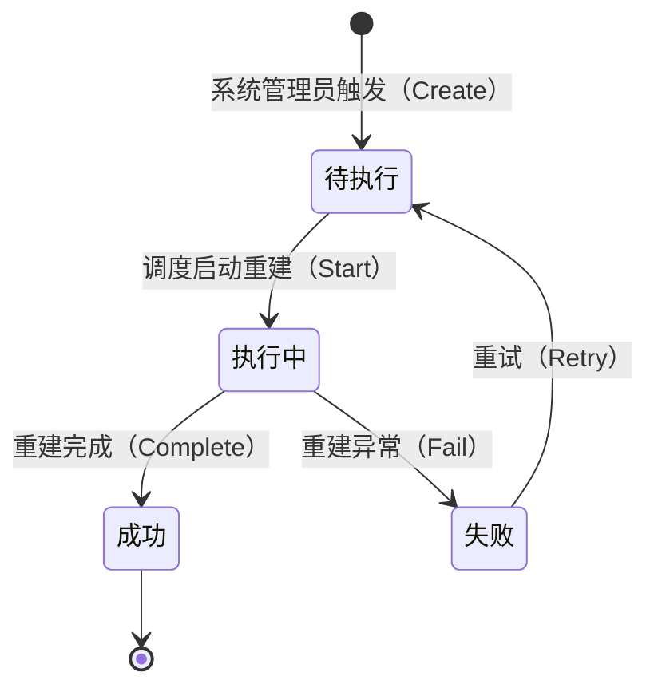
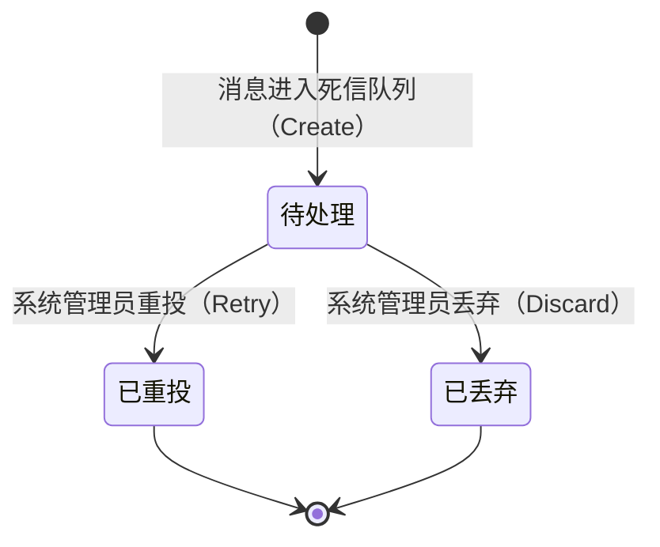

# 系统管理域需求文档

**所属限界上下文**：BC11 系统管理域
**文档版本**：V2.3
**创建日期**：2026-07-09
**类型**：通用子域

本域为新增限界上下文 BC11，补全审计中发现的跨域系统管理功能缺失。系统管理员职责中的接口限流、消息重试、索引重建、日志监控属跨域通用能力，不应在各域重复建设。本域作为通用子域统一收口数据看板、死信队列管理、索引重建管理、审计日志聚合、接口限流配置与系统健康监控六类能力。文档遵循 `00-需求文档总览与DDD架构.md` 第 4 章分层架构规范、第 6.4 节模块独立部署、第 6.5 节可观测性，与 `10-模块化部署架构.md` 系统管理端部署模块定义一致。作为通用子域，功能点仍细化到可开发粒度。

## 1 上下文概述

### 1.1 职责

本域作为通用子域统一收口跨域系统管理能力，聚合各域关键运营指标产出统计看板与报表，统一管理各域事件总线的死信消息、Elasticsearch 读库的全量索引重建任务、管理员关键操作的审计日志、各域 API 的限流规则与各模块健康状态。各域通过事件上报或健康端点接入本域，本域只读消费各域事件做统计聚合，通过管理接口操作各域基础设施。本域权威持有 DashboardReport、DeadLetterMessage、IndexRebuildTask、AuditLogEntry、RateLimitRule 五类聚合，对外发布索引重建完成、死信重投等少量事件，主要作为事件消费方存在。

### 1.2 边界

本域内部包含五个聚合根：DashboardReport（看板报表只读快照）、DeadLetterMessage（死信消息）、IndexRebuildTask（索引重建任务）、AuditLogEntry（审计日志条目）、RateLimitRule（限流规则）。DashboardReport 为按周期维度聚合的不可变只读快照，由事件消费与定时任务产出；DeadLetterMessage 跨域汇聚各 MQ 死信队列消息，支持重投与丢弃；IndexRebuildTask 触发并跟踪各域 ES 读库重建进度；AuditLogEntry 为只读聚合的操作日志投影，本域不写入审计日志，数据来源于消费各域审计事件或查询各域审计接口，补充各域已有审计日志的跨域聚合视角；RateLimitRule 配置各域网关限流阈值并热生效。

本域不持有各域业务对象，统计聚合以只读快照形式落地，跨域数据通过消费集成事件或调用各域查询接口获取。各域业务实体的增删改归属各域，本域仅做只读聚合与管理操作。死信消息、索引重建、限流规则的具体技术实现属基础设施层：MQ 死信队列管理、ES 索引重建触发、Redis 限流计数分别对接 RabbitMQ、Elasticsearch、Redis，领域层只见抽象接口。

### 1.3 与其他上下文的关系

本域为通用子域，与所有上下文以只读消费与管理操作两类关系协作。只读消费方向：订阅各域集成事件做统计聚合，不反向写各域业务数据。管理操作方向：通过管理接口触发各域基础设施动作（重投死信、重建索引、下发限流规则）。

- 订单与交易域（只读消费）：消费 `OrderCreatedEvent`/`OrderPaidEvent`/`OrderCancelledEvent` 统计订单量、GMV、转化率、店铺排行。
- 支付集成域（只读消费）：消费 `PaymentSucceededIntegrationEvent`/`PaymentFailedIntegrationEvent` 统计支付成功率。
- 积分与会员域（只读消费）：消费 `PointsEarnedEvent` 统计积分发放量。
- 消息通知域（只读消费）：消费 `NotificationSentEvent`/`NotificationFailedEvent` 统计通知送达率。
- 评价与售后域（只读消费）：消费 `RefundCompletedEvent`/`AfterSalesApprovedEvent` 统计售后量。
- 卖家与店铺管理域（只读消费）：消费 `ShopCreatedEvent` 与订单事件聚合店铺排行。
- 用户与认证授权域（只读消费+管理协作）：用户域已持有账户审计日志，本域聚合跨域视角；限流规则下发至各角色网关。
- 各域事件总线（管理操作）：本域汇聚各 MQ 死信队列，统一查看/重投/丢弃。
- 各域 ES 读库（管理操作）：本域触发全量索引重建并跟踪进度。
- 各模块 /health 端点（只读消费）：本域聚合健康状态，呼应总览 6.5 可观测性。

**关键警告**：本域对各域业务数据只读，绝不回写各域写库；管理操作经各域管理接口或基础设施抽象执行，不绕过域边界直连数据库。

### 1.4 统一语言补充术语

| 术语 | 英文 | 定义 |
|-|-|-|
| 看板报表 | DashboardReport | 按周期与维度聚合的运营指标只读快照 |
| 死信消息 | DeadLetterMessage | 各域事件总线消费失败进入死信队列的消息 |
| 索引重建任务 | IndexRebuildTask | 触发并跟踪某域 ES 读库全量重建的任务 |
| 审计日志条目 | AuditLogEntry | 管理员关键操作的不可篡改记录 |
| 限流规则 | RateLimitRule | 针对某 API 的限流阈值与算法配置 |
| 重建状态 | RebuildStatus | 索引重建任务状态枚举 |
| 消息状态 | MessageStatus | 死信消息处置状态枚举 |

## 2 领域模型设计

本域严格遵循总览第 4 章与 DDD 最佳实践的分层规范。领域层封装聚合、值对象、领域服务、仓储接口与领域事件，不引用任何技术细节；应用层编排用例并控制事务；基础设施层实现 EF Core 仓储、MQ 死信管理、ES 重建触发、Redis 限流计数与健康检查聚合；表现层只调用应用服务。聚合边界以一致性为依据：单次事务只修改一个聚合，跨聚合协作通过领域事件异步完成。

五个聚合根依据一致性边界与变更频率独立拆分。DashboardReport 为不可变只读快照独立聚合；DeadLetterMessage 含处置状态机独立聚合；IndexRebuildTask 含重建状态机独立聚合；AuditLogEntry 为只读聚合（本域不写入，数据来源于消费各域审计事件或查询各域审计接口的投影）；RateLimitRule 为配置类低频变更独立聚合。五者互不耦合，单次事务只修改其一。

### 2.1 聚合与实体

#### 2.1.1 DashboardReport 聚合根

DashboardReport 封装按周期与维度聚合的运营指标只读快照，创建后不可变，重算由应用层新建新版本 DataVersion 递增的快照，不修改既有记录。所有指标经事件消费或定时任务聚合产出。

| 字段名 | 类型 | 说明 | 约束 |
|-|-|-|-|
| ReportId | Guid | 报表唯一标识 | 主键，生成时创建 |
| ReportType | ReportType | 报表类型 | 枚举：订单GMV/支付成功率/积分发放量/通知送达率/售后量/店铺排行/转化率 |
| Period | ReportPeriod | 统计周期 | 值对象：周期类型(小时/日/周/月)+起止时间 |
| Metrics | List&lt;MetricItem&gt; | 指标集合 | 值对象集合，非空 |
| Granularity | string | 数据粒度 | 如按小时/按日，1–20 字符 |
| GeneratedAt | DateTime | 生成时间 | UTC，基础设施层填充 |
| DataVersion | int | 数据版本 | 同周期重算时递增，默认 1 |

DashboardReport 聚合方法：

- `Generate(reportType, period, metrics, granularity)`：工厂方法，校验周期起止合法（Start 早于 End）、指标集合非空、粒度合法，创建只读快照，附加 `DashboardReportGeneratedEvent`。
- 聚合创建后无变更方法，体现只读快照语义；应用层重算时新建记录并递增 DataVersion，旧版本保留供历史对比。

#### 2.1.2 DeadLetterMessage 聚合根

DeadLetterMessage 封装一条进入死信队列的消息及其处置状态，状态迁移由聚合根方法保证合法性，重投与丢弃操作幂等。

| 字段名 | 类型 | 说明 | 约束 |
|-|-|-|-|
| MessageId | Guid | 死信消息唯一标识 | 主键，进入死信时生成 |
| OriginalMessageId | string | 原始消息ID | 非空，幂等去重键 |
| SourceContext | string | 来源限界上下文 | 如 BC4 订单域，非空 |
| OriginalTopic | string | 原始主题 | 非空 |
| OriginalQueue | string | 原始队列 | 非空 |
| Payload | string | 原始消息体 | JSON，非空 |
| Headers | Dictionary&lt;string,string&gt; | 消息头 | 路由与追踪信息 |
| ErrorReason | string | 死信原因 | 非空，1–1000 字符 |
| FailedAt | DateTime | 进入死信时间 | UTC |
| RetryCount | int | 已重投次数 | 默认 0 |
| Status | MessageStatus | 处置状态 | 枚举：待处理/已重投/已丢弃 |
| OperatorId | Guid? | 操作人 | 重投/丢弃操作人，系统管理员 |
| OperatedAt | DateTime? | 操作时间 | UTC |
| DiscardReason | string? | 丢弃原因 | 丢弃时必填，1–500 字符 |
| Version | int | 乐观锁版本 | 并发控制 |

DeadLetterMessage 聚合方法：

- `Create(...)`：工厂方法，校验 OriginalMessageId 非空、Payload 非空，置待处理态，RetryCount 置 0。
- `Retry(operatorId)`：重投消息到原队列，仅待处理态可调用，置已重投态，RetryCount+1，记录操作人与时间，附加 `DeadLetterRetriedEvent`；已重投或已丢弃态调用抛领域异常。
- `Discard(operatorId, reason)`：丢弃消息，仅待处理态可调用，置已丢弃态，记录操作人、时间与丢弃原因，附加 `DeadLetterDiscardedEvent`。
- 重投与丢弃均以 OriginalMessageId 幂等，同一消息重复处置请求返回当前状态不重复执行。

#### 2.1.3 IndexRebuildTask 聚合根

IndexRebuildTask 封装一次 ES 读库全量重建任务的状态机与进度，状态迁移由聚合根方法保证合法性。

| 字段名 | 类型 | 说明 | 约束 |
|-|-|-|-|
| TaskId | Guid | 任务唯一标识 | 主键，触发时生成 |
| TargetContext | string | 目标限界上下文 | 如 BC2 商品域，非空 |
| IndexName | string | ES 索引名 | 非空 |
| Status | RebuildStatus | 任务状态 | 枚举：待执行/执行中/成功/失败 |
| TriggeredBy | Guid | 触发人 | 系统管理员 |
| TriggeredAt | DateTime | 触发时间 | UTC |
| StartedAt | DateTime? | 开始执行时间 | UTC |
| FinishedAt | DateTime? | 完成时间 | UTC |
| TotalDocs | long | 总文档数 | 执行中或完成后填充，≥0 |
| ProcessedDocs | long | 已处理文档数 | 进度跟踪，≥0 |
| ErrorMessage | string? | 失败原因 | 失败时填充，1–1000 字符 |
| RetryCount | int | 重试次数 | 默认 0 |
| Version | int | 乐观锁版本 | 并发控制 |

IndexRebuildTask 聚合方法：

- `Create(targetContext, indexName, triggeredBy)`：工厂方法，校验目标上下文与索引名非空，置待执行态，附加 `IndexRebuildRequestedEvent`。
- `Start(totalDocs)`：开始执行，仅待执行态可调用，置执行中态，写入 StartedAt 与 TotalDocs，ProcessedDocs 置 0。
- `ReportProgress(processedDocs)`：上报进度，仅执行中态可调用，更新 ProcessedDocs，不得大于 TotalDocs。
- `Complete()`：完成，仅执行中态可调用，置成功态，写入 FinishedAt，附加 `IndexRebuildCompletedEvent`。
- `Fail(reason)`：失败，仅执行中态可调用，置失败态，写入 FinishedAt 与 ErrorMessage，附加 `IndexRebuildFailedEvent`。
- `Retry()`：重试，仅失败态可调用，回到待执行态，RetryCount+1。

#### 2.1.4 AuditLogEntry 聚合根

AuditLogEntry 封装一条管理员关键操作审计记录的只读投影，本域不写入审计日志，聚合为只读聚合，数据来源于消费各域审计事件或查询各域审计接口的投影。

| 字段名 | 类型 | 说明 | 约束 |
|-|-|-|-|
| LogId | Guid | 日志唯一标识 | 主键 |
| OperatorId | Guid | 操作人标识 | 非空 |
| OperatorName | string | 操作人名称 | 非空，1–64 字符 |
| OperatorRole | string | 操作人角色 | 买家/卖家/运营/系统管理员 |
| SourceContext | string | 来源限界上下文 | 操作归属域，非空 |
| Action | string | 操作类型 | 如 创建订单/暂停店铺/重投死信，1–100 字符 |
| ResourceType | string | 资源类型 | 如 Shop/Order/DeadLetter，非空 |
| ResourceId | string? | 资源标识 | 可空 |
| RequestSummary | string | 请求摘要 | 脱敏后存储，≤2000 字符 |
| ResponseStatus | int | 响应状态码 | HTTP 状态码 |
| IpAddress | string | 操作 IP | 非空 |
| UserAgent | string? | 用户代理 | 可空 |
| TraceId | string? | 链路追踪ID | OpenTelemetry |
| BeforeSnapshot | string? | 变更前快照 | JSON，≤4000 字符 |
| AfterSnapshot | string? | 变更后快照 | JSON，≤4000 字符 |
| OccurredAt | DateTime | 发生时间 | UTC |

AuditLogEntry 聚合方法：

- 本聚合为只读聚合，不提供 Create 方法，数据来源于消费各域审计事件或查询各域审计接口的投影；聚合不暴露任何创建、变更或删除方法，体现只读投影语义。

**关键警告**：本域不写入审计日志，各域经审计中间件在事务内写入各域审计日志（如 BC1 的 `AuditLog`）；AuditLogEntry 为只读投影，任何修改、覆盖、删除操作均违反不变量，存储层与接口层均须拒绝篡改请求。

#### 2.1.5 RateLimitRule 聚合根

RateLimitRule 封装针对某 API 的限流阈值与算法配置，变更后通过事件通知各域网关热生效。

| 字段名 | 类型 | 说明 | 约束 |
|-|-|-|-|
| RuleId | Guid | 规则唯一标识 | 主键 |
| TargetApi | string | 目标 API 标识 | 路径或接口名，非空，1–200 字符 |
| TargetContext | string | 目标限界上下文 | 非空 |
| Limit | int | 阈值 | >0 |
| WindowSeconds | int | 窗口秒数 | >0 |
| Algorithm | LimitAlgorithm | 算法 | 枚举：滑动窗口/令牌桶/固定窗口 |
| Scope | LimitScope | 限流维度 | 枚举：IP/用户/全局/店铺 |
| Enabled | bool | 启用状态 | 默认 true |
| UpdatedBy | Guid | 最后修改人 | 系统管理员 |
| UpdatedAt | DateTime | 更新时间 | UTC |
| Version | int | 乐观锁版本 | 并发控制 |

RateLimitRule 聚合方法：

- `Create(...)`：工厂方法，校验阈值与窗口合法、API 标识非空，创建启用态规则，附加 `RateLimitRuleUpdatedEvent`。
- `Update(limit, windowSeconds, algorithm, scope, operatorId)`：更新阈值与算法参数，校验合法性，记录修改人，附加 `RateLimitRuleUpdatedEvent`。
- `Enable(operatorId)` / `Disable(operatorId)`：启停规则，记录修改人，附加 `RateLimitRuleUpdatedEvent`。

#### 2.1.6 值对象

值对象无唯一标识，通过属性值判断相等性，不可变。

##### ReportType

| 字段 | 类型 | 说明 | 约束 |
|-|-|-|-|
| Value | string | 报表类型 | 枚举：OrderGmv(订单GMV)/PaymentSuccessRate(支付成功率)/PointsIssued(积分发放量)/NotificationDelivery(通知送达率)/AfterSalesVolume(售后量)/ShopRanking(店铺排行)/ConversionRate(转化率) |

##### ReportPeriod

| 字段名 | 类型 | 说明 | 约束 |
|-|-|-|-|
| Type | string | 周期类型 | Hour/Day/Week/Month |
| Start | DateTime | 周期起始 | UTC |
| End | DateTime | 周期结束 | UTC，须晚于 Start |

##### MetricItem

| 字段名 | 类型 | 说明 | 约束 |
|-|-|-|-|
| Name | string | 指标名 | 非空，如 orderCount/gmv |
| Value | decimal | 指标值 | 可为小数 |
| Unit | string? | 单位 | 如 笔/元/%，可空 |
| Dimensions | Dictionary&lt;string,string&gt; | 维度标签 | 如 shopId/channel |

##### MessageStatus

| 字段 | 类型 | 说明 | 约束 |
|-|-|-|-|
| Value | string | 处置状态 | 枚举：Pending(待处理)/Retried(已重投)/Discarded(已丢弃) |

##### RebuildStatus

| 字段 | 类型 | 说明 | 约束 |
|-|-|-|-|
| Value | string | 任务状态 | 枚举：Pending(待执行)/Running(执行中)/Succeeded(成功)/Failed(失败) |

##### LimitAlgorithm

| 字段 | 类型 | 说明 | 约束 |
|-|-|-|-|
| Value | string | 限流算法 | 枚举：SlidingWindow(滑动窗口)/TokenBucket(令牌桶)/FixedWindow(固定窗口) |

##### LimitScope

| 字段 | 类型 | 说明 | 约束 |
|-|-|-|-|
| Value | string | 限流维度 | 枚举：Ip(按IP)/User(按用户)/Global(全局)/Shop(按店铺) |

##### ModuleHealth

| 字段名 | 类型 | 说明 | 约束 |
|-|-|-|-|
| Module | string | 模块名 | 非空，如 商品读服务 |
| Status | string | 健康状态 | Healthy/Degraded/Unhealthy |
| Dependencies | List&lt;DependencyHealth&gt; | 依赖项状态 | DB/Redis/ES/MQ 等 |
| CheckedAt | DateTime | 检测时间 | UTC |

ModuleHealth 用于系统健康监控聚合，非持久化聚合，由基础设施层聚合各模块 /health 端点产出。

### 2.2 领域服务

领域服务处理无法归入单一聚合的领域逻辑，接口与实现均在领域层。

- `IStatisticsAggregationService`：统计聚合服务。`AggregateAsync(reportType, period)` 依据报表类型与周期，从事件投影读模型聚合订单量、GMV、支付成功率、积分发放量、通知送达率、售后量、店铺排行等指标，产出 MetricItem 集合供 DashboardReport 生成。聚合逻辑按周期分桶，支持同维度多标签归并。
- `IDeadLetterRetryService`：死信重投服务。`RetryAsync(message)` 校验消息处于待处理态后调用基础设施层抽象将原始消息重新投递到原队列，重投成功后驱动聚合 `Retry`；重投失败回滚状态并记录原因。
- `IIndexRebuildOrchestrator`：索引重建编排服务。`TriggerAsync(targetContext, indexName, operatorId)` 创建 IndexRebuildTask 并调用基础设施层抽象触发目标域全量索引重建；`TrackProgressAsync(taskId)` 拉取重建进度回写任务；`ApplyCompensationAsync(taskId)` 在重建期间暂存增量事件并在重建完成后补偿回放。
- `IHealthAggregator`：健康检查聚合服务。`AggregateAsync()` 并发拉取各模块 /health 端点，归一化为 ModuleHealth 集合，按模块分组返回整体健康视图。
- `IRateLimitPolicyResolver`：限流策略解析服务。`ResolveAsync(targetApi)` 依据规则解析为网关可执行的限流策略，校验规则启用状态与算法合法性。

跨上下文的外部数据获取（各域事件投影读模型、各模块健康端点）不内嵌进领域服务，由应用层经防腐层或基础设施抽象编排，领域服务只接收应用层传入的结果做纯聚合与校验。

### 2.3 仓储接口

仓储接口定义在领域层，命名遵循 `I{聚合根名}Repository`，由基础设施层实现（如 `EfCoreDashboardReportRepository`、`EfCoreDeadLetterMessageRepository` 等）。

```csharp
// 领域层
public interface IDashboardReportRepository
{
    Task<DashboardReport?> GetByIdAsync(Guid reportId, CancellationToken ct = default);
    Task<DashboardReport?> GetLatestAsync(ReportType reportType, ReportPeriod period, CancellationToken ct = default);
    Task<(IReadOnlyList<DashboardReport> Items, int Total)> QueryAsync(DashboardReportQuery query, CancellationToken ct = default);
    Task AddAsync(DashboardReport report, CancellationToken ct = default);
}

public interface IDeadLetterMessageRepository
{
    Task<DeadLetterMessage?> GetByIdAsync(Guid messageId, CancellationToken ct = default);
    Task<DeadLetterMessage?> GetByOriginalMessageIdAsync(string originalMessageId, CancellationToken ct = default);
    Task<(IReadOnlyList<DeadLetterMessage> Items, int Total)> QueryAsync(DeadLetterMessageQuery query, CancellationToken ct = default);
    Task<IReadOnlyList<DeadLetterMessage>> GetPendingAsync(int batchSize, CancellationToken ct = default);
    Task AddAsync(DeadLetterMessage message, CancellationToken ct = default);
    Task UpdateAsync(DeadLetterMessage message, CancellationToken ct = default);
}

public interface IIndexRebuildTaskRepository
{
    Task<IndexRebuildTask?> GetByIdAsync(Guid taskId, CancellationToken ct = default);
    Task<IndexRebuildTask?> GetRunningByIndexAsync(string indexName, CancellationToken ct = default);
    Task<(IReadOnlyList<IndexRebuildTask> Items, int Total)> QueryAsync(IndexRebuildTaskQuery query, CancellationToken ct = default);
    Task AddAsync(IndexRebuildTask task, CancellationToken ct = default);
    Task UpdateAsync(IndexRebuildTask task, CancellationToken ct = default);
}

public interface IAuditLogEntryRepository
{
    Task<AuditLogEntry?> GetByIdAsync(Guid logId, CancellationToken ct = default);
    Task<(IReadOnlyList<AuditLogEntry> Items, int Total)> QueryAsync(AuditLogQuery query, CancellationToken ct = default);
}

public interface IRateLimitRuleRepository
{
    Task<RateLimitRule?> GetByIdAsync(Guid ruleId, CancellationToken ct = default);
    Task<RateLimitRule?> GetByTargetApiAsync(string targetApi, CancellationToken ct = default);
    Task<(IReadOnlyList<RateLimitRule> Items, int Total)> QueryAsync(RateLimitRuleQuery query, CancellationToken ct = default);
    Task AddAsync(RateLimitRule rule, CancellationToken ct = default);
    Task UpdateAsync(RateLimitRule rule, CancellationToken ct = default);
}
```

`DashboardReportQuery`、`DeadLetterMessageQuery`、`IndexRebuildTaskQuery`、`AuditLogQuery`、`RateLimitRuleQuery` 为查询参数对象，支持按类型、状态、来源上下文、时间范围、操作人等过滤与分页。审计日志仓储不提供 Create/Update/Delete 方法，落点体现只读聚合语义，数据来源于消费各域审计事件或查询各域审计接口的投影。DashboardReport 仓储同样无 Update 方法，体现只读快照语义。各查询走读库或缓存以提升性能。

### 2.4 基础设施抽象

本域遵循总览 4.8 外部能力配置驱动思路，领域层定义跨域基础设施抽象接口，基础设施层提供具体实现，实现细节仅在本层可见。

```csharp
// 领域层抽象
public interface IDeadLetterQueueManager
{
    Task<IReadOnlyList<DeadLetterMessage>> FetchAsync(string sourceContext, int batchSize, CancellationToken ct = default);
    Task<RetryResult> RepublishAsync(DeadLetterMessage message, CancellationToken ct = default);
}

public interface IIndexRebuildTrigger
{
    Task<RebuildHandle> StartAsync(string targetContext, string indexName, CancellationToken ct = default);
    Task<ProgressSnapshot> GetProgressAsync(string handle, CancellationToken ct = default);
}

public interface IModuleHealthProbe
{
    Task<ModuleHealth> ProbeAsync(string moduleEndpoint, CancellationToken ct = default);
}

public interface IRateLimitCounter
{
    Task<bool> TryAcquireAsync(string key, int limit, int windowSeconds, CancellationToken ct = default);
}
```

基础设施层落点：`RabbitMqDeadLetterManager`（对接 **RabbitMQ** 死信队列 API 获取与重投消息）、`ElasticsearchRebuildTrigger`（调用各域 ES reindex 或全量同步接口）、`HttpModuleHealthProbe`（聚合各模块 /health 端点）、`RedisRateLimitCounter`（基于 **Redis** Lua 脚本原子计数实现限流）。各域索引重建接口与死信队列地址由配置注入。

## 3 领域事件清单

本域主要是事件消费方，入站消费各域集成事件做统计聚合；对外发布事件较少，仅索引重建与死信处置相关事件。事件命名统一过去时。聚合保存与事件记录在同一事务写入（发件箱模式），后台进程轮询发件箱表并发布到消息队列，消费失败进入死信队列重试。

| 事件名 | 触发时机 | 消费方 | 关键字段 |
|-|-|-|-|
| `OrderCreatedEvent`（入站） | 订单域下单 | 系统管理域（订单量 +1、转化率统计） | orderId, userId, totalAmount, createdAt |
| `OrderPaidEvent`（入站） | 订单域支付成功 | 系统管理域（GMV 累计、店铺销售额累计） | orderId, sellerId, paidAmount, paidAt |
| `OrderCancelledEvent`（入站） | 订单域取消 | 系统管理域（转化率分母调整） | orderId, cancelledAt |
| `PaymentSucceededIntegrationEvent`（入站） | 支付集成域支付成功 | 系统管理域（支付成功率分子） | orderId, amount, succeededAt |
| `PaymentFailedIntegrationEvent`（入站） | 支付集成域支付失败 | 系统管理域（支付成功率分母） | orderId, failReason |
| `PointsEarnedEvent`（入站） | 积分域积分到账 | 系统管理域（积分发放量累计） | userId, points, balance |
| `NotificationSentEvent`（入站） | 通知域发送成功 | 系统管理域（通知送达率分子） | recordId, channel, sentAt |
| `NotificationFailedEvent`（入站） | 通知域发送失败 | 系统管理域（通知送达率分母） | recordId, errorCode |
| `RefundCompletedEvent`（入站） | 售后域退款完成 | 系统管理域（售后量累计） | afterSalesId, refundedAmount |
| `AfterSalesApprovedEvent`（入站） | 售后审核通过 | 系统管理域（售后量累计） | afterSalesId, type |
| `ShopCreatedEvent`（入站） | 卖家域店铺创建 | 系统管理域（店铺排行基线） | shopId, sellerId, shopName |
| `DashboardReportGeneratedEvent`（出站） | 看板快照生成 | 可观测、缓存失效 | reportId, reportType, period, dataVersion |
| `IndexRebuildRequestedEvent`（出站） | 索引重建任务创建 | 目标域索引重建消费者 | taskId, targetContext, indexName, triggeredBy |
| `IndexRebuildCompletedEvent`（出站） | 索引重建成功 | 可观测、告警 | taskId, targetContext, indexName, totalDocs, durationMs |
| `IndexRebuildFailedEvent`（出站） | 索引重建失败 | 告警、人工处理队列 | taskId, targetContext, indexName, errorMessage |
| `DeadLetterRetriedEvent`（出站） | 死信消息重投 | 可观测、统计 | messageId, originalMessageId, sourceContext, retryCount |
| `DeadLetterDiscardedEvent`（出站） | 死信消息丢弃 | 可观测、审计 | messageId, originalMessageId, sourceContext, discardReason |
| `RateLimitRuleUpdatedEvent`（出站） | 限流规则变更 | 各域网关热生效 | ruleId, targetApi, targetContext, limit, windowSeconds, algorithm, scope, enabled |

入站事件由各域事件消费者订阅，按报表类型分桶写入统计投影读模型（如时序库或 ES 聚合索引），供 DashboardReport 聚合查询。事件消费幂等（以事件ID去重），消费失败进入死信队列由本域死信管理统一兜底。各域网关订阅 `RateLimitRuleUpdatedEvent` 热加载新规则，无需重启。

## 4 功能需求

### 4.0 功能点概览表

| 编号 | 功能模块 | 功能描述 |
|-|-|-|
| F-SYS-001 | 运营数据看板 | 聚合订单量/GMV/转化率等总览指标的多周期看板 |
| F-SYS-002 | 支付统计报表 | 支付成功率、分渠道支付量统计报表 |
| F-SYS-003 | 积分统计报表 | 积分发放量、消耗量、净增报表 |
| F-SYS-004 | 通知送达率监控 | 邮件/短信送达率与失败原因分布 |
| F-SYS-005 | 售后统计报表 | 售后量、退款金额、售后类型分布 |
| F-SYS-006 | 店铺排行看板 | 按销售额/订单量维度的店铺排行 |
| F-SYS-007 | 死信队列管理 | 跨域死信列表/重投/丢弃/批量处置 |
| F-SYS-008 | 索引重建管理 | 触发/进度/健康状态跟踪与补偿 |
| F-SYS-009 | 审计日志聚合查询 | 跨域管理员操作审计日志聚合查询 |
| F-SYS-010 | 接口限流配置 | 各域 API 限流阈值与算法配置热生效 |
| F-SYS-011 | 系统健康监控 | 聚合各模块 /health 端点状态 |

#### 4.0.1 统计数据源一致性说明

F-SYS-001~006 统计看板与各域域内统计端点（如 BC8 支付统计、BC9 通知统计）的数据源一致：各域统计基于本域事件投影，本域看板消费各域集成事件做跨域聚合，两层统计使用相同的事件源，确保数据口径一致。本域只读消费各域事件，不回写各域写库，统计口径以事件源为准，避免域内统计与跨域看板出现数值偏差。

### F-SYS-001 运营数据看板

业务逻辑：聚合订单量、GMV、转化率等总览指标，按小时/日/周/月多周期产出 DashboardReport 只读快照。订单量统计 `OrderCreatedEvent`，GMV 累计 `OrderPaidEvent` 的 paidAmount，转化率以支付订单数除以下单数计算。看板支持多周期对比与趋势展示。

交互逻辑：运营或系统管理员在看板页选择报表类型与周期，`IDashboardAppService.GetOverviewAsync` 从最新快照读模型加载指标，若快照未生成则触发 `IStatisticsAggregationService.AggregateAsync` 即时聚合后产出快照并缓存。指标按维度标签（如渠道、终端）归并展示。

规则约束：周期起止合法且不得跨越未来；指标值非负；转化率保留两位小数百分比；快照生成后不可变，重算新建新版本；即时聚合超时降级返回上次快照并标记数据时效。

权限逻辑：运营管理员可查看全部看板；系统管理员可查看；终端用户不可访问。

边界与异常：统计投影读模型存在秒级最终一致窗口，刚支付订单的 GMV 可能短暂未更新；快照缓存于 Redis 设随机过期防雪崩；即时聚合超时阈值 5s，超时降级返回历史快照。

### F-SYS-002 支付统计报表

业务逻辑：统计支付成功率与分渠道支付量。支付成功率以 `PaymentSucceededIntegrationEvent` 次数除以（成功 + `PaymentFailedIntegrationEvent`）次数计算，按渠道（微信/支付宝）与周期分桶。

交互逻辑：运营选择周期与渠道维度，应用服务加载支付成功率快照，缺失则聚合事件投影产出快照。报表含成功率趋势、失败原因分布。

规则约束：成功率分母含失败请求，不含待支付；分渠道独立统计；周期内无数据时成功率返回空值而非 0。

权限逻辑：运营管理员可查看；系统管理员可查看。

边界与异常：支付事件投影延迟导致成功率短暂偏低；渠道字段缺失时归为"未知渠道"桶；报表查询走读库。

### F-SYS-003 积分统计报表

业务逻辑：统计积分发放量、消耗量与净增量。发放量累计 `PointsEarnedEvent` 的 points，消耗量累计 `PointsConsumedEvent` 的 points，净增为发放减消耗。

交互逻辑：运营选择周期，应用服务加载积分统计快照返回发放量、消耗量、净增与趋势。

规则约束：积分值非负整数；净增可为负（退款扣回）；按用户群体维度（会员等级）归并。

权限逻辑：运营管理员可查看；系统管理员可查看。

边界与异常：积分事件投影读模型由积分域事件驱动；消耗事件未对外发布时消耗量统计为空并标注。

### F-SYS-004 通知送达率监控

业务逻辑：统计邮件与短信的送达率与失败原因分布。送达率以 `NotificationSentEvent` 次数除以（成功 + `NotificationFailedEvent`）次数计算，按渠道与模板分桶。

交互逻辑：运营选择周期与渠道，应用服务加载送达率快照返回送达率趋势、失败原因 TopN 分布。

规则约束：送达率分母含失败；按渠道（Email/Sms）独立统计；失败原因按 errorCode 聚合。

权限逻辑：运营管理员可查看；系统管理员可查看。

边界与异常：通知事件投影延迟导致送达率短暂偏低；死信通知计入失败分母；报表走读库。

### F-SYS-005 售后统计报表

业务逻辑：统计售后量、退款金额与售后类型分布。售后量累计 `AfterSalesApprovedEvent` 与 `RefundCompletedEvent`，退款金额累计 refundedAmount，按售后类型（退货退款/仅退款）分桶。

交互逻辑：运营选择周期，应用服务加载售后统计快照返回售后量、退款金额、类型分布与趋势。

规则约束：退款金额为实际退款累计；售后量含审核通过与退款完成两类，按售后单去重；按店铺维度归并。

权限逻辑：运营管理员可查看；系统管理员可查看。

边界与异常：售后事件投影延迟；退款金额以支付集成域退款事件为准，本域只读聚合。

### F-SYS-006 店铺排行看板

业务逻辑：按销售额与订单量维度产出店铺排行。销售额由 `OrderPaidEvent` 按 sellerId（店铺标识）累计 paidAmount，订单量累计下单数，取 TopN 排行。

交互逻辑：运营选择周期与排行维度，应用服务加载店铺排行快照返回 TopN 店铺列表含店铺名、销售额、订单量。

规则约束：排行默认 Top20；店铺标识关联卖家域 ShopId；关闭店铺不纳入当期排行；销售额为已支付订单金额。

权限逻辑：运营管理员可查看；系统管理员可查看。

边界与异常：订单事件投影按 sellerId 累计；新店铺无数据时排行靠后；排行快照按日产出。

### F-SYS-007 死信队列管理

业务逻辑：跨域汇聚各 MQ 死信队列消息，提供列表查看、单条重投、单条丢弃、批量重投与批量丢弃。死信消息由 `IDeadLetterQueueManager.FetchAsync` 从各域死信队列拉取落库为 DeadLetterMessage 聚合，处置操作驱动聚合状态迁移。

交互逻辑：系统管理员在死信管理页按来源上下文、状态、时间筛选，查看消息详情含原始消息体与死信原因。重投调用 `ISystemAdminAppService.RetryDeadLetterAsync`，应用层加载聚合调用 `Retry` 后由 `IDeadLetterRetryService` 重新投递到原队列；丢弃调用 `Discard` 附原因。批量操作循环单条处置，单条失败不影响其余。

规则约束：仅待处理态可重投或丢弃；重投与丢弃以 OriginalMessageId 幂等，重复请求返回当前状态不重复执行；丢弃原因必填；批量上限 100 条；操作记录审计日志。

权限逻辑：仅系统管理员可处置死信；运营可查看不可处置。

边界与异常：重投失败回滚状态为待处理并记录原因；死信队列积压超阈值告警；批量操作部分失败返回失败明细列表。

### F-SYS-008 索引重建管理

业务逻辑：统一触发并监控各域 ES 读库的全量索引重建。系统管理员选择目标上下文与索引名创建 IndexRebuildTask，由 `IIndexRebuildOrchestrator` 调用目标域索引重建接口触发全量重建，重建期间增量事件暂存，重建完成后补偿回放。任务进度由 `TrackProgressAsync` 周期拉取回写。

交互逻辑：系统管理员在索引重建页选择目标域与索引，`ISystemAdminAppService.TriggerRebuildAsync` 创建待执行任务并触发重建；任务列表展示状态与进度百分比；详情页展示总文档数、已处理数、耗时。失败任务可重试。

规则约束：同一索引已有执行中任务时拒绝重复触发返回 409；进度不得大于总文档数；重建期间增量事件暂存补偿；重试次数上限 3；操作记录审计日志。

权限逻辑：仅系统管理员可触发与重试；运营可查看进度。

边界与异常：目标域索引重建接口超时任务置失败；重建期间查询走旧索引，切换瞬间有秒级双读窗口；补偿回放失败告警人工介入。

### F-SYS-009 审计日志聚合查询

业务逻辑：统一聚合查询管理员关键操作的审计日志，补充各域已有审计日志的跨域视角。本域不写入审计日志，各域经审计中间件在事务内写入各域审计日志（如 BC1 的 `AuditLog`），本域通过消费各域审计事件或调用各域内部查询接口做跨域只读聚合查询，数据以 AuditLogEntry 只读投影形式落地。聚合查询支持按操作人、角色、来源上下文、操作类型、资源类型、时间范围、响应状态筛选。

交互逻辑：系统管理员在审计日志页多维度筛选查询，查看日志详情含操作人、操作类型、请求摘要、变更前后快照、IP、TraceId。日志按时间倒序分页。

规则约束：本域 AuditLogEntry 为只读投影，不可修改删除（本域不写入，数据来源于消费各域审计事件或查询各域审计接口）；请求摘要脱敏存储（敏感参数掩码）；分页 page 从 1 开始，pageSize 默认 20、最大 100；保留期 180 天，超期归档冷存储。

权限逻辑：仅系统管理员可查询审计日志；运营可查询自身操作记录；日志不可导出明文敏感参数。

边界与异常：日志查询走专用读库或 ES 索引；跨域日志聚合存在秒级延迟；篡改请求返回 403。

### F-SYS-010 接口限流配置

业务逻辑：统一配置各域 API 的限流阈值与算法。系统管理员维护 RateLimitRule，变更后发布 `RateLimitRuleUpdatedEvent` 通知各域网关热加载新规则，无需重启。限流计数由各域网关基于 Redis 实现，本域只管配置下发。

交互逻辑：系统管理员在限流配置页新增/编辑规则（目标 API、阈值、窗口、算法、维度），`ISystemAdminAppService` 加载聚合调用 `Update`/`Enable`/`Disable`，UnitOfWork 提交后事件经发件箱发布。规则列表按目标上下文与 API 筛选。

规则约束：阈值与窗口须大于 0；目标 API 标识全局唯一；算法与维度取枚举值；规则启停即时生效；操作记录审计日志。

权限逻辑：仅系统管理员可配置限流规则；运营不可配置。

边界与异常：规则下发至网关存在秒级生效窗口；网关订阅失败时沿用旧规则并告警；并发编辑采用乐观锁冲突返回 409。

### F-SYS-011 系统健康监控

业务逻辑：聚合各模块 /health 端点状态，产出整体健康视图。`IHealthAggregator.AggregateAsync` 并发拉取各模块健康端点，归一化为 ModuleHealth 集合，按模块分组展示 DB、Redis、ES、MQ、支付渠道、通知渠道等依赖项状态。

交互逻辑：系统管理员在健康监控页查看各模块健康状态（健康/降级/不健康），展开查看依赖项明细。整体状态取各模块最差状态。

规则约束：健康端点拉取超时 3s 归为不健康；状态聚合取最差；健康检查频率 30s；不健康模块触发告警。

权限逻辑：仅系统管理员可查看健康监控；运营可查看概览。

边界与异常：模块健康端点不可达归为不健康并告警；聚合查询并发拉取各模块；降级状态（部分依赖不健康）单独标识。

## 5 API 设计

接口遵循总览文档第 8 章 RESTful 规范，资源以名词复数命名，统一响应含 `code`/`message`/`data`，鉴权通过 `Authorization: Bearer {token}`。表现层控制器 `DashboardController`、`DeadLetterController`、`IndexRebuildController`、`AuditLogController`、`RateLimitController`、`HealthController` 只调用应用服务，不含业务逻辑与数据访问代码，输入输出一律使用 DTO。写操作支持 `Idempotency-Key` 头保证重复请求安全。所有接口经系统管理端网关，采用 JWT + 双因子 + IP 白名单鉴权，全部操作审计留痕。

### 5.1 看板查询接口

| 方法 | 端点 | 说明 | 请求体概要 | 响应概要 | 鉴权要求 |
|-|-|-|-|-|-|
| GET | /api/admin/dashboard/overview | 运营总览（订单量/GMV/转化率） | query: period, granularity | {orderCount, gmv, conversionRate, trend} | Bearer + 运营/系统管理员 |
| GET | /api/admin/dashboard/payment-stats | 支付统计报表 | query: period, channel | {successRate, channelStats, failureReasons} | Bearer + 运营/系统管理员 |
| GET | /api/admin/dashboard/points-stats | 积分统计报表 | query: period | {issued, consumed, net, trend} | Bearer + 运营/系统管理员 |
| GET | /api/admin/dashboard/notification-delivery | 通知送达率监控 | query: period, channel | {deliveryRate, channelStats, failureReasons} | Bearer + 运营/系统管理员 |
| GET | /api/admin/dashboard/after-sales-stats | 售后统计报表 | query: period | {afterSalesCount, refundAmount, typeDistribution} | Bearer + 运营/系统管理员 |
| GET | /api/admin/dashboard/shop-ranking | 店铺排行看板 | query: period, dimension, topN | {items:[{shopId, shopName, salesAmount, orderCount}]} | Bearer + 运营/系统管理员 |
| GET | /api/admin/dashboard/reports | 报表快照列表 | query: reportType, period, page, pageSize | {items, total, page, pageSize} | Bearer + 运营/系统管理员 |
| GET | /api/admin/dashboard/reports/{id} | 报表快照详情 | — | {report} | Bearer + 运营/系统管理员 |

### 5.2 死信管理接口

| 方法 | 端点 | 说明 | 请求体概要 | 响应概要 | 鉴权要求 |
|-|-|-|-|-|-|
| GET | /api/admin/dead-letters | 死信列表 | query: sourceContext, status, page, pageSize | {items, total, page, pageSize} | Bearer + 系统管理员 |
| GET | /api/admin/dead-letters/{id} | 死信详情 | — | {message} | Bearer + 系统管理员 |
| POST | /api/admin/dead-letters/{id}/retry | 重投单条 | — | {message} | Bearer + 系统管理员 |
| POST | /api/admin/dead-letters/{id}/discard | 丢弃单条 | {discardReason} | {message} | Bearer + 系统管理员 |
| POST | /api/admin/dead-letters/batch-retry | 批量重投 | {messageIds:[]} | {succeeded:[], failed:[]} | Bearer + 系统管理员 |
| POST | /api/admin/dead-letters/batch-discard | 批量丢弃 | {messageIds:[], discardReason} | {succeeded:[], failed:[]} | Bearer + 系统管理员 |

### 5.3 索引重建接口

| 方法 | 端点 | 说明 | 请求体概要 | 响应概要 | 鉴权要求 |
|-|-|-|-|-|-|
| GET | /api/admin/index-rebuilds | 重建任务列表 | query: targetContext, status, page, pageSize | {items, total, page, pageSize} | Bearer + 系统管理员 |
| POST | /api/admin/index-rebuilds | 触发重建任务 | {targetContext, indexName} | {task} | Bearer + 系统管理员 |
| GET | /api/admin/index-rebuilds/{id} | 任务详情与进度 | — | {task, progressPercent} | Bearer + 系统管理员 |
| POST | /api/admin/index-rebuilds/{id}/retry | 重试失败任务 | — | {task} | Bearer + 系统管理员 |

### 5.4 审计日志接口

| 方法 | 端点 | 说明 | 请求体概要 | 响应概要 | 鉴权要求 |
|-|-|-|-|-|-|
| GET | /api/admin/audit-logs | 审计日志列表 | query: operatorId, role, sourceContext, action, resourceType, responseStatus, startTime, endTime, page, pageSize | {items, total, page, pageSize} | Bearer + 系统管理员 |
| GET | /api/admin/audit-logs/{id} | 审计日志详情 | — | {log} | Bearer + 系统管理员 |

本端点为跨域只读聚合查询接口，BC1 用户与认证授权域已移除 `/api/admin/audit-logs` 端点，审计日志查询统一收口至本域 F-SYS-009，避免路径冲突与双模型冗余。本域不写入审计日志，数据来源于消费各域审计事件或调用各域内部查询接口的投影。

### 5.5 限流配置接口

| 方法 | 端点 | 说明 | 请求体概要 | 响应概要 | 鉴权要求 |
|-|-|-|-|-|-|
| GET | /api/admin/rate-limit-rules | 限流规则列表 | query: targetContext, enabled, page, pageSize | {items, total, page, pageSize} | Bearer + 系统管理员 |
| POST | /api/admin/rate-limit-rules | 新增规则 | {targetApi, targetContext, limit, windowSeconds, algorithm, scope} | {rule} | Bearer + 系统管理员 |
| GET | /api/admin/rate-limit-rules/{id} | 规则详情 | — | {rule} | Bearer + 系统管理员 |
| PUT | /api/admin/rate-limit-rules/{id} | 更新规则 | {limit, windowSeconds, algorithm, scope} | {rule} | Bearer + 系统管理员 |
| POST | /api/admin/rate-limit-rules/{id}/enable | 启用规则 | — | {rule} | Bearer + 系统管理员 |
| POST | /api/admin/rate-limit-rules/{id}/disable | 禁用规则 | — | {rule} | Bearer + 系统管理员 |

### 5.6 健康监控接口

| 方法 | 端点 | 说明 | 请求体概要 | 响应概要 | 鉴权要求 |
|-|-|-|-|-|-|
| GET | /api/admin/health | 聚合健康状态 | — | {overallStatus, modules:[{module, status}]} | Bearer + 系统管理员 |
| GET | /api/admin/health/modules | 各模块健康详情 | — | {modules:[{module, status, dependencies, checkedAt}]} | Bearer + 系统管理员 |

通用约束：分页默认 page=1、pageSize=20、最大 100；写操作返回创建或更新后的资源；时间字段 ISO 8601 UTC；死信处置与限流规则变更强制要求 `Idempotency-Key` 头保证重复请求安全；批量处置上限 100 条。

## 6 业务规则与不变量

| 编号 | 规则 | 说明 |
|-|-|-|
| INV-SYS-01 | 审计日志只读不可篡改 | AuditLogEntry 为只读聚合，本域不写入审计日志，数据来源于消费各域审计事件或查询各域审计接口的投影；聚合不暴露创建、变更或删除方法，存储层与接口层拒绝篡改请求，返回 403 |
| INV-SYS-02 | 看板快照不可变 | DashboardReport 创建后不可修改，重算新建新版本 DataVersion 递增，旧版本保留供历史对比 |
| INV-SYS-03 | 死信重投幂等 | 重投与丢弃以 OriginalMessageId 幂等，重复处置请求返回当前状态不重复执行；仅待处理态可处置 |
| INV-SYS-04 | 索引重建期间增量事件暂存补偿 | 重建期间产生的增量事件暂存，重建完成后补偿回放，避免重建窗口内数据丢失；补偿失败告警人工介入 |
| INV-SYS-05 | 限流配置热生效 | 限流规则变更发布 `RateLimitRuleUpdatedEvent`，各域网关订阅热加载，无需重启；下发存在秒级生效窗口 |
| INV-SYS-06 | 同索引重建串行 | 同一索引已有执行中任务时拒绝重复触发返回 409，避免并发重建冲突 |
| INV-SYS-07 | 本域对业务数据只读 | 本域只读消费各域事件做统计聚合，绝不回写各域写库；管理操作经各域接口或基础设施抽象执行 |
| INV-SYS-08 | 单聚合事务 | 单次事务只修改一个聚合（DashboardReport/DeadLetterMessage/IndexRebuildTask/AuditLogEntry/RateLimitRule 之一） |
| INV-SYS-09 | 发件箱原子发布 | 聚合保存与事件记录在同一事务写入，后台进程轮询发件箱发布，保证本地事务与事件发布原子性 |
| INV-SYS-10 | 状态合法迁移 | IndexRebuildTask 与 DeadLetterMessage 状态只能按状态机迁移，非法迁移抛领域异常 |
| INV-SYS-11 | 敏感参数脱敏 | 审计日志请求摘要脱敏存储，敏感参数掩码；日志不可导出明文敏感参数 |
| INV-SYS-12 | 健康聚合取最差 | 整体健康状态取各模块最差状态，不健康模块触发告警，呼应总览 6.5 可观测性 |
| INV-SYS-13 | 看板即时聚合降级 | 即时聚合超时降级返回上次快照并标记数据时效，不阻断看板访问 |
| INV-SYS-14 | 操作全审计 | 死信处置、索引重建、限流配置变更等关键操作经审计中间件产生审计事件，纳入跨域审计日志聚合查询 |

## 7 状态机

### 7.1 索引重建任务状态机



状态流转均由 IndexRebuildTask 聚合根方法驱动，非法迁移抛出领域异常。待执行经调度进入执行中；执行中按重建结果分流至成功或失败；失败可重试回到待执行，重试次数上限 3 次；成功为终态。重建期间增量事件暂存，成功后补偿回放。

### 7.2 死信消息状态机



状态流转均由 DeadLetterMessage 聚合根方法驱动，非法迁移抛出领域异常。待处理为初始态，仅此态可重投或丢弃；重投与丢弃以 OriginalMessageId 幂等，重复处置请求返回当前状态不重复执行；已重投与已丢弃为终态。

## 8 验收标准

以下用 Given/When/Then 描述可测试条件，覆盖核心功能点与边界。

### AC-SYS-001 运营数据看板聚合

- Given 当日已产生 100 笔下单、80 笔支付，累计 GMV 8000 元
- When 运营查询当日总览看板
- Then 返回订单量 100、GMV 8000、转化率 80%，数据来自当日快照读模型

### AC-SYS-001a 看板即时聚合降级

- Given 当日快照未生成且即时聚合超时
- When 运营查询当日总览看板
- Then 返回上次可用快照并标记数据时效，不阻断访问

### AC-SYS-002 支付成功率统计

- Given 当日微信渠道支付成功 90 笔、失败 10 笔
- When 运营查询当日支付统计报表按微信渠道
- Then 返回成功率 90%，失败原因按 errorCode 聚合分布

### AC-SYS-003 积分发放量统计

- Given 当日积分域发布 `PointsEarnedEvent` 累计发放 50000 积分
- When 运营查询当日积分统计报表
- Then 返回发放量 50000，净增按发放减消耗计算

### AC-SYS-004 通知送达率监控

- Given 当日短信渠道发送成功 95 条、失败 5 条
- When 运营查询当日通知送达率按短信渠道
- Then 返回送达率 95%，失败原因 TopN 分布

### AC-SYS-005 售后统计报表

- Given 当日售后审核通过 20 单、退款完成 18 单、退款金额 3600 元
- When 运营查询当日售后统计报表
- Then 返回售后量 20、退款金额 3600、类型分布

### AC-SYS-006 店铺排行看板

- Given 当日店铺 A 销售额 5000 元、店铺 B 销售额 3000 元
- When 运营查询当日店铺排行 Top20 按销售额
- Then 返回店铺 A 排名第一、店铺 B 排名第二，含店铺名与销售额

### AC-SYS-007 死信重投幂等

- Given 一条待处理死信消息已重投成功置已重投态
- When 系统管理员再次对同一消息发起重投
- Then 返回当前已重投状态，不重复投递，不附加重复事件

### AC-SYS-007a 死信丢弃必填原因

- Given 一条待处理死信消息
- When 系统管理员丢弃但未填写丢弃原因
- Then 返回 400，丢弃原因必填

### AC-SYS-007b 死信批量处置部分失败

- Given 批量重投 50 条死信其中 2 条已非待处理态
- When 系统管理员发起批量重投
- Then 48 条成功重投，2 条返回失败明细，不影响其余

### AC-SYS-008 索引重建触发与进度

- Given 商品域 ES 索引无执行中重建任务
- When 系统管理员触发商品域索引重建
- Then 创建待执行任务并触发重建，任务流转至执行中，进度随重建推进回写

### AC-SYS-008a 同索引重复触发拦截

- Given 商品域索引已有执行中重建任务
- When 系统管理员再次触发同一索引重建
- Then 返回 409，拒绝重复触发

### AC-SYS-008b 索引重建增量补偿

- Given 商品域索引重建期间产生 10 条增量商品事件
- When 重建完成
- Then 暂存的 10 条增量事件补偿回放，索引数据最终一致

### AC-SYS-008c 索引重建失败重试

- Given 索引重建任务因目标域接口超时置失败态
- When 系统管理员重试
- Then 任务回到待执行态，RetryCount+1，重新触发重建

### AC-SYS-009 审计日志不可篡改

- Given 一条审计日志已由各域写入并聚合为本域只读投影
- When 任何请求尝试修改或删除该日志
- Then 返回 403，日志不变

### AC-SYS-009a 审计日志跨域聚合查询

- Given 订单域与卖家域各经审计中间件写入管理员操作审计日志
- When 系统管理员按来源上下文筛选查询
- Then 返回两域审计日志聚合结果，按时间倒序分页

### AC-SYS-009b 审计日志敏感参数脱敏

- Given 管理员操作请求体含支付密钥等敏感参数
- When 各域经审计中间件写入审计日志并聚合至本域
- Then 请求摘要中敏感参数掩码存储，详情查询返回脱敏值

### AC-SYS-010 限流配置热生效

- Given 系统管理员更新某 API 限流阈值为 100/秒
- When 规则保存并发事件
- Then 各域网关订阅 `RateLimitRuleUpdatedEvent` 热加载新阈值，后续请求按新阈值限流，无需重启

### AC-SYS-010a 限流规则并发编辑冲突

- Given 两名系统管理员同时编辑同一限流规则
- When 后提交者保存
- Then 乐观锁冲突返回 409，提示刷新后重试

### AC-SYS-011 系统健康聚合

- Given 商品读服务 /health 返回 Degraded、订单服务返回 Healthy
- When 系统管理员查询聚合健康状态
- Then 整体状态为 Degraded，模块明细展示各模块状态与依赖项

### AC-SYS-011a 健康端点不可达告警

- Given 某模块 /health 端点拉取超时
- When 健康聚合执行
- Then 该模块标记为 Unhealthy，触发告警，整体状态为 Unhealthy

### AC-SYS-012 越权访问拦截

- Given 运营管理员尝试重投死信消息
- When 调用死信重投接口
- Then 返回 403，仅系统管理员可处置死信

### AC-SYS-013 本域不回写业务库

- Given 本域消费订单域 `OrderPaidEvent` 聚合 GMV
- When 聚合完成产出看板快照
- Then 仅写入本域统计投影读模型与快照，不回写订单域写库

## 9 DDD 分层落点

本域四层落点遵循总览第 4 章分层架构规范与 DDD 最佳实践，依赖从外向内指向领域核心。

| 分层 | 系统管理域落点 | 职责 |
|-|-|-|
| 领域层 | DashboardReport/DeadLetterMessage/IndexRebuildTask/AuditLogEntry/RateLimitRule 聚合，ReportType/ReportPeriod/MetricItem/MessageStatus/RebuildStatus/LimitAlgorithm/LimitScope/ModuleHealth 值对象，IStatisticsAggregationService/IDeadLetterRetryService/IIndexRebuildOrchestrator/IHealthAggregator/IRateLimitPolicyResolver 领域服务，IDeadLetterQueueManager/IIndexRebuildTrigger/IModuleHealthProbe/IRateLimitCounter 基础设施抽象接口，IDashboardReportRepository/IDeadLetterMessageRepository/IIndexRebuildTaskRepository/IAuditLogEntryRepository/IRateLimitRuleRepository 仓储接口，第 3 章领域事件 | 封装统计聚合、死信处置、索引重建、审计只读聚合（本域不写入，数据来源于消费各域审计事件或查询各域审计接口）、限流规则不变量 |
| 应用层 | IDashboardAppService/ISystemAdminAppService，DTO、Command/Query，各域事件消费者（订阅订单/支付/积分/通知/售后/卖家域事件维护统计投影读模型），限流规则下发协调，事务边界 | 用例编排与事务管理；统计投影读模型同步 |
| 基础设施层 | EfCoreDashboardReportRepository/EfCoreDeadLetterMessageRepository/EfCoreIndexRebuildTaskRepository/EfCoreAuditLogEntryRepository/EfCoreRateLimitRuleRepository，RabbitMqDeadLetterManager（死信队列管理）、ElasticsearchRebuildTrigger（ES 索引重建触发）、HttpModuleHealthProbe（健康检查聚合）、RedisRateLimitCounter（Redis 限流计数），发件箱发布，统计投影读模型同步消费者 | 持久化、MQ 死信管理、ES 重建、Redis 限流、健康聚合、事件发布 |
| 表现层 | DashboardController、DeadLetterController、IndexRebuildController、AuditLogController、RateLimitController、HealthController | 接收请求、调用应用服务、返回 DTO |
