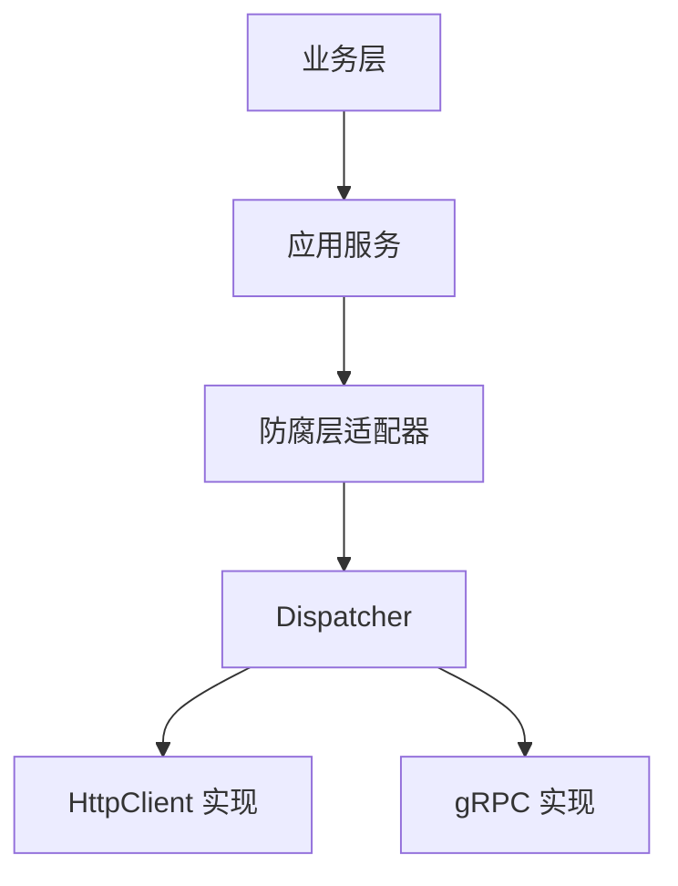
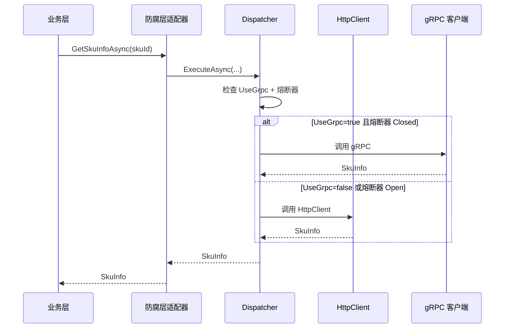
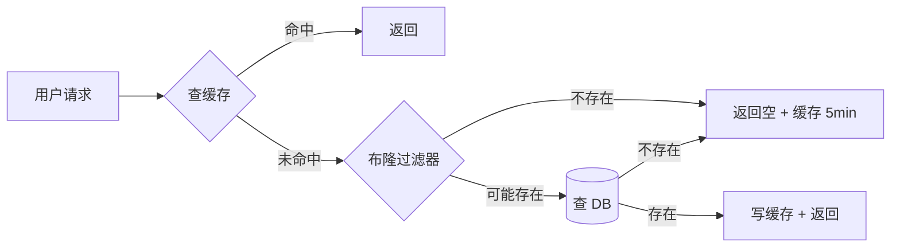
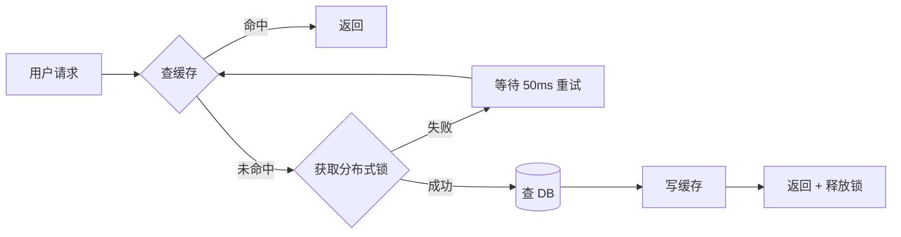
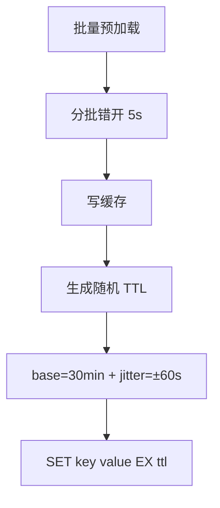

# 新手友好系统开发手册设计

## 1. 设计目标与读者画像

### 1.1 目标

为 Leno 电商平台编写一份**对新手友好的系统开发手册（System Handbook）**，覆盖架构与设计模式、代码开发规范与模式、本地环境与开发流程、部署与运维与可观测性四大主题，作为团队成员长期参考。

### 1.2 读者画像

新手 .NET 开发：会 C# 与 .NET，但不了解 DDD、微服务、容器化等概念。常见场景为刚入职的 .NET 开发。

### 1.3 核心要求

- **独立完整不引用**：手册自成体系，读者无需跳转到 spec/ADR/Runbook 等外部文档
- **行内精简解释**：术语首次出现时使用括号/脚注/侧边注三种行内格式解释（1-3 句话），不打断阅读节奏
- **代码示例 + 调用链路**：每个主题附多个代码片段（来自仓库实际代码）+ 调用链路图（mermaid），读者可依葫芦画瓢
- **篇幅 50000+ 字**：详细版，可作参考书查阅

### 1.4 交付形式

`docs/handbook/` 目录下多章 markdown 文件，通过 README.md 索引串联：

```
docs/handbook/
├── README.md                          # 手册入口 + 索引 + 术语速查表
├── 01-project-overview.md             # 项目概览
├── 02-local-env-setup.md              # 本地环境搭建
├── 03-architecture-overview.md        # 架构总览
├── 04-code-patterns.md                # 代码组织与开发模式
├── 05-cross-bc-communication.md       # 跨 BC 通信
├── 06-storage-and-cache.md            # 数据存储与缓存
├── 07-security-and-auth.md            # 安全与认证
├── 08-observability.md                # 可观测性
├── 09-deployment-and-ops.md           # 部署与运维
└── 10-onboarding-checklist.md         # 新人上手清单
```

### 1.5 章节组织原则

按"角色旅程"组织（推荐方案）：从"动手"到"理解"再到"运维"，最后以"上手清单"闭环。本地环境放在前面，新手能尽早建立直觉后再深入架构。

---

## 2. 术语解释策略

### 2.1 触发时机

- 术语在每章首次出现时解释，同章后续出现不重复
- 不同章节首次出现时简要重提（如"DDD（领域驱动设计，详见第 3 章）"）

### 2.2 解释格式（三种行内格式按场景选择）

**1. 括号补充式**（最常用）：用于纯术语缩写

- 例：`DDD（领域驱动设计，一种将业务逻辑内聚于领域层、通过限界上下文划分系统边界的方法论）`
- 例：`BC（Bounded Context，限界上下文，领域模型的显式边界，每个上下文内部拥有独立的聚合、统一语言与持久化模型）`

**2. 脚注式**：用于较长解释（超过 3 句话）或包含代码示例

- 正文：`熔断器在连续失败 3 次后进入 Open 状态[^1]`
- 脚注：`[^1]: 熔断器（Circuit Breaker）是一种保护机制...包含 Closed/Open/HalfOpen 三状态...`

**3. 侧边注式（> 注：）**：用于概念性提醒或与既有认知对比

- 例：`> 注：聚合根是聚合对外唯一入口，外部对象只能通过聚合根操作聚合内实体，不能直接持有内部实体的引用。`

### 2.3 术语清单（约 35 个核心术语，按章分布）

| 章 | 术语 |
|---|---|
| 1 | DDD、BC、微服务、SAGA、BFF、RESTful、SPA |
| 2 | Docker、容器、镜像、docker compose、mise、SDK、IDE、healthcheck、数据卷 |
| 3 | 限界上下文、上下文映射、共享内核、聚合根、实体、值对象、领域服务、领域事件、集成事件、仓储、工厂、CQRS、防腐层（ACL）、客户-供应商关系、遵奉者关系 |
| 4 | 分层架构、依赖倒置、DTO、Validator、FluentValidation、单元测试、集成测试、Testcontainers、Mock、AAA 模式 |
| 5 | Outbox 模式、事件总线、RabbitMQ、MassTransit、Topic Exchange、死信队列、Polly、gRPC、Protobuf、.proto、熔断器、降级、服务发现、Consul KV、Internal API、X-Internal-Key |
| 6 | EF Core、Code First、Fluent API、迁移、乐观锁、软删除、Redis、布隆过滤器、缓存穿透/击穿/雪崩、双删一致性、Elasticsearch、读模型、Lua 脚本 |
| 7 | JWT、OAuth2、RBAC、Claims、Bearer Token、环境变量、配置中心、CSRF、XSS、SQL 注入 |
| 8 | 可观测性三支柱、Serilog、结构化日志、OpenTelemetry、Jaeger、TraceId/SpanId、Prometheus、Grafana、Histogram/Counter/Gauge、Alertmanager |
| 9 | Helm、Chart、Kubernetes、Deployment、Service、Ingress、HPA、CI/CD、蓝绿部署、金丝雀发布、Runbook、Consul 服务注册 |
| 10 | PR、Conventional Commits、Code Review |

---

## 3. 代码示例与调用链路图规范

### 3.1 代码示例来源

所有代码示例取自仓库实际代码，标注文件路径与行号链接：

```markdown
以下为 `Cart` 聚合根的工厂方法（来自 [Cart.cs](file:///c:/Users/.../Cart.cs#L11-L44)）：

​```csharp
public sealed class Cart : AggregateRoot
{
    public static Cart Create(Guid cartId, Guid userId)
    {
        if (userId == Guid.Empty)
            throw new ArgumentException("UserId 不可为空", nameof(userId));
        return new Cart(cartId == Guid.Empty ? Guid.NewGuid() : cartId)
        {
            UserId = userId
        };
    }
}
​```
```

### 3.2 代码片段长度

- 单一概念示例：5-30 行（如聚合根工厂方法）
- 完整开发模板：50-150 行（如完整 Controller + AppService + Repository 模板）
- 调用链路图：mermaid sequence diagram，10-25 个节点

### 3.3 调用链路图风格

每章至少 1 张 mermaid 图，关键章节 2-3 张。统一风格：

**架构图**（graph TB/LR）：



**调用序列图**（sequenceDiagram）：



**状态机图**（stateDiagram-v2）：用于熔断器三状态机、订单状态机。

### 3.4 每章固定元素

| 元素 | 位置 | 内容 |
|---|---|---|
| 学习目标 | 章首 | 3-5 条"读完本章你将..." |
| 适用读者 | 章首 | "全角色"/"开发"/"运维"等标签 |
| 术语速查 | 章首（仅首次出现章节） | 本章将遇到的术语列表 |
| 代码示例 | 正文 | 标注文件路径链接 |
| 调用链路图 | 正文 | mermaid 图 |
| 要点回顾 | 章末 | 5-8 条核心要点 |
| 常见问题 | 章末 | 3-5 个 Q&A |
| 下一章衔接 | 章末 | 1 段过渡说明 |

### 3.5 章节间引用规则

虽然手册"独立完整不引用外部文档"，但**手册内部章节间引用是必要的**：

- 引用格式：`详见第 N 章《章节名》第 M 节`
- 例如：`gRPC 双轨方案的熔断器机制详见第 5 章第 7 节`
- 不使用超链接（保持纯文本可读性）

---

## 4. 第 1 章 项目概览详细设计（约 4000 字）

### 4.1 学习目标

- 理解 Leno 电商平台的业务定位与 4 类角色
- 掌握技术栈全景与各组件用途
- 熟悉仓库目录结构与解决方案组织
- 了解开发模式与提交规范

### 4.2 章节结构

**1.1 业务定位**（约 800 字）

- Leno 是 B2C 电商平台，对标淘宝/京东
- 4 类角色：买家（B2C Consumer）、卖家（Seller）、运营（Operation）、系统管理员（Admin）
- 8 项核心业务目标：商品管理、订单交易、支付结算、营销促销、用户中心、积分会员、评价售后、店铺运营
- 业务术语表（商品 SPU/SKU、订单状态机、支付单、积分、优惠券等 10 项）

**1.2 技术栈全景图**（约 800 字）

| 类别 | 技术 | 用途 |
|---|---|---|
| 后端 | .NET 10 / C# 13 | 主业务服务 |
| 数据 | SQL Server / EF Core | 持久化 |
| 缓存 | Redis | 性能优化 |
| 消息 | RabbitMQ / MassTransit | 异步解耦 |
| 搜索 | Elasticsearch | 商品/订单检索 |
| 网关 | YARP | 反向代理 + JWT 验签 |
| 服务发现 | Consul | 服务注册 + 配置中心 |
| 可观测性 | OpenTelemetry + Serilog + Jaeger + Prometheus + Grafana | 三支柱 |
| 部署 | Docker / Helm / K8s | 容器化编排 |

行内术语解释：每个技术首次出现附 1-2 句说明。

**1.3 仓库目录结构详解**（约 1200 字）

```
Leno/
├── src/                    # 源代码
│   ├── BuildingBlocks/     # 共享代码块（共享内核 + 共享契约 + 基础设施）
│   ├── Services/           # 11 个限界上下文的服务实现
│   └── Leno.slnx           # .NET 10 解决方案文件
├── docs/                   # 文档（spec/handbook/runbooks/conventions/contracts/architecture/adr）
├── deploy/                 # 部署清单（docker-compose / helm / consul-kv-seed）
├── scripts/                # 工具脚本
├── .github/workflows/      # CI/CD
└── USAGE.md                # 快速上手
```

详细展开 `src/BuildingBlocks/`：

- `Leno.SharedKernel/`：领域无关基础类（Entity/AggregateRoot/Money/IDomainEvent/IUnitOfWork）
- `Leno.SharedContracts/`：跨 BC 共享契约（Events/Grpc/Dtos）
- `Leno.Infrastructure/`：技术基础设施（EF Core/Redis/Consul/RabbitMQ/Outbox/AntiCorruption）

详细展开 `src/Services/`：11 个 BC 子目录命名规则 `Leno.{BC}.{层}`。

展示一个 BC 完整结构示例（Cart BC 目录树）。

**1.4 解决方案组织**（约 600 字）

- `Leno.slnx` 是 .NET 10 新版解决方案文件格式（XML 简化版）
- `Directory.Build.props` 统一配置：TargetFramework=net10.0、Nullable=enable、ImplicitUsings=enable
- `Directory.Packages.props` 中央包管理（CPM）说明
- 项目引用规则图（BuildingBlocks 之间、BuildingBlocks → Services、BC 内四层引用关系）

**1.5 开发模式概览**（约 600 字）

- 主 agent + subagent 协作开发（Subagent-Driven）
- Conventional Commits 提交规范：`type(scope): subject`（feat/fix/docs/refactor/test/chore）
- PR 模板与 review 流程
- check-placeholders.sh 占位符检查脚本说明
- 11 条硬约束概览（来自 project_memory）

---

## 5. 第 2 章 本地环境搭建详细设计（约 6000 字）

### 5.1 学习目标

- 完成本地开发环境一站式搭建
- 启动 docker compose 全套基础设施并验证健康
- 掌握数据库迁移与 Consul KV 初始化操作
- 配置 IDE 调试单个 BC

### 5.2 章节结构

**2.1 前置依赖清单**（约 500 字）

- .NET 10 SDK（建议 10.0.301+，用 mise 管理版本）
- Docker Desktop（Windows/Mac）或 Docker Engine（Linux），含 docker compose v2
- IDE 三选一：Visual Studio 2026 / Rider / VS Code + C# Dev Kit
- Git 2.40+（支持 sparse-checkout）
- 节点工具：mise（统一管理 .NET/Node 等运行时版本）
- 行内术语解释：`mise`（一个版本管理器，类似 nvm/asdf，但跨语言）

**2.2 一键启动 docker compose**（约 1500 字）

命令：`docker compose -f deploy/docker-compose.yml up -d`

8 个组件详解（每个组件：用途/端口/默认凭据/如何验证）：

| 服务 | 镜像 | 端口 | 用途 | 凭据 |
|---|---|---|---|---|
| sqlserver | mcr.microsoft.com/mssql/server:2022-latest | 1433 | 业务数据库 | sa/Your_password123 |
| redis | redis:7-alpine | 6379 | 缓存/分布式锁 | （无密码） |
| rabbitmq | rabbitmq:3-management | 5672/15672 | 消息队列 | guest/guest |
| elasticsearch | elasticsearch:8.11.0 | 9200 | 商品/订单搜索 | elastic/Your_password123 |
| consul | hashicorp/consul:1.18 | 8500 | 服务发现+配置中心 | （无 token） |
| jaeger | jaegertracing/all-in-one:1.50 | 16686 | 分布式追踪 | （无凭据） |
| prometheus | prom/prometheus:v2.48.0 | 9090 | 指标采集 | （无凭据） |
| grafana | grafana/grafana:10.2.0 | 3000 | 仪表盘 | admin/admin |

行内术语解释：`容器`（运行中的镜像实例）、`镜像`（容器只读模板，类似 OOP 中的类）、`docker compose`（多容器编排工具）。

启动后验证：`docker compose ps` 查看状态、`docker compose logs -f <service>` 查日志。

**2.3 健康检查与日志查看**（约 500 字）

- 每个组件的健康检查端点（SQL Server `SELECT 1`、Redis `PING`、RabbitMQ `/api/aliveness-test/%2F` 等）
- `docker compose ps` 解读 STATUS 列
- 常见启动失败排查（端口占用、磁盘空间不足、内存不足）

**2.4 仅启动基础设施模式**（约 600 字）

- 场景：本地调试单个服务，其余服务用容器版本
- 命令：`docker compose -f deploy/docker-compose.yml up -d sqlserver redis rabbitmq elasticsearch consul jaeger prometheus grafana`
- IDE 配置：launchSettings.json 的 9 个 applicationUrl 端口
- 调试单个 BC 步骤（以 Cart BC 为例）：F5 启动 Leno.Cart.Api → 用 Postman 调用 → 设断点

**2.5 连接字符串与凭据速查**（约 400 字）

- 11 个 BC 的数据库连接字符串模板
- 敏感凭据的本地存储方式（appsettings.Development.json + dotnet user-secrets）
- 用户机密（user-secrets）行内解释：`dotnet user-secrets`（.NET 提供的本地开发密钥管理工具，机密存储在用户目录而非项目，避免提交到 git）

**2.6 数据库迁移操作**（约 800 字）

- EF Core（Entity Framework Core，.NET 官方 ORM 框架）Code First 模式说明
- 添加迁移命令：`dotnet ef migrations add <Name> --project src/Services/Cart/Leno.Cart.Infrastructure --startup-project src/Services/Cart/Leno.Cart.Api`
- 应用迁移命令：`dotnet ef database update` 或启动时自动 `MigrateWithLockAsync<CartDbContext>()`
- `MigrateWithLockAsync` 机制详解（基于 Redis 分布式锁，防止多实例并发迁移）
- 迁移文件命名规范（`yyyyMMddHHmmss_Name.cs`）与"仅追加"原则
- 11 个 BC 的 Migrations/ 目录位置

**2.7 Consul KV 初始化**（约 1000 字）

- Consul（一个分布式服务发现与 KV 配置中心工具）概念
- `deploy/consul-kv-seed.md` 文件说明
- 必须初始化的 KV 清单：
  - `leno/internal-api-keys/{bc}`：11 个 BC 的内部 API Key
  - `leno/cors/origins`：CORS 白名单
  - `leno/grpc/endpoints/{bc}`：6 个 BC 的 gRPC 端点
  - `leno/anticorruption/use-grpc/{bc}`：6 个 BC 的 gRPC 开关
- 初始化命令：`scripts/init-consul-kv.sh`（bash）或 `scripts/init-consul-kv.ps1`（PowerShell）
- 验证：访问 `http://localhost:8500/ui/dc1/kv` 查看所有 KV
- ConsulConfigWatcher 机制简介（监听 KV 变更实现 1-2 秒热更新）

**2.8 验证安装**（约 700 字）

4 项验证步骤：

1. 访问 `http://localhost:8080/health/ready`（网关健康检查）
2. 访问 `http://localhost:8080/swagger`（网关聚合 Swagger）
3. 访问 `http://localhost:3000`（Grafana，admin/admin）查看仪表盘
4. 访问 `http://localhost:16686`（Jaeger）查看追踪

单个 BC 验证：直接访问 `http://localhost:5103/swagger`（Cart BC Swagger）。

故障排查清单（5 个常见问题）。

---

## 6. 第 3 章 架构总览详细设计（约 7000 字）

### 6.1 学习目标

- 理解 DDD 战略设计：限界上下文与上下文映射
- 掌握 DDD 战术设计 7 个概念与代码映射
- 熟悉 Leno 的 11 个 BC 划分与共享内核
- 理解分层架构、CQRS 读写分离与微服务部署架构

### 6.2 章节结构

**3.1 DDD 战略设计**（约 1800 字）

- DDD（领域驱动设计，一种将业务逻辑内聚于领域层、通过限界上下文划分系统边界的方法论）起源与核心思想
- 限界上下文（BC，Bounded Context）概念：领域模型的显式边界，每个上下文内部拥有独立的聚合、统一语言与持久化模型
- Leno 的 11 个 BC 划分表：

| # | 中文 | 英文 | 职责 | 主要聚合根 | 服务端口 |
|---|---|---|---|---|---|
| 1 | 商品 | Product | SPU/SKU 管理、上下架 | Product/Sku | 5101 |
| 2 | 促销 | Promotion | 优惠券/活动 | Promotion/Coupon | 5102 |
| 3 | 积分 | Points | 积分账户/会员等级 | PointsAccount | 5104 |
| 4 | 用户 | User | 账户/地址/OAuth2 | User | 5105 |
| 5 | 订单 | Order | 订单交易 | Order | 5106 |
| 6 | 支付 | Payment | 支付单/对账 | Payment | 5107 |
| 7 | 购物车 | Cart | 购物车 | Cart | 5103 |
| 8 | 店铺 | SellerShop | 卖家店铺 | Shop | 5108 |
| 9 | 评价售后 | ReviewAfterSales | 评价/售后单 | Review/AfterSales | 5109 |
| 10 | 通知 | Notification | 消息推送 | Notification | 5110 |
| 11 | 网关 | BFF | 聚合 + JWT 验签 | （无聚合） | 8080 |

- 上下文映射（Context Map）概念：DDD 中描述 BC 之间关系的图
- Leno 的 6 类上下文映射关系详解：
  - 共享内核（Shared Kernel）：BuildingBlocks/Leno.SharedKernel
  - 客户-供应商（Customer-Supplier）：Order（客户）依赖 Product（供应商）的 internal API
  - 遵奉者（Conformist）：Notification 完全遵奉 User/Order 的事件 schema
  - 防腐层（ACL，Anti-Corruption Layer）：Cart 通过 ProductSnapshotAntiCorruption 隔离 Product 的模型变化
  - 开放主机服务（OHS）/发布语言（PL）：11 个 BC 的 Internal API + .proto
  - 各行其道（Separate Ways）：暂无
- 上下文映射图（mermaid graph LR）

**3.2 DDD 战术设计**（约 1500 字）

7 个战术概念 + 代码映射：

| 概念 | 定义 | Leno 中的代码示例 |
|---|---|---|
| 实体（Entity） | 有唯一标识的领域对象 | `Cart.Item` |
| 值对象（Value Object） | 无标识、不可变、可比较 | `Money`、`Address` |
| 聚合根（Aggregate Root） | 聚合对外唯一入口 | `Cart : AggregateRoot` |
| 领域服务（Domain Service） | 跨实体的业务逻辑 | `ICartPriceService` |
| 领域事件（Domain Event） | 领域内发生的事实 | `CartItemAddedEvent` |
| 仓储（Repository） | 聚合的持久化抽象 | `ICartRepository` |
| 工厂（Factory） | 创建复杂聚合 | `Cart.Create()` 静态工厂 |

聚合设计原则（4 条）：一致性边界、引用其他聚合用 ID、跨聚合用领域事件、聚合内事务。

Leno 的聚合根示例代码（Cart.cs 片段，含 `Create` 工厂方法、`AddItem` 行为方法、`AddDomainEvent` 调用，来自 [Cart.cs](file:///c:/Users/.../Cart.cs)），约 60 行，标注文件路径链接。

**3.3 共享内核**（约 800 字）

- 共享内核（Shared Kernel，多个 BC 共享的代码与模型，变更需所有 BC 同意）概念
- `Leno.SharedKernel` 项目结构：
  - `Abstractions/`：`Entity`、`AggregateRoot`、`IUnitOfWork`、`IDomainEvent`、`IIntegrationEvent`
  - `ValueObjects/`：`Money`、`Address`、`Email`
  - `Exceptions/`：`DomainException` 基类
- 共享内核使用规则：只放真正跨 BC 共享的代码，业务模型绝不放共享内核
- 共享契约（`Leno.SharedContracts`）vs 共享内核的区别：
  - 共享内核 = 共享代码（实现）
  - 共享契约 = 共享 DTO/Event schema（无实现）

**3.4 分层架构**（约 1200 字）

- 分层架构（Layered Architecture，将系统按职责分为多个层，每层只与直接下层交互）概念
- Leno 四层架构图（mermaid graph TB）：

```
Api（表示层） → Application（应用层） → Domain（领域层）
                       ↓
                Infrastructure（基础设施层）
```

- 每层职责详解：
  - `Api`：HTTP/gRPC 端点、DTO、Controller、Validator、Program.cs
  - `Application`：应用服务、DTO、接口、编排领域对象
  - `Domain`：聚合根、实体、值对象、领域服务、领域事件、仓储接口
  - `Infrastructure`：EF Core 实现、Redis、防腐层、消息消费者、Outbox
- 依赖方向规则：Api → Application → Domain，Infrastructure → Domain（依赖倒置）
- 依赖倒置原则（DIP，Dependency Inversion Principle，高层模块不依赖低层模块，二者都依赖抽象）行内解释
- 项目引用关系图（mermaid）

**3.5 CQRS 读写分离**（约 1000 字）

- CQRS（Command Query Responsibility Segregation，命令查询职责分离，将写操作与读操作分离到不同模型）概念
- Leno 的 CQRS 实现：
  - Command 侧：聚合根 + AppService + Repository（基于 EF Core）
  - Query 侧：IQueryHandler<,> + ReadModelAccessor（基于 Elasticsearch）
- `IQueryHandler<TQuery, TResult>` 接口示例代码
- DI 反射注册（无 MediatR，避免重量级依赖）说明
- ReadModel 同步机制：`ReadModelSyncConsumerBase<TEvent>` 监听领域事件 → 更新 ES 索引
- 既有 Query 方法 `[Obsolete]` 标注策略（迁移过渡期至 2026-08-01）

**3.6 微服务部署架构**（约 700 字）

- 微服务（Microservices，将单体应用拆分为多个独立部署的小服务，每个服务围绕业务能力构建）概念
- Leno 11 个微服务独立性：独立进程、独立数据库、独立部署、独立扩缩容
- 4 类角色端：
  - 买家端（B2C Web）：通过 BFF 访问 Product/Cart/Order/Payment/Promotion/Points/Review/User
  - 卖家端（Seller Web）：通过 BFF 访问 SellerShop/Product/Order
  - 运营端（Admin）：通过 BFF 访问所有 BC
  - 系统管理端：直接访问 User/Notification
- 故障隔离原则：单个 BC 宕机不影响其他 BC（通过熔断器 + 降级实现）

**3.7 模块化部署拓扑图**（约 500 字）

- mermaid graph 图展示 4 类角色端 + 11 个 BC + 8 个基础设施组件的全景
- 部署单元划分（按角色端拆 Helm Chart）
- 端口规划表（11 个 BC + 网关 + 8 个基础设施）

---

## 7. 第 4 章 代码组织与开发模式详细设计（约 8000 字）

### 7.1 学习目标

- 掌握 BC 内四层项目结构与文件归属
- 熟练编写聚合根、应用服务、Controller、Repository
- 熟练编写单元测试与集成测试
- 完成从加字段到提交 PR 的全流程

### 7.2 章节结构

**4.1 BC 内四层项目结构**（约 800 字）

以 Cart BC 为例展示完整目录树：

```
src/Services/Cart/
├── Leno.Cart.Domain/
│   ├── Aggregates/
│   │   └── Cart.cs                    # 聚合根
│   ├── Services/
│   │   ├── ICartPriceService.cs       # 领域服务接口
│   │   └── SkuPriceSnapshot.cs        # 值对象
│   ├── Repositories/
│   │   └── ICartRepository.cs         # 仓储接口
│   ├── Events/
│   │   └── CartItemAddedEvent.cs      # 领域事件
│   └── Exceptions/
│       └── CartDomainException.cs
├── Leno.Cart.Application/
│   ├── Abstractions/
│   │   ├── ICartAppService.cs         # 应用服务接口
│   │   └── IProductSnapshotAntiCorruption.cs  # 防腐层接口
│   ├── DTOs/
│   │   ├── CartItemDto.cs
│   │   └── AddCartItemRequest.cs
│   ├── Services/
│   │   └── CartAppService.cs          # 应用服务实现
│   └── Validators/
│       └── AddCartItemRequestValidator.cs
├── Leno.Cart.Infrastructure/
│   ├── Configuration/                 # EF Core 配置类
│   ├── Consumers/                     # 集成事件消费者
│   ├── Dependencies/                  # DI 注册扩展
│   ├── Outbox/                        # Outbox 实现
│   ├── Repositories/                  # 仓储实现
│   └── Services/
│       ├── Grpc/                      # gRPC 防腐层
│       ├── Http/                      # HttpClient 防腐层
│       └── ProductSnapshotAntiCorruptionService.cs
├── Leno.Cart.Api/
│   ├── Controllers/
│   ├── GrpcServices/                  # gRPC 服务端
│   ├── Middlewares/
│   ├── Program.cs
│   └── appsettings.json
├── Leno.Cart.Domain.Tests/
├── Leno.Cart.Infrastructure.Tests/
└── Leno.Cart.Api.Tests/
```

每层职责与文件归属规则说明。测试项目命名约定（`{BC}.{层}.Tests`）。

**4.2 命名规范**（约 600 字）

来自 `docs/编码规范.md` 与 `docs/conventions/naming-conventions.md` 的完整规则：

- 接口命名：`I` 前缀 + PascalCase（`ICartRepository`）
- 类命名：PascalCase（`CartAppService`）
- 私有字段：`_` + camelCase（`_cartRepository`）
- DTO 后缀规则：`XxxDto`（出参）、`XxxRequest`（入参）、`XxxResponse`（外部 API 返回）
- 异常后缀：`XxxDomainException`、`AntiCorruptionException`
- 错误码格式：`{BC}_{类别}_{细节}`（如 `CART_ITEM_NOT_FOUND`、`PRODUCT_UNAVAILABLE`）
- 防腐层客户端命名：`Grpc{Service}AntiCorruptionClient`、`Http{Service}AntiCorruptionService`
- gRPC 服务命名：`{Service}GrpcService`

**4.3 聚合根开发模板**（约 1200 字）

聚合根（Aggregate Root，聚合对外唯一入口，外部对象只能通过聚合根操作聚合内实体）行内解释。

完整 Cart 聚合根代码示例（来自 [Cart.cs](file:///c:/Users/.../Cart.cs)），展示：

- 私有构造（防止直接 new）
- 静态工厂方法 `Create()`（确保不变量）
- 私有 setter（封装状态变更）
- 行为方法（`AddItem`、`RemoveItem`、`MarkInvalid`）
- 不变量校验（`EnsureMaxItemCount`、`EnsureSameSeller`）
- `AddDomainEvent()` 调用

4 条聚合设计原则详解：

1. 一致性边界：聚合内强一致，聚合间最终一致
2. 引用其他聚合用 ID，不用对象引用
3. 跨聚合操作用领域事件，不用直接调用
4. 单次事务只修改一个聚合

反例对比：错误的聚合设计（聚合过大、跨聚合事务）。

**4.4 应用服务开发模板**（约 1000 字）

应用服务（Application Service，编排领域对象完成用例，不含业务规则）行内解释。

完整 CartAppService 代码示例（来自 [CartAppService.cs](file:///c:/.../CartAppService.cs)），展示：

- 接口定义 `ICartAppService`（DTO 入参、返回 DTO）
- 构造函数注入 `ICartRepository`、`IUnitOfWork`、`ICartPriceService`
- async/await + CancellationToken 规范
- 调用聚合根方法 + 仓储持久化 + SaveEntitiesAsync 触发 Outbox

FluentValidation 行内解释：FluentValidation（.NET 流行的强类型验证库，用 Lambda 表达式定义规则）。

Validator 代码示例：`AddCartItemRequestValidator : AbstractValidator<AddCartItemRequest>`。

应用服务与应用层 DTO 的关系图（mermaid graph LR：AppService → DTO → Controller → HTTP 响应）。

**4.5 Controller 开发模板**（约 800 字）

- Controller 路由约定：`[ApiController]` + `[Route("api/carts")]`
- JWT 授权：`[Authorize]` + Claims 提取（`Sub`、`Role`、`shop_id`）
- ApiResponse 包装（统一响应格式）：

```csharp
public sealed class ApiResponse<T>
{
    public bool Success { get; init; }
    public T? Data { get; init; }
    public string? ErrorCode { get; init; }
    public string? Message { get; init; }
    public string? TraceId { get; init; }
}
```

- 错误码到 HTTP 状态码映射表（来自 `ErrorCodeMapping.cs`）：

| 错误码后缀 | HTTP 状态码 |
|---|---|
| `_NOT_FOUND` | 404 |
| `_INVALID` / `_REQUIRED` | 400 |
| `_CONFLICT` / `_DUPLICATE` | 409 |
| `_UNAUTHORIZED` | 401 |
| `_FORBIDDEN` | 403 |
| `_UNAVAILABLE` | 503 |

Controller 完整代码示例（来自 [CartController.cs](file:///c:/.../CartController.cs)）。

**4.6 仓储开发模板**（约 800 字）

仓储（Repository，聚合持久化的抽象，隔离领域层与基础设施）行内解释。

- 接口定义在 Domain 层：`ICartRepository`（`GetByIdAsync`、`UpdateAsync`、`AddAsync`）
- 实现在 Infrastructure 层：`EfCoreCartRepository : ICartRepository`
- BaseDbContext 公共特性（审计字段、软删除、乐观锁）
- EF Core 配置类示例：`CartConfiguration : IEntityTypeConfiguration<Cart>`
- 仓储 vs DbContext 直接使用的优劣

**4.7 单元测试模板**（约 1200 字）

单元测试（Unit Test，隔离被测单元与外部依赖的测试）行内解释。

技术栈：xUnit + FluentAssertions + Moq：

- xUnit：.NET 主流测试框架
- FluentAssertions：流式断言库（`result.Should().Be(expected)`）
- Moq：.NET Mock 库（模拟接口行为）

AAA 模式（Arrange-Act-Assert，准备-执行-断言三段式）行内解释。

测试命名约定：`MethodName_StateUnderTest_ExpectedBehavior`（如 `AddItem_WhenSkuNotInCart_ShouldAddNewItem`）。

完整测试代码示例（Cart 域单元测试，来自 [CartTests.cs](file:///c:/.../CartTests.cs)）：

```csharp
[Fact]
public void AddItem_WhenSkuNotInCart_ShouldAddNewItem()
{
    // Arrange
    var cart = Cart.Create(Guid.NewGuid(), Guid.NewGuid());
    var skuId = Guid.NewGuid();

    // Act
    cart.AddItem(skuId, title: "测试商品", price: 99.99m, quantity: 1, sellerId: Guid.NewGuid());

    // Assert
    cart.Items.Should().HaveCount(1);
    cart.Items[0].SkuId.Should().Be(skuId);
    cart.DomainEvents.Should().ContainSingle(e => e is CartItemAddedEvent);
}
```

测试覆盖率要求：领域层 ≥ 90%、应用层 ≥ 80%、基础设施层 ≥ 60%。

**4.8 集成测试模板**（约 1200 字）

集成测试（Integration Test，验证多个组件协作的测试）行内解释。

技术栈：Testcontainers + MassTransit TestHarness：

- Testcontainers：.NET 库，用 Docker 容器提供真实依赖（SQL Server/Redis/RabbitMQ）
- MassTransit TestHarness：消息总线内存测试框架

ContainerFixture 示例代码（启动真实 SQL Server 容器 + 应用迁移）。

CrossBcIntegrationTestBase 基类示例（启动两个 BC + 消息总线 + 验证事件流转）。

完整集成测试示例：Cart 添加商品 → 发布 CartItemAddedEvent → Notification 消费并发送通知。

测试金字塔：单元 70% / 集成 20% / 端到端 10%。

**4.9 一个完整 PR 示例**（约 400 字）

场景：为 CartItem 添加 `Remark` 字段。

6 步骤清单：

1. 修改 `Cart.Item` 实体（添加属性 + 工厂方法参数）
2. 修改 EF 配置（映射字段）
3. 添加迁移（`dotnet ef migrations add AddItemRemark`）
4. 修改 DTO + AppService + Controller
5. 更新单元测试
6. 提交 PR（Conventional Commits + PR 模板）

Conventional Commits 示例：`feat(cart): 添加购物车项备注字段`。

---

## 8. 第 5 章 跨 BC 通信详细设计（约 8000 字）

### 8.1 学习目标

- 区分同步通信与异步通信的适用场景
- 理解集成事件与领域事件的区别
- 掌握 Outbox 模式实现原理
- 熟练编写防腐层（HttpClient + gRPC 双轨）
- 理解熔断器三状态机与降级机制

### 8.2 章节结构

**5.1 通信方式总览**（约 500 字）

- 同步通信（实时返回结果）vs 异步通信（不等待结果）行内解释
- Leno 的两类通信：
  - 同步：HttpClient / gRPC（通过防腐层）
  - 异步：事件总线 + Outbox
- 同步适合查询、强一致校验；异步适合解耦、最终一致
- 11 个 BC 的通信关系矩阵表

**5.2 集成事件 vs 领域事件**（约 800 字）

- 领域事件（Domain Event，聚合内发生的事实，仅在当前 BC 内传播）行内解释
- 集成事件（Integration Event，跨 BC 传播的事实，包含 SchemaVersion）行内解释
- 4 条规则（来自硬约束）：
  1. 集成事件不实现 `IDomainEvent`
  2. 领域事件不实现 `IIntegrationEvent`
  3. 集成事件必须包含 `SchemaVersion` 属性
  4. 集成事件持久化到 Outbox
- 代码示例对比：

```csharp
// 领域事件
public sealed class CartItemAddedEvent : IDomainEvent { ... }

// 集成事件
public sealed class CartItemAddedIntegrationEvent : IntegrationEventBase
{
    public override int SchemaVersion => 1;
    public Guid CartId { get; init; }
    public Guid SkuId { get; init; }
}
```

事件流转链路图：领域事件 → 聚合根 AddDomainEvent → SaveEntitiesAsync → Outbox → 集成事件 → RabbitMQ → 其他 BC Consumer。

**5.3 Outbox 模式详解**（约 1500 字）

Outbox 模式（一种解决微服务数据一致性的模式，将消息持久化与业务事务同库提交）行内解释。

为何需要 Outbox：直接发送消息的问题（事务提交失败但消息已发、消息发送成功但事务回滚）。

Outbox 表结构（来自 [OutboxMessage.cs](file:///c:/.../OutboxMessage.cs)）：

```csharp
public class OutboxMessage
{
    public Guid Id { get; init; }
    public string EventType { get; init; }      // 事件类型全名
    public string Payload { get; init; }        // JSON 序列化
    public int SchemaVersion { get; init; }     // Schema 版本
    public DateTime OccurredOn { get; init; }
    public DateTime? ProcessedOn { get; init; }
    public int RetryCount { get; init; }
}
```

`IUnitOfWork.SaveEntitiesAsync` 流程：

1. 调用 `DbContext.SaveChangesAsync`（业务数据 + Outbox 表同事务）
2. 提交事务后，`OutboxPublisher` 后台轮询未处理消息
3. 发布到 RabbitMQ，更新 `ProcessedOn`

`OutboxPublisher` 代码示例（来自 [OutboxPublisher.cs](file:///c:/.../OutboxPublisher.cs)）。

并发发布机制：多实例 + Redis 分布式锁防重。

积压告警：`OutboxLagMonitor` 检查 `OccurredOn - now > 60s` 触发告警。

类型解析：`IIntegrationEvent` 子类通过 `EventType` 字段反射反序列化。

**5.4 防腐层概念与 AntiCorruptionBase 基类**（约 800 字）

防腐层（ACL，Anti-Corruption Layer，隔离外部模型变化、保护本 BC 领域模型的翻译层）行内解释。

Leno 的防腐层架构图（mermaid graph LR）。

`AntiCorruptionBase` 抽象基类代码示例：

```csharp
public abstract class AntiCorruptionBase
{
    protected abstract string ServiceName { get; }
    protected AntiCorruptionMetrics Metrics { get; }
    protected IAsyncPolicy Policy { get; }

    protected async Task<T> ExecuteAsync<T>(Func<Task<T>> action, string operation)
    {
        // 1. Polly 策略包装（重试 + 熔断 + 超时）
        // 2. AntiCorruptionMetrics 记录
        // 3. 异常包装为 AntiCorruptionException
    }
}
```

`AntiCorruptionMetrics` 三个核心指标：调用次数、延迟、失败率。

`AntiCorruptionException` 错误码规范：`{SERVICE}_{STATUS}`（如 `PRODUCT_UNAVAILABLE`）。

**5.5 HttpClient 防腐层实现模板**（约 800 字）

`ProductSnapshotAntiCorruptionService` 完整代码示例：

- 继承 `AntiCorruptionBase`
- `ServiceName = "product"`
- 注入 `HttpClient`、`AntiCorruptionMetrics`、`IOptionsMonitor<AntiCorruptionOptions>`
- Polly 策略：3 次重试 + 30 秒熔断 + 3 秒超时
- 调用 `/api/v1/internal/products/skus/{id}/snapshot` 端点
- 失败抛 `AntiCorruptionException("PRODUCT_UNAVAILABLE", ...)`

DI 注册示例：

```csharp
services.AddHttpClient<IProductSnapshotAntiCorruption, ProductSnapshotAntiCorruptionService>(...)
        .AddTransientHttpErrorPolicy(...)
        .AddPolicyHandler(...);
```

**5.6 gRPC 双轨方案**（约 1500 字）

gRPC（Google RPC，基于 HTTP/2 + Protobuf 的高性能远程调用协议）行内解释。

Protobuf（Protocol Buffers，Google 的二进制序列化格式，比 JSON 更小更快）行内解释。

为何需要 gRPC：性能（比 JSON 快 5-10 倍）、强类型契约、流式支持。

双轨方案设计动机：渐进迁移、降低风险、可回退。

UseGrpc 开关机制：appsettings.json + Consul KV 热更新。

`AntiCorruptionDispatcher<TService>` 调度器代码示例：

```csharp
public sealed class AntiCorruptionDispatcher<TService> : IDisposable
{
    private readonly TService _httpClientImpl;
    private readonly TService _grpcImpl;
    private readonly CircuitBreakerState _circuitBreaker;
    private readonly IOptionsMonitor<AntiCorruptionOptions> _options;

    public async Task<T> ExecuteAsync<T>(Func<TService, Task<T>> action, ...)
    {
        if (_options.CurrentValue.UseGrpc && _circuitBreaker.IsClosed)
        {
            try { return await action(_grpcImpl); }
            catch (RpcException ex) when (IsInfrastructureUnavailable(ex))
            {
                _circuitBreaker.RecordFailure();
                Metrics.RecordFallback("grpc_unavailable");
                return await action(_httpClientImpl);  // 降级
            }
        }
        return await action(_httpClientImpl);
    }
}
```

适配器模式（Adapter Pattern，将一个类的接口转换为客户端期望的另一个接口）行内解释。

`XxxDispatcherAdapter : IXxxService` 委托 Dispatcher 执行。

ConsulConfigWatcher 监听 `leno/anticorruption/use-grpc/{bc}` KV，1-2 秒热更新。

**5.7 熔断器三状态机**（约 800 字）

熔断器（Circuit Breaker，保护服务免受级联失败的开关，失败累积到阈值自动切断调用）行内解释。

三状态机详解（mermaid stateDiagram-v2）：

- **Closed**（关闭，正常调用）：连续失败 3 次 → Open
- **Open**（打开，拒绝调用）：30 秒后 → HalfOpen
- **HalfOpen**（半开，放行 1 个探针）：1 次失败 → Open；2 次成功 → Closed

`CircuitBreakerState` 代码示例（Keyed Singleton，按服务名隔离）。

gRPC 降级触发条件：仅基础设施不可用状态码（Unavailable/DeadlineExceeded/Internal/ResourceExhausted），业务错误不降级。

**5.8 Internal API 契约**（约 800 字）

12 条 Internal API 路由清单（来自 `docs/contracts/internal-api-contracts.md`），按提供方 BC 分组：

| # | 提供方 BC | 路由 | 用途 |
|---|---|---|---|
| 1 | Product | GET /api/v1/internal/products/skus/{id}/snapshot | 查询 SKU 快照 |
| 2 | Product | POST /api/v1/internal/products/skus/batch-info | 批量查询 SKU |
| 3 | Product | GET /api/v1/internal/products/skus/{id}/price | 查询 SKU 价格 |
| 4 | Promotion | GET /api/v1/internal/promotions/validate | 验证优惠券 |
| 5 | Points | GET /api/v1/internal/points/{userId}/balance | 查询积分余额 |
| 6 | User | GET /api/v1/internal/users/{id} | 查询用户信息 |
| 7 | User | GET /api/v1/internal/users/{id}/addresses | 查询用户地址 |
| 8 | Order | GET /api/v1/internal/orders/{id} | 查询订单 |
| 9 | Order | GET /api/v1/internal/orders/{id}/status | 查询订单状态 |
| 10 | SellerShop | GET /api/v1/internal/shops/{id} | 查询店铺信息 |
| 11 | ReviewAfterSales | GET /api/v1/internal/reviews/{spuId} | 查询商品评价 |
| 12 | ReviewAfterSales | GET /api/v1/internal/aftersales/{orderId} | 查询售后单 |

> 注：实施计划阶段需对照 `docs/contracts/internal-api-contracts.md` 校验路由清单的完整性，本表为 spec 设计阶段的代表性清单。

`X-Internal-Key` 头鉴权机制：每个 BC 独立 Key，11 BC 各自有 Key。

`/v1/` 版本治理：双路由期（v1 + 旧路由）共存，迁移完成后移除旧路由。

`InternalApiKeyMiddleware` 代码示例。

**5.9 gRPC 服务端开发模板**（约 800 字）

`CartGrpcService` 完整代码示例（来自 [CartGrpcService.cs](file:///c:/.../CartGrpcService.cs)）：

- 继承 `.proto` 生成的 `CartInternalService.CartInternalServiceBase`
- 注入 `ICartInternalQueryService`（Application 层接口，仅暴露只读查询）
- 映射 DTO ↔ Protobuf 消息
- 输入校验 + 抛 `RpcException` 状态码

`IInternalQueryService` 抽象：Application 层接口，仅暴露跨 BC 查询方法子集。

`Program.cs` 条件映射：

```csharp
if (builder.Configuration.GetValue<bool>("AntiCorruption:UseGrpc"))
    app.MapGrpcService<CartGrpcService>();
```

TestServerCallContext 单元测试模板。

**5.10 跨 BC 通信调用链路图**（约 700 字）

完整调用链路 mermaid sequence diagram（业务层 → Adapter → Dispatcher → HttpClient/gRPC → 对端 GrpcService → InternalQueryService → AppService → Repository → DB）。

4 个关键节点的日志埋点（correlationId 传播）。

TraceId 跨 BC 传播机制。

故障场景调用链路图（gRPC 失败降级到 HttpClient）。

---

## 9. 第 6 章 数据存储与缓存详细设计（约 5000 字）

### 9.1 学习目标

- 理解 11 个独立数据库的分库策略
- 熟练编写 EF Core 配置与数据库迁移
- 掌握 Redis 三防策略与双删一致性
- 理解 CQRS 读模型同步机制
- 熟练使用分布式锁

### 9.2 章节结构

**6.1 数据库分库策略**（约 800 字）

分库（Database per Service，每个微服务拥有独立数据库，避免共享数据库耦合）行内解释。

Leno 11 个独立数据库清单表（BC 名 / 数据库名 / 连接字符串 key）：

| BC | 数据库 | 连接字符串 key |
|---|---|---|
| Product | Leno_Product | ConnectionStrings:ProductDb |
| Promotion | Leno_Promotion | ConnectionStrings:PromotionDb |
| Points | Leno_Points | ConnectionStrings:PointsDb |
| User | Leno_User | ConnectionStrings:UserDb |
| Order | Leno_Order | ConnectionStrings:OrderDb |
| Payment | Leno_Payment | ConnectionStrings:PaymentDb |
| Cart | Leno_Cart | ConnectionStrings:CartDb |
| SellerShop | Leno_SellerShop | ConnectionStrings:SellerShopDb |
| ReviewAfterSales | Leno_ReviewAfterSales | ConnectionStrings:ReviewAfterSalesDb |
| Notification | Leno_Notification | ConnectionStrings:NotificationDb |
| BFF | （无数据库） |

`BaseDbContext` 公共特性（来自 [BaseDbContext.cs](file:///c:/.../BaseDbContext.cs)）：

- 审计字段：`CreatedAt`、`CreatedBy`、`UpdatedAt`、`UpdatedBy`（自动填充）
- 软删除：`IsDeleted` 标记 + 全局查询过滤器
- 乐观锁：`RowVersion` 字段 + EF Core 自动处理
- `SaveEntitiesAsync` 重写：触发领域事件分发 → Outbox 持久化

分库的 3 大优势：独立部署、独立扩缩容、故障隔离。

跨库查询的 3 种方案：CQRS 读模型（ES）、API 聚合（BFF）、数据冗余（事件同步）。

**6.2 EF Core 配置**（约 800 字）

EF Core（Entity Framework Core，.NET 官方 ORM 框架，支持 LINQ 查询、变更跟踪、迁移）行内解释。

Fluent API（Fluent Interface API，用方法链配置实体映射，比 Attribute 更灵活）行内解释。

配置类规范（`XxxConfiguration : IEntityTypeConfiguration<聚合>`）：

```csharp
public sealed class CartConfiguration : IEntityTypeConfiguration<Cart>
{
    public void Configure(EntityTypeBuilder<Cart> builder)
    {
        builder.ToTable("Carts");
        builder.HasKey(c => c.Id);
        builder.Property(c => c.UserId).IsRequired();
        builder.OwnsMany(c => c.Items, item =>
        {
            item.ToTable("CartItems");
            item.HasKey(i => i.Id);
            item.Property(i => i.SkuId).IsRequired();
            item.Property(i => i.Title).HasMaxLength(200).IsRequired();
            item.Property(i => i.UnitPrice).HasPrecision(18, 2);
        });
        builder.Property(c => c.RowVersion).IsRowVersion();
        builder.HasQueryFilter(c => !c.IsDeleted);
    }
}
```

值对象映射：`OwnsOne` / `OwnsMany`。枚举映射：`HasConversion<string>()`。`IDesignTimeDbContextFactory` 设计时支持（`dotnet ef migrations` 命令需要）。

**6.3 数据库迁移规范**（约 1400 字）

Code First（代码先行，先写实体类再生成数据库结构）行内解释。

迁移命令清单：

| 命令 | 用途 |
|---|---|
| `dotnet ef migrations add <Name>` | 添加迁移 |
| `dotnet ef migrations remove` | 撤销最近迁移（未应用时） |
| `dotnet ef migrations list` | 列出所有迁移 |
| `dotnet ef database update` | 应用迁移到数据库 |
| `dotnet ef database update <Name>` | 回滚到指定迁移 |
| `dotnet ef migrations script` | 生成 SQL 脚本 |

命令完整示例（含 project / startup-project 参数）：

```bash
dotnet ef migrations add AddItemRemark \
  --project src/Services/Cart/Leno.Cart.Infrastructure \
  --startup-project src/Services/Cart/Leno.Cart.Api \
  --output-dir Migrations
```

迁移文件命名规范：`yyyyMMddHHmmss_AddItemRemark.cs` + `.Designer.cs` + `.sql`。

"仅追加"原则：禁止删除或修改既有迁移文件，只允许新增。

**破坏性变更分版本灰度策略（3 阶段）示例代码**：

阶段 1（v1.0 → v1.1）：新增字段，向后兼容

```csharp
// Migration: 20260101_AddItemRemarkNew.cs
public partial class AddItemRemarkNew : Migration
{
    protected override void Up(MigrationBuilder migrationBuilder)
    {
        migrationBuilder.AddColumn<string>(
            name: "RemarkNew",
            table: "CartItems",
            type: "nvarchar(200)",
            maxLength: 200,
            nullable: true);
    }
}
// 代码侧：Cart.Item 同时写 Remark（旧）+ RemarkNew（新）
```

阶段 2（v1.1 → v1.2）：数据回填，双写切换

```csharp
// Migration: 20260201_BackfillRemarkNew.cs
public partial class BackfillRemarkNew : Migration
{
    protected override void Up(MigrationBuilder migrationBuilder)
    {
        migrationBuilder.Sql("UPDATE CartItems SET RemarkNew = Remark WHERE RemarkNew IS NULL");
    }
}
// 代码侧：读取优先 RemarkNew，写入仅 RemarkNew
```

阶段 3（v1.2 → v1.3）：移除旧字段

```csharp
// Migration: 20260301_RemoveRemarkOld.cs
public partial class RemoveRemarkOld : Migration
{
    protected override void Up(MigrationBuilder migrationBuilder)
    {
        migrationBuilder.DropColumn(name: "Remark", table: "CartItems");
        migrationBuilder.RenameColumn(name: "RemarkNew", table: "CartItems", newName: "Remark");
    }
}
```

- 每阶段间隔 1 个版本周期（1-2 周），保证所有实例完成升级
- 灰度期间监控数据库错误日志，发现异常立即回滚

`MigrateWithLockAsync<TDbContext>` 机制详解（基于 Redis 分布式锁防止多实例并发迁移）：

```csharp
public static async Task MigrateWithLockAsync<TDbContext>(...) where TDbContext : DbContext
{
    var lockKey = $"leno:migration:{typeof(TDbContext).Name}";
    var lockAcquired = await redis.StringSetAsync(lockKey, instanceId, TimeSpan.FromMinutes(5), When.NotExists);
    if (!lockAcquired) { logger.LogInformation("迁移锁已被其他实例持有，跳过"); return; }
    try { await dbContext.Database.MigrateAsync(ct); }
    finally { await redis.KeyDeleteAsync(lockKey); }
}
```

11 个 BC 的 `Migrations/` 目录位置与启动迁移机制（`Program.cs` 调用 `MigrateWithLockAsync`）。

**6.4 Redis 缓存**（约 1500 字）

Redis（Remote Dictionary Server，基于内存的高性能键值存储，常用于缓存、分布式锁、限流）行内解释。

`ICacheService` 接口：

```csharp
public interface ICacheService
{
    Task<T?> GetAsync<T>(string key, CancellationToken ct = default);
    Task SetAsync<T>(string key, T value, TimeSpan? expiry = null, CancellationToken ct = default);
    Task RemoveAsync(string key, CancellationToken ct = default);
    Task<T> GetOrSetAsync<T>(string key, Func<Task<T>> factory, TimeSpan? expiry = null, ...);
}
```

三防策略（缓存三大经典问题）：

| 问题 | 现象 | Leno 方案 |
|---|---|---|
| 缓存穿透（Cache Penetration，查询不存在的 key 反复打到 DB） | 大量请求绕过缓存 | 布隆过滤器 + 空值缓存（5 分钟） |
| 缓存击穿（Cache Breakdown，热点 key 失效瞬间大量请求打到 DB） | 单 key 失效并发 | Redis 分布式锁 + 双重检查 |
| 缓存雪崩（Cache Avalanche，大量 key 同时失效） | DB 瞬间过载 | 过期时间加随机抖动（±60 秒） |

**缓存穿透 mermaid 图**：



**缓存击穿 mermaid 图**：



**缓存雪崩 mermaid 图**：



3 张图配套说明：穿透防 5 分钟空值缓存、击穿防 Redis 锁、雪崩防 TTL 抖动 + 分批预热。

双删一致性（更新数据库时删除缓存两次：更新前 + 更新后延迟 500ms 再删一次）。

缓存键规范（来自 `docs/编码规范.md`）：

- 命名：`leno:{bc}:{role}:{shopId}:{resource}:{id}`
- 示例：`leno:cart:buyer:0:cart:{userId}`、`leno:product:seller:123:sku:{skuId}`
- Claim 维度：`Sub`（用户 ID）、`Role`（角色）、`shop_id`（店铺 ID，0 表示买家）

**6.5 Elasticsearch 读模型**（约 900 字）

Elasticsearch（基于 Lucene 的分布式全文检索引擎，支持倒排索引与近实时搜索）行内解释。

CQRS 读写分离架构图（mermaid graph LR）：

```
写请求 → Command 侧 → DB → Outbox → 领域事件 → ReadModelSyncConsumer → ES 索引
读请求 → Query 侧 → ES → 返回
```

读模型（Read Model，为查询优化的数据视图，与写模型分离）行内解释。

`ReadModelSyncConsumerBase<TEvent>` 抽象基类：

```csharp
public abstract class ReadModelSyncConsumerBase<TEvent> : IntegrationEventConsumerBase<TEvent>
    where TEvent : class, IIntegrationEvent
{
    protected abstract Task UpsertAsync(TEvent @event, CancellationToken ct);
    protected virtual Task DeleteAsync(TEvent @event, CancellationToken ct) => Task.CompletedTask;
    // 模板方法：消费事件 → 调用 Upsert/Delete
}
```

5 个读模型清单（Product/Promotion/Order/ReviewAfterSales/User）：

| 读模型 | 索引名 | 同步事件 | Consumer 数 |
|---|---|---|---|
| ProductReadModel | product_read | ProductPublishedEvent / ProductUpdatedEvent / ProductTakenDownEvent | 3 |
| OrderReadModel | order_read | OrderCreatedEvent / OrderStatusChangedEvent | 2 |
| PromotionReadModel | promotion_read | PromotionPublishedEvent / PromotionDisabledEvent | 2 |
| ReviewReadModel | review_read | ReviewSubmittedEvent / ReviewHiddenEvent | 2 |
| UserReadModel | user_read | UserRegisteredEvent / UserUpdatedEvent | 2 |

11 个 Consumer 实现（覆盖增删改场景，一个读模型可能对应多个 Consumer，每个 Consumer 处理一类事件）。

索引重建机制：全量重建脚本 + 增量同步。

6 个 Query 示例（IQueryHandler<,> 实现）。

**6.6 分布式锁**（约 500 字）

分布式锁（Distributed Lock，跨进程跨机器互斥的锁，Leno 用 Redis SET NX EX 实现）行内解释。

两个使用场景：

1. 数据库迁移：`MigrateWithLockAsync` 防止多实例并发迁移
2. 库存预占：下单时 Lua 脚本原子扣减库存

库存预占 Lua 脚本示例（来自 [InventoryReserveService.cs](file:///c:/.../InventoryReserveService.cs)）：

```lua
local key = KEYS[1]
local quantity = tonumber(ARGV[1])
local stock = tonumber(redis.call('GET', key) or 0)
if stock >= quantity then
    redis.call('DECRBY', key, quantity)
    return 1
else
    return 0
end
```

锁超时与续期：5 分钟锁 + 30 秒续期任务。

---

## 10. 第 7 章 安全与认证详细设计（约 4500 字）

### 10.1 学习目标

- 区分认证与授权的概念
- 理解 JWT 无状态认证机制
- 掌握 RBAC 角色权限矩阵
- 熟练配置内部 API 与 gRPC 鉴权
- 熟练管理敏感配置

### 10.2 章节结构

**7.1 认证体系**（约 800 字）

认证（Authentication，验证用户身份的过程，回答"你是谁"）vs 授权（Authorization，验证用户权限的过程，回答"你能做什么"）行内解释。

JWT（JSON Web Token，一种紧凑的自包含令牌格式，由 Header/Payload/Signature 三段组成）行内解释。

JWT 三段结构图（mermaid graph）：

```
Header.Payload.Signature
alg=HS256  userId=123  HMACSHA256(
typ=JWT    role=buyer  base64(Header)+"."+
           shop_id=0   base64(Payload),
           exp=...     secretKey
```

Leno 的 JWT 无状态认证流程（mermaid sequence diagram）：

1. 用户登录 → User BC 校验账号密码
2. User BC 用 `JwtTokenGenerator` 生成 JWT（含 Claims: Sub/Role/shop_id）
3. 客户端存储 JWT，后续请求带 `Authorization: Bearer <token>`
4. 网关（YARP）本地验签 + 提取 Claims 转发到下游 BC

`JwtTokenGenerator` 代码示例（来自 [JwtTokenGenerator.cs](file:///c:/.../JwtTokenGenerator.cs)）。

JWT 优势：无状态（无需服务端存储）、可扩展、跨域支持。

**7.2 授权体系**（约 700 字）

RBAC（Role-Based Access Control，基于角色的访问控制，权限授予角色而非用户）行内解释。

Leno 的 4 类角色：buyer（买家）、seller（卖家）、operation（运营）、admin（系统管理员）。

角色权限矩阵表（4 角色 × 11 BC，简化版，"读+写（自己的）"表示仅能操作自己创建的资源）：

| BC | buyer | seller | operation | admin |
|---|---|---|---|---|
| Product | 读 | 读+写（自己的） | 读+写 | 全部 |
| Promotion | 读 | 读 | 读+写 | 全部 |
| Points | 读+写（自己的） | 读 | 读+写 | 全部 |
| User | 读+写（自己的） | 读+写（自己的） | 读 | 全部 |
| Order | 读+写（自己的） | 读+写（店铺的） | 读 | 全部 |
| Payment | 读+写（自己的） | 读（店铺的） | 读 | 全部 |
| Cart | 读+写（自己的） | — | 读 | 全部 |
| SellerShop | 读 | 读+写（自己的） | 读+写 | 全部 |
| ReviewAfterSales | 读+写（自己的） | 读+写（店铺的） | 读+写 | 全部 |
| Notification | 读（自己的） | 读（自己的） | 读+写 | 全部 |
| BFF | — | — | — | 全部 |

Claims 提取代码示例：

```csharp
var userId = User.FindFirst("Sub")?.Value;
var role = User.FindFirst("Role")?.Value;
var shopId = User.FindFirst("shop_id")?.Value;
```

网关 JWT 本地验签机制：YARP 配置 `JwtBearer` 中间件 + 转发 Claims 到下游 header。

资源级授权：`[Authorize(Policy = "ShopOwner")]` + `ShopOwnerHandler` 校验 shopId 匹配。

**7.3 内部 API 鉴权**（约 800 字）

内部 API（Internal API，服务间通信使用的 API，仅限内部网络访问）行内解释。

`X-Internal-Key` 头鉴权流程：

1. 调用方从 Consul KV 读取 `leno/internal-api-keys/{targetBC}`
2. 请求头携带 `X-Internal-Key: <key>`
3. 被调用方 `InternalApiKeyMiddleware` 校验

11 个 BC 独立 InternalApiKey 设计动机：单点泄漏影响范围最小化。

`InternalApiKeyMiddleware` 完整代码示例（来自 [InternalApiKeyMiddleware.cs](file:///c:/.../InternalApiKeyMiddleware.cs)）：

```csharp
public sealed class InternalApiKeyMiddleware
{
    public async Task InvokeAsync(HttpContext context, RequestDelegate next, IOptionsMonitor<InternalApiOptions> options)
    {
        if (!context.Request.Path.StartsWithSegments("/api/v1/internal"))
        { await next(context); return; }

        if (!context.Request.Headers.TryGetValue("X-Internal-Key", out var key)
            || key != options.CurrentValue.Key)
        {
            context.Response.StatusCode = 401;
            await context.Response.WriteAsync("{\"errorCode\":\"UNAUTHORIZED\",\"message\":\"Invalid internal key\"}");
            return;
        }
        await next(context);
    }
}
```

`/api/v1/internal/*` 路由前缀约定：仅内部 API 走鉴权中间件。

12 条 Internal API 路由清单（与 5.8 章对应，但本章聚焦鉴权机制）。

**7.4 gRPC 鉴权**（约 500 字）

gRPC 鉴权机制：metadata（gRPC 中等价于 HTTP header 的键值对）携带 `x-internal-key`。

`GrpcInternalKeyInterceptor` 代码示例：

```csharp
public sealed class GrpcInternalKeyInterceptor : Interceptor
{
    public override async Task<TResponse> UnaryServerHandler<TRequest, TResponse>(
        TRequest request, ServerCallContext context,
        UnaryServerMethod<TRequest, TResponse> continuation)
    {
        var key = context.RequestHeaders.GetValue("x-internal-key");
        if (key != _expectedKey)
            throw new RpcException(new Status(StatusCode.Unauthenticated, "Invalid internal key"));
        return await continuation(request, context);
    }
}
```

gRPC 客户端注入 metadata：

```csharp
var metadata = new Metadata { { "x-internal-key", _options.TargetInternalApiKeys["Product"] } };
await _client.GetSkuInfoAsync(request, metadata);
```

与 HTTP 鉴权的一致性：同一 InternalApiKey，不同传输层。

**7.5 敏感配置管理**（约 700 字）

敏感配置（Sensitive Configuration，如数据库密码、JWT SecretKey、InternalApiKey，禁止明文提交到 git）行内解释。

Leno 的 4 层配置优先级（从高到低）：

1. 环境变量（生产环境 K8s Secret 注入）
2. Consul KV（dev/staging 环境，加密存储）
3. appsettings.{Environment}.json（开发环境，可含明文但仅本地）
4. appsettings.json（默认值，禁止含敏感信息）

环境变量注入示例（docker-compose.yml）：

```yaml
environment:
  - ConnectionStrings__OrderDb=Server=sqlserver;Database=Leno_Order;User Id=sa;Password=${ORDER_DB_PASSWORD}
  - Jwt__SecretKey=${JWT_SECRET_KEY}
  - InternalAuth__ApiKey=${ORDER_INTERNAL_API_KEY}
```

`ValidateSensitiveConfig` 启动校验机制：检测 appsettings.json 是否含明文敏感配置（启动失败阻断）。

4 类必须使用环境变量的配置清单（来自硬约束）：

- `Jwt:SecretKey`
- `InternalAuth:ApiKey`
- `ConnectionStrings:*` 密码
- `AntiCorruption:TargetInternalApiKeys`

**7.6 输入验证**（约 600 字）

FluentValidation 规则示例（来自 [AddCartItemRequestValidator.cs](file:///c:/.../AddCartItemRequestValidator.cs)）：

```csharp
public sealed class AddCartItemRequestValidator : AbstractValidator<AddCartItemRequest>
{
    public AddCartItemRequestValidator()
    {
        RuleFor(x => x.SkuId).NotEmpty();
        RuleFor(x => x.Quantity).GreaterThan(0).LessThanOrEqualTo(99);
        RuleFor(x => x.Title).MaximumLength(200);
    }
}
```

XSS（Cross-Site Scripting，跨站脚本攻击，注入恶意脚本到网页）行内解释与防护：ASP.NET Core 自动 HTML 编码。

SQL 注入（SQL Injection，通过拼接 SQL 语句执行的攻击）行内解释与防护：EF Core 参数化查询。

CSRF（Cross-Site Request Forgery，跨站请求伪造，诱导已登录用户发起非自愿请求）行内解释与防护：JWT 模式天然免疫（不依赖 Cookie）。

**7.7 JWT 黑名单与令牌撤销**（约 400 字）

JWT 黑名单场景：用户登出、密码修改、令牌泄漏。

Leno 的 JWT 黑名单实现：Redis SET 存储被撤销的 `jti`（JWT ID），TTL 与令牌过期时间一致。

`TokenRevocationService` 代码示例：

```csharp
public async Task RevokeAsync(string jti, TimeSpan ttl)
    => await _redis.StringSetAsync($"leno:jwt:blacklist:{jti}", "1", ttl);

public async Task<bool> IsRevokedAsync(string jti)
    => await _redis.KeyExistsAsync($"leno:jwt:blacklist:{jti}");
```

网关校验流程：验签 → 检查黑名单 → 转发。

与既有 User BC 登出实现的关联：User BC `/api/auth/logout` 端点调用 `TokenRevocationService.RevokeAsync`，将当前 JWT 的 `jti` 加入黑名单。

---

## 11. 第 8 章 可观测性详细设计（约 5000 字）

### 11.1 学习目标

- 理解可观测性三支柱与关联关系
- 熟练配置 Serilog 结构化日志
- 理解 OpenTelemetry 分布式追踪机制
- 熟练使用 Prometheus 指标与 Grafana 仪表盘
- 配置健康检查与告警规则

### 11.2 章节结构

**8.1 可观测性三支柱**（约 600 字）

可观测性（Observability，从外部行为推断内部状态的能力，分布式系统排障核心）行内解释。

三支柱（Three Pillars）行内解释：

| 支柱 | 用途 | 数据特征 | Leno 实现 |
|---|---|---|---|
| 日志（Logging） | 记录离散事件 | 结构化文本 | Serilog + SQL/Console sink |
| 追踪（Tracing） | 记录请求链路 | 有向无环图 | OpenTelemetry + Jaeger |
| 指标（Metrics） | 聚合数值 | 时间序列 | prometheus-net + Prometheus |

三支柱关系图（mermaid graph）：日志提供细节、追踪提供链路、指标提供趋势。

关联 ID（Correlation ID）贯穿三支柱：TraceId 在日志中记录、在跨 BC 调用中传播。

**8.2 日志**（约 900 字）

Serilog（.NET 流行的结构化日志库，支持 JSON 输出与多 sink）行内解释。

结构化日志（Structured Logging，日志字段以 JSON 键值对输出，便于查询聚合）行内解释。

Leno 日志配置（来自 [appsettings.json](file:///c:/.../appsettings.json)）：

```json
"Serilog": {
  "MinimumLevel": { "Default": "Information",
    "Override": { "Microsoft.AspNetCore": "Warning" } },
  "WriteTo": [
    { "Name": "Console", "Args": { "formatter": "Serilog.Formatting.Json.JsonFormatter" } },
    { "Name": "MSSqlServer",
      "Args": { "connectionString": "...", "sinkOptions": { "tableName": "Logs" } } }
  ],
  "Enrich": [ "FromLogContext", "WithMachineName", "WithCorrelationId" ]
}
```

日志级别规范表（5 级 + 适用场景）：

| 级别 | 用途 | Leno 示例 |
|---|---|---|
| Debug | 开发调试 | SKU 价格缓存命中 |
| Information | 业务流转 | 订单创建成功 |
| Warning | 异常但可恢复 | gRPC 降级到 HttpClient |
| Error | 异常需关注 | 数据库连接失败 |
| Fatal | 系统不可用 | 启动失败 |

关联 ID（Correlation ID，贯穿一次请求的唯⼀标识，用于跨日志/跨服务追踪）行内解释。

CorrelationId 中间件代码示例：从 `X-Correlation-Id` 头提取或生成 + 写入 LogContext。

日志按天滚动 + 30 天保留期策略。

**8.3 分布式追踪**（约 1100 字）

分布式追踪（Distributed Tracing，记录一次请求在多个服务间的完整调用链）行内解释。

OpenTelemetry（CNCF 主推的可观测性标准，统一 API 规范跨语言跨后端）行内解释。

核心概念：

- Trace（追踪）：一次完整请求链路，含 1 个 TraceId
- Span（跨度）：一次操作，含 SpanId + 父 SpanId
- 上下文传播（Context Propagation）：TraceId/SpanId 跨服务传递

Leno OpenTelemetry 配置（来自 [Program.cs](file:///c:/.../Program.cs)）：

```csharp
builder.Services.AddOpenTelemetry()
    .WithTracing(tracing => tracing
        .AddAspNetCoreInstrumentation()
        .AddHttpClientInstrumentation()
        .AddGrpcClientInstrumentation()
        .AddEntityFrameworkCoreInstrumentation()
        .AddSource("Leno.*")
        .SetSampler(new TraceIdRatioBasedSampler(0.1))  // 生产环境 10% 采样
        .AddOtlpExporter(o => o.Endpoint = new Uri("http://jaeger:4317")))
    .WithMetrics(metrics => metrics
        .AddAspNetCoreInstrumentation()
        .AddHttpClientInstrumentation()
        .AddPrometheusExporter());
```

采样策略配置（Sampler，OpenTelemetry 中决定哪些请求被采样记录的策略）：

- 开发环境：`AlwaysOnSampler`（100% 采样，所有请求都记录）
- staging 环境：`TraceIdRatioBasedSampler(0.5)`（50% 采样，按 TraceId 哈希均匀采样）
- 生产环境：`ParentBased`（根采样器为 `TraceIdRatioBasedSampler(0.1)`，即 10% 采样；ParentBased 包装的作用是：若父 Span 已被采样，则子 Span 必定被采样，保证错误请求的完整链路不被截断）

Jaeger（开源分布式追踪后端，存储与查询 Trace 数据）行内解释。

TraceId 传播机制（HTTP → BFF → BC → 防腐层 → 对端 BC）：

- HTTP：通过 `traceparent` W3C 标准头传播
- gRPC：通过 metadata 传播
- RabbitMQ：通过消息头（Headers）传播

跨 BC 调用链路示例（mermaid sequence diagram，含 Span 嵌套）：

```
BFF.Span1 → Cart.Span2 → ProductSnapshot.Http.Span3 → Product.Span4
```

Jaeger UI 查询示例：按 TraceId 查询 / 按服务查询 / 按标签查询。

**8.4 指标**（约 1000 字）

prometheus-net（.NET Prometheus 客户端库，暴露 /metrics 端点供 Prometheus 抓取）行内解释。

3 种指标类型：

| 类型 | 用途 | Leno 示例 |
|---|---|---|
| Counter（只增不减） | 累计计数 | 请求总数、错误数 |
| Histogram（分桶统计） | 延迟分布 | 请求延迟 P50/P95/P99 |
| Gauge（可增可减） | 当前值 | 活跃连接数、熔断器状态 |

6 个核心网关指标表（来自 [PrometheusExtensions.cs](file:///c:/.../PrometheusExtensions.cs)）：

| 指标 | 类型 | 标签 |
|---|---|---|
| leno_gateway_requests_total | Counter | route/method/status |
| leno_gateway_request_duration_seconds | Histogram | route/method |
| leno_gateway_inflight_requests | Gauge | route |
| leno_gateway_upstream_duration_seconds | Histogram | bc |
| leno_gateway_circuit_breaker_state | Gauge | bc |
| leno_gateway_retry_total | Counter | bc/reason |

AntiCorruptionMetrics 3 个指标：

- `leno_anticorruption_calls_total{service,operation,path,success}`
- `leno_anticorruption_duration_seconds{service,operation,path}`
- `leno_anticorruption_fallback_total{service,reason}`

`/metrics` 端点配置与 Prometheus 抓取配置（prometheus.yml）。

**8.5 健康检查**（约 500 字）

健康检查（Health Check，应用主动暴露自身健康状态的端点，供容器编排平台探针使用）行内解释。

3 类健康检查端点：

- `/health/live`：存活探针（Liveness Probe，进程是否运行，失败重启）
- `/health/ready`：就绪探针（Readiness Probe，是否可处理请求，失败移出负载均衡）
- `/health/startup`：启动探针（Startup Probe，启动是否完成，失败重启）

Leno 健康检查实现（含 SQL Server/Redis/RabbitMQ/Consul 4 项依赖检查）：

```csharp
builder.Services.AddHealthChecks()
    .AddSqlServer(connectionString, name: "sqlserver")
    .AddRedis(redisConnection, name: "redis")
    .AddRabbitMQ(rabbitConnection, name: "rabbitmq")
    .AddConsul(consulAddress, name: "consul");
```

HealthChecksUI：聚合 11 个 BC 健康状态的可视化界面。

K8s 探针配置示例（YAML）。

**8.6 Grafana 仪表盘**（约 600 字）

Grafana（开源指标可视化平台，支持多数据源与告警）行内解释。

数据源 provisioning（声明式配置，无需手动添加）：

```yaml
# deploy/grafana/provisioning/datasources/prometheus.yml
apiVersion: 1
datasources:
  - name: Prometheus
    type: prometheus
    access: proxy
    url: http://prometheus:9090
```

10 面板网关仪表盘清单：

| 面板 | PromQL |
|---|---|
| 请求 QPS | rate(leno_gateway_requests_total[5m]) |
| 请求延迟 P95 | histogram_quantile(0.95, ...) |
| 错误率 | rate(...{status=~"5.."}[5m]) / rate(...[5m]) |
| 在途请求 | leno_gateway_inflight_requests |
| 上游延迟 | rate(leno_gateway_upstream_duration_seconds_sum[5m]) |
| 熔断器状态 | leno_gateway_circuit_breaker_state |
| 重试次数 | rate(leno_gateway_retry_total[5m]) |
| 防腐层调用 | rate(leno_anticorruption_calls_total[5m]) |
| 防腐层降级 | rate(leno_anticorruption_fallback_total[5m]) |
| Outbox 积压 | leno_outbox_lag_messages |

仪表盘 JSON 文件存放位置（`deploy/grafana/dashboards/*.json`）。

**8.7 Alertmanager 告警规则与抑制**（约 300 字）

Alertmanager（Prometheus 告警管理组件，负责去重、分组、路由告警通知）行内解释。

5 条核心告警规则：

- `HighErrorRate`：5xx 错误率 > 5% 持续 5 分钟
- `HighLatency`：P95 延迟 > 2 秒持续 5 分钟
- `ServiceDown`：服务不可用持续 1 分钟
- `CircuitBreakerOpen`：熔断器打开持续 30 秒
- `OutboxLag`：Outbox 积压 > 100 条持续 5 分钟

告警抑制（Inhibition，高级别告警触发时抑制低级别告警）示例：`ServiceDown` 抑制 `HighErrorRate`。

---

## 12. 第 9 章 部署与运维详细设计（约 5500 字）

### 12.1 学习目标

- 理解 Docker 多阶段构建与镜像优化
- 熟练使用 docker compose 编排本地环境
- 掌握 Helm Chart 三环境差异化配置
- 理解 Consul 服务发现与配置中心
- 熟悉 CI/CD 流水线与回滚操作

### 12.2 章节结构

**9.1 容器化基础**（约 700 字）

Dockerfile 多阶段构建示例（来自 [Leno.Order.Api/Dockerfile](file:///c:/.../Dockerfile)）：

```dockerfile
# 阶段 1：构建
FROM mcr.microsoft.com/dotnet/sdk:10.0 AS build
WORKDIR /src
COPY ["Leno.slnx", "./"]
COPY ["src/Services/Order/...", "src/Services/Order/"]
RUN dotnet restore
RUN dotnet publish "src/Services/Order/Leno.Order.Api/Leno.Order.Api.csproj" \
    -c Release -o /app/publish /p:UseAppHost=false

# 阶段 2：运行
FROM mcr.microsoft.com/dotnet/aspnet:10.0 AS final
WORKDIR /app
COPY --from=build /app/publish .
EXPOSE 5106
ENTRYPOINT ["dotnet", "Leno.Order.Api.dll"]
```

镜像分层优化技巧：

- 多阶段构建减小最终镜像体积（~80MB）
- `dotnet restore` 独立一层利用缓存
- 使用 alpine 基础镜像（可选）

镜像标签规范：`leno/{bc}:{version}-{git_sha}`（如 `leno/order:1.2.0-a1b2c3d`）。

**9.2 docker compose 编排**（约 800 字）

服务依赖关系图（mermaid graph TB）：

```
BFF → 11 BC → SQL/Redis/RabbitMQ/ES/Consul
              → Jaeger/Prometheus/Grafana
```

`docker-compose.yml` 结构（11 BC + 8 基础设施 + 网关，共 20 服务）。

healthcheck 配置示例：

```yaml
order-api:
  build: { context: ., dockerfile: src/Services/Order/Leno.Order.Api/Dockerfile }
  depends_on:
    sqlserver: { condition: service_healthy }
    rabbitmq: { condition: service_healthy }
  healthcheck:
    test: ["CMD", "curl", "-f", "http://localhost:5106/health/live"]
    interval: 10s
    timeout: 5s
    retries: 5
```

`leno-net` 网络与数据卷设计。

启动顺序：基础设施 → 11 BC → 网关。

仅启动基础设施模式（参考 2.4 章）。

**9.3 Helm Chart 部署**（约 1200 字）

Helm（Kubernetes 包管理工具，将 K8s 资源模板化为可复用的 Chart）行内解释。

Chart（Helm 包，含模板 + 配置 + 元数据）行内解释。

Leno Helm Chart 结构：

```
deploy/helm/leno/
├── Chart.yaml                    # Chart 元数据（版本、依赖）
├── values.yaml                   # 默认配置
├── values-dev.yaml               # dev 环境覆盖
├── values-staging.yaml           # staging 环境覆盖
├── values-prod.yaml              # prod 环境覆盖
└── templates/
    ├── _helpers.tpl              # 模板辅助函数
    ├── deployment.yaml           # Deployment 模板
    ├── service.yaml              # Service 模板
    ├── configmap.yaml            # ConfigMap 模板
    ├── secret.yaml               # Secret 模板
    ├── hpa.yaml                  # HorizontalPodAutoscaler
    └── ingress.yaml              # Ingress 模板
```

deployment.yaml 模板核心片段：

```yaml
apiVersion: apps/v1
kind: Deployment
metadata:
  name: {{ include "leno.fullname" . }}-{{ .Values.bc.name }}
spec:
  replicas: {{ .Values.bc.replicas }}
  template:
    spec:
      containers:
        - name: {{ .Values.bc.name }}
          image: "{{ .Values.image.repository }}/{{ .Values.bc.name }}:{{ .Values.image.tag }}"
          ports:
            - containerPort: {{ .Values.bc.port }}
          envFrom:
            - configMapRef: { name: {{ include "leno.fullname" . }}-config }
            - secretRef: { name: {{ include "leno.fullname" . }}-secret }
          livenessProbe:
            httpGet: { path: /health/live, port: {{ .Values.bc.port }} }
          readinessProbe:
            httpGet: { path: /health/ready, port: {{ .Values.bc.port }} }
```

HPA（HorizontalPodAutoscaler）模板代码：

```yaml
apiVersion: autoscaling/v2
kind: HorizontalPodAutoscaler
metadata:
  name: {{ include "leno.fullname" . }}-{{ .Values.bc.name }}
spec:
  scaleTargetRef:
    apiVersion: apps/v1
    kind: Deployment
    name: {{ include "leno.fullname" . }}-{{ .Values.bc.name }}
  minReplicas: {{ .Values.bc.hpa.minReplicas }}
  maxReplicas: {{ .Values.bc.hpa.maxReplicas }}
  metrics:
    - type: Resource
      resource:
        name: cpu
        target: { type: Utilization, averageUtilization: {{ .Values.bc.hpa.cpuTarget }} }
    - type: Resource
      resource:
        name: memory
        target: { type: Utilization, averageUtilization: {{ .Values.bc.hpa.memoryTarget }} }
```

三环境差异化配置表：

| 配置项 | dev | staging | prod |
|---|---|---|---|
| replicas | 1 | 2 | 3+（HPA） |
| 资源 limit | 256Mi | 512Mi | 1Gi |
| 日志级别 | Debug | Information | Warning |
| 采样率 | 100% | 50% | 10% |
| 启用 gRPC | false | true（灰度） | true |

部署命令：

```bash
helm install leno-dev deploy/helm/leno -f deploy/helm/leno/values-dev.yaml -n leno-dev
helm upgrade leno-dev deploy/helm/leno -f deploy/helm/leno/values-dev.yaml -n leno-dev
```

**9.4 Consul 服务发现与配置中心**（约 700 字）

Consul（HashiCorp 出品的服务发现与 KV 配置中心工具）行内解释。

服务自注册机制（来自 [ConsulExtensions.cs](file:///c:/.../ConsulExtensions.cs)）：

```csharp
public static IApplicationBuilder UseConsulServiceRegistration(this IApplicationBuilder app)
{
    var lifetime = app.ApplicationServices.GetRequiredService<IHostApplicationLifetime>();
    lifetime.ApplicationStarted.Register(() =>
    {
        var consul = app.ApplicationServices.GetRequiredService<IConsulClient>();
        consul.Agent.ServiceRegister(new AgentServiceRegistration
        {
            ID = $"{serviceName}-{environment.MachineName}",
            Name = serviceName,
            Address = hostAddress,
            Port = port,
            Check = new AgentServiceCheck
            {
                HTTP = $"http://{hostAddress}:{port}/health/live",
                Interval = TimeSpan.FromSeconds(10)
            }
        });
    });
    return app;
}
```

`ConsulDestinationResolver`：YARP 网关从 Consul 动态查询目标 BC 地址。

Consul KV 配置中心（来自 2.7 章）：

- `leno/internal-api-keys/{bc}`：11 个 BC 的 InternalApiKey
- `leno/cors/origins`：CORS 白名单
- `leno/grpc/endpoints/{bc}`：6 个 BC 的 gRPC 端点
- `leno/anticorruption/use-grpc/{bc}`：6 个 BC 的 gRPC 开关

KV 热更新机制（`ConsulConfigWatcher` 长轮询 + 1-2 秒生效）。

**9.5 CI/CD 流水线**（约 900 字）

CI/CD（Continuous Integration / Continuous Deployment，持续集成与持续部署）行内解释。

Leno CI 流水线（来自 [.github/workflows/ci.yml](file:///c:/.../ci.yml)）5 个 job：

| Job | 用途 | 触发 |
|---|---|---|
| build | 全解决方案构建 + 静态分析 | push/PR |
| integration | 集成测试（Testcontainers） | push/PR |
| build-services | 11 个 BC 各自构建 Docker 镜像 | push main |
| docker-build | 推送镜像到镜像仓库 | push main |
| validate-compose | docker compose config 校验 | PR |

CI 流程图（mermaid graph LR）。

5 个 job 的 YAML 片段示例（核心步骤）。

CD 流水线（手动触发）：Helm upgrade + 健康检查 + 失败回滚。

镜像仓库选择：私有 Harbor / Docker Hub。

**9.6 发布与回滚**（约 400 字）

蓝绿部署（Blue-Green Deployment，两套环境切换）行内解释。

金丝雀发布（Canary Release，逐步将流量导到新版本）行内解释。

Helm rollback 命令：

```bash
helm history leno-prod -n leno-prod         # 查看发布历史
helm rollback leno-prod <REVISION> -n leno-prod  # 回滚到指定版本
```

回滚决策：健康检查失败率 > 5% 持续 5 分钟自动回滚。

数据库迁移回滚策略：仅追加式迁移保证向前兼容，回滚时不撤销迁移。

**9.7 Runbook**（约 400 字）

Runbook（运维手册，记录常见操作步骤与故障处理流程）行内解释。

Leno Runbook 清单（位于 `docs/runbooks/`）：

| 文件 | 用途 |
|---|---|
| m4-grpc-poc-verification.md | M4 gRPC 双轨 POC 验证步骤 |
| emergency-rollback.md | 紧急回滚流程 |
| consul-kv-operations.md | Consul KV 增删改查操作 |
| database-migration-troubleshooting.md | 数据库迁移故障排查 |
| circuit-breaker-recovery.md | 熔断器恢复操作 |

Runbook 结构规范：背景 / 前置条件 / 操作步骤 / 验证 / 回滚 / 常见问题。

**9.8 常见故障排查**（约 400 字）

5 类故障排查清单（症状 → 可能原因 → 排查步骤 → 解决方案）：

| 故障 | 可能原因 | 排查 |
|---|---|---|
| 503 网关错误 | BC 不可用 / 熔断器 Open | 查 health/ready → 查熔断器指标 |
| 数据库连接失败 | 凭据错误 / 网络问题 | 验证连接字符串 → ping sqlserver |
| 分析器警告 | 代码 smell | 修复警告 → PR 不能合并 |
| Redis 连接失败 | Redis 宕机 / 网络问题 | docker ps → redis-cli ping |
| 消息积压 | Consumer 卡死 | 查 RabbitMQ Management → 重启 Consumer |

---

## 13. 第 10 章 新人上手清单详细设计（约 3000 字）

### 13.1 学习目标

- 按五日计划完成上手
- 独立提交首个 PR
- 明确进阶学习路径

### 13.2 章节结构

**10.1 第一天：环境就绪**（约 500 字）

6 步骤清单：

1. `git clone` 仓库 + `cd Leno`
2. 安装 .NET 10 SDK（mise install dotnet@10.0.301）
3. 安装 Docker Desktop + 启动
4. `docker compose -f deploy/docker-compose.yml up -d` 启动基础设施
5. 访问 `http://localhost:8500` 验证 Consul / `http://localhost:3000` 验证 Grafana
6. 阅读 README.md + 第 1 章

**10.2 第二天：业务理解**（约 500 字）

5 步骤清单：

1. 阅读第 1-3 章
2. 浏览 `docs/spec/00-需求文档总览与DDD架构.md`
3. 跑通单元测试：`dotnet test`
4. 用 Postman 调用 `GET http://localhost:8080/api/products`（通过网关）
5. 在 Jaeger 查看一次请求的完整链路

**10.3 第三天:动手开发**（约 500 字）

5 步骤清单：

1. 阅读第 4 章代码组织与开发模式
2. 选 Cart BC，修改 `CartItem` 添加一个字段（参考 4.9 章）
3. 跑通单元测试 + 集成测试
4. 本地启动 Leno.Cart.Api 调试
5. 用 Postman 验证新字段读写

**10.4 第四天：跨 BC 通信**（约 500 字）

5 步骤清单：

1. 阅读第 5 章跨 BC 通信
2. 阅读 5.3 Outbox 模式
3. 为一个 BC 添加 Internal API 端点（参考 5.8 章）
4. 用另一个 BC 调用该端点（参考 5.5 HttpClient 防腐层模板）
5. 在 Jaeger 观察跨 BC 调用链路

**10.5 第五天：可观测与部署**（约 500 字）

5 步骤清单：

1. 阅读第 6-9 章
2. 用 Jaeger 追踪一次完整请求（含 gRPC 降级场景）
3. 用 Grafana 看指标（QPS/延迟/错误率）
4. 阅读 `deploy/helm/leno/` 理解 Helm Chart
5. 阅读 `docs/runbooks/m4-grpc-poc-verification.md` 理解 Runbook

**10.6 提交首个 PR**（约 300 字）

6 步骤清单：

1. 创建 feature 分支：`git checkout -b feat/your-feature`
2. Conventional Commits 提交：`feat(cart): 添加购物车项备注字段`
3. 推送到远程：`git push origin feat/your-feature`
4. 创建 PR，使用 PR 模板（`docs/pr-template.md`）
5. 等待 CI 通过（build + integration + validate-compose）
6. 等待 reviewer 审阅合并

PR 模板结构说明（背景/变更/测试/回滚/影响）。

**10.7 进阶学习路径**（约 200 字）

5 项进阶路径：

1. 阅读 `docs/spec/` 13 篇需求文档
2. 阅读 `docs/architecture/adr/` ADR 决策记录
3. 阅读 `docs/runbooks/` 运维手册
4. 参与 Plan 实施（参考 `docs/superpowers/plans/`）
5. 参与下一阶段优化（参考 `docs/superpowers/specs/2026-07-17-comprehensive-optimization-v2-design.md`）

---

## 14. 篇幅统计与交付清单

### 14.1 篇幅统计

| 章节 | 预计字数 | 占比 |
|---|---|---|
| README.md | 2000 | 3% |
| 第 1 章 项目概览 | 4000 | 7% |
| 第 2 章 本地环境搭建 | 6000 | 10% |
| 第 3 章 架构总览 | 7000 | 12% |
| 第 4 章 代码组织与开发模式 | 8000 | 14% |
| 第 5 章 跨 BC 通信 | 8000 | 14% |
| 第 6 章 数据存储与缓存 | 5000 | 8% |
| 第 7 章 安全与认证 | 4500 | 8% |
| 第 8 章 可观测性 | 5000 | 8% |
| 第 9 章 部署与运维 | 5500 | 9% |
| 第 10 章 新人上手清单 | 3000 | 5% |
| 章节固定元素（学习目标/要点回顾/常见问题等） | 3000 | 5% |
| **总计** | **约 61000 字** | **100%** |

达到 50000+ 字目标。

### 14.2 交付清单

```
docs/handbook/
├── README.md
├── 01-project-overview.md
├── 02-local-env-setup.md
├── 03-architecture-overview.md
├── 04-code-patterns.md
├── 05-cross-bc-communication.md
├── 06-storage-and-cache.md
├── 07-security-and-auth.md
├── 08-observability.md
├── 09-deployment-and-ops.md
└── 10-onboarding-checklist.md
```

共 11 个 markdown 文件。

### 14.3 编写顺序

1. README.md（入口与索引）
2. 第 1 章 项目概览
3. 第 2 章 本地环境搭建
4. 第 3 章 架构总览
5. 第 4 章 代码组织与开发模式
6. 第 5 章 跨 BC 通信
7. 第 6 章 数据存储与缓存
8. 第 7 章 安全与认证
9. 第 8 章 可观测性
10. 第 9 章 部署与运维
11. 第 10 章 新人上手清单

每章完成后提交 git commit（中文提交说明），并推送远程仓库。

---

## 15. 验收标准

### 15.1 内容完整性

- 11 个 markdown 文件全部交付
- 每章包含：学习目标、适用读者、术语速查（首次出现章节）、代码示例、调用链路图、要点回顾、常见问题、下一章衔接
- 35 个核心术语均有首次出现时的行内解释
- 代码示例均来自仓库实际代码，标注文件路径链接

### 15.2 新手友好性

- 新手 .NET 开发读完第 1-3 章能理解项目定位与架构
- 读完第 4-5 章能独立开发一个 BC 功能
- 读完第 6-9 章能完成本地调试、部署与运维基础任务
- 读完第 10 章能按五日计划完成上手

### 15.3 一致性

- 术语解释风格统一（括号/脚注/侧边注三种）
- 代码示例风格统一（C# 13、.NET 10、PascalCase）
- 章节间引用格式统一（`详见第 N 章第 M 节`）
- 文件路径链接格式统一（`[文件名](file:///绝对路径#L行号)`）

### 15.4 独立完整性

- 读者无需跳转到 spec/ADR/Runbook 等外部文档
- 关键内容（架构图、11 BC 表、6 类上下文映射等）以简化版形式重复出现
- 章节间引用仅限手册内部

---

## 16. 风险与对策

### 16.1 风险：手册与代码不同步

**对策**：

- 代码示例标注文件路径链接，便于读者交叉验证
- 在 README.md 标注手册版本与代码版本对应关系
- 每次 PR 涉及示例代码时，提醒同步更新手册

### 16.2 风险：篇幅过大难以维护

**对策**：

- 按章节独立文件，便于分块维护
- 关键内容（架构图、BC 表）采用模板化结构，修改时只改变量
- 提交时按章节分批 commit，便于追溯

### 16.3 风险：术语解释重复或遗漏

**对策**：

- 在 README.md 维护术语速查表（35 个核心术语 + 首次出现章节）
- 编写完成后扫描每章术语首次出现位置，确认解释到位
- 同章不重复解释，跨章节首次出现简要重提

### 16.4 风险：代码示例失效

**对策**：

- 代码示例优先选择稳定的公共 API（聚合根、Controller、AppService 模板）
- 避免引用频繁变更的实现细节
- 示例代码统一标注文件路径与行号，便于读者跳转验证

---

## 17. 后续工作

本 spec 通过用户审阅后，将调用 writing-plans skill 制定详细实施计划，将本设计转化为可执行的 Task 清单（按章节拆分，每章一个 Task，含完整代码示例与术语解释）。
